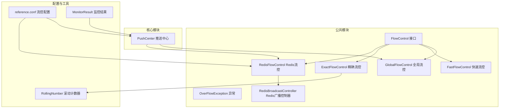
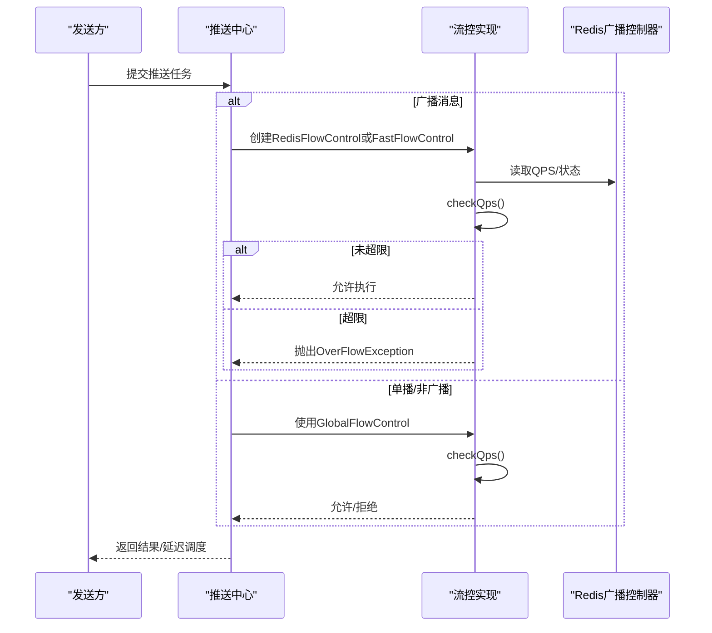
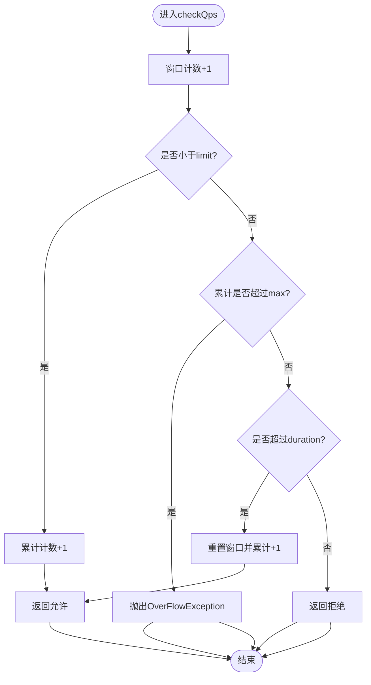
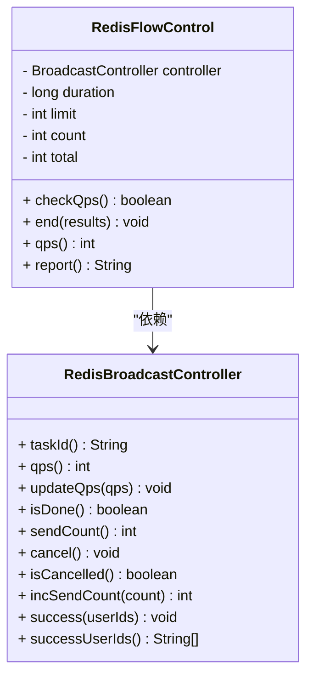
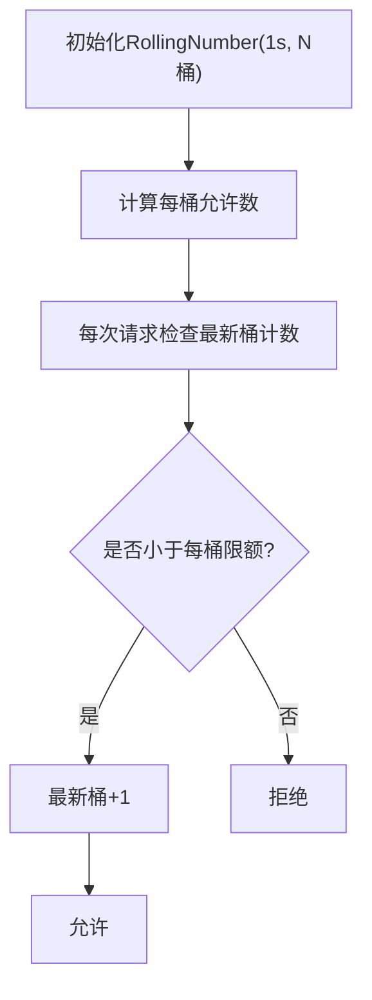
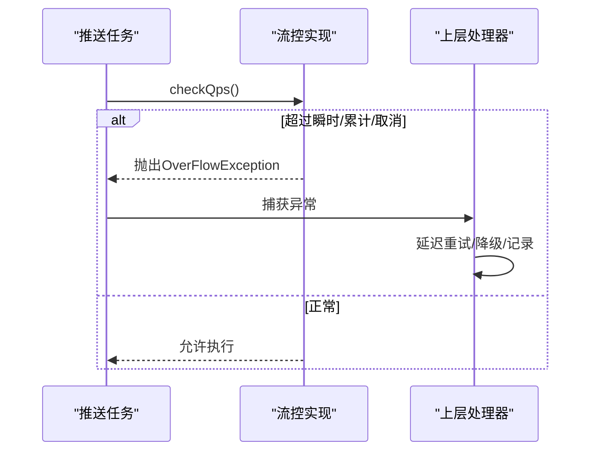
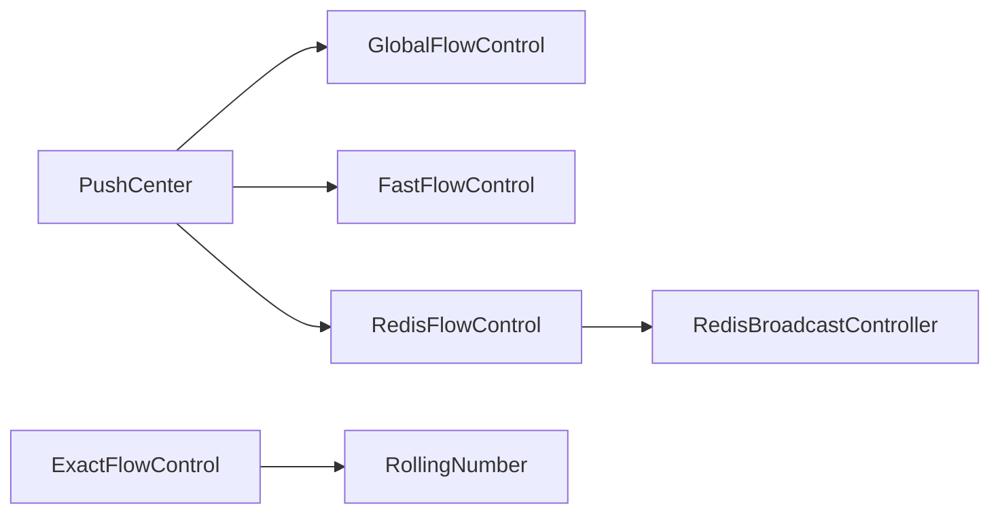

# 流量控制与QPS限制

<cite>
**本文引用的文件**
- [FlowControl.java](file://mpush-common/src/main/java/com/mpush/common/qps/FlowControl.java)
- [GlobalFlowControl.java](file://mpush-common/src/main/java/com/mpush/common/qps/GlobalFlowControl.java)
- [FastFlowControl.java](file://mpush-common/src/main/java/com/mpush/common/qps/FastFlowControl.java)
- [ExactFlowControl.java](file://mpush-common/src/main/java/com/mpush/common/qps/ExactFlowControl.java)
- [RedisFlowControl.java](file://mpush-common/src/main/java/com/mpush/common/qps/RedisFlowControl.java)
- [OverFlowException.java](file://mpush-common/src/main/java/com/mpush/common/qps/OverFlowException.java)
- [RedisBroadcastController.java](file://mpush-common/src/main/java/com/mpush/common/push/RedisBroadcastController.java)
- [BroadcastController.java](file://mpush-api/src/main/java/com/mpush/api/push/BroadcastController.java)
- [PushCenter.java](file://mpush-core/src/main/java/com/mpush/core/push/PushCenter.java)
- [reference.conf](file://conf/reference.conf)
- [RollingNumber.java](file://mpush-tools/src/main/java/com/mpush/tools/common/RollingNumber.java)
- [MonitorResult.java](file://mpush-monitor/src/main/java/com/mpush/monitor/data/MonitorResult.java)
</cite>

## 目录
1. [简介](#简介)
2. [项目结构](#项目结构)
3. [核心组件](#核心组件)
4. [架构总览](#架构总览)
5. [组件详解](#组件详解)
6. [依赖关系分析](#依赖关系分析)
7. [性能考量](#性能考量)
8. [故障排查指南](#故障排查指南)
9. [结论](#结论)
10. [附录](#附录)

## 简介
本指南围绕MPush的流量控制与QPS限制体系，系统性阐述以下内容：
- 全局流控（GlobalFlowControl）的配置参数与调优方法，包括limit、max、duration的设置原则与实践建议
- 广播流控（broadcast flow control）的特殊配置与批量推送优化策略
- 精确流控（ExactFlowControl）与Redis流控（RedisFlowControl）的实现原理与适用场景
- 结合OverFlowException异常处理机制，展示流量超限时的优雅降级策略
- 不同业务场景下的QPS配置建议、峰值预测、平滑限流与突发流量处理方案
- 流量监控指标、性能测试方法与效果评估标准

## 项目结构
MPush的流量控制能力主要分布在公共模块的qps包与核心模块的推送中心。广播流控通过Redis广播控制器与缓存协同，实现跨节点的动态QPS调节。

**图示来源**
- [FlowControl.java](file://mpush-common/src/main/java/com/mpush/common/qps/FlowControl.java#L27-L60)
- [GlobalFlowControl.java](file://mpush-common/src/main/java/com/mpush/common/qps/GlobalFlowControl.java#L30-L91)
- [FastFlowControl.java](file://mpush-common/src/main/java/com/mpush/common/qps/FastFlowControl.java#L29-L92)
- [ExactFlowControl.java](file://mpush-common/src/main/java/com/mpush/common/qps/ExactFlowControl.java#L33-L91)
- [RedisFlowControl.java](file://mpush-common/src/main/java/com/mpush/common/qps/RedisFlowControl.java#L32-L121)
- [OverFlowException.java](file://mpush-common/src/main/java/com/mpush/common/qps/OverFlowException.java#L27-L47)
- [RedisBroadcastController.java](file://mpush-common/src/main/java/com/mpush/common/push/RedisBroadcastController.java#L34-L103)
- [PushCenter.java](file://mpush-core/src/main/java/com/mpush/core/push/PushCenter.java#L74-L82)
- [reference.conf](file://conf/reference.conf#L207-L222)
- [RollingNumber.java](file://mpush-tools/src/main/java/com/mpush/tools/common/RollingNumber.java#L45-L200)
- [MonitorResult.java](file://mpush-monitor/src/main/java/com/mpush/monitor/data/MonitorResult.java#L27-L65)

**章节来源**
- [reference.conf](file://conf/reference.conf#L207-L222)
- [PushCenter.java](file://mpush-core/src/main/java/com/mpush/core/push/PushCenter.java#L74-L82)

## 核心组件
- FlowControl接口：定义checkQps、reset、total、qps、report等统一能力，以及可选的end回调与延迟查询
- GlobalFlowControl：全局维度的简单滑动窗口限流，适合单实例或非广播场景
- FastFlowControl：轻量级滑动窗口，适合广播任务的快速节流
- ExactFlowControl：基于滚动计数器的高精度限流，将1秒细分为若干桶，适合需要更精细配额的场景
- RedisFlowControl：面向广播任务的分布式限流，基于Redis广播控制器动态读取QPS与状态
- OverFlowException：流量超限时的异常载体，区分瞬时超限与累计超限
- RedisBroadcastController：广播任务的Redis状态管理，提供QPS读写、取消、完成标记、成功用户列表等

**章节来源**
- [FlowControl.java](file://mpush-common/src/main/java/com/mpush/common/qps/FlowControl.java#L27-L60)
- [GlobalFlowControl.java](file://mpush-common/src/main/java/com/mpush/common/qps/GlobalFlowControl.java#L30-L91)
- [FastFlowControl.java](file://mpush-common/src/main/java/com/mpush/common/qps/FastFlowControl.java#L29-L92)
- [ExactFlowControl.java](file://mpush-common/src/main/java/com/mpush/common/qps/ExactFlowControl.java#L33-L91)
- [RedisFlowControl.java](file://mpush-common/src/main/java/com/mpush/common/qps/RedisFlowControl.java#L32-L121)
- [OverFlowException.java](file://mpush-common/src/main/java/com/mpush/common/qps/OverFlowException.java#L27-L47)
- [RedisBroadcastController.java](file://mpush-common/src/main/java/com/mpush/common/push/RedisBroadcastController.java#L34-L103)

## 架构总览
MPush在推送中心根据消息类型选择不同的流控策略：
- 广播消息：优先使用RedisFlowControl，若存在任务ID则基于Redis广播控制器动态调整；否则回退到FastFlowControl
- 单播/非广播：使用GlobalFlowControl进行全局限流

**图示来源**
- [PushCenter.java](file://mpush-core/src/main/java/com/mpush/core/push/PushCenter.java#L74-L82)
- [RedisFlowControl.java](file://mpush-common/src/main/java/com/mpush/common/qps/RedisFlowControl.java#L65-L88)
- [GlobalFlowControl.java](file://mpush-common/src/main/java/com/mpush/common/qps/GlobalFlowControl.java#L61-L75)
- [OverFlowException.java](file://mpush-common/src/main/java/com/mpush/common/qps/OverFlowException.java#L27-L47)

## 组件详解

### 全局流控（GlobalFlowControl）
- 参数与含义
  - limit：时间窗口内的请求数阈值
  - max：累计请求总量上限，超过触发异常
  - duration：时间窗口（毫秒），默认1秒
- 工作机制
  - 使用原子计数统计窗口内请求数与累计总数
  - 当窗口过期时重置计数并保留累计计数
  - 超过max时抛出OverFlowException
- 配置建议
  - limit应结合服务器CPU、内存、带宽与下游依赖服务的承载能力估算
  - max用于兜底保护，避免雪崩扩大
  - duration越短响应越快但波动越大，建议默认1秒
- 适用场景
  - 单实例或非广播场景
  - 对延迟敏感且不需要跨节点协调的限流

**图示来源**
- [GlobalFlowControl.java](file://mpush-common/src/main/java/com/mpush/common/qps/GlobalFlowControl.java#L61-L75)

**章节来源**
- [GlobalFlowControl.java](file://mpush-common/src/main/java/com/mpush/common/qps/GlobalFlowControl.java#L30-L91)
- [reference.conf](file://conf/reference.conf#L209-L214)

### 广播流控（Broadcast Flow Control）
- 特殊配置
  - broadcast.limit/broadcast.max/broadcast.duration在配置文件中独立设置
  - 广播任务可携带taskId，使用RedisFlowControl进行分布式限流
- 实现要点
  - RedisFlowControl从Redis广播控制器读取当前QPS与任务状态
  - 支持动态更新QPS、任务取消、完成标记与成功用户记录
  - end回调用于上报发送计数与成功用户列表
- 性能优化
  - 将QPS拆分为每秒若干桶，降低热点竞争
  - 使用Redis原子操作维护发送计数与状态
  - 通过任务标识实现跨节点一致的限流策略

**图示来源**
- [RedisFlowControl.java](file://mpush-common/src/main/java/com/mpush/common/qps/RedisFlowControl.java#L32-L121)
- [RedisBroadcastController.java](file://mpush-common/src/main/java/com/mpush/common/push/RedisBroadcastController.java#L34-L103)
- [BroadcastController.java](file://mpush-api/src/main/java/com/mpush/api/push/BroadcastController.java#L29-L51)

**章节来源**
- [RedisFlowControl.java](file://mpush-common/src/main/java/com/mpush/common/qps/RedisFlowControl.java#L32-L121)
- [RedisBroadcastController.java](file://mpush-common/src/main/java/com/mpush/common/push/RedisBroadcastController.java#L34-L103)
- [reference.conf](file://conf/reference.conf#L216-L221)

### 精确流控（ExactFlowControl）
- 实现原理
  - 基于RollingNumber将1秒划分为多个桶（默认100桶，每桶10ms）
  - 计算每桶允许的事件数，确保瞬时QPS平滑
- 适用场景
  - 对瞬时峰值有严格要求的场景
  - 需要更细粒度配额分配的业务
- 注意事项
  - 桶数越多，内存占用越高
  - QPS低于一定阈值时会自动合并桶，避免过度开销

**图示来源**
- [ExactFlowControl.java](file://mpush-common/src/main/java/com/mpush/common/qps/ExactFlowControl.java#L33-L91)
- [RollingNumber.java](file://mpush-tools/src/main/java/com/mpush/tools/common/RollingNumber.java#L45-L200)

**章节来源**
- [ExactFlowControl.java](file://mpush-common/src/main/java/com/mpush/common/qps/ExactFlowControl.java#L33-L91)
- [RollingNumber.java](file://mpush-tools/src/main/java/com/mpush/tools/common/RollingNumber.java#L45-L200)

### Redis流控（RedisFlowControl）
- 与广播流控的关系
  - 面向广播任务的分布式限流
  - 动态读取QPS，支持任务取消与完成状态
- 关键行为
  - 超过窗口或累计上限时抛出OverFlowException
  - end回调上报发送计数与成功用户列表
- 与配置的衔接
  - 通过taskId关联Redis广播控制器
  - QPS与maxLimit来自配置或运行时更新

**章节来源**
- [RedisFlowControl.java](file://mpush-common/src/main/java/com/mpush/common/qps/RedisFlowControl.java#L32-L121)
- [RedisBroadcastController.java](file://mpush-common/src/main/java/com/mpush/common/push/RedisBroadcastController.java#L34-L103)
- [reference.conf](file://conf/reference.conf#L216-L221)

### 异常处理与优雅降级（OverFlowException）
- 触发条件
  - 瞬时超限：checkQps返回false
  - 累计超限：total超过maxLimit
  - 任务取消：Redis广播控制器标记取消
- 处理策略
  - 上层捕获OverFlowException，进行延迟重试或降级处理
  - 对广播任务，可减少QPS或暂停任务
  - 对单播任务，可回退到队列排队或丢弃低优先级消息

**图示来源**
- [OverFlowException.java](file://mpush-common/src/main/java/com/mpush/common/qps/OverFlowException.java#L27-L47)
- [RedisFlowControl.java](file://mpush-common/src/main/java/com/mpush/common/qps/RedisFlowControl.java#L65-L88)
- [GlobalFlowControl.java](file://mpush-common/src/main/java/com/mpush/common/qps/GlobalFlowControl.java#L61-L75)

**章节来源**
- [OverFlowException.java](file://mpush-common/src/main/java/com/mpush/common/qps/OverFlowException.java#L27-L47)
- [RedisFlowControl.java](file://mpush-common/src/main/java/com/mpush/common/qps/RedisFlowControl.java#L65-L88)
- [GlobalFlowControl.java](file://mpush-common/src/main/java/com/mpush/common/qps/GlobalFlowControl.java#L61-L75)

## 依赖关系分析
- PushCenter根据消息类型选择流控实现，广播任务优先使用RedisFlowControl
- RedisFlowControl依赖Redis广播控制器进行状态同步
- ExactFlowControl依赖RollingNumber实现高精度限流
- 所有流控实现遵循FlowControl接口，便于替换与扩展

**图示来源**
- [PushCenter.java](file://mpush-core/src/main/java/com/mpush/core/push/PushCenter.java#L74-L82)
- [RedisFlowControl.java](file://mpush-common/src/main/java/com/mpush/common/qps/RedisFlowControl.java#L32-L121)
- [RedisBroadcastController.java](file://mpush-common/src/main/java/com/mpush/common/push/RedisBroadcastController.java#L34-L103)
- [ExactFlowControl.java](file://mpush-common/src/main/java/com/mpush/common/qps/ExactFlowControl.java#L33-L91)
- [RollingNumber.java](file://mpush-tools/src/main/java/com/mpush/tools/common/RollingNumber.java#L45-L200)

**章节来源**
- [PushCenter.java](file://mpush-core/src/main/java/com/mpush/core/push/PushCenter.java#L74-L82)
- [RedisFlowControl.java](file://mpush-common/src/main/java/com/mpush/common/qps/RedisFlowControl.java#L32-L121)
- [ExactFlowControl.java](file://mpush-common/src/main/java/com/mpush/common/qps/ExactFlowControl.java#L33-L91)

## 性能考量
- 时间窗口与精度
  - GlobalFlowControl/FastFlowControl：1秒窗口，适合大多数实时推送
  - ExactFlowControl：10ms桶粒度，适合对瞬时峰值敏感的场景
- 内存与CPU
  - ExactFlowControl桶数越多，内存占用越高；建议根据QPS与资源情况权衡
  - RedisFlowControl依赖Redis原子操作，注意网络延迟与键空间大小
- 并发模型
  - GlobalFlowControl使用原子计数，适合高并发场景
  - RedisFlowControl通过任务ID实现分布式一致性，适合多实例广播

[本节为通用性能建议，无需具体文件引用]

## 故障排查指南
- 常见问题
  - 流量超限：检查limit/max/duration配置与实际负载
  - 广播任务异常：确认Redis广播控制器状态、QPS更新与任务取消标志
  - 瞬时抖动：考虑切换到ExactFlowControl或增大窗口
- 排查步骤
  - 查看流控报告（report）输出，定位累计与瞬时指标
  - 监控平均QPS与瞬时QPS差异，判断是否需要更细粒度限流
  - 检查异常堆栈中的OverFlowException来源与触发条件
- 降级策略
  - 临时提高或降低QPS（通过Redis广播控制器）
  - 延迟重试与队列排队
  - 降级为更低优先级的消息或关闭非关键推送

**章节来源**
- [GlobalFlowControl.java](file://mpush-common/src/main/java/com/mpush/common/qps/GlobalFlowControl.java#L87-L90)
- [ExactFlowControl.java](file://mpush-common/src/main/java/com/mpush/common/qps/ExactFlowControl.java#L85-L90)
- [RedisFlowControl.java](file://mpush-common/src/main/java/com/mpush/common/qps/RedisFlowControl.java#L109-L116)
- [OverFlowException.java](file://mpush-common/src/main/java/com/mpush/common/qps/OverFlowException.java#L27-L47)

## 结论
MPush提供了从单机到分布式、从粗粒度到精细化的完整流量控制方案。通过合理配置全局与广播流控参数、结合Redis广播控制器与滚动计数器，可以在保证系统稳定性的前提下，满足不同业务场景下的QPS目标与突发流量需求。配合完善的监控与异常处理机制，能够实现平滑的限流与优雅的降级。

[本节为总结性内容，无需具体文件引用]

## 附录

### QPS配置建议与调优方法
- 峰值流量预测
  - 基于历史峰值与增长趋势，预留20%-50%安全余量
  - 对广播任务，结合用户规模与活跃度估算并发
- 平滑限流算法
  - 使用ExactFlowControl的细粒度桶，降低瞬时尖峰
  - 合理设置窗口长度与桶数，在精度与资源间平衡
- 突发流量处理
  - 为广播任务配置更高的max（累计上限），避免一次性超限
  - 动态调整QPS（Redis广播控制器），逐步拉平流量曲线
- 配置参考
  - 全局流控：limit=5000，max=不限或按容量设定，duration=1s
  - 广播流控：limit=3000，max=100000，duration=1s

**章节来源**
- [reference.conf](file://conf/reference.conf#L209-L221)
- [ExactFlowControl.java](file://mpush-common/src/main/java/com/mpush/common/qps/ExactFlowControl.java#L39-L54)

### 流量监控指标与评估标准
- 指标
  - 瞬时QPS：checkQps返回前后的窗口内请求数
  - 平均QPS：自启动以来的累计请求数/运行时间
  - 累计请求数：total
  - 延迟时间：getDelay（纳秒）
- 输出
  - report字符串包含total/count/qps等关键指标
  - 监控系统可采集上述指标并生成可视化报表
- 评估标准
  - 瞬时QPS不超过limit
  - 平均QPS稳定在目标值附近
  - 超限次数与异常率维持在可接受范围

**章节来源**
- [GlobalFlowControl.java](file://mpush-common/src/main/java/com/mpush/common/qps/GlobalFlowControl.java#L77-L90)
- [FastFlowControl.java](file://mpush-common/src/main/java/com/mpush/common/qps/FastFlowControl.java#L78-L86)
- [ExactFlowControl.java](file://mpush-common/src/main/java/com/mpush/common/qps/ExactFlowControl.java#L85-L90)
- [RedisFlowControl.java](file://mpush-common/src/main/java/com/mpush/common/qps/RedisFlowControl.java#L103-L116)
- [MonitorResult.java](file://mpush-monitor/src/main/java/com/mpush/monitor/data/MonitorResult.java#L27-L65)