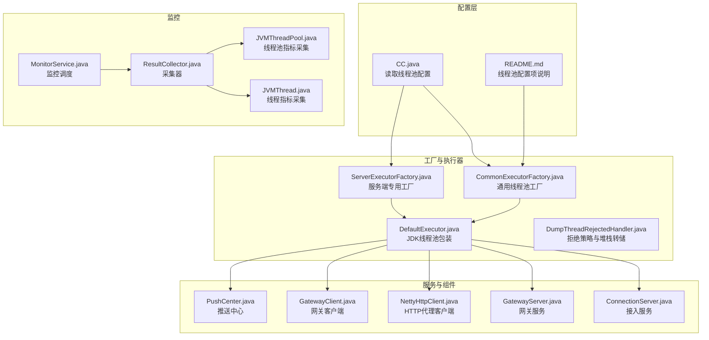
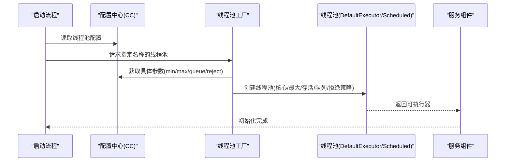
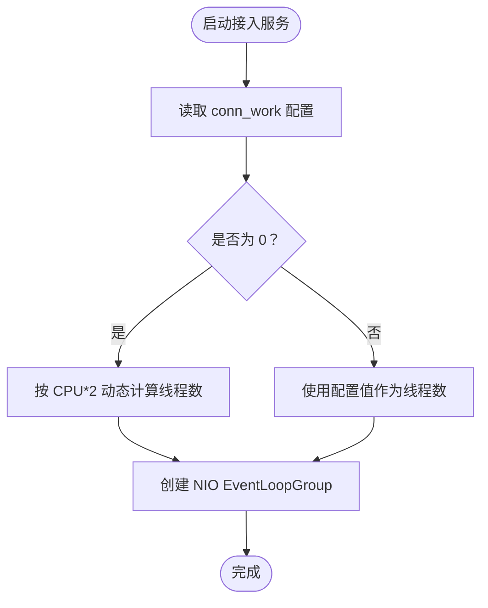
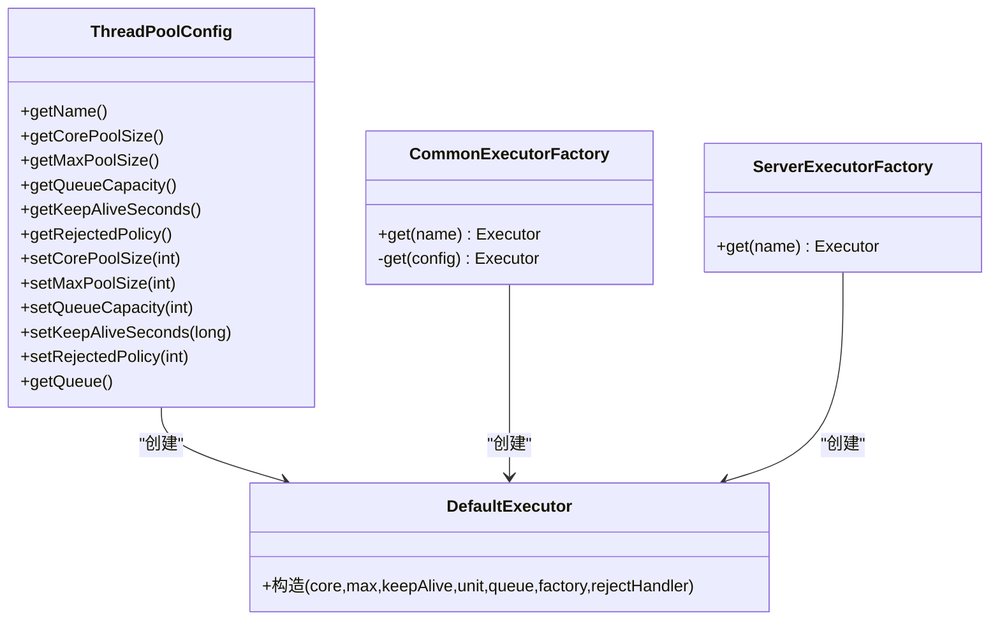
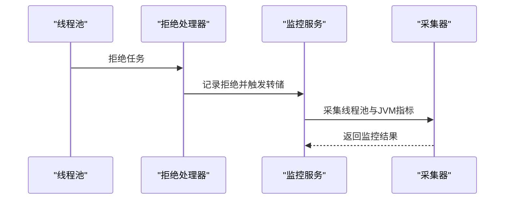
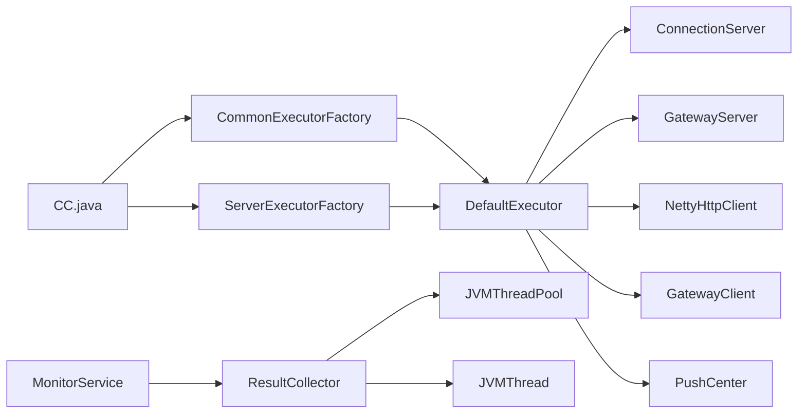

# 线程池优化

<cite>
**本文引用的文件**
- [DefaultExecutor.java](file://mpush-tools/src/main/java/com/mpush/tools/thread/pool/DefaultExecutor.java)
- [ThreadPoolConfig.java](file://mpush-tools/src/main/java/com/mpush/tools/thread/pool/ThreadPoolConfig.java)
- [DumpThreadRejectedHandler.java](file://mpush-tools/src/main/java/com/mpush/tools/thread/pool/DumpThreadRejectedHandler.java)
- [CommonExecutorFactory.java](file://mpush-common/src/main/java/com/mpush/common/CommonExecutorFactory.java)
- [ServerExecutorFactory.java](file://mpush-core/src/main/java/com/mpush/core/ServerExecutorFactory.java)
- [NettyHttpClient.java](file://mpush-netty/src/main/java/com/mpush/netty/http/NettyHttpClient.java)
- [GatewayServer.java](file://mpush-core/src/main/java/com/mpush/core/server/GatewayServer.java)
- [ConnectionServer.java](file://mpush-core/src/main/java/com/mpush/core/server/ConnectionServer.java)
- [GatewayClient.java](file://mpush-client/src/main/java/com/mpush/client/gateway/GatewayClient.java)
- [PushCenter.java](file://mpush-core/src/main/java/com/mpush/core/push/PushCenter.java)
- [CC.java](file://mpush-tools/src/main/java/com/mpush/tools/config/CC.java)
- [README.md](file://README.md)
- [MonitorService.java](file://mpush-monitor/src/main/java/com/mpush/monitor/service/MonitorService.java)
- [ResultCollector.java](file://mpush-monitor/src/main/java/com/mpush/monitor/data/ResultCollector.java)
- [JVMThreadPool.java](file://mpush-monitor/src/main/java/com/mpush/monitor/quota/impl/JVMThreadPool.java)
- [JVMThread.java](file://mpush-monitor/src/main/java/com/mpush/monitor/quota/impl/JVMThread.java)
- [ThreadPoolQuota.java](file://mpush-monitor/src/main/java/com/mpush/monitor/quota/ThreadPoolQuota.java)
- [Monitor.java](file://mpush-api/src/main/java/com/mpush/api/common/Monitor.java)
</cite>

## 目录
1. [简介](#简介)
2. [项目结构](#项目结构)
3. [核心组件](#核心组件)
4. [架构总览](#架构总览)
5. [详细组件分析](#详细组件分析)
6. [依赖关系分析](#依赖关系分析)
7. [性能考量](#性能考量)
8. [故障排查指南](#故障排查指南)
9. [结论](#结论)
10. [附录](#附录)

## 简介
本技术文档围绕 MPush 的线程池优化展开，系统性阐述各类线程池的作用、配置原理与调优策略，重点覆盖以下线程池：
- 接入服务线程池（conn-work）
- 网关服务线程池（gateway-server-work）
- HTTP 代理线程池（http-work）
- ACK 定时器线程池（ack-timer）
- 推送任务线程池（push-task）
- 网关客户端线程池（gateway-client-work）
- 推送客户端线程池（push-client）

文档同时说明如何基于 CPU 核心数动态调整线程数量（2×CPU），并结合 DefaultExecutor 与 ThreadPoolConfig 的实现，展示线程池的创建、管理与监控机制；最后提供不同负载场景下的调优建议与性能测试方法。

## 项目结构
MPush 将线程池相关能力分布在工具层、通用层、核心层、网络层、监控层与客户端层，形成“配置—工厂—执行器—监控”的完整闭环。

图示来源
- [CC.java](file://mpush-tools/src/main/java/com/mpush/tools/config/CC.java#L210-L244)
- [CommonExecutorFactory.java](file://mpush-common/src/main/java/com/mpush/common/CommonExecutorFactory.java#L46-L97)
- [ServerExecutorFactory.java](file://mpush-core/src/main/java/com/mpush/core/ServerExecutorFactory.java#L42-L77)
- [DefaultExecutor.java](file://mpush-tools/src/main/java/com/mpush/tools/thread/pool/DefaultExecutor.java#L28-L38)
- [DumpThreadRejectedHandler.java](file://mpush-tools/src/main/java/com/mpush/tools/thread/pool/DumpThreadRejectedHandler.java#L35-L74)
- [ConnectionServer.java](file://mpush-core/src/main/java/com/mpush/core/server/ConnectionServer.java#L117-L119)
- [GatewayServer.java](file://mpush-core/src/main/java/com/mpush/core/server/GatewayServer.java#L116-L118)
- [NettyHttpClient.java](file://mpush-netty/src/main/java/com/mpush/netty/http/NettyHttpClient.java#L120-L120)
- [GatewayClient.java](file://mpush-client/src/main/java/com/mpush/client/gateway/GatewayClient.java#L123-L125)
- [PushCenter.java](file://mpush-core/src/main/java/com/mpush/core/push/PushCenter.java#L130-L145)
- [MonitorService.java](file://mpush-monitor/src/main/java/com/mpush/monitor/service/MonitorService.java#L64-L146)
- [ResultCollector.java](file://mpush-monitor/src/main/java/com/mpush/monitor/data/ResultCollector.java#L30-L74)
- [JVMThreadPool.java](file://mpush-monitor/src/main/java/com/mpush/monitor/quota/impl/JVMThreadPool.java#L34-L55)
- [JVMThread.java](file://mpush-monitor/src/main/java/com/mpush/monitor/quota/impl/JVMThread.java#L29-L74)

章节来源
- [CC.java](file://mpush-tools/src/main/java/com/mpush/tools/config/CC.java#L210-L244)
- [README.md](file://README.md#L268-L291)

## 核心组件
- DefaultExecutor：对 JDK ThreadPoolExecutor 的轻量封装，统一线程池行为。
- ThreadPoolConfig：线程池配置模型，支持固定大小、缓存型、队列容量与拒绝策略配置。
- DumpThreadRejectedHandler：线程池拒绝策略处理器，记录拒绝信息并触发 JVM 堆栈转储。
- CommonExecutorFactory：通用线程池工厂，负责按名称构建不同类型的线程池。
- ServerExecutorFactory：服务端专用工厂，扩展 MQ、推送任务、ACK 定时器等线程池。
- 各服务组件：接入服务、网关服务、HTTP 代理客户端、网关客户端、推送中心均通过配置驱动线程池大小。

章节来源
- [DefaultExecutor.java](file://mpush-tools/src/main/java/com/mpush/tools/thread/pool/DefaultExecutor.java#L28-L38)
- [ThreadPoolConfig.java](file://mpush-tools/src/main/java/com/mpush/tools/thread/pool/ThreadPoolConfig.java#L26-L135)
- [DumpThreadRejectedHandler.java](file://mpush-tools/src/main/java/com/mpush/tools/thread/pool/DumpThreadRejectedHandler.java#L35-L74)
- [CommonExecutorFactory.java](file://mpush-common/src/main/java/com/mpush/common/CommonExecutorFactory.java#L46-L97)
- [ServerExecutorFactory.java](file://mpush-core/src/main/java/com/mpush/core/ServerExecutorFactory.java#L42-L77)

## 架构总览
线程池配置通过 CC.java 读取，CommonExecutorFactory/ServerExecutorFactory 根据名称选择配置并创建线程池；服务组件在启动阶段读取配置并初始化相应线程池；监控模块周期性采集线程池与 JVM 指标，辅助诊断与调优。

图示来源
- [CC.java](file://mpush-tools/src/main/java/com/mpush/tools/config/CC.java#L210-L244)
- [CommonExecutorFactory.java](file://mpush-common/src/main/java/com/mpush/common/CommonExecutorFactory.java#L63-L96)
- [ServerExecutorFactory.java](file://mpush-core/src/main/java/com/mpush/core/ServerExecutorFactory.java#L44-L76)
- [DefaultExecutor.java](file://mpush-tools/src/main/java/com/mpush/tools/thread/pool/DefaultExecutor.java#L28-L38)

## 详细组件分析

### 接入服务线程池（conn-work）
- 作用：处理长连接接入请求，承载客户端握手、心跳、消息编解码与路由分发。
- 配置：通过 CC.mp.thread.pool.conn_work 读取；当为 0 时采用动态策略（见“动态调整”）。
- 实现：ConnectionServer 在启动时读取线程数并初始化 workerGroup。

图示来源
- [ConnectionServer.java](file://mpush-core/src/main/java/com/mpush/core/server/ConnectionServer.java#L117-L119)
- [CC.java](file://mpush-tools/src/main/java/com/mpush/tools/config/CC.java#L218-L218)

章节来源
- [ConnectionServer.java](file://mpush-core/src/main/java/com/mpush/core/server/ConnectionServer.java#L117-L119)
- [CC.java](file://mpush-tools/src/main/java/com/mpush/tools/config/CC.java#L218-L218)

### 网关服务线程池（gateway-server-work）
- 作用：处理来自客户端的下行消息、推送与网关内事件。
- 配置：CC.mp.thread.pool.gateway_server_work；0 表示动态（2×CPU）。
- 实现：GatewayServer 在启动时读取线程数并初始化 workerGroup。

章节来源
- [GatewayServer.java](file://mpush-core/src/main/java/com/mpush/core/server/GatewayServer.java#L116-L118)
- [CC.java](file://mpush-tools/src/main/java/com/mpush/tools/config/CC.java#L223-L223)

### HTTP 代理线程池（http-work）
- 作用：HTTP 代理客户端的 IO 工作线程池，用于与上游 HTTP 服务通信。
- 配置：CC.mp.thread.pool.http_work；0 表示动态（2×CPU）。
- 实现：NettyHttpClient 在启动时以 http_work 创建 NioEventLoopGroup。

章节来源
- [NettyHttpClient.java](file://mpush-netty/src/main/java/com/mpush/netty/http/NettyHttpClient.java#L120-L120)
- [CC.java](file://mpush-tools/src/main/java/com/mpush/tools/config/CC.java#L219-L219)

### ACK 定时器线程池（ack-timer）
- 作用：处理推送 ACK 超时与清理逻辑，保证消息可靠投递。
- 配置：CC.mp.thread.pool.ack_timer；固定大小的 ScheduledThreadPoolExecutor。
- 实现：ServerExecutorFactory 使用 ScheduledThreadPoolExecutor 并设置取消任务移除策略。

章节来源
- [ServerExecutorFactory.java](file://mpush-core/src/main/java/com/mpush/core/ServerExecutorFactory.java#L63-L69)
- [CC.java](file://mpush-tools/src/main/java/com/mpush/tools/config/CC.java#L222-L222)

### 推送任务线程池（push-task）
- 作用：推送中心的任务调度与执行，支持延迟与周期性任务。
- 配置：CC.mp.thread.pool.push_task；0 表示复用网关服务 work 线程池（TCP 下推荐）。
- 实现：ServerExecutorFactory 创建 ScheduledThreadPoolExecutor，并设置拒绝策略抛出推送异常。

章节来源
- [ServerExecutorFactory.java](file://mpush-core/src/main/java/com/mpush/core/ServerExecutorFactory.java#L57-L62)
- [CC.java](file://mpush-tools/src/main/java/com/mpush/tools/config/CC.java#L220-L220)

### 网关客户端线程池（gateway-client-work）
- 作用：客户端侧的网关连接与消息处理线程池。
- 配置：CC.mp.thread.pool.gateway_client_work；0 表示动态（2×CPU）。
- 实现：GatewayClient 在启动时读取线程数并初始化 workerGroup。

章节来源
- [GatewayClient.java](file://mpush-client/src/main/java/com/mpush/client/gateway/GatewayClient.java#L123-L125)
- [CC.java](file://mpush-tools/src/main/java/com/mpush/tools/config/CC.java#L224-L224)

### 推送客户端线程池（push-client）
- 作用：客户端侧的推送回调处理线程池。
- 配置：CC.mp.thread.pool.push_client；固定大小的 ScheduledThreadPoolExecutor。
- 实现：CommonExecutorFactory 创建 ScheduledThreadPoolExecutor 并设置取消任务移除策略。

章节来源
- [CommonExecutorFactory.java](file://mpush-common/src/main/java/com/mpush/common/CommonExecutorFactory.java#L76-L82)
- [CC.java](file://mpush-tools/src/main/java/com/mpush/tools/config/CC.java#L221-L221)

### 线程池创建与管理（DefaultExecutor 与 ThreadPoolConfig）
- ThreadPoolConfig：提供核心线程数、最大线程数、队列容量、存活时间与拒绝策略配置；支持 SynchronousQueue、有界 LinkedBlockingQueue 与无界 LinkedBlockingQueue。
- DefaultExecutor：对 ThreadPoolExecutor 的简单封装，便于统一管理与扩展。
- CommonExecutorFactory/ServerExecutorFactory：按名称构建线程池，注入命名线程工厂与拒绝处理器。

图示来源
- [ThreadPoolConfig.java](file://mpush-tools/src/main/java/com/mpush/tools/thread/pool/ThreadPoolConfig.java#L26-L135)
- [DefaultExecutor.java](file://mpush-tools/src/main/java/com/mpush/tools/thread/pool/DefaultExecutor.java#L28-L38)
- [CommonExecutorFactory.java](file://mpush-common/src/main/java/com/mpush/common/CommonExecutorFactory.java#L46-L97)
- [ServerExecutorFactory.java](file://mpush-core/src/main/java/com/mpush/core/ServerExecutorFactory.java#L42-L77)

### 线程池监控与拒绝处理
- DumpThreadRejectedHandler：当任务被拒绝时记录日志并触发 JVM 堆栈转储，支持 ABORT/CALLER_RUNS 等策略。
- JVMThreadPool/JVMThread：监控线程池与线程指标，供 MonitorService/ResultCollector 采集。
- MonitorService：周期性采集并输出监控结果，必要时触发堆栈/堆转储。

图示来源
- [DumpThreadRejectedHandler.java](file://mpush-tools/src/main/java/com/mpush/tools/thread/pool/DumpThreadRejectedHandler.java#L52-L74)
- [MonitorService.java](file://mpush-monitor/src/main/java/com/mpush/monitor/service/MonitorService.java#L64-L146)
- [ResultCollector.java](file://mpush-monitor/src/main/java/com/mpush/monitor/data/ResultCollector.java#L30-L74)
- [JVMThreadPool.java](file://mpush-monitor/src/main/java/com/mpush/monitor/quota/impl/JVMThreadPool.java#L34-L55)
- [JVMThread.java](file://mpush-monitor/src/main/java/com/mpush/monitor/quota/impl/JVMThread.java#L29-L74)

## 依赖关系分析
- 配置依赖：各服务组件通过 CC.java 读取线程池配置，确保配置集中管理与热更新。
- 工厂依赖：CommonExecutorFactory/ServerExecutorFactory 统一创建线程池，避免重复配置与不一致。
- 执行器依赖：DefaultExecutor 提供统一接口，便于替换与扩展。
- 监控依赖：MonitorService/ResultCollector 依赖 JVMThreadPool/JVMThread 采集指标，形成闭环。

图示来源
- [CC.java](file://mpush-tools/src/main/java/com/mpush/tools/config/CC.java#L210-L244)
- [CommonExecutorFactory.java](file://mpush-common/src/main/java/com/mpush/common/CommonExecutorFactory.java#L46-L97)
- [ServerExecutorFactory.java](file://mpush-core/src/main/java/com/mpush/core/ServerExecutorFactory.java#L42-L77)
- [DefaultExecutor.java](file://mpush-tools/src/main/java/com/mpush/tools/thread/pool/DefaultExecutor.java#L28-L38)
- [ConnectionServer.java](file://mpush-core/src/main/java/com/mpush/core/server/ConnectionServer.java#L117-L119)
- [GatewayServer.java](file://mpush-core/src/main/java/com/mpush/core/server/GatewayServer.java#L116-L118)
- [NettyHttpClient.java](file://mpush-netty/src/main/java/com/mpush/netty/http/NettyHttpClient.java#L120-L120)
- [GatewayClient.java](file://mpush-client/src/main/java/com/mpush/client/gateway/GatewayClient.java#L123-L125)
- [PushCenter.java](file://mpush-core/src/main/java/com/mpush/core/push/PushCenter.java#L130-L145)
- [MonitorService.java](file://mpush-monitor/src/main/java/com/mpush/monitor/service/MonitorService.java#L64-L146)
- [ResultCollector.java](file://mpush-monitor/src/main/java/com/mpush/monitor/data/ResultCollector.java#L30-L74)
- [JVMThreadPool.java](file://mpush-monitor/src/main/java/com/mpush/monitor/quota/impl/JVMThreadPool.java#L34-L55)
- [JVMThread.java](file://mpush-monitor/src/main/java/com/mpush/monitor/quota/impl/JVMThread.java#L29-L74)

## 性能考量
- 动态线程数策略（2×CPU）：当配置为 0 时，建议按 CPU 核心数乘以 2 来估算最优线程数，兼顾 IO 密集与 CPU 利用率。
- 队列容量与拒绝策略：
  - SynchronousQueue：适合强实时性场景，无缓冲，高拒绝风险。
  - 有界 LinkedBlockingQueue：平衡吞吐与内存占用，需配合合适的拒绝策略。
  - 无界 LinkedBlockingQueue：高吞吐但易内存膨胀，谨慎使用。
- 活跃时间与回收：合理设置 keepAliveSeconds，避免空闲线程过多占用资源。
- 监控与告警：通过 MonitorService/ResultCollector 采集线程池与 JVM 指标，结合拒绝次数、队列长度与线程数变化进行预警。

## 故障排查指南
- 拒绝任务定位：查看 DumpThreadRejectedHandler 日志，确认拒绝策略与当前线程池状态；必要时触发 JVM 堆栈转储以分析热点。
- 线程池指标：通过 JVMThreadPool/JVMThread 采集器查看活跃线程、队列长度、拒绝计数等关键指标。
- 监控输出：MonitorService 周期性输出 JSON 结构的监控结果，便于集成到外部监控系统。

章节来源
- [DumpThreadRejectedHandler.java](file://mpush-tools/src/main/java/com/mpush/tools/thread/pool/DumpThreadRejectedHandler.java#L52-L74)
- [MonitorService.java](file://mpush-monitor/src/main/java/com/mpush/monitor/service/MonitorService.java#L64-L146)
- [ResultCollector.java](file://mpush-monitor/src/main/java/com/mpush/monitor/data/ResultCollector.java#L30-L74)
- [JVMThreadPool.java](file://mpush-monitor/src/main/java/com/mpush/monitor/quota/impl/JVMThreadPool.java#L34-L55)
- [JVMThread.java](file://mpush-monitor/src/main/java/com/mpush/monitor/quota/impl/JVMThread.java#L29-L74)

## 结论
MPush 的线程池体系通过“配置—工厂—执行器—监控”四层协同，实现了灵活、可观测且可调优的线程池管理。接入、网关、HTTP 代理、ACK 定时器、推送任务、网关客户端与推送客户端七大线程池均可按需配置或动态调整；结合拒绝处理与监控采集，能够在高并发场景下稳定运行并快速定位性能瓶颈。

## 附录
- 不同负载场景下的调优建议
  - 低并发：优先使用较小的核心线程数与有界队列，降低内存占用。
  - 中高并发：按 2×CPU 动态调整线程数，配合 CallerRuns 或 Discard 拒绝策略，保障稳定性。
  - 高延迟上游：适当增大队列容量与最大线程数，但需关注内存与 GC 压力。
- 性能测试方法
  - 压力测试：使用压测工具模拟不同 QPS 与并发连接数，观察线程池拒绝率、平均响应时间与错误率。
  - 指标观测：结合 MonitorService 输出与 JVM 指标，评估 CPU、内存、线程数与队列长度的变化趋势。
  - 热点分析：在出现拒绝或延迟上升时，结合拒绝处理器触发的堆栈转储进行热点定位。