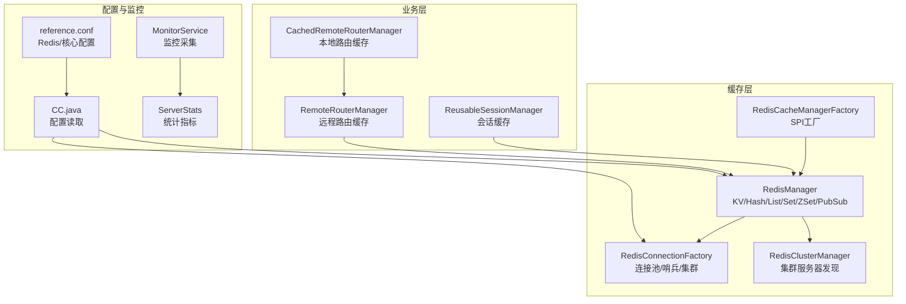
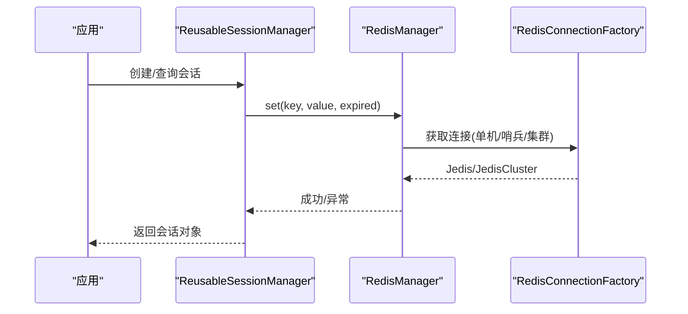
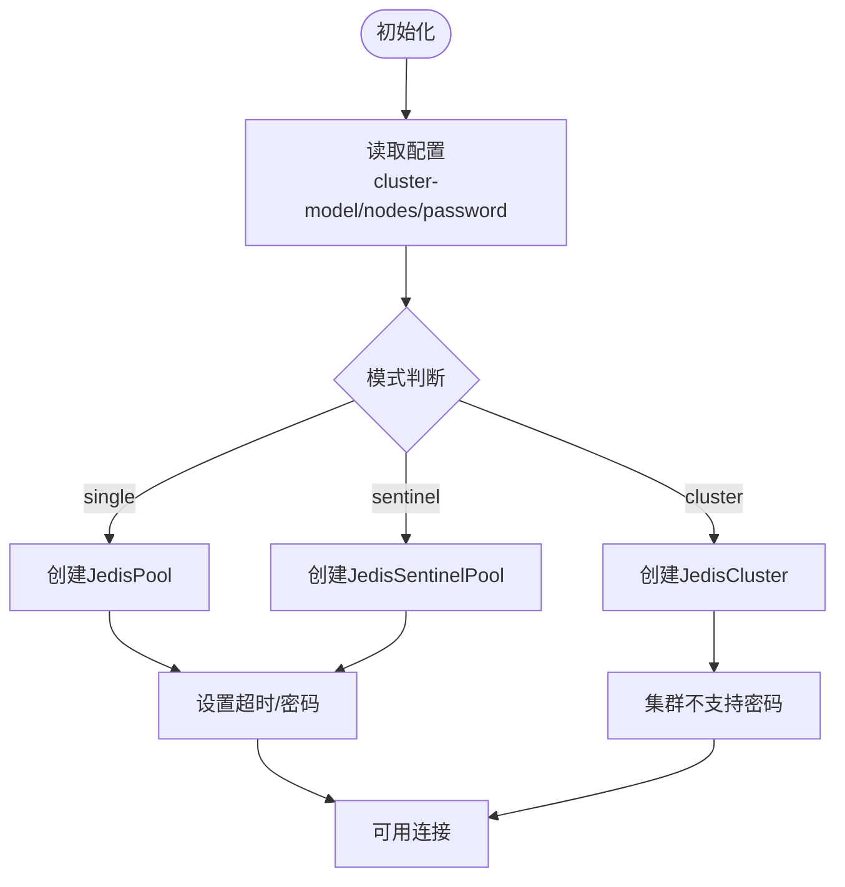
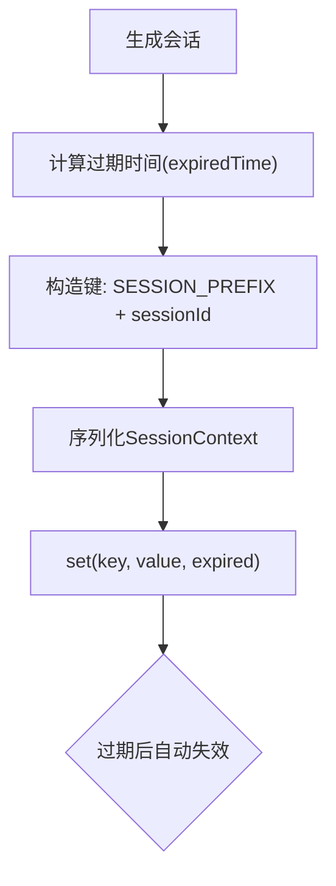
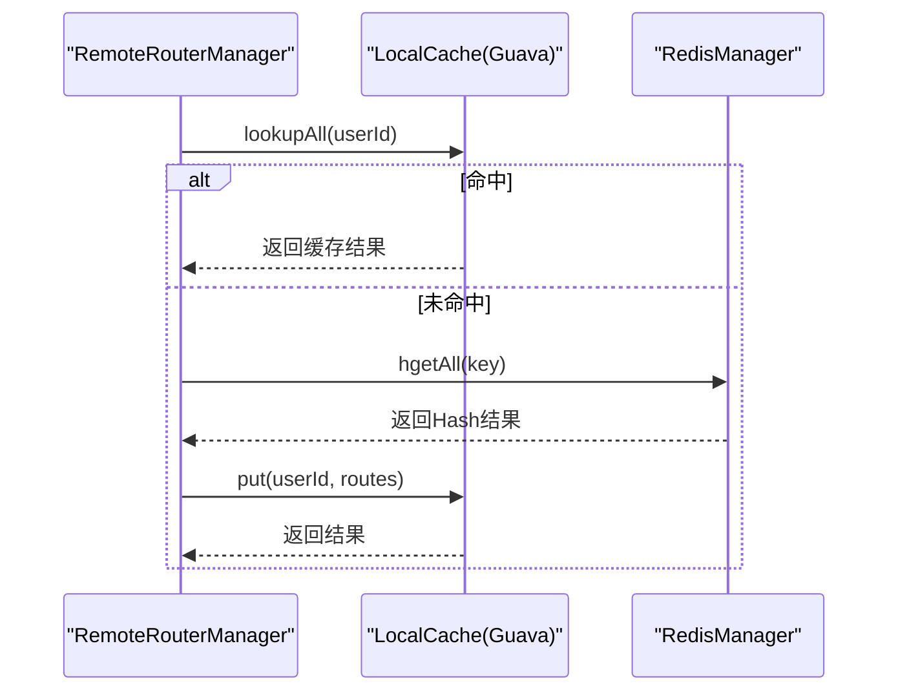
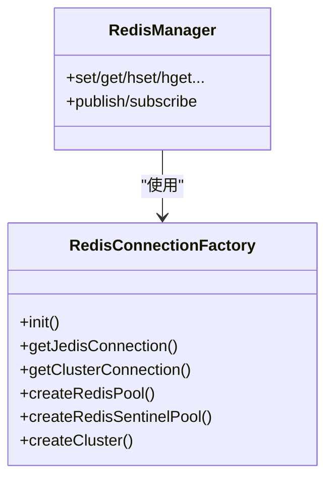
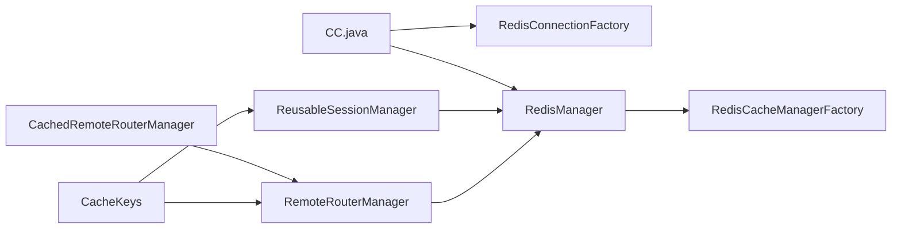

# 缓存策略优化

<cite>
**本文引用的文件**   
- [RedisManager.java](file://mpush-cache/src/main/java/com/mpush/cache/redis/manager/RedisManager.java)
- [RedisConnectionFactory.java](file://mpush-cache/src/main/java/com/mpush/cache/redis/connection/RedisConnectionFactory.java)
- [RedisClusterManager.java](file://mpush-cache/src/main/java/com/mpush/cache/redis/manager/RedisClusterManager.java)
- [RedisCacheManagerFactory.java](file://mpush-cache/src/main/java/com/mpush/cache/redis/manager/RedisCacheManagerFactory.java)
- [RedisServer.java](file://mpush-cache/src/main/java/com/mpush/cache/redis/RedisServer.java)
- [reference.conf](file://conf/reference.conf)
- [CC.java](file://mpush-tools/src/main/java/com/mpush/tools/config/CC.java)
- [RedisNode.java](file://mpush-tools/src/main/java/com/mpush/tools/config/data/RedisNode.java)
- [ReusableSessionManager.java](file://mpush-core/src/main/java/com/mpush/core/session/ReusableSessionManager.java)
- [CacheKeys.java](file://mpush-common/src/main/java/com/mpush/common/CacheKeys.java)
- [CachedRemoteRouterManager.java](file://mpush-common/src/main/java/com/mpush/common/router/CachedRemoteRouterManager.java)
- [RemoteRouterManager.java](file://mpush-common/src/main/java/com/mpush/common/router/RemoteRouterManager.java)
- [MonitorService.java](file://mpush-monitor/src/main/java/com/mpush/monitor/service/MonitorService.java)
- [ServerStats.java](file://mpush-monitor/src/main/java/com/mpush/monitor/jmx/stats/ServerStats.java)
</cite>

## 目录
1. [简介](#简介)
2. [项目结构](#项目结构)
3. [核心组件](#核心组件)
4. [架构总览](#架构总览)
5. [详细组件分析](#详细组件分析)
6. [依赖分析](#依赖分析)
7. [性能考量](#性能考量)
8. [故障排查指南](#故障排查指南)
9. [结论](#结论)
10. [附录](#附录)

## 简介
本技术指导文档围绕 MPush 的缓存策略优化展开，重点覆盖以下方面：
- Redis 缓存配置参数与连接池优化（maxTotal、maxIdle、minIdle、maxWaitMillis 等）
- 会话缓存管理策略（过期时间、内存优化、失效机制）
- 路由信息缓存设计（本地缓存与远程缓存的协同、更新与一致性）
- 集群模式下的缓存优化与故障转移（Redis 单机、哨兵、集群）
- 缓存命中率监控、性能瓶颈分析与调优最佳实践

## 项目结构
MPush 将缓存相关能力集中在 mpush-cache 模块，通过 SPI 工厂注入到系统中；会话与路由缓存分别由核心模块与通用模块负责；监控模块提供运行态指标采集。

**图表来源**
- [RedisManager.java](file://mpush-cache/src/main/java/com/mpush/cache/redis/manager/RedisManager.java#L40-L438)
- [RedisConnectionFactory.java](file://mpush-cache/src/main/java/com/mpush/cache/redis/connection/RedisConnectionFactory.java#L40-L350)
- [RedisClusterManager.java](file://mpush-cache/src/main/java/com/mpush/cache/redis/manager/RedisClusterManager.java#L26-L32)
- [RedisCacheManagerFactory.java](file://mpush-cache/src/main/java/com/mpush/cache/redis/manager/RedisCacheManagerFactory.java#L31-L38)
- [ReusableSessionManager.java](file://mpush-core/src/main/java/com/mpush/core/session/ReusableSessionManager.java#L35-L60)
- [CachedRemoteRouterManager.java](file://mpush-common/src/main/java/com/mpush/common/router/CachedRemoteRouterManager.java#L33-L72)
- [RemoteRouterManager.java](file://mpush-common/src/main/java/com/mpush/common/router/RemoteRouterManager.java#L46-L125)
- [reference.conf](file://conf/reference.conf#L143-L169)
- [CC.java](file://mpush-tools/src/main/java/com/mpush/tools/config/CC.java#L271-L294)
- [MonitorService.java](file://mpush-monitor/src/main/java/com/mpush/monitor/service/MonitorService.java#L36-L147)
- [ServerStats.java](file://mpush-monitor/src/main/java/com/mpush/monitor/jmx/stats/ServerStats.java#L45-L152)

**章节来源**
- [RedisManager.java](file://mpush-cache/src/main/java/com/mpush/cache/redis/manager/RedisManager.java#L40-L438)
- [RedisConnectionFactory.java](file://mpush-cache/src/main/java/com/mpush/cache/redis/connection/RedisConnectionFactory.java#L40-L350)
- [RedisClusterManager.java](file://mpush-cache/src/main/java/com/mpush/cache/redis/manager/RedisClusterManager.java#L26-L32)
- [RedisCacheManagerFactory.java](file://mpush-cache/src/main/java/com/mpush/cache/redis/manager/RedisCacheManagerFactory.java#L31-L38)
- [ReusableSessionManager.java](file://mpush-core/src/main/java/com/mpush/core/session/ReusableSessionManager.java#L35-L60)
- [CachedRemoteRouterManager.java](file://mpush-common/src/main/java/com/mpush/common/router/CachedRemoteRouterManager.java#L33-L72)
- [RemoteRouterManager.java](file://mpush-common/src/main/java/com/mpush/common/router/RemoteRouterManager.java#L46-L125)
- [reference.conf](file://conf/reference.conf#L143-L169)
- [CC.java](file://mpush-tools/src/main/java/com/mpush/tools/config/CC.java#L271-L294)
- [MonitorService.java](file://mpush-monitor/src/main/java/com/mpush/monitor/service/MonitorService.java#L36-L147)
- [ServerStats.java](file://mpush-monitor/src/main/java/com/mpush/monitor/jmx/stats/ServerStats.java#L45-L152)

## 核心组件
- RedisManager：统一的缓存接口封装，支持 KV、Hash、List、Set、ZSet、Pub/Sub 等操作，并自动区分单机/集群/哨兵模式。
- RedisConnectionFactory：连接工厂，负责创建 JedisPool/JedisSentinelPool/JedisCluster，支持连接超时、密码认证、数据库选择等。
- RedisCacheManagerFactory：SPI 工厂，向系统提供 Redis 缓存实现。
- ReusableSessionManager：会话缓存管理器，基于 CacheManager 存储会话并设置过期时间。
- CachedRemoteRouterManager：本地路由缓存，基于 Guava Cache 实现 LRU/过期淘汰。
- RemoteRouterManager：远程路由缓存，基于 Hash 结构存储用户路由，支持注册、注销、查询与断连清理。
- 配置体系：reference.conf 提供 Redis/核心参数默认值，CC.java 读取并转换为运行时配置。

**章节来源**
- [RedisManager.java](file://mpush-cache/src/main/java/com/mpush/cache/redis/manager/RedisManager.java#L40-L438)
- [RedisConnectionFactory.java](file://mpush-cache/src/main/java/com/mpush/cache/redis/connection/RedisConnectionFactory.java#L40-L350)
- [RedisCacheManagerFactory.java](file://mpush-cache/src/main/java/com/mpush/cache/redis/manager/RedisCacheManagerFactory.java#L31-L38)
- [ReusableSessionManager.java](file://mpush-core/src/main/java/com/mpush/core/session/ReusableSessionManager.java#L35-L60)
- [CachedRemoteRouterManager.java](file://mpush-common/src/main/java/com/mpush/common/router/CachedRemoteRouterManager.java#L33-L72)
- [RemoteRouterManager.java](file://mpush-common/src/main/java/com/mpush/common/router/RemoteRouterManager.java#L46-L125)
- [reference.conf](file://conf/reference.conf#L143-L169)
- [CC.java](file://mpush-tools/src/main/java/com/mpush/tools/config/CC.java#L271-L294)

## 架构总览
Redis 缓存在 MPush 中承担三类职责：
- 会话缓存：保存可复用会话，支持过期时间与序列化。
- 路由缓存：用户路由（Hash）持久化，配合本地缓存加速查询。
- 广播/消息队列：Pub/Sub 用于跨节点通知与事件分发。

**图表来源**
- [ReusableSessionManager.java](file://mpush-core/src/main/java/com/mpush/core/session/ReusableSessionManager.java#L39-L60)
- [RedisManager.java](file://mpush-cache/src/main/java/com/mpush/cache/redis/manager/RedisManager.java#L95-L141)
- [RedisConnectionFactory.java](file://mpush-cache/src/main/java/com/mpush/cache/redis/connection/RedisConnectionFactory.java#L109-L159)

## 详细组件分析

### Redis 缓存配置与连接池优化
- 连接池参数（来自配置）：maxTotal、maxIdle、minIdle、maxWaitMillis、minEvictableIdleTimeMillis、timeBetweenEvictionRunsMillis 等。
- 连接超时与密码：ConnectionFactory 支持设置连接超时与密码；集群模式不支持密码配置。
- 模式选择：单机、哨兵、集群通过 cluster-model 与 sentinel-master 控制；nodes 列表定义节点集合。
- 数据库选择：可通过 setDatabase 指定 DB Index。

**图表来源**
- [reference.conf](file://conf/reference.conf#L143-L169)
- [CC.java](file://mpush-tools/src/main/java/com/mpush/tools/config/CC.java#L271-L294)
- [RedisConnectionFactory.java](file://mpush-cache/src/main/java/com/mpush/cache/redis/connection/RedisConnectionFactory.java#L89-L159)

**章节来源**
- [reference.conf](file://conf/reference.conf#L143-L169)
- [CC.java](file://mpush-tools/src/main/java/com/mpush/tools/config/CC.java#L271-L294)
- [RedisConnectionFactory.java](file://mpush-cache/src/main/java/com/mpush/cache/redis/connection/RedisConnectionFactory.java#L89-L159)

### 会话缓存管理策略
- 过期时间：来源于核心配置 session-expired-time，默认 1 天；创建会话时计算过期时间。
- 键空间：使用 CacheKeys.SESSION_PREFIX 前缀拼接 sessionId。
- 序列化：通过 JSON 序列化/反序列化存储 SessionContext。
- 失效机制：基于 Redis TTL 自动过期；应用层也可主动删除。

**图表来源**
- [ReusableSessionManager.java](file://mpush-core/src/main/java/com/mpush/core/session/ReusableSessionManager.java#L39-L60)
- [CacheKeys.java](file://mpush-common/src/main/java/com/mpush/common/CacheKeys.java#L26-L42)
- [RedisManager.java](file://mpush-cache/src/main/java/com/mpush/cache/redis/manager/RedisManager.java#L125-L141)

**章节来源**
- [ReusableSessionManager.java](file://mpush-core/src/main/java/com/mpush/core/session/ReusableSessionManager.java#L35-L60)
- [CacheKeys.java](file://mpush-common/src/main/java/com/mpush/common/CacheKeys.java#L26-L42)
- [RedisManager.java](file://mpush-cache/src/main/java/com/mpush/cache/redis/manager/RedisManager.java#L125-L141)
- [reference.conf](file://conf/reference.conf#L29-L29)

### 路由信息缓存设计
- 远程路由（Hash）：以用户 ID 为键，客户端类型为字段，存储 ClientLocation；提供注册、注销、查询。
- 本地路由缓存：基于 Guava Cache，按 expireAfterWrite/expireAfterAccess 策略缓存查询结果；当推送失败或路由变化时可主动失效。
- 断连清理：监听连接关闭事件，若连接 ID 与缓存一致则标记离线，避免脏读。

**图表来源**
- [RemoteRouterManager.java](file://mpush-common/src/main/java/com/mpush/common/router/RemoteRouterManager.java#L80-L95)
- [CachedRemoteRouterManager.java](file://mpush-common/src/main/java/com/mpush/common/router/CachedRemoteRouterManager.java#L33-L72)
- [RedisManager.java](file://mpush-cache/src/main/java/com/mpush/cache/redis/manager/RedisManager.java#L172-L182)

**章节来源**
- [RemoteRouterManager.java](file://mpush-common/src/main/java/com/mpush/common/router/RemoteRouterManager.java#L46-L125)
- [CachedRemoteRouterManager.java](file://mpush-common/src/main/java/com/mpush/common/router/CachedRemoteRouterManager.java#L33-L72)
- [RedisManager.java](file://mpush-cache/src/main/java/com/mpush/cache/redis/manager/RedisManager.java#L172-L182)

### 集群模式与故障转移
- 模式支持：单机、哨兵、集群三种模式，通过 cluster-model 与 nodes/sentinel-master 配置切换。
- 故障转移：哨兵模式下，主从切换由哨兵决定；集群模式下，客户端通过 JedisCluster 自动路由到目标槽位节点。
- 密码限制：集群模式不支持密码配置，需通过 ACL 或其他方式保障安全。

**图表来源**
- [RedisConnectionFactory.java](file://mpush-cache/src/main/java/com/mpush/cache/redis/connection/RedisConnectionFactory.java#L89-L159)
- [RedisManager.java](file://mpush-cache/src/main/java/com/mpush/cache/redis/manager/RedisManager.java#L45-L57)

**章节来源**
- [RedisConnectionFactory.java](file://mpush-cache/src/main/java/com/mpush/cache/redis/connection/RedisConnectionFactory.java#L89-L159)
- [RedisClusterManager.java](file://mpush-cache/src/main/java/com/mpush/cache/redis/manager/RedisClusterManager.java#L26-L32)
- [RedisCacheManagerFactory.java](file://mpush-cache/src/main/java/com/mpush/cache/redis/manager/RedisCacheManagerFactory.java#L31-L38)

## 依赖分析
- 缓存接口：CacheManager 通过 SPI 注入，RedisManager 作为默认实现。
- 配置依赖：CC.java 读取 reference.conf 中的 redis 与 core 配置，驱动连接工厂与会话过期时间。
- 业务依赖：会话与路由均依赖 CacheManager；路由还依赖 CacheKeys 键空间规范。

**图表来源**
- [CC.java](file://mpush-tools/src/main/java/com/mpush/tools/config/CC.java#L271-L294)
- [RedisConnectionFactory.java](file://mpush-cache/src/main/java/com/mpush/cache/redis/connection/RedisConnectionFactory.java#L89-L159)
- [RedisManager.java](file://mpush-cache/src/main/java/com/mpush/cache/redis/manager/RedisManager.java#L45-L57)
- [RedisCacheManagerFactory.java](file://mpush-cache/src/main/java/com/mpush/cache/redis/manager/RedisCacheManagerFactory.java#L31-L38)
- [ReusableSessionManager.java](file://mpush-core/src/main/java/com/mpush/core/session/ReusableSessionManager.java#L35-L60)
- [RemoteRouterManager.java](file://mpush-common/src/main/java/com/mpush/common/router/RemoteRouterManager.java#L46-L125)
- [CachedRemoteRouterManager.java](file://mpush-common/src/main/java/com/mpush/common/router/CachedRemoteRouterManager.java#L33-L72)
- [CacheKeys.java](file://mpush-common/src/main/java/com/mpush/common/CacheKeys.java#L24-L54)

**章节来源**
- [CC.java](file://mpush-tools/src/main/java/com/mpush/tools/config/CC.java#L271-L294)
- [RedisManager.java](file://mpush-cache/src/main/java/com/mpush/cache/redis/manager/RedisManager.java#L45-L57)
- [RedisCacheManagerFactory.java](file://mpush-cache/src/main/java/com/mpush/cache/redis/manager/RedisCacheManagerFactory.java#L31-L38)
- [ReusableSessionManager.java](file://mpush-core/src/main/java/com/mpush/core/session/ReusableSessionManager.java#L35-L60)
- [RemoteRouterManager.java](file://mpush-common/src/main/java/com/mpush/common/router/RemoteRouterManager.java#L46-L125)
- [CachedRemoteRouterManager.java](file://mpush-common/src/main/java/com/mpush/common/router/CachedRemoteRouterManager.java#L33-L72)
- [CacheKeys.java](file://mpush-common/src/main/java/com/mpush/common/CacheKeys.java#L24-L54)

## 性能考量
- 连接池参数建议
  - maxTotal：根据峰值 QPS 与 RT 估算并发连接数，避免频繁阻塞与抖动。
  - maxIdle/minIdle：维持一定空闲连接，降低新建连接开销。
  - maxWaitMillis：控制等待超时，避免请求堆积。
  - evictions：合理设置空闲驱逐时间，平衡资源占用与连接复用。
- 会话过期时间
  - session-expired-time 需结合“快速重连”场景权衡：过短导致频繁重建，过长增加内存占用。
- 路由缓存
  - 本地缓存 TTL 与访问频率匹配，热点用户可适当延长；失败重试后主动失效，确保一致性。
- 监控与调优
  - 使用 MonitorService 与 ServerStats 采集延迟、吞吐、连接数等指标，定位瓶颈。
  - 关注 Redis 命中率、慢查询与连接池耗尽情况，必要时拆分实例或引入多级缓存。

[本节为通用性能建议，不直接分析具体文件]

## 故障排查指南
- 连接失败/超时
  - 检查连接超时与密码配置；集群模式禁止密码。
  - 查看连接池状态与最大等待时间。
- 路由不一致
  - 断连清理是否生效；本地缓存是否及时失效。
  - 远程 Hash 字段值是否被正确标记为离线。
- 会话丢失
  - 确认过期时间设置与 TTL 是否正常；键空间前缀是否一致。
- 监控告警
  - 通过 MonitorService 输出的日志与 JVM 快照定位高负载时段与热点路径。

**章节来源**
- [RedisConnectionFactory.java](file://mpush-cache/src/main/java/com/mpush/cache/redis/connection/RedisConnectionFactory.java#L146-L159)
- [RemoteRouterManager.java](file://mpush-common/src/main/java/com/mpush/common/router/RemoteRouterManager.java#L102-L123)
- [ReusableSessionManager.java](file://mpush-core/src/main/java/com/mpush/core/session/ReusableSessionManager.java#L39-L60)
- [MonitorService.java](file://mpush-monitor/src/main/java/com/mpush/monitor/service/MonitorService.java#L65-L83)

## 结论
通过合理的 Redis 连接池参数、会话过期策略与本地/远程路由缓存协同，MPush 在高并发场景下能够获得稳定的延迟与吞吐表现。结合监控体系持续观测命中率与关键指标，可进一步迭代优化参数与架构设计。

[本节为总结性内容，不直接分析具体文件]

## 附录
- 关键配置项参考
  - Redis 连接池：maxTotal、maxIdle、minIdle、maxWaitMillis、minEvictableIdleTimeMillis、timeBetweenEvictionRunsMillis
  - 会话过期：session-expired-time
  - 模式与节点：cluster-model、sentinel-master、nodes
- 常用键空间
  - 用户路由：USER_PREFIX + userId
  - 会话：SESSION_PREFIX + sessionId

**章节来源**
- [reference.conf](file://conf/reference.conf#L143-L169)
- [reference.conf](file://conf/reference.conf#L29-L29)
- [CacheKeys.java](file://mpush-common/src/main/java/com/mpush/common/CacheKeys.java#L24-L54)