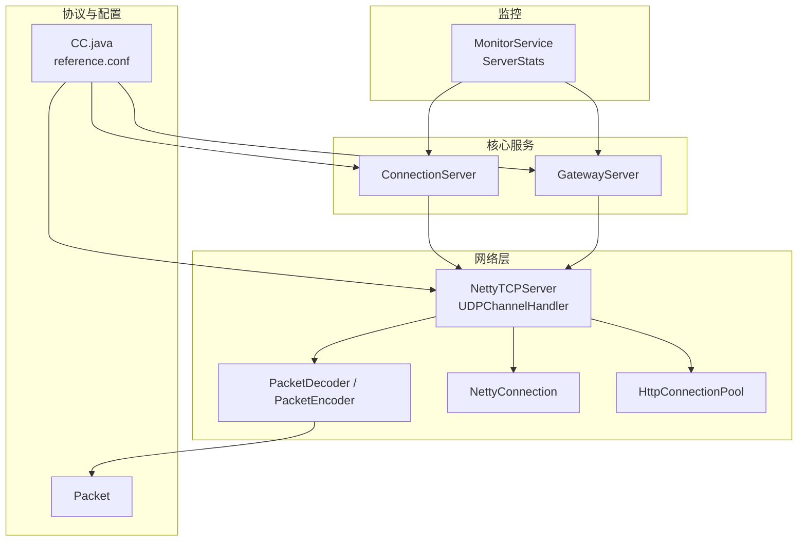
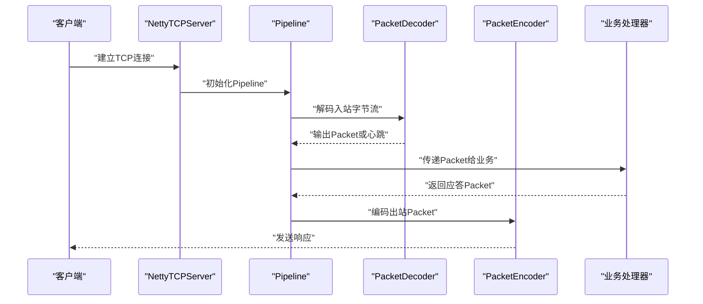
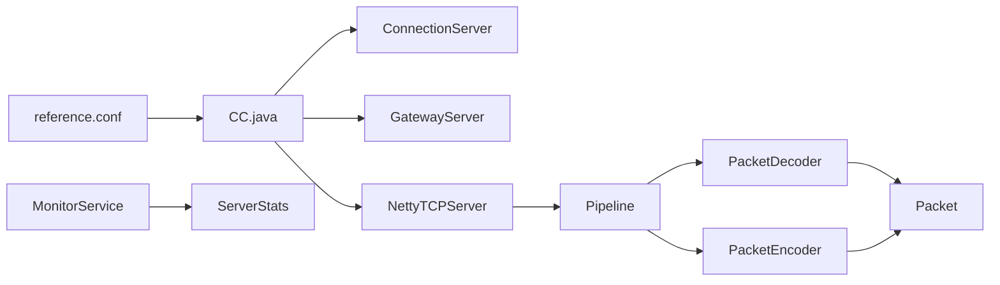

# 网络优化

<cite>
**本文档引用的文件**
- [PacketDecoder.java](file://mpush-netty/src/main/java/com/mpush/netty/codec/PacketDecoder.java)
- [PacketEncoder.java](file://mpush-netty/src/main/java/com/mpush/netty/codec/PacketEncoder.java)
- [NettyConnection.java](file://mpush-netty/src/main/java/com/mpush/netty/connection/NettyConnection.java)
- [NettyTCPServer.java](file://mpush-netty/src/main/java/com/mpush/netty/server/NettyTCPServer.java)
- [UDPChannelHandler.java](file://mpush-netty/src/main/java/com/mpush/netty/udp/UDPChannelHandler.java)
- [HttpConnectionPool.java](file://mpush-netty/src/main/java/com/mpush/netty/http/HttpConnectionPool.java)
- [ConnectionServer.java](file://mpush-core/src/main/java/com/mpush/core/server/ConnectionServer.java)
- [GatewayServer.java](file://mpush-core/src/main/java/com/mpush/core/server/GatewayServer.java)
- [Packet.java](file://mpush-api/src/main/java/com/mpush/api/protocol/Packet.java)
- [reference.conf](file://conf/reference.conf)
- [CC.java](file://mpush-tools/src/main/java/com/mpush/tools/config/CC.java)
- [ServerStats.java](file://mpush-monitor/src/main/java/com/mpush/monitor/jmx/stats/ServerStats.java)
- [MonitorService.java](file://mpush-monitor/src/main/java/com/mpush/monitor/service/MonitorService.java)
- [README.md](file://README.md)
</cite>

## 目录
1. [简介](#简介)
2. [项目结构](#项目结构)
3. [核心组件](#核心组件)
4. [架构总览](#架构总览)
5. [详细组件分析](#详细组件分析)
6. [依赖分析](#依赖分析)
7. [性能考量](#性能考量)
8. [故障排查指南](#故障排查指南)
9. [结论](#结论)
10. [附录](#附录)

## 简介
本指南面向MPush网络优化，围绕TCP/UDP参数调优、Netty写保护机制、流量整形、编解码优化、连接池优化、监控与诊断等方面，提供系统化的配置建议与实践路径。目标是在保证稳定性的同时最大化吞吐与延迟表现，并给出可落地的参数设定与观测指标。

## 项目结构
MPush的网络层主要位于以下模块：
- mpush-netty：Netty传输与编解码（TCP/UDP）、HTTP客户端连接池
- mpush-core：服务器启动与选项初始化（TCP/UDP服务器、写保护、缓冲区）
- mpush-api：协议定义（Packet）
- mpush-tools：配置中心（CC.java），从HOCON配置加载网络参数
- mpush-monitor：监控采集与输出
- conf：默认配置模板（reference.conf）

图表来源
- [NettyTCPServer.java](file://mpush-netty/src/main/java/com/mpush/netty/server/NettyTCPServer.java#L104-L185)
- [UDPChannelHandler.java](file://mpush-netty/src/main/java/com/mpush/netty/udp/UDPChannelHandler.java#L43-L98)
- [PacketDecoder.java](file://mpush-netty/src/main/java/com/mpush/netty/codec/PacketDecoder.java#L44-L107)
- [PacketEncoder.java](file://mpush-netty/src/main/java/com/mpush/netty/codec/PacketEncoder.java#L38-L46)
- [NettyConnection.java](file://mpush-netty/src/main/java/com/mpush/netty/connection/NettyConnection.java#L38-L179)
- [HttpConnectionPool.java](file://mpush-netty/src/main/java/com/mpush/netty/http/HttpConnectionPool.java#L36-L84)
- [ConnectionServer.java](file://mpush-core/src/main/java/com/mpush/core/server/ConnectionServer.java#L150-L174)
- [GatewayServer.java](file://mpush-core/src/main/java/com/mpush/core/server/GatewayServer.java#L151-L155)
- [Packet.java](file://mpush-api/src/main/java/com/mpush/api/protocol/Packet.java#L35-L187)
- [reference.conf](file://conf/reference.conf#L45-L123)
- [CC.java](file://mpush-tools/src/main/java/com/mpush/tools/config/CC.java#L141-L195)
- [MonitorService.java](file://mpush-monitor/src/main/java/com/mpush/monitor/service/MonitorService.java#L36-L99)
- [ServerStats.java](file://mpush-monitor/src/main/java/com/mpush/monitor/jmx/stats/ServerStats.java#L27-L152)

章节来源
- [NettyTCPServer.java](file://mpush-netty/src/main/java/com/mpush/netty/server/NettyTCPServer.java#L104-L185)
- [reference.conf](file://conf/reference.conf#L45-L123)

## 核心组件
- 编解码器：PacketDecoder负责心跳与帧解析，PacketEncoder负责编码；二者配合完成协议封装与解封。
- 连接抽象：NettyConnection封装Channel、会话上下文、读写超时与发送逻辑。
- 服务器：NettyTCPServer统一初始化Pipeline、内存池、线程比例；ConnectionServer/GatewayServer分别注入SO_SNDBUF/SO_RCVBUF与写保护水位。
- 连接池：HttpConnectionPool基于主机维度复用Channel，限制每主机最大连接数。
- 协议模型：Packet定义头部字段、校验、心跳常量与编解码入口。
- 配置中心：CC.java将HOCON配置映射为强类型常量，供各组件读取。
- 监控：MonitorService周期采集JVM与业务指标，ServerStats统计延迟与计数。

章节来源
- [PacketDecoder.java](file://mpush-netty/src/main/java/com/mpush/netty/codec/PacketDecoder.java#L44-L107)
- [PacketEncoder.java](file://mpush-netty/src/main/java/com/mpush/netty/codec/PacketEncoder.java#L38-L46)
- [NettyConnection.java](file://mpush-netty/src/main/java/com/mpush/netty/connection/NettyConnection.java#L38-L179)
- [NettyTCPServer.java](file://mpush-netty/src/main/java/com/mpush/netty/server/NettyTCPServer.java#L230-L263)
- [ConnectionServer.java](file://mpush-core/src/main/java/com/mpush/core/server/ConnectionServer.java#L150-L174)
- [GatewayServer.java](file://mpush-core/src/main/java/com/mpush/core/server/GatewayServer.java#L151-L155)
- [HttpConnectionPool.java](file://mpush-netty/src/main/java/com/mpush/netty/http/HttpConnectionPool.java#L36-L84)
- [Packet.java](file://mpush-api/src/main/java/com/mpush/api/protocol/Packet.java#L35-L187)
- [CC.java](file://mpush-tools/src/main/java/com/mpush/tools/config/CC.java#L141-L195)
- [MonitorService.java](file://mpush-monitor/src/main/java/com/mpush/monitor/service/MonitorService.java#L36-L99)
- [ServerStats.java](file://mpush-monitor/src/main/java/com/mpush/monitor/jmx/stats/ServerStats.java#L27-L152)

## 架构总览
MPush网络层采用Netty作为传输框架，服务器端通过ServerBootstrap装配Pipeline，依次为解码器、编码器与业务处理器。UDP路径通过UDPChannelHandler直接解码DatagramPacket并交由业务接收器处理。TCP侧通过NettyConnection抽象连接状态与发送行为，结合写保护水位与缓冲区参数，避免背压导致内存膨胀。

图表来源
- [NettyTCPServer.java](file://mpush-netty/src/main/java/com/mpush/netty/server/NettyTCPServer.java#L157-L162)
- [NettyTCPServer.java](file://mpush-netty/src/main/java/com/mpush/netty/server/NettyTCPServer.java#L259-L263)
- [PacketDecoder.java](file://mpush-netty/src/main/java/com/mpush/netty/codec/PacketDecoder.java#L47-L51)
- [PacketEncoder.java](file://mpush-netty/src/main/java/com/mpush/netty/codec/PacketEncoder.java#L42-L45)

## 详细组件分析

### TCP/UDP参数调优：snd_buf与rcv_buf
- 配置入口：参考配置文件中的snd_buf与rcv_buf段落，分别针对connect-server、gateway-server、gateway-client三类场景设置发送与接收缓冲区大小。
- 生效位置：
  - TCP接入服务器：在ConnectionServer中将配置注入childOption，分别设置SO_SNDBUF与SO_RCVBUF。
  - 网关服务器：同理在GatewayServer中注入。
  - UDP路径：UDPChannelHandler不直接设置SO_SNDBUF/SO_RCVBUF，通常沿用系统默认或平台特定实现。
- 参数建议：
  - 小连接数、低带宽：使用系统默认（0）即可，减少内存占用。
  - 高并发、高吞吐：根据平均包大小与RTT估算，适当增大rcv_buf以减少丢包与重传；snd_buf用于缓解突发写入。
  - 注意：过大可能导致内核排队堆积，引发延迟抖动；应结合监控指标逐步调优。

章节来源
- [reference.conf](file://conf/reference.conf#L76-L86)
- [ConnectionServer.java](file://mpush-core/src/main/java/com/mpush/core/server/ConnectionServer.java#L150-L151)
- [GatewayServer.java](file://mpush-core/src/main/java/com/mpush/core/server/GatewayServer.java#L158-L164)
- [UDPChannelHandler.java](file://mpush-netty/src/main/java/com/mpush/netty/udp/UDPChannelHandler.java#L43-L98)

### Netty写保护机制：write-buffer-water-mark
- 配置入口：write-buffer-water-mark段落，分别配置connect-server与gateway-server的低水位与高水位。
- 生效位置：在ConnectionServer与GatewayServer中，将配置转换为WriteBufferWaterMark并注入childOption。
- 工作原理：当ChannelOutboundBuffer字节数超过高水位时，channel.isWritable变为false；降至低水位以上时恢复true。应用应据此暂停/恢复写入，避免无界增长导致内存膨胀与GC压力。
- 参数建议：
  - 接入服务器：低水位与高水位适中，兼顾突发与稳定写入。
  - 网关服务器：若承载大量下行流量，可适当提高水位，避免频繁回压。
  - 结合监控观察isWritable状态变化频率，动态微调。

章节来源
- [reference.conf](file://conf/reference.conf#L88-L93)
- [ConnectionServer.java](file://mpush-core/src/main/java/com/mpush/core/server/ConnectionServer.java#L171-L173)
- [GatewayServer.java](file://mpush-core/src/main/java/com/mpush/core/server/GatewayServer.java#L151-L155)
- [CC.java](file://mpush-tools/src/main/java/com/mpush/tools/config/CC.java#L155-L161)

### 流量整形：全局限速与通道限速
- 配置入口：traffic-shaping段落，分别针对gateway-client、gateway-server、connect-server设置enabled、check-interval、write/read-global-limit、write/read-channel-limit。
- 生效位置：通过Netty TrafficShapingHandler在Pipeline中生效（具体注入点在服务器初始化阶段）。
- 参数建议：
  - 全局限速：用于保护下游或控制出口带宽，适合在connect-server或gateway-server方向设置read-global-limit。
  - 通道限速：针对单连接限速，避免个别长连接“饿死”其他连接，适合在gateway-client方向设置write-channel-limit。
  - check-interval越短越平滑但CPU开销越大，需权衡。

章节来源
- [reference.conf](file://conf/reference.conf#L95-L122)
- [CC.java](file://mpush-tools/src/main/java/com/mpush/tools/config/CC.java#L163-L195)
- [README.md](file://README.md#L181-L208)

### 编解码优化：PacketDecoder与PacketEncoder
- PacketDecoder：
  - 心跳检测：优先扫描头部字节，遇到心跳标记立即输出，提升空闲链路处理效率。
  - 帧解析：使用mark/resetReaderIndex确保半包/粘包场景下回退到正确位置，避免重复拷贝。
  - 最大包限制：依据配置限制包体长度，防止异常或恶意数据导致内存压力。
- PacketEncoder：
  - 单例共享：减少对象创建开销。
  - 快路径：心跳包走特判分支，避免不必要的字节拷贝。
- 优化建议：
  - 控制最大包尺寸，结合压缩阈值（core.compress-threshold）降低网络负载。
  - 对高频小包场景，考虑合并写或批量处理以减少系统调用次数。

章节来源
- [PacketDecoder.java](file://mpush-netty/src/main/java/com/mpush/netty/codec/PacketDecoder.java#L47-L77)
- [PacketDecoder.java](file://mpush-netty/src/main/java/com/mpush/netty/codec/PacketDecoder.java#L79-L89)
- [PacketEncoder.java](file://mpush-netty/src/main/java/com/mpush/netty/codec/PacketEncoder.java#L38-L46)
- [Packet.java](file://mpush-api/src/main/java/com/mpush/api/protocol/Packet.java#L141-L169)
- [reference.conf](file://conf/reference.conf#L23-L31)

### 网络连接池：HttpConnectionPool
- 功能：按主机维度缓存可用Channel，支持复用与回收，限制每主机最大连接数，避免连接风暴。
- 关键流程：
  - 获取：尝试从池中取出活跃Channel，否则返回空。
  - 归还：若未达上限则放回池中；否则关闭多余连接。
  - 主机绑定：通过AttributeKey将Channel与主机关联，便于回收与清理。
- 优化建议：
  - 结合上游服务超时策略（如keep-alive）设置max-conn-per-host，平衡连接复用与资源占用。
  - 在高并发场景下，适当提高上限并配合超时回收，减少新建连接开销。

章节来源
- [HttpConnectionPool.java](file://mpush-netty/src/main/java/com/mpush/netty/http/HttpConnectionPool.java#L36-L84)
- [reference.conf](file://conf/reference.conf#L172-L180)

### 发送与背压：NettyConnection.send
- 行为概览：若Channel活跃则写入并刷新，同时监听写入结果更新最后写入时间；若Channel不可用则主动关闭。
- 背压处理：当channel.isWritable为false时，可选择阻塞等待或直接失败，避免无界积压。
- 建议：在业务侧检查isWritable并在写满时退避重试，结合写保护水位与限速策略共同作用。

章节来源
- [NettyConnection.java](file://mpush-netty/src/main/java/com/mpush/netty/connection/NettyConnection.java#L77-L105)

## 依赖分析
- 配置依赖：CC.java从HOCON配置读取网络参数，供服务器与编解码器使用，形成“配置—实现”的弱耦合。
- 服务器依赖：NettyTCPServer统一装配Pipeline与内存池；ConnectionServer/GatewayServer分别注入缓冲区与写保护。
- 编解码依赖：PacketDecoder/Encoder依赖Packet协议模型，确保编解码一致性。
- 监控依赖：MonitorService依赖ResultCollector采集JVM与业务指标，ServerStats提供统计接口。

图表来源
- [reference.conf](file://conf/reference.conf#L45-L123)
- [CC.java](file://mpush-tools/src/main/java/com/mpush/tools/config/CC.java#L141-L195)
- [ConnectionServer.java](file://mpush-core/src/main/java/com/mpush/core/server/ConnectionServer.java#L150-L174)
- [GatewayServer.java](file://mpush-core/src/main/java/com/mpush/core/server/GatewayServer.java#L151-L155)
- [NettyTCPServer.java](file://mpush-netty/src/main/java/com/mpush/netty/server/NettyTCPServer.java#L259-L263)
- [PacketDecoder.java](file://mpush-netty/src/main/java/com/mpush/netty/codec/PacketDecoder.java#L44-L107)
- [PacketEncoder.java](file://mpush-netty/src/main/java/com/mpush/netty/codec/PacketEncoder.java#L38-L46)
- [Packet.java](file://mpush-api/src/main/java/com/mpush/api/protocol/Packet.java#L35-L187)
- [MonitorService.java](file://mpush-monitor/src/main/java/com/mpush/monitor/service/MonitorService.java#L36-L99)
- [ServerStats.java](file://mpush-monitor/src/main/java/com/mpush/monitor/jmx/stats/ServerStats.java#L27-L152)

## 性能考量
- 缓冲区与水位：snd_buf/rcv_buf与write-buffer-water-mark需协同配置，避免“一边高水位阻塞，另一边缓冲不足”的矛盾。
- 流量整形：在出口方向设置全局限速，在入口方向设置通道限速，防止“少数连接吃光带宽”。
- 编解码效率：合理设置最大包与压缩阈值，减少序列化与网络传输成本。
- 连接池：适度放宽每主机连接上限并配合超时回收，提升连接复用率。
- 线程与IO比率：NettyTCPServer设置IO线程比例，平衡CPU与IO开销。

章节来源
- [NettyTCPServer.java](file://mpush-netty/src/main/java/com/mpush/netty/server/NettyTCPServer.java#L192-L222)
- [reference.conf](file://conf/reference.conf#L23-L31)

## 故障排查指南
- 现象：内存持续上涨、GC频繁、进程被OOMKilled
  - 排查要点：检查写保护水位是否过低、是否出现长时间isWritable=false、是否存在突发写入未退避。
  - 处置：提高水位或引入限速，观察ChannelOutboundBuffer增长趋势。
- 现象：延迟升高、抖动明显
  - 排查要点：查看rcv_buf是否过小导致内核队列堆积；检查snd_buf是否过大导致内核排队。
  - 处置：结合带宽与RTT估算，逐步调优rcv_buf与snd_buf。
- 现象：个别连接独占带宽
  - 排查要点：确认是否启用通道限速；检查业务侧是否对单连接持续高吞吐写入。
  - 处置：为该连接设置write-channel-limit，或在上游做限速。
- 现象：连接过多导致资源紧张
  - 排查要点：检查HttpConnectionPool上限与回收策略；确认上游超时配置。
  - 处置：提高max-conn-per-host并缩短keep-alive，减少无效连接。
- 监控指标：
  - ServerStats：最小/平均/最大延迟、收发包数、存活连接数、未完成请求数等。
  - MonitorService：周期性采集JVM与线程池状态，必要时触发堆栈/堆转储。

章节来源
- [ConnectionServer.java](file://mpush-core/src/main/java/com/mpush/core/server/ConnectionServer.java#L153-L170)
- [GatewayServer.java](file://mpush-core/src/main/java/com/mpush/core/server/GatewayServer.java#L140-L150)
- [ServerStats.java](file://mpush-monitor/src/main/java/com/mpush/monitor/jmx/stats/ServerStats.java#L27-L152)
- [MonitorService.java](file://mpush-monitor/src/main/java/com/mpush/monitor/service/MonitorService.java#L65-L82)

## 结论
MPush在网络优化方面提供了完善的配置与实现支撑：通过缓冲区与写保护水位控制背压，利用流量整形实现全局与通道级限速，借助编解码器与连接池提升吞吐与复用率。结合监控指标与渐进式调参，可在不同业务场景下取得稳定与高效的网络表现。

## 附录
- 配置文件位置与关键段落
  - 网络参数：snd_buf、rcv_buf、write-buffer-water-mark、traffic-shaping
  - 核心参数：max-packet-size、compress-threshold
  - 监控参数：monitor.dump-dir、monitor.dump-period、monitor.print-log
- 建议的调参流程
  - 从默认配置入手，观察ServerStats与MonitorService输出；
  - 逐步调整rcv_buf/snd_buf与水位，验证延迟与内存；
  - 在出口方向启用全局限速，在入口方向启用通道限速；
  - 优化编解码参数（最大包、压缩阈值）与连接池上限；
  - 持续监控并迭代，直至满足SLA。

章节来源
- [reference.conf](file://conf/reference.conf#L45-L123)
- [README.md](file://README.md#L89-L326)