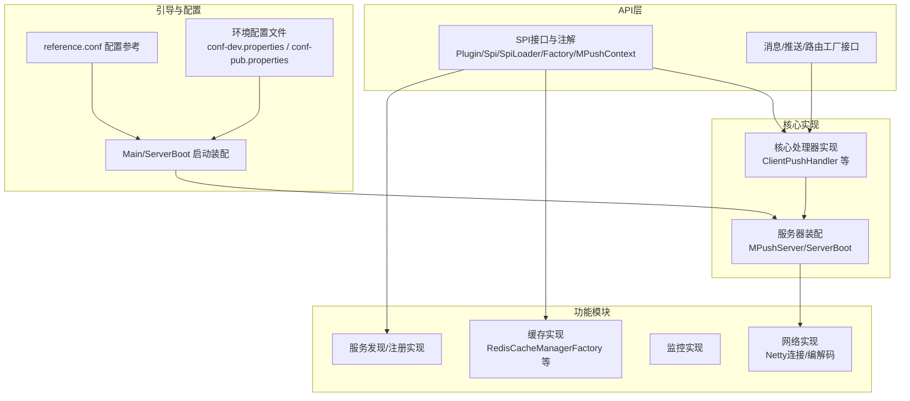
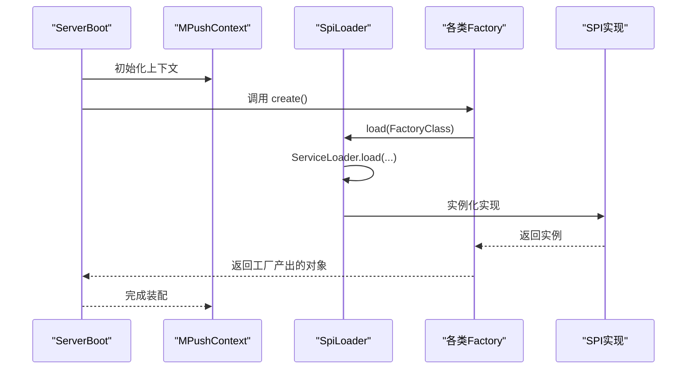
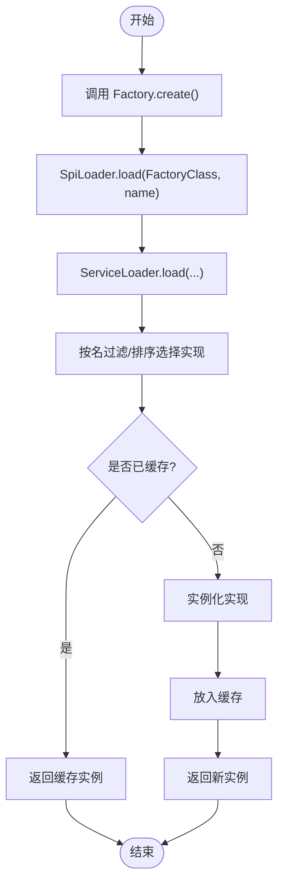
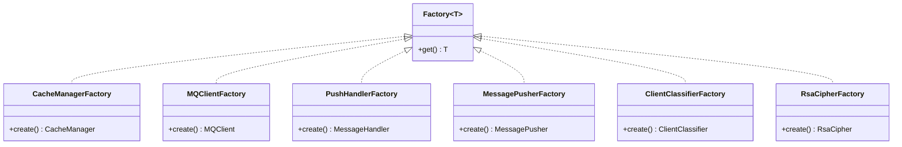

# 扩展定制

<cite>
**本文引用的文件**
- [Plugin.java](file://mpush-api/src/main/java/com/mpush/api/spi/Plugin.java)
- [Spi.java](file://mpush-api/src/main/java/com/mpush/api/spi/Spi.java)
- [SpiLoader.java](file://mpush-api/src/main/java/com/mpush/api/spi/SpiLoader.java)
- [Factory.java](file://mpush-api/src/main/java/com/mpush/api/spi/Factory.java)
- [MPushContext.java](file://mpush-api/src/main/java/com/mpush/api/MPushContext.java)
- [CacheManagerFactory.java](file://mpush-api/src/main/java/com/mpush/api/spi/common/CacheManagerFactory.java)
- [MQClientFactory.java](file://mpush-api/src/main/java/com/mpush/api/spi/common/MQClientFactory.java)
- [PushHandlerFactory.java](file://mpush-api/src/main/java/com/mpush/api/spi/handler/PushHandlerFactory.java)
- [MessagePusherFactory.java](file://mpush-api/src/main/java/com/mpush/api/spi/push/MessagePusherFactory.java)
- [ClientClassifierFactory.java](file://mpush-api/src/main/java/com/mpush/api/spi/router/ClientClassifierFactory.java)
- [RsaCipherFactory.java](file://mpush-api/src/main/java/com/mpush/api/spi/core/RsaCipherFactory.java)
- [com.mpush.api.spi.common.CacheManagerFactory](file://mpush-cache/src/main/resources/META-INF/services/com.mpush.api.spi.common.CacheManagerFactory)
- [com.mpush.api.spi.common.MQClientFactory](file://mpush-cache/src/main/resources/META-INF/services/com.mpush.api.spi.common.MQClientFactory)
- [com.mpush.api.spi.core.RsaCipherFactory](file://mpush-common/src/main/resources/META-INF/services/com.mpush.api.spi.core.RsaCipherFactory)
- [com.mpush.api.spi.router.ClientClassifierFactory](file://mpush-common/src/main/resources/META-INF/services/com.mpush.api.spi.router.ClientClassifierFactory)
- [com.mpush.api.spi.handler.PushHandlerFactory](file://mpush-core/src/main/resources/META-INF/services/com.mpush.api.spi.handler.PushHandlerFactory)
- [DefaultRsaCipherFactory.java](file://mpush-common/src/main/java/com/mpush/common/security/DefaultRsaCipherFactory.java)
- [DefaultClientClassifier.java](file://mpush-common/src/main/java/com/mpush/common/router/DefaultClientClassifier.java)
- [ClientPushHandler.java](file://mpush-core/src/main/java/com/mpush/core/handler/ClientPushHandler.java)
- [MPushServer.java](file://mpush-core/src/main/java/com/mpush/core/server/MPushServer.java)
- [ServerBoot.java](file://mpush-boot/src/main/java/com/mpush/bootstrap/job/ServerBoot.java)
- [Main.java](file://mpush-boot/src/main/java/com/mpush/bootstrap/Main.java)
- [reference.conf](file://conf/reference.conf)
- [conf-dev.properties](file://conf/conf-dev.properties)
- [conf-pub.properties](file://conf/conf-pub.properties)
- [FileCacheManger.java](file://mpush-test/src/main/java/com/mpush/test/spi/FileCacheManger.java)
- [SimpleCacheMangerFactory.java](file://mpush-test/src/main/java/com/mpush/test/spi/SimpleCacheMangerFactory.java)
- [SimpleDiscoveryFactory.java](file://mpush-test/src/main/java/com/mpush/test/spi/SimpleDiscoveryFactory.java)
- [SimpleRegistryFactory.java](file://mpush-test/src/main/java/com/mpush/test/spi/SimpleRegistryFactory.java)
- [SimpleMQClientFactory.java](file://mpush-test/src/main/java/com/mpush/test/spi/SimpleMQClientFactory.java)
- [application.conf](file://mpush-test/src/main/resources/application.conf)
</cite>

## 目录
1. [简介](#简介)
2. [项目结构](#项目结构)
3. [核心组件](#核心组件)
4. [架构总览](#架构总览)
5. [详细组件分析](#详细组件分析)
6. [依赖分析](#依赖分析)
7. [性能考虑](#性能考虑)
8. [故障排查指南](#故障排查指南)
9. [结论](#结论)
10. [附录](#附录)

## 简介
本指南面向需要在MPush上进行扩展定制的开发者，系统讲解插件开发（SPI接口设计、实现、注册与加载）、配置管理扩展（自定义配置项、配置文件扩展、动态配置更新）、版本升级策略（向后兼容、升级脚本与回滚）、第三方集成（外部系统对接、API扩展、数据格式转换）、自定义处理器（消息/连接/路由处理器）以及扩展点识别与利用。文档以代码为依据，提供可操作的步骤、图示与最佳实践。

## 项目结构
MPush采用多模块分层组织：API层定义扩展接口与上下文；核心模块实现默认行为；各功能模块（缓存、网络、监控、ZK等）通过SPI提供可替换实现；启动模块负责装配与引导。

图表来源
- [MPushServer.java](file://mpush-core/src/main/java/com/mpush/core/server/MPushServer.java#L1-L200)
- [ServerBoot.java](file://mpush-boot/src/main/java/com/mpush/bootstrap/job/ServerBoot.java#L1-L200)
- [reference.conf](file://conf/reference.conf#L1-L200)
- [conf-dev.properties](file://conf/conf-dev.properties#L1-L200)
- [conf-pub.properties](file://conf/conf-pub.properties#L1-L200)

章节来源
- [Main.java](file://mpush-boot/src/main/java/com/mpush/bootstrap/Main.java#L1-L200)
- [ServerBoot.java](file://mpush-boot/src/main/java/com/mpush/bootstrap/job/ServerBoot.java#L1-L200)
- [reference.conf](file://conf/reference.conf#L1-L200)

## 核心组件
- SPI接口与注解
  - Plugin：插件生命周期接口，提供初始化与销毁钩子。
  - Spi：SPI命名与排序注解，用于标识实现名称与加载顺序。
  - SpiLoader：基于JDK ServiceLoader的SPI加载器，支持按名过滤与缓存。
  - Factory：函数式工厂接口，统一对象创建入口。
  - MPushContext：运行时上下文，提供监控、服务发现、注册、缓存、消息队列等能力。

- 工厂接口族
  - CacheManagerFactory、MQClientFactory：缓存与消息队列客户端工厂。
  - PushHandlerFactory：消息处理器工厂。
  - MessagePusherFactory：消息推送器工厂。
  - ClientClassifierFactory：客户端分类器工厂。
  - RsaCipherFactory：RSA加解密工厂。

章节来源
- [Plugin.java](file://mpush-api/src/main/java/com/mpush/api/spi/Plugin.java#L1-L39)
- [Spi.java](file://mpush-api/src/main/java/com/mpush/api/spi/Spi.java#L1-L49)
- [SpiLoader.java](file://mpush-api/src/main/java/com/mpush/api/spi/SpiLoader.java#L1-L97)
- [Factory.java](file://mpush-api/src/main/java/com/mpush/api/spi/Factory.java#L1-L32)
- [MPushContext.java](file://mpush-api/src/main/java/com/mpush/api/MPushContext.java#L1-L46)
- [CacheManagerFactory.java](file://mpush-api/src/main/java/com/mpush/api/spi/common/CacheManagerFactory.java#L1-L35)
- [MQClientFactory.java](file://mpush-api/src/main/java/com/mpush/api/spi/common/MQClientFactory.java#L1-L36)
- [PushHandlerFactory.java](file://mpush-api/src/main/java/com/mpush/api/spi/handler/PushHandlerFactory.java#L1-L36)
- [MessagePusherFactory.java](file://mpush-api/src/main/java/com/mpush/api/spi/push/MessagePusherFactory.java#L1-L36)
- [ClientClassifierFactory.java](file://mpush-api/src/main/java/com/mpush/api/spi/router/ClientClassifierFactory.java#L1-L37)
- [RsaCipherFactory.java](file://mpush-api/src/main/java/com/mpush/api/spi/core/RsaCipherFactory.java#L1-L200)

## 架构总览
MPush通过SPI实现“可插拔”架构：核心模块不直接依赖具体实现，而是通过工厂接口与SPI加载器按需获取实现。启动阶段由ServerBoot装配核心组件与上下文，随后加载各SPI实现完成系统初始化。

图表来源
- [ServerBoot.java](file://mpush-boot/src/main/java/com/mpush/bootstrap/job/ServerBoot.java#L1-L200)
- [SpiLoader.java](file://mpush-api/src/main/java/com/mpush/api/spi/SpiLoader.java#L1-L97)
- [CacheManagerFactory.java](file://mpush-api/src/main/java/com/mpush/api/spi/common/CacheManagerFactory.java#L1-L35)
- [MQClientFactory.java](file://mpush-api/src/main/java/com/mpush/api/spi/common/MQClientFactory.java#L1-L36)
- [PushHandlerFactory.java](file://mpush-api/src/main/java/com/mpush/api/spi/handler/PushHandlerFactory.java#L1-L36)
- [MessagePusherFactory.java](file://mpush-api/src/main/java/com/mpush/api/spi/push/MessagePusherFactory.java#L1-L36)
- [ClientClassifierFactory.java](file://mpush-api/src/main/java/com/mpush/api/spi/router/ClientClassifierFactory.java#L1-L37)

## 详细组件分析

### 插件开发：SPI接口设计、实现、注册与加载
- 设计要点
  - 使用Factory接口作为统一创建入口，配合Spi注解标注实现类名与加载顺序。
  - 通过SpiLoader.load(clazz, name)按名或默认加载实现，并内置缓存避免重复实例化。
  - 在Plugin中提供init(context)/destroy()生命周期钩子，便于访问MPushContext与资源清理。

- 实现步骤
  1) 定义工厂接口（如CacheManagerFactory），并在静态方法中委托SpiLoader.load(...)。
  2) 编写实现类，使用@Spi标注实现名与order。
  3) 在META-INF/services目录下注册实现类全限定名。
  4) 在启动阶段调用工厂.create()获取实例，或在业务中通过工厂接口获取。

- 加载流程

图表来源
- [SpiLoader.java](file://mpush-api/src/main/java/com/mpush/api/spi/SpiLoader.java#L1-L97)
- [Factory.java](file://mpush-api/src/main/java/com/mpush/api/spi/Factory.java#L1-L32)
- [Plugin.java](file://mpush-api/src/main/java/com/mpush/api/spi/Plugin.java#L1-L39)

章节来源
- [Spi.java](file://mpush-api/src/main/java/com/mpush/api/spi/Spi.java#L1-L49)
- [SpiLoader.java](file://mpush-api/src/main/java/com/mpush/api/spi/SpiLoader.java#L1-L97)
- [Factory.java](file://mpush-api/src/main/java/com/mpush/api/spi/Factory.java#L1-L32)
- [Plugin.java](file://mpush-api/src/main/java/com/mpush/api/spi/Plugin.java#L1-L39)

### 配置管理扩展：自定义配置项、配置文件扩展、动态配置更新
- 自定义配置项
  - 在应用配置文件中新增键值对，通过配置工具读取并注入到运行时。
  - 参考路径：[application.conf](file://mpush-test/src/main/resources/application.conf#L1-L200)，[reference.conf](file://conf/reference.conf#L1-L200)。

- 配置文件扩展
  - 开发者可在本地或发布环境准备独立配置文件（如conf-dev.properties、conf-pub.properties），通过启动脚本或环境变量指定加载。
  - 参考路径：[conf-dev.properties](file://conf/conf-dev.properties#L1-L200)，[conf-pub.properties](file://conf/conf-pub.properties#L1-L200)。

- 动态配置更新
  - 建议结合服务注册/发现与配置中心，监听配置变更事件并触发热更新逻辑（例如刷新缓存、重载路由规则、重启定时任务等）。
  - 可参考测试模块中的配置读取与SPI工厂注册方式，构建“配置变更→工厂重载”的桥接逻辑。

章节来源
- [application.conf](file://mpush-test/src/main/resources/application.conf#L1-L200)
- [reference.conf](file://conf/reference.conf#L1-L200)
- [conf-dev.properties](file://conf/conf-dev.properties#L1-L200)
- [conf-pub.properties](file://conf/conf-pub.properties#L1-L200)

### 版本升级策略：向后兼容、升级脚本与回滚
- 向后兼容
  - SPI接口保持稳定，新增能力以默认实现或可选实现提供，避免破坏既有实现。
  - 对于消息协议与命令字，建议引入版本字段与兼容解析器，逐步淘汰旧格式。

- 升级脚本
  - 数据库/缓存迁移脚本应幂等执行，记录当前版本号，按顺序执行未执行的迁移步骤。
  - 配置文件升级时保留旧键并标记废弃，提供新键映射与默认值。

- 回滚机制
  - 采用“灰度+快速回滚”策略：先小范围发布，失败立即回滚；回滚时恢复上一个稳定版本的配置与实现。
  - 对于SPI实现，可通过切换实现类或禁用新实现快速回退。

[本节为通用策略说明，无需特定文件引用]

### 第三方集成：外部系统对接、API扩展、数据格式转换
- 外部系统对接
  - 通过MQClientFactory/MQClient实现消息通道接入（如Kafka/RabbitMQ/Redis Pub/Sub）。
  - 通过ServiceDiscoveryFactory/ServiceRegistryFactory实现服务注册与发现对接（如Consul/ZK）。

- API扩展
  - 在消息处理链路中插入自定义处理器（PushHandlerFactory），实现业务校验、审计、限流等。
  - 参考默认处理器实现路径：[ClientPushHandler.java](file://mpush-core/src/main/java/com/mpush/core/handler/ClientPushHandler.java#L1-L200)。

- 数据格式转换
  - 通过JsonFactory/Json实现序列化/反序列化扩展，适配不同协议或压缩算法。
  - 参考默认RSA加解密实现路径：[DefaultRsaCipherFactory.java](file://mpush-common/src/main/java/com/mpush/common/security/DefaultRsaCipherFactory.java#L1-L200)。

章节来源
- [MQClientFactory.java](file://mpush-api/src/main/java/com/mpush/api/spi/common/MQClientFactory.java#L1-L36)
- [ServiceDiscoveryFactory.java](file://mpush-api/src/main/java/com/mpush/api/spi/common/ServiceDiscoveryFactory.java#L1-L200)
- [ServiceRegistryFactory.java](file://mpush-api/src/main/java/com/mpush/api/spi/common/ServiceRegistryFactory.java#L1-L200)
- [PushHandlerFactory.java](file://mpush-api/src/main/java/com/mpush/api/spi/handler/PushHandlerFactory.java#L1-L36)
- [ClientPushHandler.java](file://mpush-core/src/main/java/com/mpush/core/handler/ClientPushHandler.java#L1-L200)
- [DefaultRsaCipherFactory.java](file://mpush-common/src/main/java/com/mpush/common/security/DefaultRsaCipherFactory.java#L1-L200)

### 自定义处理器：消息/连接/路由处理器
- 消息处理器
  - 实现MessageHandler并通过PushHandlerFactory注册，拦截/处理特定Command类型的消息。
  - 参考默认实现：[ClientPushHandler.java](file://mpush-core/src/main/java/com/mpush/core/handler/ClientPushHandler.java#L1-L200)。

- 连接处理器
  - 在连接建立/关闭事件中执行业务逻辑，可结合SessionContext与ConnectionManager。
  - 参考事件接口：[ConnectionConnectEvent.java](file://mpush-api/src/main/java/com/mpush/api/event/ConnectionConnectEvent.java#L1-L200)、[ConnectionCloseEvent.java](file://mpush-api/src/main/java/com/mpush/api/event/ConnectionCloseEvent.java#L1-L200)。

- 路由处理器
  - 通过ClientClassifierFactory实现客户端分类与路由策略（如按地域/设备类型/标签）。
  - 默认实现参考：[DefaultClientClassifier.java](file://mpush-common/src/main/java/com/mpush/common/router/DefaultClientClassifier.java#L1-L200)。

章节来源
- [PushHandlerFactory.java](file://mpush-api/src/main/java/com/mpush/api/spi/handler/PushHandlerFactory.java#L1-L36)
- [ClientPushHandler.java](file://mpush-core/src/main/java/com/mpush/core/handler/ClientPushHandler.java#L1-L200)
- [ClientClassifierFactory.java](file://mpush-api/src/main/java/com/mpush/api/spi/router/ClientClassifierFactory.java#L1-L37)
- [DefaultClientClassifier.java](file://mpush-common/src/main/java/com/mpush/common/router/DefaultClientClassifier.java#L1-L200)

### 扩展点识别与利用
- 关键扩展接口
  - 缓存：CacheManagerFactory
  - 消息队列：MQClientFactory
  - 加解密：RsaCipherFactory
  - 客户端分类：ClientClassifierFactory
  - 消息处理器：PushHandlerFactory
  - 推送器：MessagePusherFactory

- 扩展机制
  - 通过@Spi(value="实现名", order=排序)标注实现类。
  - 在META-INF/services/工厂全限定名下注册实现类全限定名。
  - 使用工厂.create()获取实例，或在启动阶段集中装配。

- 扩展约束
  - 实现类必须无参构造或通过SPI容器可实例化。
  - 若存在多个实现，通过order控制优先级；若仅有一个实现，可省略name参数。

章节来源
- [Spi.java](file://mpush-api/src/main/java/com/mpush/api/spi/Spi.java#L1-L49)
- [com.mpush.api.spi.common.CacheManagerFactory](file://mpush-cache/src/main/resources/META-INF/services/com.mpush.api.spi.common.CacheManagerFactory#L1-L2)
- [com.mpush.api.spi.common.MQClientFactory](file://mpush-cache/src/main/resources/META-INF/services/com.mpush.api.spi.common.MQClientFactory#L1-L2)
- [com.mpush.api.spi.core.RsaCipherFactory](file://mpush-common/src/main/resources/META-INF/services/com.mpush.api.spi.core.RsaCipherFactory#L1-L2)
- [com.mpush.api.spi.router.ClientClassifierFactory](file://mpush-common/src/main/resources/META-INF/services/com.mpush.api.spi.router.ClientClassifierFactory#L1-L1)
- [com.mpush.api.spi.handler.PushHandlerFactory](file://mpush-core/src/main/resources/META-INF/services/com.mpush.api.spi.handler.PushHandlerFactory#L1-L1)

### 典型案例：自定义缓存实现
- 场景描述
  - 需要将默认Redis缓存替换为文件缓存，用于测试或特殊环境。

- 实施步骤
  1) 实现CacheManager接口与CacheManagerFactory。
  2) 使用@Spi标注实现类，设置实现名与order。
  3) 在META-INF/services/com.mpush.api.spi.common.CacheManagerFactory中注册实现类。
  4) 在测试配置中确保加载该实现（参考测试模块的SPI注册方式）。

- 参考实现
  - 测试模块中的文件缓存与工厂实现：
    - [FileCacheManger.java](file://mpush-test/src/main/java/com/mpush/test/spi/FileCacheManger.java#L1-L200)
    - [SimpleCacheMangerFactory.java](file://mpush-test/src/main/java/com/mpush/test/spi/SimpleCacheMangerFactory.java#L1-L200)

章节来源
- [FileCacheManger.java](file://mpush-test/src/main/java/com/mpush/test/spi/FileCacheManger.java#L1-L200)
- [SimpleCacheMangerFactory.java](file://mpush-test/src/main/java/com/mpush/test/spi/SimpleCacheMangerFactory.java#L1-L200)

## 依赖分析
SPI实现与工厂之间的依赖关系如下：

图表来源
- [Factory.java](file://mpush-api/src/main/java/com/mpush/api/spi/Factory.java#L1-L32)
- [CacheManagerFactory.java](file://mpush-api/src/main/java/com/mpush/api/spi/common/CacheManagerFactory.java#L1-L35)
- [MQClientFactory.java](file://mpush-api/src/main/java/com/mpush/api/spi/common/MQClientFactory.java#L1-L36)
- [PushHandlerFactory.java](file://mpush-api/src/main/java/com/mpush/api/spi/handler/PushHandlerFactory.java#L1-L36)
- [MessagePusherFactory.java](file://mpush-api/src/main/java/com/mpush/api/spi/push/MessagePusherFactory.java#L1-L36)
- [ClientClassifierFactory.java](file://mpush-api/src/main/java/com/mpush/api/spi/router/ClientClassifierFactory.java#L1-L37)
- [RsaCipherFactory.java](file://mpush-api/src/main/java/com/mpush/api/spi/core/RsaCipherFactory.java#L1-L200)

章节来源
- [SpiLoader.java](file://mpush-api/src/main/java/com/mpush/api/spi/SpiLoader.java#L1-L97)
- [com.mpush.api.spi.common.CacheManagerFactory](file://mpush-cache/src/main/resources/META-INF/services/com.mpush.api.spi.common.CacheManagerFactory#L1-L2)
- [com.mpush.api.spi.common.MQClientFactory](file://mpush-cache/src/main/resources/META-INF/services/com.mpush.api.spi.common.MQClientFactory#L1-L2)
- [com.mpush.api.spi.core.RsaCipherFactory](file://mpush-common/src/main/resources/META-INF/services/com.mpush.api.spi.core.RsaCipherFactory#L1-L2)
- [com.mpush.api.spi.router.ClientClassifierFactory](file://mpush-common/src/main/resources/META-INF/services/com.mpush.api.spi.router.ClientClassifierFactory#L1-L1)
- [com.mpush.api.spi.handler.PushHandlerFactory](file://mpush-core/src/main/resources/META-INF/services/com.mpush.api.spi.handler.PushHandlerFactory#L1-L1)

## 性能考虑
- SPI加载缓存
  - SpiLoader内部维护实现缓存，避免重复ServiceLoader扫描，降低启动开销。
- 实现排序与选择
  - 当存在多个实现时，按@Spi.order排序选择，减少运行时决策成本。
- 资源释放
  - 在Plugin.destroy()中释放连接、线程池、缓存等资源，防止内存泄漏。
- 并发安全
  - 工厂与加载器应保证线程安全，避免并发场景下的重复实例化。

[本节为通用性能建议，无需特定文件引用]

## 故障排查指南
- SPI实现未生效
  - 检查META-INF/services文件是否存在且包含正确实现类名。
  - 确认@Spi注解的value与实现类名一致，或通过SpiLoader按简单类名匹配。
  - 参考默认注册文件：
    - [com.mpush.api.spi.common.CacheManagerFactory](file://mpush-cache/src/main/resources/META-INF/services/com.mpush.api.spi.common.CacheManagerFactory#L1-L2)
    - [com.mpush.api.spi.common.MQClientFactory](file://mpush-cache/src/main/resources/META-INF/services/com.mpush.api.spi.common.MQClientFactory#L1-L2)
    - [com.mpush.api.spi.core.RsaCipherFactory](file://mpush-common/src/main/resources/META-INF/services/com.mpush.api.spi.core.RsaCipherFactory#L1-L2)
    - [com.mpush.api.spi.router.ClientClassifierFactory](file://mpush-common/src/main/resources/META-INF/services/com.mpush.api.spi.router.ClientClassifierFactory#L1-L1)
    - [com.mpush.api.spi.handler.PushHandlerFactory](file://mpush-core/src/main/resources/META-INF/services/com.mpush.api.spi.handler.PushHandlerFactory#L1-L1)

- 启动异常
  - 检查ServerBoot装配顺序与依赖关系，确保上下文初始化完成后再加载SPI实现。
  - 参考启动装配位置：[ServerBoot.java](file://mpush-boot/src/main/java/com/mpush/bootstrap/job/ServerBoot.java#L1-L200)。

- 配置问题
  - 确认配置文件加载顺序与覆盖关系，检查环境配置文件是否正确生效。
  - 参考配置文件位置：[reference.conf](file://conf/reference.conf#L1-L200)、[conf-dev.properties](file://conf/conf-dev.properties#L1-L200)、[conf-pub.properties](file://conf/conf-pub.properties#L1-L200)。

章节来源
- [SpiLoader.java](file://mpush-api/src/main/java/com/mpush/api/spi/SpiLoader.java#L1-L97)
- [ServerBoot.java](file://mpush-boot/src/main/java/com/mpush/bootstrap/job/ServerBoot.java#L1-L200)
- [reference.conf](file://conf/reference.conf#L1-L200)
- [conf-dev.properties](file://conf/conf-dev.properties#L1-L200)
- [conf-pub.properties](file://conf/conf-pub.properties#L1-L200)

## 结论
MPush通过清晰的SPI接口与工厂模式实现了高度可扩展的架构。开发者只需遵循“定义接口—实现类—注册—加载”的标准流程，即可完成插件化扩展；同时，结合配置管理、版本升级与第三方集成的最佳实践，能够快速落地生产级定制需求。

## 附录
- 快速清单
  - 定义工厂接口并提供静态create()方法。
  - 实现类使用@Spi(value="实现名", order=排序)标注。
  - 在META-INF/services/工厂全限定名下注册实现类。
  - 在启动阶段调用工厂.create()或通过上下文获取实例。
  - 在Plugin.init(context)中完成初始化，在destroy()中释放资源。

- 参考实现路径
  - 默认RSA实现：[DefaultRsaCipherFactory.java](file://mpush-common/src/main/java/com/mpush/common/security/DefaultRsaCipherFactory.java#L1-L200)
  - 默认客户端分类器：[DefaultClientClassifier.java](file://mpush-common/src/main/java/com/mpush/common/router/DefaultClientClassifier.java#L1-L200)
  - 默认消息处理器：[ClientPushHandler.java](file://mpush-core/src/main/java/com/mpush/core/handler/ClientPushHandler.java#L1-L200)