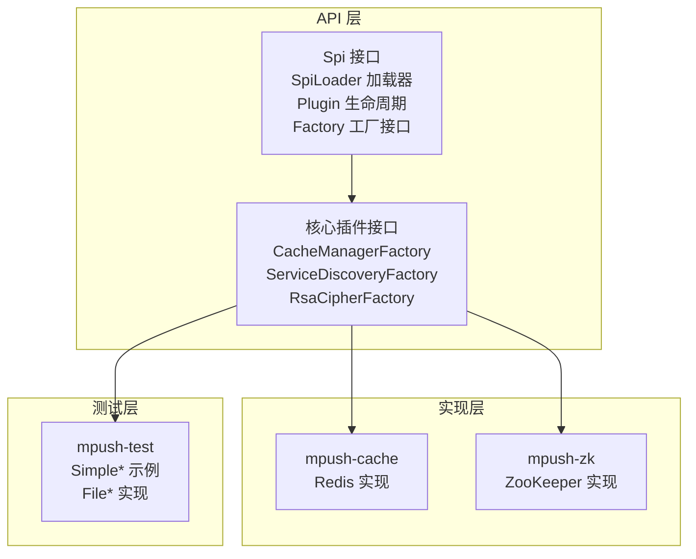
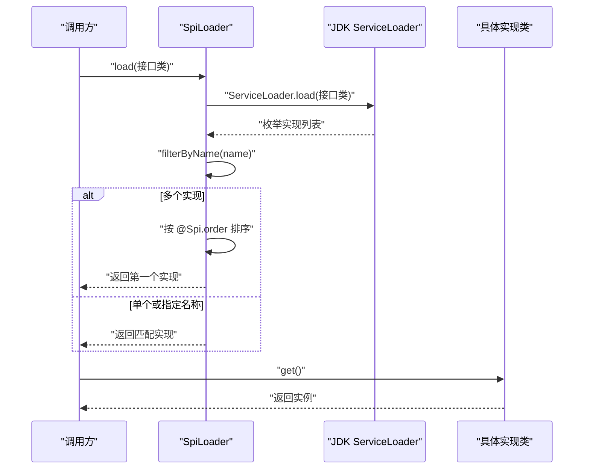
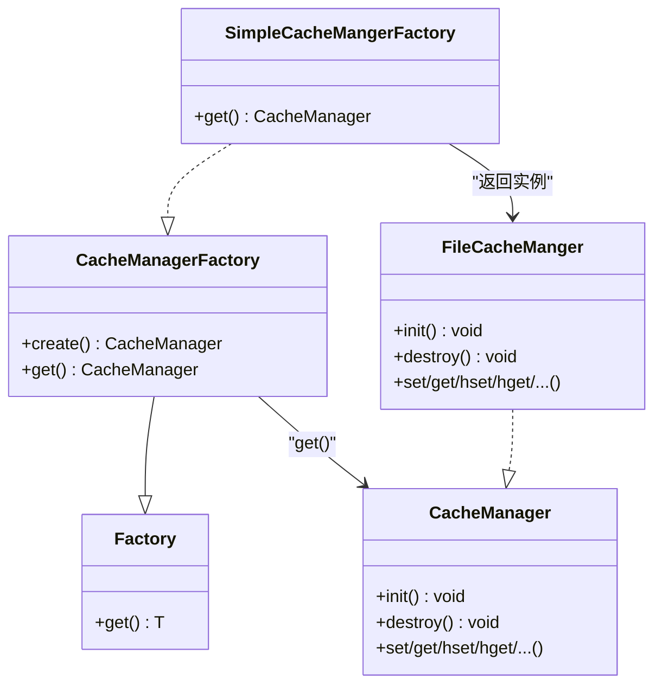
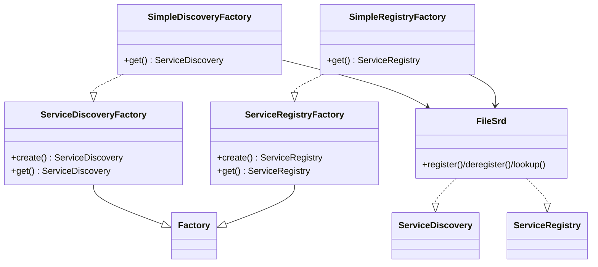
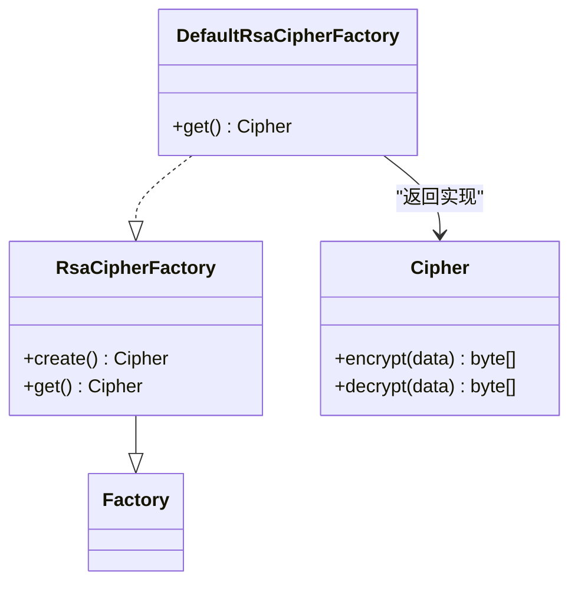
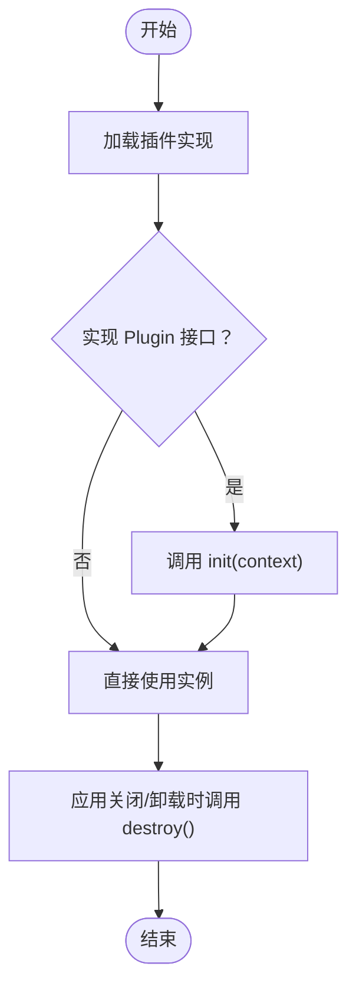
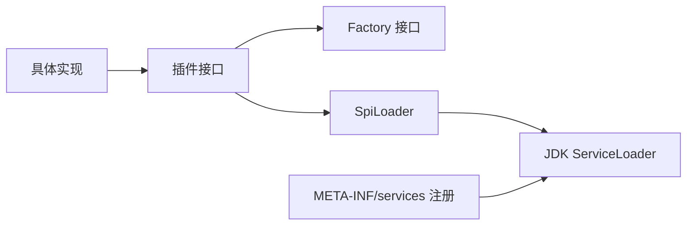

# 插件开发

<cite>
**本文引用的文件**
- [Plugin.java](file://mpush-api/src/main/java/com/mpush/api/spi/Plugin.java)
- [Spi.java](file://mpush-api/src/main/java/com/mpush/api/spi/Spi.java)
- [SpiLoader.java](file://mpush-api/src/main/java/com/mpush/api/spi/SpiLoader.java)
- [Factory.java](file://mpush-api/src/main/java/com/mpush/api/spi/Factory.java)
- [CacheManagerFactory.java](file://mpush-api/src/main/java/com/mpush/api/spi/common/CacheManagerFactory.java)
- [ServiceDiscoveryFactory.java](file://mpush-api/src/main/java/com/mpush/api/spi/common/ServiceDiscoveryFactory.java)
- [RsaCipherFactory.java](file://mpush-api/src/main/java/com/mpush/api/spi/core/RsaCipherFactory.java)
- [CacheManager.java](file://mpush-api/src/main/java/com/mpush/api/spi/common/CacheManager.java)
- [Cipher.java](file://mpush-api/src/main/java/com/mpush/api/connection/Cipher.java)
- [SimpleCacheMangerFactory.java](file://mpush-test/src/main/java/com/mpush/test/spi/SimpleCacheMangerFactory.java)
- [SimpleDiscoveryFactory.java](file://mpush-test/src/main/java/com/mpush/test/spi/SimpleDiscoveryFactory.java)
- [FileCacheManger.java](file://mpush-test/src/main/java/com/mpush/test/spi/FileCacheManger.java)
- [FileSrd.java](file://mpush-test/src/main/java/com/mpush/test/spi/FileSrd.java)
- [SimpleRegistryFactory.java](file://mpush-test/src/main/java/com/mpush/test/spi/SimpleRegistryFactory.java)
- [SimpleMQClientFactory.java](file://mpush-test/src/main/java/com/mpush/test/spi/SimpleMQClientFactory.java)
- [CacheManagerFactory（测试资源）](file://mpush-test/src/main/resources/META-INF/services/com.mpush.api.spi.common.CacheManagerFactory)
- [ServiceDiscoveryFactory（测试资源）](file://mpush-test/src/main/resources/META-INF/services/com.mpush.api.spi.common.ServiceDiscoveryFactory)
- [CacheManagerFactory（缓存实现）](file://mpush-cache/src/main/resources/META-INF/services/com.mpush.api.spi.common.CacheManagerFactory)
- [ServiceDiscoveryFactory（ZK实现）](file://mpush-zk/src/main/resources/META-INF/services/com.mpush.api.spi.common.ServiceDiscoveryFactory)
</cite>

## 目录
1. [简介](#简介)
2. [项目结构](#项目结构)
3. [核心组件](#核心组件)
4. [架构总览](#架构总览)
5. [详细组件分析](#详细组件分析)
6. [依赖分析](#依赖分析)
7. [性能考虑](#性能考虑)
8. [故障排查指南](#故障排查指南)
9. [结论](#结论)
10. [附录](#附录)

## 简介
本指南面向希望为 MPush 开发 SPI 插件的开发者，系统讲解 SPI 插件机制的设计与实现，包括插件接口定义、插件实现规范、插件注册机制、生命周期管理以及不同类型插件的开发方法。文档以 mpush-test 模块中的示例为基础，结合 mpush-cache、mpush-zk 等实现模块，帮助读者快速上手并掌握最佳实践。

## 项目结构
MPush 的 SPI 体系由 API 层、实现层与测试层组成：
- API 层：定义插件接口与 SPI 加载器，位于 mpush-api 模块。
- 实现层：提供具体实现，如 mpush-cache（Redis）、mpush-zk（ZooKeeper）。
- 测试层：提供简单实现与示例，便于本地验证与调试，位于 mpush-test 模块。

图表来源
- [SpiLoader.java](file://mpush-api/src/main/java/com/mpush/api/spi/SpiLoader.java#L25-L96)
- [CacheManagerFactory.java](file://mpush-api/src/main/java/com/mpush/api/spi/common/CacheManagerFactory.java#L30-L34)
- [ServiceDiscoveryFactory.java](file://mpush-api/src/main/java/com/mpush/api/spi/common/ServiceDiscoveryFactory.java#L32-L35)
- [RsaCipherFactory.java](file://mpush-api/src/main/java/com/mpush/api/spi/core/RsaCipherFactory.java#L31-L34)

章节来源
- [SpiLoader.java](file://mpush-api/src/main/java/com/mpush/api/spi/SpiLoader.java#L25-L96)
- [CacheManagerFactory.java](file://mpush-api/src/main/java/com/mpush/api/spi/common/CacheManagerFactory.java#L30-L34)
- [ServiceDiscoveryFactory.java](file://mpush-api/src/main/java/com/mpush/api/spi/common/ServiceDiscoveryFactory.java#L32-L35)
- [RsaCipherFactory.java](file://mpush-api/src/main/java/com/mpush/api/spi/core/RsaCipherFactory.java#L31-L34)

## 核心组件
- 插件接口与工厂
  - 插件接口统一继承工厂接口，通过 get() 提供实例；部分接口提供静态工厂方法简化调用。
  - 典型接口：CacheManagerFactory、ServiceDiscoveryFactory、RsaCipherFactory。
- 注解与加载
  - @Spi 注解用于命名与排序；SpiLoader 基于 JDK ServiceLoader 机制发现实现，并支持按名称过滤与排序。
- 生命周期
  - 所有插件实现可实现 Plugin 接口，获得 init(context) 与 destroy() 钩子，便于在启动与关闭时进行资源管理。

章节来源
- [Factory.java](file://mpush-api/src/main/java/com/mpush/api/spi/Factory.java#L29-L31)
- [Spi.java](file://mpush-api/src/main/java/com/mpush/api/spi/Spi.java#L32-L48)
- [SpiLoader.java](file://mpush-api/src/main/java/com/mpush/api/spi/SpiLoader.java#L32-L95)
- [Plugin.java](file://mpush-api/src/main/java/com/mpush/api/spi/Plugin.java#L29-L38)

## 架构总览
SPI 插件机制采用“接口 + 工厂 + 注解 + 加载器”的组合模式，运行时通过 META-INF/services 文件注册实现类，加载器根据注解与名称选择最优实现。

图表来源
- [SpiLoader.java](file://mpush-api/src/main/java/com/mpush/api/spi/SpiLoader.java#L52-L95)

## 详细组件分析

### CacheManagerFactory 与 CacheManager
- 设计要点
  - CacheManagerFactory 继承 Factory，提供静态工厂方法 create()，内部委托 SpiLoader 完成加载。
  - CacheManager 定义通用缓存操作，包括键值、哈希、有序集合、列表等常用命令。
- 生命周期
  - CacheManager 实现通常需要 init() 初始化连接/资源，destroy() 释放资源。
- 开发步骤
  - 实现 CacheManagerFactory 并标注 @Spi(value="名称", order=排序号)。
  - 在 META-INF/services 中注册实现类全名。
  - 实现 CacheManager 并在 get() 返回其实例。

图表来源
- [CacheManagerFactory.java](file://mpush-api/src/main/java/com/mpush/api/spi/common/CacheManagerFactory.java#L30-L34)
- [CacheManager.java](file://mpush-api/src/main/java/com/mpush/api/spi/common/CacheManager.java#L30-L69)
- [SimpleCacheMangerFactory.java](file://mpush-test/src/main/java/com/mpush/test/spi/SimpleCacheMangerFactory.java#L31-L37)
- [FileCacheManger.java](file://mpush-test/src/main/java/com/mpush/test/spi/FileCacheManger.java#L42-L213)

章节来源
- [CacheManagerFactory.java](file://mpush-api/src/main/java/com/mpush/api/spi/common/CacheManagerFactory.java#L30-L34)
- [CacheManager.java](file://mpush-api/src/main/java/com/mpush/api/spi/common/CacheManager.java#L30-L69)
- [SimpleCacheMangerFactory.java](file://mpush-test/src/main/java/com/mpush/test/spi/SimpleCacheMangerFactory.java#L31-L37)
- [FileCacheManger.java](file://mpush-test/src/main/java/com/mpush/test/spi/FileCacheManger.java#L42-L213)
- [CacheManagerFactory（测试资源）](file://mpush-test/src/main/resources/META-INF/services/com.mpush.api.spi.common.CacheManagerFactory#L1-L1)
- [CacheManagerFactory（缓存实现）](file://mpush-cache/src/main/resources/META-INF/services/com.mpush.api.spi.common.CacheManagerFactory#L1-L1)

### ServiceDiscoveryFactory 与 ServiceRegistryFactory
- 设计要点
  - ServiceDiscoveryFactory 与 ServiceRegistryFactory 分别负责服务发现与服务注册的工厂接口。
  - 通过静态工厂方法 create() 获取实例，底层由 SpiLoader 加载具体实现。
- 开发步骤
  - 实现对应 Factory 接口并标注 @Spi。
  - 在 META-INF/services 中注册实现类全名。
  - 实现 ServiceDiscovery 或 ServiceRegistry 接口的业务逻辑。

图表来源
- [ServiceDiscoveryFactory.java](file://mpush-api/src/main/java/com/mpush/api/spi/common/ServiceDiscoveryFactory.java#L32-L35)
- [SimpleDiscoveryFactory.java](file://mpush-test/src/main/java/com/mpush/test/spi/SimpleDiscoveryFactory.java#L31-L37)
- [FileSrd.java](file://mpush-test/src/main/java/com/mpush/test/spi/FileSrd.java#L36-L87)
- [SimpleRegistryFactory.java](file://mpush-test/src/main/java/com/mpush/test/spi/SimpleRegistryFactory.java#L31-L37)

章节来源
- [ServiceDiscoveryFactory.java](file://mpush-api/src/main/java/com/mpush/api/spi/common/ServiceDiscoveryFactory.java#L32-L35)
- [SimpleDiscoveryFactory.java](file://mpush-test/src/main/java/com/mpush/test/spi/SimpleDiscoveryFactory.java#L31-L37)
- [FileSrd.java](file://mpush-test/src/main/java/com/mpush/test/spi/FileSrd.java#L36-L87)
- [SimpleRegistryFactory.java](file://mpush-test/src/main/java/com/mpush/test/spi/SimpleRegistryFactory.java#L31-L37)
- [ServiceDiscoveryFactory（测试资源）](file://mpush-test/src/main/resources/META-INF/services/com.mpush.api.spi.common.ServiceDiscoveryFactory#L1-L1)
- [ServiceDiscoveryFactory（ZK实现）](file://mpush-zk/src/main/resources/META-INF/services/com.mpush.api.spi.common.ServiceDiscoveryFactory#L1-L1)

### RsaCipherFactory 与 Cipher
- 设计要点
  - RsaCipherFactory 继承 Factory，返回 Cipher 实例，用于加密/解密。
  - Cipher 接口定义 encrypt()/decrypt() 两个核心方法。
- 开发步骤
  - 实现 RsaCipherFactory 并标注 @Spi。
  - 在 META-INF/services 中注册实现类全名。
  - 实现 Cipher 接口并在 get() 返回其实例。

图表来源
- [RsaCipherFactory.java](file://mpush-api/src/main/java/com/mpush/api/spi/core/RsaCipherFactory.java#L31-L34)
- [Cipher.java](file://mpush-api/src/main/java/com/mpush/api/connection/Cipher.java#L27-L33)

章节来源
- [RsaCipherFactory.java](file://mpush-api/src/main/java/com/mpush/api/spi/core/RsaCipherFactory.java#L31-L34)
- [Cipher.java](file://mpush-api/src/main/java/com/mpush/api/connection/Cipher.java#L27-L33)

### 插件生命周期管理
- 生命周期钩子
  - 所有插件实现可实现 Plugin 接口，获得 init(context) 与 destroy() 钩子。
  - init() 在插件被加载后调用，适合做初始化工作（如连接建立、资源准备）。
  - destroy() 在应用关闭或插件卸载时调用，适合做清理工作（如连接关闭、线程池销毁）。
- 调用时机
  - SpiLoader 在返回实现前会检查是否实现了 Plugin 接口，若实现则调用 init(context)。
  - 应用关闭时统一调用 destroy()。

图表来源
- [Plugin.java](file://mpush-api/src/main/java/com/mpush/api/spi/Plugin.java#L31-L37)
- [SpiLoader.java](file://mpush-api/src/main/java/com/mpush/api/spi/SpiLoader.java#L32-L50)

章节来源
- [Plugin.java](file://mpush-api/src/main/java/com/mpush/api/spi/Plugin.java#L31-L37)
- [SpiLoader.java](file://mpush-api/src/main/java/com/mpush/api/spi/SpiLoader.java#L32-L50)

### 不同类型插件的开发方法
- 缓存插件（CacheManagerFactory）
  - 参考 mpush-test 中的 SimpleCacheMangerFactory 与 FileCacheManger。
  - 在测试资源中注册实现类全名，确保 ServiceLoader 能找到。
- 服务发现/注册插件（ServiceDiscoveryFactory、ServiceRegistryFactory）
  - 参考 mpush-test 中的 SimpleDiscoveryFactory、SimpleRegistryFactory 与 FileSrd。
  - 同样在 META-INF/services 中注册实现类全名。
- 密钥/加解密插件（RsaCipherFactory）
  - 参考默认实现 DefaultRsaCipherFactory（位于 mpush-common），实现 Cipher 接口并注册。

章节来源
- [SimpleCacheMangerFactory.java](file://mpush-test/src/main/java/com/mpush/test/spi/SimpleCacheMangerFactory.java#L31-L37)
- [FileCacheManger.java](file://mpush-test/src/main/java/com/mpush/test/spi/FileCacheManger.java#L42-L213)
- [CacheManagerFactory（测试资源）](file://mpush-test/src/main/resources/META-INF/services/com.mpush.api.spi.common.CacheManagerFactory#L1-L1)
- [SimpleDiscoveryFactory.java](file://mpush-test/src/main/java/com/mpush/test/spi/SimpleDiscoveryFactory.java#L31-L37)
- [SimpleRegistryFactory.java](file://mpush-test/src/main/java/com/mpush/test/spi/SimpleRegistryFactory.java#L31-L37)
- [FileSrd.java](file://mpush-test/src/main/java/com/mpush/test/spi/FileSrd.java#L36-L87)
- [ServiceDiscoveryFactory（测试资源）](file://mpush-test/src/main/resources/META-INF/services/com.mpush.api.spi.common.ServiceDiscoveryFactory#L1-L1)
- [RsaCipherFactory.java](file://mpush-api/src/main/java/com/mpush/api/spi/core/RsaCipherFactory.java#L31-L34)

## 依赖分析
- 组件耦合
  - 插件接口与实现通过 Factory 与 @Spi 解耦，加载器通过 ServiceLoader 动态绑定。
  - CacheManagerFactory/ServiceDiscoveryFactory/RsaCipherFactory 仅依赖接口与 SpiLoader，不依赖具体实现。
- 外部依赖
  - JDK ServiceLoader 作为 SPI 发现机制。
  - 测试资源文件 META-INF/services 用于注册实现类。

图表来源
- [SpiLoader.java](file://mpush-api/src/main/java/com/mpush/api/spi/SpiLoader.java#L52-L66)
- [CacheManagerFactory.java](file://mpush-api/src/main/java/com/mpush/api/spi/common/CacheManagerFactory.java#L30-L34)
- [ServiceDiscoveryFactory.java](file://mpush-api/src/main/java/com/mpush/api/spi/common/ServiceDiscoveryFactory.java#L32-L35)
- [RsaCipherFactory.java](file://mpush-api/src/main/java/com/mpush/api/spi/core/RsaCipherFactory.java#L31-L34)

章节来源
- [SpiLoader.java](file://mpush-api/src/main/java/com/mpush/api/spi/SpiLoader.java#L52-L66)
- [CacheManagerFactory.java](file://mpush-api/src/main/java/com/mpush/api/spi/common/CacheManagerFactory.java#L30-L34)
- [ServiceDiscoveryFactory.java](file://mpush-api/src/main/java/com/mpush/api/spi/common/ServiceDiscoveryFactory.java#L32-L35)
- [RsaCipherFactory.java](file://mpush-api/src/main/java/com/mpush/api/spi/core/RsaCipherFactory.java#L31-L34)

## 性能考虑
- 缓存插件
  - 使用并发容器与异步写盘策略降低阻塞，避免频繁 IO。
  - 合理设置定时刷新频率，平衡一致性与性能。
- 服务发现/注册
  - 将节点信息持久化到缓存，减少对远程服务的依赖。
  - 订阅事件时注意去重与限流，避免风暴。
- 加解密插件
  - 复用密钥材料与上下文，避免重复初始化。
  - 对大块数据采用分片处理，减少内存峰值。

## 故障排查指南
- 无法加载实现
  - 检查 META-INF/services 中是否正确注册实现类全名。
  - 确认实现类可见性与打包位置。
- 多实现冲突
  - 通过 @Spi(order) 设置优先级，或通过 SpiLoader.load(接口, 名称) 指定实现。
- 生命周期问题
  - 确保实现 Plugin 接口并在 init/destroy 中正确管理资源。
  - 关注异常堆栈，定位资源泄漏或竞态条件。

章节来源
- [SpiLoader.java](file://mpush-api/src/main/java/com/mpush/api/spi/SpiLoader.java#L61-L66)
- [Plugin.java](file://mpush-api/src/main/java/com/mpush/api/spi/Plugin.java#L31-L37)

## 结论
MPush 的 SPI 机制通过接口抽象、注解排序与 ServiceLoader 发现，实现了高度可插拔的扩展能力。开发者只需遵循 Factory 与 @Spi 规范，在 META-INF/services 中注册实现即可无缝接入系统。配合生命周期钩子与测试示例，可以快速完成从开发到上线的全流程。

## 附录
- 快速开发清单
  - 实现 Factory 接口并提供 get() 返回实例。
  - 使用 @Spi(value, order) 标注实现类。
  - 在 META-INF/services 中注册实现类全名。
  - 如需生命周期管理，实现 Plugin 接口并在 init/destroy 中处理资源。
  - 参考 mpush-test 中的 Simple* 与 File* 示例进行本地调试。