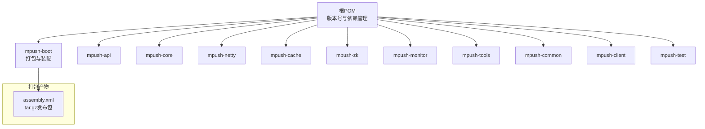
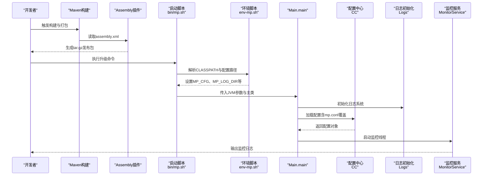
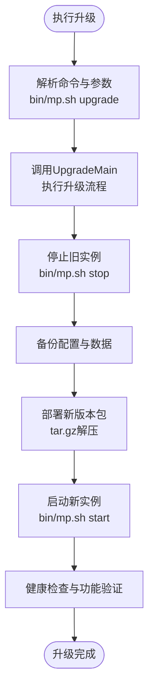
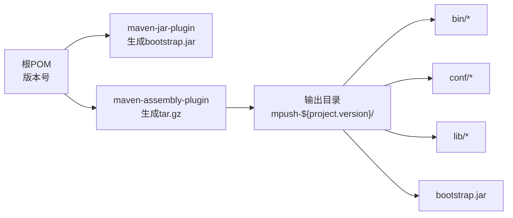
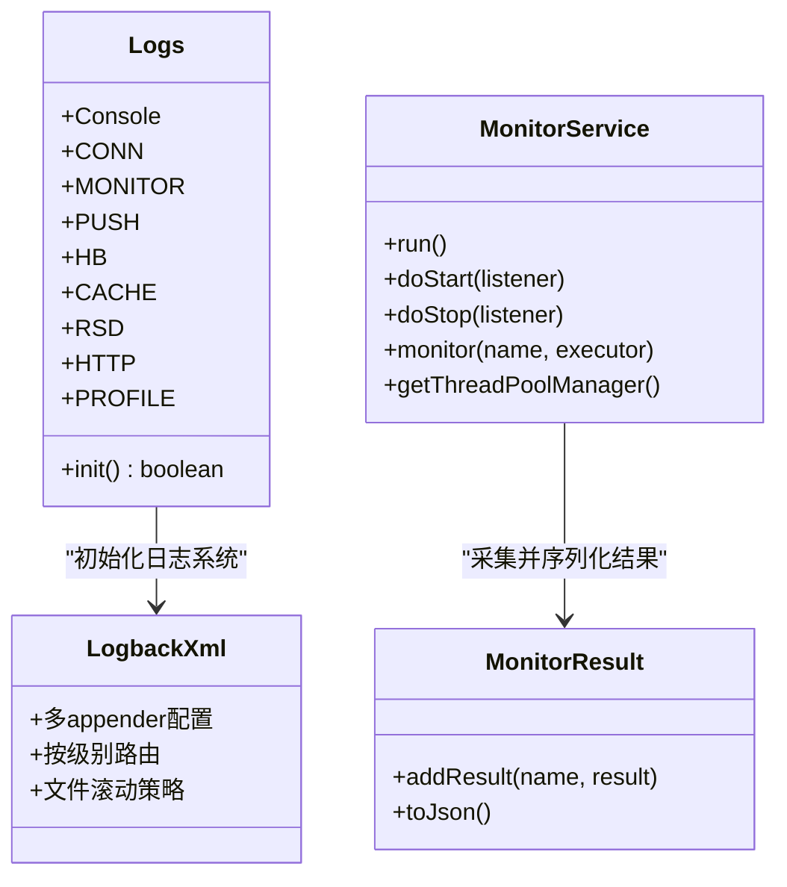
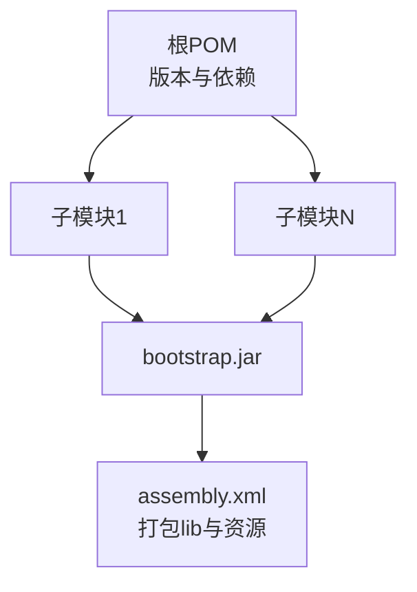

# 版本升级

<cite>
**本文引用的文件**
- [pom.xml](file://pom.xml)
- [mpush-boot/pom.xml](file://mpush-boot/pom.xml)
- [mpush-boot/assembly.xml](file://mpush-boot/assembly.xml)
- [bin/mp.sh](file://bin/mp.sh)
- [bin/env-mp.sh](file://bin/env-mp.sh)
- [conf/reference.conf](file://conf/reference.conf)
- [mpush-boot/src/main/resources/mpush.conf](file://mpush-boot/src/main/resources/mpush.conf)
- [mpush-boot/src/main/resources/logback.xml](file://mpush-boot/src/main/resources/logback.xml)
- [mpush-boot/src/main/java/com/mpush/bootstrap/Main.java](file://mpush-boot/src/main/java/com/mpush/bootstrap/Main.java)
- [mpush-tools/src/main/java/com/mpush/tools/config/CC.java](file://mpush-tools/src/main/java/com/mpush/tools/config/CC.java)
- [mpush-tools/src/main/java/com/mpush/tools/log/Logs.java](file://mpush-tools/src/main/java/com/mpush/tools/log/Logs.java)
- [mpush-monitor/src/main/java/com/mpush/monitor/service/MonitorService.java](file://mpush-monitor/src/main/java/com/mpush/monitor/service/MonitorService.java)
- [mpush-monitor/src/main/java/com/mpush/monitor/data/MonitorResult.java](file://mpush-monitor/src/main/java/com/mpush/monitor/data/MonitorResult.java)
</cite>

## 目录
1. [简介](#简介)
2. [项目结构](#项目结构)
3. [核心组件](#核心组件)
4. [架构总览](#架构总览)
5. [详细组件分析](#详细组件分析)
6. [依赖分析](#依赖分析)
7. [性能考虑](#性能考虑)
8. [故障排查指南](#故障排查指南)
9. [结论](#结论)
10. [附录](#附录)

## 简介
本文件面向MPush版本升级与运维管理，围绕版本号管理、升级路径规划、向后兼容性保障、升级脚本编写、回滚机制、灰度/蓝绿/滚动部署策略、自动化打包与发布、以及升级过程中的监控与日志记录等方面，提供系统化、可操作的升级管理指导。文档基于仓库内的pom.xml、assembly.xml、启动脚本与配置体系、日志与监控组件进行分析与总结。

## 项目结构
MPush采用多模块Maven聚合工程组织，核心模块包括API、核心服务、网络层、缓存、ZooKeeper集成、监控与工具集等。打包与发布通过mpush-boot模块的assembly插件完成，最终产出tar.gz发布包，包含二进制、配置与脚本。

图表来源
- [pom.xml](file://pom.xml#L54-L66)
- [mpush-boot/pom.xml](file://mpush-boot/pom.xml#L1-L101)
- [mpush-boot/assembly.xml](file://mpush-boot/assembly.xml#L1-L58)

章节来源
- [pom.xml](file://pom.xml#L1-L342)
- [mpush-boot/pom.xml](file://mpush-boot/pom.xml#L1-L101)
- [mpush-boot/assembly.xml](file://mpush-boot/assembly.xml#L1-L58)

## 核心组件
- 版本号与依赖管理：根pom集中声明版本与依赖，子模块继承统一版本，确保一致性。
- 打包与装配：mpush-boot使用assembly插件生成tar.gz发布包，包含bin、conf、lib与bootstrap.jar。
- 启动与环境：bin/mp.sh负责JVM参数、JMX、PID、日志输出与进程生命周期；env-mp.sh负责CLASSPATH与配置路径解析。
- 配置体系：conf/reference.conf提供完整配置项参考，mpush.conf提供运行时覆盖项，CC与Logs负责配置加载与日志初始化。
- 监控与日志：logback.xml定义多通道日志；MonitorService周期采集监控指标并落盘；Logs接口统一日志入口。

章节来源
- [pom.xml](file://pom.xml#L68-L76)
- [mpush-boot/pom.xml](file://mpush-boot/pom.xml#L34-L48)
- [mpush-boot/assembly.xml](file://mpush-boot/assembly.xml#L3-L56)
- [bin/mp.sh](file://bin/mp.sh#L133-L222)
- [bin/env-mp.sh](file://bin/env-mp.sh#L77-L92)
- [conf/reference.conf](file://conf/reference.conf#L1-L239)
- [mpush-boot/src/main/resources/mpush.conf](file://mpush-boot/src/main/resources/mpush.conf#L1-L16)
- [mpush-boot/src/main/resources/logback.xml](file://mpush-boot/src/main/resources/logback.xml#L1-L231)
- [mpush-tools/src/main/java/com/mpush/tools/config/CC.java](file://mpush-tools/src/main/java/com/mpush/tools/config/CC.java#L42-L53)
- [mpush-tools/src/main/java/com/mpush/tools/log/Logs.java](file://mpush-tools/src/main/java/com/mpush/tools/log/Logs.java#L36-L45)
- [mpush-monitor/src/main/java/com/mpush/monitor/service/MonitorService.java](file://mpush-monitor/src/main/java/com/mpush/monitor/service/MonitorService.java#L65-L83)

## 架构总览
从版本升级视角，系统的关键交互链路包括：版本号来源（根pom）、打包装配（assembly）、启动与配置加载（Main/CC/Logs）、运行时监控（MonitorService）与日志输出（logback）。

图表来源
- [mpush-boot/assembly.xml](file://mpush-boot/assembly.xml#L3-L56)
- [bin/mp.sh](file://bin/mp.sh#L133-L222)
- [bin/env-mp.sh](file://bin/env-mp.sh#L77-L92)
- [mpush-boot/src/main/java/com/mpush/bootstrap/Main.java](file://mpush-boot/src/main/java/com/mpush/bootstrap/Main.java#L31-L38)
- [mpush-tools/src/main/java/com/mpush/tools/config/CC.java](file://mpush-tools/src/main/java/com/mpush/tools/config/CC.java#L42-L53)
- [mpush-tools/src/main/java/com/mpush/tools/log/Logs.java](file://mpush-tools/src/main/java/com/mpush/tools/log/Logs.java#L36-L45)
- [mpush-monitor/src/main/java/com/mpush/monitor/service/MonitorService.java](file://mpush-monitor/src/main/java/com/mpush/monitor/service/MonitorService.java#L86-L93)

## 详细组件分析

### 版本号与升级路径设计
- 版本号来源：根pom的<version>字段决定整个工程的版本，子模块通过父pom继承，避免版本漂移。
- 升级路径建议：
  - 小版本（PATCH）：仅修复缺陷，保持配置与API完全向后兼容。
  - 次版本（MINOR）：新增功能但保持配置与API向后兼容，必要时提供配置兼容层。
  - 主版本（MAJOR）：破坏性变更，需提供明确迁移指南与配置迁移脚本。
- 版本标签：SCM中使用<scm><tag>v${project.version}</tag>，便于发布与回溯。

章节来源
- [pom.xml](file://pom.xml#L16-L34)

### 升级脚本编写方法
- 启动脚本更新：bin/mp.sh提供upgrade子命令，调用UpgradeMain执行升级逻辑；同时支持start/stop/restart/status等标准动作。
- 配置文件迁移：env-mp.sh设置MP_CFG与CLASSPATH；mpush.conf作为运行时覆盖文件，优先于reference.conf生效；CC.load()支持-Dmp.conf指定自定义配置文件并进行withFallback合并。
- 数据库结构变更：仓库未发现数据库相关脚本或实体定义，若涉及数据库变更，应在CI中增加迁移脚本校验与回滚预案。

图表来源
- [bin/mp.sh](file://bin/mp.sh#L217-L222)

章节来源
- [bin/mp.sh](file://bin/mp.sh#L133-L222)
- [bin/env-mp.sh](file://bin/env-mp.sh#L53-L58)
- [mpush-boot/src/main/resources/mpush.conf](file://mpush-boot/src/main/resources/mpush.conf#L1-L16)
- [mpush-tools/src/main/java/com/mpush/tools/config/CC.java](file://mpush-tools/src/main/java/com/mpush/tools/config/CC.java#L42-L53)

### 回滚机制设计与实现
- 升级前备份：建议在bin/mp.sh的upgrade分支中增加“备份当前配置与运行时数据”的步骤。
- 升级失败处理：bin/mp.sh已具备优雅停机与强制终止能力；可在升级失败时触发回滚流程。
- 自动回滚：建议在UpgradeMain中增加失败捕获与自动回滚逻辑，配合备份恢复。
- 进程管理：bin/mp.sh通过PID文件与信号量控制进程生命周期，便于回滚时清理残留进程。

章节来源
- [bin/mp.sh](file://bin/mp.sh#L176-L216)

### 版本升级最佳实践
- 灰度发布：先在小部分节点升级，观察监控与日志，再逐步扩大范围。
- 蓝绿部署：准备两套环境，切换流量至新版本，失败则立即切回。
- 滚动升级：逐批重启节点，维持整体服务能力。
- 配置与依赖一致性：通过根pom统一版本，避免跨模块版本不一致导致的升级失败。

章节来源
- [pom.xml](file://pom.xml#L78-L284)

### 自动化打包与发布流程
- assembly.xml定义了发布包结构：包含LICENSE、README、bin、conf、lib与bootstrap.jar；baseDirectory为mpush-${project.version}，id为release-${project.version}，格式为tar.gz。
- mpush-boot/pom.xml通过maven-assembly-plugin与maven-jar-plugin生成发布包与可执行jar，finalName为mpush，manifest指向Main。

图表来源
- [mpush-boot/assembly.xml](file://mpush-boot/assembly.xml#L3-L56)
- [mpush-boot/pom.xml](file://mpush-boot/pom.xml#L78-L95)

章节来源
- [mpush-boot/assembly.xml](file://mpush-boot/assembly.xml#L1-L58)
- [mpush-boot/pom.xml](file://mpush-boot/pom.xml#L34-L98)

### 升级过程中的监控与日志记录
- 日志配置：logback.xml定义多通道日志（应用、info、debug、监控、连接、推送、心跳、缓存、HTTP、SRD、性能分析），并通过系统属性注入日志根级别与配置路径。
- 日志初始化：Logs.init()设置log.home、log.root.level、logback.configurationFile，并输出当前配置快照，便于升级前后对比。
- 监控服务：MonitorService周期采集JVM与业务指标，按配置周期输出监控日志；支持JStack/JMap转储阈值控制，便于定位升级后的性能问题。

图表来源
- [mpush-tools/src/main/java/com/mpush/tools/log/Logs.java](file://mpush-tools/src/main/java/com/mpush/tools/log/Logs.java#L36-L45)
- [mpush-boot/src/main/resources/logback.xml](file://mpush-boot/src/main/resources/logback.xml#L1-L231)
- [mpush-monitor/src/main/java/com/mpush/monitor/service/MonitorService.java](file://mpush-monitor/src/main/java/com/mpush/monitor/service/MonitorService.java#L65-L99)
- [mpush-monitor/src/main/java/com/mpush/monitor/data/MonitorResult.java](file://mpush-monitor/src/main/java/com/mpush/monitor/data/MonitorResult.java#L27-L65)

章节来源
- [mpush-boot/src/main/resources/logback.xml](file://mpush-boot/src/main/resources/logback.xml#L1-L231)
- [mpush-tools/src/main/java/com/mpush/tools/log/Logs.java](file://mpush-tools/src/main/java/com/mpush/tools/log/Logs.java#L36-L45)
- [mpush-monitor/src/main/java/com/mpush/monitor/service/MonitorService.java](file://mpush-monitor/src/main/java/com/mpush/monitor/service/MonitorService.java#L65-L99)
- [mpush-monitor/src/main/java/com/mpush/monitor/data/MonitorResult.java](file://mpush-monitor/src/main/java/com/mpush/monitor/data/MonitorResult.java#L27-L65)

## 依赖分析
- 版本依赖：根pom集中管理依赖版本，子模块通过groupId/artifactId/version占位继承，确保升级时一次性变更。
- 打包依赖：assembly.xml将target/classes下的资源与target/下的bootstrap.jar一并打包，lib目录由依赖集自动填充。

图表来源
- [pom.xml](file://pom.xml#L78-L284)
- [mpush-boot/assembly.xml](file://mpush-boot/assembly.xml#L34-L56)

章节来源
- [pom.xml](file://pom.xml#L78-L284)
- [mpush-boot/assembly.xml](file://mpush-boot/assembly.xml#L34-L56)

## 性能考虑
- 升级窗口：优先选择低峰时段，结合灰度与滚动策略降低影响面。
- 监控阈值：利用MonitorService的负载阈值触发JStack/JMap转储，定位升级后性能瓶颈。
- 日志级别：通过CC与Logs动态调整日志级别，平衡可观测性与开销。

## 故障排查指南
- 启动失败：检查bin/mp.sh输出的PID写入与进程状态；确认JVM参数、CLASSPATH与配置路径。
- 配置不生效：确认-Dmp.conf指向的mp.conf存在且被CC加载；参考reference.conf核对默认值。
- 日志无输出：检查logback配置与系统属性注入；确认日志目录权限。
- 监控缺失：检查MonitorService是否启动、周期配置与日志输出开关。

章节来源
- [bin/mp.sh](file://bin/mp.sh#L133-L165)
- [bin/env-mp.sh](file://bin/env-mp.sh#L77-L92)
- [mpush-tools/src/main/java/com/mpush/tools/config/CC.java](file://mpush-tools/src/main/java/com/mpush/tools/config/CC.java#L42-L53)
- [mpush-boot/src/main/resources/logback.xml](file://mpush-boot/src/main/resources/logback.xml#L1-L231)
- [mpush-monitor/src/main/java/com/mpush/monitor/service/MonitorService.java](file://mpush-monitor/src/main/java/com/mpush/monitor/service/MonitorService.java#L86-L93)

## 结论
MPush的版本升级管理以根pom的版本统一与assembly的标准化打包为基础，辅以bin脚本的进程生命周期管理、CC/Logs的配置与日志体系、以及MonitorService的运行时监控，形成完整的升级与运维闭环。建议在实际生产中补充升级前备份与自动回滚机制，并结合灰度/蓝绿/滚动策略，确保升级的安全与稳定。

## 附录
- 升级命令参考：bin/mp.sh支持start、start-foreground、stop、restart、status、upgrade、print-cmd等。
- 配置参考：conf/reference.conf提供完整配置项；mpush.conf用于运行时覆盖。
- 启动入口：Main.main作为启动入口，负责日志初始化与ServerLauncher生命周期管理。

章节来源
- [bin/mp.sh](file://bin/mp.sh#L133-L242)
- [conf/reference.conf](file://conf/reference.conf#L1-L239)
- [mpush-boot/src/main/resources/mpush.conf](file://mpush-boot/src/main/resources/mpush.conf#L1-L16)
- [mpush-boot/src/main/java/com/mpush/bootstrap/Main.java](file://mpush-boot/src/main/java/com/mpush/bootstrap/Main.java#L31-L38)