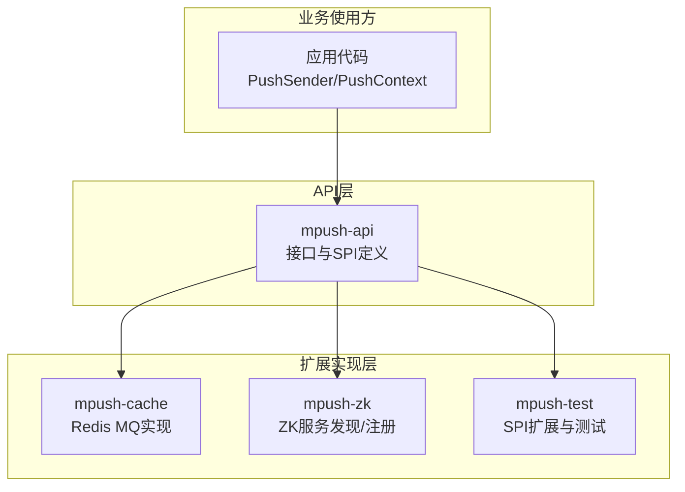
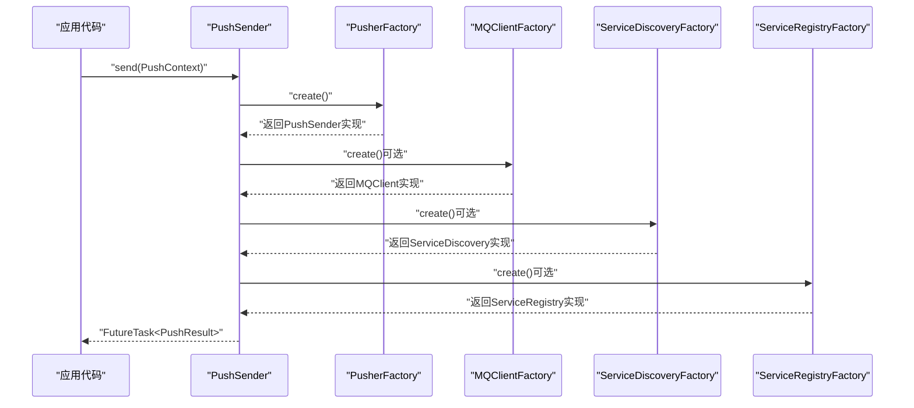
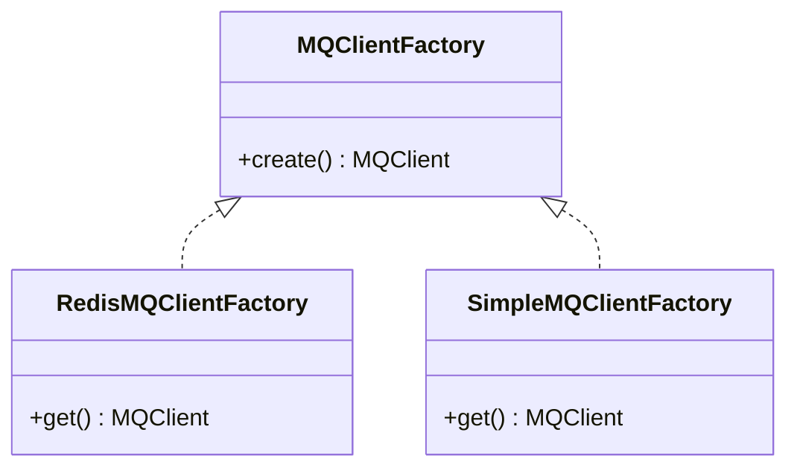
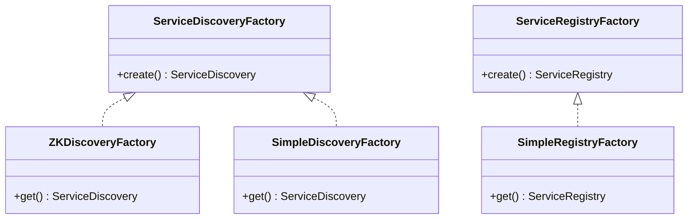
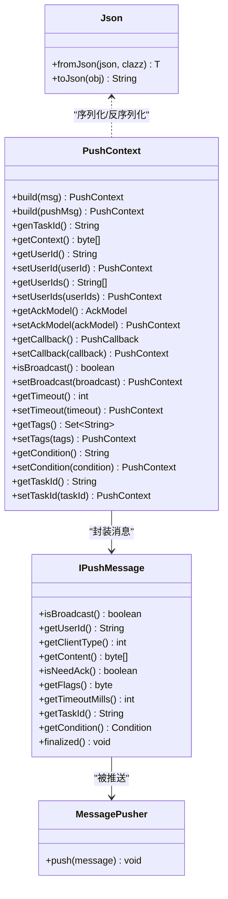
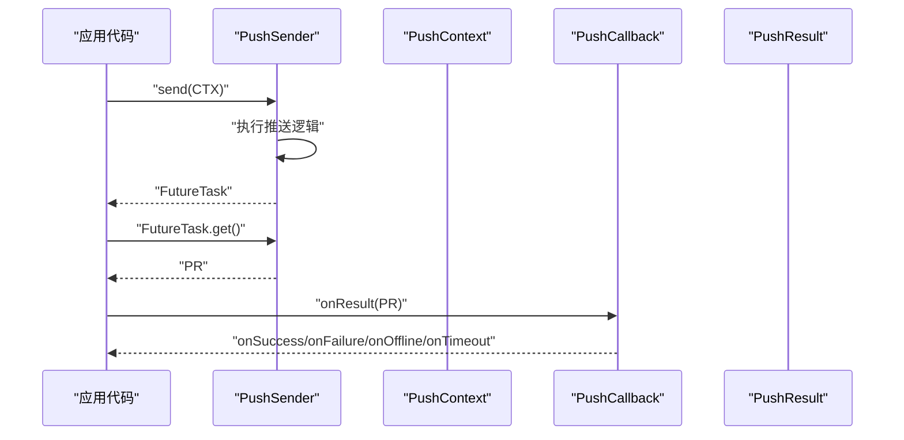
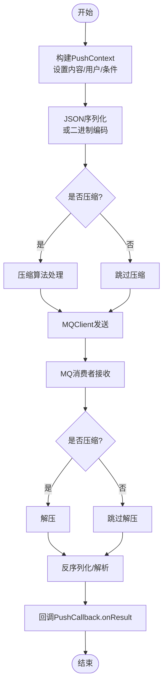
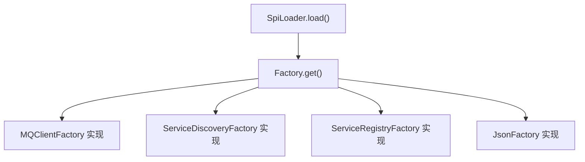

# 第三方集成

<cite>
**本文引用的文件**
- [MQClientFactory.java](file://mpush-api/src/main/java/com/mpush/api/spi/common/MQClientFactory.java)
- [ServiceDiscoveryFactory.java](file://mpush-api/src/main/java/com/mpush/api/spi/common/ServiceDiscoveryFactory.java)
- [ServiceRegistryFactory.java](file://mpush-api/src/main/java/com/mpush/api/spi/common/ServiceRegistryFactory.java)
- [Json.java](file://mpush-api/src/main/java/com/mpush/api/spi/common/Json.java)
- [JsonFactory.java](file://mpush-api/src/main/java/com/mpush/api/spi/common/JsonFactory.java)
- [IPushMessage.java](file://mpush-api/src/main/java/com/mpush/api/spi/push/IPushMessage.java)
- [MessagePusher.java](file://mpush-api/src/main/java/com/mpush/api/spi/push/MessagePusher.java)
- [PushSender.java](file://mpush-api/src/main/java/com/mpush/api/push/PushSender.java)
- [PushContext.java](file://mpush-api/src/main/java/com/mpush/api/push/PushContext.java)
- [PushCallback.java](file://mpush-api/src/main/java/com/mpush/api/push/PushCallback.java)
- [PushResult.java](file://mpush-api/src/main/java/com/mpush/api/push/PushResult.java)
- [PusherFactory.java](file://mpush-api/src/main/java/com/mpush/api/spi/client/PusherFactory.java)
- [RedisMQClientFactory.java](file://mpush-cache/src/main/java/com/mpush/cache/redis/mq/RedisMQClientFactory.java)
- [ZKDiscoveryFactory.java](file://mpush-zk/src/main/java/com/mpush/zk/ZKDiscoveryFactory.java)
- [ZKServiceRegistryAndDiscovery.java](file://mpush-zk/src/main/java/com/mpush/zk/ZKServiceRegistryAndDiscovery.java)
- [SpiLoader.java](file://mpush-api/src/main/java/com/mpush/api/spi/SpiLoader.java)
- [Factory.java](file://mpush-api/src/main/java/com/mpush/api/spi/Factory.java)
- [PushClientTestMain.java](file://mpush-test/src/main/java/com/mpush/test/push/PushClientTestMain.java)
- [SimpleMQClientFactory.java](file://mpush-test/src/main/java/com/mpush/test/spi/SimpleMQClientFactory.java)
- [SimpleDiscoveryFactory.java](file://mpush-test/src/main/java/com/mpush/test/spi/SimpleDiscoveryFactory.java)
- [SimpleRegistryFactory.java](file://mpush-test/src/main/java/com/mpush/test/spi/SimpleRegistryFactory.java)
- [FileCacheManger.java](file://mpush-test/src/main/java/com/mpush/test/spi/FileCacheManger.java)
- [application.conf](file://mpush-test/src/main/resources/application.conf)
- [logback.xml](file://mpush-test/src/main/resources/logback.xml)
</cite>

## 目录
1. [简介](#简介)
2. [项目结构](#项目结构)
3. [核心组件](#核心组件)
4. [架构总览](#架构总览)
5. [详细组件分析](#详细组件分析)
6. [依赖分析](#依赖分析)
7. [性能考虑](#性能考虑)
8. [故障排查指南](#故障排查指南)
9. [结论](#结论)
10. [附录](#附录)

## 简介
本指南面向需要将外部系统与 MPush 进行第三方集成的开发者，围绕以下目标展开：
- 对接消息队列：通过 MQClientFactory 实现自定义 MQ 客户端（如 Redis 集群、其他消息中间件）。
- 对接服务发现与注册：通过 ServiceDiscoveryFactory 和 ServiceRegistryFactory 实现服务发现与注册（如 Zookeeper 集成）。
- 扩展 API 能力：自定义协议支持、数据格式转换、认证授权集成等。
- 数据格式转换：JSON 序列化、二进制协议、压缩算法等适配与转换。
- 常见第三方集成场景：Redis 集群、Zookeeper、其他消息中间件。
- 性能优化与安全考虑。

## 项目结构
MPush 采用模块化设计，核心能力通过 SPI（Service Provider Interface）进行扩展。关键模块如下：
- mpush-api：对外 API 与 SPI 接口定义。
- mpush-cache：缓存与消息队列实现（默认基于 Redis）。
- mpush-zk：基于 Zookeeper 的服务发现与注册实现。
- mpush-test：SPI 扩展示例与集成测试样例。

图表来源
- [PushSender.java](file://mpush-api/src/main/java/com/mpush/api/push/PushSender.java#L33-L71)
- [PushContext.java](file://mpush-api/src/main/java/com/mpush/api/push/PushContext.java#L33-L205)
- [RedisMQClientFactory.java](file://mpush-cache/src/main/java/com/mpush/cache/redis/mq/RedisMQClientFactory.java#L31-L39)
- [ZKDiscoveryFactory.java](file://mpush-zk/src/main/java/com/mpush/zk/ZKDiscoveryFactory.java#L31-L37)

章节来源
- [PushSender.java](file://mpush-api/src/main/java/com/mpush/api/push/PushSender.java#L33-L71)
- [PushContext.java](file://mpush-api/src/main/java/com/mpush/api/push/PushContext.java#L33-L205)

## 核心组件
本节聚焦第三方集成所需的核心接口与实现要点：
- MQClientFactory：消息队列客户端工厂，用于加载 MQ 客户端实现。
- ServiceDiscoveryFactory：服务发现工厂，用于加载服务发现实现。
- ServiceRegistryFactory：服务注册工厂，用于加载服务注册实现。
- Json/JsonFactory：JSON 序列化抽象与工厂，用于数据格式转换。
- PushSender/PushContext：推送发送器与上下文，承载推送参数与结果回调。
- IPushMessage/MessagePusher：推送消息抽象与推送器接口，支持自定义协议与消息体。

章节来源
- [MQClientFactory.java](file://mpush-api/src/main/java/com/mpush/api/spi/common/MQClientFactory.java#L30-L35)
- [ServiceDiscoveryFactory.java](file://mpush-api/src/main/java/com/mpush/api/spi/common/ServiceDiscoveryFactory.java#L32-L36)
- [ServiceRegistryFactory.java](file://mpush-api/src/main/java/com/mpush/api/spi/common/ServiceRegistryFactory.java#L31-L35)
- [Json.java](file://mpush-api/src/main/java/com/mpush/api/spi/common/Json.java#L27-L33)
- [JsonFactory.java](file://mpush-api/src/main/java/com/mpush/api/spi/common/JsonFactory.java#L30-L35)
- [PushSender.java](file://mpush-api/src/main/java/com/mpush/api/push/PushSender.java#L33-L71)
- [PushContext.java](file://mpush-api/src/main/java/com/mpush/api/push/PushContext.java#L33-L205)
- [IPushMessage.java](file://mpush-api/src/main/java/com/mpush/api/spi/push/IPushMessage.java#L29-L57)
- [MessagePusher.java](file://mpush-api/src/main/java/com/mpush/api/spi/push/MessagePusher.java#L27-L29)

## 架构总览
MPush 通过 SPI 机制在运行时动态加载扩展实现。下图展示了从应用到具体实现的关键交互路径：

图表来源
- [PushSender.java](file://mpush-api/src/main/java/com/mpush/api/push/PushSender.java#L40-L42)
- [PusherFactory.java](file://mpush-api/src/main/java/com/mpush/api/spi/client/PusherFactory.java#L31-L35)
- [MQClientFactory.java](file://mpush-api/src/main/java/com/mpush/api/spi/common/MQClientFactory.java#L32-L34)
- [ServiceDiscoveryFactory.java](file://mpush-api/src/main/java/com/mpush/api/spi/common/ServiceDiscoveryFactory.java#L33-L35)
- [ServiceRegistryFactory.java](file://mpush-api/src/main/java/com/mpush/api/spi/common/ServiceRegistryFactory.java#L32-L34)

## 详细组件分析

### 消息队列集成：MQClientFactory
- 设计要点
  - 工厂接口通过 SPI 动态加载实现。
  - 默认实现为基于 Redis 的监听分发器。
- 扩展步骤
  1) 实现 MQClientFactory 接口，并标注 SPI 优先级。
  2) 在资源目录提供服务配置文件，指向你的实现类。
  3) 在 MQClient 中实现消息订阅与分发逻辑。
- 示例参考
  - RedisMQClientFactory：演示了如何通过 SPI 注册并返回 MQClient 实例。
  - mpush-test 中的 SimpleMQClientFactory：提供了最小可用的 SPI 扩展示例，便于快速验证。

图表来源
- [MQClientFactory.java](file://mpush-api/src/main/java/com/mpush/api/spi/common/MQClientFactory.java#L30-L35)
- [RedisMQClientFactory.java](file://mpush-cache/src/main/java/com/mpush/cache/redis/mq/RedisMQClientFactory.java#L31-L39)
- [SimpleMQClientFactory.java](file://mpush-test/src/main/java/com/mpush/test/spi/SimpleMQClientFactory.java)

章节来源
- [RedisMQClientFactory.java](file://mpush-cache/src/main/java/com/mpush/cache/redis/mq/RedisMQClientFactory.java#L31-L39)
- [SimpleMQClientFactory.java](file://mpush-test/src/main/java/com/mpush/test/spi/SimpleMQClientFactory.java)

### 服务发现与注册集成：ServiceDiscoveryFactory 与 ServiceRegistryFactory
- 设计要点
  - 通过 SPI 加载服务发现与注册实现。
  - 默认实现基于 Zookeeper。
- 扩展步骤
  1) 实现 ServiceDiscoveryFactory 与 ServiceRegistryFactory 接口。
  2) 提供服务配置文件，指向实现类。
  3) 在实现中完成节点注册、订阅与事件通知。
- 示例参考
  - ZKDiscoveryFactory：返回 ZKServiceRegistryAndDiscovery 单例实现。
  - mpush-test 中的 SimpleDiscoveryFactory 与 SimpleRegistryFactory：最小可用示例。

图表来源
- [ServiceDiscoveryFactory.java](file://mpush-api/src/main/java/com/mpush/api/spi/common/ServiceDiscoveryFactory.java#L32-L36)
- [ServiceRegistryFactory.java](file://mpush-api/src/main/java/com/mpush/api/spi/common/ServiceRegistryFactory.java#L31-L35)
- [ZKDiscoveryFactory.java](file://mpush-zk/src/main/java/com/mpush/zk/ZKDiscoveryFactory.java#L31-L37)
- [SimpleDiscoveryFactory.java](file://mpush-test/src/main/java/com/mpush/test/spi/SimpleDiscoveryFactory.java)
- [SimpleRegistryFactory.java](file://mpush-test/src/main/java/com/mpush/test/spi/SimpleRegistryFactory.java)

章节来源
- [ZKDiscoveryFactory.java](file://mpush-zk/src/main/java/com/mpush/zk/ZKDiscoveryFactory.java#L31-L37)
- [SimpleDiscoveryFactory.java](file://mpush-test/src/main/java/com/mpush/test/spi/SimpleDiscoveryFactory.java)
- [SimpleRegistryFactory.java](file://mpush-test/src/main/java/com/mpush/test/spi/SimpleRegistryFactory.java)

### API 扩展：自定义协议、数据格式转换、认证授权
- 自定义协议支持
  - 使用 IPushMessage 抽象消息内容，支持广播、用户标识、客户端类型、ACK 模型、超时等字段。
  - 使用 MessagePusher 接口定义推送行为，便于替换为自定义协议实现。
- 数据格式转换
  - 通过 Json/JsonFactory 抽象 JSON 序列化，可在不同实现间切换。
  - 可在 MQ 层或推送层对消息体进行二进制/压缩处理（需自行实现适配器）。
- 认证授权集成
  - 在 PushContext 中可扩展附加鉴权信息（如令牌、签名），在 PushSender 实现中进行校验与转发。
  - 结合 PushCallback 的 onResult 回调，记录鉴权结果与状态。

图表来源
- [IPushMessage.java](file://mpush-api/src/main/java/com/mpush/api/spi/push/IPushMessage.java#L29-L57)
- [MessagePusher.java](file://mpush-api/src/main/java/com/mpush/api/spi/push/MessagePusher.java#L27-L29)
- [Json.java](file://mpush-api/src/main/java/com/mpush/api/spi/common/Json.java#L27-L33)
- [PushContext.java](file://mpush-api/src/main/java/com/mpush/api/push/PushContext.java#L105-L111)

章节来源
- [IPushMessage.java](file://mpush-api/src/main/java/com/mpush/api/spi/push/IPushMessage.java#L29-L57)
- [MessagePusher.java](file://mpush-api/src/main/java/com/mpush/api/spi/push/MessagePusher.java#L27-L29)
- [Json.java](file://mpush-api/src/main/java/com/mpush/api/spi/common/Json.java#L27-L33)
- [PushContext.java](file://mpush-api/src/main/java/com/mpush/api/push/PushContext.java#L105-L111)

### 推送流程与结果回调
- 发送流程
  - 应用通过 PushSender.send(PushContext) 触发推送。
  - 返回 FutureTask，可用于同步等待结果。
- 结果回调
  - PushCallback.onResult 根据 PushResult 的 resultCode 分发成功/失败/离线/超时等分支。
  - PushResult 提供描述性文本与时间线信息，便于诊断。

图表来源
- [PushSender.java](file://mpush-api/src/main/java/com/mpush/api/push/PushSender.java#L50-L67)
- [PushCallback.java](file://mpush-api/src/main/java/com/mpush/api/push/PushCallback.java#L14-L29)
- [PushResult.java](file://mpush-api/src/main/java/com/mpush/api/push/PushResult.java#L31-L93)

章节来源
- [PushSender.java](file://mpush-api/src/main/java/com/mpush/api/push/PushSender.java#L50-L67)
- [PushCallback.java](file://mpush-api/src/main/java/com/mpush/api/push/PushCallback.java#L14-L29)
- [PushResult.java](file://mpush-api/src/main/java/com/mpush/api/push/PushResult.java#L31-L93)

### 数据格式转换机制
- JSON 序列化
  - 通过 JsonFactory.create() 获取 Json 实例，统一 fromJson/toJson 行为。
- 二进制协议与压缩
  - 可在 MQ 层或推送层实现自定义编解码器，对消息体进行二进制编码与压缩。
  - 建议在 PushContext 中保留原始字节流，以便在不同层做透明转换。
- 编解码流程示意

图表来源
- [Json.java](file://mpush-api/src/main/java/com/mpush/api/spi/common/Json.java#L30-L32)
- [PushContext.java](file://mpush-api/src/main/java/com/mpush/api/push/PushContext.java#L97-L103)

章节来源
- [Json.java](file://mpush-api/src/main/java/com/mpush/api/spi/common/Json.java#L30-L32)
- [PushContext.java](file://mpush-api/src/main/java/com/mpush/api/push/PushContext.java#L97-L103)

### 第三方系统集成指南

#### Redis 集群集成
- 使用场景
  - 作为消息队列与缓存后端，适合高吞吐与低延迟推送。
- 实现要点
  - 基于 RedisMQClientFactory 的思路，实现 MQClientFactory 接口。
  - 在 MQClient 中实现订阅/发布与监听分发。
  - 通过 SPI 配置文件注册实现类。
- 集成测试
  - 参考 mpush-test 中的 PushClientTestMain 与 SimpleMQClientFactory，验证消息收发链路。

章节来源
- [RedisMQClientFactory.java](file://mpush-cache/src/main/java/com/mpush/cache/redis/mq/RedisMQClientFactory.java#L31-L39)
- [PushClientTestMain.java](file://mpush-test/src/main/java/com/mpush/test/push/PushClientTestMain.java)

#### Zookeeper 服务集成
- 使用场景
  - 服务发现与注册，集中管理节点元数据与事件通知。
- 实现要点
  - 基于 ZKDiscoveryFactory 的思路，实现 ServiceDiscoveryFactory 与 ServiceRegistryFactory。
  - 在实现中完成节点注册、订阅与事件回调。
- 集成测试
  - 参考 ZKDiscoveryFactory 与 ZKServiceRegistryAndDiscovery 的实现，验证服务发现/注册流程。

章节来源
- [ZKDiscoveryFactory.java](file://mpush-zk/src/main/java/com/mpush/zk/ZKDiscoveryFactory.java#L31-L37)
- [ZKServiceRegistryAndDiscovery.java](file://mpush-zk/src/main/java/com/mpush/zk/ZKServiceRegistryAndDiscovery.java)

#### 其他消息中间件集成
- 通用步骤
  1) 实现 MQClientFactory 接口，返回自定义 MQClient。
  2) 在 MQClient 中实现订阅、取消订阅、消息分发。
  3) 通过 SPI 配置文件注册实现类。
- 注意事项
  - 保证线程安全与幂等性。
  - 处理网络异常与重连策略。
  - 与 PushContext 的内容格式保持一致。

章节来源
- [MQClientFactory.java](file://mpush-api/src/main/java/com/mpush/api/spi/common/MQClientFactory.java#L30-L35)
- [SimpleMQClientFactory.java](file://mpush-test/src/main/java/com/mpush/test/spi/SimpleMQClientFactory.java)

### 集成测试方法
- 测试环境准备
  - application.conf：配置日志、端口、集群地址等。
  - logback.xml：配置日志输出级别与格式。
- 推荐测试流程
  1) 启动本地或模拟的第三方服务（如 Redis/ZK）。
  2) 通过 SPI 注册自定义实现。
  3) 使用 PushClientTestMain 或自定义测试入口，构造 PushContext 并调用 PushSender.send。
  4) 观察回调结果与日志，验证链路完整性与性能指标。

章节来源
- [application.conf](file://mpush-test/src/main/resources/application.conf)
- [logback.xml](file://mpush-test/src/main/resources/logback.xml)
- [PushClientTestMain.java](file://mpush-test/src/main/java/com/mpush/test/push/PushClientTestMain.java)

## 依赖分析
- SPI 加载机制
  - 通过 SpiLoader.load(factoryClass).get() 动态加载实现。
  - Factory 接口定义 get() 方法，返回具体实现对象。
- 组件耦合
  - API 层仅依赖接口，实现层通过 SPI 解耦。
  - 扩展实现无需修改核心代码，降低耦合度。

图表来源
- [SpiLoader.java](file://mpush-api/src/main/java/com/mpush/api/spi/SpiLoader.java)
- [Factory.java](file://mpush-api/src/main/java/com/mpush/api/spi/Factory.java)

章节来源
- [SpiLoader.java](file://mpush-api/src/main/java/com/mpush/api/spi/SpiLoader.java)
- [Factory.java](file://mpush-api/src/main/java/com/mpush/api/spi/Factory.java)

## 性能考虑
- 线程模型
  - 使用异步回调与线程池，避免阻塞主流程。
  - 在 MQ 层实现批处理与缓冲，减少频繁唤醒。
- 网络与序列化
  - 优先选择高效的二进制协议与压缩算法。
  - 控制消息大小与频率，避免拥塞。
- 缓存与路由
  - 利用本地缓存与路由表，减少跨节点查询。
  - 合理设置 TTL 与失效策略，平衡一致性与性能。
- 监控与可观测性
  - 通过 PushResult 的时间线与描述信息定位瓶颈。
  - 结合日志与指标，持续优化关键路径。

## 故障排查指南
- 常见问题
  - SPI 未正确注册：检查 META-INF/services 下的实现类路径。
  - 网络连接异常：确认第三方服务可达性与认证配置。
  - 消息丢失：核查 MQ 的持久化与消费确认机制。
  - 回调未触发：检查 PushCallback 的实现与线程上下文。
- 排查步骤
  1) 查看日志输出，定位错误发生阶段。
  2) 校验 PushContext 参数（用户、条件、超时）。
  3) 验证 MQ/服务发现/注册的健康状态。
  4) 使用最小化示例（如 SimpleMQClientFactory）隔离问题。

章节来源
- [logback.xml](file://mpush-test/src/main/resources/logback.xml)
- [PushResult.java](file://mpush-api/src/main/java/com/mpush/api/push/PushResult.java#L81-L93)

## 结论
通过 SPI 机制，MPush 将核心能力与第三方实现解耦，开发者可按需替换 MQ、服务发现与注册、序列化等组件。遵循本文的扩展步骤与最佳实践，可在保证性能与安全的前提下，快速完成 Redis、Zookeeper 或其他消息中间件的集成。

## 附录
- 关键接口速查
  - MQClientFactory：消息队列客户端工厂
  - ServiceDiscoveryFactory：服务发现工厂
  - ServiceRegistryFactory：服务注册工厂
  - Json/JsonFactory：JSON 序列化抽象
  - PushSender/PushContext：推送发送器与上下文
  - IPushMessage/MessagePusher：消息抽象与推送器
- 示例工程
  - mpush-test：包含 SPI 扩展示例与测试入口