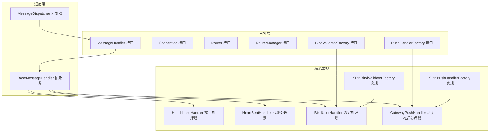
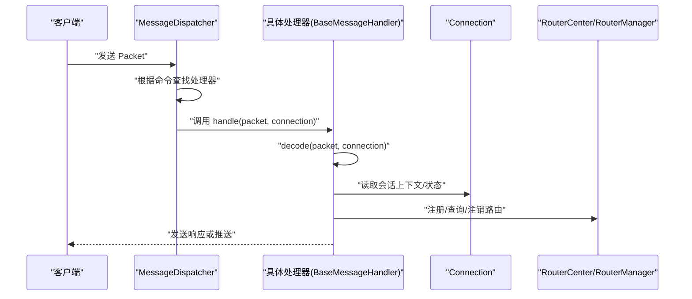
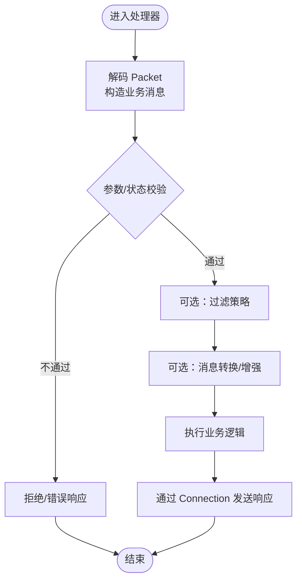
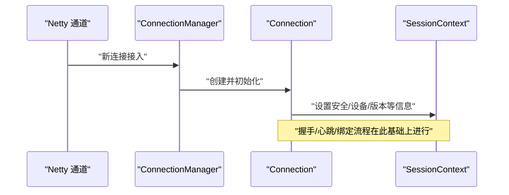
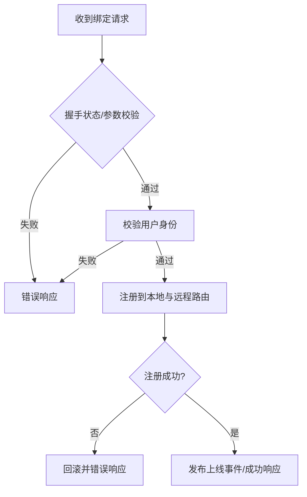
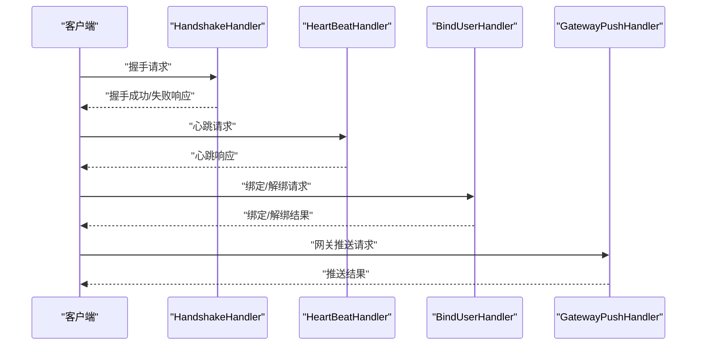
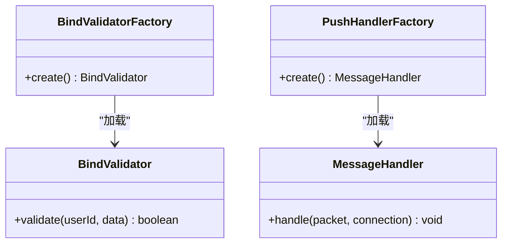
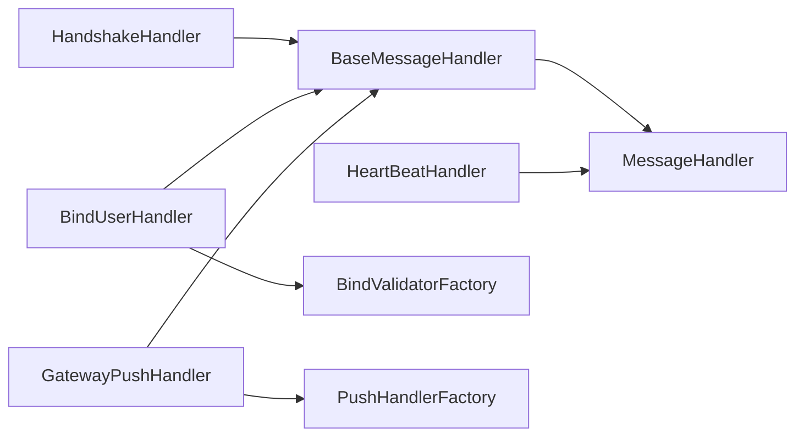

# 自定义处理器开发

<cite>
**本文引用的文件**
- [BindValidatorFactory.java](file://mpush-api/src/main/java/com/mpush/api/spi/handler/BindValidatorFactory.java)
- [PushHandlerFactory.java](file://mpush-api/src/main/java/com/mpush/api/spi/handler/PushHandlerFactory.java)
- [MessageHandler.java](file://mpush-api/src/main/java/com/mpush/api/message/MessageHandler.java)
- [Connection.java](file://mpush-api/src/main/java/com/mpush/api/connection/Connection.java)
- [Router.java](file://mpush-api/src/main/java/com/mpush/api/router/Router.java)
- [RouterManager.java](file://mpush-api/src/main/java/com/mpush/api/router/RouterManager.java)
- [BindValidator.java](file://mpush-api/src/main/java/com/mpush/api/spi/handler/BindValidator.java)
- [BaseMessageHandler.java](file://mpush-common/src/main/java/com/mpush/common/handler/BaseMessageHandler.java)
- [HandshakeHandler.java](file://mpush-core/src/main/java/com/mpush/core/handler/HandshakeHandler.java)
- [HeartBeatHandler.java](file://mpush-core/src/main/java/com/mpush/core/handler/HeartBeatHandler.java)
- [BindUserHandler.java](file://mpush-core/src/main/java/com/mpush/core/handler/BindUserHandler.java)
- [GatewayPushHandler.java](file://mpush-core/src/main/java/com/mpush/core/handler/GatewayPushHandler.java)
- [MessageDispatcher.java](file://mpush-common/src/main/java/com/mpush/common/MessageDispatcher.java)
- [BindValidatorFactory SPI 配置](file://mpush-core/src/main/resources/META-INF/services/com.mpush.api.spi.handler.BindValidatorFactory)
- [PushHandlerFactory SPI 配置](file://mpush-core/src/main/resources/META-INF/services/com.mpush.api.spi.handler.PushHandlerFactory)
</cite>

## 目录
1. [简介](#简介)
2. [项目结构](#项目结构)
3. [核心组件](#核心组件)
4. [架构总览](#架构总览)
5. [详细组件分析](#详细组件分析)
6. [依赖分析](#依赖分析)
7. [性能考虑](#性能考虑)
8. [故障排查指南](#故障排查指南)
9. [结论](#结论)
10. [附录](#附录)

## 简介
本指导文档面向希望在 MPush 中开发自定义处理器的工程师，系统讲解消息处理器、连接处理器与路由处理器的开发方法，并结合内置处理器（如握手、心跳、绑定用户、网关推送）演示实际应用。文档同时覆盖处理器链设计、异常处理、性能优化、调试与测试等最佳实践，并通过 BindValidatorFactory 与 PushHandlerFactory 等 SPI 工厂接口给出可直接落地的实现与集成范式。

## 项目结构
MPush 将“协议/连接/消息/路由/推送”等能力抽象在 api 模块中，核心实现集中在 core 模块，通用工具与默认实现位于 common 模块。处理器开发主要围绕以下模块展开：
- mpush-api：定义处理器接口、连接接口、路由接口、SPI 工厂等
- mpush-common：提供基础消息处理器基类、消息分发器等
- mpush-core：内置处理器实现（握手、心跳、绑定用户、网关推送等），以及 SPI 实现注册

图表来源
- [MessageHandler.java](file://mpush-api/src/main/java/com/mpush/api/message/MessageHandler.java#L30-L32)
- [Connection.java](file://mpush-api/src/main/java/com/mpush/api/connection/Connection.java#L32-L62)
- [Router.java](file://mpush-api/src/main/java/com/mpush/api/router/Router.java#L27-L37)
- [RouterManager.java](file://mpush-api/src/main/java/com/mpush/api/router/RouterManager.java#L29-L65)
- [BaseMessageHandler.java](file://mpush-common/src/main/java/com/mpush/common/handler/BaseMessageHandler.java#L34-L70)
- [MessageDispatcher.java](file://mpush-common/src/main/java/com/mpush/common/MessageDispatcher.java#L46-L80)
- [HandshakeHandler.java](file://mpush-core/src/main/java/com/mpush/core/handler/HandshakeHandler.java#L47-L159)
- [HeartBeatHandler.java](file://mpush-core/src/main/java/com/mpush/core/handler/HeartBeatHandler.java#L32-L39)
- [BindUserHandler.java](file://mpush-core/src/main/java/com/mpush/core/handler/BindUserHandler.java#L50-L184)
- [GatewayPushHandler.java](file://mpush-core/src/main/java/com/mpush/core/handler/GatewayPushHandler.java#L33-L49)
- [BindValidatorFactory.java](file://mpush-api/src/main/java/com/mpush/api/spi/handler/BindValidatorFactory.java#L30-L34)
- [PushHandlerFactory.java](file://mpush-api/src/main/java/com/mpush/api/spi/handler/PushHandlerFactory.java#L31-L35)

章节来源
- [MessageHandler.java](file://mpush-api/src/main/java/com/mpush/api/message/MessageHandler.java#L30-L32)
- [BaseMessageHandler.java](file://mpush-common/src/main/java/com/mpush/common/handler/BaseMessageHandler.java#L34-L70)
- [MessageDispatcher.java](file://mpush-common/src/main/java/com/mpush/common/MessageDispatcher.java#L46-L80)

## 核心组件
- 处理器接口与基类
  - MessageHandler：统一的消息处理入口，接收 Packet 与 Connection
  - BaseMessageHandler：提供解码与执行的模板方法，自动记录耗时
- 连接接口
  - Connection：封装底层通道、会话上下文、发送/关闭、读写超时等
- 路由接口
  - Router/RouterManager：定义路由值、路由类型（本地/远程）与注册/查询/注销能力
- SPI 工厂
  - BindValidatorFactory：绑定校验器工厂
  - PushHandlerFactory：推送处理器工厂

章节来源
- [MessageHandler.java](file://mpush-api/src/main/java/com/mpush/api/message/MessageHandler.java#L30-L32)
- [BaseMessageHandler.java](file://mpush-common/src/main/java/com/mpush/common/handler/BaseMessageHandler.java#L34-L70)
- [Connection.java](file://mpush-api/src/main/java/com/mpush/api/connection/Connection.java#L32-L62)
- [Router.java](file://mpush-api/src/main/java/com/mpush/api/router/Router.java#L27-L37)
- [RouterManager.java](file://mpush-api/src/main/java/com/mpush/api/router/RouterManager.java#L29-L65)
- [BindValidatorFactory.java](file://mpush-api/src/main/java/com/mpush/api/spi/handler/BindValidatorFactory.java#L30-L34)
- [PushHandlerFactory.java](file://mpush-api/src/main/java/com/mpush/api/spi/handler/PushHandlerFactory.java#L31-L35)

## 架构总览
MPush 的处理器体系以“消息分发器 + 处理器基类 + 具体处理器 + SPI 工厂”为核心，形成清晰的职责边界与扩展点。消息到达后由分发器根据命令选择对应处理器，处理器通过 Connection 与路由中心交互，完成业务逻辑。

图表来源
- [MessageDispatcher.java](file://mpush-common/src/main/java/com/mpush/common/MessageDispatcher.java#L46-L80)
- [BaseMessageHandler.java](file://mpush-common/src/main/java/com/mpush/common/handler/BaseMessageHandler.java#L42-L53)
- [Connection.java](file://mpush-api/src/main/java/com/mpush/api/connection/Connection.java#L37-L61)
- [RouterManager.java](file://mpush-api/src/main/java/com/mpush/api/router/RouterManager.java#L29-L65)

## 详细组件分析

### 消息处理器开发
- 开发步骤
  - 继承 BaseMessageHandler，实现 decode 与 handle 两个抽象方法
  - 在 handle 中进行业务处理，必要时通过 Connection 发送响应
  - 使用 MessageDispatcher 注册命令与处理器映射
- 消息拦截/过滤/转换
  - 拦截：在 decode 前对 Packet 进行预检（如命令合法性、版本校验）
  - 过滤：根据会话状态（未握手、黑名单）决定是否继续处理
  - 转换：在 decode 中将 Packet 解码为业务消息对象，支持 JSON/二进制等格式

图表来源
- [BaseMessageHandler.java](file://mpush-common/src/main/java/com/mpush/common/handler/BaseMessageHandler.java#L42-L53)
- [MessageHandler.java](file://mpush-api/src/main/java/com/mpush/api/message/MessageHandler.java#L30-L32)

章节来源
- [BaseMessageHandler.java](file://mpush-common/src/main/java/com/mpush/common/handler/BaseMessageHandler.java#L34-L70)
- [MessageDispatcher.java](file://mpush-common/src/main/java/com/mpush/common/MessageDispatcher.java#L46-L80)

### 连接处理器实现原理
- 连接建立
  - 通过 Netty 通道初始化 Connection，设置安全模式与会话上下文
- 连接验证
  - 握手阶段进行设备标识、密钥材料等校验；重复握手检测
- 连接管理
  - 维护连接状态（新建/已连接/断开）、读写超时、心跳周期
  - 提供发送、关闭、获取通道等能力

图表来源
- [Connection.java](file://mpush-api/src/main/java/com/mpush/api/connection/Connection.java#L32-L62)
- [ConnectionManager.java](file://mpush-api/src/main/java/com/mpush/api/connection/ConnectionManager.java#L31-L44)

章节来源
- [Connection.java](file://mpush-api/src/main/java/com/mpush/api/connection/Connection.java#L32-L62)
- [ConnectionManager.java](file://mpush-api/src/main/java/com/mpush/api/connection/ConnectionManager.java#L31-L44)

### 路由处理器开发方法
- 路由规则定义
  - 以用户维度注册路由，区分本地与远程路由
  - 路由值包含设备标识、会话上下文等
- 路由决策
  - 绑定时先校验握手状态与身份，再注册到本地与远程
  - 解绑时需确保同一设备才能解除绑定
- 路由更新
  - 通过 RouterManager 的 register/lookup/unRegister 完成增删改查
  - 广播用户上线/下线事件，驱动订阅方刷新

图表来源
- [BindUserHandler.java](file://mpush-core/src/main/java/com/mpush/core/handler/BindUserHandler.java#L66-L118)
- [RouterManager.java](file://mpush-api/src/main/java/com/mpush/api/router/RouterManager.java#L29-L65)

章节来源
- [BindUserHandler.java](file://mpush-core/src/main/java/com/mpush/core/handler/BindUserHandler.java#L50-L184)
- [Router.java](file://mpush-api/src/main/java/com/mpush/api/router/Router.java#L27-L37)
- [RouterManager.java](file://mpush-api/src/main/java/com/mpush/api/router/RouterManager.java#L29-L65)

### 内置处理器实战
- 握手处理器（HandshakeHandler）
  - 支持安全/非安全两种握手路径，生成会话密钥、心跳周期，缓存可复用会话
  - 关键流程：参数校验 → 重复握手判断 → 密钥协商/切换 → 响应成功 → 更新会话上下文
- 心跳处理器（HeartBeatHandler）
  - 直接回显 ping 为 pong，维持连接活性
- 绑定用户处理器（BindUserHandler）
  - 通过 BindValidatorFactory 获取校验器，完成用户绑定/解绑与路由注册/注销
- 网关推送处理器（GatewayPushHandler）
  - 将网关推送消息交由 PushCenter 执行推送

图表来源
- [HandshakeHandler.java](file://mpush-core/src/main/java/com/mpush/core/handler/HandshakeHandler.java#L61-L127)
- [HeartBeatHandler.java](file://mpush-core/src/main/java/com/mpush/core/handler/HeartBeatHandler.java#L34-L38)
- [BindUserHandler.java](file://mpush-core/src/main/java/com/mpush/core/handler/BindUserHandler.java#L66-L118)
- [GatewayPushHandler.java](file://mpush-core/src/main/java/com/mpush/core/handler/GatewayPushHandler.java#L47-L49)

章节来源
- [HandshakeHandler.java](file://mpush-core/src/main/java/com/mpush/core/handler/HandshakeHandler.java#L47-L159)
- [HeartBeatHandler.java](file://mpush-core/src/main/java/com/mpush/core/handler/HeartBeatHandler.java#L32-L39)
- [BindUserHandler.java](file://mpush-core/src/main/java/com/mpush/core/handler/BindUserHandler.java#L50-L184)
- [GatewayPushHandler.java](file://mpush-core/src/main/java/com/mpush/core/handler/GatewayPushHandler.java#L33-L49)

### 处理器工厂与自定义实现
- BindValidatorFactory
  - 通过 SPI 加载，默认实现位于 core 模块资源目录
  - 可自定义实现并覆盖默认工厂，以注入新的绑定校验逻辑
- PushHandlerFactory
  - 通过 SPI 加载默认的推送处理器（如 ClientPushHandler）
  - 可替换为自定义推送处理器，实现差异化推送策略

图表来源
- [BindValidatorFactory.java](file://mpush-api/src/main/java/com/mpush/api/spi/handler/BindValidatorFactory.java#L30-L34)
- [PushHandlerFactory.java](file://mpush-api/src/main/java/com/mpush/api/spi/handler/PushHandlerFactory.java#L31-L35)
- [BindValidator.java](file://mpush-api/src/main/java/com/mpush/api/spi/handler/BindValidator.java#L29-L31)

章节来源
- [BindValidatorFactory.java](file://mpush-api/src/main/java/com/mpush/api/spi/handler/BindValidatorFactory.java#L30-L34)
- [PushHandlerFactory.java](file://mpush-api/src/main/java/com/mpush/api/spi/handler/PushHandlerFactory.java#L31-L35)
- [BindValidatorFactory SPI 配置](file://mpush-core/src/main/resources/META-INF/services/com.mpush.api.spi.handler.BindValidatorFactory#L1-L1)
- [PushHandlerFactory SPI 配置](file://mpush-core/src/main/resources/META-INF/services/com.mpush.api.spi.handler.PushHandlerFactory#L1-L1)

## 依赖分析
- 组件耦合
  - 处理器依赖 Connection 与 RouterCenter，通过会话上下文与路由管理完成业务
  - BaseMessageHandler 统一了解码与执行流程，降低重复代码
- 外部依赖
  - Netty 通道与事件模型
  - SPI 机制用于工厂扩展与替换
- 循环依赖
  - 当前结构清晰，未见循环依赖迹象

图表来源
- [BaseMessageHandler.java](file://mpush-common/src/main/java/com/mpush/common/handler/BaseMessageHandler.java#L34-L70)
- [HandshakeHandler.java](file://mpush-core/src/main/java/com/mpush/core/handler/HandshakeHandler.java#L47-L53)
- [HeartBeatHandler.java](file://mpush-core/src/main/java/com/mpush/core/handler/HeartBeatHandler.java#L32-L39)
- [BindUserHandler.java](file://mpush-core/src/main/java/com/mpush/core/handler/BindUserHandler.java#L50-L58)
- [GatewayPushHandler.java](file://mpush-core/src/main/java/com/mpush/core/handler/GatewayPushHandler.java#L33-L39)
- [BindValidatorFactory.java](file://mpush-api/src/main/java/com/mpush/api/spi/handler/BindValidatorFactory.java#L30-L34)
- [PushHandlerFactory.java](file://mpush-api/src/main/java/com/mpush/api/spi/handler/PushHandlerFactory.java#L31-L35)

章节来源
- [BaseMessageHandler.java](file://mpush-common/src/main/java/com/mpush/common/handler/BaseMessageHandler.java#L34-L70)
- [BindUserHandler.java](file://mpush-core/src/main/java/com/mpush/core/handler/BindUserHandler.java#L50-L58)
- [GatewayPushHandler.java](file://mpush-core/src/main/java/com/mpush/core/handler/GatewayPushHandler.java#L33-L39)

## 性能考虑
- 解码与执行分离
  - 利用 BaseMessageHandler 的模板方法，将耗时统计与业务处理拆分，便于定位瓶颈
- 会话与路由缓存
  - 握手成功后生成可复用会话，减少重复握手成本
  - 路由注册/查询采用本地与远程双写/查询策略，注意一致性与延迟权衡
- 异步发送与监听
  - 通过 Connection 的异步发送与回调监听，避免阻塞 IO 线程
- 流控与限速
  - 结合全局/精确流控策略，防止突发流量冲击

## 故障排查指南
- 握手失败
  - 参数非法、重复握手、密钥长度不匹配等均会导致握手失败
  - 建议检查设备标识、密钥材料与会话上下文
- 绑定失败
  - 未握手即绑定、路由注册部分失败、设备不一致导致解绑失败
  - 建议核对握手状态、路由注册结果与设备标识
- 心跳异常
  - 心跳未回显或超时，检查连接状态与读写超时配置
- 推送异常
  - 网关推送处理器仅负责转发，若推送失败需查看 PushCenter 与下游实现

章节来源
- [HandshakeHandler.java](file://mpush-core/src/main/java/com/mpush/core/handler/HandshakeHandler.java#L75-L90)
- [BindUserHandler.java](file://mpush-core/src/main/java/com/mpush/core/handler/BindUserHandler.java#L114-L117)
- [HeartBeatHandler.java](file://mpush-core/src/main/java/com/mpush/core/handler/HeartBeatHandler.java#L34-L38)
- [GatewayPushHandler.java](file://mpush-core/src/main/java/com/mpush/core/handler/GatewayPushHandler.java#L47-L49)

## 结论
通过统一的处理器接口、完善的基类与 SPI 工厂机制，MPush 为自定义处理器提供了清晰的扩展路径。开发者可基于 BaseMessageHandler 快速实现消息处理，结合 Connection 与 RouterCenter 完成连接与路由管理，并通过 SPI 工厂灵活替换默认实现。建议在开发中遵循处理器链设计、异常处理与性能优化规范，确保系统的稳定性与可维护性。

## 附录
- 处理器开发清单
  - 明确命令与消息模型，继承 BaseMessageHandler
  - 在 decode 中完成解码与预处理
  - 在 handle 中实现业务逻辑，必要时访问路由中心
  - 通过 MessageDispatcher 注册命令映射
  - 通过 SPI 配置文件注册自定义工厂实现
- 测试建议
  - 单元测试：针对 decode/handle 的边界条件与异常分支
  - 集成测试：模拟握手、绑定、心跳、推送完整链路
  - 性能测试：压测不同负载下的吞吐与延迟