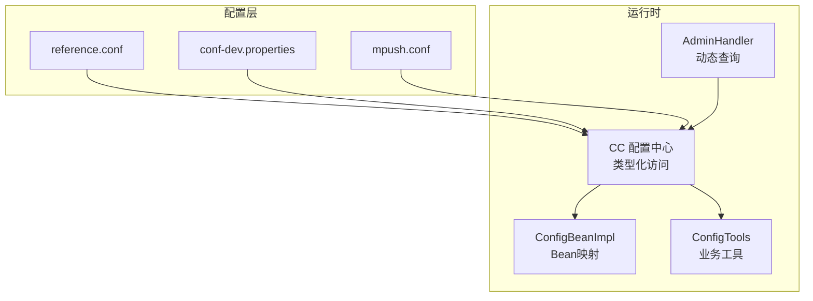
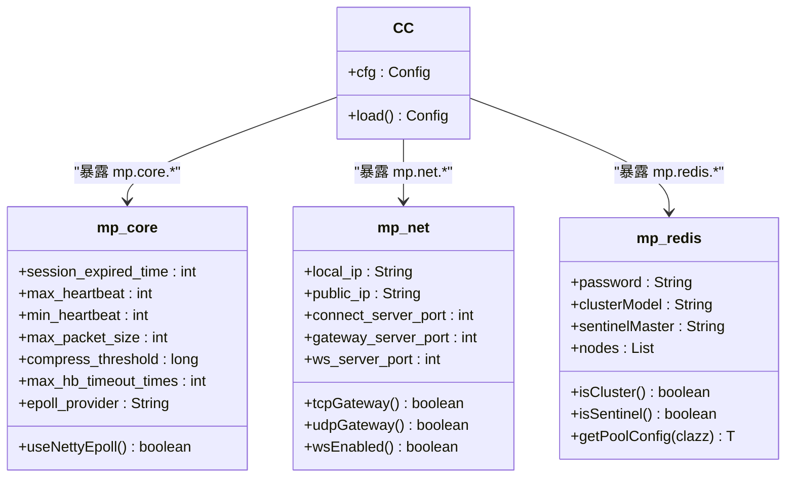
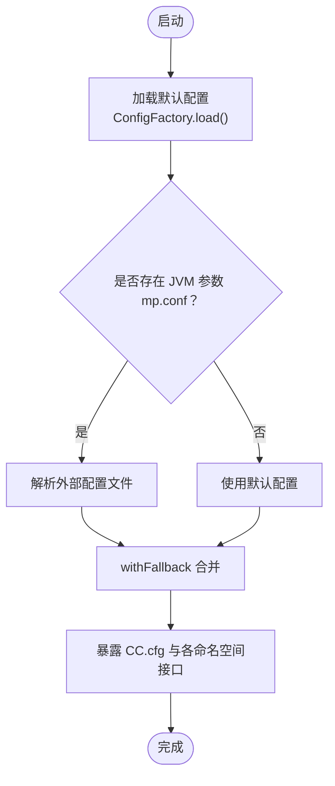
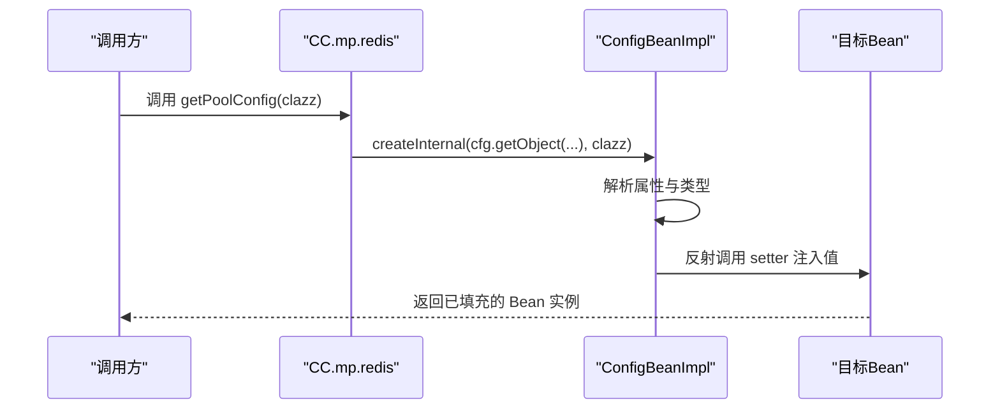
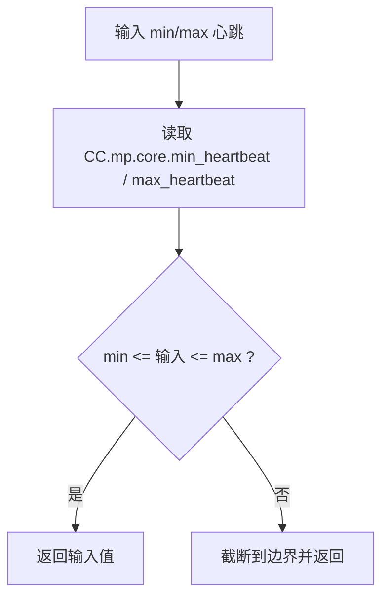
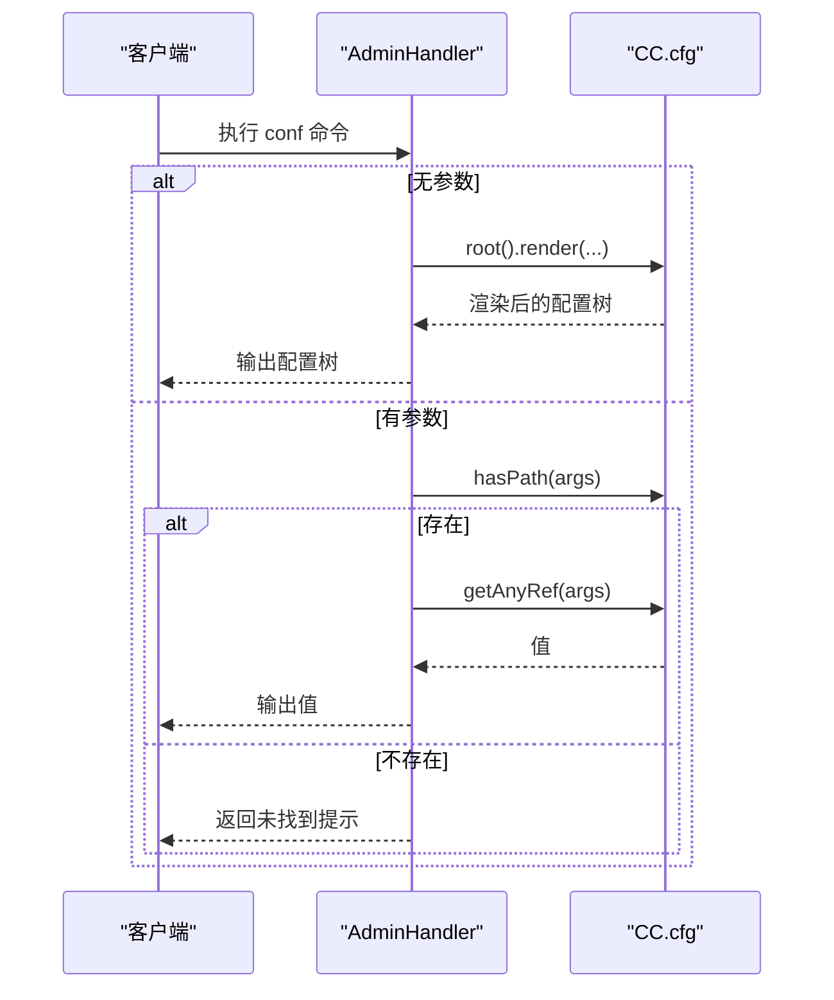
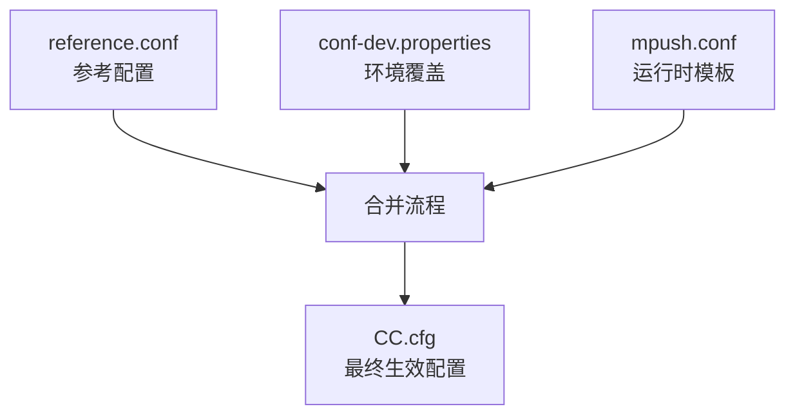
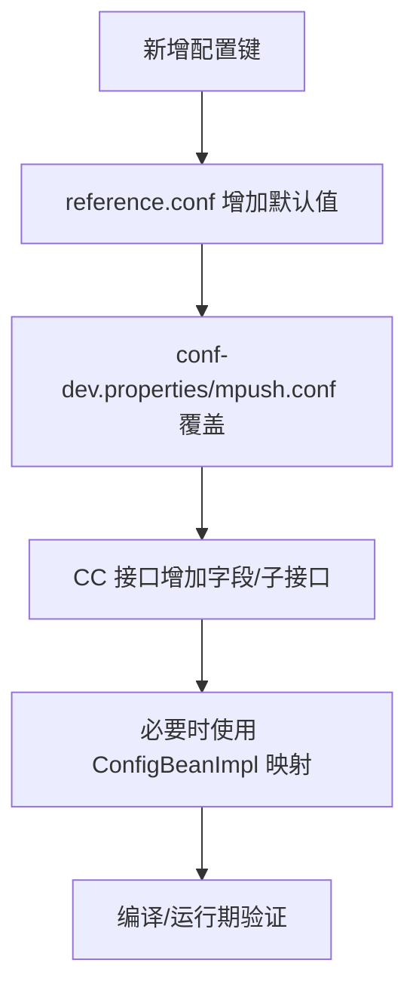
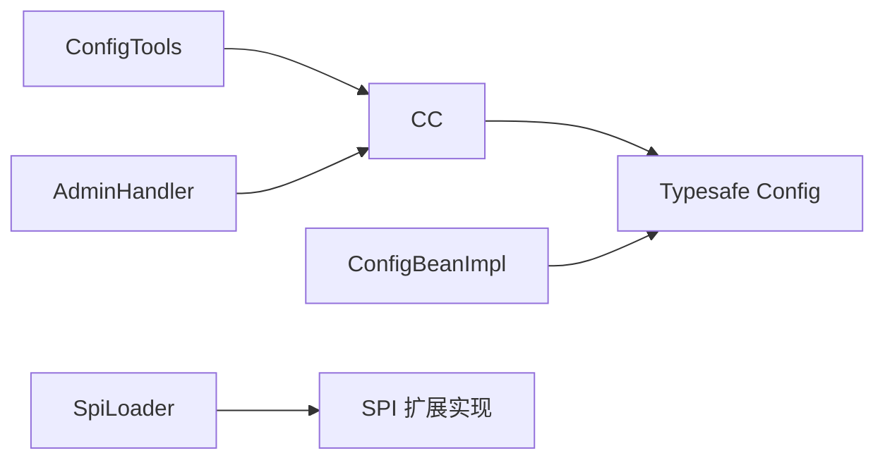

# 配置管理扩展

<cite>
**本文引用的文件**   
- [CC.java](file://mpush-tools/src/main/java/com/mpush/tools/config/CC.java)
- [ConfigBeanImpl.java](file://mpush-tools/src/main/java/com/mpush/tools/config/ConfigBeanImpl.java)
- [ConfigTools.java](file://mpush-tools/src/main/java/com/mpush/tools/config/ConfigTools.java)
- [RedisNode.java](file://mpush-tools/src/main/java/com/mpush/tools/config/data/RedisNode.java)
- [reference.conf](file://conf/reference.conf)
- [conf-dev.properties](file://conf/conf-dev.properties)
- [mpush.conf](file://mpush-boot/src/main/resources/mpush.conf)
- [ConfigCenterTest.java](file://mpush-test/src/main/java/com/mpush/test/configcenter/ConfigCenterTest.java)
- [AdminHandler.java](file://mpush-core/src/main/java/com/mpush/core/handler/AdminHandler.java)
- [SpiLoader.java](file://mpush-api/src/main/java/com/mpush/api/spi/SpiLoader.java)
</cite>

## 目录
1. [简介](#简介)
2. [项目结构](#项目结构)
3. [核心组件](#核心组件)
4. [架构总览](#架构总览)
5. [详细组件分析](#详细组件分析)
6. [依赖分析](#依赖分析)
7. [性能考虑](#性能考虑)
8. [故障排查指南](#故障排查指南)
9. [结论](#结论)
10. [附录](#附录)

## 简介
本文件面向希望扩展与深度使用 MPush 配置管理能力的开发者，围绕 CC 配置中心的设计与实现，系统讲解配置项定义、配置值获取、类型映射与默认值策略、动态配置查询与调试接口、以及 HOCON/Properties 格式配置文件的编写与最佳实践。文档同时结合 reference.conf、conf-dev.properties 与 mpush.conf 的实际示例，帮助读者快速掌握从静态配置到动态运维查询的完整配置生命周期。

## 项目结构
MPush 的配置体系主要由以下模块构成：
- 配置中心与类型映射：CC 接口及其子命名空间（如 mp.core、mp.net、mp.redis 等），通过 Typesafe Config 解析并暴露强类型访问。
- 配置工具类：ConfigTools 提供基于 CC 的业务级便捷函数（如心跳区间校验、IP 解析）。
- 配置 Bean 映射：ConfigBeanImpl 将 Typesafe Config 的对象自动映射为 Java Bean，支持复杂嵌套结构与集合类型。
- 配置文件：reference.conf（参考配置）、conf-dev.properties（开发环境覆盖）、mpush.conf（运行时模板与变量替换）。
- 动态查询：AdminHandler 暴露 /admin 控制台命令，支持实时查看与检索配置。
- 测试与生成：ConfigCenterTest 提供配置键枚举与 CC 接口生成辅助逻辑。

**图示来源**
- [reference.conf](file://conf/reference.conf#L1-L239)
- [conf-dev.properties](file://conf/conf-dev.properties#L1-L5)
- [mpush.conf](file://mpush-boot/src/main/resources/mpush.conf#L1-L16)
- [CC.java](file://mpush-tools/src/main/java/com/mpush/tools/config/CC.java#L39-L53)
- [ConfigBeanImpl.java](file://mpush-tools/src/main/java/com/mpush/tools/config/ConfigBeanImpl.java#L41-L95)
- [ConfigTools.java](file://mpush-tools/src/main/java/com/mpush/tools/config/ConfigTools.java#L30-L90)
- [AdminHandler.java](file://mpush-core/src/main/java/com/mpush/core/handler/AdminHandler.java#L103-L111)

**章节来源**
- [reference.conf](file://conf/reference.conf#L1-L239)
- [conf-dev.properties](file://conf/conf-dev.properties#L1-L5)
- [mpush.conf](file://mpush-boot/src/main/resources/mpush.conf#L1-L16)
- [CC.java](file://mpush-tools/src/main/java/com/mpush/tools/config/CC.java#L39-L53)
- [ConfigBeanImpl.java](file://mpush-tools/src/main/java/com/mpush/tools/config/ConfigBeanImpl.java#L41-L95)
- [ConfigTools.java](file://mpush-tools/src/main/java/com/mpush/tools/config/ConfigTools.java#L30-L90)
- [AdminHandler.java](file://mpush-core/src/main/java/com/mpush/core/handler/AdminHandler.java#L103-L111)

## 核心组件
- CC 配置中心：统一加载与合并配置，提供分层命名空间访问，自动完成类型转换与单位换算（如内存、时长）。
- ConfigBeanImpl：将嵌套 ConfigObject 自动映射为 Java Bean，支持基本类型、集合、Duration、ConfigMemorySize 等。
- ConfigTools：封装常用业务逻辑（心跳区间、IP 解析、注册 IP 选择）。
- AdminHandler：提供 /admin conf 子命令，支持输出全量配置或按路径查询具体值，便于线上诊断。
- 配置文件：HOCON（reference.conf、mpush.conf）与 Properties（conf-dev.properties）协同，实现“参考配置 + 环境覆盖”。

**章节来源**
- [CC.java](file://mpush-tools/src/main/java/com/mpush/tools/config/CC.java#L39-L354)
- [ConfigBeanImpl.java](file://mpush-tools/src/main/java/com/mpush/tools/config/ConfigBeanImpl.java#L41-L238)
- [ConfigTools.java](file://mpush-tools/src/main/java/com/mpush/tools/config/ConfigTools.java#L30-L90)
- [AdminHandler.java](file://mpush-core/src/main/java/com/mpush/core/handler/AdminHandler.java#L103-L111)

## 架构总览
CC 配置中心采用“分层命名空间 + 类型化访问”的设计，将 HOCON/Properties 合并后的配置树映射为 Java 接口层级，每个命名空间对应一个静态内部接口，提供常量字段与静态工厂方法，实现零样板代码的强类型读取。

**图示来源**
- [CC.java](file://mpush-tools/src/main/java/com/mpush/tools/config/CC.java#L55-L354)
- [RedisNode.java](file://mpush-tools/src/main/java/com/mpush/tools/config/data/RedisNode.java#L25-L90)

**章节来源**
- [CC.java](file://mpush-tools/src/main/java/com/mpush/tools/config/CC.java#L55-L354)
- [RedisNode.java](file://mpush-tools/src/main/java/com/mpush/tools/config/data/RedisNode.java#L25-L90)

## 详细组件分析

### CC 配置中心与类型映射
- 加载与回退：优先加载 classpath 下的配置，再通过 JVM 参数 mp.conf 指向的外部文件进行回退合并，确保生产环境可插拔覆盖。
- 分层命名空间：mp.core、mp.net、mp.redis、mp.http、mp.thread、mp.push、mp.monitor 等，每个命名空间对应 Config cfg 与若干常量字段。
- 类型与单位：自动处理 Duration、MemorySize、布尔、整数、字符串、列表、对象等类型；提供静态工厂方法（如 useNettyEpoll、tcpGateway、wsEnabled）简化条件判断。
- Bean 映射：mp.redis.config 使用 ConfigBeanImpl 将嵌套对象映射为 Java Bean，支持泛型集合与复杂嵌套。

**图示来源**
- [CC.java](file://mpush-tools/src/main/java/com/mpush/tools/config/CC.java#L42-L53)

**章节来源**
- [CC.java](file://mpush-tools/src/main/java/com/mpush/tools/config/CC.java#L42-L53)

### 配置 Bean 映射（ConfigBeanImpl）
- 设计要点：通过 Java Bean Introspection 将 ConfigObject 的键值对映射到 Bean 属性，支持驼峰与短横线命名兼容。
- 支持类型：基本类型、Duration、ConfigMemorySize、List<T>、Map<String,Object>、嵌套 Bean 等。
- 错误处理：对不支持的类型抛出 BadBean 异常，便于定位配置错误。

**图示来源**
- [CC.java](file://mpush-tools/src/main/java/com/mpush/tools/config/CC.java#L291-L293)
- [ConfigBeanImpl.java](file://mpush-tools/src/main/java/com/mpush/tools/config/ConfigBeanImpl.java#L41-L95)

**章节来源**
- [ConfigBeanImpl.java](file://mpush-tools/src/main/java/com/mpush/tools/config/ConfigBeanImpl.java#L41-L238)
- [CC.java](file://mpush-tools/src/main/java/com/mpush/tools/config/CC.java#L291-L293)

### 配置工具类（ConfigTools）
- 心跳区间校验：在最小与最大心跳之间截断传入值，避免非法配置。
- IP 解析：优先使用显式配置，否则回退到工具函数解析本地/外网 IP，并支持 public-host-mapping 映射。
- 注册 IP 选择：根据命名空间配置决定连接/网关服务注册时使用的 IP。

**图示来源**
- [ConfigTools.java](file://mpush-tools/src/main/java/com/mpush/tools/config/ConfigTools.java#L35-L40)

**章节来源**
- [ConfigTools.java](file://mpush-tools/src/main/java/com/mpush/tools/config/ConfigTools.java#L35-L90)

### 动态配置查询（AdminHandler）
- /admin conf：无参输出全量配置树；带参按路径查询具体值；未找到返回提示。
- 用途：线上快速核对生效配置、定位配置问题。

**图示来源**
- [AdminHandler.java](file://mpush-core/src/main/java/com/mpush/core/handler/AdminHandler.java#L103-L111)

**章节来源**
- [AdminHandler.java](file://mpush-core/src/main/java/com/mpush/core/handler/AdminHandler.java#L103-L111)

### 配置文件与扩展方法
- reference.conf：系统参考配置，声明所有受支持的配置项与默认值，建议作为新增配置项的“权威清单”。
- conf-dev.properties：开发环境覆盖，支持 log.level、心跳、RSA 密钥等键值覆盖。
- mpush.conf：运行时模板，使用 HOCON 变量语法引用 Properties 中的值，实现“模板 + 覆盖”的解耦。

**图示来源**
- [reference.conf](file://conf/reference.conf#L1-L239)
- [conf-dev.properties](file://conf/conf-dev.properties#L1-L5)
- [mpush.conf](file://mpush-boot/src/main/resources/mpush.conf#L1-L16)

**章节来源**
- [reference.conf](file://conf/reference.conf#L1-L239)
- [conf-dev.properties](file://conf/conf-dev.properties#L1-L5)
- [mpush.conf](file://mpush-boot/src/main/resources/mpush.conf#L1-L16)

### 自定义配置项添加与验证
- 添加步骤
  1) 在 reference.conf 中新增键值，明确默认值与注释。
  2) 如需运行时覆盖，在 conf-dev.properties 或 mpush.conf 中提供同名键。
  3) 在 CC 接口相应命名空间下增加字段或子接口，提供类型化访问。
  4) 若为复杂对象，可借助 ConfigBeanImpl 映射为 Bean。
- 验证机制
  - 编译期：CC 接口字段与类型与配置严格对应，类型不匹配会在访问时抛异常。
  - 运行期：AdminHandler 的 conf 查询可快速验证键是否存在与值类型是否正确。
  - 单元测试：ConfigCenterTest 提供遍历与生成辅助，可用于回归与生成 CC 接口骨架。

**图示来源**
- [reference.conf](file://conf/reference.conf#L1-L239)
- [conf-dev.properties](file://conf/conf-dev.properties#L1-L5)
- [mpush.conf](file://mpush-boot/src/main/resources/mpush.conf#L1-L16)
- [CC.java](file://mpush-tools/src/main/java/com/mpush/tools/config/CC.java#L55-L354)
- [ConfigBeanImpl.java](file://mpush-tools/src/main/java/com/mpush/tools/config/ConfigBeanImpl.java#L41-L95)
- [ConfigCenterTest.java](file://mpush-test/src/main/java/com/mpush/test/configcenter/ConfigCenterTest.java#L36-L110)

**章节来源**
- [CC.java](file://mpush-tools/src/main/java/com/mpush/tools/config/CC.java#L55-L354)
- [ConfigBeanImpl.java](file://mpush-tools/src/main/java/com/mpush/tools/config/ConfigBeanImpl.java#L41-L95)
- [ConfigCenterTest.java](file://mpush-test/src/main/java/com/mpush/test/configcenter/ConfigCenterTest.java#L36-L110)

## 依赖分析
- CC 依赖 Typesafe Config 进行解析与合并。
- ConfigBeanImpl 依赖 Java Bean Introspection 与 Typesafe Config 的类型 API。
- ConfigTools 依赖 CC 与通用工具函数。
- AdminHandler 依赖 CC 与 JSON 工具（用于渲染配置树）。
- SPI 扩展（如线程池、DNS 映射）通过 SpiLoader 机制加载，与配置中心解耦。

**图示来源**
- [CC.java](file://mpush-tools/src/main/java/com/mpush/tools/config/CC.java#L24-L29)
- [ConfigBeanImpl.java](file://mpush-tools/src/main/java/com/mpush/tools/config/ConfigBeanImpl.java#L17-L24)
- [SpiLoader.java](file://mpush-api/src/main/java/com/mpush/api/spi/SpiLoader.java#L25-L96)

**章节来源**
- [SpiLoader.java](file://mpush-api/src/main/java/com/mpush/api/spi/SpiLoader.java#L25-L96)

## 性能考虑
- 配置读取：CC.cfg 与各命名空间 cfg 为一次性解析结果，访问开销极低。
- Bean 映射：ConfigBeanImpl 仅在首次使用时反射初始化，后续复用缓存。
- 线程池与资源：mp.thread.pool 与 mp.redis.config 等配置直接影响运行时性能，应结合压测与监控调整。
- 日志与监控：mp.monitor.dump-stack、profile-enabled 等可辅助定位性能瓶颈。

## 故障排查指南
- 配置键缺失：/admin conf <key> 返回未找到，检查 reference.conf 与覆盖文件是否一致。
- 类型不匹配：访问 CC 字段抛出类型异常，检查 conf-dev.properties/mpush.conf 的值类型与默认期望是否一致。
- IP 解析异常：ConfigTools.getPublicIp 回退失败时，检查 public-host-mapping 与网络连通性。
- SPI 未加载：若扩展类未生效，确认 META-INF/services 对应 Factory 是否存在且实现类可被加载。

**章节来源**
- [AdminHandler.java](file://mpush-core/src/main/java/com/mpush/core/handler/AdminHandler.java#L103-L111)
- [ConfigTools.java](file://mpush-tools/src/main/java/com/mpush/tools/config/ConfigTools.java#L47-L90)
- [SpiLoader.java](file://mpush-api/src/main/java/com/mpush/api/spi/SpiLoader.java#L52-L96)

## 结论
MPush 的配置管理以 CC 为核心，结合 HOCON/Properties 的灵活覆盖与 Typesafe Config 的强大解析能力，实现了“参考配置 + 环境覆盖 + 运行时模板”的三层配置体系。通过分层命名空间与 Bean 映射，开发者可获得强类型、零样板的配置访问体验；配合 AdminHandler 的动态查询能力，可高效完成线上配置核验与问题定位。建议在新增配置时遵循“先参考、后覆盖、再接口化”的流程，并利用测试与监控持续优化配置策略。

## 附录
- 参考配置键示例：见 reference.conf 的 mp.* 命名空间。
- 开发覆盖示例：见 conf-dev.properties 的键值覆盖。
- 运行时模板示例：见 mpush.conf 的变量引用。
- CC 接口生成辅助：见 ConfigCenterTest 的遍历与生成逻辑。

**章节来源**
- [reference.conf](file://conf/reference.conf#L1-L239)
- [conf-dev.properties](file://conf/conf-dev.properties#L1-L5)
- [mpush.conf](file://mpush-boot/src/main/resources/mpush.conf#L1-L16)
- [ConfigCenterTest.java](file://mpush-test/src/main/java/com/mpush/test/configcenter/ConfigCenterTest.java#L65-L110)