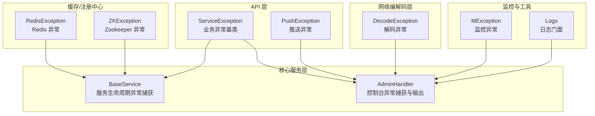
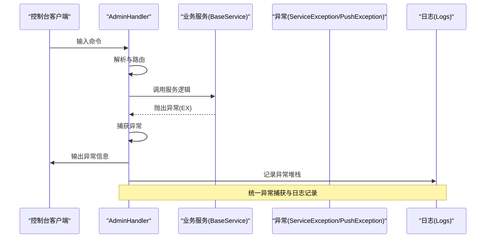
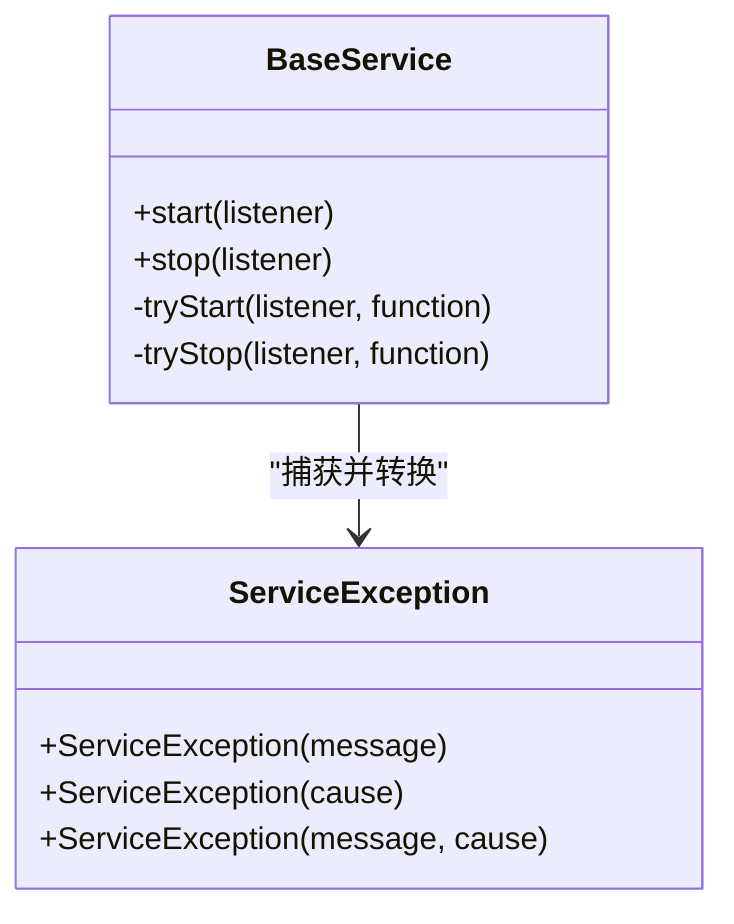
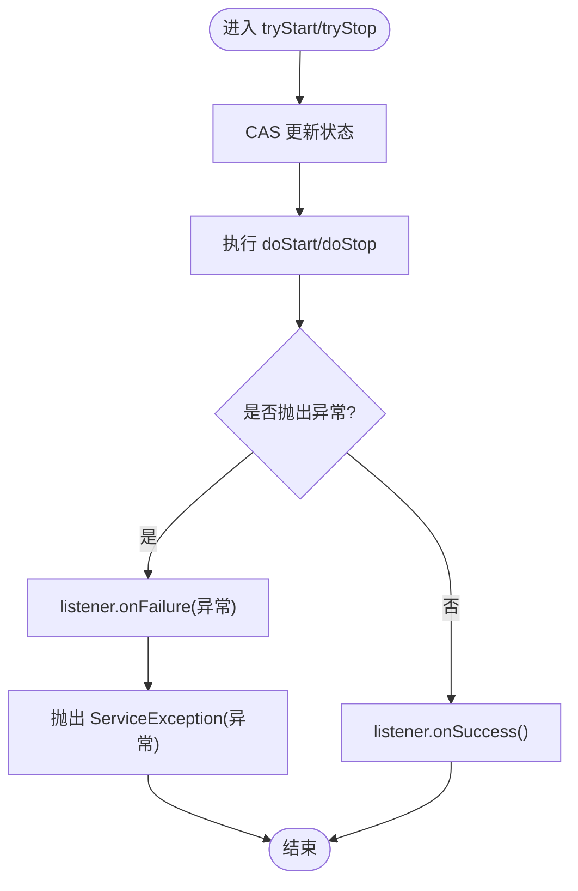
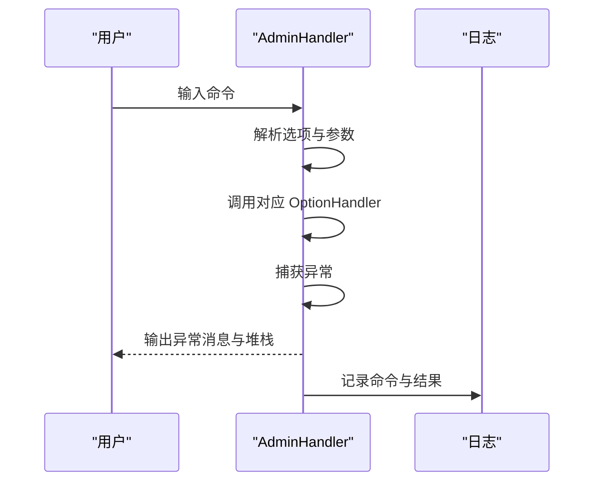
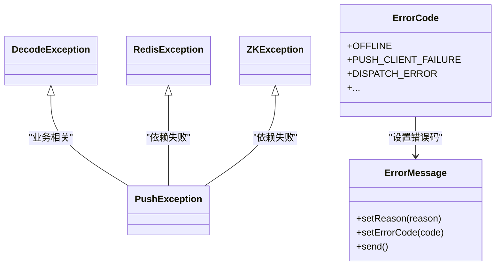
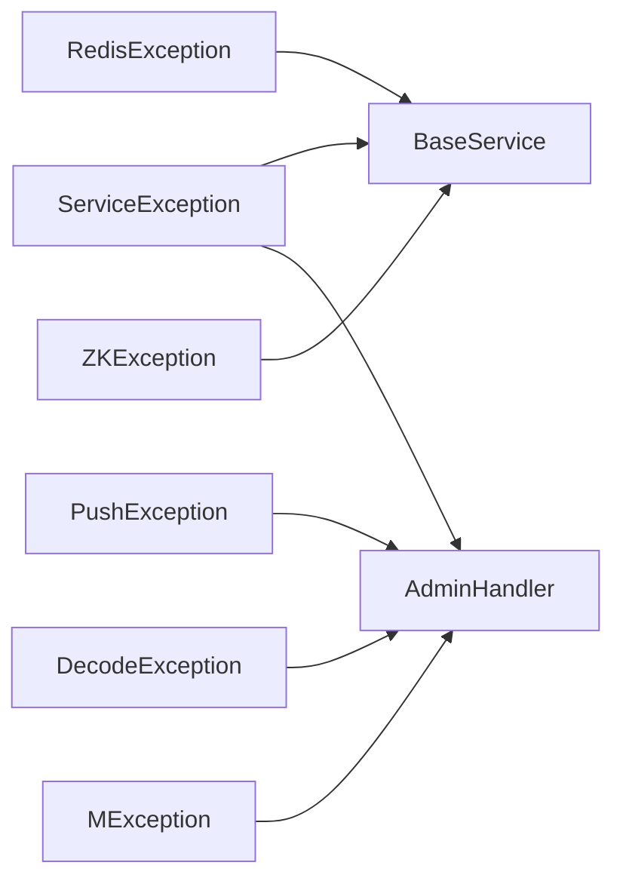

# 异常处理机制

<cite>
**本文引用的文件**
- [ServiceException.java](file://mpush-api/src/main/java/com/mpush/api/service/ServiceException.java)
- [BaseService.java](file://mpush-api/src/main/java/com/mpush/api/service/BaseService.java)
- [AdminHandler.java](file://mpush-core/src/main/java/com/mpush/core/handler/AdminHandler.java)
- [PushException.java](file://mpush-api/src/main/java/com/mpush/api/push/PushException.java)
- [RedisException.java](file://mpush-cache/src/main/java/com/mpush/cache/redis/RedisException.java)
- [ZKException.java](file://mpush-zk/src/main/java/com/mpush/zk/ZKException.java)
- [DecodeException.java](file://mpush-netty/src/main/java/com/mpush/netty/codec/DecodeException.java)
- [OverFlowException.java](file://mpush-common/src/main/java/com/mpush/common/qps/OverFlowException.java)
- [ErrorMessage.java](file://mpush-common/src/main/java/com/mpush/common/message/ErrorMessage.java)
- [ErrorCode.java](file://mpush-common/src/main/java/com/mpush/common/ErrorCode.java)
- [MException.java](file://mpush-monitor/src/main/java/com/mpush/monitor/jmx/MException.java)
- [Logs.java](file://mpush-tools/src/main/java/com/mpush/tools/log/Logs.java)
- [logback.xml](file://mpush-test/src/main/resources/logback.xml)
</cite>

## 目录
1. [简介](#简介)
2. [项目结构](#项目结构)
3. [核心组件](#核心组件)
4. [架构总览](#架构总览)
5. [详细组件分析](#详细组件分析)
6. [依赖分析](#依赖分析)
7. [性能考虑](#性能考虑)
8. [故障排查指南](#故障排查指南)
9. [结论](#结论)

## 简介
本文件围绕 MPush 的异常处理机制进行系统化梳理与指导，重点覆盖以下方面：
- ServiceException 类的设计与使用：异常分类、继承关系、应用场景
- 异常捕获、转换与传播的实现机制
- 不同模块（网络、业务、系统）的异常处理策略
- 异常日志记录、异常信息传递与异常恢复的最佳实践
- 基于 AdminHandler 的异常处理示例与调试方法

## 项目结构
MPush 将异常处理分布在多个模块中，形成“统一异常基类 + 模块特定异常 + 传输层错误封装”的分层设计：
- API 层：定义通用异常基类与业务异常
- 核心服务层：服务生命周期中的异常捕获与转换
- 网络编解码层：协议解析与连接层面的异常
- 缓存与注册中心：外部依赖异常的包装
- 监控与工具：异常日志与监控

图表来源
- [ServiceException.java](file://mpush-api/src/main/java/com/mpush/api/service/ServiceException.java#L26-L39)
- [BaseService.java](file://mpush-api/src/main/java/com/mpush/api/service/BaseService.java#L43-L80)
- [AdminHandler.java](file://mpush-core/src/main/java/com/mpush/core/handler/AdminHandler.java#L144-L156)
- [DecodeException.java](file://mpush-netty/src/main/java/com/mpush/netty/codec/DecodeException.java#L27-L31)
- [RedisException.java](file://mpush-cache/src/main/java/com/mpush/cache/redis/RedisException.java#L26-L42)
- [ZKException.java](file://mpush-zk/src/main/java/com/mpush/zk/ZKException.java#L27-L43)
- [MException.java](file://mpush-monitor/src/main/java/com/mpush/monitor/jmx/MException.java#L27-L39)
- [Logs.java](file://mpush-tools/src/main/java/com/mpush/tools/log/Logs.java#L47-L63)

章节来源
- [ServiceException.java](file://mpush-api/src/main/java/com/mpush/api/service/ServiceException.java#L26-L39)
- [BaseService.java](file://mpush-api/src/main/java/com/mpush/api/service/BaseService.java#L43-L80)
- [AdminHandler.java](file://mpush-core/src/main/java/com/mpush/core/handler/AdminHandler.java#L144-L156)

## 核心组件
- ServiceException：业务异常基类，继承自运行时异常，支持消息、原因、双参构造，便于在服务层统一捕获与转换
- BaseService：服务生命周期（启动/停止）中的异常捕获与转换，将任意异常转换为 ServiceException 并通过监听器回调
- AdminHandler：控制台命令处理器，对用户输入进行解析与执行，捕获任意异常并输出到客户端，同时记录日志
- PushException：推送相关异常，用于推送链路的异常表达
- DecodeException：网络编解码阶段的异常，用于协议解析失败场景
- RedisException/ZKException：外部依赖异常的包装，便于上层统一处理
- MException：监控子系统的异常类型
- ErrorMessage/ErrorCode：消息层错误封装与错误码映射，用于向客户端返回结构化错误

章节来源
- [ServiceException.java](file://mpush-api/src/main/java/com/mpush/api/service/ServiceException.java#L26-L39)
- [BaseService.java](file://mpush-api/src/main/java/com/mpush/api/service/BaseService.java#L43-L80)
- [AdminHandler.java](file://mpush-core/src/main/java/com/mpush/core/handler/AdminHandler.java#L144-L156)
- [PushException.java](file://mpush-api/src/main/java/com/mpush/api/push/PushException.java#L26-L39)
- [DecodeException.java](file://mpush-netty/src/main/java/com/mpush/netty/codec/DecodeException.java#L27-L31)
- [RedisException.java](file://mpush-cache/src/main/java/com/mpush/cache/redis/RedisException.java#L26-L42)
- [ZKException.java](file://mpush-zk/src/main/java/com/mpush/zk/ZKException.java#L27-L43)
- [MException.java](file://mpush-monitor/src/main/java/com/mpush/monitor/jmx/MException.java#L27-L39)
- [ErrorMessage.java](file://mpush-common/src/main/java/com/mpush/common/message/ErrorMessage.java#L44-L102)
- [ErrorCode.java](file://mpush-common/src/main/java/com/mpush/common/ErrorCode.java#L27-L54)

## 架构总览
下图展示了异常在各层之间的传播路径与处理策略：

图表来源
- [AdminHandler.java](file://mpush-core/src/main/java/com/mpush/core/handler/AdminHandler.java#L144-L156)
- [BaseService.java](file://mpush-api/src/main/java/com/mpush/api/service/BaseService.java#L43-L80)
- [ServiceException.java](file://mpush-api/src/main/java/com/mpush/api/service/ServiceException.java#L26-L39)
- [Logs.java](file://mpush-tools/src/main/java/com/mpush/tools/log/Logs.java#L47-L63)

## 详细组件分析

### ServiceException 设计与使用
- 继承关系：继承自运行时异常，便于在服务层直接抛出而无需强制捕获
- 构造函数：支持仅消息、仅原因、消息+原因三种形式，便于携带上下文
- 应用场景：在 BaseService 中统一捕获任意异常并转换为 ServiceException，确保对外暴露一致的异常类型

图表来源
- [ServiceException.java](file://mpush-api/src/main/java/com/mpush/api/service/ServiceException.java#L26-L39)
- [BaseService.java](file://mpush-api/src/main/java/com/mpush/api/service/BaseService.java#L43-L80)

章节来源
- [ServiceException.java](file://mpush-api/src/main/java/com/mpush/api/service/ServiceException.java#L26-L39)
- [BaseService.java](file://mpush-api/src/main/java/com/mpush/api/service/BaseService.java#L43-L80)

### BaseService 异常捕获与转换
- 生命周期保护：在启动/停止过程中，使用 CAS 状态机避免重复启动/停止
- 异常捕获：在 doStart/doStop 执行期间捕获任意异常，通过监听器回调 onFailure，并将异常转换为 ServiceException 抛出
- 返回一致性：无论成功或失败，均通过 FutureListener 回调通知调用方

图表来源
- [BaseService.java](file://mpush-api/src/main/java/com/mpush/api/service/BaseService.java#L43-L80)

章节来源
- [BaseService.java](file://mpush-api/src/main/java/com/mpush/api/service/BaseService.java#L43-L80)

### AdminHandler 异常处理与调试
- 命令解析：将输入按空格拆分为选项与参数，支持多参数场景
- 异常捕获：在执行 OptionHandler 时捕获任意异常，向客户端输出本地化消息与完整堆栈
- 日志记录：记录收到的命令与执行结果，便于问题定位
- 调试建议：通过控制台命令快速验证服务状态、配置与路由信息；异常输出包含堆栈，便于定位根因

图表来源
- [AdminHandler.java](file://mpush-core/src/main/java/com/mpush/core/handler/AdminHandler.java#L130-L156)
- [Logs.java](file://mpush-tools/src/main/java/com/mpush/tools/log/Logs.java#L47-L63)

章节来源
- [AdminHandler.java](file://mpush-core/src/main/java/com/mpush/core/handler/AdminHandler.java#L130-L156)
- [Logs.java](file://mpush-tools/src/main/java/com/mpush/tools/log/Logs.java#L47-L63)

### 网络与业务异常策略
- 网络异常（DecodeException）：协议解码失败时抛出，便于上层识别为网络层错误
- 业务异常（PushException）：推送链路失败时抛出，便于区分业务与系统异常
- 外部依赖异常（RedisException/ZKException）：对第三方依赖失败进行包装，统一异常类型
- 错误码与消息（ErrorCode/ErrorMessage）：向客户端返回结构化的错误信息，包含错误码、原因与数据

图表来源
- [DecodeException.java](file://mpush-netty/src/main/java/com/mpush/netty/codec/DecodeException.java#L27-L31)
- [PushException.java](file://mpush-api/src/main/java/com/mpush/api/push/PushException.java#L26-L39)
- [RedisException.java](file://mpush-cache/src/main/java/com/mpush/cache/redis/RedisException.java#L26-L42)
- [ZKException.java](file://mpush-zk/src/main/java/com/mpush/zk/ZKException.java#L27-L43)
- [ErrorCode.java](file://mpush-common/src/main/java/com/mpush/common/ErrorCode.java#L27-L54)
- [ErrorMessage.java](file://mpush-common/src/main/java/com/mpush/common/message/ErrorMessage.java#L44-L102)

章节来源
- [DecodeException.java](file://mpush-netty/src/main/java/com/mpush/netty/codec/DecodeException.java#L27-L31)
- [PushException.java](file://mpush-api/src/main/java/com/mpush/api/push/PushException.java#L26-L39)
- [RedisException.java](file://mpush-cache/src/main/java/com/mpush/cache/redis/RedisException.java#L26-L42)
- [ZKException.java](file://mpush-zk/src/main/java/com/mpush/zk/ZKException.java#L27-L43)
- [ErrorCode.java](file://mpush-common/src/main/java/com/mpush/common/ErrorCode.java#L27-L54)
- [ErrorMessage.java](file://mpush-common/src/main/java/com/mpush/common/message/ErrorMessage.java#L44-L102)

### 监控与系统异常
- MException：监控子系统内部使用的异常类型，便于隔离监控层错误
- OverFlowException：限流/过载场景的专用异常，携带是否超过最大阈值标记

章节来源
- [MException.java](file://mpush-monitor/src/main/java/com/mpush/monitor/jmx/MException.java#L27-L39)
- [OverFlowException.java](file://mpush-common/src/main/java/com/mpush/common/qps/OverFlowException.java#L27-L47)

## 依赖分析
- ServiceException 作为统一异常基类，被 BaseService 与 AdminHandler 使用
- BaseService 在服务生命周期中捕获并转换异常，向上抛出 ServiceException
- AdminHandler 捕获任意异常，输出到客户端并记录日志
- 其他模块异常（PushException、DecodeException、RedisException、ZKException、MException）在各自领域内使用，保持接口一致性

图表来源
- [ServiceException.java](file://mpush-api/src/main/java/com/mpush/api/service/ServiceException.java#L26-L39)
- [BaseService.java](file://mpush-api/src/main/java/com/mpush/api/service/BaseService.java#L43-L80)
- [AdminHandler.java](file://mpush-core/src/main/java/com/mpush/core/handler/AdminHandler.java#L144-L156)
- [PushException.java](file://mpush-api/src/main/java/com/mpush/api/push/PushException.java#L26-L39)
- [DecodeException.java](file://mpush-netty/src/main/java/com/mpush/netty/codec/DecodeException.java#L27-L31)
- [RedisException.java](file://mpush-cache/src/main/java/com/mpush/cache/redis/RedisException.java#L26-L42)
- [ZKException.java](file://mpush-zk/src/main/java/com/mpush/zk/ZKException.java#L27-L43)
- [MException.java](file://mpush-monitor/src/main/java/com/mpush/monitor/jmx/MException.java#L27-L39)

章节来源
- [ServiceException.java](file://mpush-api/src/main/java/com/mpush/api/service/ServiceException.java#L26-L39)
- [BaseService.java](file://mpush-api/src/main/java/com/mpush/api/service/BaseService.java#L43-L80)
- [AdminHandler.java](file://mpush-core/src/main/java/com/mpush/core/handler/AdminHandler.java#L144-L156)

## 性能考虑
- 异常捕获与转换的开销：在 BaseService 中的 try/catch 与异常转换属于极低成本操作，但应避免在热路径中频繁触发异常分支
- 日志输出：AdminHandler 输出异常堆栈会带来额外 I/O 开销，建议在生产环境谨慎开启详细日志
- 监控异常：MException 与 OverFlowException 用于快速失败与降级，有助于减少无效计算

## 故障排查指南
- 控制台调试：通过 AdminHandler 的 help 命令查看可用选项，使用 count、route、conf、profile 等命令检查服务状态与配置
- 异常输出：AdminHandler 捕获异常后会输出本地化消息与完整堆栈，优先查看堆栈定位根因
- 日志配置：通过 logback.xml 配置不同模块的日志级别与输出格式，结合 Logs.java 中的命名日志器进行问题定位
- 错误码映射：使用 ErrorCode 与 ErrorMessage 向客户端返回结构化错误，便于前端与运维快速识别问题类型

章节来源
- [AdminHandler.java](file://mpush-core/src/main/java/com/mpush/core/handler/AdminHandler.java#L130-L156)
- [logback.xml](file://mpush-test/src/main/resources/logback.xml#L32-L108)
- [Logs.java](file://mpush-tools/src/main/java/com/mpush/tools/log/Logs.java#L47-L63)
- [ErrorCode.java](file://mpush-common/src/main/java/com/mpush/common/ErrorCode.java#L27-L54)
- [ErrorMessage.java](file://mpush-common/src/main/java/com/mpush/common/message/ErrorMessage.java#L44-L102)

## 结论
MPush 的异常处理机制以 ServiceException 为核心，结合 BaseService 的生命周期保护与 AdminHandler 的统一异常捕获，形成了“统一异常类型 + 分层处理 + 结构化日志”的完整闭环。通过模块化异常（PushException、DecodeException、RedisException、ZKException、MException）与错误码/消息封装，系统在复杂网络与分布式环境下实现了清晰的错误表达与高效的问题定位。