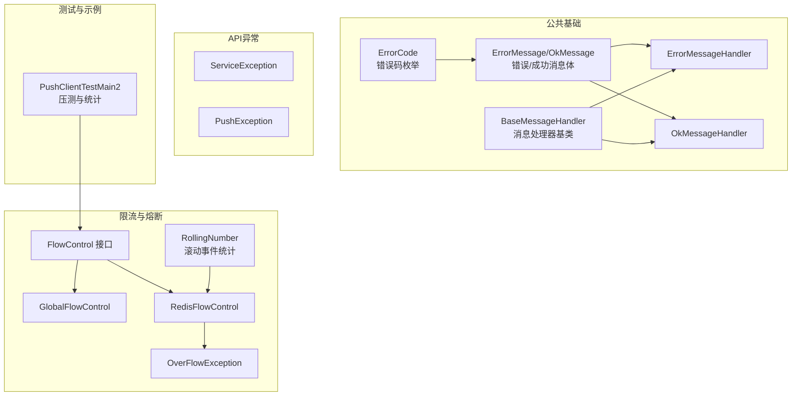
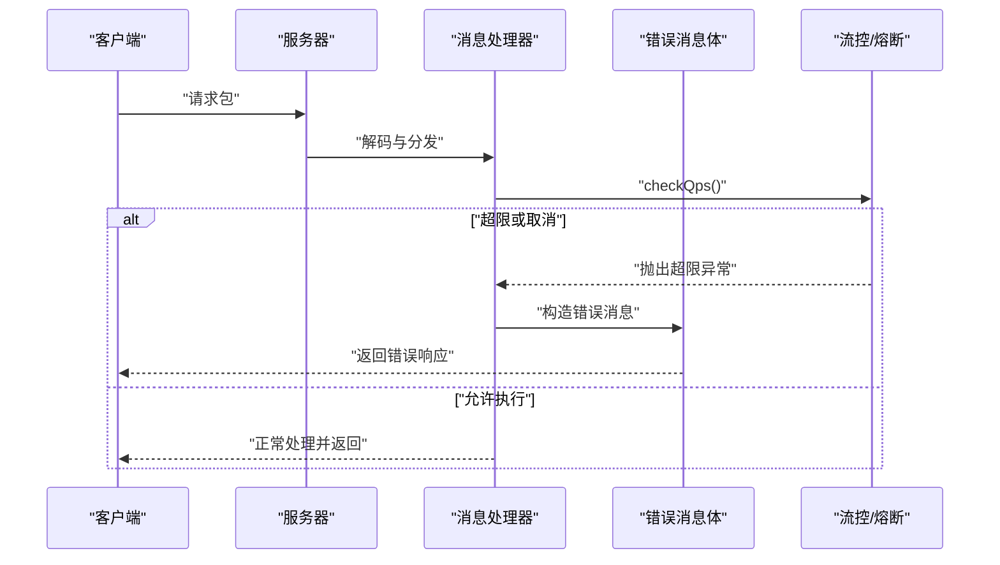
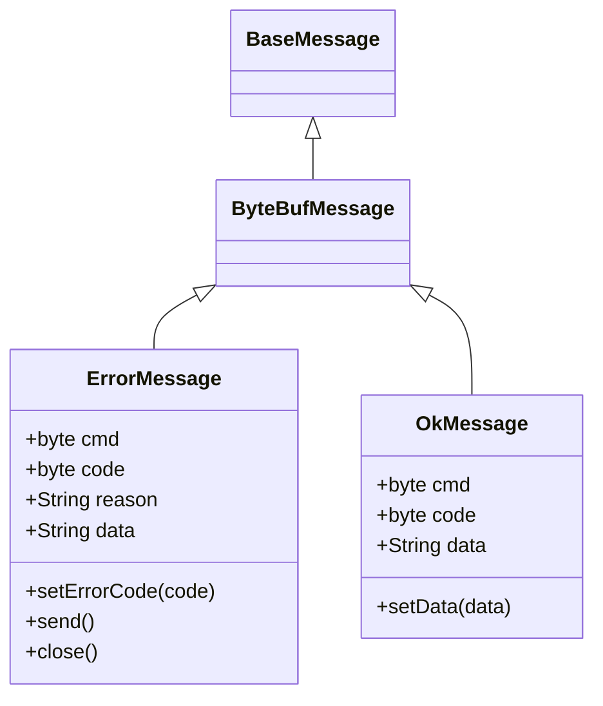
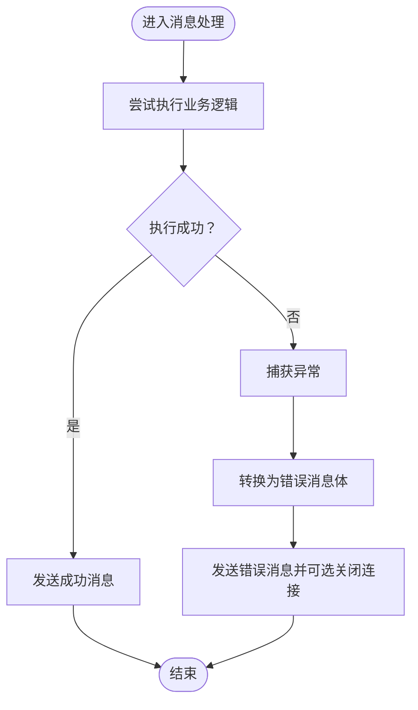
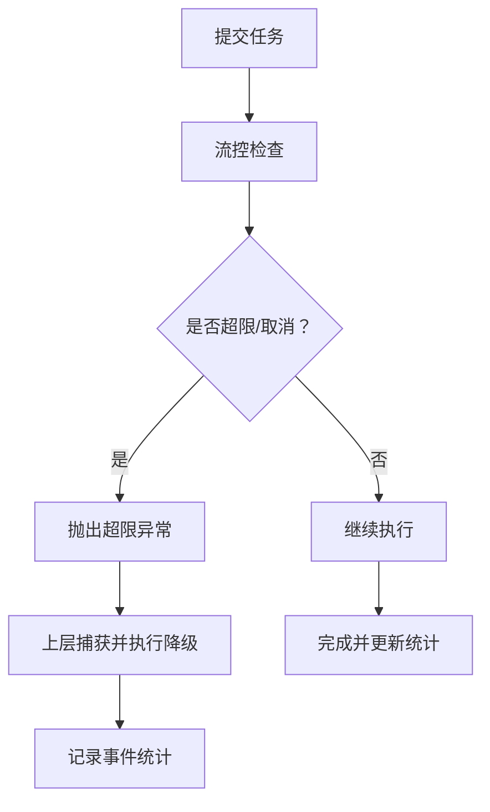
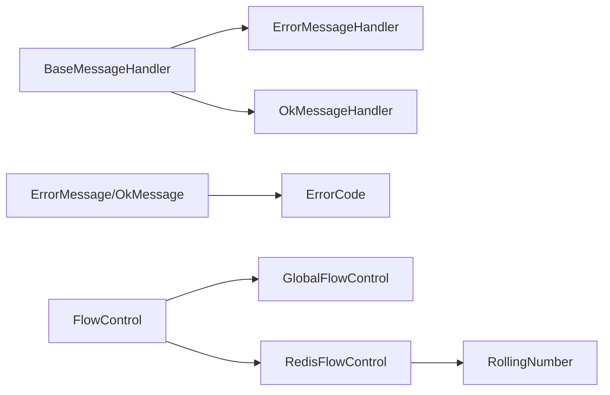
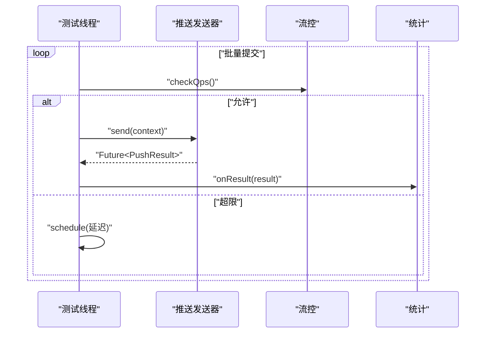

# 故障处理

<cite>
**本文引用的文件**
- [ErrorCode.java](file://mpush-common/src/main/java/com/mpush/common/ErrorCode.java)
- [ErrorMessage.java](file://mpush-common/src/main/java/com/mpush/common/message/ErrorMessage.java)
- [OkMessage.java](file://mpush-common/src/main/java/com/mpush/common/message/OkMessage.java)
- [BaseMessageHandler.java](file://mpush-common/src/main/java/com/mpush/common/handler/BaseMessageHandler.java)
- [ErrorMessageHandler.java](file://mpush-common/src/main/java/com/mpush/common/handler/ErrorMessageHandler.java)
- [OkMessageHandler.java](file://mpush-common/src/main/java/com/mpush/common/handler/OkMessageHandler.java)
- [ServiceException.java](file://mpush-api/src/main/java/com/mpush/api/service/ServiceException.java)
- [PushException.java](file://mpush-api/src/main/java/com/mpush/api/push/PushException.java)
- [FlowControl.java](file://mpush-common/src/main/java/com/mpush/common/qps/FlowControl.java)
- [GlobalFlowControl.java](file://mpush-common/src/main/java/com/mpush/common/qps/GlobalFlowControl.java)
- [RedisFlowControl.java](file://mpush-common/src/main/java/com/mpush/common/qps/RedisFlowControl.java)
- [OverFlowException.java](file://mpush-common/src/main/java/com/mpush/common/qps/OverFlowException.java)
- [RollingNumber.java](file://mpush-tools/src/main/java/com/mpush/tools/common/RollingNumber.java)
- [PushClientTestMain2.java](file://mpush-test/src/main/java/com/mpush/test/push/PushClientTestMain2.java)
</cite>

## 目录
1. [简介](#简介)
2. [项目结构](#项目结构)
3. [核心组件](#核心组件)
4. [架构总览](#架构总览)
5. [详细组件分析](#详细组件分析)
6. [依赖分析](#依赖分析)
7. [性能考虑](#性能考虑)
8. [故障排查指南](#故障排查指南)
9. [结论](#结论)
10. [附录](#附录)

## 简介
本指导文档面向MPush在生产环境中的故障处理与恢复，围绕错误码定义与分类、异常处理机制、降级策略设计与实现、灾难恢复方案以及系统化故障排查方法展开。文档结合代码库中已实现的错误消息模型、异常类型、限流与熔断工具、以及测试用例中的调用链路，帮助开发者快速定位并解决常见问题。

## 项目结构
MPush采用多模块分层组织，故障处理相关的实现主要分布在以下模块：
- mpush-common：通用错误码、消息体、处理器基类、限流控制等
- mpush-api：服务与推送异常类型定义
- mpush-tools：滚动统计与事件计数（用于熔断/降级指标）
- mpush-test：端到端压测与结果统计示例

**图表来源**
- [ErrorCode.java](file://mpush-common/src/main/java/com/mpush/common/ErrorCode.java#L27-L55)
- [ErrorMessage.java](file://mpush-common/src/main/java/com/mpush/common/message/ErrorMessage.java#L38-L123)
- [OkMessage.java](file://mpush-common/src/main/java/com/mpush/common/message/OkMessage.java#L36-L94)
- [BaseMessageHandler.java](file://mpush-common/src/main/java/com/mpush/common/handler/BaseMessageHandler.java#L34-L70)
- [ErrorMessageHandler.java](file://mpush-common/src/main/java/com/mpush/common/handler/ErrorMessageHandler.java#L31-L41)
- [OkMessageHandler.java](file://mpush-common/src/main/java/com/mpush/common/handler/OkMessageHandler.java#L31-L41)
- [FlowControl.java](file://mpush-common/src/main/java/com/mpush/common/qps/FlowControl.java#L27-L60)
- [GlobalFlowControl.java](file://mpush-common/src/main/java/com/mpush/common/qps/GlobalFlowControl.java#L30-L91)
- [RedisFlowControl.java](file://mpush-common/src/main/java/com/mpush/common/qps/RedisFlowControl.java#L32-L121)
- [OverFlowException.java](file://mpush-common/src/main/java/com/mpush/common/qps/OverFlowException.java#L27-L47)
- [RollingNumber.java](file://mpush-tools/src/main/java/com/mpush/tools/common/RollingNumber.java#L603-L622)
- [PushClientTestMain2.java](file://mpush-test/src/main/java/com/mpush/test/push/PushClientTestMain2.java#L74-L139)

**章节来源**
- [ErrorCode.java](file://mpush-common/src/main/java/com/mpush/common/ErrorCode.java#L27-L55)
- [ErrorMessage.java](file://mpush-common/src/main/java/com/mpush/common/message/ErrorMessage.java#L38-L123)
- [OkMessage.java](file://mpush-common/src/main/java/com/mpush/common/message/OkMessage.java#L36-L94)
- [BaseMessageHandler.java](file://mpush-common/src/main/java/com/mpush/common/handler/BaseMessageHandler.java#L34-L70)
- [ErrorMessageHandler.java](file://mpush-common/src/main/java/com/mpush/common/handler/ErrorMessageHandler.java#L31-L41)
- [OkMessageHandler.java](file://mpush-common/src/main/java/com/mpush/common/handler/OkMessageHandler.java#L31-L41)
- [ServiceException.java](file://mpush-api/src/main/java/com/mpush/api/service/ServiceException.java#L26-L39)
- [PushException.java](file://mpush-api/src/main/java/com/mpush/api/push/PushException.java#L26-L39)
- [FlowControl.java](file://mpush-common/src/main/java/com/mpush/common/qps/FlowControl.java#L27-L60)
- [GlobalFlowControl.java](file://mpush-common/src/main/java/com/mpush/common/qps/GlobalFlowControl.java#L30-L91)
- [RedisFlowControl.java](file://mpush-common/src/main/java/com/mpush/common/qps/RedisFlowControl.java#L32-L121)
- [OverFlowException.java](file://mpush-common/src/main/java/com/mpush/common/qps/OverFlowException.java#L27-L47)
- [RollingNumber.java](file://mpush-tools/src/main/java/com/mpush/tools/common/RollingNumber.java#L603-L622)
- [PushClientTestMain2.java](file://mpush-test/src/main/java/com/mpush/test/push/PushClientTestMain2.java#L74-L139)

## 核心组件
- 错误码与消息模型
  - 错误码枚举定义了系统错误、业务错误、网络握手与路由变更等场景的统一编码，并提供从整型到枚举的映射。
  - 错误消息体与成功消息体封装了命令、错误码、原因与附加数据，支持二进制与JSON序列化，便于跨协议传输与客户端解析。
- 异常类型
  - 服务异常与推送异常分别用于服务层与推送层的异常建模，便于上层捕获与差异化处理。
- 流量控制与熔断
  - 流控接口与全局/Redis流控实现提供瞬时QPS检查、总量限制、延迟重试与统计报告能力；超限通过异常抛出，便于上层感知并降级。
  - 滚动事件统计用于记录成功/失败/超时/拒绝等事件，为熔断与降级决策提供依据。

**章节来源**
- [ErrorCode.java](file://mpush-common/src/main/java/com/mpush/common/ErrorCode.java#L27-L55)
- [ErrorMessage.java](file://mpush-common/src/main/java/com/mpush/common/message/ErrorMessage.java#L38-L123)
- [OkMessage.java](file://mpush-common/src/main/java/com/mpush/common/message/OkMessage.java#L36-L94)
- [ServiceException.java](file://mpush-api/src/main/java/com/mpush/api/service/ServiceException.java#L26-L39)
- [PushException.java](file://mpush-api/src/main/java/com/mpush/api/push/PushException.java#L26-L39)
- [FlowControl.java](file://mpush-common/src/main/java/com/mpush/common/qps/FlowControl.java#L27-L60)
- [GlobalFlowControl.java](file://mpush-common/src/main/java/com/mpush/common/qps/GlobalFlowControl.java#L30-L91)
- [RedisFlowControl.java](file://mpush-common/src/main/java/com/mpush/common/qps/RedisFlowControl.java#L32-L121)
- [OverFlowException.java](file://mpush-common/src/main/java/com/mpush/common/qps/OverFlowException.java#L27-L47)
- [RollingNumber.java](file://mpush-tools/src/main/java/com/mpush/tools/common/RollingNumber.java#L603-L622)

## 架构总览
下图展示了从消息解码到处理再到响应的典型路径，以及错误消息如何被构造与发送，同时体现了限流与熔断在推送链路中的作用点。

**图表来源**
- [BaseMessageHandler.java](file://mpush-common/src/main/java/com/mpush/common/handler/BaseMessageHandler.java#L42-L53)
- [ErrorMessage.java](file://mpush-common/src/main/java/com/mpush/common/message/ErrorMessage.java#L38-L123)
- [FlowControl.java](file://mpush-common/src/main/java/com/mpush/common/qps/FlowControl.java#L33-L39)
- [OverFlowException.java](file://mpush-common/src/main/java/com/mpush/common/qps/OverFlowException.java#L27-L47)

## 详细组件分析

### 错误码定义与分类
- 分类维度
  - 系统错误：如会话过期、设备无效等，通常由服务端状态不合法引发。
  - 业务错误：如推送失败、ACK超时、路由变更等，反映业务流程异常。
  - 网络/协议错误：如不支持的命令、重复握手等，指示协议层面的问题。
- 错误码映射
  - 提供从整型错误码到枚举的映射函数，便于日志与监控系统统一解析。
- 处理建议
  - 客户端收到错误码后应区分可重试与不可重试场景，对网络/协议错误进行快速失败，对业务错误进行幂等重试或提示用户。

**章节来源**
- [ErrorCode.java](file://mpush-common/src/main/java/com/mpush/common/ErrorCode.java#L27-L55)

### 错误消息与成功消息模型
- 错误消息体
  - 字段包含命令、错误码、原因与附加数据，支持二进制与JSON编码，便于跨协议传输。
  - 提供从通用消息或包构造错误消息的便捷方法，并可直接发送或关闭连接。
- 成功消息体
  - 字段包含命令、状态码与数据，用于确认类响应。
- 使用场景
  - 在异常处理路径中构造错误消息返回给客户端；在正常处理完成后返回成功消息。

**图表来源**
- [ErrorMessage.java](file://mpush-common/src/main/java/com/mpush/common/message/ErrorMessage.java#L38-L123)
- [OkMessage.java](file://mpush-common/src/main/java/com/mpush/common/message/OkMessage.java#L36-L94)

**章节来源**
- [ErrorMessage.java](file://mpush-common/src/main/java/com/mpush/common/message/ErrorMessage.java#L38-L123)
- [OkMessage.java](file://mpush-common/src/main/java/com/mpush/common/message/OkMessage.java#L36-L94)

### 异常处理机制
- 异常类型
  - 服务异常与推送异常继承自运行时异常，便于在异步/网络栈中向上抛出并被捕获。
- 捕获与转换
  - 建议在消息处理器入口处捕获运行时异常，将其转换为错误消息体并返回客户端，避免连接被静默关闭。
- 传播与记录
  - 对于可恢复的异常，可在上层进行重试或降级；对于不可恢复异常，应记录上下文并尽快释放资源。

**图表来源**
- [BaseMessageHandler.java](file://mpush-common/src/main/java/com/mpush/common/handler/BaseMessageHandler.java#L42-L53)
- [ErrorMessage.java](file://mpush-common/src/main/java/com/mpush/common/message/ErrorMessage.java#L38-L123)
- [ServiceException.java](file://mpush-api/src/main/java/com/mpush/api/service/ServiceException.java#L26-L39)
- [PushException.java](file://mpush-api/src/main/java/com/mpush/api/push/PushException.java#L26-L39)

**章节来源**
- [BaseMessageHandler.java](file://mpush-common/src/main/java/com/mpush/common/handler/BaseMessageHandler.java#L34-L70)
- [ErrorMessageHandler.java](file://mpush-common/src/main/java/com/mpush/common/handler/ErrorMessageHandler.java#L31-L41)
- [OkMessageHandler.java](file://mpush-common/src/main/java/com/mpush/common/handler/OkMessageHandler.java#L31-L41)
- [ServiceException.java](file://mpush-api/src/main/java/com/mpush/api/service/ServiceException.java#L26-L39)
- [PushException.java](file://mpush-api/src/main/java/com/mpush/api/push/PushException.java#L26-L39)

### 降级策略设计与实现
- 策略层级
  - 服务降级：当下游依赖不可用或超时时，快速返回兜底数据或空结果。
  - 功能降级：关闭非核心功能（如推送通知），保证核心链路可用。
  - 数据降级：使用缓存或本地数据替代远程读取，降低延迟与失败率。
- 触发条件
  - QPS超限导致阻塞或丢弃。
  - 远端服务熔断打开，拒绝新请求。
  - 网络抖动或DNS解析失败。
- 实现要点
  - 通过流控器在提交阶段拦截，超限时抛出超限异常，上层根据异常类型选择降级分支。
  - 结合滚动事件统计判断熔断阈值，动态调整降级策略。

**图表来源**
- [FlowControl.java](file://mpush-common/src/main/java/com/mpush/common/qps/FlowControl.java#L33-L39)
- [GlobalFlowControl.java](file://mpush-common/src/main/java/com/mpush/common/qps/GlobalFlowControl.java#L61-L75)
- [RedisFlowControl.java](file://mpush-common/src/main/java/com/mpush/common/qps/RedisFlowControl.java#L65-L88)
- [OverFlowException.java](file://mpush-common/src/main/java/com/mpush/common/qps/OverFlowException.java#L27-L47)
- [RollingNumber.java](file://mpush-tools/src/main/java/com/mpush/tools/common/RollingNumber.java#L603-L622)

**章节来源**
- [FlowControl.java](file://mpush-common/src/main/java/com/mpush/common/qps/FlowControl.java#L27-L60)
- [GlobalFlowControl.java](file://mpush-common/src/main/java/com/mpush/common/qps/GlobalFlowControl.java#L30-L91)
- [RedisFlowControl.java](file://mpush-common/src/main/java/com/mpush/common/qps/RedisFlowControl.java#L32-L121)
- [OverFlowException.java](file://mpush-common/src/main/java/com/mpush/common/qps/OverFlowException.java#L27-L47)
- [RollingNumber.java](file://mpush-tools/src/main/java/com/mpush/tools/common/RollingNumber.java#L603-L622)

### 灾难恢复方案
- 数据备份
  - 对关键配置与路由信息进行定期快照与版本化管理，确保回滚与恢复。
- 服务恢复
  - 通过健康检查与自动重启机制保障节点可用；在熔断打开期间避免对下游施压。
- 故障切换
  - 当检测到节点不可用或网络分区时，自动切换至备用节点或降级模式，保证核心功能可用。
- 应急预案
  - 明确各角色职责与联系方式；准备一键降级脚本与回滚步骤；演练恢复流程。

[本节为概念性内容，无需列出具体文件来源]

### 故障排查方法
- 日志分析
  - 关注错误码与错误消息体中的原因字段，结合时间戳定位异常发生点。
  - 对超限异常进行聚合统计，识别突发流量或配置错误。
- 性能监控
  - 使用流控报告与滚动事件统计观察QPS、成功率与超时比例，判断是否存在资源瓶颈。
- 网络诊断
  - 验证握手与心跳链路是否稳定；检查DNS解析与防火墙策略；复核UDP/TCP端口连通性。

**章节来源**
- [ErrorMessage.java](file://mpush-common/src/main/java/com/mpush/common/message/ErrorMessage.java#L98-L102)
- [GlobalFlowControl.java](file://mpush-common/src/main/java/com/mpush/common/qps/GlobalFlowControl.java#L87-L90)
- [RollingNumber.java](file://mpush-tools/src/main/java/com/mpush/tools/common/RollingNumber.java#L603-L622)

## 依赖分析
- 组件耦合
  - 消息处理器基类与具体处理器之间为组合关系，便于扩展新的消息类型。
  - 错误消息体依赖错误码枚举与协议包，形成稳定的错误描述通道。
  - 流控实现依赖广播控制器与滚动统计，形成闭环的限流与熔断机制。
- 外部依赖
  - Redis用于分布式广播与限速参数同步；Netty用于网络编解码与连接管理。

**图表来源**
- [BaseMessageHandler.java](file://mpush-common/src/main/java/com/mpush/common/handler/BaseMessageHandler.java#L34-L70)
- [ErrorMessageHandler.java](file://mpush-common/src/main/java/com/mpush/common/handler/ErrorMessageHandler.java#L31-L41)
- [OkMessageHandler.java](file://mpush-common/src/main/java/com/mpush/common/handler/OkMessageHandler.java#L31-L41)
- [ErrorMessage.java](file://mpush-common/src/main/java/com/mpush/common/message/ErrorMessage.java#L38-L123)
- [OkMessage.java](file://mpush-common/src/main/java/com/mpush/common/message/OkMessage.java#L36-L94)
- [ErrorCode.java](file://mpush-common/src/main/java/com/mpush/common/ErrorCode.java#L27-L55)
- [FlowControl.java](file://mpush-common/src/main/java/com/mpush/common/qps/FlowControl.java#L27-L60)
- [GlobalFlowControl.java](file://mpush-common/src/main/java/com/mpush/common/qps/GlobalFlowControl.java#L30-L91)
- [RedisFlowControl.java](file://mpush-common/src/main/java/com/mpush/common/qps/RedisFlowControl.java#L32-L121)
- [RollingNumber.java](file://mpush-tools/src/main/java/com/mpush/tools/common/RollingNumber.java#L603-L622)

**章节来源**
- [BaseMessageHandler.java](file://mpush-common/src/main/java/com/mpush/common/handler/BaseMessageHandler.java#L34-L70)
- [ErrorMessageHandler.java](file://mpush-common/src/main/java/com/mpush/common/handler/ErrorMessageHandler.java#L31-L41)
- [OkMessageHandler.java](file://mpush-common/src/main/java/com/mpush/common/handler/OkMessageHandler.java#L31-L41)
- [ErrorMessage.java](file://mpush-common/src/main/java/com/mpush/common/message/ErrorMessage.java#L38-L123)
- [OkMessage.java](file://mpush-common/src/main/java/com/mpush/common/message/OkMessage.java#L36-L94)
- [ErrorCode.java](file://mpush-common/src/main/java/com/mpush/common/ErrorCode.java#L27-L55)
- [FlowControl.java](file://mpush-common/src/main/java/com/mpush/common/qps/FlowControl.java#L27-L60)
- [GlobalFlowControl.java](file://mpush-common/src/main/java/com/mpush/common/qps/GlobalFlowControl.java#L30-L91)
- [RedisFlowControl.java](file://mpush-common/src/main/java/com/mpush/common/qps/RedisFlowControl.java#L32-L121)
- [RollingNumber.java](file://mpush-tools/src/main/java/com/mpush/tools/common/RollingNumber.java#L603-L622)

## 性能考虑
- 流控策略
  - 全局流控适合单机限速，Redis流控适合分布式广播场景；两者均可设置最大总量与持续时间，防止雪崩。
- 延迟与重试
  - 当未超限但超过窗口时，通过计算剩余纳秒数进行延迟重试，减少瞬时峰值。
- 统计与观测
  - 报告输出包含累计数、瞬时计数与平均QPS，便于容量规划与阈值调优。

**章节来源**
- [GlobalFlowControl.java](file://mpush-common/src/main/java/com/mpush/common/qps/GlobalFlowControl.java#L39-L91)
- [RedisFlowControl.java](file://mpush-common/src/main/java/com/mpush/common/qps/RedisFlowControl.java#L43-L121)
- [FlowControl.java](file://mpush-common/src/main/java/com/mpush/common/qps/FlowControl.java#L49-L58)

## 故障排查指南
- 常见问题定位
  - 推送失败：检查错误码与错误消息体中的原因字段，区分客户端离线、网络异常或服务端拒绝。
  - 超时/丢弃：关注超限异常与流控报告，评估QPS阈值与最大总量配置。
  - 熔断打开：查看滚动事件统计中的失败/超时/拒绝比例，确认是否达到熔断阈值。
- 实战参考
  - 测试用例展示了如何在循环中调用流控检查并在超限时延迟重试，同时统计成功/失败/离线/超时等结果，可作为生产侧压测与回归验证的模板。

**图表来源**
- [PushClientTestMain2.java](file://mpush-test/src/main/java/com/mpush/test/push/PushClientTestMain2.java#L74-L139)
- [FlowControl.java](file://mpush-common/src/main/java/com/mpush/common/qps/FlowControl.java#L33-L39)

**章节来源**
- [PushClientTestMain2.java](file://mpush-test/src/main/java/com/mpush/test/push/PushClientTestMain2.java#L74-L139)
- [OverFlowException.java](file://mpush-common/src/main/java/com/mpush/common/qps/OverFlowException.java#L27-L47)

## 结论
MPush在错误码、消息模型、异常类型与流控/熔断方面提供了完善的基础设施。通过统一的错误描述与限流策略，可以有效提升系统的稳定性与可观测性。结合本文提供的排查方法与降级/恢复方案，团队能够在生产环境中快速定位并解决问题，保障服务的高可用。

## 附录
- 关键实现路径参考
  - 错误码与消息体：[ErrorCode.java](file://mpush-common/src/main/java/com/mpush/common/ErrorCode.java#L27-L55)，[ErrorMessage.java](file://mpush-common/src/main/java/com/mpush/common/message/ErrorMessage.java#L38-L123)，[OkMessage.java](file://mpush-common/src/main/java/com/mpush/common/message/OkMessage.java#L36-L94)
  - 异常类型：[ServiceException.java](file://mpush-api/src/main/java/com/mpush/api/service/ServiceException.java#L26-L39)，[PushException.java](file://mpush-api/src/main/java/com/mpush/api/push/PushException.java#L26-L39)
  - 流控与熔断：[FlowControl.java](file://mpush-common/src/main/java/com/mpush/common/qps/FlowControl.java#L27-L60)，[GlobalFlowControl.java](file://mpush-common/src/main/java/com/mpush/common/qps/GlobalFlowControl.java#L30-L91)，[RedisFlowControl.java](file://mpush-common/src/main/java/com/mpush/common/qps/RedisFlowControl.java#L32-L121)，[OverFlowException.java](file://mpush-common/src/main/java/com/mpush/common/qps/OverFlowException.java#L27-L47)，[RollingNumber.java](file://mpush-tools/src/main/java/com/mpush/tools/common/RollingNumber.java#L603-L622)
  - 排查示例：[PushClientTestMain2.java](file://mpush-test/src/main/java/com/mpush/test/push/PushClientTestMain2.java#L74-L139)