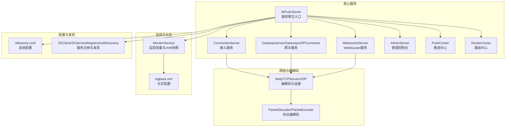
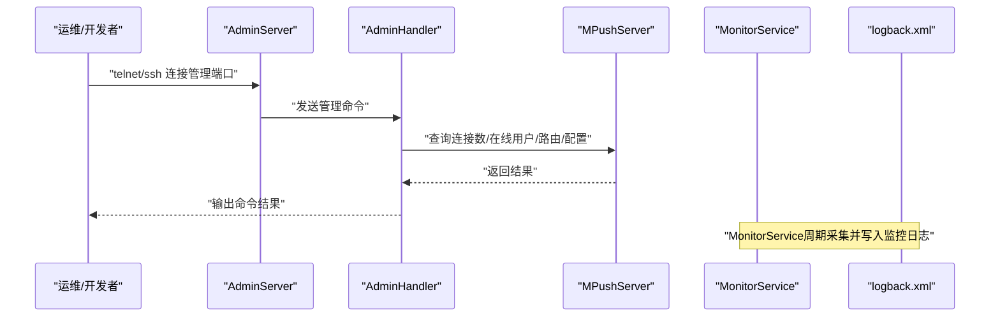
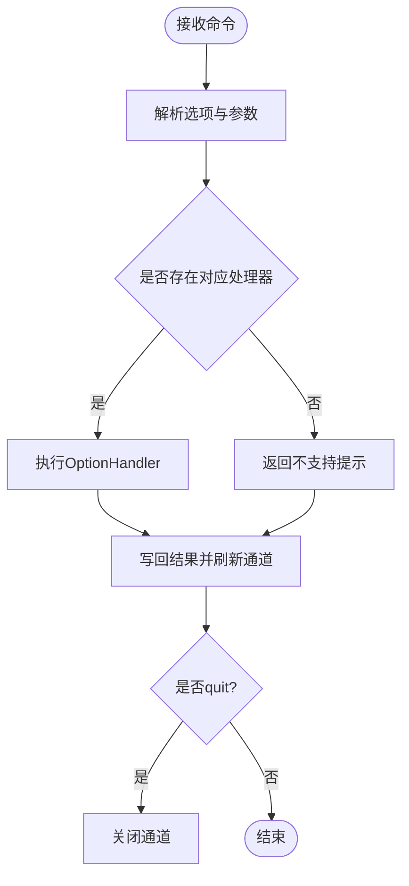
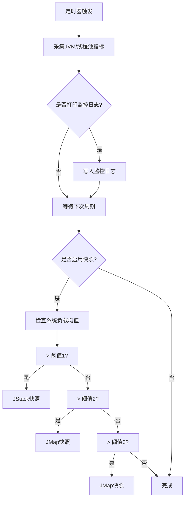
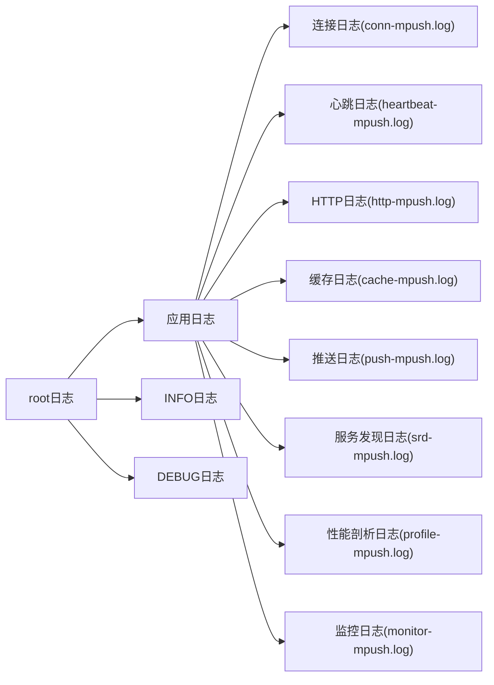
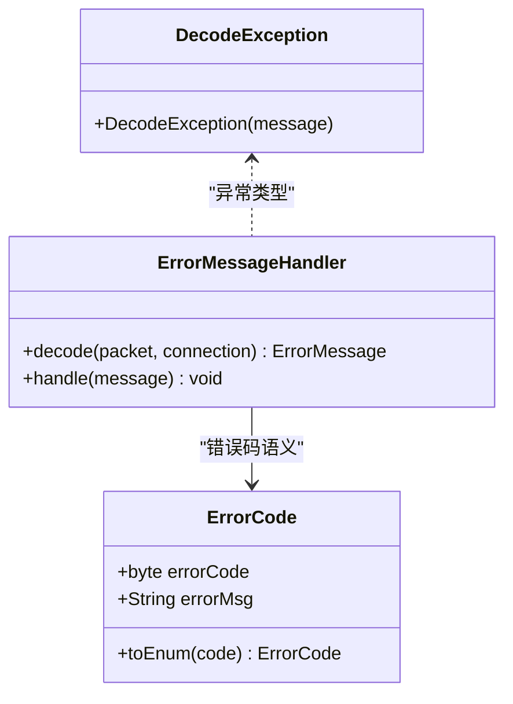
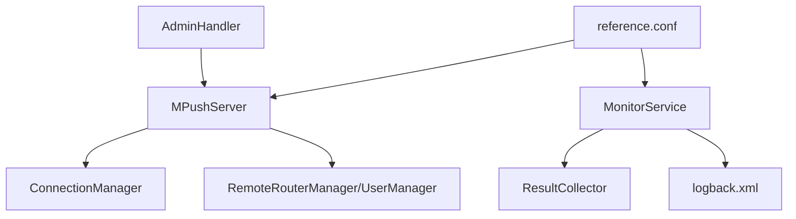

# 故障排查方法

<cite>
**本文引用的文件**
- [README.md](file://README.md)
- [AdminHandler.java](file://mpush-core/src/main/java/com/mpush/core/handler/AdminHandler.java)
- [logback.xml](file://mpush-boot/src/main/resources/logback.xml)
- [reference.conf](file://conf/reference.conf)
- [MonitorService.java](file://mpush-monitor/src/main/java/com/mpush/monitor/service/MonitorService.java)
- [ErrorCode.java](file://mpush-common/src/main/java/com/mpush/common/ErrorCode.java)
- [MPushServer.java](file://mpush-core/src/main/java/com/mpush/core/MPushServer.java)
- [ErrorMessageHandler.java](file://mpush-common/src/main/java/com/mpush/common/handler/ErrorMessageHandler.java)
- [DecodeException.java](file://mpush-netty/src/main/java/com/mpush/netty/codec/DecodeException.java)
- [TelnetTest.java](file://mpush-test/src/main/java/com/mpush/test/util/TelnetTest.java)
</cite>

## 目录
1. [简介](#简介)
2. [项目结构](#项目结构)
3. [核心组件](#核心组件)
4. [架构总览](#架构总览)
5. [详细组件分析](#详细组件分析)
6. [依赖分析](#依赖分析)
7. [性能考虑](#性能考虑)
8. [故障排查指南](#故障排查指南)
9. [结论](#结论)
10. [附录](#附录)

## 简介
本文件面向生产环境的MPush系统运维与开发人员，提供一套系统化的故障排查方法论与实操指南。内容涵盖问题定位、根因分析、解决方案制定、日志分析、性能监控、网络诊断以及AdminHandler管理命令的实际操作方法，并结合常见故障场景给出可复用的排查步骤与建议。

## 项目结构
MPush采用多模块分层设计，核心模块包括核心服务、网络编解码、监控、缓存、Zookeeper集成、客户端与测试等。与故障排查直接相关的关键模块如下：
- mpush-core：服务核心（连接、网关、管理控制台、推送中心、路由中心等）
- mpush-netty：网络编解码与连接抽象
- mpush-monitor：系统监控与JVM快照采集
- mpush-common：通用错误码、消息与处理器
- mpush-boot：启动与日志配置
- conf：系统配置参考
- mpush-test：测试工具（含健康检查示例）

图表来源
- [MPushServer.java](file://mpush-core/src/main/java/com/mpush/core/MPushServer.java#L48-L181)
- [logback.xml](file://mpush-boot/src/main/resources/logback.xml#L1-L231)
- [reference.conf](file://conf/reference.conf#L1-L239)

章节来源
- [README.md](file://README.md#L1-L328)
- [MPushServer.java](file://mpush-core/src/main/java/com/mpush/core/MPushServer.java#L48-L181)

## 核心组件
- 管理控制台（AdminHandler）：提供交互式管理命令，支持查询连接数、在线用户、路由信息、配置、监控、性能剖析开关等。
- 监控服务（MonitorService）：周期性采集JVM与线程池指标，按负载阈值触发JStack/JMap快照，输出监控日志。
- 日志系统（logback.xml）：按模块拆分日志文件，支持INFO/DEBUG级别输出与滚动策略。
- 错误码与异常（ErrorCode、ErrorMessageHandler、DecodeException）：统一错误语义与异常类型，便于定位消息处理与解码阶段的问题。
- 配置体系（reference.conf）：集中定义网络、线程池、流控、监控等关键参数，支撑故障定位与优化。

章节来源
- [AdminHandler.java](file://mpush-core/src/main/java/com/mpush/core/handler/AdminHandler.java#L40-L176)
- [MonitorService.java](file://mpush-monitor/src/main/java/com/mpush/monitor/service/MonitorService.java#L36-L147)
- [logback.xml](file://mpush-boot/src/main/resources/logback.xml#L1-L231)
- [ErrorCode.java](file://mpush-common/src/main/java/com/mpush/common/ErrorCode.java#L27-L55)
- [ErrorMessageHandler.java](file://mpush-common/src/main/java/com/mpush/common/handler/ErrorMessageHandler.java#L31-L41)
- [DecodeException.java](file://mpush-netty/src/main/java/com/mpush/netty/codec/DecodeException.java#L27-L31)
- [reference.conf](file://conf/reference.conf#L13-L239)

## 架构总览
下图展示MPush在故障排查中的关键交互路径：通过AdminServer进入AdminHandler，查询连接数/在线用户/路由/配置；MonitorService周期性采集并输出监控日志；日志系统按模块落盘；网络层通过Netty编解码与连接管理承载消息流转。

图表来源
- [AdminHandler.java](file://mpush-core/src/main/java/com/mpush/core/handler/AdminHandler.java#L130-L176)
- [MPushServer.java](file://mpush-core/src/main/java/com/mpush/core/MPushServer.java#L114-L155)
- [MonitorService.java](file://mpush-monitor/src/main/java/com/mpush/monitor/service/MonitorService.java#L65-L83)
- [logback.xml](file://mpush-boot/src/main/resources/logback.xml#L60-L170)

## 详细组件分析

### 管理控制台与AdminHandler
AdminHandler提供交互式命令，支持：
- 帮助与退出：help、quit
- 服务控制：shutdown、restart
- 查询统计：count:conn、count:online
- 路由查询：route:<userId>
- 推送测试：push:<userId>, <msg>
- 配置查询：conf:[key]
- 监控查询：monitor:[mxBean]
- 性能剖析：profile:<1|0>

图表来源
- [AdminHandler.java](file://mpush-core/src/main/java/com/mpush/core/handler/AdminHandler.java#L125-L176)

章节来源
- [AdminHandler.java](file://mpush-core/src/main/java/com/mpush/core/handler/AdminHandler.java#L60-L122)

### 监控服务与JVM快照
MonitorService按配置周期采集JVM与线程池指标，满足以下条件时触发JVM快照：
- 负载均值超过阈值时，依次触发JStack/JMap快照，便于定位阻塞与内存问题。

图表来源
- [MonitorService.java](file://mpush-monitor/src/main/java/com/mpush/monitor/service/MonitorService.java#L65-L130)
- [logback.xml](file://mpush-boot/src/main/resources/logback.xml#L60-L72)

章节来源
- [MonitorService.java](file://mpush-monitor/src/main/java/com/mpush/monitor/service/MonitorService.java#L36-L147)
- [reference.conf](file://conf/reference.conf#L224-L232)

### 日志系统与模块化输出
日志系统按模块拆分文件，便于故障定位：
- 应用主日志、INFO/DEBUG分离
- 连接、心跳、HTTP、缓存、推送、服务发现、性能剖析等专用日志文件
- 控制台日志与阈值过滤

图表来源
- [logback.xml](file://mpush-boot/src/main/resources/logback.xml#L8-L231)

章节来源
- [logback.xml](file://mpush-boot/src/main/resources/logback.xml#L1-L231)

### 错误码与异常处理
- 错误码枚举：统一表达离线、ACK超时、路由变更、消息处理失败等语义
- 错误消息处理器：占位处理，便于扩展
- 解码异常：网络编解码阶段的异常类型，常用于定位协议不匹配或数据损坏

图表来源
- [ErrorCode.java](file://mpush-common/src/main/java/com/mpush/common/ErrorCode.java#L27-L55)
- [ErrorMessageHandler.java](file://mpush-common/src/main/java/com/mpush/common/handler/ErrorMessageHandler.java#L31-L41)
- [DecodeException.java](file://mpush-netty/src/main/java/com/mpush/netty/codec/DecodeException.java#L27-L31)

章节来源
- [ErrorCode.java](file://mpush-common/src/main/java/com/mpush/common/ErrorCode.java#L27-L55)
- [ErrorMessageHandler.java](file://mpush-common/src/main/java/com/mpush/common/handler/ErrorMessageHandler.java#L31-L41)
- [DecodeException.java](file://mpush-netty/src/main/java/com/mpush/netty/codec/DecodeException.java#L27-L31)

## 依赖分析
- AdminHandler依赖MPushServer提供的连接管理器与路由中心，用于查询连接数、在线用户与路由信息。
- MonitorService依赖ResultCollector采集JVM与线程池指标，并通过logback输出监控日志。
- 日志系统通过logback.xml配置，按模块输出到独立文件，便于分场景检索。
- 配置体系通过reference.conf集中管理网络、线程池、流控与监控参数，影响运行时行为与可观测性。

图表来源
- [AdminHandler.java](file://mpush-core/src/main/java/com/mpush/core/handler/AdminHandler.java#L84-L121)
- [MPushServer.java](file://mpush-core/src/main/java/com/mpush/core/MPushServer.java#L114-L155)
- [MonitorService.java](file://mpush-monitor/src/main/java/com/mpush/monitor/service/MonitorService.java#L65-L83)
- [logback.xml](file://mpush-boot/src/main/resources/logback.xml#L60-L170)
- [reference.conf](file://conf/reference.conf#L224-L232)

章节来源
- [AdminHandler.java](file://mpush-core/src/main/java/com/mpush/core/handler/AdminHandler.java#L84-L121)
- [MPushServer.java](file://mpush-core/src/main/java/com/mpush/core/MPushServer.java#L114-L155)
- [MonitorService.java](file://mpush-monitor/src/main/java/com/mpush/monitor/service/MonitorService.java#L65-L83)
- [logback.xml](file://mpush-boot/src/main/resources/logback.xml#L60-L170)
- [reference.conf](file://conf/reference.conf#L224-L232)

## 性能考虑
- 监控周期与阈值：通过配置项控制监控频率与慢调用阈值，避免过度采样影响性能。
- 线程池规模：根据CPU核数与业务负载调整接入、网关、HTTP、ACK定时与推送任务线程池大小。
- 流量整形：针对不同网络面（接入、网关、客户端）可启用流量整形，限制全局/通道写读速率。
- 缓冲区与水位：合理设置发送/接收缓冲区与Netty写保护水位，避免背压与丢包。
- 压缩阈值：超过阈值的数据包启用压缩，平衡CPU与带宽。

章节来源
- [reference.conf](file://conf/reference.conf#L224-L232)
- [reference.conf](file://conf/reference.conf#L268-L291)
- [reference.conf](file://conf/reference.conf#L293-L308)
- [reference.conf](file://conf/reference.conf#L162-L208)

## 故障排查指南

### 一、系统方法与流程
- 明确现象与范围：连接失败、消息堆积、推送延迟、CPU飙升、内存增长、网络抖动等
- 快速验证：使用AdminHandler命令快速确认连接数、在线用户、路由与配置
- 深入分析：结合日志按模块定位问题，必要时开启性能剖析与JVM快照
- 闭环验证：修复后持续观察监控指标与日志，确保问题不再复现

### 二、日志分析方法与技巧
- 日志级别与输出位置
  - INFO/DEBUG分离，便于聚焦问题阶段
  - 按模块输出：连接、心跳、HTTP、缓存、推送、服务发现、性能剖析、监控
- 关键日志提取
  - 连接阶段：连接建立、握手、心跳、断连
  - 推送阶段：路由查找、消息下发、ACK、失败重试
  - 网络阶段：编解码异常、超时、丢包
- 日志关联分析
  - 时间轴对齐：以事件发生时间戳为线索，串联连接、路由、推送、监控日志
  - 场景化检索：按用户ID、会话ID、消息ID等维度交叉验证

章节来源
- [logback.xml](file://mpush-boot/src/main/resources/logback.xml#L8-L231)
- [reference.conf](file://conf/reference.conf#L17-L21)

### 三、性能监控与异常检测
- 监控指标与阈值
  - CPU负载、线程池排队长度、队列容量、拒绝次数
  - JVM堆/元空间使用率、GC频次与停顿
  - 网络写缓冲水位、背压、丢包率
- 异常检测
  - 负载均值超过阈值自动触发JStack/JMap快照
  - 监控日志周期输出，结合告警策略
- 优化建议
  - 调整线程池规模与队列容量
  - 启用或优化流量整形
  - 提升缓冲区与水位配置

章节来源
- [MonitorService.java](file://mpush-monitor/src/main/java/com/mpush/monitor/service/MonitorService.java#L36-L147)
- [reference.conf](file://conf/reference.conf#L224-L232)

### 四、网络诊断工具与方法
- 连接状态检查
  - telnet/nc：检查端口可达性与服务监听状态
  - 健康检查：通过工具方法验证目标主机与端口连通性
- 网络延迟与带宽
  - 使用ping/traceroute定位链路质量
  - 基于工具方法进行健康探测，辅助判断网络抖动
- 协议与编解码
  - 关注解码异常日志，排查协议不一致或数据损坏

章节来源
- [TelnetTest.java](file://mpush-test/src/main/java/com/mpush/test/util/TelnetTest.java#L30-L47)
- [DecodeException.java](file://mpush-netty/src/main/java/com/mpush/netty/codec/DecodeException.java#L27-L31)

### 五、AdminHandler管理命令实操
- 连接与在线统计
  - count:conn：接入连接数
  - count:online：在线用户数
- 路由与配置
  - route:<userId>：查看用户路由信息
  - conf:[key]：查看指定配置项或完整配置
- 监控与性能
  - monitor:[mxBean]：查看系统监控指标
  - profile:<1|0>：开启/关闭性能剖析
- 服务控制
  - shutdown/restart：优雅停止或重启服务（谨慎使用）

章节来源
- [AdminHandler.java](file://mpush-core/src/main/java/com/mpush/core/handler/AdminHandler.java#L60-L122)

### 六、常见故障与排查案例

- 症状：大量用户掉线/心跳异常
  - 步骤：使用count:online确认在线人数变化；查看心跳日志；检查连接日志与断连记录；必要时抓取JStack/JMap
  - 关联：心跳日志、连接日志、监控日志
  - 参考：心跳与连接日志配置

- 症状：消息积压/推送延迟
  - 步骤：查看推送日志与监控日志；确认路由查找是否异常；检查线程池排队长度与拒绝次数；评估流量整形配置
  - 关联：推送日志、监控日志、线程池管理
  - 参考：线程池与流控配置

- 症状：CPU飙升/GC频繁
  - 步骤：开启性能剖析；触发JStack/JMap；检查热点线程与对象分配；评估堆内存与GC参数
  - 关联：监控日志、JVM快照
  - 参考：监控周期与阈值、JVM配置

- 症状：协议解码失败/断线
  - 步骤：查看解码异常日志；确认客户端/服务端协议版本；检查编解码器与数据包大小
  - 关联：解码异常类型、编解码器
  - 参考：最大包大小、压缩阈值

- 症状：网络抖动/丢包
  - 步骤：使用telnet/健康检查验证连通性；traceroute定位路径；评估缓冲区与水位
  - 关联：网络日志、监控日志
  - 参考：发送/接收缓冲区、写保护水位

章节来源
- [logback.xml](file://mpush-boot/src/main/resources/logback.xml#L102-L142)
- [reference.conf](file://conf/reference.conf#L113-L121)
- [reference.conf](file://conf/reference.conf#L162-L208)
- [reference.conf](file://conf/reference.conf#L224-L232)
- [DecodeException.java](file://mpush-netty/src/main/java/com/mpush/netty/codec/DecodeException.java#L27-L31)
- [TelnetTest.java](file://mpush-test/src/main/java/com/mpush/test/util/TelnetTest.java#L30-L47)

## 结论
通过AdminHandler命令、日志模块化输出、监控服务与JVM快照、网络诊断工具与配置体系的协同，MPush提供了从现象到根因的全链路故障排查能力。建议在生产环境中：
- 启用必要的监控与日志级别
- 设置合理的线程池与网络参数
- 建立基于时间轴的日志关联分析流程
- 利用性能剖析与JVM快照定位热点与内存问题
- 将常见问题形成标准化排查清单，提升响应效率

## 附录
- 启动与日志查看：参考部署与日志配置说明
- 配置参考：集中配置项与默认值说明

章节来源
- [README.md](file://README.md#L72-L78)
- [reference.conf](file://conf/reference.conf#L17-L21)