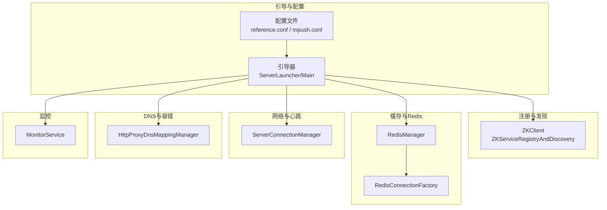
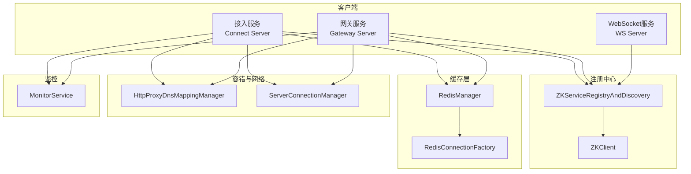
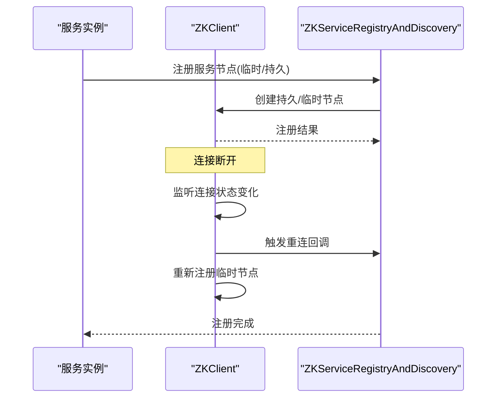
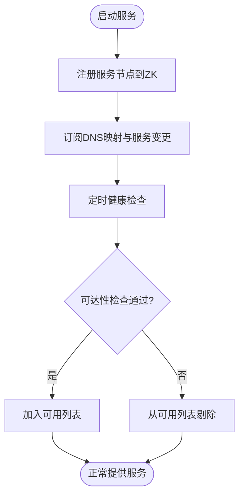
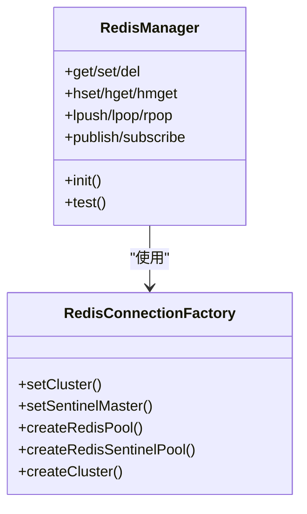
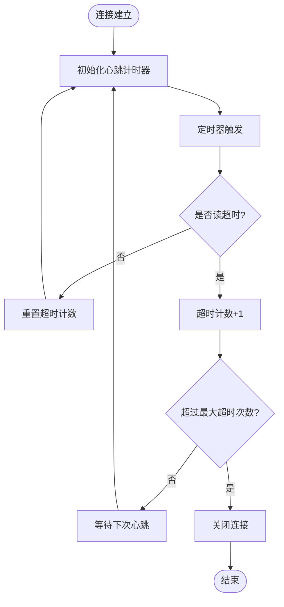
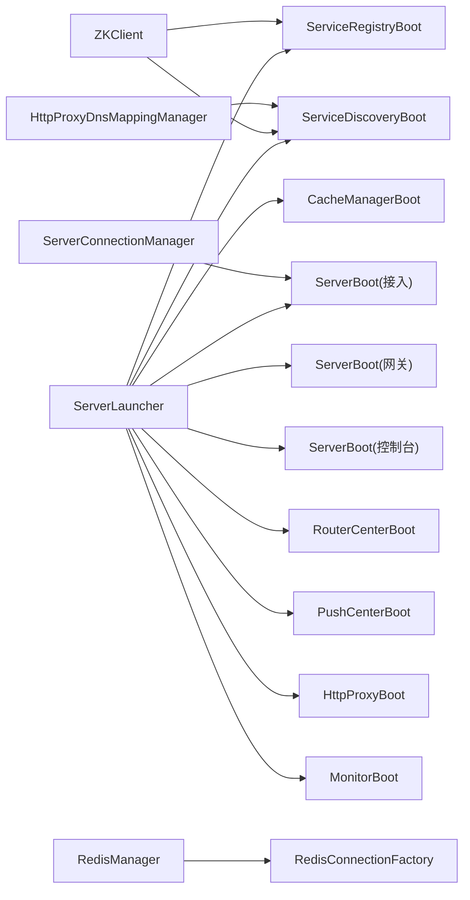

# 灾难恢复

<cite>
**本文引用的文件**
- [reference.conf](file://conf/reference.conf)
- [conf-dev.properties](file://conf/conf-dev.properties)
- [conf-pub.properties](file://conf/conf-pub.properties)
- [mpush.conf](file://mpush-boot/src/main/resources/mpush.conf)
- [ZKClient.java](file://mpush-zk/src/main/java/com/mpush/zk/ZKClient.java)
- [ZKServiceRegistryAndDiscovery.java](file://mpush-zk/src/main/java/com/mpush/zk/ZKServiceRegistryAndDiscovery.java)
- [RedisManager.java](file://mpush-cache/src/main/java/com/mpush/cache/redis/manager/RedisManager.java)
- [RedisConnectionFactory.java](file://mpush-cache/src/main/java/com/mpush/cache/redis/connection/RedisConnectionFactory.java)
- [RedisClusterTest.java](file://mpush-test/src/main/java/com/mpush/test/redis/RedisClusterTest.java)
- [HttpProxyDnsMappingManager.java](file://mpush-common/src/main/java/com/mpush/common/net/HttpProxyDnsMappingManager.java)
- [ServerConnectionManager.java](file://mpush-core/src/main/java/com/mpush/core/server/ServerConnectionManager.java)
- [MonitorService.java](file://mpush-monitor/src/main/java/com/mpush/monitor/service/MonitorService.java)
- [Main.java](file://mpush-boot/src/main/java/com/mpush/bootstrap/Main.java)
- [ServerLauncher.java](file://mpush-boot/src/main/java/com/mpush/bootstrap/ServerLauncher.java)
- [CC.java](file://mpush-tools/src/main/java/com/mpush/tools/config/CC.java)
- [ServerNodes.java](file://mpush-common/src/main/java/com/mpush/common/ServerNodes.java)
</cite>

## 目录
1. [简介](#简介)
2. [项目结构](#项目结构)
3. [核心组件](#核心组件)
4. [架构总览](#架构总览)
5. [详细组件分析](#详细组件分析)
6. [依赖分析](#依赖分析)
7. [性能考量](#性能考量)
8. [故障排查指南](#故障排查指南)
9. [结论](#结论)
10. [附录](#附录)

## 简介
本方案面向MPush系统的灾难恢复，围绕“数据备份、服务恢复、故障切换”三大目标，系统性阐述Zookeeper集群高可用与故障转移、服务注册与发现的容错处理，以及Redis集群的主从切换、数据同步与故障检测策略。同时提供应急预案与操作流程（故障检测、自动恢复、人工干预），结合配置文件中的关键参数给出参数设置与验证方法，并制定灾难恢复演练的实施方案与评估标准。

## 项目结构
MPush采用模块化组织，核心与灾备相关的关键模块如下：
- 配置与引导：conf、mpush-boot
- 注册与发现：mpush-zk
- 缓存与Redis：mpush-cache
- 网络与心跳：mpush-core、mpush-netty
- DNS映射与容错：mpush-common
- 监控与诊断：mpush-monitor
- 测试与验证：mpush-test

图表来源
- [ServerLauncher.java](file://mpush-boot/src/main/java/com/mpush/bootstrap/ServerLauncher.java#L42-L71)
- [Main.java](file://mpush-boot/src/main/java/com/mpush/bootstrap/Main.java#L31-L38)
- [ZKClient.java](file://mpush-zk/src/main/java/com/mpush/zk/ZKClient.java#L76-L95)
- [RedisManager.java](file://mpush-cache/src/main/java/com/mpush/cache/redis/manager/RedisManager.java#L45-L57)
- [RedisConnectionFactory.java](file://mpush-cache/src/main/java/com/mpush/cache/redis/connection/RedisConnectionFactory.java#L121-L159)
- [ServerConnectionManager.java](file://mpush-core/src/main/java/com/mpush/core/server/ServerConnectionManager.java#L58-L68)
- [HttpProxyDnsMappingManager.java](file://mpush-common/src/main/java/com/mpush/common/net/HttpProxyDnsMappingManager.java#L62-L90)
- [MonitorService.java](file://mpush-monitor/src/main/java/com/mpush/monitor/service/MonitorService.java#L86-L93)

章节来源
- [ServerLauncher.java](file://mpush-boot/src/main/java/com/mpush/bootstrap/ServerLauncher.java#L42-L71)
- [Main.java](file://mpush-boot/src/main/java/com/mpush/bootstrap/Main.java#L31-L38)

## 核心组件
- Zookeeper客户端与注册发现：负责服务节点注册、持久/临时节点、连接状态监听与自动重注册。
- Redis缓存与连接工厂：支持单机、哨兵、集群模式，统一对外接口，提供KV、Hash、List、Pub/Sub能力。
- 心跳与连接管理：基于时间轮的连接超时检测，配合最大心跳超时次数阈值实现自动断连。
- DNS映射与健康检查：订阅DNS映射变更，定期健康检查，剔除不可达节点，保障客户端可达性。
- 监控与诊断：周期采集JVM与线程池指标，按负载阈值触发堆栈/内存快照，辅助定位问题。

章节来源
- [ZKClient.java](file://mpush-zk/src/main/java/com/mpush/zk/ZKClient.java#L148-L156)
- [ZKServiceRegistryAndDiscovery.java](file://mpush-zk/src/main/java/com/mpush/zk/ZKServiceRegistryAndDiscovery.java#L78-L93)
- [RedisManager.java](file://mpush-cache/src/main/java/com/mpush/cache/redis/manager/RedisManager.java#L45-L57)
- [RedisConnectionFactory.java](file://mpush-cache/src/main/java/com/mpush/cache/redis/connection/RedisConnectionFactory.java#L121-L159)
- [ServerConnectionManager.java](file://mpush-core/src/main/java/com/mpush/core/server/ServerConnectionManager.java#L137-L197)
- [HttpProxyDnsMappingManager.java](file://mpush-common/src/main/java/com/mpush/common/net/HttpProxyDnsMappingManager.java#L117-L134)
- [MonitorService.java](file://mpush-monitor/src/main/java/com/mpush/monitor/service/MonitorService.java#L65-L83)

## 架构总览
MPush灾备架构以“注册中心高可用 + 缓存层弹性 + 客户端容错 + 主动监控”为核心，确保在单点故障或网络分区场景下仍能维持服务连续性。

图表来源
- [ZKClient.java](file://mpush-zk/src/main/java/com/mpush/zk/ZKClient.java#L76-L95)
- [ZKServiceRegistryAndDiscovery.java](file://mpush-zk/src/main/java/com/mpush/zk/ZKServiceRegistryAndDiscovery.java#L78-L93)
- [RedisManager.java](file://mpush-cache/src/main/java/com/mpush/cache/redis/manager/RedisManager.java#L45-L57)
- [RedisConnectionFactory.java](file://mpush-cache/src/main/java/com/mpush/cache/redis/connection/RedisConnectionFactory.java#L121-L159)
- [HttpProxyDnsMappingManager.java](file://mpush-common/src/main/java/com/mpush/common/net/HttpProxyDnsMappingManager.java#L62-L90)
- [ServerConnectionManager.java](file://mpush-core/src/main/java/com/mpush/core/server/ServerConnectionManager.java#L58-L68)
- [MonitorService.java](file://mpush-monitor/src/main/java/com/mpush/monitor/service/MonitorService.java#L86-L93)

## 详细组件分析

### Zookeeper集群高可用与故障转移
- 连接与重试：ZKClient基于Curator构建，指数回退重试策略，连接/会话超时可配置；连接状态变化时自动重注册临时节点，保证服务在短暂断连后的自愈。
- 注册与发现：服务节点注册为临时节点，随实例生命周期自动清理；持久化节点用于共享配置或元数据。
- 容错处理：当连接断开后，ZKClient在重连成功时重新注册临时节点，避免服务“幽灵”残留；TreeCache本地缓存提升读取性能与弱网络下的稳定性。

图表来源
- [ZKClient.java](file://mpush-zk/src/main/java/com/mpush/zk/ZKClient.java#L148-L156)
- [ZKClient.java](file://mpush-zk/src/main/java/com/mpush/zk/ZKClient.java#L276-L307)
- [ZKServiceRegistryAndDiscovery.java](file://mpush-zk/src/main/java/com/mpush/zk/ZKServiceRegistryAndDiscovery.java#L78-L93)

章节来源
- [ZKClient.java](file://mpush-zk/src/main/java/com/mpush/zk/ZKClient.java#L76-L95)
- [ZKClient.java](file://mpush-zk/src/main/java/com/mpush/zk/ZKClient.java#L148-L156)
- [ZKClient.java](file://mpush-zk/src/main/java/com/mpush/zk/ZKClient.java#L276-L307)
- [ZKServiceRegistryAndDiscovery.java](file://mpush-zk/src/main/java/com/mpush/zk/ZKServiceRegistryAndDiscovery.java#L78-L93)

### 服务注册与发现的容错处理
- 服务节点模型：通过ServerNodes定义接入、网关、WebSocket等服务节点，注册时携带主机、端口、是否持久等信息。
- 动态订阅：HttpProxyDnsMappingManager订阅DNS映射变更，定期健康检查，剔除不可达节点，保障客户端路由稳定。
- 容错策略：当ZK连接断开后，临时节点自动失效；重连后由ZKClient自动重注册，确保服务拓扑一致性。

图表来源
- [ServerNodes.java](file://mpush-common/src/main/java/com/mpush/common/ServerNodes.java#L37-L64)
- [HttpProxyDnsMappingManager.java](file://mpush-common/src/main/java/com/mpush/common/net/HttpProxyDnsMappingManager.java#L117-L134)
- [ZKServiceRegistryAndDiscovery.java](file://mpush-zk/src/main/java/com/mpush/zk/ZKServiceRegistryAndDiscovery.java#L78-L93)

章节来源
- [ServerNodes.java](file://mpush-common/src/main/java/com/mpush/common/ServerNodes.java#L37-L64)
- [HttpProxyDnsMappingManager.java](file://mpush-common/src/main/java/com/mpush/common/net/HttpProxyDnsMappingManager.java#L117-L134)
- [ZKServiceRegistryAndDiscovery.java](file://mpush-zk/src/main/java/com/mpush/zk/ZKServiceRegistryAndDiscovery.java#L78-L93)

### Redis集群灾难恢复策略
- 模式支持：单机、哨兵、集群三种模式，通过配置项选择；哨兵模式下支持主从切换与故障检测。
- 连接工厂：根据模式创建相应连接池/JedisCluster，统一对外接口；提供KV、Hash、List、Pub/Sub等常用能力。
- 故障检测与恢复：RedisManager在初始化时进行连通性测试；客户端侧通过连接池/集群客户端的内置重试与重定向能力提升可用性。

图表来源
- [RedisManager.java](file://mpush-cache/src/main/java/com/mpush/cache/redis/manager/RedisManager.java#L45-L57)
- [RedisManager.java](file://mpush-cache/src/main/java/com/mpush/cache/redis/manager/RedisManager.java#L59-L93)
- [RedisConnectionFactory.java](file://mpush-cache/src/main/java/com/mpush/cache/redis/connection/RedisConnectionFactory.java#L121-L159)

章节来源
- [RedisManager.java](file://mpush-cache/src/main/java/com/mpush/cache/redis/manager/RedisManager.java#L45-L57)
- [RedisConnectionFactory.java](file://mpush-cache/src/main/java/com/mpush/cache/redis/connection/RedisConnectionFactory.java#L121-L159)
- [RedisClusterTest.java](file://mpush-test/src/main/java/com/mpush/test/redis/RedisClusterTest.java#L37-L43)

### 心跳与连接超时的容错
- 时间轮与超时：ServerConnectionManager基于HashedWheelTimer实现心跳超时检测，超时次数超过阈值则主动关闭连接，避免僵尸连接占用资源。
- 参数配置：最小/最大心跳、最大心跳超时次数等均来自配置中心，便于在不同环境调整。

图表来源
- [ServerConnectionManager.java](file://mpush-core/src/main/java/com/mpush/core/server/ServerConnectionManager.java#L137-L197)

章节来源
- [ServerConnectionManager.java](file://mpush-core/src/main/java/com/mpush/core/server/ServerConnectionManager.java#L58-L68)
- [ServerConnectionManager.java](file://mpush-core/src/main/java/com/mpush/core/server/ServerConnectionManager.java#L137-L197)

### 监控与诊断
- 周期采集：MonitorService周期采集JVM与线程池指标，按配置周期输出日志并可触发堆栈/内存快照。
- 负载阈值：根据系统负载阈值自动触发诊断动作，辅助定位性能瓶颈与异常。

章节来源
- [MonitorService.java](file://mpush-monitor/src/main/java/com/mpush/monitor/service/MonitorService.java#L65-L83)
- [MonitorService.java](file://mpush-monitor/src/main/java/com/mpush/monitor/service/MonitorService.java#L101-L130)

## 依赖分析
- 引导链路：ServerLauncher按顺序启动缓存、注册发现、接入/网关/控制台、路由中心、推送中心、HTTP代理、监控等模块。
- 配置来源：reference.conf提供默认配置，mpush.conf覆盖关键参数；CC.java统一读取配置并注入各组件。
- 组件耦合：ZKClient与ZKServiceRegistryAndDiscovery紧密协作；RedisManager依赖RedisConnectionFactory；DNS映射与心跳分别服务于路由与连接稳定性。

图表来源
- [ServerLauncher.java](file://mpush-boot/src/main/java/com/mpush/bootstrap/ServerLauncher.java#L57-L70)
- [ZKClient.java](file://mpush-zk/src/main/java/com/mpush/zk/ZKClient.java#L76-L95)
- [RedisManager.java](file://mpush-cache/src/main/java/com/mpush/cache/redis/manager/RedisManager.java#L45-L57)
- [HttpProxyDnsMappingManager.java](file://mpush-common/src/main/java/com/mpush/common/net/HttpProxyDnsMappingManager.java#L62-L90)
- [ServerConnectionManager.java](file://mpush-core/src/main/java/com/mpush/core/server/ServerConnectionManager.java#L58-L68)

章节来源
- [ServerLauncher.java](file://mpush-boot/src/main/java/com/mpush/bootstrap/ServerLauncher.java#L57-L70)
- [CC.java](file://mpush-tools/src/main/java/com/mpush/tools/config/CC.java#L239-L278)

## 性能考量
- 心跳与超时：合理设置最小/最大心跳与最大心跳超时次数，避免频繁断连或资源占用。
- 连接池与线程池：Redis连接池参数（最大活跃、空闲、阻塞等待）与线程池规模需结合业务QPS与延迟目标调优。
- 监控频率：监控采样周期与日志级别需平衡诊断需求与系统开销。

## 故障排查指南
- Zookeeper连接异常
  - 现象：服务无法注册/发现，或注册节点丢失。
  - 处理：检查连接超时、重试参数；确认ZK集群状态；关注连接状态监听回调与临时节点重注册。
- Redis连接异常
  - 现象：缓存读写失败、发布订阅异常。
  - 处理：确认模式配置（单机/哨兵/集群）与节点列表；查看连接池配置；验证初始化连通性测试。
- 心跳超时断连
  - 现象：客户端连接被关闭。
  - 处理：检查心跳参数与网络质量；确认服务端时间轮初始化与超时阈值。
- DNS映射不可达
  - 现象：客户端路由到不可达节点。
  - 处理：检查DNS映射订阅与健康检查逻辑，确认可用列表更新。

章节来源
- [ZKClient.java](file://mpush-zk/src/main/java/com/mpush/zk/ZKClient.java#L76-L95)
- [RedisManager.java](file://mpush-cache/src/main/java/com/mpush/cache/redis/manager/RedisManager.java#L427-L436)
- [ServerConnectionManager.java](file://mpush-core/src/main/java/com/mpush/core/server/ServerConnectionManager.java#L137-L197)
- [HttpProxyDnsMappingManager.java](file://mpush-common/src/main/java/com/mpush/common/net/HttpProxyDnsMappingManager.java#L117-L134)

## 结论
MPush通过Zookeeper的高可用与自动重注册、Redis的多模式弹性、客户端DNS映射与健康检查、以及心跳超时与监控诊断，构建了完整的灾备体系。建议在生产环境中严格校验配置参数，完善演练与预案，持续优化监控与告警，确保在真实故障场景下快速恢复与稳定运行。

## 附录

### 灾难恢复参数与验证清单
- Zookeeper
  - server-address、namespace、digest、watch-path、retry.baseSleepTimeMs、retry.maxRetries、retry.maxSleepMs、connectionTimeoutMs、sessionTimeoutMs
  - 验证：启动后观察ZKClient连接状态回调与临时节点重注册；检查服务注册/发现可用性
- Redis
  - cluster-model、sentinel-master、nodes、password、连接池参数（maxTotal、maxIdle、minIdle、maxWaitMillis等）
  - 验证：初始化阶段RedisManager.test()；执行基本KV/HASH/LIST/PUBSUB操作
- 心跳与连接
  - core.min-heartbeat、core.max-heartbeat、core.max-hb-timeout-times
  - 验证：模拟网络抖动与慢响应，观察连接关闭行为
- DNS映射
  - http.dns-mapping、http.proxy-enabled
  - 验证：订阅DNS映射变更，健康检查线程运行情况

章节来源
- [reference.conf](file://conf/reference.conf#L125-L141)
- [reference.conf](file://conf/reference.conf#L143-L169)
- [reference.conf](file://conf/reference.conf#L22-L31)
- [reference.conf](file://conf/reference.conf#L171-L180)
- [mpush.conf](file://mpush-boot/src/main/resources/mpush.conf#L5-L9)
- [RedisManager.java](file://mpush-cache/src/main/java/com/mpush/cache/redis/manager/RedisManager.java#L45-L57)
- [ServerConnectionManager.java](file://mpush-core/src/main/java/com/mpush/core/server/ServerConnectionManager.java#L137-L197)
- [HttpProxyDnsMappingManager.java](file://mpush-common/src/main/java/com/mpush/common/net/HttpProxyDnsMappingManager.java#L62-L90)

### 应急预案与操作流程
- 故障检测
  - 监控告警触发（CPU/内存/线程池/连接数/Redis/ZK状态）
  - 日志分析与堆栈/内存快照收集
- 自动恢复
  - ZK：连接断开自动重连与临时节点重注册
  - Redis：连接池/集群客户端自动重试与重定向
  - DNS：健康检查剔除不可达节点
- 人工干预
  - 手动切换ZK节点或Redis主从
  - 调整心跳与连接池参数
  - 修复网络与防火墙策略

章节来源
- [MonitorService.java](file://mpush-monitor/src/main/java/com/mpush/monitor/service/MonitorService.java#L65-L83)
- [ZKClient.java](file://mpush-zk/src/main/java/com/mpush/zk/ZKClient.java#L148-L156)
- [RedisManager.java](file://mpush-cache/src/main/java/com/mpush/cache/redis/manager/RedisManager.java#L427-L436)
- [HttpProxyDnsMappingManager.java](file://mpush-common/src/main/java/com/mpush/common/net/HttpProxyDnsMappingManager.java#L117-L134)

### 灾难恢复演练实施方案
- 场景设计
  - ZK单点故障：模拟ZK进程停止/网络隔离，验证自动重连与服务恢复
  - Redis主节点故障：模拟主从切换，验证客户端自动切换与数据一致性
  - 网络分区：模拟客户端与服务端网络隔离，验证心跳超时与断连恢复
- 步骤
  - 准备阶段：记录初始状态与配置参数
  - 执行阶段：按场景逐步注入故障，观察系统行为
  - 收敛阶段：恢复故障，验证系统自愈与数据一致性
- 评估标准
  - 服务可用性（注册/发现/连接成功率）
  - 恢复时间（从故障发生到服务可用的时间）
  - 数据一致性（缓存键值、路由信息）
  - 监控与日志（告警及时性、诊断信息完整性）

章节来源
- [ZKClient.java](file://mpush-zk/src/main/java/com/mpush/zk/ZKClient.java#L76-L95)
- [RedisManager.java](file://mpush-cache/src/main/java/com/mpush/cache/redis/manager/RedisManager.java#L427-L436)
- [ServerConnectionManager.java](file://mpush-core/src/main/java/com/mpush/core/server/ServerConnectionManager.java#L137-L197)
- [MonitorService.java](file://mpush-monitor/src/main/java/com/mpush/monitor/service/MonitorService.java#L65-L83)