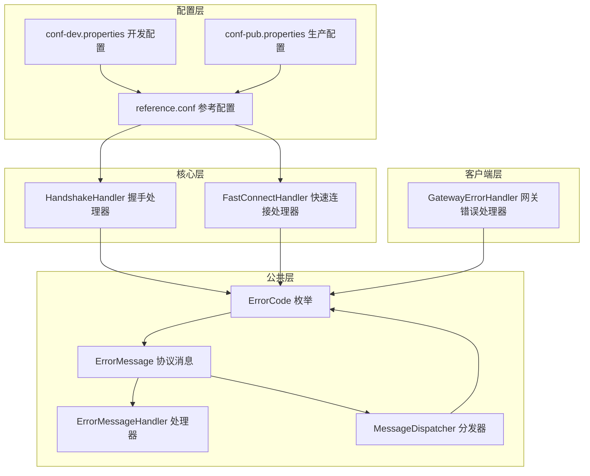
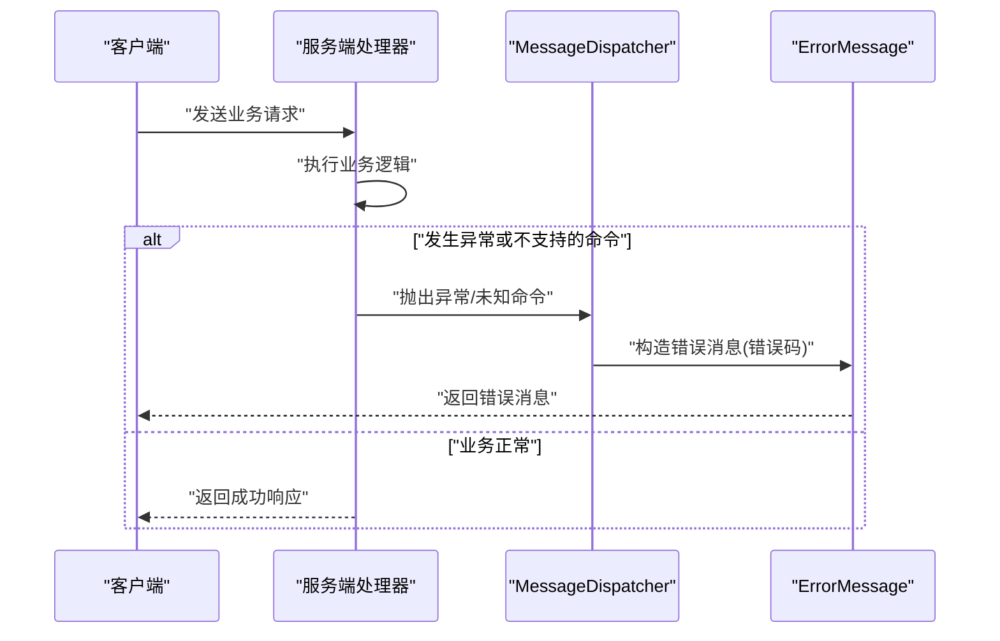
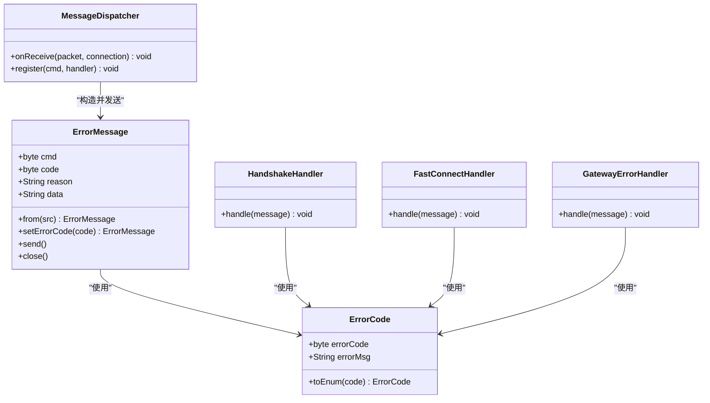

# 错误码管理

<cite>
**本文引用的文件**
- [ErrorCode.java](file://mpush-common/src/main/java/com/mpush/common/ErrorCode.java)
- [ErrorMessage.java](file://mpush-common/src/main/java/com/mpush/common/message/ErrorMessage.java)
- [ErrorMessageHandler.java](file://mpush-common/src/main/java/com/mpush/common/handler/ErrorMessageHandler.java)
- [MessageDispatcher.java](file://mpush-common/src/main/java/com/mpush/common/MessageDispatcher.java)
- [FastConnectHandler.java](file://mpush-core/src/main/java/com/mpush/core/handler/FastConnectHandler.java)
- [HandshakeHandler.java](file://mpush-core/src/main/java/com/mpush/core/handler/HandshakeHandler.java)
- [GatewayErrorHandler.java](file://mpush-client/src/main/java/com/mpush/client/gateway/handler/GatewayErrorHandler.java)
- [reference.conf](file://conf/reference.conf)
- [conf-dev.properties](file://conf/conf-dev.properties)
- [conf-pub.properties](file://conf/conf-pub.properties)
- [PushClientTestMain.java](file://mpush-test/src/main/java/com/mpush/test/push/PushClientTestMain.java)
- [PushClientTestMain2.java](file://mpush-test/src/main/java/com/mpush/test/push/PushClientTestMain2.java)
</cite>

## 目录
1. [简介](#简介)
2. [项目结构](#项目结构)
3. [核心组件](#核心组件)
4. [架构总览](#架构总览)
5. [详细组件分析](#详细组件分析)
6. [依赖分析](#依赖分析)
7. [性能考虑](#性能考虑)
8. [故障排查指南](#故障排查指南)
9. [结论](#结论)
10. [附录](#附录)

## 简介
本文件面向MPush的错误码管理体系，系统性梳理ErrorCode枚举的定义、分类与使用方式，解释错误码在协议层、服务层与客户端层的应用场景，说明错误码与系统配置（如心跳、会话过期、压缩阈值等）之间的关联，并提供查询与调试方法，帮助开发者快速定位与解决问题。

## 项目结构
围绕错误码管理的关键代码分布在以下模块：
- mpush-common：错误码定义、通用消息与处理器
- mpush-core：握手、快速连接等核心处理器
- mpush-client：网关错误处理与客户端推送
- conf：系统配置参考与环境配置
- mpush-test：推送与统计测试示例

图表来源
- [ErrorCode.java](file://mpush-common/src/main/java/com/mpush/common/ErrorCode.java#L27-L55)
- [ErrorMessage.java](file://mpush-common/src/main/java/com/mpush/common/message/ErrorMessage.java#L38-L123)
- [ErrorMessageHandler.java](file://mpush-common/src/main/java/com/mpush/common/handler/ErrorMessageHandler.java#L31-L41)
- [MessageDispatcher.java](file://mpush-common/src/main/java/com/mpush/common/MessageDispatcher.java#L46-L112)
- [HandshakeHandler.java](file://mpush-core/src/main/java/com/mpush/core/handler/HandshakeHandler.java#L47-L160)
- [FastConnectHandler.java](file://mpush-core/src/main/java/com/mpush/core/handler/FastConnectHandler.java#L44-L95)
- [GatewayErrorHandler.java](file://mpush-client/src/main/java/com/mpush/client/gateway/handler/GatewayErrorHandler.java#L41-L74)
- [reference.conf](file://conf/reference.conf#L23-L31)
- [conf-dev.properties](file://conf/conf-dev.properties#L1-L5)
- [conf-pub.properties](file://conf/conf-pub.properties#L1-L5)

章节来源
- [ErrorCode.java](file://mpush-common/src/main/java/com/mpush/common/ErrorCode.java#L27-L55)
- [reference.conf](file://conf/reference.conf#L23-L31)

## 核心组件
- 错误码定义：ErrorCode枚举集中定义了系统内所有错误码及其描述，提供从数值到枚举的转换工具方法。
- 错误消息：ErrorMessage作为协议消息承载错误码、原因与附加数据，支持编码解码与JSON序列化。
- 错误处理链路：MessageDispatcher在分发消息时捕获异常并返回错误消息；各处理器在业务逻辑中直接构造并发送错误消息。
- 客户端错误消费：GatewayErrorHandler接收来自网关的错误消息并触发对应回调（离线、失败、重定向）。

章节来源
- [ErrorCode.java](file://mpush-common/src/main/java/com/mpush/common/ErrorCode.java#L27-L55)
- [ErrorMessage.java](file://mpush-common/src/main/java/com/mpush/common/message/ErrorMessage.java#L38-L123)
- [MessageDispatcher.java](file://mpush-common/src/main/java/com/mpush/common/MessageDispatcher.java#L46-L112)
- [GatewayErrorHandler.java](file://mpush-client/src/main/java/com/mpush/client/gateway/handler/GatewayErrorHandler.java#L41-L74)

## 架构总览
错误码在系统中的流转路径如下：
- 业务处理器在检测到异常或不合法状态时，通过ErrorMessage封装错误码并发送给对端。
- MessageDispatcher在统一入口捕获未处理异常，返回“处理消息错误”或“命令不支持”的错误消息。
- 客户端收到错误消息后，依据错误码执行相应策略（重试、重定向、降级等）。

图表来源
- [MessageDispatcher.java](file://mpush-common/src/main/java/com/mpush/common/MessageDispatcher.java#L80-L111)
- [ErrorMessage.java](file://mpush-common/src/main/java/com/mpush/common/message/ErrorMessage.java#L38-L123)

## 详细组件分析

### 错误码定义与分类
- 枚举项与含义
  - 用户离线：OFFLINE
  - 推送到客户端失败：PUSH_CLIENT_FAILURE
  - 路由变更：ROUTER_CHANGE
  - 确认超时：ACK_TIMEOUT
  - 处理消息错误：DISPATCH_ERROR
  - 不支持的命令：UNSUPPORTED_CMD
  - 重复握手：REPEAT_HANDSHAKE
  - 会话已过期：SESSION_EXPIRED
  - 设备无效：INVALID_DEVICE
  - 未知错误：UNKNOWN
- 编码与转换
  - 错误码以字节形式在网络上传输，提供数值到枚举的转换方法，便于解析与匹配。
- 分类标准
  - 系统错误码：DISPATCH_ERROR、UNSUPPORTED_CMD
  - 业务错误码：OFFLINE、PUSH_CLIENT_FAILURE、ROUTER_CHANGE、ACK_TIMEOUT
  - 安全/握手错误码：REPEAT_HANDSHAKE
  - 会话/设备错误码：SESSION_EXPIRED、INVALID_DEVICE
  - 通用兜底：UNKNOWN

章节来源
- [ErrorCode.java](file://mpush-common/src/main/java/com/mpush/common/ErrorCode.java#L27-L55)

### 错误消息模型与序列化
- 字段
  - cmd：触发错误的命令码
  - code：错误码
  - reason：错误原因文本
  - data：附加数据（如上下文信息）
- 编解码
  - 支持二进制编解码与JSON序列化，便于日志与调试。
- 使用方式
  - 通过静态工厂方法从请求包派生错误响应包，设置错误码与原因后发送或关闭连接。

章节来源
- [ErrorMessage.java](file://mpush-common/src/main/java/com/mpush/common/message/ErrorMessage.java#L38-L123)

### 统一分发与异常兜底
- 在MessageDispatcher中，当找不到对应处理器或处理器抛出异常时：
  - 若策略为拒绝，则返回“不支持的命令”错误消息
  - 若策略为记录日志，则返回“处理消息错误”错误消息
- 该机制确保异常不会穿透到上层，同时保留可观测性与可诊断性。

章节来源
- [MessageDispatcher.java](file://mpush-common/src/main/java/com/mpush/common/MessageDispatcher.java#L80-L111)

### 握手阶段的错误处理
- 重复握手：若设备ID与当前会话一致，返回“重复握手”错误消息
- 参数校验失败：构造错误消息并关闭连接
- 成功握手后，继续建立会话与密钥

章节来源
- [HandshakeHandler.java](file://mpush-core/src/main/java/com/mpush/core/handler/HandshakeHandler.java#L69-L160)

### 快速连接阶段的错误处理
- 会话过期：当缓存中无对应会话时，返回“会话已过期”
- 设备不匹配：当设备ID与缓存不一致时，返回“设备无效”
- 成功则恢复会话并更新心跳

章节来源
- [FastConnectHandler.java](file://mpush-core/src/main/java/com/mpush/core/handler/FastConnectHandler.java#L56-L95)

### 客户端错误消费与策略
- 离线：收到“用户离线”错误时，触发离线回调
- 推送失败：收到“推送到客户端失败”错误时，触发失败回调
- 路由变更：收到“路由变更”错误时，触发重定向回调
- 请求超时：若无对应请求，记录警告并忽略

章节来源
- [GatewayErrorHandler.java](file://mpush-client/src/main/java/com/mpush/client/gateway/handler/GatewayErrorHandler.java#L54-L72)

### 错误码与系统配置的关系
- 心跳与会话过期
  - 心跳区间与会话过期时间影响快速连接与会话有效性，间接影响“会话已过期”等错误的发生概率
- 压缩阈值与最大包大小
  - 影响消息体积与传输稳定性，可能引发“处理消息错误”或“不支持的命令”等错误
- 日志级别
  - 开发环境与生产环境的日志级别差异会影响错误信息的可观测性

章节来源
- [reference.conf](file://conf/reference.conf#L23-L31)
- [conf-dev.properties](file://conf/conf-dev.properties#L1-L5)
- [conf-pub.properties](file://conf/conf-pub.properties#L1-L5)

### 错误码使用指南
- 在业务处理器中
  - 对于非法参数、设备不匹配、会话过期等情况，直接构造错误消息并发送
- 在MessageDispatcher中
  - 对未注册命令或异常进行统一错误返回，保证协议一致性
- 在客户端
  - 根据错误码执行离线、失败或重定向策略，避免重复尝试无效路径

章节来源
- [HandshakeHandler.java](file://mpush-core/src/main/java/com/mpush/core/handler/HandshakeHandler.java#L69-L160)
- [FastConnectHandler.java](file://mpush-core/src/main/java/com/mpush/core/handler/FastConnectHandler.java#L56-L95)
- [MessageDispatcher.java](file://mpush-common/src/main/java/com/mpush/common/MessageDispatcher.java#L80-L111)
- [GatewayErrorHandler.java](file://mpush-client/src/main/java/com/mpush/client/gateway/handler/GatewayErrorHandler.java#L54-L72)

## 依赖分析
- 组件耦合
  - ErrorCode被ErrorMessage、各处理器广泛依赖，形成稳定的错误码契约
  - MessageDispatcher作为统一出口，向上游处理器提供错误返回能力
- 外部依赖
  - 配置系统（HOCON）为错误码相关的可观测性与行为提供支撑（日志级别、心跳、会话过期等）

图表来源
- [ErrorCode.java](file://mpush-common/src/main/java/com/mpush/common/ErrorCode.java#L27-L55)
- [ErrorMessage.java](file://mpush-common/src/main/java/com/mpush/common/message/ErrorMessage.java#L38-L123)
- [MessageDispatcher.java](file://mpush-common/src/main/java/com/mpush/common/MessageDispatcher.java#L46-L112)
- [HandshakeHandler.java](file://mpush-core/src/main/java/com/mpush/core/handler/HandshakeHandler.java#L47-L160)
- [FastConnectHandler.java](file://mpush-core/src/main/java/com/mpush/core/handler/FastConnectHandler.java#L44-L95)
- [GatewayErrorHandler.java](file://mpush-client/src/main/java/com/mpush/client/gateway/handler/GatewayErrorHandler.java#L41-L74)

## 性能考虑
- 错误消息的发送与关闭应尽量轻量，避免在高频错误场景中引入额外开销
- 合理设置日志级别与错误统计，避免过多错误日志影响吞吐
- 通过配置调优心跳与会话过期时间，减少因会话失效导致的错误风暴

## 故障排查指南
- 如何定位错误来源
  - 查看MessageDispatcher在分发阶段的异常日志与错误消息返回
  - 检查处理器中的条件分支（如设备ID、会话有效性）
- 常见问题与建议
  - 重复握手：确认客户端设备ID与当前会话一致，避免重复握手
  - 会话过期：检查会话过期时间配置与客户端快速重连流程
  - 推送到客户端失败：检查网关状态与客户端在线状态
  - 路由变更：触发重定向逻辑，确保客户端重新绑定正确路由
- 调试方法
  - 提升日志级别至开发环境配置，观察错误消息的触发点
  - 使用测试用例模拟高并发推送，统计错误码分布并优化流控

章节来源
- [MessageDispatcher.java](file://mpush-common/src/main/java/com/mpush/common/MessageDispatcher.java#L80-L111)
- [HandshakeHandler.java](file://mpush-core/src/main/java/com/mpush/core/handler/HandshakeHandler.java#L69-L160)
- [FastConnectHandler.java](file://mpush-core/src/main/java/com/mpush/core/handler/FastConnectHandler.java#L56-L95)
- [GatewayErrorHandler.java](file://mpush-client/src/main/java/com/mpush/client/gateway/handler/GatewayErrorHandler.java#L54-L72)
- [conf-dev.properties](file://conf/conf-dev.properties#L1-L5)
- [PushClientTestMain.java](file://mpush-test/src/main/java/com/mpush/test/push/PushClientTestMain.java#L39-L77)
- [PushClientTestMain2.java](file://mpush-test/src/main/java/com/mpush/test/push/PushClientTestMain2.java#L44-L139)

## 结论
MPush的错误码体系以ErrorCode为核心，配合ErrorMessage与MessageDispatcher实现了统一、可追踪的错误处理机制。通过明确的分类与严格的使用规范，开发者可以在握手、快速连接、推送等关键环节快速识别并处置异常，结合配置与测试手段，能够高效地定位问题并优化系统稳定性。

## 附录

### 错误码对照表
- OFFLINE：用户离线
- PUSH_CLIENT_FAILURE：推送到客户端失败
- ROUTER_CHANGE：路由变更
- ACK_TIMEOUT：确认超时
- DISPATCH_ERROR：处理消息错误
- UNSUPPORTED_CMD：不支持的命令
- REPEAT_HANDSHAKE：重复握手
- SESSION_EXPIRED：会话已过期
- INVALID_DEVICE：设备无效
- UNKNOWN：未知错误

章节来源
- [ErrorCode.java](file://mpush-common/src/main/java/com/mpush/common/ErrorCode.java#L27-L55)