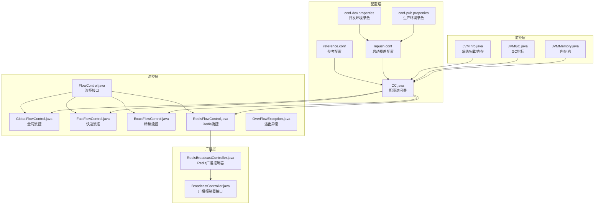
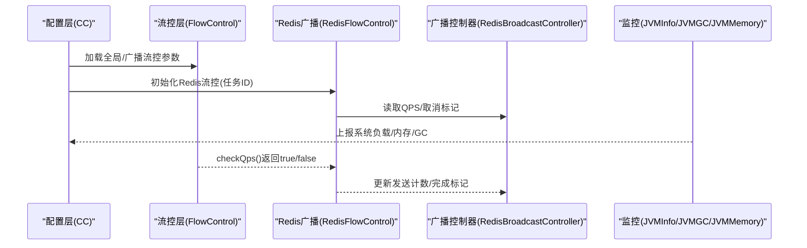
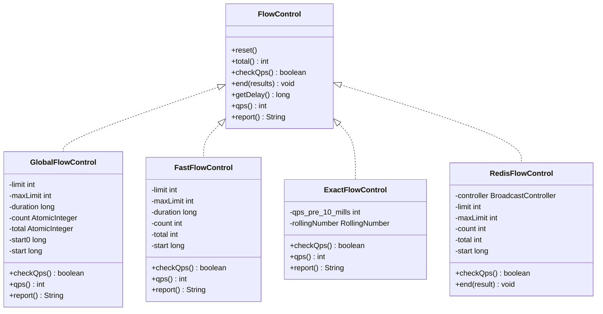
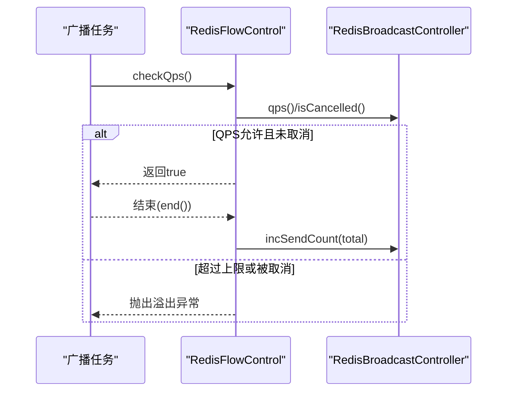
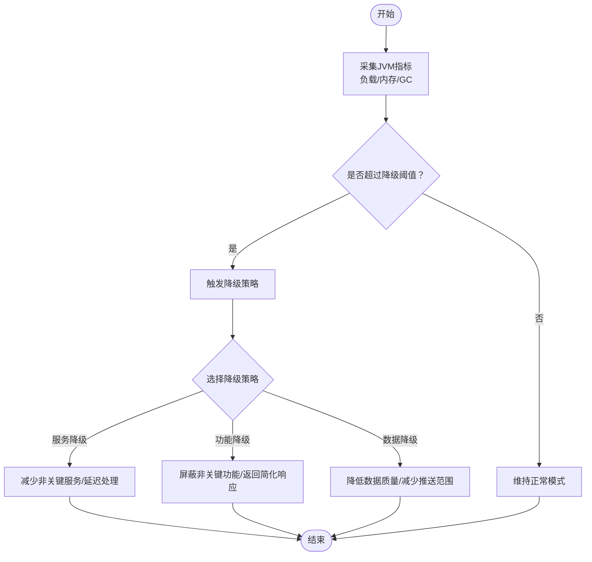
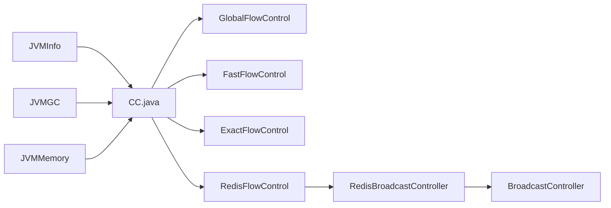

# 降级策略

<cite>
**本文引用的文件**
- [conf/reference.conf](file://conf/reference.conf)
- [conf/conf-dev.properties](file://conf/conf-dev.properties)
- [conf/conf-pub.properties](file://conf/conf-pub.properties)
- [mpush-boot/src/main/resources/mpush.conf](file://mpush-boot/src/main/resources/mpush.conf)
- [mpush-common/src/main/java/com/mpush/common/qps/FlowControl.java](file://mpush-common/src/main/java/com/mpush/common/qps/FlowControl.java)
- [mpush-common/src/main/java/com/mpush/common/qps/GlobalFlowControl.java](file://mpush-common/src/main/java/com/mpush/common/qps/GlobalFlowControl.java)
- [mpush-common/src/main/java/com/mpush/common/qps/FastFlowControl.java](file://mpush-common/src/main/java/com/mpush/common/qps/FastFlowControl.java)
- [mpush-common/src/main/java/com/mpush/common/qps/ExactFlowControl.java](file://mpush-common/src/main/java/com/mpush/common/qps/ExactFlowControl.java)
- [mpush-common/src/main/java/com/mpush/common/qps/RedisFlowControl.java](file://mpush-common/src/main/java/com/mpush/common/qps/RedisFlowControl.java)
- [mpush-common/src/main/java/com/mpush/common/qps/OverFlowException.java](file://mpush-common/src/main/java/com/mpush/common/qps/OverFlowException.java)
- [mpush-common/src/main/java/com/mpush/common/push/RedisBroadcastController.java](file://mpush-common/src/main/java/com/mpush/common/push/RedisBroadcastController.java)
- [mpush-api/src/main/java/com/mpush/api/push/BroadcastController.java](file://mpush-api/src/main/java/com/mpush/api/push/BroadcastController.java)
- [mpush-core/src/main/java/com/mpush/core/server/GatewayServer.java](file://mpush-core/src/main/java/com/mpush/core/server/GatewayServer.java)
- [mpush-core/src/main/java/com/mpush/core/server/ConnectionServer.java](file://mpush-core/src/main/java/com/mpush/core/server/ConnectionServer.java)
- [mpush-monitor/src/main/java/com/mpush/monitor/quota/impl/JVMInfo.java](file://mpush-monitor/src/main/java/com/mpush/monitor/quota/impl/JVMInfo.java)
- [mpush-monitor/src/main/java/com/mpush/monitor/quota/impl/JVMGC.java](file://mpush-monitor/src/main/java/com/mpush/monitor/quota/impl/JVMGC.java)
- [mpush-monitor/src/main/java/com/mpush/monitor/quota/impl/JVMMemory.java](file://mpush-monitor/src/main/java/com/mpush/monitor/quota/impl/JVMMemory.java)
- [mpush-tools/src/main/java/com/mpush/tools/config/CC.java](file://mpush-tools/src/main/java/com/mpush/tools/config/CC.java)
- [mpush-tools/src/main/java/com/mpush/tools/common/RollingNumber.java](file://mpush-tools/src/main/java/com/mpush/tools/common/RollingNumber.java)
</cite>

## 目录
1. [简介](#简介)
2. [项目结构](#项目结构)
3. [核心组件](#核心组件)
4. [架构总览](#架构总览)
5. [详细组件分析](#详细组件分析)
6. [依赖分析](#依赖分析)
7. [性能考虑](#性能考虑)
8. [故障排查指南](#故障排查指南)
9. [结论](#结论)
10. [附录](#附录)

## 简介
本文件面向MPush的降级策略与流量控制体系，系统性阐述服务降级、功能降级、数据降级的策略设计与实现原理；详解全局流量控制、广播流量控制、精确流量控制等策略；深入说明Redis驱动的广播流量控制实现与配置方法；给出降级触发条件（系统负载、资源限制、外部依赖）的判断逻辑；并结合配置文件中的关键参数，提供参数设置与效果评估方法。

## 项目结构
MPush围绕“配置-流控-广播-监控”四个维度组织降级能力：
- 配置层：通过HOCON与Properties加载系统参数，涵盖网络、线程池、推送流控、监控等。
- 流控层：提供通用接口与多种实现（全局、快速、精确、Redis），统一抽象checkQps、统计与异常。
- 广播层：基于Redis的广播控制器，动态下发QPS、取消广播、记录成功用户等。
- 监控层：采集JVM指标，作为降级触发条件的重要依据。

图表来源
- [conf/reference.conf](file://conf/reference.conf#L1-L239)
- [conf/conf-dev.properties](file://conf/conf-dev.properties#L1-L5)
- [conf/conf-pub.properties](file://conf/conf-pub.properties#L1-L5)
- [mpush-boot/src/main/resources/mpush.conf](file://mpush-boot/src/main/resources/mpush.conf#L1-L16)
- [mpush-tools/src/main/java/com/mpush/tools/config/CC.java](file://mpush-tools/src/main/java/com/mpush/tools/config/CC.java#L135-L159)
- [mpush-common/src/main/java/com/mpush/common/qps/FlowControl.java](file://mpush-common/src/main/java/com/mpush/common/qps/FlowControl.java#L27-L60)
- [mpush-common/src/main/java/com/mpush/common/qps/GlobalFlowControl.java](file://mpush-common/src/main/java/com/mpush/common/qps/GlobalFlowControl.java#L30-L91)
- [mpush-common/src/main/java/com/mpush/common/qps/FastFlowControl.java](file://mpush-common/src/main/java/com/mpush/common/qps/FastFlowControl.java#L45-L92)
- [mpush-common/src/main/java/com/mpush/common/qps/ExactFlowControl.java](file://mpush-common/src/main/java/com/mpush/common/qps/ExactFlowControl.java#L37-L91)
- [mpush-common/src/main/java/com/mpush/common/qps/RedisFlowControl.java](file://mpush-common/src/main/java/com/mpush/common/qps/RedisFlowControl.java#L39-L97)
- [mpush-common/src/main/java/com/mpush/common/qps/OverFlowException.java](file://mpush-common/src/main/java/com/mpush/common/qps/OverFlowException.java#L27-L47)
- [mpush-api/src/main/java/com/mpush/api/push/BroadcastController.java](file://mpush-api/src/main/java/com/mpush/api/push/BroadcastController.java#L29-L51)
- [mpush-common/src/main/java/com/mpush/common/push/RedisBroadcastController.java](file://mpush-common/src/main/java/com/mpush/common/push/RedisBroadcastController.java#L34-L103)
- [mpush-monitor/src/main/java/com/mpush/monitor/quota/impl/JVMInfo.java](file://mpush-monitor/src/main/java/com/mpush/monitor/quota/impl/JVMInfo.java#L31-L68)
- [mpush-monitor/src/main/java/com/mpush/monitor/quota/impl/JVMGC.java](file://mpush-monitor/src/main/java/com/mpush/monitor/quota/impl/JVMGC.java#L31-L35)
- [mpush-monitor/src/main/java/com/mpush/monitor/quota/impl/JVMMemory.java](file://mpush-monitor/src/main/java/com/mpush/monitor/quota/impl/JVMMemory.java#L32-L37)

章节来源
- [conf/reference.conf](file://conf/reference.conf#L1-L239)
- [mpush-boot/src/main/resources/mpush.conf](file://mpush-boot/src/main/resources/mpush.conf#L1-L16)
- [mpush-tools/src/main/java/com/mpush/tools/config/CC.java](file://mpush-tools/src/main/java/com/mpush/tools/config/CC.java#L135-L159)

## 核心组件
- 流控接口与实现
  - 接口定义统一checkQps、统计、延迟、报告等能力，便于替换与扩展。
  - 全局流控：基于原子计数与时间窗口，适合跨任务的总体速率限制。
  - 快速流控：轻量计数器，适合低开销场景。
  - 精确流控：滚动桶计数，提供更精细的瞬时限流。
  - Redis流控：基于Redis广播控制器，动态拉取QPS、支持取消与累计发送数。
- 广播控制器
  - 接口定义任务ID、QPS、更新QPS、完成状态、发送计数、取消、成功用户列表等。
  - Redis实现通过哈希字段存储QPS、发送计数、取消标记、完成标记，列表维护成功用户ID。
- 触发条件与监控
  - 通过JVMInfo/JVMGC/JVMMemory采集系统负载、GC、内存等指标，作为降级阈值输入。
- 配置访问
  - CC.java提供统一的配置访问入口，将HOCON与Properties合并后的配置映射为Java对象，供流控与服务器模块使用。

章节来源
- [mpush-common/src/main/java/com/mpush/common/qps/FlowControl.java](file://mpush-common/src/main/java/com/mpush/common/qps/FlowControl.java#L27-L60)
- [mpush-common/src/main/java/com/mpush/common/qps/GlobalFlowControl.java](file://mpush-common/src/main/java/com/mpush/common/qps/GlobalFlowControl.java#L30-L91)
- [mpush-common/src/main/java/com/mpush/common/qps/FastFlowControl.java](file://mpush-common/src/main/java/com/mpush/common/qps/FastFlowControl.java#L45-L92)
- [mpush-common/src/main/java/com/mpush/common/qps/ExactFlowControl.java](file://mpush-common/src/main/java/com/mpush/common/qps/ExactFlowControl.java#L37-L91)
- [mpush-common/src/main/java/com/mpush/common/qps/RedisFlowControl.java](file://mpush-common/src/main/java/com/mpush/common/qps/RedisFlowControl.java#L39-L97)
- [mpush-api/src/main/java/com/mpush/api/push/BroadcastController.java](file://mpush-api/src/main/java/com/mpush/api/push/BroadcastController.java#L29-L51)
- [mpush-common/src/main/java/com/mpush/common/push/RedisBroadcastController.java](file://mpush-common/src/main/java/com/mpush/common/push/RedisBroadcastController.java#L34-L103)
- [mpush-monitor/src/main/java/com/mpush/monitor/quota/impl/JVMInfo.java](file://mpush-monitor/src/main/java/com/mpush/monitor/quota/impl/JVMInfo.java#L31-L68)
- [mpush-monitor/src/main/java/com/mpush/monitor/quota/impl/JVMGC.java](file://mpush-monitor/src/main/java/com/mpush/monitor/quota/impl/JVMGC.java#L31-L35)
- [mpush-monitor/src/main/java/com/mpush/monitor/quota/impl/JVMMemory.java](file://mpush-monitor/src/main/java/com/mpush/monitor/quota/impl/JVMMemory.java#L32-L37)
- [mpush-tools/src/main/java/com/mpush/tools/config/CC.java](file://mpush-tools/src/main/java/com/mpush/tools/config/CC.java#L135-L159)

## 架构总览
降级策略贯穿“配置-流控-广播-监控”，形成闭环：
- 配置层提供流控参数（全局/广播）、网络整形、线程池规模等。
- 流控层在业务执行前进行checkQps，必要时抛出溢出异常或延迟。
- Redis广播控制器动态下发QPS、取消广播，确保广播任务可控。
- 监控层采集系统指标，作为降级阈值输入，驱动策略切换。

图表来源
- [mpush-tools/src/main/java/com/mpush/tools/config/CC.java](file://mpush-tools/src/main/java/com/mpush/tools/config/CC.java#L135-L159)
- [mpush-common/src/main/java/com/mpush/common/qps/RedisFlowControl.java](file://mpush-common/src/main/java/com/mpush/common/qps/RedisFlowControl.java#L39-L97)
- [mpush-common/src/main/java/com/mpush/common/push/RedisBroadcastController.java](file://mpush-common/src/main/java/com/mpush/common/push/RedisBroadcastController.java#L34-L103)
- [mpush-monitor/src/main/java/com/mpush/monitor/quota/impl/JVMInfo.java](file://mpush-monitor/src/main/java/com/mpush/monitor/quota/impl/JVMInfo.java#L31-L68)
- [mpush-monitor/src/main/java/com/mpush/monitor/quota/impl/JVMGC.java](file://mpush-monitor/src/main/java/com/mpush/monitor/quota/impl/JVMGC.java#L31-L35)
- [mpush-monitor/src/main/java/com/mpush/monitor/quota/impl/JVMMemory.java](file://mpush-monitor/src/main/java/com/mpush/monitor/quota/impl/JVMMemory.java#L32-L37)

## 详细组件分析

### 流控接口与实现
- 接口职责
  - checkQps：瞬时检查是否允许通过，必要时抛出溢出异常。
  - total/qps/report：统计累计请求数、平均QPS与报告。
  - reset/end/getDelay：重置周期、结束统计与延迟纳秒数。
- 实现对比
  - 全局流控：基于原子计数，适合跨任务的总体限流。
  - 快速流控：轻量计数器，适合高吞吐低开销场景。
  - 精确流控：滚动桶计数，提供更细粒度的瞬时限流。
  - Redis流控：从Redis广播控制器动态读取QPS，支持取消与累计发送数。

图表来源
- [mpush-common/src/main/java/com/mpush/common/qps/FlowControl.java](file://mpush-common/src/main/java/com/mpush/common/qps/FlowControl.java#L27-L60)
- [mpush-common/src/main/java/com/mpush/common/qps/GlobalFlowControl.java](file://mpush-common/src/main/java/com/mpush/common/qps/GlobalFlowControl.java#L30-L91)
- [mpush-common/src/main/java/com/mpush/common/qps/FastFlowControl.java](file://mpush-common/src/main/java/com/mpush/common/qps/FastFlowControl.java#L45-L92)
- [mpush-common/src/main/java/com/mpush/common/qps/ExactFlowControl.java](file://mpush-common/src/main/java/com/mpush/common/qps/ExactFlowControl.java#L37-L91)
- [mpush-common/src/main/java/com/mpush/common/qps/RedisFlowControl.java](file://mpush-common/src/main/java/com/mpush/common/qps/RedisFlowControl.java#L39-L97)
- [mpush-tools/src/main/java/com/mpush/tools/common/RollingNumber.java](file://mpush-tools/src/main/java/com/mpush/tools/common/RollingNumber.java#L605-L624)

章节来源
- [mpush-common/src/main/java/com/mpush/common/qps/FlowControl.java](file://mpush-common/src/main/java/com/mpush/common/qps/FlowControl.java#L27-L60)
- [mpush-common/src/main/java/com/mpush/common/qps/GlobalFlowControl.java](file://mpush-common/src/main/java/com/mpush/common/qps/GlobalFlowControl.java#L30-L91)
- [mpush-common/src/main/java/com/mpush/common/qps/FastFlowControl.java](file://mpush-common/src/main/java/com/mpush/common/qps/FastFlowControl.java#L45-L92)
- [mpush-common/src/main/java/com/mpush/common/qps/ExactFlowControl.java](file://mpush-common/src/main/java/com/mpush/common/qps/ExactFlowControl.java#L37-L91)
- [mpush-common/src/main/java/com/mpush/common/qps/RedisFlowControl.java](file://mpush-common/src/main/java/com/mpush/common/qps/RedisFlowControl.java#L39-L97)
- [mpush-tools/src/main/java/com/mpush/tools/common/RollingNumber.java](file://mpush-tools/src/main/java/com/mpush/tools/common/RollingNumber.java#L605-L624)

### Redis广播流量控制
- 设计要点
  - 使用Redis哈希字段存储任务状态：QPS、发送计数、取消标记、完成标记；使用列表维护成功用户ID。
  - RedisFlowControl在每次checkQps时从RedisBroadcastController读取当前QPS，若被取消则抛出溢出异常；结束后累计发送计数。
- 关键流程

图表来源
- [mpush-common/src/main/java/com/mpush/common/qps/RedisFlowControl.java](file://mpush-common/src/main/java/com/mpush/common/qps/RedisFlowControl.java#L39-L97)
- [mpush-common/src/main/java/com/mpush/common/push/RedisBroadcastController.java](file://mpush-common/src/main/java/com/mpush/common/push/RedisBroadcastController.java#L34-L103)
- [mpush-api/src/main/java/com/mpush/api/push/BroadcastController.java](file://mpush-api/src/main/java/com/mpush/api/push/BroadcastController.java#L29-L51)

章节来源
- [mpush-common/src/main/java/com/mpush/common/qps/RedisFlowControl.java](file://mpush-common/src/main/java/com/mpush/common/qps/RedisFlowControl.java#L39-L97)
- [mpush-common/src/main/java/com/mpush/common/push/RedisBroadcastController.java](file://mpush-common/src/main/java/com/mpush/common/push/RedisBroadcastController.java#L34-L103)
- [mpush-api/src/main/java/com/mpush/api/push/BroadcastController.java](file://mpush-api/src/main/java/com/mpush/api/push/BroadcastController.java#L29-L51)

### 降级触发条件与判断逻辑
- 触发因素
  - 系统负载：JVMInfo.load提供系统平均负载，可作为降级阈值输入。
  - 资源限制：JVMMemory与JVMGC反映内存压力与GC停顿，可用于触发降级。
  - 外部依赖：Redis/ZK等外部组件可用性下降，可通过RedisFlowControl的取消标记与异常驱动降级。
- 判断流程

图表来源
- [mpush-monitor/src/main/java/com/mpush/monitor/quota/impl/JVMInfo.java](file://mpush-monitor/src/main/java/com/mpush/monitor/quota/impl/JVMInfo.java#L31-L68)
- [mpush-monitor/src/main/java/com/mpush/monitor/quota/impl/JVMGC.java](file://mpush-monitor/src/main/java/com/mpush/monitor/quota/impl/JVMGC.java#L31-L35)
- [mpush-monitor/src/main/java/com/mpush/monitor/quota/impl/JVMMemory.java](file://mpush-monitor/src/main/java/com/mpush/monitor/quota/impl/JVMMemory.java#L32-L37)

章节来源
- [mpush-monitor/src/main/java/com/mpush/monitor/quota/impl/JVMInfo.java](file://mpush-monitor/src/main/java/com/mpush/monitor/quota/impl/JVMInfo.java#L31-L68)
- [mpush-monitor/src/main/java/com/mpush/monitor/quota/impl/JVMGC.java](file://mpush-monitor/src/main/java/com/mpush/monitor/quota/impl/JVMGC.java#L31-L35)
- [mpush-monitor/src/main/java/com/mpush/monitor/quota/impl/JVMMemory.java](file://mpush-monitor/src/main/java/com/mpush/monitor/quota/impl/JVMMemory.java#L32-L37)

### 流量整形与网络层配合
- 网络整形配置
  - 支持对gateway-client、gateway-server、connect-server分别配置写/读全局与通道限速、检查间隔。
- 服务器注意事项
  - 异步化提升吞吐但缺乏天然负反馈，需配合限流避免后端被“决堤式洪峰”冲垮。
  - ChannelOutboundBuffer在对端处理慢时会指数增长，需通过限流与背压缓解。

章节来源
- [conf/reference.conf](file://conf/reference.conf#L95-L122)
- [mpush-core/src/main/java/com/mpush/core/server/GatewayServer.java](file://mpush-core/src/main/java/com/mpush/core/server/GatewayServer.java#L135-L142)
- [mpush-core/src/main/java/com/mpush/core/server/ConnectionServer.java](file://mpush-core/src/main/java/com/mpush/core/server/ConnectionServer.java#L155-L162)

## 依赖分析
- 组件耦合
  - 流控实现依赖配置访问器CC，以读取全局/广播流控参数。
  - Redis流控依赖广播控制器接口与Redis实现，解耦于具体存储。
  - 监控模块为降级决策提供输入，与流控模块松耦合。
- 外部依赖
  - Redis用于广播QPS与状态存储。
  - Netty用于网络层整形与连接管理。

图表来源
- [mpush-tools/src/main/java/com/mpush/tools/config/CC.java](file://mpush-tools/src/main/java/com/mpush/tools/config/CC.java#L135-L159)
- [mpush-common/src/main/java/com/mpush/common/qps/GlobalFlowControl.java](file://mpush-common/src/main/java/com/mpush/common/qps/GlobalFlowControl.java#L30-L91)
- [mpush-common/src/main/java/com/mpush/common/qps/FastFlowControl.java](file://mpush-common/src/main/java/com/mpush/common/qps/FastFlowControl.java#L45-L92)
- [mpush-common/src/main/java/com/mpush/common/qps/ExactFlowControl.java](file://mpush-common/src/main/java/com/mpush/common/qps/ExactFlowControl.java#L37-L91)
- [mpush-common/src/main/java/com/mpush/common/qps/RedisFlowControl.java](file://mpush-common/src/main/java/com/mpush/common/qps/RedisFlowControl.java#L39-L97)
- [mpush-common/src/main/java/com/mpush/common/push/RedisBroadcastController.java](file://mpush-common/src/main/java/com/mpush/common/push/RedisBroadcastController.java#L34-L103)
- [mpush-api/src/main/java/com/mpush/api/push/BroadcastController.java](file://mpush-api/src/main/java/com/mpush/api/push/BroadcastController.java#L29-L51)
- [mpush-monitor/src/main/java/com/mpush/monitor/quota/impl/JVMInfo.java](file://mpush-monitor/src/main/java/com/mpush/monitor/quota/impl/JVMInfo.java#L31-L68)
- [mpush-monitor/src/main/java/com/mpush/monitor/quota/impl/JVMGC.java](file://mpush-monitor/src/main/java/com/mpush/monitor/quota/impl/JVMGC.java#L31-L35)
- [mpush-monitor/src/main/java/com/mpush/monitor/quota/impl/JVMMemory.java](file://mpush-monitor/src/main/java/com/mpush/monitor/quota/impl/JVMMemory.java#L32-L37)

章节来源
- [mpush-tools/src/main/java/com/mpush/tools/config/CC.java](file://mpush-tools/src/main/java/com/mpush/tools/config/CC.java#L135-L159)
- [mpush-common/src/main/java/com/mpush/common/qps/RedisFlowControl.java](file://mpush-common/src/main/java/com/mpush/common/qps/RedisFlowControl.java#L39-L97)
- [mpush-common/src/main/java/com/mpush/common/push/RedisBroadcastController.java](file://mpush-common/src/main/java/com/mpush/common/push/RedisBroadcastController.java#L34-L103)
- [mpush-monitor/src/main/java/com/mpush/monitor/quota/impl/JVMInfo.java](file://mpush-monitor/src/main/java/com/mpush/monitor/quota/impl/JVMInfo.java#L31-L68)

## 性能考虑
- 流控算法选择
  - 全局流控适合跨任务的总体限流，开销较低。
  - 快速流控适合高吞吐场景，避免复杂状态维护。
  - 精确流控提供更细粒度的瞬时限流，适合对抖动敏感的场景。
  - Redis流控适合分布式广播场景，动态调整QPS与取消广播。
- 网络整形
  - 合理设置全局与通道限速，避免突发流量冲击后端。
  - 注意ChannelOutboundBuffer增长风险，配合限流与背压策略。
- 监控与调优
  - 基于JVMInfo/JVMGC/JVMMemory的指标动态调整降级阈值与流控参数。

## 故障排查指南
- 溢出异常
  - 当超过最大累计限制或被取消时，流控实现会抛出溢出异常，需捕获并进行降级处理。
- Redis广播异常
  - 若Redis不可用或广播任务被取消，RedisFlowControl会检测到并触发降级。
- 网络整形告警
  - 检查网络整形配置是否合理，观察写缓冲水位与连接状态。

章节来源
- [mpush-common/src/main/java/com/mpush/common/qps/OverFlowException.java](file://mpush-common/src/main/java/com/mpush/common/qps/OverFlowException.java#L27-L47)
- [mpush-common/src/main/java/com/mpush/common/qps/RedisFlowControl.java](file://mpush-common/src/main/java/com/mpush/common/qps/RedisFlowControl.java#L39-L97)
- [conf/reference.conf](file://conf/reference.conf#L95-L122)

## 结论
MPush通过“配置-流控-广播-监控”的协同，构建了可插拔的降级体系：以流控接口抽象统一策略，以Redis广播控制器实现动态QPS与取消控制，以JVM指标驱动降级阈值，辅以网络整形与服务器注意事项，形成从服务、功能到数据的多层级降级能力。结合合理的参数设置与持续监控，可在高负载与外部依赖不稳定时保障系统稳定运行。

## 附录

### 配置项与参数说明（节选）
- 推送消息流控
  - 全局流控：limit/duration/max（非广播推送的全局QPS与总量限制）。
  - 广播流控：limit/duration/max（广播任务的QPS与总量限制）。
- 网络整形
  - gateway-client/gateway-server/connect-server：enabled/check-interval/write-global-limit/read-global-limit/write-channel-limit/read-channel-limit。
- Redis集群
  - cluster-model/sentinel-master/nodes/password/连接池配置。
- 线程池
  - conn-work/gateway-server-work/http-work/ack-timer/push-task/gateway-client-work/push-client/event-bus/mq等。

章节来源
- [conf/reference.conf](file://conf/reference.conf#L207-L222)
- [conf/reference.conf](file://conf/reference.conf#L95-L122)
- [conf/reference.conf](file://conf/reference.conf#L143-L169)
- [conf/reference.conf](file://conf/reference.conf#L182-L205)
- [mpush-boot/src/main/resources/mpush.conf](file://mpush-boot/src/main/resources/mpush.conf#L1-L16)