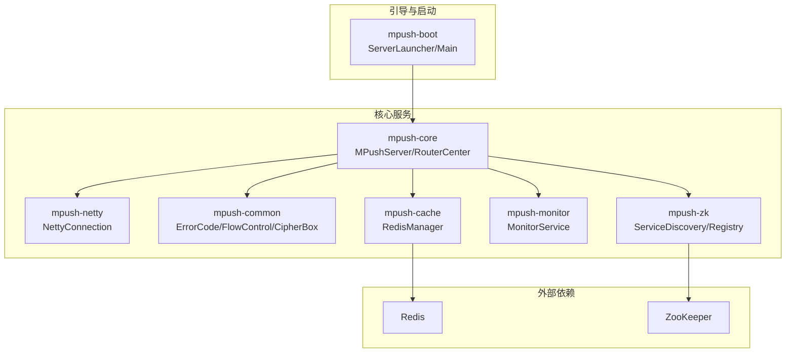
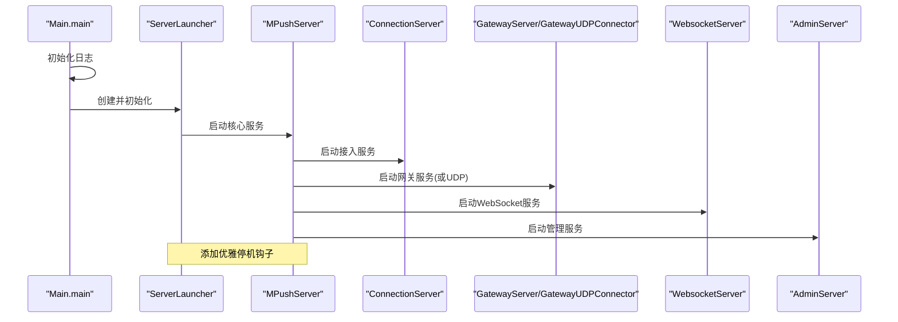
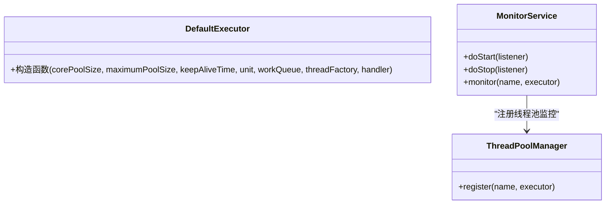
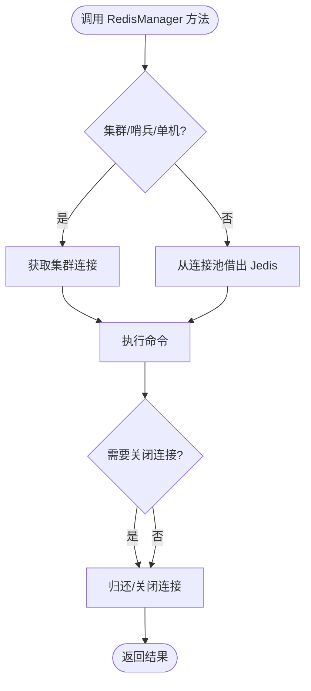
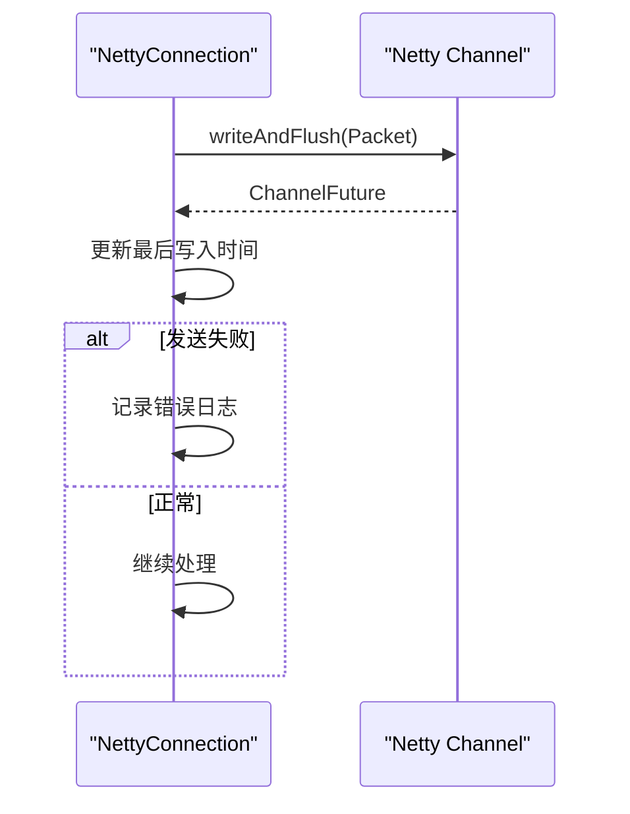
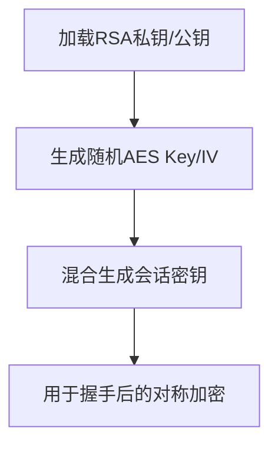
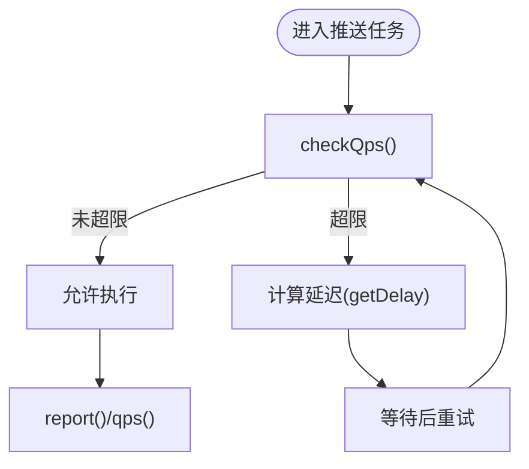
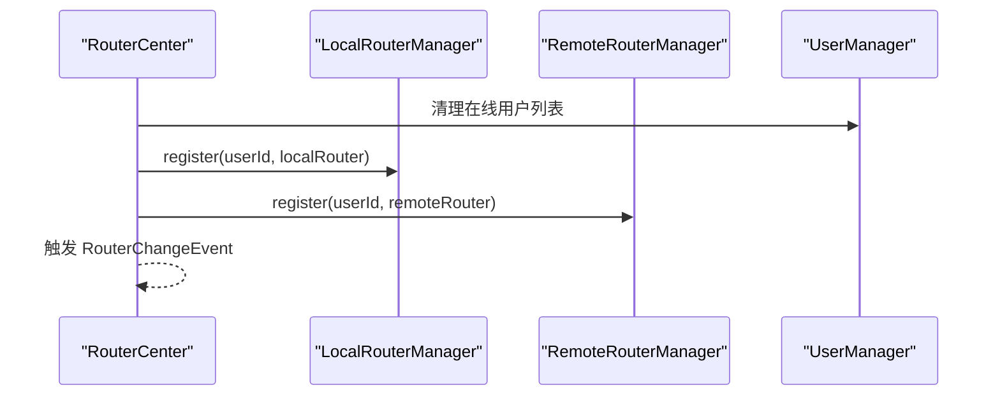
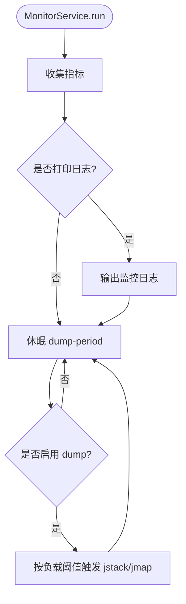
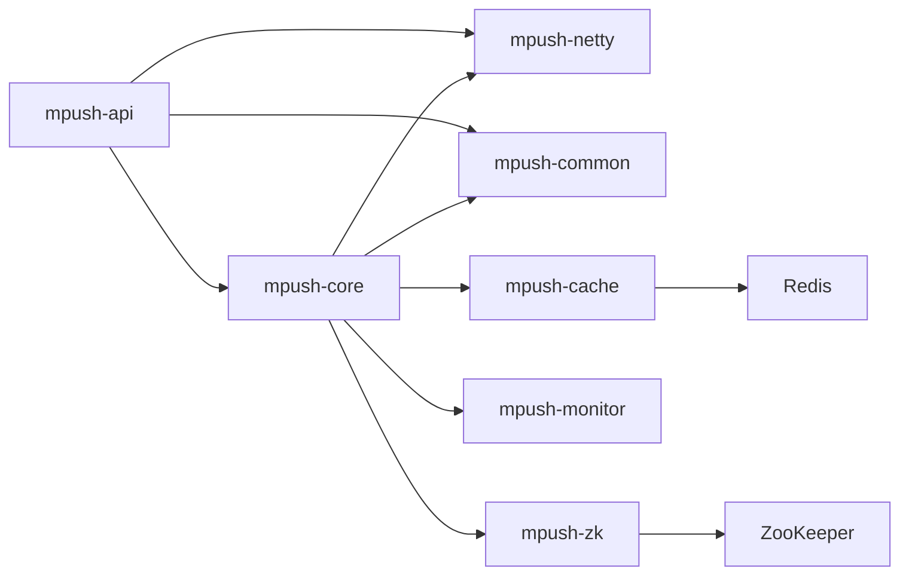

# 最佳实践

<cite>
**本文引用的文件**
- [README.md](file://README.md)
- [reference.conf](file://conf/reference.conf)
- [mpush.conf](file://mpush-boot/src/main/resources/mpush.conf)
- [Constants.java](file://mpush-api/src/main/java/com/mpush/api/Constants.java)
- [ErrorCode.java](file://mpush-common/src/main/java/com/mpush/common/ErrorCode.java)
- [DefaultExecutor.java](file://mpush-tools/src/main/java/com/mpush/tools/thread/pool/DefaultExecutor.java)
- [CipherBox.java](file://mpush-common/src/main/java/com/mpush/common/security/CipherBox.java)
- [NettyConnection.java](file://mpush-netty/src/main/java/com/mpush/netty/connection/NettyConnection.java)
- [MPushServer.java](file://mpush-core/src/main/java/com/mpush/core/MPushServer.java)
- [RedisManager.java](file://mpush-cache/src/main/java/com/mpush/cache/redis/manager/RedisManager.java)
- [MonitorService.java](file://mpush-monitor/src/main/java/com/mpush/monitor/service/MonitorService.java)
- [RouterCenter.java](file://mpush-core/src/main/java/com/mpush/core/router/RouterCenter.java)
- [FlowControl.java](file://mpush-common/src/main/java/com/mpush/common/qps/FlowControl.java)
- [Main.java](file://mpush-boot/src/main/java/com/mpush/bootstrap/Main.java)
- [pom.xml](file://pom.xml)
</cite>

## 目录
1. [简介](#简介)
2. [项目结构](#项目结构)
3. [核心组件](#核心组件)
4. [架构总览](#架构总览)
5. [详细组件分析](#详细组件分析)
6. [依赖分析](#依赖分析)
7. [性能考量](#性能考量)
8. [故障处理指南](#故障处理指南)
9. [生产部署最佳实践](#生产部署最佳实践)
10. [代码质量与开发规范](#代码质量与开发规范)
11. [扩展与定制化](#扩展与定制化)
12. [常见问题与经验总结](#常见问题与经验总结)
13. [结论](#结论)

## 简介
本指南面向使用与维护 MPush 的工程师，围绕性能优化、安全实施、故障处理、生产部署、代码质量与扩展性等方面，结合代码库实际实现，给出可操作的最佳实践建议。内容覆盖线程池配置、缓存策略、网络优化、内存管理、加密与权限、审计与风险、降级与灾备、监控告警、测试与评审等主题。

## 项目结构
MPush 采用多模块 Maven 架构，核心模块包括 API、核心服务、网络层、工具库、监控、缓存、Zookeeper 集成、客户端等。模块间通过 SPI 工厂与服务发现/注册解耦，便于替换与扩展。

图表来源
- [pom.xml](file://pom.xml#L54-L66)
- [MPushServer.java](file://mpush-core/src/main/java/com/mpush/core/MPushServer.java#L48-L181)
- [RedisManager.java](file://mpush-cache/src/main/java/com/mpush/cache/redis/manager/RedisManager.java#L40-L57)
- [MonitorService.java](file://mpush-monitor/src/main/java/com/mpush/monitor/service/MonitorService.java#L36-L99)

章节来源
- [pom.xml](file://pom.xml#L54-L66)

## 核心组件
- 服务器编排与服务发现：MPushServer 负责装配连接、网关、Websocket、管理、HTTP 客户端、推送中心、路由中心、监控等组件；通过 ServiceDiscovery/ServiceRegistry 工厂创建服务治理能力。
- 网络与连接：NettyConnection 提供基于 Netty 的连接抽象，支持安全握手切换、读写超时检测、发送失败监听。
- 缓存与消息：RedisManager 封装 Redis 常用操作与发布订阅，支持单机/集群/哨兵模式，提供连接池配置。
- 流控与错误码：FlowControl 定义 QPS 控制接口；ErrorCode 定义系统错误码枚举。
- 加密与安全：CipherBox 基于 RSA 私钥/公钥与随机 AES 密钥混合生成会话密钥，支撑握手阶段的安全通道建立。
- 监控：MonitorService 周期采集 JVM/线程池指标，按负载阈值触发堆栈/堆转储，辅助定位性能瓶颈。

章节来源
- [MPushServer.java](file://mpush-core/src/main/java/com/mpush/core/MPushServer.java#L48-L181)
- [NettyConnection.java](file://mpush-netty/src/main/java/com/mpush/netty/connection/NettyConnection.java#L38-L179)
- [RedisManager.java](file://mpush-cache/src/main/java/com/mpush/cache/redis/manager/RedisManager.java#L40-L438)
- [FlowControl.java](file://mpush-common/src/main/java/com/mpush/common/qps/FlowControl.java#L27-L60)
- [ErrorCode.java](file://mpush-common/src/main/java/com/mpush/common/ErrorCode.java#L27-L55)
- [CipherBox.java](file://mpush-common/src/main/java/com/mpush/common/security/CipherBox.java#L34-L92)
- [MonitorService.java](file://mpush-monitor/src/main/java/com/mpush/monitor/service/MonitorService.java#L36-L147)

## 架构总览
MPush 采用“接入服务 + 网关服务 + 推送中心 + 路由中心”的分层架构，配合 ZooKeeper 实现服务注册与发现，Redis 实现缓存与消息通道。启动流程通过引导模块完成日志初始化、启动器初始化与优雅停机钩子注册。

图表来源
- [Main.java](file://mpush-boot/src/main/java/com/mpush/bootstrap/Main.java#L31-L62)
- [MPushServer.java](file://mpush-core/src/main/java/com/mpush/core/MPushServer.java#L71-L96)

章节来源
- [Main.java](file://mpush-boot/src/main/java/com/mpush/bootstrap/Main.java#L31-L62)
- [MPushServer.java](file://mpush-core/src/main/java/com/mpush/core/MPushServer.java#L71-L96)

## 详细组件分析

### 线程池与并发模型
- 默认线程池实现：DefaultExecutor 直接继承 ThreadPoolExecutor，便于统一配置与扩展。
- 线程池配置来源：参考配置文件中的 thread.pool.* 项，可按 CPU 核数动态调整或显式指定大小。
- 事件总线与 MQ 队列：event-bus 与 mq 队列 size 支持高并发在线/离线事件与踢人消息处理。

图表来源
- [DefaultExecutor.java](file://mpush-tools/src/main/java/com/mpush/tools/thread/pool/DefaultExecutor.java#L28-L38)
- [MonitorService.java](file://mpush-monitor/src/main/java/com/mpush/monitor/service/MonitorService.java#L139-L141)

章节来源
- [DefaultExecutor.java](file://mpush-tools/src/main/java/com/mpush/tools/thread/pool/DefaultExecutor.java#L28-L38)
- [reference.conf](file://conf/reference.conf#L182-L205)
- [mpush.conf](file://mpush-boot/src/main/resources/mpush.conf#L1-L16)

### 缓存策略与 Redis 集成
- RedisManager 提供键值、Hash、List、Set、有序集合与发布订阅等常用操作，自动适配单机/集群/哨兵模式。
- 连接池与健康检查：通过工厂初始化连接池与密码、节点信息，启动时进行连通性测试。
- 使用建议：对热点数据设置合理过期时间；批量操作使用 HMSET/LPUSH/RPUSH；发布订阅用于跨实例事件通知。

图表来源
- [RedisManager.java](file://mpush-cache/src/main/java/com/mpush/cache/redis/manager/RedisManager.java#L45-L93)

章节来源
- [RedisManager.java](file://mpush-cache/src/main/java/com/mpush/cache/redis/manager/RedisManager.java#L40-L438)
- [reference.conf](file://conf/reference.conf#L143-L169)

### 网络优化与连接管理
- NettyConnection 提供连接生命周期管理、安全握手切换、读写超时检测、发送失败监听与阻塞等待策略。
- 心跳与水位：通过 SessionContext 中的 heartbeat 参数与 Netty 写缓冲水位阈值，避免拥塞与丢包。
- 优化建议：根据业务场景调整 snd_buf/rcv_buf、write-buffer-water-mark；启用流量整形时合理配置全局/通道限速。

图表来源
- [NettyConnection.java](file://mpush-netty/src/main/java/com/mpush/netty/connection/NettyConnection.java#L73-L105)

章节来源
- [NettyConnection.java](file://mpush-netty/src/main/java/com/mpush/netty/connection/NettyConnection.java#L38-L179)
- [reference.conf](file://conf/reference.conf#L131-L209)

### 安全与加密
- 握手加密：CipherBox 从配置加载 RSA 私钥/公钥，生成随机 AES Key/IV，并通过混合算法生成会话密钥，保障握手阶段通信安全。
- 配置要求：确保私钥/公钥合法且长度符合安全要求；AES Key 长度按配置生效。
- 建议：定期轮换密钥；严格控制密钥文件访问权限；在生产环境使用硬件安全模块(HSM)或密钥管理系统(KMS)。

图表来源
- [CipherBox.java](file://mpush-common/src/main/java/com/mpush/common/security/CipherBox.java#L41-L91)
- [reference.conf](file://conf/reference.conf#L33-L43)

章节来源
- [CipherBox.java](file://mpush-common/src/main/java/com/mpush/common/security/CipherBox.java#L34-L92)
- [reference.conf](file://conf/reference.conf#L33-L43)

### 流控与 QPS 管理
- FlowControl 接口定义了重置、总量统计、瞬时 QPS 检查、延迟策略与平均 QPS 报告等能力。
- 全局与广播流控：配置文件提供 global/broadcast 两类流控参数，支持限制与最大并发。
- 建议：结合业务峰值与下游承载能力设置 limit/duration/max；对广播消息单独限流，避免雪崩效应。

图表来源
- [FlowControl.java](file://mpush-common/src/main/java/com/mpush/common/qps/FlowControl.java#L27-L60)
- [reference.conf](file://conf/reference.conf#L207-L222)

章节来源
- [FlowControl.java](file://mpush-common/src/main/java/com/mpush/common/qps/FlowControl.java#L27-L60)
- [reference.conf](file://conf/reference.conf#L207-L222)

### 路由与用户状态
- RouterCenter 负责本地与远程路由的注册、查找与变更事件分发；结合 UserManager 清理在线用户列表。
- 建议：在用户上线/下线事件中同步更新本地与远程路由，确保一致性；对路由变更事件进行幂等处理。

图表来源
- [RouterCenter.java](file://mpush-core/src/main/java/com/mpush/core/router/RouterCenter.java#L49-L104)

章节来源
- [RouterCenter.java](file://mpush-core/src/main/java/com/mpush/core/router/RouterCenter.java#L40-L135)

### 监控与性能剖析
- MonitorService 周期采集 JVM/线程池指标，按负载阈值触发 jstack/jmap 转储，支持配置 dump 周期与开关。
- 建议：开启性能剖析(profile-enabled)与慢调用阈值(profile-slowly-duration)；结合线程池监控识别热点线程与队列积压。

图表来源
- [MonitorService.java](file://mpush-monitor/src/main/java/com/mpush/monitor/service/MonitorService.java#L65-L130)

章节来源
- [MonitorService.java](file://mpush-monitor/src/main/java/com/mpush/monitor/service/MonitorService.java#L36-L147)
- [reference.conf](file://conf/reference.conf#L224-L232)

## 依赖分析
- 外部依赖：Netty、SLF4J、Logback、Guava、Fastjson、Curator(ZooKeeper)、Jedis(Redis)、Typesafe Config。
- 模块依赖：核心模块依赖网络、工具、监控、缓存、ZK 等模块；API 层提供 SPI 工厂与事件/协议抽象，降低耦合。

图表来源
- [pom.xml](file://pom.xml#L79-L284)

章节来源
- [pom.xml](file://pom.xml#L79-L284)

## 性能考量
- 线程池配置
  - 根据 CPU 核数与业务特征选择 conn-work/gateway-server-work/push-task 等线程池大小；必要时设置固定大小避免抖动。
  - event-bus 与 mq 队列 size 应与峰值事件速率匹配，防止阻塞与丢弃。
- 缓存与序列化
  - Redis 连接池参数(maxTotal/maxIdle/minIdle/maxWaitMillis等)需结合 QPS 与 RT 调整；对大对象启用压缩阈值。
  - JSON 序列化使用 Fastjson，注意字段兼容与版本演进。
- 网络与内存
  - 合理设置 snd_buf/rcv_buf 与 write-buffer-water-mark，避免频繁 GC 与背压；启用流量整形时区分不同服务端口。
  - 使用 Netty 的零拷贝与池化缓冲减少内存分配与拷贝。
- 流控与降级
  - 全局与广播流控参数按 SLA 设定；对异常与超时进行快速失败与熔断，避免级联故障。
- 监控与剖析
  - 开启慢调用与性能剖析，定期分析堆栈与堆转储，定位热点线程与内存泄漏。

章节来源
- [reference.conf](file://conf/reference.conf#L182-L232)
- [RedisManager.java](file://mpush-cache/src/main/java/com/mpush/cache/redis/manager/RedisManager.java#L149-L227)
- [NettyConnection.java](file://mpush-netty/src/main/java/com/mpush/netty/connection/NettyConnection.java#L73-L105)
- [FlowControl.java](file://mpush-common/src/main/java/com/mpush/common/qps/FlowControl.java#L27-L60)
- [MonitorService.java](file://mpush-monitor/src/main/java/com/mpush/monitor/service/MonitorService.java#L65-L130)

## 故障处理指南
- 错误码定义
  - 系统错误码覆盖离线、推送失败、路由变更、ACK 超时、消息处理错误、不支持命令、重复握手、会话过期、设备无效等场景。
- 异常处理机制
  - 连接发送失败记录日志并关闭连接；读写超时检测用于心跳异常判定；流控超限时延迟重试或直接拒绝。
- 降级策略
  - 优先保障核心链路；对非关键路径降级为直连或本地缓存；广播推送按阈值降级。
- 灾难恢复
  - 依赖 ZooKeeper 与 Redis 的高可用配置；通过服务注册与发现自动切换；对关键数据进行备份与校验。

章节来源
- [ErrorCode.java](file://mpush-common/src/main/java/com/mpush/common/ErrorCode.java#L27-L55)
- [NettyConnection.java](file://mpush-netty/src/main/java/com/mpush/netty/connection/NettyConnection.java#L135-L142)
- [RouterCenter.java](file://mpush-core/src/main/java/com/mpush/core/router/RouterCenter.java#L94-L102)

## 生产部署最佳实践
- 容量规划
  - 基于峰值 QPS 与消息大小估算带宽与连接数；预留 30%~50% 缓冲；评估 Redis 与 ZooKeeper 节点数量与副本策略。
- 配置管理
  - mpush.conf 覆盖 reference.conf 中的默认项；区分 dev/pub 环境 profile；敏感信息通过环境变量注入。
- 监控告警
  - 启用 MonitorService 的日志与 dump 功能；设置 JVM/线程池/Redis 连接池/网络缓冲等阈值告警。
- 性能调优
  - 根据业务场景调整线程池大小、缓冲区与水位；启用流量整形；优化 JSON 序列化与缓存命中率。
- 故障预防
  - 健康检查与自愈；灰度发布与回滚；对关键路径进行压力测试与混沌工程演练。

章节来源
- [README.md](file://README.md#L32-L87)
- [reference.conf](file://conf/reference.conf#L1-L239)
- [mpush.conf](file://mpush-boot/src/main/resources/mpush.conf#L1-L16)
- [MonitorService.java](file://mpush-monitor/src/main/java/com/mpush/monitor/service/MonitorService.java#L65-L130)

## 代码质量与开发规范
- 代码风格
  - 统一使用 UTF-8 编码；类与方法命名清晰，遵循 Java 命名约定；长类名与复杂逻辑拆分。
- 注释规范
  - 公共 API 与关键流程补充注释；错误码与配置项在注释中说明含义与取值范围。
- 测试覆盖率
  - 单元测试覆盖核心算法与边界条件；集成测试验证启动、路由、推送、流控等关键路径。
- 代码审查
  - 关注并发安全性、资源释放、异常处理与性能影响；引入静态分析工具辅助审查。

## 扩展与定制化
- 插件开发
  - 通过 SPI 工厂扩展线程池、DNS 映射、服务发现/注册、消息推送器等；在 resources/META-INF/services 下声明实现。
- 配置管理
  - 使用 HOCON 配置格式，支持覆盖与环境隔离；敏感配置通过环境变量注入。
- 版本升级
  - 保持依赖版本兼容；对 API 变更进行向后兼容或明确迁移指引；灰度发布与回滚预案。

章节来源
- [pom.xml](file://pom.xml#L272-L284)
- [reference.conf](file://conf/reference.conf#L320-L325)
- [mpush.conf](file://mpush-boot/src/main/resources/mpush.conf#L1-L16)

## 常见问题与经验总结
- 启动失败
  - 检查 JAVA_HOME 与 JDK 版本；确认 mpush.conf 与 reference.conf 配置项正确；查看 logs 目录输出。
- 连接不稳定
  - 调整 snd_buf/rcv_buf 与 write-buffer-water-mark；排查网络拥塞与防火墙；启用流量整形。
- 推送延迟高
  - 优化线程池大小与队列长度；启用流控；检查 Redis 连接池与网络延迟。
- 安全问题
  - 确保密钥配置正确且权限受限；定期轮换密钥；启用 HTTPS 与访问控制。
- 监控缺失
  - 开启 MonitorService 日志与 dump；配置告警规则；定期分析慢调用与热点线程。

章节来源
- [README.md](file://README.md#L70-L78)
- [reference.conf](file://conf/reference.conf#L131-L239)
- [MonitorService.java](file://mpush-monitor/src/main/java/com/mpush/monitor/service/MonitorService.java#L65-L130)

## 结论
通过合理的线程池与网络配置、稳健的缓存与流控策略、完善的安全与监控体系，以及严格的生产部署与质量保障流程，MPush 可在高并发场景下保持稳定与高性能。建议在实际落地中结合业务特征持续优化，并建立完善的运维与应急响应机制。