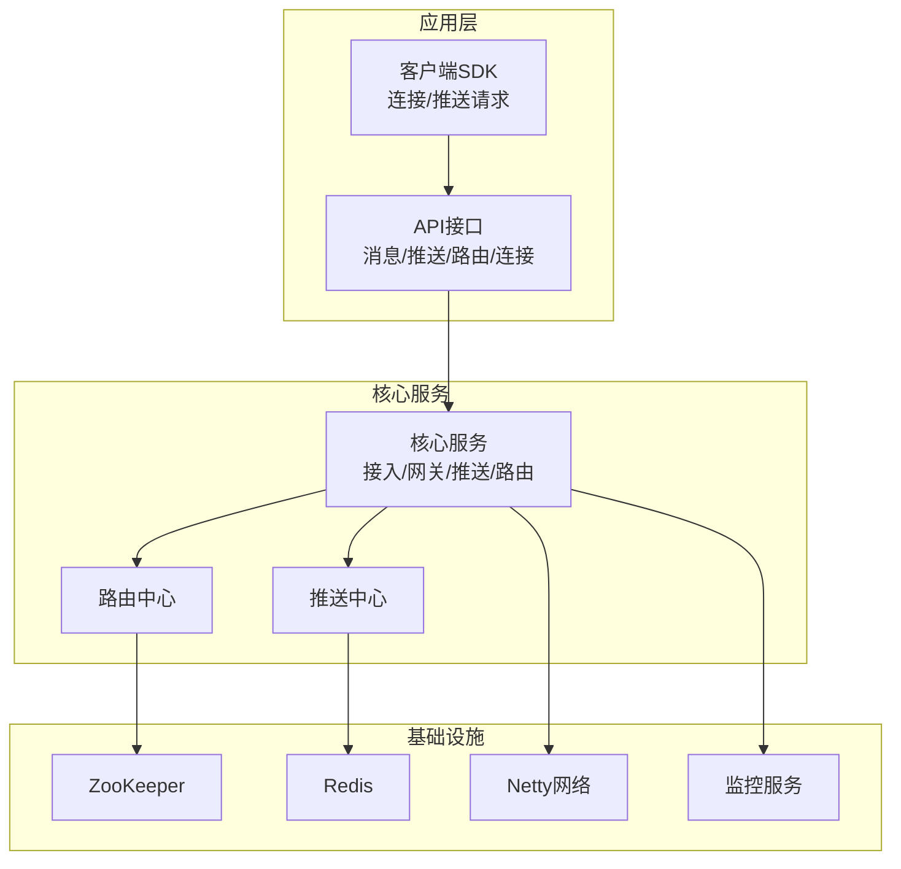
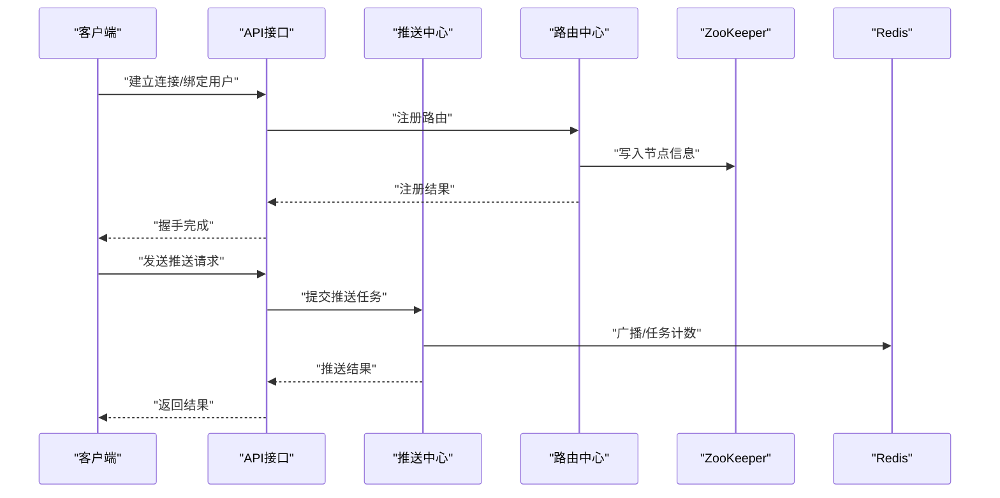
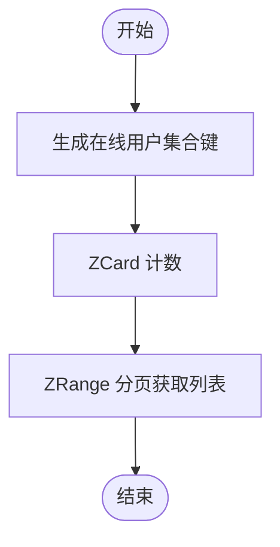
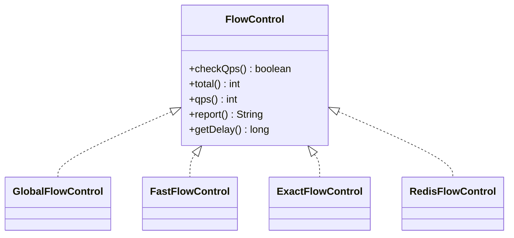
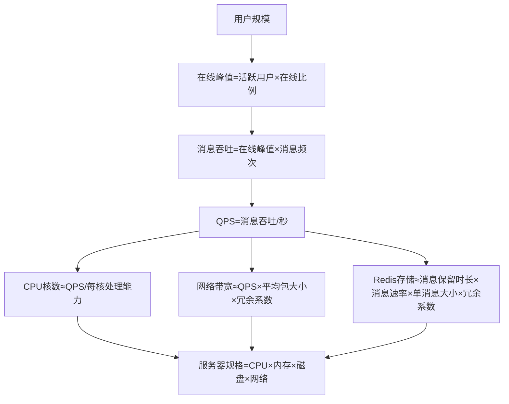
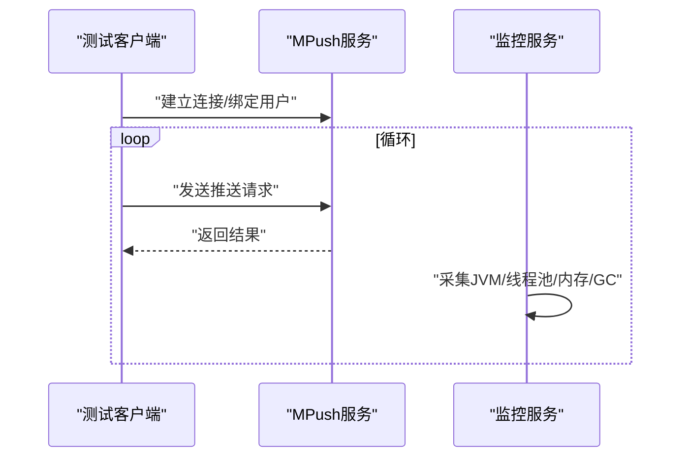
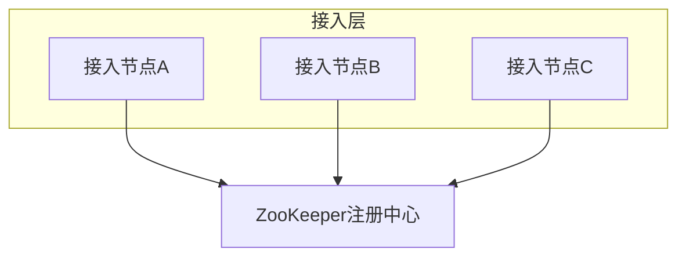
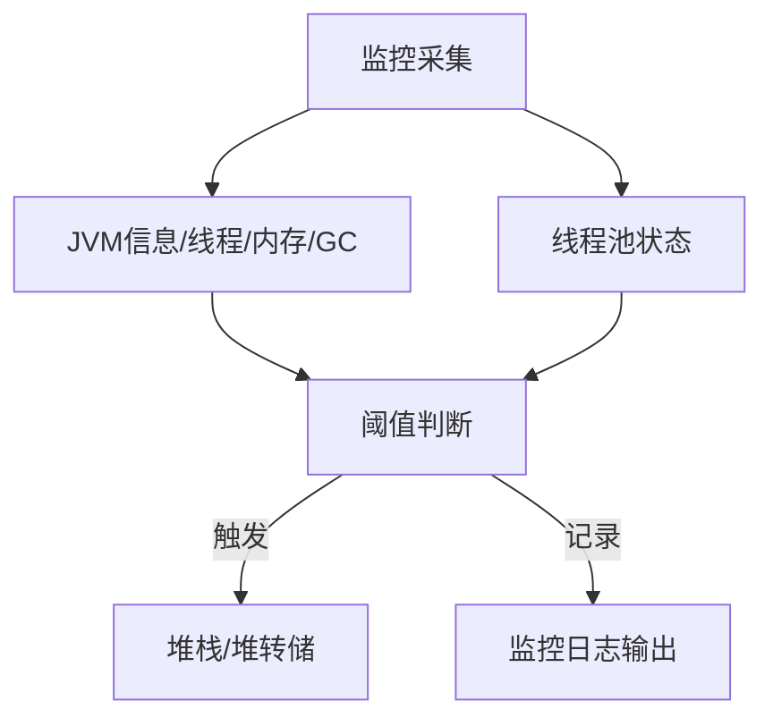
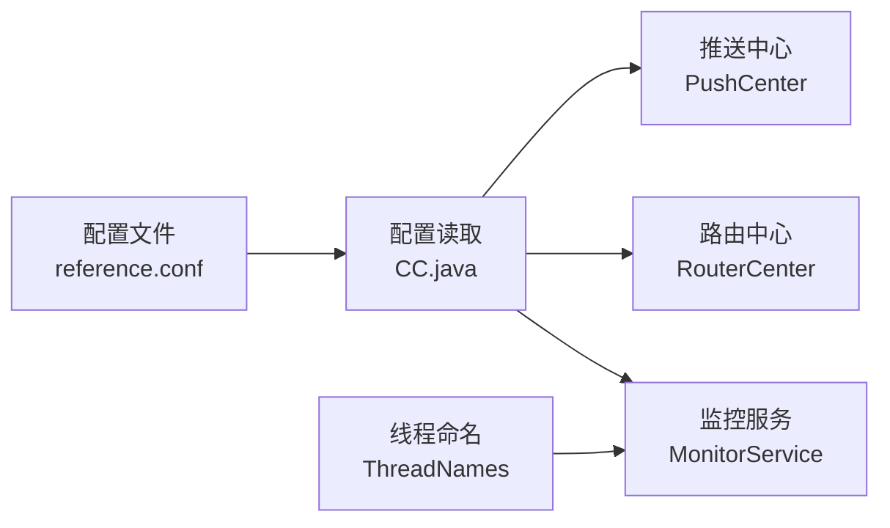

# 容量规划

<cite>
**本文引用的文件**
- [README.md](file://README.md)
- [reference.conf](file://conf/reference.conf)
- [mpush.conf](file://mpush-boot/src/main/resources/mpush.conf)
- [CC.java](file://mpush-tools/src/main/java/com/mpush/tools/config/CC.java)
- [PushCenter.java](file://mpush-core/src/main/java/com/mpush/core/push/PushCenter.java)
- [RouterCenter.java](file://mpush-core/src/main/java/com/mpush/core/router/RouterCenter.java)
- [UserManager.java](file://mpush-common/src/main/java/com/mpush/common/user/UserManager.java)
- [CacheKeys.java](file://mpush-common/src/main/java/com/mpush/common/CacheKeys.java)
- [FastFlowControl.java](file://mpush-common/src/main/java/com/mpush/common/qps/FastFlowControl.java)
- [ExactFlowControl.java](file://mpush-common/src/main/java/com/mpush/common/qps/ExactFlowControl.java)
- [RedisFlowControl.java](file://mpush-common/src/main/java/com/mpush/common/qps/RedisFlowControl.java)
- [MonitorService.java](file://mpush-monitor/src/main/java/com/mpush/monitor/service/MonitorService.java)
- [ResultCollector.java](file://mpush-monitor/src/main/java/com/mpush/monitor/data/ResultCollector.java)
- [JVMInfo.java](file://mpush-monitor/src/main/java/com/mpush/monitor/quota/impl/JVMInfo.java)
- [MemoryQuota.java](file://mpush-monitor/src/main/java/com/mpush/monitor/quota/MemoryQuota.java)
- [GCMQuota.java](file://mpush-monitor/src/main/java/com/mpush/monitor/quota/GCMQuota.java)
- [PushClientTestMain.java](file://mpush-test/src/main/java/com/mpush/test/push/PushClientTestMain.java)
- [ConnClientTestMain.java](file://mpush-test/src/main/java/com/mpush/test/client/ConnClientTestMain.java)
- [ThreadNames.java](file://mpush-tools/src/main/java/com/mpush/tools/thread/ThreadNames.java)
- [JVMUtil.java](file://mpush-tools/src/main/java/com/mpush/tools/common/JVMUtil.java)
</cite>

## 目录
1. [简介](#简介)
2. [项目结构](#项目结构)
3. [核心组件](#核心组件)
4. [架构总览](#架构总览)
5. [详细组件分析](#详细组件分析)
6. [依赖分析](#依赖分析)
7. [性能考虑](#性能考虑)
8. [故障排查指南](#故障排查指南)
9. [结论](#结论)
10. [附录](#附录)

## 简介
本文件面向MPush的容量规划与资源配置，围绕用户规模估算、消息量预测、资源需求计算、性能基准测试、扩容缩容策略、容量监控与预警等方面，结合代码库中的配置、实现与监控能力，给出可操作的指导与流程。

## 项目结构
MPush采用模块化分层设计，核心模块包括API接口、核心服务（接入/网关/推送/路由）、监控、缓存与队列、网络编解码、测试样例等。部署依赖ZooKeeper与Redis，网络协议基于Netty，支持TCP/UDP/WS等多种接入形态。

图示来源
- [RouterCenter.java](file://mpush-core/src/main/java/com/mpush/core/router/RouterCenter.java#L40-L135)
- [PushCenter.java](file://mpush-core/src/main/java/com/mpush/core/push/PushCenter.java#L49-L109)
- [reference.conf](file://conf/reference.conf#L125-L141)
- [reference.conf](file://conf/reference.conf#L229-L255)

章节来源
- [README.md](file://README.md#L32-L87)
- [reference.conf](file://conf/reference.conf#L13-L326)

## 核心组件
- 用户规模与在线统计：通过在线用户集合与路由键，结合缓存实现在线用户计数与列表查询。
- 消息流控：提供全局流控、广播流控、精确滚动窗口流控与基于Redis的任务级流控。
- 推送中心：负责消息推送任务的调度与执行，支持TCP/UDP模式的线程池选择。
- 路由中心：负责本地/远端路由注册、查找与变更事件分发。
- 监控服务：周期采集JVM、线程池、GC、内存等指标，支持堆栈/堆转储触发阈值。

章节来源
- [UserManager.java](file://mpush-common/src/main/java/com/mpush/common/user/UserManager.java#L99-L115)
- [CacheKeys.java](file://mpush-common/src/main/java/com/mpush/common/CacheKeys.java#L35-L56)
- [FastFlowControl.java](file://mpush-common/src/main/java/com/mpush/common/qps/FastFlowControl.java#L29-L92)
- [ExactFlowControl.java](file://mpush-common/src/main/java/com/mpush/common/qps/ExactFlowControl.java#L33-L91)
- [RedisFlowControl.java](file://mpush-common/src/main/java/com/mpush/common/qps/RedisFlowControl.java#L92-L121)
- [PushCenter.java](file://mpush-core/src/main/java/com/mpush/core/push/PushCenter.java#L49-L109)
- [RouterCenter.java](file://mpush-core/src/main/java/com/mpush/core/router/RouterCenter.java#L40-L135)
- [MonitorService.java](file://mpush-monitor/src/main/java/com/mpush/monitor/service/MonitorService.java#L36-L146)

## 架构总览
MPush的容量规划涉及“用户规模—消息吞吐—资源需求—性能监控—弹性伸缩”的闭环。下图展示了从客户端到核心服务、再到基础设施的关键交互路径。

图示来源
- [RouterCenter.java](file://mpush-core/src/main/java/com/mpush/core/router/RouterCenter.java#L76-L104)
- [PushCenter.java](file://mpush-core/src/main/java/com/mpush/core/push/PushCenter.java#L72-L82)
- [reference.conf](file://conf/reference.conf#L211-L227)
- [reference.conf](file://conf/reference.conf#L229-L255)

## 详细组件分析

### 用户规模估算与在线峰值
- 在线用户统计：通过在线用户集合键进行计数与分页查询，支持按公网IP维度聚合。
- 在线用户列表：用于导出/统计在线用户集合，便于容量评估与热点定位。

图示来源
- [UserManager.java](file://mpush-common/src/main/java/com/mpush/common/user/UserManager.java#L99-L115)
- [CacheKeys.java](file://mpush-common/src/main/java/com/mpush/common/CacheKeys.java#L48-L50)

章节来源
- [UserManager.java](file://mpush-common/src/main/java/com/mpush/common/user/UserManager.java#L99-L115)
- [CacheKeys.java](file://mpush-common/src/main/java/com/mpush/common/CacheKeys.java#L35-L56)

### 消息量预测与流控模型
- 全局流控：适用于非广播场景，限制整体QPS与总量。
- 广播流控：针对广播任务，支持任务级限流与最大总量。
- 精确流控：基于滚动窗口的高精度QPS控制，适合短周期突发。
- Redis流控：基于任务ID的分布式计数，配合Redis实现跨实例限流。

图示来源
- [PushCenter.java](file://mpush-core/src/main/java/com/mpush/core/push/PushCenter.java#L52-L82)
- [FastFlowControl.java](file://mpush-common/src/main/java/com/mpush/common/qps/FastFlowControl.java#L29-L92)
- [ExactFlowControl.java](file://mpush-common/src/main/java/com/mpush/common/qps/ExactFlowControl.java#L33-L91)
- [RedisFlowControl.java](file://mpush-common/src/main/java/com/mpush/common/qps/RedisFlowControl.java#L92-L121)

章节来源
- [PushCenter.java](file://mpush-core/src/main/java/com/mpush/core/push/PushCenter.java#L49-L109)
- [reference.conf](file://conf/reference.conf#L207-L222)

### 资源需求计算模型
- CPU需求：基于线程池配置与业务负载，参考线程命名与默认规则推算。
- 内存需求：结合JVM内存指标、堆/非堆、老年代/Eden/Survivor等维度评估。
- 网络带宽：依据最大包大小、缓冲区配置、流量整形参数进行估算。
- 存储空间：Redis持久化策略与过期策略决定的数据占用。

图示来源
- [reference.conf](file://conf/reference.conf#L113-L121)
- [reference.conf](file://conf/reference.conf#L162-L208)
- [reference.conf](file://conf/reference.conf#L268-L291)
- [reference.conf](file://conf/reference.conf#L293-L308)
- [JVMInfo.java](file://mpush-monitor/src/main/java/com/mpush/monitor/quota/impl/JVMInfo.java#L31-L44)
- [MemoryQuota.java](file://mpush-monitor/src/main/java/com/mpush/monitor/quota/MemoryQuota.java#L22-L78)

章节来源
- [reference.conf](file://conf/reference.conf#L113-L121)
- [reference.conf](file://conf/reference.conf#L162-L208)
- [reference.conf](file://conf/reference.conf#L268-L291)
- [reference.conf](file://conf/reference.conf#L293-L308)
- [JVMInfo.java](file://mpush-monitor/src/main/java/com/mpush/monitor/quota/impl/JVMInfo.java#L31-L44)
- [MemoryQuota.java](file://mpush-monitor/src/main/java/com/mpush/monitor/quota/MemoryQuota.java#L22-L78)

### 性能基准测试策略
- 压力测试：逐步提升并发连接数与消息QPS，观察延迟与失败率。
- 负载测试：在稳定QPS下持续运行，观察GC、线程池与内存变化。
- 稳定性测试：长时间运行，验证内存泄漏与资源回收。

图示来源
- [PushClientTestMain.java](file://mpush-test/src/main/java/com/mpush/test/push/PushClientTestMain.java#L39-L77)
- [ConnClientTestMain.java](file://mpush-test/src/main/java/com/mpush/test/client/ConnClientTestMain.java#L71-L116)
- [MonitorService.java](file://mpush-monitor/src/main/java/com/mpush/monitor/service/MonitorService.java#L64-L83)

章节来源
- [PushClientTestMain.java](file://mpush-test/src/main/java/com/mpush/test/push/PushClientTestMain.java#L39-L77)
- [ConnClientTestMain.java](file://mpush-test/src/main/java/com/mpush/test/client/ConnClientTestMain.java#L71-L116)
- [MonitorService.java](file://mpush-monitor/src/main/java/com/mpush/monitor/service/MonitorService.java#L64-L83)

### 扩容与缩容策略
- 水平扩展：通过ZooKeeper注册多个接入/网关节点，客户端按权重/策略选择。
- 垂直扩展：提升CPU/内存/网络带宽，结合线程池与缓冲区参数优化。
- 弹性伸缩：基于监控指标（CPU/内存/网络/延迟）自动增减实例。

图示来源
- [reference.conf](file://conf/reference.conf#L211-L227)
- [reference.conf](file://conf/reference.conf#L139-L141)

章节来源
- [reference.conf](file://conf/reference.conf#L211-L227)
- [reference.conf](file://conf/reference.conf#L139-L141)

### 容量监控与预警
- 关键指标：CPU负载、内存使用、GC次数/时长、线程池排队长度、网络缓冲水位。
- 预警阈值：基于配置项与运行时阈值触发堆栈/堆转储，辅助定位瓶颈。
- 报表输出：周期性输出JSON日志，便于集中采集与可视化。

图示来源
- [MonitorService.java](file://mpush-monitor/src/main/java/com/mpush/monitor/service/MonitorService.java#L36-L146)
- [ResultCollector.java](file://mpush-monitor/src/main/java/com/mpush/monitor/data/ResultCollector.java#L30-L42)
- [JVMInfo.java](file://mpush-monitor/src/main/java/com/mpush/monitor/quota/impl/JVMInfo.java#L31-L44)
- [GCMQuota.java](file://mpush-monitor/src/main/java/com/mpush/monitor/quota/GCMQuota.java#L22-L40)
- [JVMUtil.java](file://mpush-tools/src/main/java/com/mpush/tools/common/JVMUtil.java#L39-L64)

章节来源
- [MonitorService.java](file://mpush-monitor/src/main/java/com/mpush/monitor/service/MonitorService.java#L36-L146)
- [ResultCollector.java](file://mpush-monitor/src/main/java/com/mpush/monitor/data/ResultCollector.java#L30-L42)
- [JVMInfo.java](file://mpush-monitor/src/main/java/com/mpush/monitor/quota/impl/JVMInfo.java#L31-L44)
- [GCMQuota.java](file://mpush-monitor/src/main/java/com/mpush/monitor/quota/GCMQuota.java#L22-L40)
- [JVMUtil.java](file://mpush-tools/src/main/java/com/mpush/tools/common/JVMUtil.java#L39-L64)

## 依赖分析
- 配置中心：通过HOCON配置文件加载，覆盖默认reference.conf。
- 线程命名：统一的线程命名常量，便于资源隔离与监控。
- 测试样例：提供连接与推送的最小可用示例，便于压测与验证。

图示来源
- [reference.conf](file://conf/reference.conf#L13-L326)
- [CC.java](file://mpush-tools/src/main/java/com/mpush/tools/config/CC.java#L338-L355)
- [PushCenter.java](file://mpush-core/src/main/java/com/mpush/core/push/PushCenter.java#L99-L103)
- [RouterCenter.java](file://mpush-core/src/main/java/com/mpush/core/router/RouterCenter.java#L54-L61)
- [MonitorService.java](file://mpush-monitor/src/main/java/com/mpush/monitor/service/MonitorService.java#L86-L93)
- [ThreadNames.java](file://mpush-tools/src/main/java/com/mpush/tools/thread/ThreadNames.java#L31-L46)

章节来源
- [reference.conf](file://conf/reference.conf#L13-L326)
- [CC.java](file://mpush-tools/src/main/java/com/mpush/tools/config/CC.java#L338-L355)
- [ThreadNames.java](file://mpush-tools/src/main/java/com/mpush/tools/thread/ThreadNames.java#L31-L46)

## 性能考虑
- 线程池与执行器：根据网络模式（TCP/UDP）选择不同的任务执行器，避免EventLoop在某些场景下不如JDK线程池。
- 缓冲区与水位：合理设置发送/接收缓冲区与写保护水位，防止背压导致的延迟放大。
- 流量整形：在网关侧启用流量整形，限制全局/通道级别的读写速率。
- 心跳与会话：通过心跳间隔与会话过期时间平衡连接保持与资源占用。

章节来源
- [PushCenter.java](file://mpush-core/src/main/java/com/mpush/core/push/PushCenter.java#L99-L103)
- [reference.conf](file://conf/reference.conf#L162-L208)
- [reference.conf](file://conf/reference.conf#L181-L208)

## 故障排查指南
- 连接与路由问题：检查ZooKeeper注册与路由查找逻辑，确认旧路由变更事件是否正确发布。
- 推送失败：检查流控配置与任务执行器状态，关注广播/全局流控阈值。
- 监控告警：当CPU负载达到阈值时，自动触发堆栈/堆转储，辅助定位热点线程与内存问题。
- 客户端压测：使用测试样例模拟大量连接与消息，观察延迟与吞吐变化。

章节来源
- [RouterCenter.java](file://mpush-core/src/main/java/com/mpush/core/router/RouterCenter.java#L76-L104)
- [PushCenter.java](file://mpush-core/src/main/java/com/mpush/core/push/PushCenter.java#L72-L82)
- [MonitorService.java](file://mpush-monitor/src/main/java/com/mpush/monitor/service/MonitorService.java#L101-L130)
- [PushClientTestMain.java](file://mpush-test/src/main/java/com/mpush/test/push/PushClientTestMain.java#L39-L77)
- [ConnClientTestMain.java](file://mpush-test/src/main/java/com/mpush/test/client/ConnClientTestMain.java#L71-L116)

## 结论
MPush的容量规划应以“用户规模—消息吞吐—资源需求—监控预警—弹性伸缩”为主线，结合配置文件中的网络、线程池、流控与监控参数，制定可落地的估算与实施方案。通过测试样例与监控体系，持续验证与优化，确保在不同业务阶段均能稳定承载预期负载。

## 附录
- 配置要点速查
  - 端口与网络：接入/网关/WS端口、UDP组播、缓冲区与水位、流量整形。
  - 线程池：接入/网关/HTTP/ACK/推送/网关客户端线程池大小与队列。
  - 流控：全局/广播QPS与总量限制、滚动窗口与Redis任务流控。
  - 监控：日志级别、采样周期、堆栈/堆转储触发阈值。

章节来源
- [reference.conf](file://conf/reference.conf#L131-L325)
- [mpush.conf](file://mpush-boot/src/main/resources/mpush.conf#L1-L16)