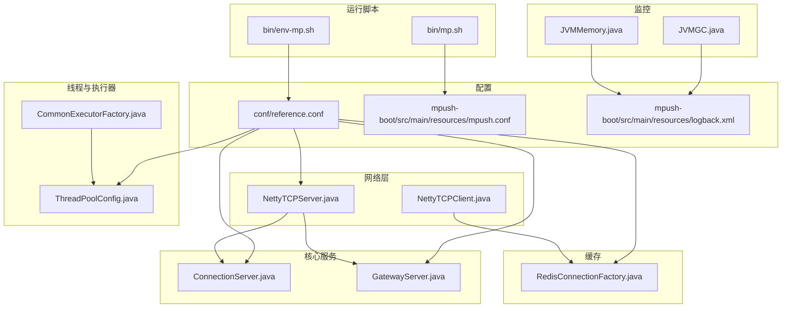
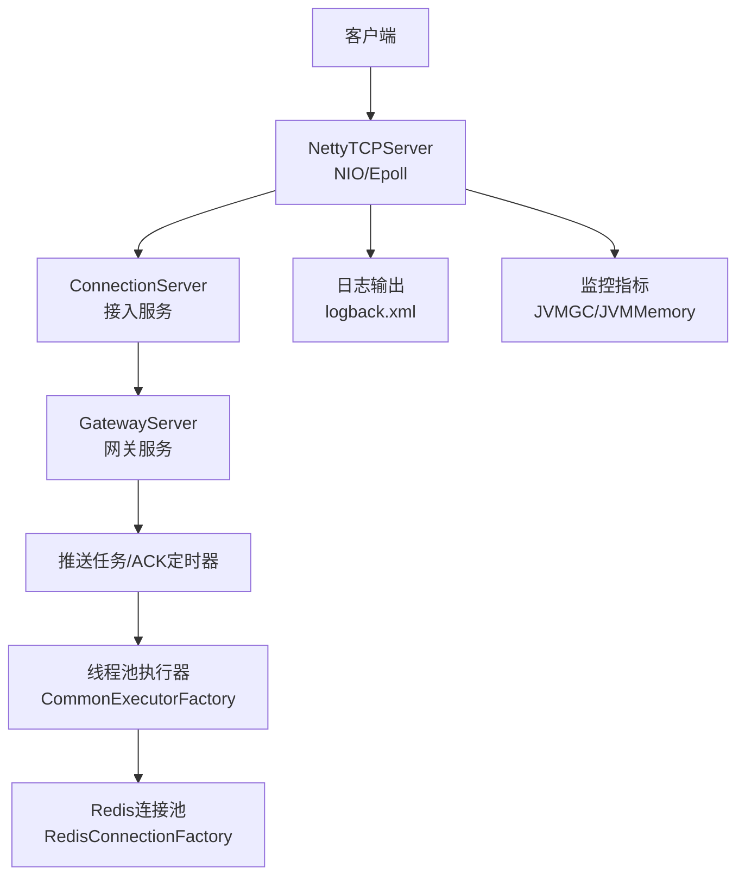
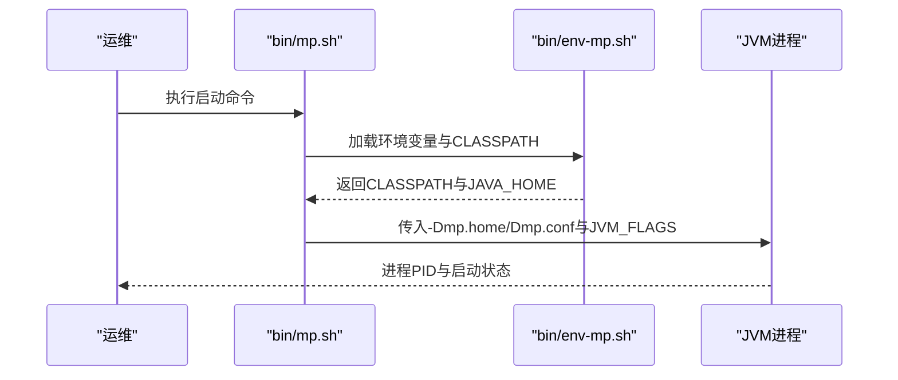
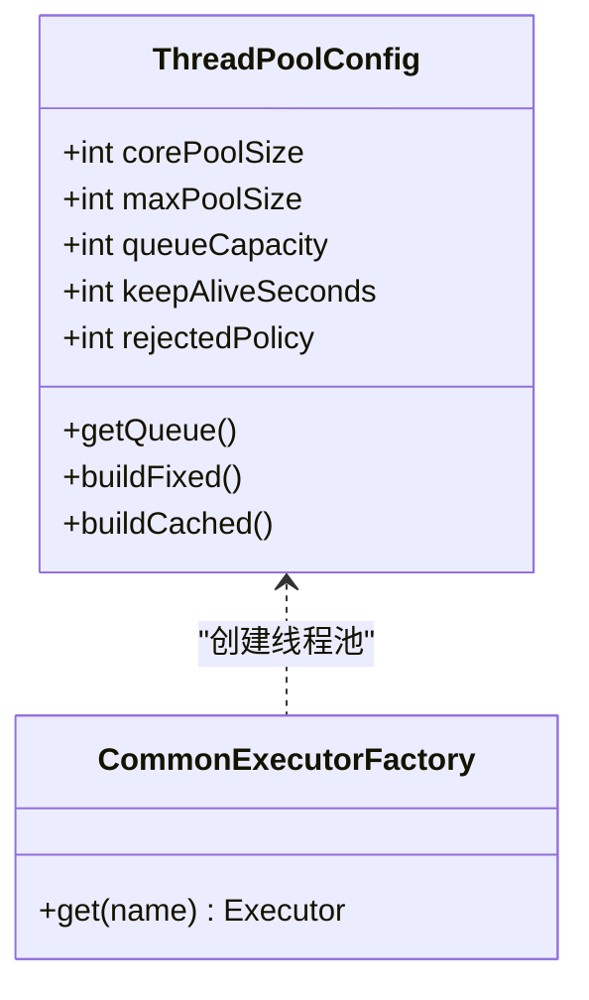
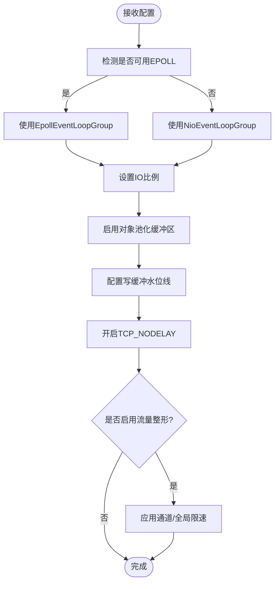
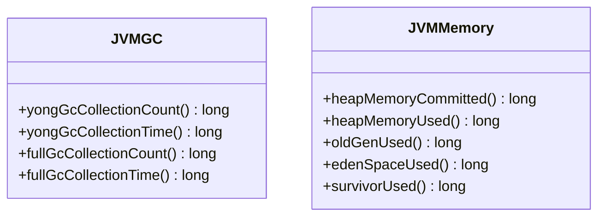
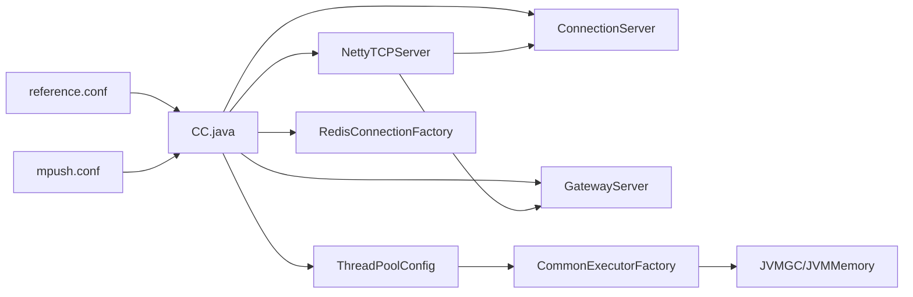

# 性能调优

<cite>
**本文引用的文件**
- [conf/reference.conf](file://conf/reference.conf)
- [mpush-boot/src/main/resources/mpush.conf](file://mpush-boot/src/main/resources/mpush.conf)
- [bin/env-mp.sh](file://bin/env-mp.sh)
- [bin/mp.sh](file://bin/mp.sh)
- [mpush-netty/src/main/java/com/mpush/netty/server/NettyTCPServer.java](file://mpush-netty/src/main/java/com/mpush/netty/server/NettyTCPServer.java)
- [mpush-netty/src/main/java/com/mpush/netty/client/NettyTCPClient.java](file://mpush-netty/src/main/java/com/mpush/netty/client/NettyTCPClient.java)
- [mpush-core/src/main/java/com/mpush/core/server/ConnectionServer.java](file://mpush-core/src/main/java/com/mpush/core/server/ConnectionServer.java)
- [mpush-core/src/main/java/com/mpush/core/server/GatewayServer.java](file://mpush-core/src/main/java/com/mpush/core/server/GatewayServer.java)
- [mpush-tools/src/main/java/com/mpush/tools/config/CC.java](file://mpush-tools/src/main/java/com/mpush/tools/config/CC.java)
- [mpush-tools/src/main/java/com/mpush/tools/thread/pool/ThreadPoolConfig.java](file://mpush-tools/src/main/java/com/mpush/tools/thread/pool/ThreadPoolConfig.java)
- [mpush-common/src/main/java/com/mpush/common/CommonExecutorFactory.java](file://mpush-common/src/main/java/com/mpush/common/CommonExecutorFactory.java)
- [mpush-monitor/src/main/java/com/mpush/monitor/quota/impl/JVMGC.java](file://mpush-monitor/src/main/java/com/mpush/monitor/quota/impl/JVMGC.java)
- [mpush-monitor/src/main/java/com/mpush/monitor/quota/impl/JVMMemory.java](file://mpush-monitor/src/main/java/com/mpush/monitor/quota/impl/JVMMemory.java)
- [mpush-cache/src/main/java/com/mpush/cache/redis/connection/RedisConnectionFactory.java](file://mpush-cache/src/main/java/com/mpush/cache/redis/connection/RedisConnectionFactory.java)
- [mpush-boot/src/main/resources/logback.xml](file://mpush-boot/src/main/resources/logback.xml)
</cite>

## 目录
1. [简介](#简介)
2. [项目结构](#项目结构)
3. [核心组件](#核心组件)
4. [架构总览](#架构总览)
5. [详细组件分析](#详细组件分析)
6. [依赖分析](#依赖分析)
7. [性能考虑](#性能考虑)
8. [故障排查指南](#故障排查指南)
9. [结论](#结论)
10. [附录](#附录)

## 简介
本文件面向MPush项目的性能调优，围绕JVM参数、系统参数、应用参数、网络性能、内存与GC、CPU优化、存储性能以及性能测试与基准测试等方面，结合源码与配置文件给出可落地的优化策略与实操建议。目标是在保证稳定性的同时，最大化吞吐、降低延迟、减少抖动。

## 项目结构
MPush采用模块化分层设计，核心模块包括网络层（Netty）、核心服务（连接、网关、推送）、监控（JMX指标采集）、缓存（Redis连接池）、客户端与工具集等。配置采用HOCON格式，集中于conf/reference.conf与mpush-boot/src/main/resources/mpush.conf，运行脚本位于bin目录。

**图表来源**
- [bin/env-mp.sh](file://bin/env-mp.sh#L78-L92)
- [bin/mp.sh](file://bin/mp.sh#L142-L143)
- [conf/reference.conf](file://conf/reference.conf#L13-L239)
- [mpush-netty/src/main/java/com/mpush/netty/server/NettyTCPServer.java](file://mpush-netty/src/main/java/com/mpush/netty/server/NettyTCPServer.java#L104-L241)
- [mpush-core/src/main/java/com/mpush/core/server/ConnectionServer.java](file://mpush-core/src/main/java/com/mpush/core/server/ConnectionServer.java#L163-L188)
- [mpush-core/src/main/java/com/mpush/core/server/GatewayServer.java](file://mpush-core/src/main/java/com/mpush/core/server/GatewayServer.java#L143-L160)
- [mpush-tools/src/main/java/com/mpush/tools/thread/pool/ThreadPoolConfig.java](file://mpush-tools/src/main/java/com/mpush/tools/thread/pool/ThreadPoolConfig.java#L34-L135)
- [mpush-common/src/main/java/com/mpush/common/CommonExecutorFactory.java](file://mpush-common/src/main/java/com/mpush/common/CommonExecutorFactory.java#L46-L97)
- [mpush-monitor/src/main/java/com/mpush/monitor/quota/impl/JVMGC.java](file://mpush-monitor/src/main/java/com/mpush/monitor/quota/impl/JVMGC.java#L31-L72)
- [mpush-monitor/src/main/java/com/mpush/monitor/quota/impl/JVMMemory.java](file://mpush-monitor/src/main/java/com/mpush/monitor/quota/impl/JVMMemory.java#L35-L223)
- [mpush-cache/src/main/java/com/mpush/cache/redis/connection/RedisConnectionFactory.java](file://mpush-cache/src/main/java/com/mpush/cache/redis/connection/RedisConnectionFactory.java#L40-L349)

**章节来源**
- [conf/reference.conf](file://conf/reference.conf#L13-L239)
- [mpush-boot/src/main/resources/mpush.conf](file://mpush-boot/src/main/resources/mpush.conf#L1-L16)
- [bin/env-mp.sh](file://bin/env-mp.sh#L78-L92)
- [bin/mp.sh](file://bin/mp.sh#L142-L143)

## 核心组件
- 配置体系：HOCON配置集中于reference.conf与mpush.conf，涵盖网络、线程池、Redis、HTTP代理、监控等；CC.java提供类型安全的配置读取接口。
- 网络层：NettyTCPServer/NettyTCPClient基于NIO或Epoll，启用对象池化缓冲区，设置IO比例，支持动态线程数。
- 服务器：ConnectionServer与GatewayServer分别负责接入与网关，均支持写缓冲水位线配置，避免慢消费者导致的内存膨胀。
- 线程与执行器：ThreadPoolConfig定义线程池参数，CommonExecutorFactory按名称创建不同用途的线程池，含事件总线、MQ、ACK定时器等。
- 监控：JVMGC与JVMMemory采集GC与堆内存指标，结合logback配置输出到独立文件，便于性能分析。
- 缓存：RedisConnectionFactory基于Apache Commons Pool2管理连接池，支持单机、哨兵、集群模式。

**章节来源**
- [conf/reference.conf](file://conf/reference.conf#L13-L239)
- [mpush-tools/src/main/java/com/mpush/tools/config/CC.java](file://mpush-tools/src/main/java/com/mpush/tools/config/CC.java#L135-L196)
- [mpush-netty/src/main/java/com/mpush/netty/server/NettyTCPServer.java](file://mpush-netty/src/main/java/com/mpush/netty/server/NettyTCPServer.java#L104-L241)
- [mpush-netty/src/main/java/com/mpush/netty/client/NettyTCPClient.java](file://mpush-netty/src/main/java/com/mpush/netty/client/NettyTCPClient.java#L141-L144)
- [mpush-core/src/main/java/com/mpush/core/server/ConnectionServer.java](file://mpush-core/src/main/java/com/mpush/core/server/ConnectionServer.java#L163-L188)
- [mpush-core/src/main/java/com/mpush/core/server/GatewayServer.java](file://mpush-core/src/main/java/com/mpush/core/server/GatewayServer.java#L143-L160)
- [mpush-tools/src/main/java/com/mpush/tools/thread/pool/ThreadPoolConfig.java](file://mpush-tools/src/main/java/com/mpush/tools/thread/pool/ThreadPoolConfig.java#L34-L135)
- [mpush-common/src/main/java/com/mpush/common/CommonExecutorFactory.java](file://mpush-common/src/main/java/com/mpush/common/CommonExecutorFactory.java#L46-L97)
- [mpush-monitor/src/main/java/com/mpush/monitor/quota/impl/JVMGC.java](file://mpush-monitor/src/main/java/com/mpush/monitor/quota/impl/JVMGC.java#L31-L72)
- [mpush-monitor/src/main/java/com/mpush/monitor/quota/impl/JVMMemory.java](file://mpush-monitor/src/main/java/com/mpush/monitor/quota/impl/JVMMemory.java#L35-L223)
- [mpush-cache/src/main/java/com/mpush/cache/redis/connection/RedisConnectionFactory.java](file://mpush-cache/src/main/java/com/mpush/cache/redis/connection/RedisConnectionFactory.java#L40-L349)

## 架构总览
MPush采用Netty构建高性能网络层，核心服务通过配置驱动，线程池按功能拆分，监控与日志分离输出，缓存使用连接池以降低开销。

**图表来源**
- [mpush-netty/src/main/java/com/mpush/netty/server/NettyTCPServer.java](file://mpush-netty/src/main/java/com/mpush/netty/server/NettyTCPServer.java#L104-L241)
- [mpush-core/src/main/java/com/mpush/core/server/ConnectionServer.java](file://mpush-core/src/main/java/com/mpush/core/server/ConnectionServer.java#L163-L188)
- [mpush-core/src/main/java/com/mpush/core/server/GatewayServer.java](file://mpush-core/src/main/java/com/mpush/core/server/GatewayServer.java#L143-L160)
- [mpush-common/src/main/java/com/mpush/common/CommonExecutorFactory.java](file://mpush-common/src/main/java/com/mpush/common/CommonExecutorFactory.java#L46-L97)
- [mpush-cache/src/main/java/com/mpush/cache/redis/connection/RedisConnectionFactory.java](file://mpush-cache/src/main/java/com/mpush/cache/redis/connection/RedisConnectionFactory.java#L40-L349)
- [mpush-boot/src/main/resources/logback.xml](file://mpush-boot/src/main/resources/logback.xml#L1-L231)
- [mpush-monitor/src/main/java/com/mpush/monitor/quota/impl/JVMGC.java](file://mpush-monitor/src/main/java/com/mpush/monitor/quota/impl/JVMGC.java#L31-L72)
- [mpush-monitor/src/main/java/com/mpush/monitor/quota/impl/JVMMemory.java](file://mpush-monitor/src/main/java/com/mpush/monitor/quota/impl/JVMMemory.java#L35-L223)

## 详细组件分析

### JVM参数与启动流程
- 启动脚本bin/mp.sh默认启用JMX（本地或远程），可通过环境变量SERVER_JVM_FLAGS注入自定义JVM参数；CLASSPATH由env-mp.sh拼装，包含conf与lib目录下的JAR。
- 建议在生产环境显式设置：
  - 堆大小：-Xms/-Xmx
  - 新生代/老年代比例：-XX:NewRatio/-XX:SurvivorRatio
  - GC策略：-XX:+UseG1GC/-XX:MaxGCPauseMillis
  - 直接内存：-XX:MaxDirectMemorySize
  - 线程栈：-Xss
  - JIT与编译参数：-XX:+UseBiasedLocking/-XX:BiasedLockingStartupDelay
  - GC日志：-Xloggc:/var/log/mpush/gc.log -XX:+PrintGC -XX:+PrintGCDetails -XX:+PrintGCTimeStamps
  - 其他：-XX:+ExitOnOutOfMemoryError、-XX:+HeapDumpOnOutOfMemoryError

**图表来源**
- [bin/mp.sh](file://bin/mp.sh#L134-L164)
- [bin/env-mp.sh](file://bin/env-mp.sh#L78-L92)

**章节来源**
- [bin/mp.sh](file://bin/mp.sh#L41-L77)
- [bin/env-mp.sh](file://bin/env-mp.sh#L70-L92)

### 系统参数优化
- 文件描述符：ulimit -n建议设置为65536以上，确保高并发连接稳定。
- 内核参数（Linux）：
  - net.core.somaxconn=65535
  - net.ipv4.tcp_max_syn_backlog=65535
  - fs.file-max=1000000
  - vm.overcommit_memory=1
  - net.ipv4.ip_local_port_range=1024 65535
- 进程优先级：使用nice或systemd服务配置，避免与数据库/Redis争抢CPU。
- CPU亲和性：numactl或taskset绑定核心，减少跨NUMA开销。

[本节为通用系统优化建议，不直接分析具体文件]

### 应用参数配置优化
- 线程池配置（参考CC.thread与reference.conf）：
  - conn-work、gateway-server-work、http-work：0表示按CPU核数动态调整（2×CPU），适合高并发场景。
  - push-task：0表示复用网关工作线程，TCP下推荐0以减少上下文切换。
  - event-bus/mq：队列容量与最小/最大线程数需结合事件量与下游延迟权衡。
- 线程池实现：ThreadPoolConfig支持固定/缓存型线程池与有界/无界队列，配合拒绝策略（如CallerRunsPolicy）提升稳定性。
- 执行器工厂：CommonExecutorFactory按名称创建不同用途的线程池，含事件总线、MQ、ACK定时器等。

**图表来源**
- [mpush-tools/src/main/java/com/mpush/tools/thread/pool/ThreadPoolConfig.java](file://mpush-tools/src/main/java/com/mpush/tools/thread/pool/ThreadPoolConfig.java#L34-L135)
- [mpush-common/src/main/java/com/mpush/common/CommonExecutorFactory.java](file://mpush-common/src/main/java/com/mpush/common/CommonExecutorFactory.java#L46-L97)

**章节来源**
- [conf/reference.conf](file://conf/reference.conf#L182-L205)
- [mpush-tools/src/main/java/com/mpush/tools/config/CC.java](file://mpush-tools/src/main/java/com/mpush/tools/config/CC.java#L210-L339)
- [mpush-tools/src/main/java/com/mpush/tools/thread/pool/ThreadPoolConfig.java](file://mpush-tools/src/main/java/com/mpush/tools/thread/pool/ThreadPoolConfig.java#L34-L135)
- [mpush-common/src/main/java/com/mpush/common/CommonExecutorFactory.java](file://mpush-common/src/main/java/com/mpush/common/CommonExecutorFactory.java#L46-L97)

### 网络性能优化
- Netty内存池：默认启用PooledByteBufAllocator，显著降低GC压力；注意在处理链中及时释放ByteBuf，避免泄漏。
- EPOLL/NIO选择：useNettyEpoll()自动选择Epoll（Linux），具备更低延迟与更高吞吐。
- 写缓冲水位线：ConnectionServer与GatewayServer分别设置低/高水位线，防止慢消费者堆积导致内存暴涨。
- TCP参数：TCP_NODELAY开启，减少小包延迟；可结合系统参数优化（见“系统参数优化”）。
- 流量整形：traffic-shaping可对不同通道设置全局/通道限速，按需启用以保障公平性与稳定性。

**图表来源**
- [mpush-netty/src/main/java/com/mpush/netty/server/NettyTCPServer.java](file://mpush-netty/src/main/java/com/mpush/netty/server/NettyTCPServer.java#L104-L241)
- [mpush-netty/src/main/java/com/mpush/netty/client/NettyTCPClient.java](file://mpush-netty/src/main/java/com/mpush/netty/client/NettyTCPClient.java#L141-L144)
- [conf/reference.conf](file://conf/reference.conf#L88-L122)
- [mpush-core/src/main/java/com/mpush/core/server/ConnectionServer.java](file://mpush-core/src/main/java/com/mpush/core/server/ConnectionServer.java#L163-L188)
- [mpush-core/src/main/java/com/mpush/core/server/GatewayServer.java](file://mpush-core/src/main/java/com/mpush/core/server/GatewayServer.java#L143-L160)

**章节来源**
- [mpush-netty/src/main/java/com/mpush/netty/server/NettyTCPServer.java](file://mpush-netty/src/main/java/com/mpush/netty/server/NettyTCPServer.java#L104-L241)
- [mpush-netty/src/main/java/com/mpush/netty/client/NettyTCPClient.java](file://mpush-netty/src/main/java/com/mpush/netty/client/NettyTCPClient.java#L141-L144)
- [conf/reference.conf](file://conf/reference.conf#L76-L122)
- [mpush-core/src/main/java/com/mpush/core/server/ConnectionServer.java](file://mpush-core/src/main/java/com/mpush/core/server/ConnectionServer.java#L163-L188)
- [mpush-core/src/main/java/com/mpush/core/server/GatewayServer.java](file://mpush-core/src/main/java/com/mpush/core/server/GatewayServer.java#L143-L160)

### 内存管理与GC优化
- 对象池化：Netty默认启用PooledByteBufAllocator，减少频繁分配与GC；需确保在ChannelHandler中正确释放ByteBuf。
- GC类型：优先G1GC，设置合适的停顿目标与新生代比例；关注Full GC频率与持续时间。
- 监控指标：JVMGC与JVMMemory采集GC次数/时间、堆内存使用情况，结合日志定位问题。
- 建议参数：
  - -XX:+UseG1GC -XX:MaxGCPauseMillis=200
  - -XX:G1HeapRegionSize=16m
  - -XX:G1MixedGCLiveThresholdPercent=80
  - -XX:+PrintGCApplicationStoppedTime
  - -XX:+GCHeapLossCheckEnabled

**图表来源**
- [mpush-monitor/src/main/java/com/mpush/monitor/quota/impl/JVMGC.java](file://mpush-monitor/src/main/java/com/mpush/monitor/quota/impl/JVMGC.java#L31-L72)
- [mpush-monitor/src/main/java/com/mpush/monitor/quota/impl/JVMMemory.java](file://mpush-monitor/src/main/java/com/mpush/monitor/quota/impl/JVMMemory.java#L35-L223)

**章节来源**
- [mpush-monitor/src/main/java/com/mpush/monitor/quota/impl/JVMGC.java](file://mpush-monitor/src/main/java/com/mpush/monitor/quota/impl/JVMGC.java#L31-L72)
- [mpush-monitor/src/main/java/com/mpush/monitor/quota/impl/JVMMemory.java](file://mpush-monitor/src/main/java/com/mpush/monitor/quota/impl/JVMMemory.java#L35-L223)

### CPU性能优化
- CPU亲和性：使用numactl或taskset将关键线程绑定到特定核心，减少跨核迁移。
- 线程调度：Netty EventLoopGroup设置IoRatio，平衡IO与计算任务；业务线程池尽量避免阻塞。
- 热点分析：结合JFR/JProfiler定位热点方法，优化序列化/反序列化与路由查找逻辑。
- 线程命名：统一线程前缀（ThreadNames），便于在火焰图中识别。

[本节为通用CPU优化建议，不直接分析具体文件]

### 存储性能优化
- Redis连接池：RedisConnectionFactory基于JedisPoolConfig，建议合理设置maxTotal/maxIdle/minIdle、maxWaitMillis、testOnBorrow等，避免连接抖动。
- 模式选择：单机/哨兵/集群按SLA与容量规划；集群模式下注意key槽分布与热点key。
- 命令优化：批量写入（mset、pipeline）、合理TTL、避免大key与阻塞命令。
- 网络与持久化：Redis与MPush同机房部署，缩短RTT；持久化窗口避开业务高峰。

**章节来源**
- [mpush-cache/src/main/java/com/mpush/cache/redis/connection/RedisConnectionFactory.java](file://mpush-cache/src/main/java/com/mpush/cache/redis/connection/RedisConnectionFactory.java#L40-L349)
- [conf/reference.conf](file://conf/reference.conf#L143-L169)

### 性能测试与基准测试
- 压测工具：wrk、ab、JMeter或自研压测客户端；关注QPS、P99延迟、错误率。
- 场景设计：短连接/长连接、小包/大包、广播/单推、热key/冷key、突发流量。
- 指标采集：结合JMX（bin/mp.sh已启用JMX）、logback日志、JVMGC/JVMMemory监控，形成闭环。
- 优化验证：每次改动后进行回归测试，对比基线与优化后的指标变化。

[本节为通用测试建议，不直接分析具体文件]

## 依赖分析
- 配置依赖：CC.java从reference.conf与mpush.conf读取网络、线程池、Redis、HTTP代理等配置，贯穿Netty、核心服务与缓存模块。
- 网络依赖：NettyTCPServer/NettyTCPClient依赖Netty生态，ConnectionServer/GatewayServer依赖Netty选项与水位线配置。
- 执行器依赖：CommonExecutorFactory依赖ThreadPoolConfig与线程命名规范，支撑事件总线、MQ、ACK等异步任务。
- 监控依赖：JVMGC/JVMMemory依赖JMX，logback配置决定日志落盘与滚动策略。

**图表来源**
- [conf/reference.conf](file://conf/reference.conf#L13-L239)
- [mpush-boot/src/main/resources/mpush.conf](file://mpush-boot/src/main/resources/mpush.conf#L1-L16)
- [mpush-tools/src/main/java/com/mpush/tools/config/CC.java](file://mpush-tools/src/main/java/com/mpush/tools/config/CC.java#L135-L196)
- [mpush-netty/src/main/java/com/mpush/netty/server/NettyTCPServer.java](file://mpush-netty/src/main/java/com/mpush/netty/server/NettyTCPServer.java#L104-L241)
- [mpush-core/src/main/java/com/mpush/core/server/ConnectionServer.java](file://mpush-core/src/main/java/com/mpush/core/server/ConnectionServer.java#L163-L188)
- [mpush-core/src/main/java/com/mpush/core/server/GatewayServer.java](file://mpush-core/src/main/java/com/mpush/core/server/GatewayServer.java#L143-L160)
- [mpush-tools/src/main/java/com/mpush/tools/thread/pool/ThreadPoolConfig.java](file://mpush-tools/src/main/java/com/mpush/tools/thread/pool/ThreadPoolConfig.java#L34-L135)
- [mpush-common/src/main/java/com/mpush/common/CommonExecutorFactory.java](file://mpush-common/src/main/java/com/mpush/common/CommonExecutorFactory.java#L46-L97)
- [mpush-cache/src/main/java/com/mpush/cache/redis/connection/RedisConnectionFactory.java](file://mpush-cache/src/main/java/com/mpush/cache/redis/connection/RedisConnectionFactory.java#L40-L349)

**章节来源**
- [conf/reference.conf](file://conf/reference.conf#L13-L239)
- [mpush-boot/src/main/resources/mpush.conf](file://mpush-boot/src/main/resources/mpush.conf#L1-L16)
- [mpush-tools/src/main/java/com/mpush/tools/config/CC.java](file://mpush-tools/src/main/java/com/mpush/tools/config/CC.java#L135-L196)

## 性能考虑
- 吞吐优先：增大工作线程数（conn-work/gateway-server-work），启用Epoll，开启对象池化与TCP_NODELAY。
- 延迟优先：降低写缓冲水位线阈值，减少背压；优化序列化与路由查找；合理设置ACK定时器。
- 稳定性优先：严格控制队列容量与拒绝策略；监控GC与内存使用；启用JMX与日志滚动。
- 资源隔离：不同用途线程池分离（事件总线、MQ、推送），避免相互影响。

[本节为通用性能建议，不直接分析具体文件]

## 故障排查指南
- 启动失败：检查bin/mp.sh与bin/env-mp.sh的CLASSPATH与JAVA_HOME；确认JMX端口未被占用。
- 连接异常：查看NettyTCPServer初始化日志与bind结果；确认端口与防火墙策略。
- 内存飙升：启用GC日志与JVMGC/JVMMemory监控，定位Full GC与堆内存使用峰值；检查ByteBuf释放。
- 线程池积压：调整线程池参数与队列容量，观察事件总线与MQ线程池负载；必要时扩容。
- Redis抖动：检查连接池配置与网络延迟；避免大事务与阻塞命令。

**章节来源**
- [bin/mp.sh](file://bin/mp.sh#L134-L164)
- [bin/env-mp.sh](file://bin/env-mp.sh#L78-L92)
- [mpush-monitor/src/main/java/com/mpush/monitor/quota/impl/JVMGC.java](file://mpush-monitor/src/main/java/com/mpush/monitor/quota/impl/JVMGC.java#L31-L72)
- [mpush-monitor/src/main/java/com/mpush/monitor/quota/impl/JVMMemory.java](file://mpush-monitor/src/main/java/com/mpush/monitor/quota/impl/JVMMemory.java#L35-L223)
- [mpush-cache/src/main/java/com/mpush/cache/redis/connection/RedisConnectionFactory.java](file://mpush-cache/src/main/java/com/mpush/cache/redis/connection/RedisConnectionFactory.java#L40-L349)

## 结论
MPush在配置驱动、Netty高性能网络、线程池隔离与监控可观测性方面具备良好基础。结合本文的JVM、系统、应用、网络、内存、CPU与存储优化策略，可在不同业务场景下实现吞吐、延迟与稳定性的平衡。建议以配置为中心，逐步迭代调参，并通过JMX与日志形成闭环监控。

## 附录
- 关键配置清单（示例）
  - 网络：snd_buf/rcv_buf、write-buffer-water-mark、traffic-shaping
  - 线程池：conn-work/gateway-server-work/http-work、event-bus/mq队列容量
  - Redis：maxTotal/maxIdle/minIdle、maxWaitMillis、testOnBorrow
  - 监控：dump-stack/dump-period/profile-enabled

**章节来源**
- [conf/reference.conf](file://conf/reference.conf#L76-L205)
- [mpush-boot/src/main/resources/mpush.conf](file://mpush-boot/src/main/resources/mpush.conf#L1-L16)
- [mpush-boot/src/main/resources/logback.xml](file://mpush-boot/src/main/resources/logback.xml#L1-L231)