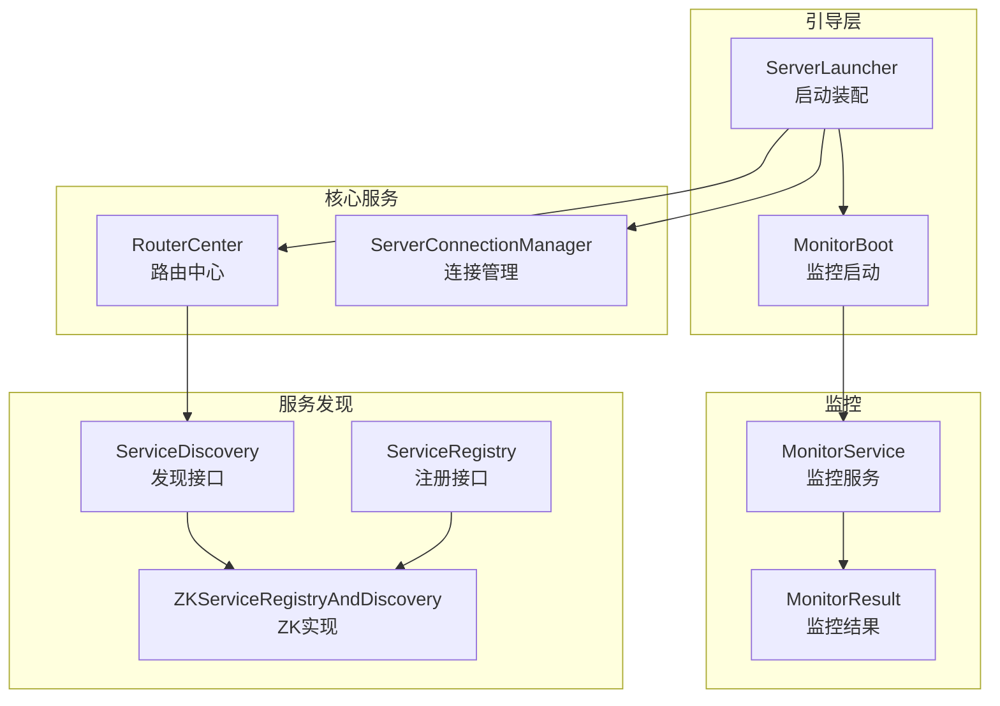
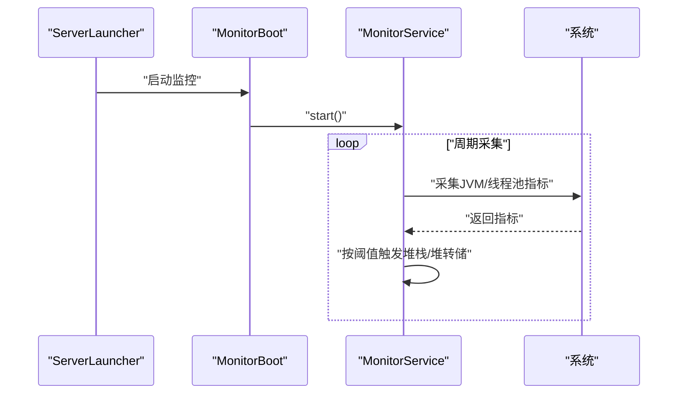
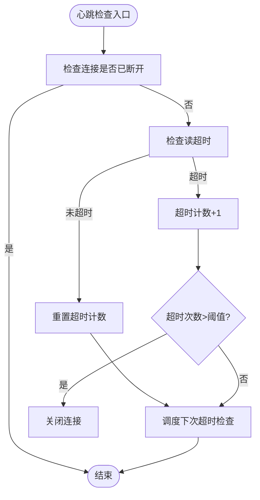
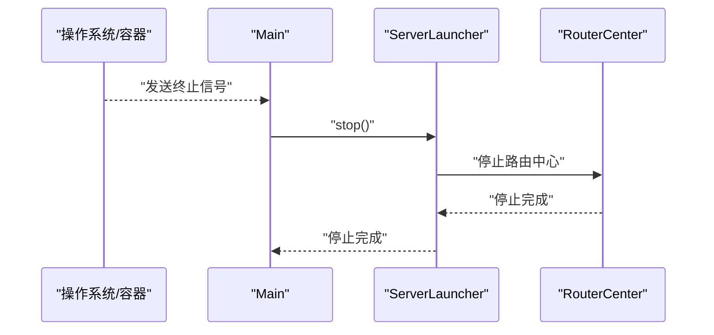
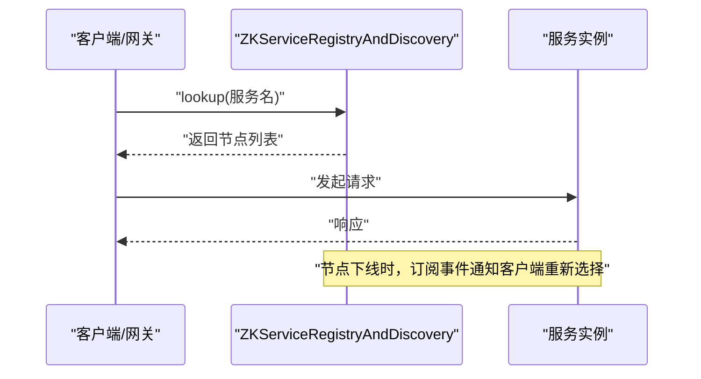
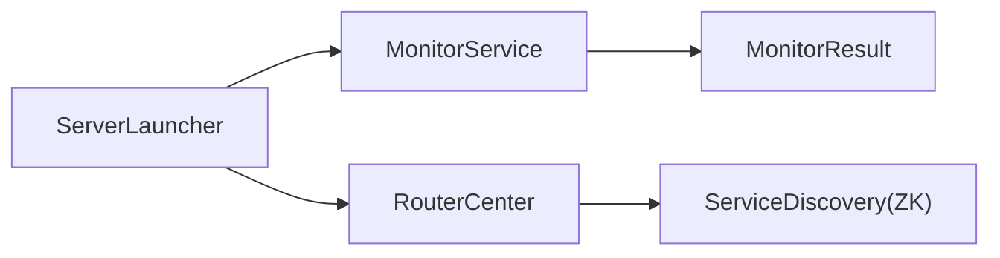

# 故障预防

<cite>
**本文引用的文件**
- [conf/reference.conf](file://conf/reference.conf)
- [mpush.conf](file://mpush-boot/src/main/resources/mpush.conf)
- [Main.java](file://mpush-boot/src/main/java/com/mpush/bootstrap/Main.java)
- [ServerLauncher.java](file://mpush-boot/src/main/java/com/mpush/bootstrap/ServerLauncher.java)
- [MonitorBoot.java](file://mpush-boot/src/main/java/com/mpush/bootstrap/job/MonitorBoot.java)
- [MonitorService.java](file://mpush-monitor/src/main/java/com/mpush/monitor/service/MonitorService.java)
- [MonitorResult.java](file://mpush-monitor/src/main/java/com/mpush/monitor/data/MonitorResult.java)
- [ConnectionManager.java](file://mpush-api/src/main/java/com/mpush/api/connection/ConnectionManager.java)
- [ServerConnectionManager.java](file://mpush-core/src/main/java/com/mpush/core/server/ServerConnectionManager.java)
- [HeartBeatHandler.java](file://mpush-core/src/main/java/com/mpush/core/handler/HeartBeatHandler.java)
- [RouterCenter.java](file://mpush-core/src/main/java/com/mpush/core/router/RouterCenter.java)
- [ServiceRegistry.java](file://mpush-api/src/main/java/com/mpush/api/srd/ServiceRegistry.java)
- [ServiceDiscovery.java](file://mpush-api/src/main/java/com/mpush/api/srd/ServiceDiscovery.java)
- [ZKServiceRegistryAndDiscovery.java](file://mpush-zk/src/main/java/com/mpush/zk/ZKServiceRegistryAndDiscovery.java)
</cite>

## 目录
1. [简介](#简介)
2. [项目结构](#项目结构)
3. [核心组件](#核心组件)
4. [架构总览](#架构总览)
5. [详细组件分析](#详细组件分析)
6. [依赖分析](#依赖分析)
7. [性能考量](#性能考量)
8. [故障排查指南](#故障排查指南)
9. [结论](#结论)
10. [附录](#附录)

## 简介
本文件面向MPush的故障预防与容灾，围绕以下主题展开：健康检查机制（服务健康、连接健康、资源使用率、响应时间）、自动重启与自愈（进程监控、异常检测、自动重启、故障转移）、高可用与负载均衡（服务发现、负载均衡算法、故障检测与自动切换）、备份与恢复（数据与配置备份、灾难恢复、业务连续性）、故障演练与应急预案（场景模拟、响应流程、职责分工、RTO）、监控告警与故障预警联动（分级、预判、自动处理与人工干预）、运维安全与可靠性保障（操作审计、变更管理、回滚与风控），并总结最佳实践。

## 项目结构
MPush采用多模块分层组织，核心模块包括：
- mpush-boot：启动器与引导链，负责服务装配与生命周期管理
- mpush-core：核心协议、连接管理、路由中心、推送中心等
- mpush-netty：基于Netty的网络编解码与连接抽象
- mpush-monitor：系统监控与指标采集
- mpush-zk：基于ZooKeeper的服务注册与发现
- mpush-api：公共接口与SPI扩展点
- conf：系统参考配置与运行时配置

图表来源
- [ServerLauncher.java](file://mpush-boot/src/main/java/com/mpush/bootstrap/ServerLauncher.java#L42-L71)
- [MonitorBoot.java](file://mpush-boot/src/main/java/com/mpush/bootstrap/job/MonitorBoot.java#L37-L41)
- [MonitorService.java](file://mpush-monitor/src/main/java/com/mpush/monitor/service/MonitorService.java#L65-L83)
- [MonitorResult.java](file://mpush-monitor/src/main/java/com/mpush/monitor/data/MonitorResult.java#L27-L64)
- [RouterCenter.java](file://mpush-core/src/main/java/com/mpush/core/router/RouterCenter.java#L40-L67)
- [ServerConnectionManager.java](file://mpush-core/src/main/java/com/mpush/core/server/ServerConnectionManager.java#L46-L68)
- [ServiceRegistry.java](file://mpush-api/src/main/java/com/mpush/api/srd/ServiceRegistry.java#L29-L34)
- [ServiceDiscovery.java](file://mpush-api/src/main/java/com/mpush/api/srd/ServiceDiscovery.java#L31-L38)
- [ZKServiceRegistryAndDiscovery.java](file://mpush-zk/src/main/java/com/mpush/zk/ZKServiceRegistryAndDiscovery.java#L39-L75)

章节来源
- [ServerLauncher.java](file://mpush-boot/src/main/java/com/mpush/bootstrap/ServerLauncher.java#L42-L71)
- [conf/reference.conf](file://conf/reference.conf#L13-L239)
- [mpush.conf](file://mpush-boot/src/main/resources/mpush.conf#L1-L16)

## 核心组件
- 引导与生命周期：ServerLauncher负责装配与启动顺序；Main提供JVM关闭钩子确保优雅停机。
- 连接与心跳：ServerConnectionManager在启用心跳检查时，基于HashedWheelTimer周期校验读超时，超限则关闭连接。
- 路由中心：RouterCenter负责本地与远程路由注册、查找与事件消费，支撑跨节点路由与故障转移。
- 监控：MonitorService周期采集JVM与线程池指标，按阈值触发堆栈/堆转储，支持可配置周期与开关。
- 服务发现：ZKServiceRegistryAndDiscovery通过ZK实现持久/临时节点注册、订阅与查询，支撑高可用与故障感知。

章节来源
- [Main.java](file://mpush-boot/src/main/java/com/mpush/bootstrap/Main.java#L49-L62)
- [ServerConnectionManager.java](file://mpush-core/src/main/java/com/mpush/core/server/ServerConnectionManager.java#L53-L68)
- [RouterCenter.java](file://mpush-core/src/main/java/com/mpush/core/router/RouterCenter.java#L40-L67)
- [MonitorService.java](file://mpush-monitor/src/main/java/com/mpush/monitor/service/MonitorService.java#L65-L83)
- [ZKServiceRegistryAndDiscovery.java](file://mpush-zk/src/main/java/com/mpush/zk/ZKServiceRegistryAndDiscovery.java#L78-L107)

## 架构总览
MPush通过引导链装配核心服务，监控服务独立于业务线程运行，连接管理与心跳策略保障长连接健康，路由中心与服务发现共同实现跨节点的高可用与故障转移。

图表来源
- [ServerLauncher.java](file://mpush-boot/src/main/java/com/mpush/bootstrap/ServerLauncher.java#L69-L70)
- [MonitorBoot.java](file://mpush-boot/src/main/java/com/mpush/bootstrap/job/MonitorBoot.java#L37-L41)
- [MonitorService.java](file://mpush-monitor/src/main/java/com/mpush/monitor/service/MonitorService.java#L65-L83)

## 详细组件分析

### 健康检查机制
- 服务健康状态检测
  - 监控服务周期采集JVM与线程池指标，支持开启/关闭与周期配置，满足健康状态可视化与趋势分析。
  - 配置入口：参考配置文件中的监控节与运行时配置覆盖。
- 连接健康检查
  - 连接管理器在启用心跳检查时，基于定时器周期校验连接读超时，累计超时次数超过阈值则主动关闭连接，避免僵尸连接占用资源。
  - 心跳相关配置：最小/最大心跳间隔、允许连续超时次数、会话过期时间等。
- 资源使用率监控
  - 监控服务采集JVM信息与线程池队列长度等指标，结合阈值触发堆栈/堆转储，辅助定位CPU与内存压力。
- 响应时间监控
  - 通过心跳往返与业务处理耗时统计（结合日志与线程池指标）评估响应时间，配合慢调用记录与性能剖析。

图表来源
- [ServerConnectionManager.java](file://mpush-core/src/main/java/com/mpush/core/server/ServerConnectionManager.java#L156-L177)

章节来源
- [MonitorService.java](file://mpush-monitor/src/main/java/com/mpush/monitor/service/MonitorService.java#L65-L83)
- [MonitorResult.java](file://mpush-monitor/src/main/java/com/mpush/monitor/data/MonitorResult.java#L27-L64)
- [ServerConnectionManager.java](file://mpush-core/src/main/java/com/mpush/core/server/ServerConnectionManager.java#L137-L177)
- [conf/reference.conf](file://conf/reference.conf#L224-L232)
- [mpush.conf](file://mpush-boot/src/main/resources/mpush.conf#L1-L16)

### 自动重启与自愈机制
- 进程监控与优雅停机
  - 主程序通过JVM关闭钩子统一停止服务，避免直接System.exit导致死循环或资源泄漏。
- 异常检测与自动重启
  - 建议在容器/进程管理层面配置健康探针与重启策略；应用侧通过心跳与监控指标作为健康判定依据。
- 故障转移
  - 路由中心支持本地与远程路由，结合服务发现实现跨节点路由切换；当节点不可用时，路由事件与远程路由查询可协助完成故障转移。

图表来源
- [Main.java](file://mpush-boot/src/main/java/com/mpush/bootstrap/Main.java#L49-L62)
- [ServerLauncher.java](file://mpush-boot/src/main/java/com/mpush/bootstrap/ServerLauncher.java#L77-L79)
- [RouterCenter.java](file://mpush-core/src/main/java/com/mpush/core/router/RouterCenter.java#L64-L67)

章节来源
- [Main.java](file://mpush-boot/src/main/java/com/mpush/bootstrap/Main.java#L49-L62)
- [ServerLauncher.java](file://mpush-boot/src/main/java/com/mpush/bootstrap/ServerLauncher.java#L77-L79)
- [RouterCenter.java](file://mpush-core/src/main/java/com/mpush/core/router/RouterCenter.java#L40-L67)

### 负载均衡与故障转移
- 服务发现
  - 通过ZK实现服务注册与发现，支持持久/临时节点，订阅变更事件，实现服务列表动态更新。
- 负载均衡算法
  - 可在客户端或网关侧实现轮询/权重/最少连接等策略；结合服务节点属性（如权重）进行分配。
- 故障检测与自动切换
  - 依赖心跳与连接健康检查识别节点异常；路由中心与远程路由查询在节点失效时切换至可用节点。

图表来源
- [ZKServiceRegistryAndDiscovery.java](file://mpush-zk/src/main/java/com/mpush/zk/ZKServiceRegistryAndDiscovery.java#L94-L107)
- [ServiceRegistry.java](file://mpush-api/src/main/java/com/mpush/api/srd/ServiceRegistry.java#L31-L33)
- [ServiceDiscovery.java](file://mpush-api/src/main/java/com/mpush/api/srd/ServiceDiscovery.java#L33-L35)

章节来源
- [ZKServiceRegistryAndDiscovery.java](file://mpush-zk/src/main/java/com/mpush/zk/ZKServiceRegistryAndDiscovery.java#L78-L107)
- [ServiceRegistry.java](file://mpush-api/src/main/java/com/mpush/api/srd/ServiceRegistry.java#L29-L34)
- [ServiceDiscovery.java](file://mpush-api/src/main/java/com/mpush/api/srd/ServiceDiscovery.java#L31-L38)

### 备份与恢复策略
- 数据备份
  - Redis集群/哨兵/单机模式配置支持；建议定期执行RDB快照与AOF备份，结合主从复制实现异地容灾。
- 配置备份
  - 参考配置文件与运行时配置分离，确保配置变更可追溯；版本化管理mpush.conf与环境变量覆盖。
- 灾难恢复
  - 通过服务发现与路由中心实现节点替换与流量切换；结合监控与告警快速定位问题并回切。
- 业务连续性
  - 通过心跳与连接健康检查降低无效连接占用；通过监控阈值触发堆转储辅助定位性能瓶颈。

章节来源
- [conf/reference.conf](file://conf/reference.conf#L143-L169)
- [mpush.conf](file://mpush-boot/src/main/resources/mpush.conf#L6-L9)

### 故障演练与应急预案
- 故障场景模拟
  - 模拟ZK断连、Redis不可用、节点心跳超时、连接风暴等场景。
- 应急响应流程
  - 触发告警 → 自动降级/隔离 → 快速定位 → 回滚/切换 → 恢复验证。
- 人员职责分工
  - 运维：监控与告警处置、变更与回滚；开发：根因分析与修复；测试：演练与预案验证。
- 恢复时间目标（RTO）
  - 通过服务发现与路由中心实现秒级切换；结合自动化脚本与容器编排缩短RTO。

章节来源
- [ZKServiceRegistryAndDiscovery.java](file://mpush-zk/src/main/java/com/mpush/zk/ZKServiceRegistryAndDiscovery.java#L78-L107)
- [RouterCenter.java](file://mpush-core/src/main/java/com/mpush/core/router/RouterCenter.java#L69-L117)

### 监控告警与故障预警联动
- 告警分级
  - 基于监控指标阈值分级（如连接数、队列长度、GC频率、线程池饱和度）设置不同级别告警。
- 故障预判
  - 通过心跳超时次数、连接数增长、队列积压等指标预判潜在故障。
- 自动处理
  - 结合进程管理器的健康探针与重启策略，实现自动拉起与隔离。
- 人工干预
  - 当自动处理无法解决时，触发升级告警并通知值班人员介入。

章节来源
- [MonitorService.java](file://mpush-monitor/src/main/java/com/mpush/monitor/service/MonitorService.java#L101-L130)
- [conf/reference.conf](file://conf/reference.conf#L224-L232)

### 运维操作的安全性与可靠性保障
- 操作审计
  - 记录关键配置变更与运维操作，确保可追溯。
- 变更管理
  - 通过版本化配置与灰度发布，降低变更风险。
- 回滚机制
  - 支持快速回滚至上一稳定版本；结合配置回退与服务降级。
- 风险控制
  - 通过监控阈值与告警联动，提前阻断高风险变更。

章节来源
- [conf/reference.conf](file://conf/reference.conf#L1-L11)
- [mpush.conf](file://mpush-boot/src/main/resources/mpush.conf#L1-L16)

## 依赖分析
- 组件耦合
  - 引导层与核心服务松耦合，通过接口与SPI扩展点解耦。
  - 监控服务独立运行，避免与业务线程争抢资源。
  - 服务发现与路由中心相互协作，实现高可用。
- 外部依赖
  - ZooKeeper用于服务注册与发现；Redis用于缓存与消息队列（通过SPI实现）。

图表来源
- [ServerLauncher.java](file://mpush-boot/src/main/java/com/mpush/bootstrap/ServerLauncher.java#L57-L70)
- [MonitorService.java](file://mpush-monitor/src/main/java/com/mpush/monitor/service/MonitorService.java#L57-L60)
- [RouterCenter.java](file://mpush-core/src/main/java/com/mpush/core/router/RouterCenter.java#L40-L67)
- [ServiceDiscovery.java](file://mpush-api/src/main/java/com/mpush/api/srd/ServiceDiscovery.java#L31-L38)

章节来源
- [ServerLauncher.java](file://mpush-boot/src/main/java/com/mpush/bootstrap/ServerLauncher.java#L57-L70)
- [MonitorService.java](file://mpush-monitor/src/main/java/com/mpush/monitor/service/MonitorService.java#L57-L60)
- [RouterCenter.java](file://mpush-core/src/main/java/com/mpush/core/router/RouterCenter.java#L40-L67)

## 性能考量
- 心跳与连接管理
  - 合理设置心跳间隔与超时次数，避免频繁连接抖动；使用HashedWheelTimer实现低开销定时。
- 线程池与队列
  - 根据业务QPS与RT调优线程池大小与队列长度，防止队列积压与线程饥饿。
- 监控开销
  - 控制监控采集周期与日志级别，避免监控成为性能瓶颈。

章节来源
- [ServerConnectionManager.java](file://mpush-core/src/main/java/com/mpush/core/server/ServerConnectionManager.java#L59-L68)
- [MonitorService.java](file://mpush-monitor/src/main/java/com/mpush/monitor/service/MonitorService.java#L65-L83)
- [conf/reference.conf](file://conf/reference.conf#L182-L205)

## 故障排查指南
- 连接异常
  - 检查心跳超时次数与读超时日志；确认连接管理器是否正确关闭异常连接。
- 路由异常
  - 查看路由中心注册/注销日志与远程路由查询结果；确认服务发现节点列表是否正确。
- 监控异常
  - 检查监控服务线程与采集周期配置；查看堆栈/堆转储输出位置与权限。

章节来源
- [ServerConnectionManager.java](file://mpush-core/src/main/java/com/mpush/core/server/ServerConnectionManager.java#L156-L177)
- [RouterCenter.java](file://mpush-core/src/main/java/com/mpush/core/router/RouterCenter.java#L69-L117)
- [MonitorService.java](file://mpush-monitor/src/main/java/com/mpush/monitor/service/MonitorService.java#L65-L83)

## 结论
MPush通过完善的引导与生命周期管理、连接与心跳健康检查、监控与指标采集、服务发现与路由中心，构建了可预防、可自愈、可恢复的高可用架构。结合合理的备份与演练、分级告警与自动处理联动，以及严格的运维安全与变更管理，能够显著提升系统的稳定性与业务连续性。

## 附录
- 关键配置要点
  - 心跳与会话：最小/最大心跳间隔、允许连续超时次数、会话过期时间
  - 监控：采集周期、是否打印日志、是否转储堆栈/堆
  - 线程池：各模块工作线程池大小与队列容量
  - 网络：连接/网关/管理端口、缓冲区与流量整形
  - Redis：集群模式、节点列表、连接池参数
  - ZooKeeper：服务地址、命名空间、重试策略、会话超时

章节来源
- [conf/reference.conf](file://conf/reference.conf#L22-L239)
- [mpush.conf](file://mpush-boot/src/main/resources/mpush.conf#L1-L16)