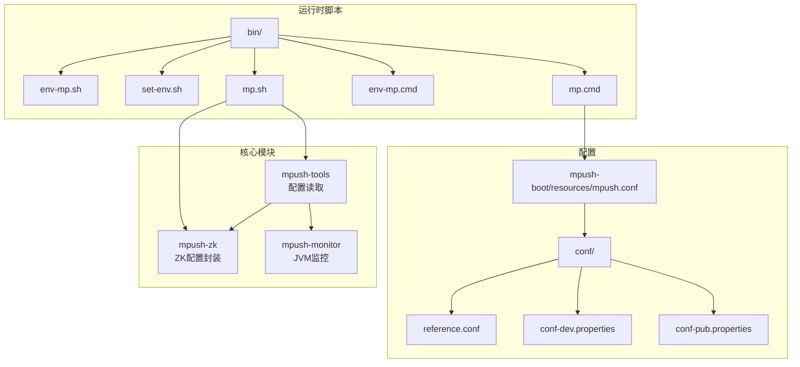
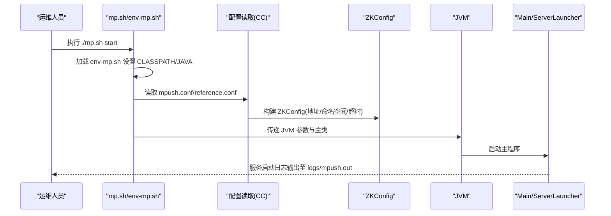
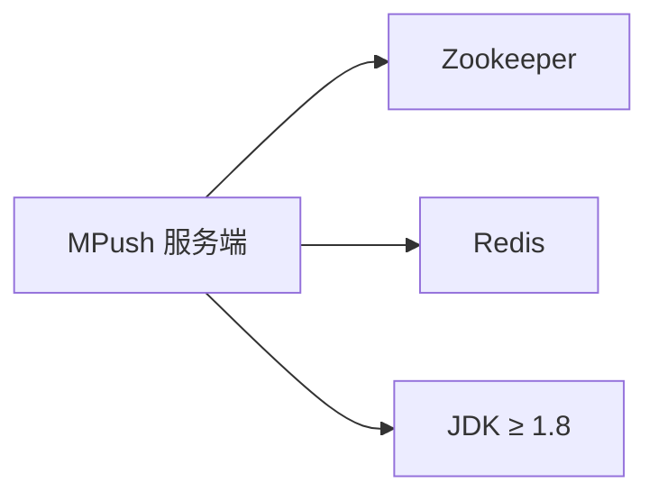

# 环境准备

<cite>
**本文引用的文件**
- [README.md](file://README.md)
- [env-mp.sh](file://bin/env-mp.sh)
- [env-mp.cmd](file://bin/env-mp.cmd)
- [set-env.sh](file://bin/set-env.sh)
- [mp.sh](file://bin/mp.sh)
- [mp.cmd](file://bin/mp.cmd)
- [reference.conf](file://conf/reference.conf)
- [conf-dev.properties](file://conf/conf-dev.properties)
- [conf-pub.properties](file://conf/conf-pub.properties)
- [mpush.conf](file://mpush-boot/src/main/resources/mpush.conf)
- [CC.java](file://mpush-tools/src/main/java/com/mpush/tools/config/CC.java)
- [ZKConfig.java](file://mpush-zk/src/main/java/com/mpush/zk/ZKConfig.java)
- [JVMUtil.java](file://mpush-tools/src/main/java/com/mpush/tools/common/JVMUtil.java)
- [JVMMemory.java](file://mpush-monitor/src/main/java/com/mpush/monitor/quota/impl/JVMMemory.java)
- [JVMInfo.java](file://mpush-monitor/src/main/java/com/mpush/monitor/quota/impl/JVMInfo.java)
</cite>

## 目录
1. [简介](#简介)
2. [项目结构](#项目结构)
3. [核心组件](#核心组件)
4. [架构总览](#架构总览)
5. [详细组件分析](#详细组件分析)
6. [依赖分析](#依赖分析)
7. [性能考虑](#性能考虑)
8. [故障排查指南](#故障排查指南)
9. [结论](#结论)
10. [附录](#附录)

## 简介
本指南面向在生产环境中部署 MPush 的工程师，提供从硬件资源、操作系统、软件依赖、网络与系统参数优化到环境变量与验证方法的完整准备方案。依据仓库中的配置与脚本，明确各组件的最低要求、推荐规格与注意事项，确保服务稳定运行。

## 项目结构
MPush 服务端运行所需的关键目录与文件：
- bin：启动脚本与环境初始化脚本（Linux/Windows）
- conf：运行时配置与参考配置（HOCON 格式）
- mpush-boot/resources：打包时的默认配置模板
- mpush-tools：配置读取与运行时参数封装
- mpush-zk：Zookeeper 客户端配置封装
- mpush-monitor：JVM 监控指标采集（用于系统参数优化参考）

图表来源
- [env-mp.sh](file://bin/env-mp.sh#L1-L103)
- [set-env.sh](file://bin/set-env.sh#L1-L37)
- [mp.sh](file://bin/mp.sh#L1-L242)
- [env-mp.cmd](file://bin/env-mp.cmd#L1-L50)
- [mp.cmd](file://bin/mp.cmd#L1-L33)
- [reference.conf](file://conf/reference.conf#L1-L239)
- [conf-dev.properties](file://conf/conf-dev.properties#L1-L5)
- [conf-pub.properties](file://conf/conf-pub.properties#L1-L5)
- [mpush.conf](file://mpush-boot/src/main/resources/mpush.conf#L1-L16)
- [CC.java](file://mpush-tools/src/main/java/com/mpush/tools/config/CC.java#L102-L339)
- [ZKConfig.java](file://mpush-zk/src/main/java/com/mpush/zk/ZKConfig.java#L41-L162)
- [JVMMemory.java](file://mpush-monitor/src/main/java/com/mpush/monitor/quota/impl/JVMMemory.java#L63-L254)
- [JVMInfo.java](file://mpush-monitor/src/main/java/com/mpush/monitor/quota/impl/JVMInfo.java#L41-L68)

章节来源
- [README.md](file://README.md#L32-L87)
- [reference.conf](file://conf/reference.conf#L1-L239)
- [mpush.conf](file://mpush-boot/src/main/resources/mpush.conf#L1-L16)

## 核心组件
- JDK：服务运行依赖 JDK≥1.8（Windows/Linux/macOS 均可），需设置 JAVA_HOME。
- Zookeeper：服务发现与注册中心，依赖 Zookeeper 集群。
- Redis：缓存与消息队列，支持 single/cluster/sentinel 模式。
- 启动脚本：Linux 使用 mp.sh/env-mp.sh，Windows 使用 mp.cmd/env-mp.cmd。
- 配置体系：reference.conf 提供默认配置，mpush.conf 覆盖默认值；开发/发布环境可通过 properties 文件覆盖部分参数。

章节来源
- [README.md](file://README.md#L34-L42)
- [reference.conf](file://conf/reference.conf#L125-L141)
- [reference.conf](file://conf/reference.conf#L229-L255)
- [mpush.conf](file://mpush-boot/src/main/resources/mpush.conf#L1-L16)
- [conf-dev.properties](file://conf/conf-dev.properties#L1-L5)
- [conf-pub.properties](file://conf/conf-pub.properties#L1-L5)

## 架构总览
MPush 服务端启动流程概览：启动脚本加载环境变量与类路径，读取配置，最终调用主程序入口。

图表来源
- [mp.sh](file://bin/mp.sh#L134-L165)
- [env-mp.sh](file://bin/env-mp.sh#L70-L92)
- [CC.java](file://mpush-tools/src/main/java/com/mpush/tools/config/CC.java#L102-L130)
- [ZKConfig.java](file://mpush-zk/src/main/java/com/mpush/zk/ZKConfig.java#L54-L65)

章节来源
- [mp.sh](file://bin/mp.sh#L1-L242)
- [env-mp.sh](file://bin/env-mp.sh#L1-L103)
- [CC.java](file://mpush-tools/src/main/java/com/mpush/tools/config/CC.java#L102-L339)
- [ZKConfig.java](file://mpush-zk/src/main/java/com/mpush/zk/ZKConfig.java#L41-L162)

## 详细组件分析

### 硬件资源配置建议
- CPU：建议至少 4 核，高并发场景建议 8 核以上；线程池默认按 CPU 核数动态调整（配置项 conn-work/gateway-server-work/http-work 等为 0 表示按 CPU 动态）。
- 内存：建议最小 4GB，结合业务 QPS 与消息大小评估堆内存与缓冲区；JVM 参数可在 set-env.sh 中配置（例如堆大小、GC 策略）。
- 磁盘：日志与临时目录位于 logs/tmp，建议预留足够空间；Redis/数据库持久化也需考虑磁盘 IO。
- 网络：公网端口 3000（接入服务）、内网端口 3001（网关服务）、控制台 3002；UDP 客户端端口 4000；WebSocket 端口可选 0（禁用）。

章节来源
- [reference.conf](file://conf/reference.conf#L183-L205)
- [reference.conf](file://conf/reference.conf#L131-L209)
- [mpush.conf](file://mpush-boot/src/main/resources/mpush.conf#L10-L16)

### 操作系统兼容性
- Linux：推荐使用主流发行版（CentOS/RHEL、Ubuntu、Debian），脚本基于 POSIX 接口。
- Windows：提供 .cmd 启动脚本，需设置 JAVA_HOME。
- macOS：未在仓库中提供专用脚本，但 JDK 支持与 Linux 类似，可参考 Linux 步骤。

章节来源
- [env-mp.sh](file://bin/env-mp.sh#L94-L97)
- [env-mp.cmd](file://bin/env-mp.cmd#L37-L49)
- [README.md](file://README.md#L34-L42)

### 软件依赖与安装配置
- JDK：安装 JDK≥1.8 并设置 JAVA_HOME。
- Zookeeper：安装并启动集群，配置 server-address、namespace、digest、watch-path、重试与超时参数。
- Redis：安装并配置节点列表、密码、集群模式（single/cluster/sentinel）及连接池参数。

章节来源
- [README.md](file://README.md#L34-L42)
- [reference.conf](file://conf/reference.conf#L125-L141)
- [reference.conf](file://conf/reference.conf#L229-L255)
- [ZKConfig.java](file://mpush-zk/src/main/java/com/mpush/zk/ZKConfig.java#L54-L65)
- [CC.java](file://mpush-tools/src/main/java/com/mpush/tools/config/CC.java#L271-L278)

### 网络环境准备
- 防火墙：放通公网接入端口 3000、内网网关端口 3001、控制台端口 3002；UDP 客户端端口 4000；WebSocket 端口按需开放。
- DNS：若使用域名映射，可在 http.dns-mapping 配置；也可通过 public-host-mapping 或 DnsMappingManager 实现。
- 网络拓扑：Zookeeper 地址通过 server-address 配置；Redis 节点列表 nodes 指定；必要时配置多播组播地址（gateway-server-multicast/gateway-client-multicast）。

章节来源
- [reference.conf](file://conf/reference.conf#L125-L141)
- [reference.conf](file://conf/reference.conf#L257-L266)
- [reference.conf](file://conf/reference.conf#L148-L151)
- [CC.java](file://mpush-tools/src/main/java/com/mpush/tools/config/CC.java#L308-L318)

### 环境变量配置指南
- JAVA_HOME：必需，Linux/Windows 启动脚本均依赖此变量。
- MP_CFG_DIR/MP_LOG_DIR/MP_DATA_DIR：可选，用于自定义配置、日志与数据目录。
- JVM 参数：通过 set-env.sh 设置 Netty 泄漏检测、JMX、GC 等参数；mp.sh 会合并 SERVER_JVM_FLAGS。
- JMX：mp.sh 支持本地/远程 JMX，可通过 JMXPORT/JMXAUTH/JMXSSL 控制。

章节来源
- [env-mp.sh](file://bin/env-mp.sh#L30-L74)
- [env-mp.cmd](file://bin/env-mp.cmd#L35-L49)
- [set-env.sh](file://bin/set-env.sh#L1-L37)
- [mp.sh](file://bin/mp.sh#L41-L77)

### 系统参数优化
- 文件描述符与内核参数：建议提升系统打开文件句柄上限，降低 TCP 缓冲区与写保护阈值相关参数，避免 epoll/select 问题。
- 进程限制：根据并发连接数与线程池规模，合理设置 ulimit 与 systemd limits。
- JVM 与 Netty：在 set-env.sh 中配置合适的堆大小、GC 策略与 Netty 选择器重建阈值；启用 JMX 便于远程监控。

章节来源
- [set-env.sh](file://bin/set-env.sh#L1-L37)
- [reference.conf](file://conf/reference.conf#L174-L179)
- [reference.conf](file://conf/reference.conf#L181-L208)

### 环境验证方法
- 启动服务：执行 ./mp.sh start，检查 logs/mpush.out 是否输出启动日志。
- 状态查询：./mp.sh status 会尝试连接控制台端口 3002。
- 连接验证：使用 mpush-test 模块中的测试入口模拟客户端与消息推送，观察日志。
- 监控：JMX 默认启用，可通过本地 jconsole/jvisualvm 连接；也可在 mp.sh 中开启远程 JMX。

章节来源
- [README.md](file://README.md#L71-L78)
- [mp.sh](file://bin/mp.sh#L134-L165)
- [mp.sh](file://bin/mp.sh#L229-L238)
- [JVMUtil.java](file://mpush-tools/src/main/java/com/mpush/tools/common/JVMUtil.java#L48-L125)

## 依赖分析
MPush 对外部组件的依赖关系如下：

图表来源
- [README.md](file://README.md#L34-L42)
- [reference.conf](file://conf/reference.conf#L125-L141)
- [reference.conf](file://conf/reference.conf#L229-L255)

章节来源
- [README.md](file://README.md#L34-L42)
- [reference.conf](file://conf/reference.conf#L125-L141)
- [reference.conf](file://conf/reference.conf#L229-L255)

## 性能考虑
- 线程池与 CPU：线程池大小为 0 时表示按 CPU 核数动态调整，建议根据实际负载调优。
- 缓冲区与水位：connect-server/gateway-server 的发送/接收缓冲区与写保护水位可根据网络质量与消息大小调整。
- 流量整形：gateway-client/gateway-server/connect-server 的流量整形开关与限速参数可用于削峰填谷。
- JVM 与 GC：在 set-env.sh 中配置堆大小与 GC 策略，结合 JMX 监控定位热点。

章节来源
- [reference.conf](file://conf/reference.conf#L183-L205)
- [reference.conf](file://conf/reference.conf#L162-L208)
- [set-env.sh](file://bin/set-env.sh#L30-L37)

## 故障排查指南
- 启动失败：检查 JAVA_HOME 是否正确、CLASSPATH 是否包含 conf/lib/plugins、日志输出至 logs/mpush.out。
- 连接异常：确认端口开放（3000/3001/3002）、Zookeeper 地址与命名空间、Redis 节点可达。
- 性能问题：通过 JMX 观察堆内存、线程状态与 GC 情况；结合 JVMMemory/JVMInfo 指标定位瓶颈。
- 线程阻塞：使用 JVMUtil.dumpStack 输出线程栈，辅助定位阻塞点。

章节来源
- [env-mp.cmd](file://bin/env-mp.cmd#L37-L49)
- [env-mp.sh](file://bin/env-mp.sh#L70-L92)
- [mp.sh](file://bin/mp.sh#L134-L165)
- [JVMUtil.java](file://mpush-tools/src/main/java/com/mpush/tools/common/JVMUtil.java#L48-L125)
- [JVMMemory.java](file://mpush-monitor/src/main/java/com/mpush/monitor/quota/impl/JVMMemory.java#L237-L254)
- [JVMInfo.java](file://mpush-monitor/src/main/java/com/mpush/monitor/quota/impl/JVMInfo.java#L52-L66)

## 结论
按照本指南完成硬件与系统准备、安装 JDK/Zookeeper/Redis、配置环境变量与网络策略，并结合 set-env.sh 与 reference.conf 的参数进行调优，即可在生产环境稳定运行 MPush。建议在上线前完成压力测试与 JMX 监控接入，持续跟踪 JVM 与网络指标。

## 附录
- 配置文件位置与优先级：mpush.conf 覆盖 reference.conf；开发/发布环境可通过 properties 文件覆盖部分参数。
- 启动命令：Linux 使用 ./mp.sh start；Windows 使用直接运行 jar（mp.cmd）。

章节来源
- [README.md](file://README.md#L56-L78)
- [reference.conf](file://conf/reference.conf#L1-L11)
- [conf-dev.properties](file://conf/conf-dev.properties#L1-L5)
- [conf-pub.properties](file://conf/conf-pub.properties#L1-L5)
- [mpush.conf](file://mpush-boot/src/main/resources/mpush.conf#L1-L16)
- [mp.cmd](file://bin/mp.cmd#L28-L28)