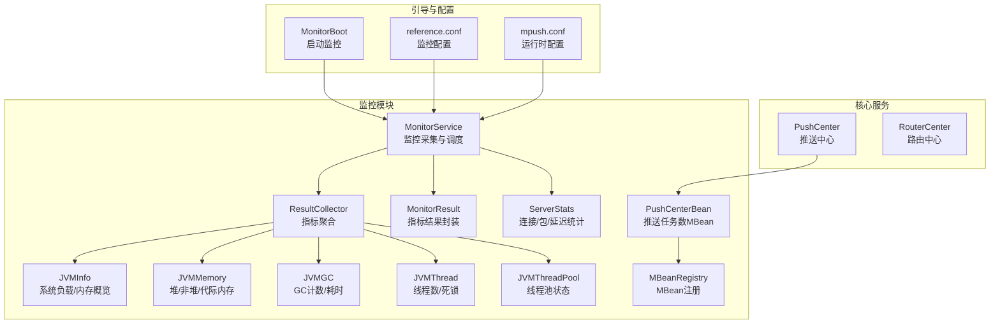
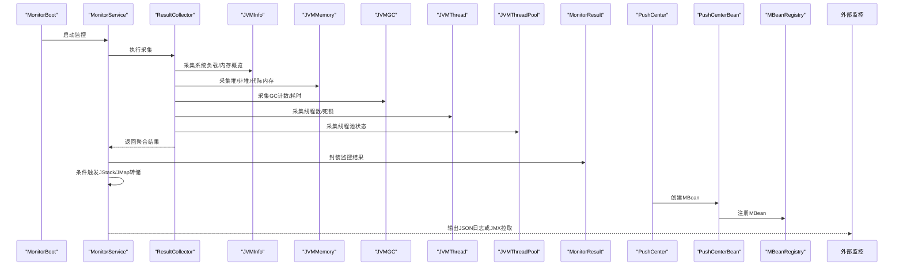
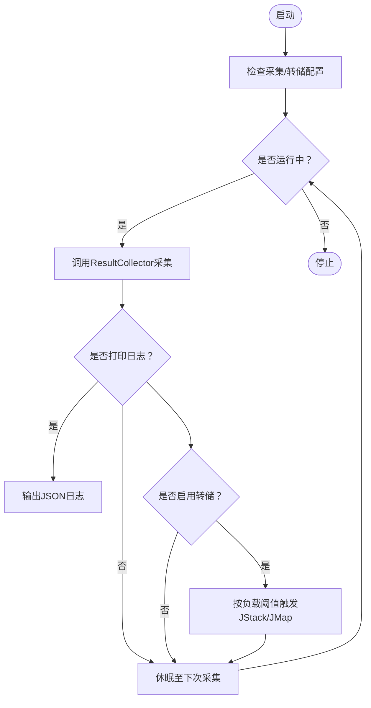
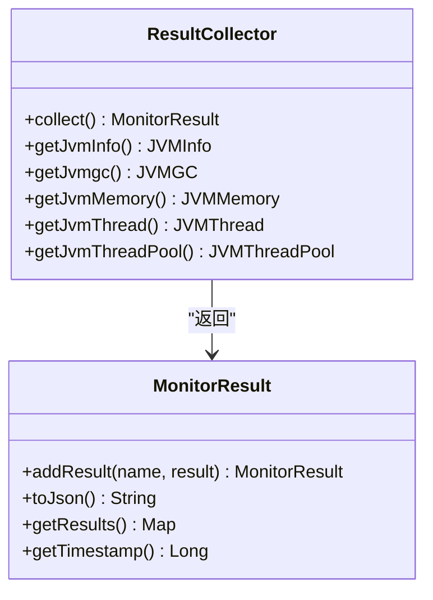
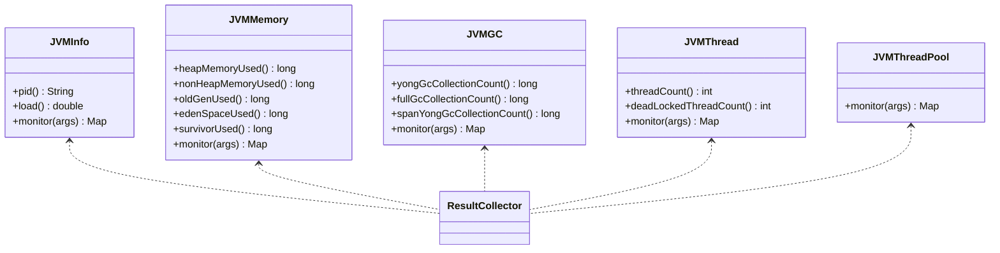
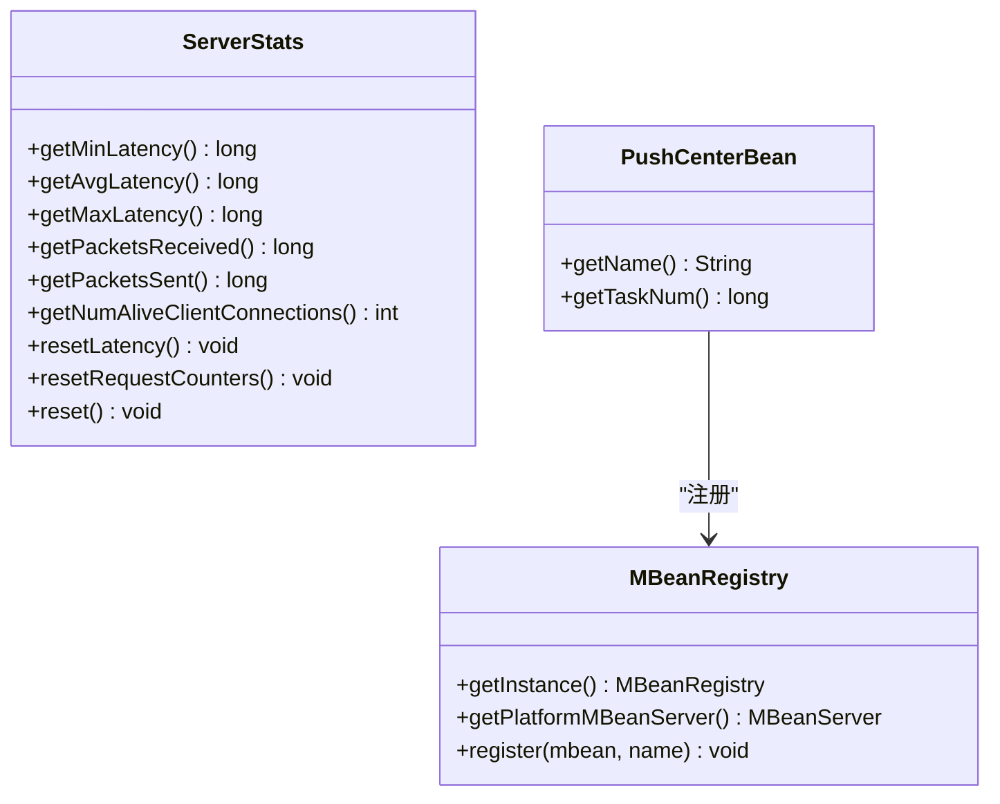
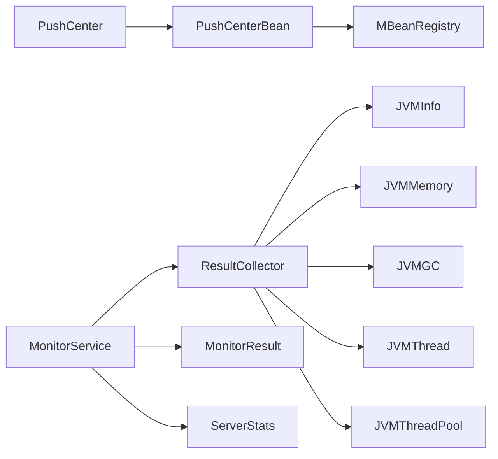

# 监控告警

<cite>
**本文引用的文件**   
- [MonitorService.java](file://mpush-monitor/src/main/java/com/mpush/monitor/service/MonitorService.java)
- [ResultCollector.java](file://mpush-monitor/src/main/java/com/mpush/monitor/data/ResultCollector.java)
- [MonitorResult.java](file://mpush-monitor/src/main/java/com/mpush/monitor/data/MonitorResult.java)
- [JVMInfo.java](file://mpush-monitor/src/main/java/com/mpush/monitor/quota/impl/JVMInfo.java)
- [JVMMemory.java](file://mpush-monitor/src/main/java/com/mpush/monitor/quota/impl/JVMMemory.java)
- [JVMGC.java](file://mpush-monitor/src/main/java/com/mpush/monitor/quota/impl/JVMGC.java)
- [JVMThread.java](file://mpush-monitor/src/main/java/com/mpush/monitor/quota/impl/JVMThread.java)
- [JVMThreadPool.java](file://mpush-monitor/src/main/java/com/mpush/monitor/quota/impl/JVMThreadPool.java)
- [ServerStats.java](file://mpush-monitor/src/main/java/com/mpush/monitor/jmx/stats/ServerStats.java)
- [PushCenterBean.java](file://mpush-monitor/src/main/java/com/mpush/monitor/jmx/mxbean/PushCenterBean.java)
- [MBeanRegistry.java](file://mpush-monitor/src/main/java/com/mpush/monitor/jmx/MBeanRegistry.java)
- [reference.conf](file://conf/reference.conf)
- [mpush.conf](file://mpush-boot/src/main/resources/mpush.conf)
- [MonitorBoot.java](file://mpush-boot/src/main/java/com/mpush/bootstrap/job/MonitorBoot.java)
- [PushCenter.java](file://mpush-core/src/main/java/com/mpush/core/push/PushCenter.java)
- [RouterCenter.java](file://mpush-core/src/main/java/com/mpush/core/router/RouterCenter.java)
</cite>

## 目录
1. [简介](#简介)
2. [项目结构](#项目结构)
3. [核心组件](#核心组件)
4. [架构总览](#架构总览)
5. [详细组件分析](#详细组件分析)
6. [依赖分析](#依赖分析)
7. [性能考量](#性能考量)
8. [故障排查指南](#故障排查指南)
9. [结论](#结论)
10. [附录](#附录)

## 简介
本指导文档面向MPush监控与告警体系建设，基于仓库内现有监控模块与核心服务，系统化梳理监控指标定义、采集方法、告警规则设计、通知机制、仪表板集成以及故障诊断流程。文档同时提供最佳实践与常见问题解决方案，帮助团队建立稳定、可观测、可预警的生产级监控体系。

## 项目结构
MPush的监控能力主要集中在独立的监控模块与核心服务中：
- 监控模块（mpush-monitor）：负责JVM指标采集、线程池状态、JStack/JMap转储触发、结果聚合与输出。
- 核心服务（mpush-core）：包含推送中心、路由中心等关键业务组件，提供JMX MBean注册与统计信息。
- 引导与配置（mpush-boot/conf）：启动阶段加载监控并配置采集周期、转储策略等参数。

图表来源
- [MonitorService.java](file://mpush-monitor/src/main/java/com/mpush/monitor/service/MonitorService.java#L65-L83)
- [ResultCollector.java](file://mpush-monitor/src/main/java/com/mpush/monitor/data/ResultCollector.java#L45-L53)
- [JVMInfo.java](file://mpush-monitor/src/main/java/com/mpush/monitor/quota/impl/JVMInfo.java#L52-L67)
- [JVMMemory.java](file://mpush-monitor/src/main/java/com/mpush/monitor/quota/impl/JVMMemory.java#L237-L264)
- [JVMGC.java](file://mpush-monitor/src/main/java/com/mpush/monitor/quota/impl/JVMGC.java#L146-L157)
- [JVMThread.java](file://mpush-monitor/src/main/java/com/mpush/monitor/quota/impl/JVMThread.java#L66-L73)
- [JVMThreadPool.java](file://mpush-monitor/src/main/java/com/mpush/monitor/quota/impl/JVMThreadPool.java#L42-L55)
- [ServerStats.java](file://mpush-monitor/src/main/java/com/mpush/monitor/jmx/stats/ServerStats.java#L52-L151)
- [PushCenterBean.java](file://mpush-monitor/src/main/java/com/mpush/monitor/jmx/mxbean/PushCenterBean.java#L39-L47)
- [MBeanRegistry.java](file://mpush-monitor/src/main/java/com/mpush/monitor/jmx/MBeanRegistry.java#L12-L45)
- [MonitorBoot.java](file://mpush-boot/src/main/java/com/mpush/bootstrap/job/MonitorBoot.java#L38-L41)
- [reference.conf](file://conf/reference.conf#L224-L232)
- [mpush.conf](file://mpush-boot/src/main/resources/mpush.conf#L1-L16)

章节来源
- [MonitorService.java](file://mpush-monitor/src/main/java/com/mpush/monitor/service/MonitorService.java#L36-L147)
- [reference.conf](file://conf/reference.conf#L224-L232)
- [mpush.conf](file://mpush-boot/src/main/resources/mpush.conf#L1-L16)

## 核心组件
- 监控采集器（MonitorService）
  - 周期性采集JVM与线程池指标，输出JSON日志，按需触发JStack/JMap转储，支持通过配置控制采集周期与转储策略。
- 指标聚合器（ResultCollector）
  - 聚合JVM信息、GC、内存、线程、线程池等指标，形成统一的监控结果对象。
- 指标结果封装（MonitorResult）
  - 提供时间戳与键值对形式的结果集，便于序列化与上报。
- JVM指标实现（JVMInfo/JVMMemory/JVMGC/JVMThread/JVMThreadPool）
  - 通过JMX读取系统负载、内存、GC、线程与线程池状态，提供增量统计与汇总。
- 业务统计（ServerStats）
  - 记录连接数、收发包数、最小/平均/最大延迟等，支持重置与查询。
- JMX MBean（PushCenterBean/MBeanRegistry）
  - 将推送任务数等关键业务指标暴露为JMX，便于外部监控系统拉取。
- 启动与配置（MonitorBoot/reference.conf/mpush.conf）
  - 在服务启动时注册监控并加载采集周期、转储开关等参数。

章节来源
- [MonitorService.java](file://mpush-monitor/src/main/java/com/mpush/monitor/service/MonitorService.java#L65-L130)
- [ResultCollector.java](file://mpush-monitor/src/main/java/com/mpush/monitor/data/ResultCollector.java#L45-L73)
- [MonitorResult.java](file://mpush-monitor/src/main/java/com/mpush/monitor/data/MonitorResult.java#L31-L64)
- [JVMInfo.java](file://mpush-monitor/src/main/java/com/mpush/monitor/quota/impl/JVMInfo.java#L52-L67)
- [JVMMemory.java](file://mpush-monitor/src/main/java/com/mpush/monitor/quota/impl/JVMMemory.java#L237-L264)
- [JVMGC.java](file://mpush-monitor/src/main/java/com/mpush/monitor/quota/impl/JVMGC.java#L146-L157)
- [JVMThread.java](file://mpush-monitor/src/main/java/com/mpush/monitor/quota/impl/JVMThread.java#L66-L73)
- [JVMThreadPool.java](file://mpush-monitor/src/main/java/com/mpush/monitor/quota/impl/JVMThreadPool.java#L42-L55)
- [ServerStats.java](file://mpush-monitor/src/main/java/com/mpush/monitor/jmx/stats/ServerStats.java#L52-L151)
- [PushCenterBean.java](file://mpush-monitor/src/main/java/com/mpush/monitor/jmx/mxbean/PushCenterBean.java#L39-L47)
- [MBeanRegistry.java](file://mpush-monitor/src/main/java/com/mpush/monitor/jmx/MBeanRegistry.java#L12-L45)
- [MonitorBoot.java](file://mpush-boot/src/main/java/com/mpush/bootstrap/job/MonitorBoot.java#L38-L41)
- [reference.conf](file://conf/reference.conf#L224-L232)
- [mpush.conf](file://mpush-boot/src/main/resources/mpush.conf#L1-L16)

## 架构总览
下图展示了监控体系从采集、聚合到输出与JMX暴露的整体流程：

图表来源
- [MonitorBoot.java](file://mpush-boot/src/main/java/com/mpush/bootstrap/job/MonitorBoot.java#L38-L41)
- [MonitorService.java](file://mpush-monitor/src/main/java/com/mpush/monitor/service/MonitorService.java#L65-L83)
- [ResultCollector.java](file://mpush-monitor/src/main/java/com/mpush/monitor/data/ResultCollector.java#L45-L53)
- [JVMInfo.java](file://mpush-monitor/src/main/java/com/mpush/monitor/quota/impl/JVMInfo.java#L59-L67)
- [JVMMemory.java](file://mpush-monitor/src/main/java/com/mpush/monitor/quota/impl/JVMMemory.java#L237-L264)
- [JVMGC.java](file://mpush-monitor/src/main/java/com/mpush/monitor/quota/impl/JVMGC.java#L146-L157)
- [JVMThread.java](file://mpush-monitor/src/main/java/com/mpush/monitor/quota/impl/JVMThread.java#L66-L73)
- [JVMThreadPool.java](file://mpush-monitor/src/main/java/com/mpush/monitor/quota/impl/JVMThreadPool.java#L42-L55)
- [PushCenter.java](file://mpush-core/src/main/java/com/mpush/core/push/PushCenter.java#L105-L105)
- [PushCenterBean.java](file://mpush-monitor/src/main/java/com/mpush/monitor/jmx/mxbean/PushCenterBean.java#L39-L47)
- [MBeanRegistry.java](file://mpush-monitor/src/main/java/com/mpush/monitor/jmx/MBeanRegistry.java#L26-L43)

## 详细组件分析

### 监控采集与调度（MonitorService）
- 周期采集：按配置周期休眠并执行采集，输出JSON日志，支持转储开关。
- 转储触发：根据系统负载阈值触发JStack/JMap转储，避免重复触发。
- 线程池注册：接收业务线程池注册，统一纳入监控范围。

图表来源
- [MonitorService.java](file://mpush-monitor/src/main/java/com/mpush/monitor/service/MonitorService.java#L65-L130)
- [reference.conf](file://conf/reference.conf#L224-L232)

章节来源
- [MonitorService.java](file://mpush-monitor/src/main/java/com/mpush/monitor/service/MonitorService.java#L65-L130)

### 指标聚合与结果封装（ResultCollector/MonitorResult）
- 聚合维度：系统信息、GC、内存、线程、线程池。
- 结果封装：统一时间戳与键值对结构，便于序列化与上报。

图表来源
- [ResultCollector.java](file://mpush-monitor/src/main/java/com/mpush/monitor/data/ResultCollector.java#L45-L73)
- [MonitorResult.java](file://mpush-monitor/src/main/java/com/mpush/monitor/data/MonitorResult.java#L31-L64)

章节来源
- [ResultCollector.java](file://mpush-monitor/src/main/java/com/mpush/monitor/data/ResultCollector.java#L45-L73)
- [MonitorResult.java](file://mpush-monitor/src/main/java/com/mpush/monitor/data/MonitorResult.java#L31-L64)

### JVM指标实现
- 系统指标（JVMInfo）：进程ID、系统负载、JVM内存总量/已用/最大。
- 内存指标（JVMMemory）：堆/非堆内存、各代际内存（Old/Eden/Survivor）提交/初始/最大/使用量。
- GC指标（JVMGC）：年轻代/老年代GC次数与耗时、周期内增量。
- 线程指标（JVMThread）：守护线程数、活动线程数、累计启动线程数、死锁线程数。
- 线程池指标（JVMThreadPool）：各业务线程池活跃/队列/拒绝等统计。

图表来源
- [JVMInfo.java](file://mpush-monitor/src/main/java/com/mpush/monitor/quota/impl/JVMInfo.java#L52-L67)
- [JVMMemory.java](file://mpush-monitor/src/main/java/com/mpush/monitor/quota/impl/JVMMemory.java#L237-L264)
- [JVMGC.java](file://mpush-monitor/src/main/java/com/mpush/monitor/quota/impl/JVMGC.java#L146-L157)
- [JVMThread.java](file://mpush-monitor/src/main/java/com/mpush/monitor/quota/impl/JVMThread.java#L66-L73)
- [JVMThreadPool.java](file://mpush-monitor/src/main/java/com/mpush/monitor/quota/impl/JVMThreadPool.java#L42-L55)

章节来源
- [JVMInfo.java](file://mpush-monitor/src/main/java/com/mpush/monitor/quota/impl/JVMInfo.java#L52-L67)
- [JVMMemory.java](file://mpush-monitor/src/main/java/com/mpush/monitor/quota/impl/JVMMemory.java#L237-L264)
- [JVMGC.java](file://mpush-monitor/src/main/java/com/mpush/monitor/quota/impl/JVMGC.java#L146-L157)
- [JVMThread.java](file://mpush-monitor/src/main/java/com/mpush/monitor/quota/impl/JVMThread.java#L66-L73)
- [JVMThreadPool.java](file://mpush-monitor/src/main/java/com/mpush/monitor/quota/impl/JVMThreadPool.java#L42-L55)

### 业务统计与JMX（ServerStats/PushCenterBean/MBeanRegistry）
- ServerStats：记录最小/平均/最大延迟、收发包数、存活连接数等，支持重置。
- PushCenterBean：暴露推送任务数，配合MBeanRegistry注册到平台MBeanServer，供外部监控系统拉取。

图表来源
- [ServerStats.java](file://mpush-monitor/src/main/java/com/mpush/monitor/jmx/stats/ServerStats.java#L52-L151)
- [PushCenterBean.java](file://mpush-monitor/src/main/java/com/mpush/monitor/jmx/mxbean/PushCenterBean.java#L39-L47)
- [MBeanRegistry.java](file://mpush-monitor/src/main/java/com/mpush/monitor/jmx/MBeanRegistry.java#L26-L43)

章节来源
- [ServerStats.java](file://mpush-monitor/src/main/java/com/mpush/monitor/jmx/stats/ServerStats.java#L52-L151)
- [PushCenterBean.java](file://mpush-monitor/src/main/java/com/mpush/monitor/jmx/mxbean/PushCenterBean.java#L39-L47)
- [MBeanRegistry.java](file://mpush-monitor/src/main/java/com/mpush/monitor/jmx/MBeanRegistry.java#L26-L43)

### 启动与配置（MonitorBoot/reference.conf/mpush.conf）
- MonitorBoot：在服务启动时调用监控启动，停止时关闭。
- reference.conf：集中定义监控配置项（采集周期、转储目录、是否打印日志、性能剖析等）。
- mpush.conf：运行时覆盖与补充配置（如端口、网络、线程池等）。

章节来源
- [MonitorBoot.java](file://mpush-boot/src/main/java/com/mpush/bootstrap/job/MonitorBoot.java#L38-L41)
- [reference.conf](file://conf/reference.conf#L224-L232)
- [mpush.conf](file://mpush-boot/src/main/resources/mpush.conf#L1-L16)

## 依赖分析
- 组件耦合
  - MonitorService依赖ResultCollector进行指标采集；ResultCollector聚合JVMInfo/JVMMemory/JVMGC/JVMThread/JVMThreadPool。
  - PushCenter通过MBeanRegistry注册PushCenterBean，暴露任务数指标。
  - ServerStats作为统计容器，被上层服务使用并可重置。
- 外部依赖
  - JMX平台MBeanServer用于注册与暴露指标。
  - 日志系统输出JSON监控结果，供外部日志型监控平台消费。

图表来源
- [MonitorService.java](file://mpush-monitor/src/main/java/com/mpush/monitor/service/MonitorService.java#L65-L83)
- [ResultCollector.java](file://mpush-monitor/src/main/java/com/mpush/monitor/data/ResultCollector.java#L45-L53)
- [PushCenter.java](file://mpush-core/src/main/java/com/mpush/core/push/PushCenter.java#L105-L105)
- [MBeanRegistry.java](file://mpush-monitor/src/main/java/com/mpush/monitor/jmx/MBeanRegistry.java#L26-L43)

章节来源
- [MonitorService.java](file://mpush-monitor/src/main/java/com/mpush/monitor/service/MonitorService.java#L65-L83)
- [ResultCollector.java](file://mpush-monitor/src/main/java/com/mpush/monitor/data/ResultCollector.java#L45-L53)
- [PushCenter.java](file://mpush-core/src/main/java/com/mpush/core/push/PushCenter.java#L105-L105)
- [MBeanRegistry.java](file://mpush-monitor/src/main/java/com/mpush/monitor/jmx/MBeanRegistry.java#L26-L43)

## 性能考量
- 采集周期
  - 建议根据业务峰值与资源占用情况设置采集周期，避免过短导致额外开销。
- 指标粒度
  - JVM内存/GC/线程等指标建议保留增量统计，便于趋势分析与异常定位。
- 转储策略
  - 负载阈值触发需结合历史基线，避免频繁转储造成IO压力。
- 线程池监控
  - 对关键线程池（如推送、网关、HTTP代理）进行差异化监控，关注队列长度与拒绝数。

## 故障排查指南
- 日志分析
  - 通过MonitorService输出的JSON日志定位异常时段的系统负载、内存与线程变化。
- 性能分析
  - 当系统负载持续偏高时，结合JVMMemory与JVMGC指标判断是否存在内存泄漏或GC压力过大。
- 死锁排查
  - 使用JVMThread的死锁线程数指标快速发现死锁风险。
- JMX拉取
  - 通过MBeanRegistry注册的PushCenterBean等指标，结合JConsole/JVisualVM或APM工具进行远程诊断。
- 转储分析
  - 在高负载场景下触发JStack/JMap，结合火焰图与堆快照定位热点与内存问题。

章节来源
- [MonitorService.java](file://mpush-monitor/src/main/java/com/mpush/monitor/service/MonitorService.java#L101-L130)
- [JVMThread.java](file://mpush-monitor/src/main/java/com/mpush/monitor/quota/impl/JVMThread.java#L52-L63)
- [MBeanRegistry.java](file://mpush-monitor/src/main/java/com/mpush/monitor/jmx/MBeanRegistry.java#L26-L43)

## 结论
MPush的监控体系以轻量、可扩展为核心，通过JMX与日志输出相结合的方式，覆盖系统、应用与业务关键指标。结合合理的采集周期、阈值与转储策略，可构建完善的告警与可视化体系，支撑生产环境的稳定运行。

## 附录

### 关键监控指标定义与计算方法
- 系统指标（JVMInfo）
  - 进程ID：通过运行时MXBean获取。
  - 系统负载：通过操作系统MXBean获取平均负载。
  - JVM内存：总内存、可用内存、最大内存。
- 内存指标（JVMMemory）
  - 堆内存：已提交、初始、最大、已用。
  - 非堆内存：已提交、初始、最大、已用。
  - 代际内存：Old Gen、Eden Space、Survivor Space的已提交/初始/最大/已用。
- GC指标（JVMGC）
  - 年轻代GC次数与耗时、老年代GC次数与耗时。
  - 周期内增量：当前值减去上次值，用于趋势分析。
- 线程指标（JVMThread）
  - 活动线程数、守护线程数、累计启动线程数、死锁线程数。
- 线程池指标（JVMThreadPool）
  - 各业务线程池活跃线程数、队列长度、拒绝次数等。
- 业务指标（ServerStats）
  - 最小/平均/最大延迟、收发包数、存活连接数。
- 应用指标（PushCenterBean）
  - 推送任务数（通过JMX暴露）。

章节来源
- [JVMInfo.java](file://mpush-monitor/src/main/java/com/mpush/monitor/quota/impl/JVMInfo.java#L52-L67)
- [JVMMemory.java](file://mpush-monitor/src/main/java/com/mpush/monitor/quota/impl/JVMMemory.java#L237-L264)
- [JVMGC.java](file://mpush-monitor/src/main/java/com/mpush/monitor/quota/impl/JVMGC.java#L146-L157)
- [JVMThread.java](file://mpush-monitor/src/main/java/com/mpush/monitor/quota/impl/JVMThread.java#L66-L73)
- [JVMThreadPool.java](file://mpush-monitor/src/main/java/com/mpush/monitor/quota/impl/JVMThreadPool.java#L42-L55)
- [ServerStats.java](file://mpush-monitor/src/main/java/com/mpush/monitor/jmx/stats/ServerStats.java#L52-L151)
- [PushCenterBean.java](file://mpush-monitor/src/main/java/com/mpush/monitor/jmx/mxbean/PushCenterBean.java#L39-L47)

### 监控数据采集方法与工具
- JMX监控
  - 通过MBeanRegistry注册MBean，使用JConsole/JVisualVM或APM工具拉取指标。
- 日志监控
  - MonitorService输出JSON日志，可接入日志平台进行聚合与分析。
- 性能采样
  - 结合JStack/JMap转储与火焰图工具进行热点分析。
- APM工具
  - 建议在应用侧集成APM（如SkyWalking/OpenTelemetry），结合JMX与日志进行全链路观测。

章节来源
- [MBeanRegistry.java](file://mpush-monitor/src/main/java/com/mpush/monitor/jmx/MBeanRegistry.java#L26-L43)
- [MonitorService.java](file://mpush-monitor/src/main/java/com/mpush/monitor/service/MonitorService.java#L69-L71)

### 告警规则设计与配置
- 阈值设定
  - 系统负载：参考历史基线与容量规划，设置多级阈值。
  - 内存使用：堆/非堆/代际内存分别设置阈值，关注增长速率。
  - GC停顿：年轻代/老年代GC耗时与频率异常。
  - 线程数：活动线程数与死锁线程数异常。
  - 延迟：最小/平均/最大延迟超出SLA。
  - 连接数：存活连接数异常波动。
- 告警级别
  - 建议分为“警告”“严重”“致命”，区分不同处置优先级。
- 告警频率
  - 采用静默窗口与降噪策略，避免抖动告警。
- 告警抑制
  - 对于同源故障，先抑制重复告警，待恢复后再补发摘要。

### 告警通知机制配置
- 邮件/短信/IM/电话
  - 建议通过统一告警平台（如Prometheus Alertmanager、企业微信/钉钉机器人、短信网关）实现多通道通知。
- 通知模板
  - 包含指标名称、当前值、阈值、时间窗、影响面与处置建议。

### 监控仪表板搭建与可视化
- Grafana集成
  - 通过Prometheus/InfluxDB/日志平台作为数据源，构建系统、应用、业务三类仪表板。
- 关键面板
  - CPU/内存/磁盘/网络使用率与时序曲线。
  - 连接数、消息吞吐量、延迟分布。
  - 错误率、GC停顿、线程池队列长度。
  - 在线用户数、消息送达率、推送成功率（业务侧指标）。

### 故障诊断与根因分析
- 日志分析
  - 结合异常时间点的日志与监控指标联动分析。
- 性能分析
  - 利用JStack/JMap与火焰图定位热点线程与内存分配。
- 链路追踪
  - 建议引入分布式追踪（如OpenTelemetry），结合JMX与日志进行端到端分析。

### 最佳实践与常见问题
- 最佳实践
  - 明确指标口径与计算方法，统一命名规范。
  - 分层告警：系统层（资源）→应用层（吞吐/延迟）→业务层（用户/送达）。
  - 告警收敛：合并同类项、抑制风暴、分级升级。
- 常见问题
  - 告警噪音：优化阈值与静默策略。
  - 指标缺失：确认JMX注册与日志输出开关。
  - 转储失败：检查权限与磁盘空间。