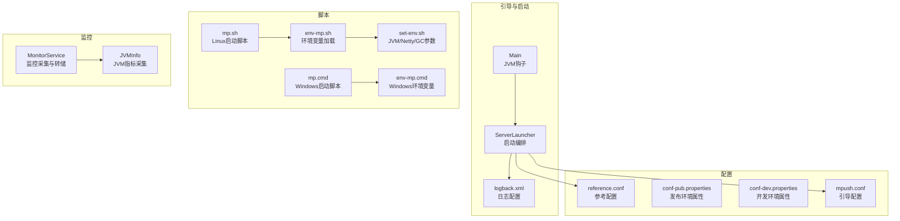
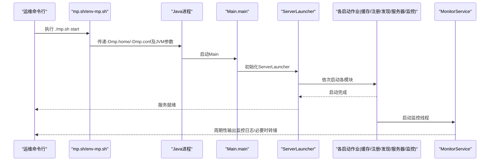
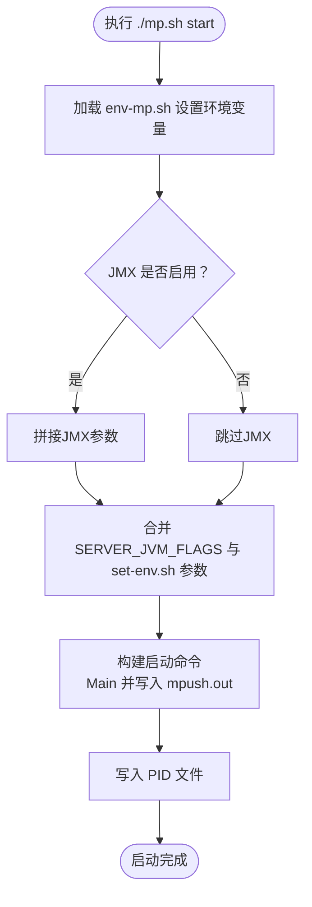
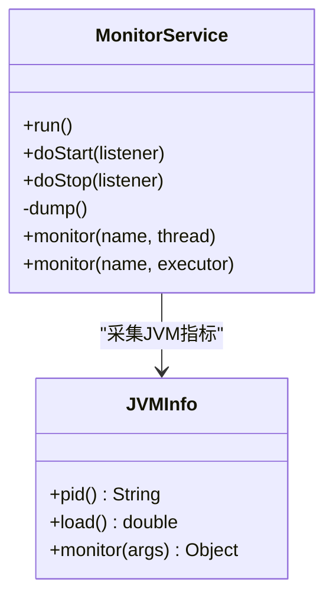
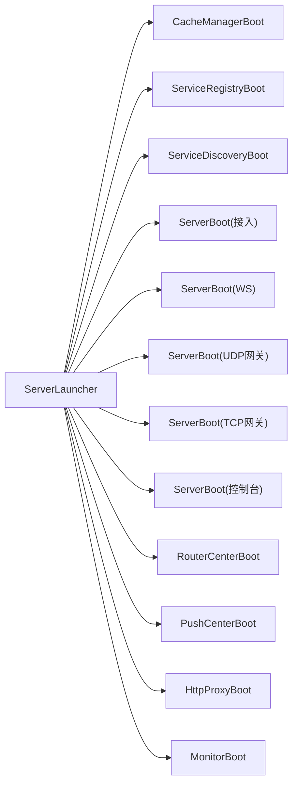

# 部署实践

<cite>
**本文引用的文件**
- [README.md](file://README.md)
- [mp.sh](file://bin/mp.sh)
- [env-mp.sh](file://bin/env-mp.sh)
- [set-env.sh](file://bin/set-env.sh)
- [mp.cmd](file://bin/mp.cmd)
- [env-mp.cmd](file://bin/env-mp.cmd)
- [reference.conf](file://conf/reference.conf)
- [mpush.conf](file://conf/mpush.conf)
- [logback.xml](file://mpush-boot/src/main/resources/logback.xml)
- [Main.java](file://mpush-boot/src/main/java/com/mpush/bootstrap/Main.java)
- [ServerLauncher.java](file://mpush-boot/src/main/java/com/mpush/bootstrap/ServerLauncher.java)
- [MonitorService.java](file://mpush-monitor/src/main/java/com/mpush/monitor/service/MonitorService.java)
- [JVMInfo.java](file://mpush-monitor/src/main/java/com/mpush/monitor/quota/impl/JVMInfo.java)
- [DefaultExecutor.java](file://mpush-tools/src/main/java/com/mpush/tools/thread/pool/DefaultExecutor.java)
- [conf-pub.properties](file://conf/conf-pub.properties)
- [conf-dev.properties](file://conf/conf-dev.properties)
</cite>

## 目录
1. [简介](#简介)
2. [项目结构](#项目结构)
3. [核心组件](#核心组件)
4. [架构总览](#架构总览)
5. [详细组件分析](#详细组件分析)
6. [依赖分析](#依赖分析)
7. [性能考虑](#性能考虑)
8. [故障排查指南](#故障排查指南)
9. [结论](#结论)
10. [附录](#附录)

## 简介
本文件面向生产环境部署MPush，提供从部署前准备（硬件、系统、网络）、容量规划（用户规模、消息量、资源需求）、监控告警（关键指标、规则、通知）、性能调优（JVM、系统、应用参数）、故障预防（健康检查、自动重启、负载均衡），到部署脚本使用与自定义（启动脚本、环境变量、日志管理）的完整实践指南，并结合仓库内的配置与脚本给出可落地的操作路径。

## 项目结构
MPush采用多模块结构，核心启动与配置位于引导模块，网络与协议在netty模块，监控在monitor模块，工具与线程池在tools模块，配置集中在conf目录，启动脚本在bin目录。

**图表来源**
- [ServerLauncher.java](file://mpush-boot/src/main/java/com/mpush/bootstrap/ServerLauncher.java#L42-L71)
- [Main.java](file://mpush-boot/src/main/java/com/mpush/bootstrap/Main.java#L31-L38)
- [logback.xml](file://mpush-boot/src/main/resources/logback.xml#L1-L231)
- [reference.conf](file://conf/reference.conf#L13-L239)
- [mpush.conf](file://conf/mpush.conf#L1-L16)
- [mp.sh](file://bin/mp.sh#L134-L165)
- [env-mp.sh](file://bin/env-mp.sh#L30-L58)
- [set-env.sh](file://bin/set-env.sh#L1-L37)
- [mp.cmd](file://bin/mp.cmd#L28-L28)
- [env-mp.cmd](file://bin/env-mp.cmd#L17-L49)
- [MonitorService.java](file://mpush-monitor/src/main/java/com/mpush/monitor/service/MonitorService.java#L65-L83)
- [JVMInfo.java](file://mpush-monitor/src/main/java/com/mpush/monitor/quota/impl/JVMInfo.java#L52-L56)

**章节来源**
- [README.md](file://README.md#L32-L87)
- [reference.conf](file://conf/reference.conf#L13-L239)
- [mpush.conf](file://conf/mpush.conf#L1-L16)
- [logback.xml](file://mpush-boot/src/main/resources/logback.xml#L1-L231)
- [mp.sh](file://bin/mp.sh#L134-L165)
- [env-mp.sh](file://bin/env-mp.sh#L30-L58)
- [set-env.sh](file://bin/set-env.sh#L1-L37)
- [mp.cmd](file://bin/mp.cmd#L28-L28)
- [env-mp.cmd](file://bin/env-mp.cmd#L17-L49)

## 核心组件
- 引导启动链路：ServerLauncher负责按顺序启动缓存、服务注册发现、接入/网关/控制台、路由中心、推送中心、HTTP代理、监控等模块；Main提供JVM关闭钩子确保优雅停机。
- 配置体系：reference.conf提供全量配置项参考；mpush.conf用于覆盖；logback.xml集中管理日志输出；conf-pub.properties/conf-dev.properties提供不同环境的属性覆盖。
- 监控体系：MonitorService周期采集JVM与线程池指标，按负载阈值触发堆栈/堆转储；JVMInfo提供PID与系统负载等信息。
- 日志体系：logback.xml按模块拆分多个Appender，支持滚动与级别过滤，便于生产定位问题。
- 启动脚本：Linux/macOS使用mp.sh/env-mp.sh，Windows使用mp.cmd/env-mp.cmd；set-env.sh统一注入JVM/Netty/GC参数。

**章节来源**
- [ServerLauncher.java](file://mpush-boot/src/main/java/com/mpush/bootstrap/ServerLauncher.java#L42-L71)
- [Main.java](file://mpush-boot/src/main/java/com/mpush/bootstrap/Main.java#L31-L38)
- [reference.conf](file://conf/reference.conf#L13-L239)
- [mpush.conf](file://conf/mpush.conf#L1-L16)
- [MonitorService.java](file://mpush-monitor/src/main/java/com/mpush/monitor/service/MonitorService.java#L36-L99)
- [JVMInfo.java](file://mpush-monitor/src/main/java/com/mpush/monitor/quota/impl/JVMInfo.java#L31-L67)
- [logback.xml](file://mpush-boot/src/main/resources/logback.xml#L8-L231)
- [mp.sh](file://bin/mp.sh#L134-L165)
- [env-mp.sh](file://bin/env-mp.sh#L30-L58)
- [set-env.sh](file://bin/set-env.sh#L1-L37)
- [mp.cmd](file://bin/mp.cmd#L28-L28)
- [env-mp.cmd](file://bin/env-mp.cmd#L17-L49)

## 架构总览
MPush启动时序如下：

**图表来源**
- [mp.sh](file://bin/mp.sh#L134-L165)
- [env-mp.sh](file://bin/env-mp.sh#L77-L85)
- [Main.java](file://mpush-boot/src/main/java/com/mpush/bootstrap/Main.java#L31-L38)
- [ServerLauncher.java](file://mpush-boot/src/main/java/com/mpush/bootstrap/ServerLauncher.java#L42-L71)
- [MonitorService.java](file://mpush-monitor/src/main/java/com/mpush/monitor/service/MonitorService.java#L65-L83)

## 详细组件分析

### 部署前准备与环境要求
- 硬件与操作系统
  - JDK 1.8+，建议使用长期支持版本；生产建议启用JMX与GC日志。
  - Linux内核建议开启epoll；Netty层面已对epoll bug有规避，但仍建议保持内核与JDK版本稳定。
  - 网络：开放接入端口（默认3000）、网关端口（默认3001）、控制台端口（默认3002），以及WebSocket端口（默认0禁用）。
- 依赖组件
  - Zookeeper：用于服务注册与发现；需配置正确的server-address、命名空间与ACL。
  - Redis：用于消息路由与状态存储；支持单机、集群、哨兵三种模式。
- 网络与DNS
  - 如需HTTP代理与DNS映射，可配置http.dns-mapping与http.proxy-enabled。

**章节来源**
- [README.md](file://README.md#L32-L87)
- [reference.conf](file://conf/reference.conf#L125-L141)
- [reference.conf](file://conf/reference.conf#L143-L169)
- [reference.conf](file://conf/reference.conf#L171-L180)

### 配置文件与覆盖策略
- 参考配置：reference.conf提供全量配置项与注释，涵盖日志、核心、安全、网络、ZK、Redis、HTTP代理、线程池、流控、监控、SPI等。
- 引导配置：mpush.conf用于覆盖reference.conf中的关键项（如端口、ZK/Redis地址、安全密钥、网络绑定IP等）。
- 环境属性：conf-pub.properties/conf-dev.properties分别用于发布/开发环境的属性覆盖（如日志级别、最小心跳、RSA密钥）。

**章节来源**
- [reference.conf](file://conf/reference.conf#L13-L239)
- [mpush.conf](file://conf/mpush.conf#L1-L16)
- [conf-pub.properties](file://conf/conf-pub.properties#L1-L5)
- [conf-dev.properties](file://conf/conf-dev.properties#L1-L5)

### 启动脚本与环境变量
- Linux/macOS
  - mp.sh负责JMX开关、PID文件、日志输出、启动/停止/重启/status/print-cmd等命令。
  - env-mp.sh负责MPUSH_HOME、MP_CFG_DIR、MP_LOG_DIR、CLASSPATH、JAVA等环境变量。
  - set-env.sh统一注入Netty泄漏检测、JMX、远程调试、GC参数等。
- Windows
  - mp.cmd/env-mp.cmd提供Windows环境下的启动与环境变量设置。

**图表来源**
- [mp.sh](file://bin/mp.sh#L46-L84)
- [env-mp.sh](file://bin/env-mp.sh#L70-L85)
- [set-env.sh](file://bin/set-env.sh#L19-L37)

**章节来源**
- [mp.sh](file://bin/mp.sh#L134-L165)
- [env-mp.sh](file://bin/env-mp.sh#L30-L58)
- [set-env.sh](file://bin/set-env.sh#L1-L37)
- [mp.cmd](file://bin/mp.cmd#L28-L28)
- [env-mp.cmd](file://bin/env-mp.cmd#L17-L49)

### 监控与告警
- 监控采集
  - MonitorService周期采集JVM与线程池指标，按配置周期输出监控日志；当系统负载超过阈值时触发堆栈/堆转储。
  - JVMInfo提供PID、系统负载平均值、堆内存使用情况等。
- 关键指标
  - 系统负载、堆内存使用、线程池队列长度、连接数、推送QPS等。
- 告警规则建议
  - CPU负载持续高于阈值、GC频繁或暂停时间过长、线程池排队积压、连接断开率上升、推送失败率升高。
- 通知机制
  - 建议结合系统日志收集（如logback滚动文件）与外部监控平台（Prometheus/Grafana/PagerDuty）实现告警联动。

**图表来源**
- [MonitorService.java](file://mpush-monitor/src/main/java/com/mpush/monitor/service/MonitorService.java#L36-L99)
- [MonitorService.java](file://mpush-monitor/src/main/java/com/mpush/monitor/service/MonitorService.java#L101-L130)
- [JVMInfo.java](file://mpush-monitor/src/main/java/com/mpush/monitor/quota/impl/JVMInfo.java#L31-L67)

**章节来源**
- [MonitorService.java](file://mpush-monitor/src/main/java/com/mpush/monitor/service/MonitorService.java#L36-L99)
- [MonitorService.java](file://mpush-monitor/src/main/java/com/mpush/monitor/service/MonitorService.java#L101-L130)
- [JVMInfo.java](file://mpush-monitor/src/main/java/com/mpush/monitor/quota/impl/JVMInfo.java#L31-L67)

### 性能调优
- JVM参数
  - 建议开启JMX与GC日志，使用G1GC并设置目标暂停时间；OOM时生成堆转储并自动重启（参考set-env.sh中的示例注释）。
- Netty参数
  - 启用内存泄漏检测（advanced级别）；合理设置selector自动重建阈值；根据业务选择是否禁用selectedKeys优化。
- 应用参数
  - 线程池大小：conn-work、gateway-server-work、push-task等按CPU核数与业务并发调优；线程池队列长度与拒绝策略需结合压测结果。
  - 流控：全局与广播流控的limit/duration需结合峰值QPS设定。
  - 网络缓冲区与水位：根据带宽与延迟调优snd_buf/rcv_buf与write-buffer-water-mark。
  - 心跳与会话：min/max-heartbeat与session-expired-time需平衡网络抖动与重连成本。

**章节来源**
- [set-env.sh](file://bin/set-env.sh#L19-L37)
- [reference.conf](file://conf/reference.conf#L18-L31)
- [reference.conf](file://conf/reference.conf#L182-L205)
- [reference.conf](file://conf/reference.conf#L207-L222)
- [reference.conf](file://conf/reference.conf#L76-L93)
- [reference.conf](file://conf/reference.conf#L114-L122)

### 故障预防
- 健康检查
  - 控制台端口（默认3002）可用于简单telnet探测；建议在LB/探针中增加更细粒度的健康检查接口。
- 自动重启
  - mp.sh在停止超时后会打印线程堆栈并强制终止；建议结合系统服务管理器（如systemd）实现自动拉起。
- 负载均衡
  - 多实例部署时，通过ZK注册的服务节点可被调度器发现；确保ZK连接稳定与网络互通。
- 优雅停机
  - Main中注册了JVM关闭钩子，确保服务优雅退出；生产建议配合进程管理器的软杀信号。

**章节来源**
- [mp.sh](file://bin/mp.sh#L176-L214)
- [Main.java](file://mpush-boot/src/main/java/com/mpush/bootstrap/Main.java#L49-L62)
- [reference.conf](file://conf/reference.conf#L125-L141)

### 部署脚本使用与自定义
- Linux/macOS
  - 使用mp.sh提供的start/stop/restart/status/print-cmd命令；通过set-env.sh自定义JVM/Netty/GC参数；通过env-mp.sh统一加载环境变量。
- Windows
  - 使用mp.cmd/env-mp.cmd在Windows环境下启动与配置。
- 日志管理
  - logback.xml按模块拆分日志文件，支持按日期滚动与历史保留；可通过log-level与log.home参数调整。

**章节来源**
- [mp.sh](file://bin/mp.sh#L134-L165)
- [env-mp.sh](file://bin/env-mp.sh#L30-L58)
- [set-env.sh](file://bin/set-env.sh#L1-L37)
- [mp.cmd](file://bin/mp.cmd#L28-L28)
- [env-mp.cmd](file://bin/env-mp.cmd#L17-L49)
- [logback.xml](file://mpush-boot/src/main/resources/logback.xml#L8-L231)

### 容量规划方法与工具
- 用户规模估算
  - 基于峰值在线用户数、设备分布、活跃度模型估算并发连接数与消息发送频率。
- 消息量预测
  - 单用户日均消息量 × 在线用户比例 × 峰值放大系数；区分广播与单播消息占比。
- 资源需求计算
  - CPU：每连接约占用的线程与CPU周期，结合线程池大小与任务复杂度估算。
  - 内存：堆内存（含GC代大小）、直接内存（Netty缓冲区）、Redis内存占用。
  - 网络：带宽与连接数决定出口带宽与连接上限；结合snd/rcv_buf与write-buffer-water-mark调优。
- 工具与手段
  - 压测工具（如JMeter/Locust）模拟峰值流量；结合监控指标（QPS、RT、错误率、线程池排队、GC）评估资源边界。
  - 参考配置中的线程池与流控参数作为起点，逐步逼近真实负载。

**章节来源**
- [reference.conf](file://conf/reference.conf#L182-L205)
- [reference.conf](file://conf/reference.conf#L207-L222)
- [reference.conf](file://conf/reference.conf#L76-L93)
- [reference.conf](file://conf/reference.conf#L114-L122)

## 依赖分析
MPush启动链路依赖清晰，模块间通过ServerLauncher编排，监控模块独立运行并采集JVM与线程池指标。

**图表来源**
- [ServerLauncher.java](file://mpush-boot/src/main/java/com/mpush/bootstrap/ServerLauncher.java#L57-L70)

**章节来源**
- [ServerLauncher.java](file://mpush-boot/src/main/java/com/mpush/bootstrap/ServerLauncher.java#L42-L71)

## 性能考虑
- 线程池与任务调度
  - DefaultExecutor为线程池实现基类，建议结合业务特征（CPU密集/IO密集）选择合适的线程数与队列长度。
- 网络与缓冲区
  - 根据带宽与延迟调整snd_buf/rcv_buf与write-buffer-water-mark，避免频繁背压与丢包。
- 监控与剖析
  - 启用MonitorService周期采集与阈值转储，结合GC日志与JMX定位热点问题。

**章节来源**
- [DefaultExecutor.java](file://mpush-tools/src/main/java/com/mpush/tools/thread/pool/DefaultExecutor.java#L28-L36)
- [reference.conf](file://conf/reference.conf#L76-L93)
- [MonitorService.java](file://mpush-monitor/src/main/java/com/mpush/monitor/service/MonitorService.java#L65-L83)
- [set-env.sh](file://bin/set-env.sh#L30-L37)

## 故障排查指南
- 启动失败
  - 检查mpush.out输出与PID文件是否存在；确认JVM参数、CLASSPATH与JAVA_HOME。
- 连接异常
  - 核对接入/网关/控制台端口是否被占用；检查bind-ip与register-ip配置。
- 性能问题
  - 观察监控日志与堆转储；结合线程池队列长度与GC日志定位瓶颈。
- 停止无响应
  - mp.sh在超时后会打印线程堆栈并强制终止；建议结合系统服务管理器实现可靠重启。

**章节来源**
- [mp.sh](file://bin/mp.sh#L134-L165)
- [mp.sh](file://bin/mp.sh#L176-L214)
- [MonitorService.java](file://mpush-monitor/src/main/java/com/mpush/monitor/service/MonitorService.java#L101-L130)

## 结论
通过规范的部署前准备、完善的配置覆盖策略、系统化的监控告警、针对性的性能调优与可靠的故障预防机制，MPush可在生产环境中实现高可用与高性能的消息推送服务。建议以仓库中的配置与脚本为基础，结合自身业务规模与资源现状进行迭代优化。

## 附录
- 快速对照清单
  - JDK版本与JMX/GC参数：参考set-env.sh
  - 端口与网络绑定：参考reference.conf与mpush.conf
  - 日志级别与输出：参考logback.xml与conf-pub.properties/conf-dev.properties
  - 启停命令与PID：参考mp.sh与env-mp.sh
  - Windows启动：参考mp.cmd与env-mp.cmd