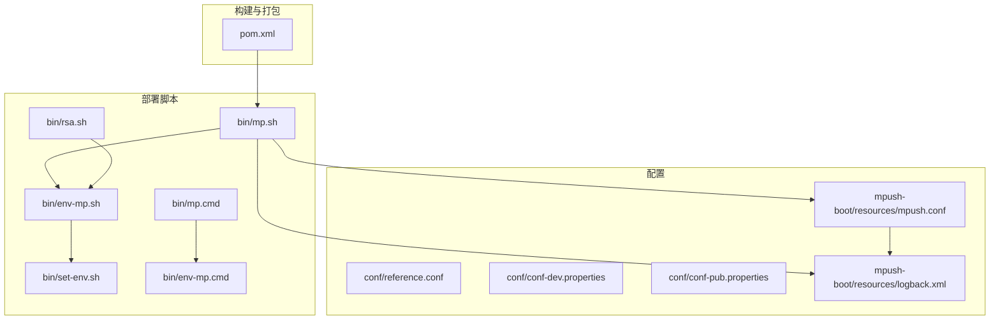
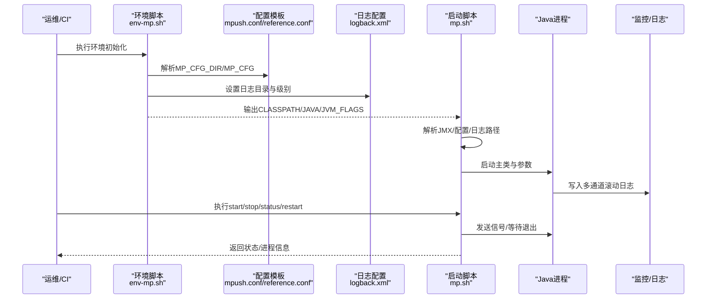
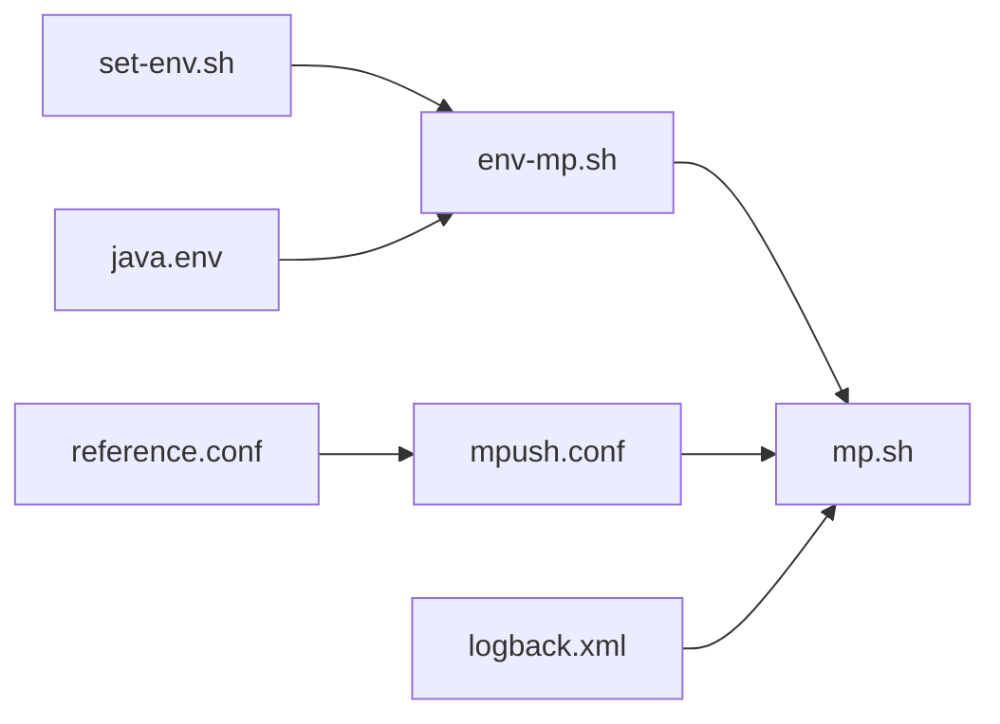

# 部署自动化

<cite>
**本文引用的文件**
- [bin/mp.sh](file://bin/mp.sh)
- [bin/env-mp.sh](file://bin/env-mp.sh)
- [bin/set-env.sh](file://bin/set-env.sh)
- [bin/rsa.sh](file://bin/rsa.sh)
- [bin/env-mp.cmd](file://bin/env-mp.cmd)
- [bin/mp.cmd](file://bin/mp.cmd)
- [conf/reference.conf](file://conf/reference.conf)
- [conf/conf-dev.properties](file://conf/conf-dev.properties)
- [conf/conf-pub.properties](file://conf/conf-pub.properties)
- [mpush-boot/src/main/resources/mpush.conf](file://mpush-boot/src/main/resources/mpush.conf)
- [mpush-boot/src/main/resources/logback.xml](file://mpush-boot/src/main/resources/logback.xml)
- [pom.xml](file://pom.xml)
</cite>

## 目录
1. [简介](#简介)
2. [项目结构](#项目结构)
3. [核心组件](#核心组件)
4. [架构总览](#架构总览)
5. [详细组件分析](#详细组件分析)
6. [依赖分析](#依赖分析)
7. [性能考虑](#性能考虑)
8. [故障排查指南](#故障排查指南)
9. [结论](#结论)
10. [附录](#附录)

## 简介
本文件面向MPush部署自动化，围绕启动与环境脚本、配置体系、日志与进程控制、容器化与CI/CD、配置管理与热更新、多环境策略及回滚保障等方面，提供从入门到进阶的完整部署自动化指导。读者无需深入源码即可完成标准化部署与运维。

## 项目结构
MPush采用多模块Maven工程，部署自动化主要涉及以下目录与文件：
- bin：启动与环境脚本（Linux/macOS/Windows）
- conf：系统参考配置与环境属性模板
- mpush-boot/resources：运行期配置模板与日志配置
- 根POM：统一版本与打包装配

图表来源
- [bin/mp.sh](file://bin/mp.sh#L1-L242)
- [bin/env-mp.sh](file://bin/env-mp.sh#L1-L103)
- [bin/set-env.sh](file://bin/set-env.sh#L1-L37)
- [bin/rsa.sh](file://bin/rsa.sh#L1-L37)
- [bin/env-mp.cmd](file://bin/env-mp.cmd#L1-L50)
- [bin/mp.cmd](file://bin/mp.cmd#L1-L33)
- [conf/reference.conf](file://conf/reference.conf#L1-L239)
- [conf/conf-dev.properties](file://conf/conf-dev.properties#L1-L5)
- [conf/conf-pub.properties](file://conf/conf-pub.properties#L1-L5)
- [mpush-boot/src/main/resources/mpush.conf](file://mpush-boot/src/main/resources/mpush.conf#L1-L16)
- [mpush-boot/src/main/resources/logback.xml](file://mpush-boot/src/main/resources/logback.xml#L1-L231)
- [pom.xml](file://pom.xml#L1-L200)

章节来源
- [bin/mp.sh](file://bin/mp.sh#L1-L242)
- [bin/env-mp.sh](file://bin/env-mp.sh#L1-L103)
- [conf/reference.conf](file://conf/reference.conf#L1-L239)
- [pom.xml](file://pom.xml#L1-L200)

## 核心组件
- 启动脚本与进程控制：bin/mp.sh负责JVM参数拼装、配置路径解析、PID文件管理、前台/后台启动、优雅停止与强制停止、状态查询、升级入口等。
- 环境脚本：bin/env-mp.sh负责MPUSH_HOME、MP_CFG_DIR、MP_DATA_DIR、MP_LOG_DIR、CLASSPATH、JMX与JVM_FLAGS默认值设定；bin/set-env.sh提供Netty/JVM/GC等可选调优项。
- 配置体系：conf/reference.conf提供全量配置项与注释；mpush-boot/resources/mpush.conf作为运行期模板；conf-dev/publish属性文件用于快速切换日志级别与心跳等。
- 日志体系：logback.xml按环境变量输出到mp.home/logs，支持多通道滚动日志。
- Windows脚本：bin/env-mp.cmd与bin/mp.cmd提供Windows环境下的最小化启动能力。

章节来源
- [bin/mp.sh](file://bin/mp.sh#L133-L242)
- [bin/env-mp.sh](file://bin/env-mp.sh#L26-L103)
- [bin/set-env.sh](file://bin/set-env.sh#L1-L37)
- [conf/reference.conf](file://conf/reference.conf#L1-L239)
- [mpush-boot/src/main/resources/mpush.conf](file://mpush-boot/src/main/resources/mpush.conf#L1-L16)
- [conf/conf-dev.properties](file://conf/conf-dev.properties#L1-L5)
- [conf/conf-pub.properties](file://conf/conf-pub.properties#L1-L5)
- [mpush-boot/src/main/resources/logback.xml](file://mpush-boot/src/main/resources/logback.xml#L1-L231)
- [bin/env-mp.cmd](file://bin/env-mp.cmd#L1-L50)
- [bin/mp.cmd](file://bin/mp.cmd#L1-L33)

## 架构总览
下图展示部署自动化关键流程：环境初始化、配置加载、JVM启动、进程生命周期管理与日志输出。

图表来源
- [bin/env-mp.sh](file://bin/env-mp.sh#L26-L103)
- [bin/mp.sh](file://bin/mp.sh#L31-L106)
- [mpush-boot/src/main/resources/mpush.conf](file://mpush-boot/src/main/resources/mpush.conf#L1-L16)
- [conf/reference.conf](file://conf/reference.conf#L1-L239)
- [mpush-boot/src/main/resources/logback.xml](file://mpush-boot/src/main/resources/logback.xml#L1-L231)

## 详细组件分析

### 启动脚本 mp.sh 使用与参数
- 功能概览
  - 环境加载：优先加载libexec/env-mp.sh，否则回退到同级env-mp.sh。
  - JMX控制：JMXLOCALONLY、JMXPORT、JMXAUTH、JMXSSL、JMXLOG4J等控制远程JMX开关与参数。
  - JVM参数：SERVER_JVM_FLAGS可叠加自定义JVM参数；MP_CFG可指定配置文件名或绝对路径。
  - PID与日志：自动创建MP_DATA_DIR与MP_LOG_DIR；PID写入MP_DATA_DIR/mpush_server.pid；标准输出重定向至MP_LOG_DIR/mpush.out。
  - 进程控制：start/stop/start-foreground/restart/status/upgrade/print-cmd。
  - 停止策略：先发送TERM等待优雅退出，超时后打印堆栈并强制SIGKILL。
  - 状态查询：解析配置中的clientPortAddress与connect-server-port，使用telnet探测。
- 关键行为定位
  - 环境加载与JMX分支：[bin/mp.sh](file://bin/mp.sh#L31-L77)
  - 配置解析与PID/日志路径：[bin/mp.sh](file://bin/mp.sh#L86-L129)
  - 进程控制分支：[bin/mp.sh](file://bin/mp.sh#L133-L242)

章节来源
- [bin/mp.sh](file://bin/mp.sh#L31-L129)
- [bin/mp.sh](file://bin/mp.sh#L133-L242)

### 环境配置脚本 env-mp.sh 与 set-env.sh
- env-mp.sh职责
  - 设定MPUSH_HOME、MP_CFG_DIR、MP_DATA_DIR、MP_LOG_DIR默认值。
  - 读取bin/set-env.sh与bin/java.env进行JVM与JMX默认值注入。
  - 构造CLASSPATH：包含conf目录、bootstrap.jar以及lib/lib/plugins下的JAR。
  - 平台兼容：Cygwin路径转换。
- set-env.sh可选调优
  - Netty相关：内存泄漏检测等级、Selector重建阈值、KeySet优化等。
  - JMX：默认关闭，可通过JMXPORT等参数开启远程JMX。
  - 调试：可启用远程调试参数。
  - GC：示例参数（注释）展示了G1GC、GC日志与OOM处理策略。
- 关键行为定位
  - 默认目录与CLASSPATH构造：[bin/env-mp.sh](file://bin/env-mp.sh#L26-L92)
  - 平台与路径处理：[bin/env-mp.sh](file://bin/env-mp.sh#L94-L103)
  - Netty/JMX/GC示例：[bin/set-env.sh](file://bin/set-env.sh#L1-L37)

章节来源
- [bin/env-mp.sh](file://bin/env-mp.sh#L26-L103)
- [bin/set-env.sh](file://bin/set-env.sh#L1-L37)

### 配置体系与模板
- reference.conf：系统全量配置项与注释，涵盖日志、核心、安全、网络、ZK、Redis、HTTP代理、线程池、流控、监控与SPI扩展等。
- mpush.conf（运行模板）：将环境变量与密钥注入到运行配置，如日志级别、最小心跳、RSA密钥、ZK/Redis节点、网络端口等。
- 环境属性文件：conf-dev.properties与conf-pub.properties分别用于开发与发布环境的日志级别、心跳与RSA密钥模板。
- 日志配置：logback.xml按mp.home/logs输出多通道日志，支持按级别滚动与历史保留。
- 关键行为定位
  - 全量配置项与注释：[conf/reference.conf](file://conf/reference.conf#L1-L239)
  - 运行期模板注入：[mpush-boot/src/main/resources/mpush.conf](file://mpush-boot/src/main/resources/mpush.conf#L1-L16)
  - 环境属性模板：[conf/conf-dev.properties](file://conf/conf-dev.properties#L1-L5), [conf/conf-pub.properties](file://conf/conf-pub.properties#L1-L5)
  - 日志配置：[mpush-boot/src/main/resources/logback.xml](file://mpush-boot/src/main/resources/logback.xml#L1-L231)

章节来源
- [conf/reference.conf](file://conf/reference.conf#L1-L239)
- [mpush-boot/src/main/resources/mpush.conf](file://mpush-boot/src/main/resources/mpush.conf#L1-L16)
- [conf/conf-dev.properties](file://conf/conf-dev.properties#L1-L5)
- [conf/conf-pub.properties](file://conf/conf-pub.properties#L1-L5)
- [mpush-boot/src/main/resources/logback.xml](file://mpush-boot/src/main/resources/logback.xml#L1-L231)

### 日志管理与进程控制
- 日志管理
  - 日志根目录与级别：由mp.home与log.root.level决定；logback.xml按级别输出到不同文件。
  - 多通道日志：应用日志、info、debug、监控、连接、推送、心跳、缓存、HTTP、服务发现、性能剖析等。
- 进程控制
  - 启停策略：start/stop/start-foreground/restart/status/upgrade/print-cmd。
  - 停止等待与强制终止：超时后打印堆栈并强制SIGKILL。
  - 状态查询：解析配置中的监听地址与端口，使用telnet探测。
- 关键行为定位
  - 日志通道与滚动策略：[mpush-boot/src/main/resources/logback.xml](file://mpush-boot/src/main/resources/logback.xml#L8-L231)
  - 进程控制与状态查询：[bin/mp.sh](file://bin/mp.sh#L133-L242)

章节来源
- [mpush-boot/src/main/resources/logback.xml](file://mpush-boot/src/main/resources/logback.xml#L1-L231)
- [bin/mp.sh](file://bin/mp.sh#L133-L242)

### 容器化部署方案与实践
- Docker镜像构建
  - 基础镜像：建议基于OpenJDK 8官方镜像，确保与项目Java版本一致。
  - 工件准备：通过Maven构建产物（含依赖与插件），将目标产物复制至镜像内对应目录（conf、logs、lib、lib/plugins、bootstrap.jar等）。
  - 启动命令：使用bin/mp.sh作为入口，或直接java -Dmp.home=/opt/mpush -Dmp.conf=/opt/mpush/conf/mpush.conf -cp "...:bootstrap.jar" com.mpush.bootstrap.Main。
- 容器编排与服务编排
  - 单实例：挂载conf与logs目录，暴露必要端口（3000/3001/3002/4000等），并配置ZK/Redis连接参数。
  - 多实例：通过服务发现（ZK）与负载均衡（Nginx/SLB）实现横向扩展。
- 配置管理
  - 使用卷挂载或环境变量注入运行配置（如ZK/Redis地址、端口、密钥）。
  - 使用环境属性文件模板（conf-dev.properties/conf-pub.properties）配合Kubernetes ConfigMap/Secret进行注入。
- 关键行为定位
  - 启动入口与参数：[bin/mp.sh](file://bin/mp.sh#L79-L106)
  - 运行模板与密钥注入：[mpush-boot/src/main/resources/mpush.conf](file://mpush-boot/src/main/resources/mpush.conf#L1-L16)
  - 参考配置项：[conf/reference.conf](file://conf/reference.conf#L1-L239)

章节来源
- [bin/mp.sh](file://bin/mp.sh#L79-L106)
- [mpush-boot/src/main/resources/mpush.conf](file://mpush-boot/src/main/resources/mpush.conf#L1-L16)
- [conf/reference.conf](file://conf/reference.conf#L1-L239)

### CI/CD流水线配置与实施
- 自动化构建
  - Maven构建：执行mvn clean package，生成包含依赖的可执行工件。
  - 产物归档：将conf、logs、lib、lib/plugins、bootstrap.jar等打包为部署包。
- 自动化测试
  - 单元测试与集成测试：在CI中执行测试阶段，确保关键路径可用。
- 自动化部署
  - 选择部署方式：脚本部署（bin/mp.sh）或容器部署（Docker + 编排）。
  - 部署前校验：检查JDK版本、配置文件完整性、ZK/Redis可达性。
  - 优雅重启：使用restart或先stop再start，结合status确认。
- 自动化回滚
  - 回滚策略：保存上次成功版本工件，失败时恢复；或使用蓝绿/金丝雀发布。
  - 信号与超时：利用stop的优雅退出与强制终止机制，避免长时间阻塞。
- 关键行为定位
  - 进程控制与优雅停止：[bin/mp.sh](file://bin/mp.sh#L176-L216)

章节来源
- [bin/mp.sh](file://bin/mp.sh#L176-L216)

### 配置管理自动化（模板、注入、热更新、版本管理）
- 配置模板
  - 使用conf/reference.conf作为模板，mpush-boot/resources/mpush.conf作为运行期模板。
- 配置注入
  - 环境变量注入：log.level、min.hb、rsa.privateKey/publicKey等。
  - 属性文件：conf-dev.properties/conf-pub.properties用于快速切换日志级别与心跳。
- 配置热更新
  - 当前仓库未提供运行时热更新机制；建议通过外部配置中心（如ZK/Consul）与SPI扩展实现。
- 配置版本管理
  - 使用Git管理conf与mpush.conf变更，结合CI进行审批与发布。
- 关键行为定位
  - 运行模板注入：[mpush-boot/src/main/resources/mpush.conf](file://mpush-boot/src/main/resources/mpush.conf#L1-L16)
  - 环境属性模板：[conf/conf-dev.properties](file://conf/conf-dev.properties#L1-L5), [conf/conf-pub.properties](file://conf/conf-pub.properties#L1-L5)

章节来源
- [mpush-boot/src/main/resources/mpush.conf](file://mpush-boot/src/main/resources/mpush.conf#L1-L16)
- [conf/conf-dev.properties](file://conf/conf-dev.properties#L1-L5)
- [conf/conf-pub.properties](file://conf/conf-pub.properties#L1-L5)

### 部署监控与回滚机制
- 部署状态监控
  - 使用status命令解析配置端口并探测；结合日志通道（如monitor-mpush.log）观察系统状态。
- 部署质量检查
  - 启动后检查PID文件与日志输出；确认关键服务端口（3000/3001/3002/4000）可达。
- 自动回滚
  - 通过CI/CD在失败时触发回滚脚本或容器回滚策略。
- 人工干预
  - 强制停止：stop超时后自动打印堆栈并强制SIGKILL；必要时手动介入。
- 关键行为定位
  - 状态查询与停止策略：[bin/mp.sh](file://bin/mp.sh#L229-L242), [bin/mp.sh](file://bin/mp.sh#L176-L216)

章节来源
- [bin/mp.sh](file://bin/mp.sh#L176-L242)

### 多环境部署策略
- 开发环境（conf-dev.properties）
  - 日志级别：debug；最小心跳：较短；RSA密钥模板。
- 测试/预生产/生产（conf-pub.properties）
  - 日志级别：warn；最小心跳：较长；RSA密钥模板。
- 配置差异
  - 通过mpush-boot/resources/mpush.conf注入不同环境的log.level与min.hb。
  - 网络端口、ZK/Redis地址、WS开关等在reference.conf中集中管理。
- 关键行为定位
  - 环境属性模板：[conf/conf-dev.properties](file://conf/conf-dev.properties#L1-L5), [conf/conf-pub.properties](file://conf/conf-pub.properties#L1-L5)
  - 运行模板注入：[mpush-boot/src/main/resources/mpush.conf](file://mpush-boot/src/main/resources/mpush.conf#L1-L16)
  - 参考配置项：[conf/reference.conf](file://conf/reference.conf#L1-L239)

章节来源
- [conf/conf-dev.properties](file://conf/conf-dev.properties#L1-L5)
- [conf/conf-pub.properties](file://conf/conf-pub.properties#L1-L5)
- [mpush-boot/src/main/resources/mpush.conf](file://mpush-boot/src/main/resources/mpush.conf#L1-L16)
- [conf/reference.conf](file://conf/reference.conf#L1-L239)

## 依赖分析
- 组件耦合
  - bin/mp.sh依赖bin/env-mp.sh提供的环境变量与CLASSPATH。
  - bin/env-mp.sh依赖bin/set-env.sh与bin/java.env进行JVM/JMX默认值注入。
  - mpush-boot/resources/mpush.conf依赖conf/reference.conf的配置项与注释。
  - 日志输出依赖mpush-boot/src/main/resources/logback.xml的多通道配置。
- 外部依赖
  - Java 8；Netty生态；Zookeeper与Redis（由配置决定）。
- 关键行为定位
  - 环境脚本依赖链：[bin/env-mp.sh](file://bin/env-mp.sh#L49-L63)
  - 启动脚本依赖链：[bin/mp.sh](file://bin/mp.sh#L31-L35)
  - 配置模板依赖：[mpush-boot/src/main/resources/mpush.conf](file://mpush-boot/src/main/resources/mpush.conf#L1-L16)

图表来源
- [bin/env-mp.sh](file://bin/env-mp.sh#L49-L63)
- [bin/mp.sh](file://bin/mp.sh#L31-L35)
- [mpush-boot/src/main/resources/mpush.conf](file://mpush-boot/src/main/resources/mpush.conf#L1-L16)
- [conf/reference.conf](file://conf/reference.conf#L1-L239)
- [mpush-boot/src/main/resources/logback.xml](file://mpush-boot/src/main/resources/logback.xml#L1-L231)

章节来源
- [bin/env-mp.sh](file://bin/env-mp.sh#L49-L63)
- [bin/mp.sh](file://bin/mp.sh#L31-L35)
- [mpush-boot/src/main/resources/mpush.conf](file://mpush-boot/src/main/resources/mpush.conf#L1-L16)
- [conf/reference.conf](file://conf/reference.conf#L1-L239)
- [mpush-boot/src/main/resources/logback.xml](file://mpush-boot/src/main/resources/logback.xml#L1-L231)

## 性能考虑
- Netty优化
  - 内存泄漏检测等级可按环境调整；Selector自动重建阈值可根据平台特性微调。
- JVM与GC
  - 可通过set-env.sh示例参数启用G1GC、GC日志与OOM处理，结合容器资源限制进行调优。
- 线程池与流控
  - 参考reference.conf中的线程池与流控配置，结合业务峰值进行压测与调参。
- 日志级别
  - 生产环境建议使用warn级别，降低I/O开销；开发环境使用debug级别便于诊断。

[本节为通用指导，无需具体文件分析]

## 故障排查指南
- 启动失败
  - 检查JAVA_HOME与CLASSPATH；确认MP_CFG与MP_CFG_DIR指向正确配置。
  - 查看MP_LOG_DIR/mpush.out与各通道日志。
- 无法停止
  - 使用stop命令；若超时，关注堆栈输出并确认进程是否存在。
- 端口占用
  - 通过status解析配置端口并使用netstat/telnet检查占用情况。
- 密钥问题
  - 使用bin/rsa.sh生成RSA密钥对，或将生成的密钥填入运行配置。
- 关键行为定位
  - 启停与状态：[bin/mp.sh](file://bin/mp.sh#L133-L242)
  - 日志输出：[mpush-boot/src/main/resources/logback.xml](file://mpush-boot/src/main/resources/logback.xml#L1-L231)
  - RSA生成：[bin/rsa.sh](file://bin/rsa.sh#L1-L37)

章节来源
- [bin/mp.sh](file://bin/mp.sh#L133-L242)
- [mpush-boot/src/main/resources/logback.xml](file://mpush-boot/src/main/resources/logback.xml#L1-L231)
- [bin/rsa.sh](file://bin/rsa.sh#L1-L37)

## 结论
通过bin/env-mp.sh与bin/mp.sh的标准化环境与进程控制、conf/reference.conf与mpush-boot/resources/mpush.conf的清晰配置模板、以及logback.xml的多通道日志体系，MPush实现了可复用、可扩展、可观测的部署自动化基线。结合容器化与CI/CD流水线，可进一步提升交付效率与稳定性。

[本节为总结，无需具体文件分析]

## 附录
- Windows部署
  - 使用bin/env-mp.cmd与bin/mp.cmd进行最小化启动；建议在Windows容器或WSL中进行一致性验证。
- 密钥生成
  - 使用bin/rsa.sh生成RSA密钥对，按需替换运行配置中的密钥字段。
- 构建与打包
  - 依据根POM进行Maven构建，确保依赖与插件齐全。

章节来源
- [bin/env-mp.cmd](file://bin/env-mp.cmd#L1-L50)
- [bin/mp.cmd](file://bin/mp.cmd#L1-L33)
- [bin/rsa.sh](file://bin/rsa.sh#L1-L37)
- [pom.xml](file://pom.xml#L1-L200)