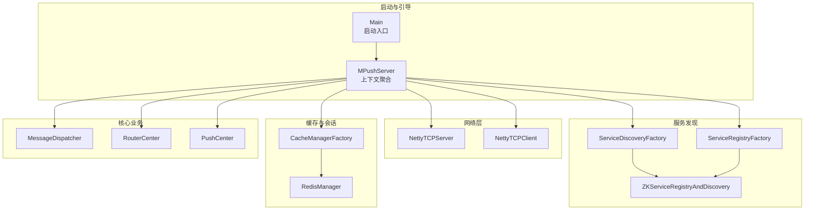
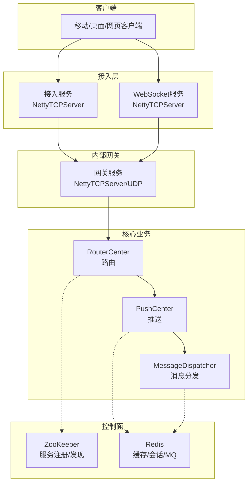
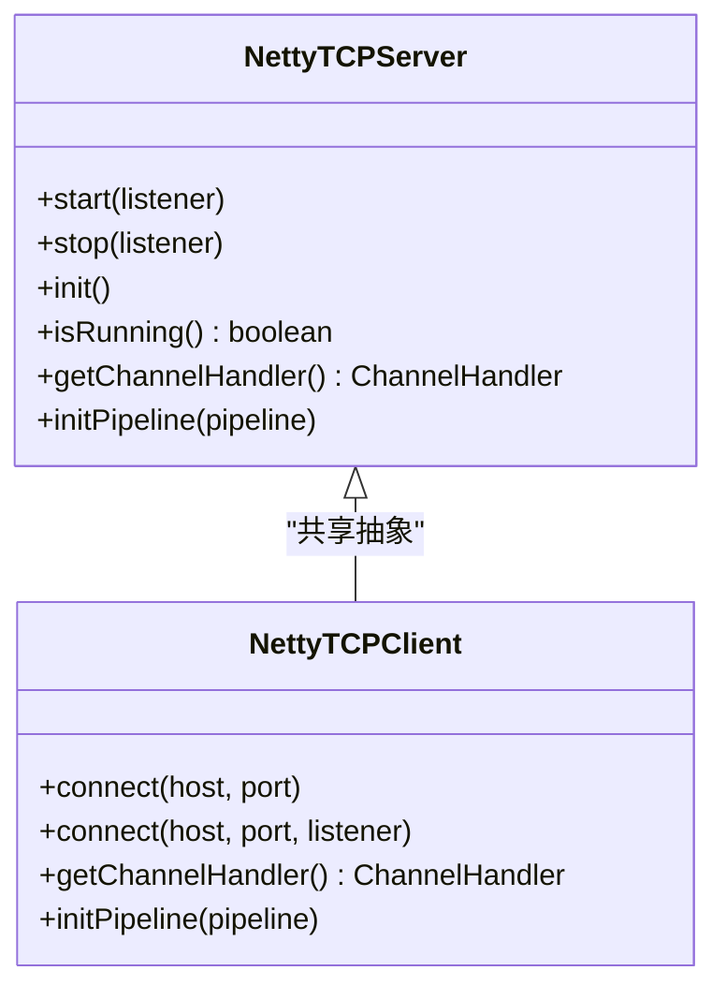
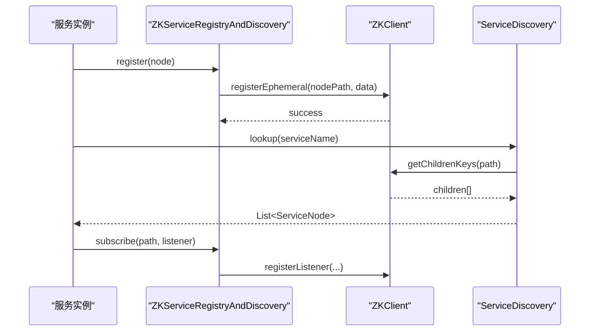
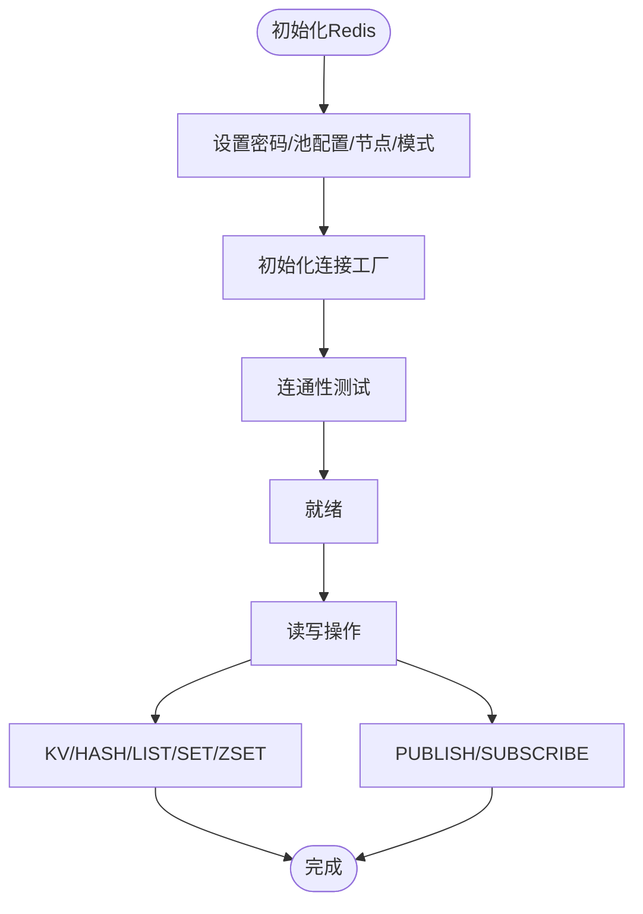
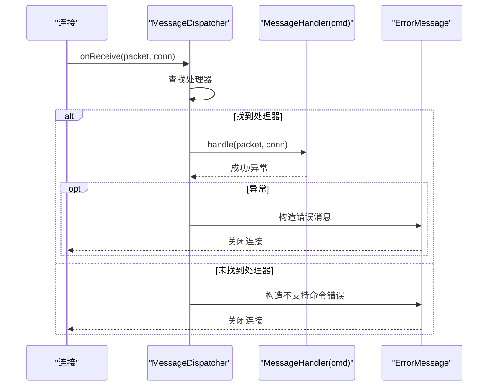
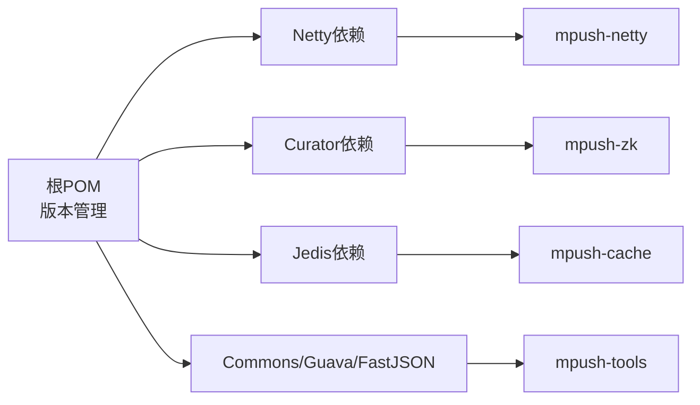

# 技术选型与决策

<cite>
**本文引用的文件**
- [根POM](file://pom.xml)
- [API模块POM](file://mpush-api/pom.xml)
- [Netty模块POM](file://mpush-netty/pom.xml)
- [缓存模块POM](file://mpush-cache/pom.xml)
- [ZooKeeper模块POM](file://mpush-zk/pom.xml)
- [MPush服务端主类](file://mpush-boot/src/main/java/com/mpush/bootstrap/Main.java)
- [MPushServer上下文](file://mpush-core/src/main/java/com/mpush/core/MPushServer.java)
- [Netty TCP服务器](file://mpush-netty/src/main/java/com/mpush/netty/server/NettyTCPServer.java)
- [Netty TCP客户端](file://mpush-netty/src/main/java/com/mpush/netty/client/NettyTCPClient.java)
- [消息分发器](file://mpush-common/src/main/java/com/mpush/common/MessageDispatcher.java)
- [线程池执行器](file://mpush-tools/src/main/java/com/mpush/tools/thread/pool/DefaultExecutor.java)
- [Redis缓存管理器](file://mpush-cache/src/main/java/com/mpush/cache/redis/manager/RedisManager.java)
- [Redis缓存工厂](file://mpush-cache/src/main/java/com/mpush/cache/redis/manager/RedisCacheManagerFactory.java)
- [ZooKeeper服务注册与发现](file://mpush-zk/src/main/java/com/mpush/zk/ZKServiceRegistryAndDiscovery.java)
- [服务发现工厂](file://mpush-api/src/main/java/com/mpush/api/spi/common/ServiceDiscoveryFactory.java)
- [服务注册工厂](file://mpush-api/src/main/java/com/mpush/api/spi/common/ServiceRegistryFactory.java)
- [README部署与配置](file://README.md)
</cite>

## 目录
1. [引言](#引言)
2. [项目结构](#项目结构)
3. [核心组件](#核心组件)
4. [架构总览](#架构总览)
5. [详细组件分析](#详细组件分析)
6. [依赖分析](#依赖分析)
7. [性能考量](#性能考量)
8. [故障排查指南](#故障排查指南)
9. [结论](#结论)
10. [附录](#附录)

## 引言
本文件面向MPush项目的架构师与开发者，系统化阐述项目的关键技术选型与决策依据，重点解释：
- 为何选择Netty作为网络通信框架及其对系统性能与可维护性的贡献
- 服务发现与注册的实现路径与权衡
- 为何选用Redis作为缓存与会话存储，以及其在高并发场景下的适用性
- 各技术栈的版本兼容性、升级策略与依赖管理最佳实践
- 技术决策对系统架构的影响（异步非阻塞I/O、分布式锁、一致性保障）
- 评估标准与决策流程，帮助理解技术演进过程
- 技术债务与替代方案，以及未来技术路线图建议

## 项目结构
MPush采用多模块Maven聚合工程组织，核心模块围绕“网络通信（Netty）—消息编解码—服务发现（ZooKeeper）—缓存（Redis）—核心业务（推送、路由、会话）”展开。模块间通过SPI机制解耦，便于替换实现。

图表来源
- [MPush服务端主类](file://mpush-boot/src/main/java/com/mpush/bootstrap/Main.java#L31-L38)
- [MPushServer上下文](file://mpush-core/src/main/java/com/mpush/core/MPushServer.java#L48-L181)
- [Netty TCP服务器](file://mpush-netty/src/main/java/com/mpush/netty/server/NettyTCPServer.java#L104-L113)
- [Netty TCP客户端](file://mpush-netty/src/main/java/com/mpush/netty/client/NettyTCPClient.java#L124-L130)
- [服务发现工厂](file://mpush-api/src/main/java/com/mpush/api/spi/common/ServiceDiscoveryFactory.java#L32-L35)
- [服务注册工厂](file://mpush-api/src/main/java/com/mpush/api/spi/common/ServiceRegistryFactory.java#L31-L34)
- [ZooKeeper服务注册与发现](file://mpush-zk/src/main/java/com/mpush/zk/ZKServiceRegistryAndDiscovery.java#L49-L93)
- [Redis缓存管理器](file://mpush-cache/src/main/java/com/mpush/cache/redis/manager/RedisManager.java#L40-L57)
- [消息分发器](file://mpush-common/src/main/java/com/mpush/common/MessageDispatcher.java#L46-L112)

章节来源
- [根POM](file://pom.xml#L54-L66)
- [README部署与配置](file://README.md#L34-L40)

## 核心组件
- 网络通信层：基于Netty构建TCP/UDP/SCTP/UDT通道，采用主从Reactor模型与内存池，实现高吞吐低延迟。
- 服务发现与注册：通过SPI加载ZooKeeper实现的服务注册与发现，支持持久与临时节点，提供监听与订阅能力。
- 缓存与会话：通过SPI加载Redis实现的CacheManager，统一KV、Hash、List、Set、Sorted Set与发布/订阅能力，支撑会话缓存与消息队列。
- 核心调度：消息分发器按命令分派处理器；路由中心负责用户到节点的映射；推送中心负责消息投递与ACK管理。

章节来源
- [Netty TCP服务器](file://mpush-netty/src/main/java/com/mpush/netty/server/NettyTCPServer.java#L104-L113)
- [ZooKeeper服务注册与发现](file://mpush-zk/src/main/java/com/mpush/zk/ZKServiceRegistryAndDiscovery.java#L78-L93)
- [Redis缓存管理器](file://mpush-cache/src/main/java/com/mpush/cache/redis/manager/RedisManager.java#L40-L57)
- [消息分发器](file://mpush-common/src/main/java/com/mpush/common/MessageDispatcher.java#L46-L112)

## 架构总览
MPush采用“多服务角色 + 异步非阻塞 + 分布式协调 + 分布式缓存”的整体架构：
- 多服务角色：接入服务、网关服务、WebSocket服务、管理服务
- 异步非阻塞：Netty事件循环与内存池，避免传统阻塞I/O的线程膨胀
- 分布式协调：ZooKeeper提供服务注册与发现、状态同步与配置中心
- 分布式缓存：Redis提供会话缓存、限流令牌、广播与MQ能力

图表来源
- [MPushServer上下文](file://mpush-core/src/main/java/com/mpush/core/MPushServer.java#L54-L96)
- [Netty TCP服务器](file://mpush-netty/src/main/java/com/mpush/netty/server/NettyTCPServer.java#L104-L113)
- [ZooKeeper服务注册与发现](file://mpush-zk/src/main/java/com/mpush/zk/ZKServiceRegistryAndDiscovery.java#L78-L93)
- [Redis缓存管理器](file://mpush-cache/src/main/java/com/mpush/cache/redis/manager/RedisManager.java#L40-L57)

## 详细组件分析

### Netty：异步非阻塞I/O的选型与实现
- 选型原因
  - 高性能事件驱动网络框架，适合长连接与高并发消息推送
  - 支持Epoll/NIO，Linux下Epoll可显著降低系统调用开销
  - 内存池减少GC压力，提高吞吐
- 实现要点
  - 主从Reactor模型：bossGroup负责接入，workerGroup处理业务
  - 线程比例可配，I/O占比可调
  - 管道链路：解码器 → 编码器 → 业务处理器
  - 支持多种传输：TCP/UDP/SCTP/UDT
- 性能影响
  - 异步非阻塞I/O显著降低线程切换与上下文切换
  - 内存池与零拷贝思想减少内存复制与GC
  - Epoll在Linux高并发场景下具备明显优势

图表来源
- [Netty TCP服务器](file://mpush-netty/src/main/java/com/mpush/netty/server/NettyTCPServer.java#L53-L320)
- [Netty TCP客户端](file://mpush-netty/src/main/java/com/mpush/netty/client/NettyTCPClient.java#L44-L140)

章节来源
- [Netty TCP服务器](file://mpush-netty/src/main/java/com/mpush/netty/server/NettyTCPServer.java#L104-L113)
- [Netty TCP服务器](file://mpush-netty/src/main/java/com/mpush/netty/server/NettyTCPServer.java#L230-L241)
- [Netty TCP客户端](file://mpush-netty/src/main/java/com/mpush/netty/client/NettyTCPClient.java#L124-L130)

### 服务发现与注册：基于ZooKeeper的实现
- 选型原因
  - ZooKeeper提供强一致性的分布式协调能力，适合服务注册与发现
  - Curator生态成熟，提供Recipe与缓存监听，简化开发
- 实现要点
  - SPI加载ZK实现，支持持久/临时节点
  - 提供注册、反注册、查询、订阅与取消订阅
  - 通过路径监听实现服务变更通知
- 一致性与可用性
  - 临时节点随会话失效自动清理，避免脏数据
  - 监听器缓存确保网络抖动下的稳定性

图表来源
- [ZooKeeper服务注册与发现](file://mpush-zk/src/main/java/com/mpush/zk/ZKServiceRegistryAndDiscovery.java#L78-L112)
- [服务发现工厂](file://mpush-api/src/main/java/com/mpush/api/spi/common/ServiceDiscoveryFactory.java#L32-L35)
- [服务注册工厂](file://mpush-api/src/main/java/com/mpush/api/spi/common/ServiceRegistryFactory.java#L31-L34)

章节来源
- [ZooKeeper服务注册与发现](file://mpush-zk/src/main/java/com/mpush/zk/ZKServiceRegistryAndDiscovery.java#L49-L112)
- [服务发现工厂](file://mpush-api/src/main/java/com/mpush/api/spi/common/ServiceDiscoveryFactory.java#L32-L35)
- [服务注册工厂](file://mpush-api/src/main/java/com/mpush/api/spi/common/ServiceRegistryFactory.java#L31-L34)

### 缓存与会话：基于Redis的实现
- 选型原因
  - Redis具备高性能KV、集合与发布/订阅能力，适合作为会话缓存与轻量MQ
  - 支持单机、集群、哨兵模式，满足不同可靠性需求
- 实现要点
  - SPI加载Redis实现，统一封装KV、Hash、List、Set、Sorted Set与Pub/Sub
  - 会话缓存键空间与过期策略，支持快速重连与会话恢复
  - 通过连接工厂支持单机/集群/哨兵，自动池化与健康检查
- 成本与性能
  - 单机模式部署简单、成本低；集群/哨兵提升可用性与扩展性
  - Pub/Sub用于跨节点事件广播，降低耦合

图表来源
- [Redis缓存管理器](file://mpush-cache/src/main/java/com/mpush/cache/redis/manager/RedisManager.java#L45-L57)
- [Redis缓存工厂](file://mpush-cache/src/main/java/com/mpush/cache/redis/manager/RedisCacheManagerFactory.java#L31-L37)

章节来源
- [Redis缓存管理器](file://mpush-cache/src/main/java/com/mpush/cache/redis/manager/RedisManager.java#L40-L57)
- [Redis缓存工厂](file://mpush-cache/src/main/java/com/mpush/cache/redis/manager/RedisCacheManagerFactory.java#L31-L37)

### 消息分发与路由：命令分派与路由中心
- 消息分发
  - 基于命令码分派到对应处理器，支持拒绝/忽略/记录策略
  - 统一错误处理与日志输出，保证可观测性
- 路由中心
  - 将用户与目标节点绑定，支持本地/远程路由与变更监听
  - 与服务发现联动，动态感知节点变化
- 推送中心
  - 负责单播/广播消息的投递与ACK管理，结合限流策略

图表来源
- [消息分发器](file://mpush-common/src/main/java/com/mpush/common/MessageDispatcher.java#L80-L111)

章节来源
- [消息分发器](file://mpush-common/src/main/java/com/mpush/common/MessageDispatcher.java#L46-L112)
- [MPushServer上下文](file://mpush-core/src/main/java/com/mpush/core/MPushServer.java#L62-L84)

## 依赖分析
- 版本与兼容性
  - Netty 4.1.25.Final，提供稳定API与性能
  - SLF4J 1.7.x，统一日志门面
  - Curator 2.12.0，与ZooKeeper 3.4.x兼容
  - Jedis 2.9.0，Redis客户端
  - Guava 20.0、FastJSON 1.2.47、Apache Commons Lang3等
- 依赖管理最佳实践
  - 在根POM中集中声明版本，子模块通过父POM继承
  - 使用dependencyManagement统一约束，避免版本漂移
  - 模块间通过SPI解耦，便于替换实现（如替换ZK为其他注册中心）

图表来源
- [根POM](file://pom.xml#L79-L284)
- [API模块POM](file://mpush-api/pom.xml#L21-L32)
- [Netty模块POM](file://mpush-netty/pom.xml#L21-L55)
- [缓存模块POM](file://mpush-cache/pom.xml#L20-L29)
- [ZooKeeper模块POM](file://mpush-zk/pom.xml#L21-L34)

章节来源
- [根POM](file://pom.xml#L68-L120)
- [根POM](file://pom.xml#L224-L284)

## 性能考量
- 异步非阻塞I/O
  - Netty事件循环与内存池显著降低CPU与内存开销
  - Epoll在Linux高并发场景下具备更低的系统调用与上下文切换
- 线程池与任务调度
  - 默认线程池可按CPU核数动态调整，避免线程过多导致的争用
  - 业务线程与I/O线程分离，提升吞吐与响应性
- 缓存与网络
  - Redis作为内存数据库，读写延迟低；集群/哨兵提升可用性
  - 网络层采用内存池与合理的缓冲区配置，减少GC与内存复制
- 流控与限速
  - 全局与广播级流控策略，防止雪崩效应

章节来源
- [线程池执行器](file://mpush-tools/src/main/java/com/mpush/tools/thread/pool/DefaultExecutor.java#L28-L38)
- [Netty TCP服务器](file://mpush-netty/src/main/java/com/mpush/netty/server/NettyTCPServer.java#L230-L241)
- [README部署与配置](file://README.md#L293-L308)

## 故障排查指南
- 启动与停止
  - 启动入口通过Main类初始化日志与ServerLauncher，优雅关闭钩子确保资源回收
- 网络问题
  - 检查Epoll/NIO选择与内核支持；确认端口占用与防火墙
  - 核对写缓冲水位与流量整形配置
- 服务发现
  - 确认ZK连接地址、命名空间与ACL；检查监听路径与节点状态
- 缓存问题
  - Redis连接池配置、密码与集群/哨兵模式；健康检查与重试策略
- 消息分发
  - 命令码未匹配时会返回错误消息并关闭连接；检查处理器注册与异常日志

章节来源
- [MPush服务端主类](file://mpush-boot/src/main/java/com/mpush/bootstrap/Main.java#L49-L62)
- [Netty TCP服务器](file://mpush-netty/src/main/java/com/mpush/netty/server/NettyTCPServer.java#L104-L113)
- [ZooKeeper服务注册与发现](file://mpush-zk/src/main/java/com/mpush/zk/ZKServiceRegistryAndDiscovery.java#L78-L93)
- [Redis缓存管理器](file://mpush-cache/src/main/java/com/mpush/cache/redis/manager/RedisManager.java#L45-L57)
- [消息分发器](file://mpush-common/src/main/java/com/mpush/common/MessageDispatcher.java#L80-L111)

## 结论
MPush的技术选型以“高性能、可扩展、易运维”为核心目标：
- Netty提供异步非阻塞I/O，支撑高并发长连接
- ZooKeeper提供可靠的分布式协调，保障服务治理
- Redis提供高性能缓存与轻量MQ，支撑会话与广播
- SPI解耦设计便于替换与扩展
建议持续关注Netty新版本、Redis集群优化与ZooKeeper迁移方案（如etcd），并完善可观测性与自动化运维体系。

## 附录
- 依赖版本与模块清单
  - Netty 4.1.25.Final、SLF4J 1.7.x、Curator 2.12.0、Jedis 2.9.0、Guava 20.0、FastJSON 1.2.47
- 部署与配置参考
  - 服务仅依赖ZooKeeper与Redis及JDK≥1.8；配置文件采用HOCON格式，支持覆盖与环境变量

章节来源
- [根POM](file://pom.xml#L79-L284)
- [README部署与配置](file://README.md#L34-L40)
- [README部署与配置](file://README.md#L98-L325)