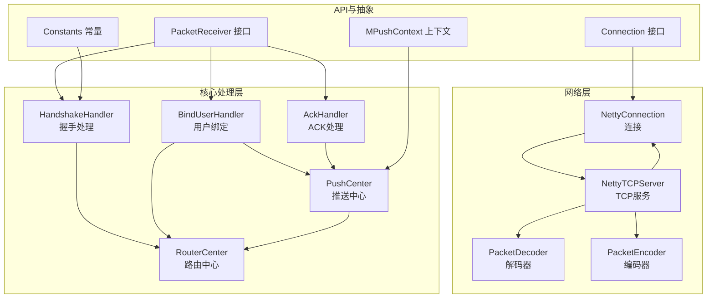
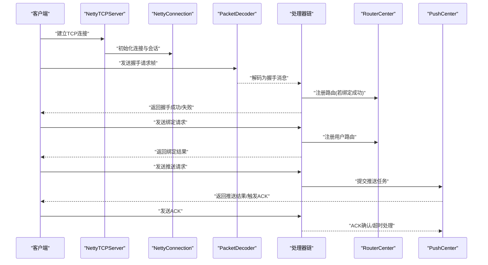
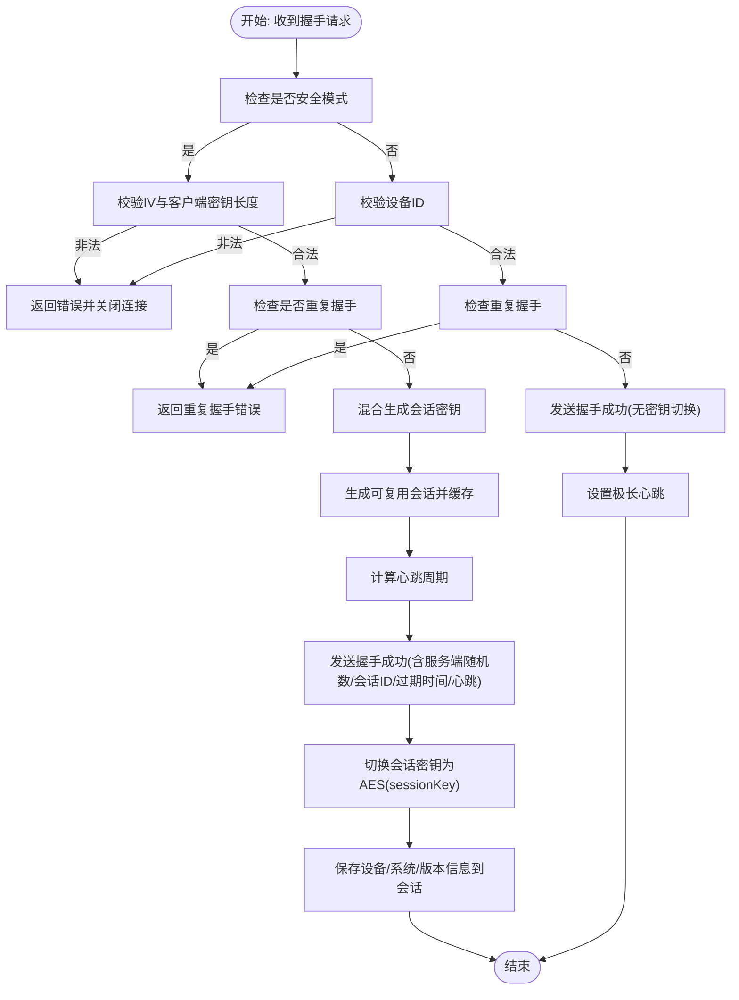
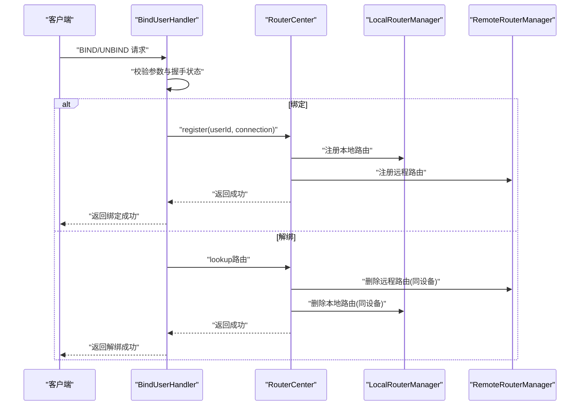
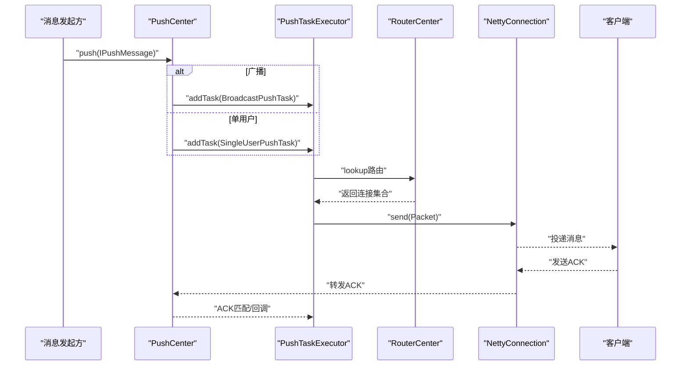
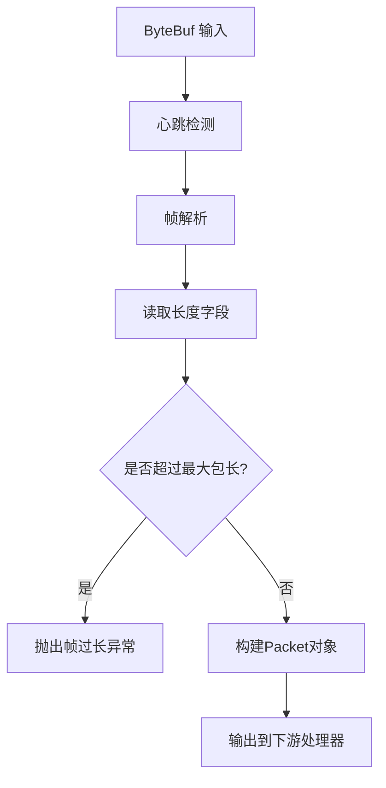
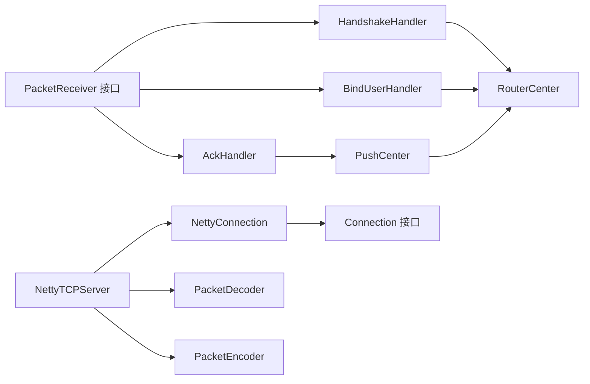

# 数据流架构

<cite>
**本文引用的文件**
- [README.md](file://README.md)
- [Constants.java](file://mpush-api/src/main/java/com/mpush/api/Constants.java)
- [MPushContext.java](file://mpush-api/src/main/java/com/mpush/api/MPushContext.java)
- [Connection.java](file://mpush-api/src/main/java/com/mpush/api/connection/Connection.java)
- [PacketReceiver.java](file://mpush-api/src/main/java/com/mpush/api/message/PacketReceiver.java)
- [HandshakeHandler.java](file://mpush-core/src/main/java/com/mpush/core/handler/HandshakeHandler.java)
- [BindUserHandler.java](file://mpush-core/src/main/java/com/mpush/core/handler/BindUserHandler.java)
- [AckHandler.java](file://mpush-core/src/main/java/com/mpush/core/handler/AckHandler.java)
- [PushCenter.java](file://mpush-core/src/main/java/com/mpush/core/push/PushCenter.java)
- [RouterCenter.java](file://mpush-core/src/main/java/com/mpush/core/router/RouterCenter.java)
- [PacketDecoder.java](file://mpush-netty/src/main/java/com/mpush/netty/codec/PacketDecoder.java)
- [PacketEncoder.java](file://mpush-netty/src/main/java/com/mpush/netty/codec/PacketEncoder.java)
- [NettyConnection.java](file://mpush-netty/src/main/java/com/mpush/netty/connection/NettyConnection.java)
- [NettyTCPServer.java](file://mpush-netty/src/main/java/com/mpush/netty/server/NettyTCPServer.java)
- [PacketFactory.java](file://mpush-common/src/main/java/com/mpush/common/memory/PacketFactory.java)
</cite>

## 目录
1. [简介](#简介)
2. [项目结构](#项目结构)
3. [核心组件](#核心组件)
4. [架构总览](#架构总览)
5. [详细组件分析](#详细组件分析)
6. [依赖分析](#依赖分析)
7. [性能考量](#性能考量)
8. [故障排查指南](#故障排查指南)
9. [结论](#结论)
10. [附录](#附录)

## 简介
本文件面向MPush项目的“数据流架构”，聚焦从客户端连接建立到消息推送完成的完整数据流转过程，覆盖握手认证、用户绑定、消息路由与ACK确认等关键环节；同时解释协议编解码、异步处理模型、消息队列与事件总线、缓存与会话状态管理、连接池优化、一致性保障、错误处理与重试、以及性能瓶颈与优化策略（含批量与流水线设计）。文档以可视化图示呈现典型流程与时序，并提供可追溯的来源定位。

## 项目结构
MPush采用模块化分层设计，核心模块包括：
- mpush-api：协议、连接、消息、路由、推送、服务抽象与SPI扩展接口
- mpush-netty：基于Netty的编解码器、连接与服务器实现
- mpush-core：核心处理器（握手、绑定、ACK）、推送中心、路由中心、会话与任务执行
- mpush-common：通用消息、内存池与工具、流控与DNS映射等
- mpush-cache、mpush-zk、mpush-monitor：缓存、服务发现/注册、监控
- mpush-client：客户端实现与测试样例

图表来源
- [PacketDecoder.java](file://mpush-netty/src/main/java/com/mpush/netty/codec/PacketDecoder.java#L44-L107)
- [PacketEncoder.java](file://mpush-netty/src/main/java/com/mpush/netty/codec/PacketEncoder.java#L38-L47)
- [NettyConnection.java](file://mpush-netty/src/main/java/com/mpush/netty/connection/NettyConnection.java#L38-L179)
- [NettyTCPServer.java](file://mpush-netty/src/main/java/com/mpush/netty/server/NettyTCPServer.java#L53-L321)
- [HandshakeHandler.java](file://mpush-core/src/main/java/com/mpush/core/handler/HandshakeHandler.java#L47-L160)
- [BindUserHandler.java](file://mpush-core/src/main/java/com/mpush/core/handler/BindUserHandler.java#L50-L185)
- [AckHandler.java](file://mpush-core/src/main/java/com/mpush/core/handler/AckHandler.java#L36-L61)
- [RouterCenter.java](file://mpush-core/src/main/java/com/mpush/core/router/RouterCenter.java#L40-L135)
- [PushCenter.java](file://mpush-core/src/main/java/com/mpush/core/push/PushCenter.java#L49-L183)
- [Connection.java](file://mpush-api/src/main/java/com/mpush/api/connection/Connection.java#L32-L64)
- [PacketReceiver.java](file://mpush-api/src/main/java/com/mpush/api/message/PacketReceiver.java#L30-L33)
- [Constants.java](file://mpush-api/src/main/java/com/mpush/api/Constants.java#L30-L43)
- [MPushContext.java](file://mpush-api/src/main/java/com/mpush/api/MPushContext.java#L33-L46)

章节来源
- [README.md](file://README.md#L19-L328)

## 核心组件
- 连接与会话
  - Connection接口与NettyConnection实现负责底层通道、发送、超时检测与会话上下文维护
  - SessionContext承载设备信息、心跳、安全密钥等会话状态
- 协议与编解码
  - PacketDecoder/Encoder实现帧头长度、命令、标志、会话ID、LRC与负载的编解码
  - PacketFactory按是否UDP网关选择Packet或UDPPacket实例
- 处理器链
  - HandshakeHandler：安全/非安全握手、会话密钥切换、可复用会话生成与缓存
  - BindUserHandler：用户绑定/解绑、路由注册/注销、事件发布
  - AckHandler：ACK响应匹配与超时处理
- 路由与推送
  - RouterCenter：本地/远程路由注册、查询与变更事件
  - PushCenter：推送任务调度、流控、ACK任务队列与执行器选择（TCP/UDP）

章节来源
- [Connection.java](file://mpush-api/src/main/java/com/mpush/api/connection/Connection.java#L32-L64)
- [NettyConnection.java](file://mpush-netty/src/main/java/com/mpush/netty/connection/NettyConnection.java#L38-L179)
- [PacketDecoder.java](file://mpush-netty/src/main/java/com/mpush/netty/codec/PacketDecoder.java#L44-L107)
- [PacketEncoder.java](file://mpush-netty/src/main/java/com/mpush/netty/codec/PacketEncoder.java#L38-L47)
- [PacketFactory.java](file://mpush-common/src/main/java/com/mpush/common/memory/PacketFactory.java#L32-L40)
- [HandshakeHandler.java](file://mpush-core/src/main/java/com/mpush/core/handler/HandshakeHandler.java#L47-L160)
- [BindUserHandler.java](file://mpush-core/src/main/java/com/mpush/core/handler/BindUserHandler.java#L50-L185)
- [AckHandler.java](file://mpush-core/src/main/java/com/mpush/core/handler/AckHandler.java#L36-L61)
- [RouterCenter.java](file://mpush-core/src/main/java/com/mpush/core/router/RouterCenter.java#L40-L135)
- [PushCenter.java](file://mpush-core/src/main/java/com/mpush/core/push/PushCenter.java#L49-L183)

## 架构总览
MPush采用事件驱动与异步非阻塞I/O（Netty），数据流自下而上分为四层：
- 物理链路层：TCP/UDP通道与连接管理
- 协议编解码层：帧解析与序列化
- 业务处理层：握手、绑定、推送、ACK等处理器
- 路由与缓存层：本地/远程路由、会话缓存与事件总线

图表来源
- [NettyTCPServer.java](file://mpush-netty/src/main/java/com/mpush/netty/server/NettyTCPServer.java#L104-L185)
- [NettyConnection.java](file://mpush-netty/src/main/java/com/mpush/netty/connection/NettyConnection.java#L47-L105)
- [PacketDecoder.java](file://mpush-netty/src/main/java/com/mpush/netty/codec/PacketDecoder.java#L48-L89)
- [HandshakeHandler.java](file://mpush-core/src/main/java/com/mpush/core/handler/HandshakeHandler.java#L61-L128)
- [BindUserHandler.java](file://mpush-core/src/main/java/com/mpush/core/handler/BindUserHandler.java#L66-L118)
- [PushCenter.java](file://mpush-core/src/main/java/com/mpush/core/push/PushCenter.java#L73-L82)
- [AckHandler.java](file://mpush-core/src/main/java/com/mpush/core/handler/AckHandler.java#L51-L59)

## 详细组件分析

### 握手与认证流程
- 安全握手：生成服务端随机数、混合会话密钥、下发服务端随机数与心跳周期、切换会话密钥、缓存可复用会话
- 非安全握手：校验设备ID，直接下发成功并设置极长心跳
- 异常处理：参数非法、重复握手、失败时关闭连接并记录日志

图表来源
- [HandshakeHandler.java](file://mpush-core/src/main/java/com/mpush/core/handler/HandshakeHandler.java#L69-L128)
- [HandshakeHandler.java](file://mpush-core/src/main/java/com/mpush/core/handler/HandshakeHandler.java#L130-L159)

章节来源
- [HandshakeHandler.java](file://mpush-core/src/main/java/com/mpush/core/handler/HandshakeHandler.java#L47-L160)

### 用户绑定与路由注册
- 绑定：校验参数与握手状态，调用BindValidator校验身份，注册本地/远程路由，发布上线事件
- 解绑：校验同一设备后，删除本地/远程路由，发布下线事件
- 一致性：本地/远程均成功才视为成功，失败时回滚远程注册

图表来源
- [BindUserHandler.java](file://mpush-core/src/main/java/com/mpush/core/handler/BindUserHandler.java#L74-L118)
- [BindUserHandler.java](file://mpush-core/src/main/java/com/mpush/core/handler/BindUserHandler.java#L126-L172)
- [RouterCenter.java](file://mpush-core/src/main/java/com/mpush/core/router/RouterCenter.java#L76-L110)

章节来源
- [BindUserHandler.java](file://mpush-core/src/main/java/com/mpush/core/handler/BindUserHandler.java#L50-L185)
- [RouterCenter.java](file://mpush-core/src/main/java/com/mpush/core/router/RouterCenter.java#L40-L135)

### 消息推送与ACK确认
- 推送任务：PushCenter根据是否广播选择不同流控策略，提交广播或单用户推送任务
- 执行器：TCP优先使用Netty事件循环线程池；UDP使用自定义定时线程池
- ACK队列：推送任务入队，客户端ACK到达时匹配并回调，超时则记录日志

图表来源
- [PushCenter.java](file://mpush-core/src/main/java/com/mpush/core/push/PushCenter.java#L73-L82)
- [PushCenter.java](file://mpush-core/src/main/java/com/mpush/core/push/PushCenter.java#L130-L172)
- [AckHandler.java](file://mpush-core/src/main/java/com/mpush/core/handler/AckHandler.java#L51-L59)
- [RouterCenter.java](file://mpush-core/src/main/java/com/mpush/core/router/RouterCenter.java#L112-L117)

章节来源
- [PushCenter.java](file://mpush-core/src/main/java/com/mpush/core/push/PushCenter.java#L49-L183)
- [AckHandler.java](file://mpush-core/src/main/java/com/mpush/core/handler/AckHandler.java#L36-L61)

### 协议编解码与数据包工厂
- 编码：PacketEncoder将Packet写入ByteBuf，遵循固定帧头格式
- 解码：PacketDecoder解析心跳帧与完整帧，校验最大包长，支持UDP与JSON解码
- 工厂：PacketFactory按配置选择Packet或UDPPacket实例

图表来源
- [PacketDecoder.java](file://mpush-netty/src/main/java/com/mpush/netty/codec/PacketDecoder.java#L48-L89)
- [PacketEncoder.java](file://mpush-netty/src/main/java/com/mpush/netty/codec/PacketEncoder.java#L43-L45)
- [PacketFactory.java](file://mpush-common/src/main/java/com/mpush/common/memory/PacketFactory.java#L32-L40)

章节来源
- [PacketDecoder.java](file://mpush-netty/src/main/java/com/mpush/netty/codec/PacketDecoder.java#L44-L107)
- [PacketEncoder.java](file://mpush-netty/src/main/java/com/mpush/netty/codec/PacketEncoder.java#L38-L47)
- [PacketFactory.java](file://mpush-common/src/main/java/com/mpush/common/memory/PacketFactory.java#L32-L40)

### 事件驱动与消息队列
- 事件总线：用户上下线事件通过EventBus发布，路由变更事件驱动
- MQ监听：MQPushListener消费MQ消息，实现跨节点广播与踢人等
- 流控：PushCenter内置全局流控与广播流控，支持Redis流控与快速流控

章节来源
- [BindUserHandler.java](file://mpush-core/src/main/java/com/mpush/core/handler/BindUserHandler.java#L105-L106)
- [PushCenter.java](file://mpush-core/src/main/java/com/mpush/core/push/PushCenter.java#L52-L54)
- [PushCenter.java](file://mpush-core/src/main/java/com/mpush/core/push/PushCenter.java#L74-L82)

## 依赖分析
- 组件耦合
  - 处理器依赖Connection与SessionContext，通过API层隔离具体实现
  - PushCenter依赖RouterCenter与事件总线，解耦推送与路由
  - NettyTCPServer依赖编解码器与连接，统一I/O线程模型
- 外部依赖
  - Zookeeper用于服务发现与注册
  - Redis用于会话缓存与消息队列
  - Netty提供高性能网络I/O

图表来源
- [HandshakeHandler.java](file://mpush-core/src/main/java/com/mpush/core/handler/HandshakeHandler.java#L47-L53)
- [BindUserHandler.java](file://mpush-core/src/main/java/com/mpush/core/handler/BindUserHandler.java#L53-L57)
- [AckHandler.java](file://mpush-core/src/main/java/com/mpush/core/handler/AckHandler.java#L40-L42)
- [PushCenter.java](file://mpush-core/src/main/java/com/mpush/core/push/PushCenter.java#L67-L70)
- [NettyTCPServer.java](file://mpush-netty/src/main/java/com/mpush/netty/server/NettyTCPServer.java#L246-L263)
- [NettyConnection.java](file://mpush-netty/src/main/java/com/mpush/netty/connection/NettyConnection.java#L38-L55)
- [Connection.java](file://mpush-api/src/main/java/com/mpush/api/connection/Connection.java#L32-L41)
- [PacketReceiver.java](file://mpush-api/src/main/java/com/mpush/api/message/PacketReceiver.java#L30-L33)

章节来源
- [RouterCenter.java](file://mpush-core/src/main/java/com/mpush/core/router/RouterCenter.java#L40-L61)
- [NettyTCPServer.java](file://mpush-netty/src/main/java/com/mpush/netty/server/NettyTCPServer.java#L104-L185)

## 性能考量
- 线程模型
  - TCP：使用Netty事件循环线程池，I/O密集型高并发
  - UDP：使用自定义定时线程池，避免EventLoop不适合UDP场景
- 内存与编解码
  - ByteBuf池化减少GC压力
  - PacketFactory按网关类型选择Packet/UDPPacket，降低不必要的封装成本
- 流控与限速
  - 全局流控与广播流控，支持Redis流控与快速流控，保障系统稳定
- 连接池与背压
  - Netty写保护与水位阈值，结合连接状态与超时检测，避免拥塞放大
- 批量与流水线
  - 推送任务批量化执行，结合ACK队列与超时清理，提升吞吐

章节来源
- [PushCenter.java](file://mpush-core/src/main/java/com/mpush/core/push/PushCenter.java#L99-L103)
- [NettyTCPServer.java](file://mpush-netty/src/main/java/com/mpush/netty/server/NettyTCPServer.java#L239-L241)
- [PacketFactory.java](file://mpush-common/src/main/java/com/mpush/common/memory/PacketFactory.java#L32-L40)
- [PushCenter.java](file://mpush-core/src/main/java/com/mpush/core/push/PushCenter.java#L52-L54)

## 故障排查指南
- 握手失败
  - 参数非法、重复握手、密钥长度不正确等，检查HandshakeHandler日志与错误码
- 绑定失败
  - 未握手、路由注册失败（本地/远程任一失败），检查BindValidator与RouterCenter
- 推送失败/ACK超时
  - 检查PushCenter任务队列与执行器状态，确认客户端是否在线与ACK是否送达
- 网络异常
  - NettyConnection超时检测与写保护，关注写忙/不可写导致的阻塞

章节来源
- [HandshakeHandler.java](file://mpush-core/src/main/java/com/mpush/core/handler/HandshakeHandler.java#L76-L82)
- [BindUserHandler.java](file://mpush-core/src/main/java/com/mpush/core/handler/BindUserHandler.java#L96-L113)
- [AckHandler.java](file://mpush-core/src/main/java/com/mpush/core/handler/AckHandler.java#L52-L56)
- [NettyConnection.java](file://mpush-netty/src/main/java/com/mpush/netty/connection/NettyConnection.java#L120-L127)

## 结论
MPush通过清晰的分层与事件驱动模型，实现了从连接、握手、绑定到推送与ACK的完整数据流闭环。协议编解码与连接管理采用Netty高效实现，路由与推送中心解耦业务逻辑，配合流控与ACK队列保障可靠性与性能。建议在生产环境中结合Redis流控与合理的线程池配置，持续监控关键指标并优化热点路径。

## 附录
- 关键常量与上下文
  - Constants提供公共常量与频道前缀
  - MPushContext提供监控、服务发现/注册、缓存与消息队列访问入口

章节来源
- [Constants.java](file://mpush-api/src/main/java/com/mpush/api/Constants.java#L30-L43)
- [MPushContext.java](file://mpush-api/src/main/java/com/mpush/api/MPushContext.java#L33-L46)