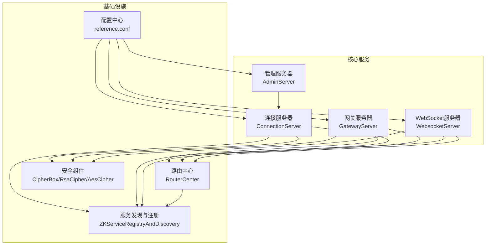
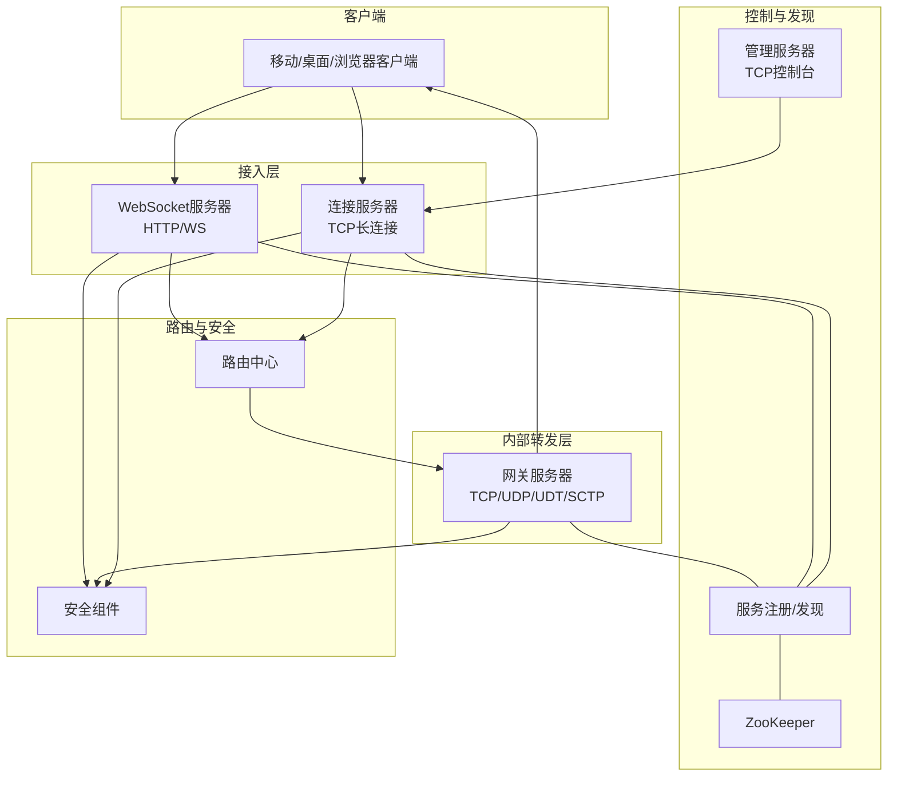
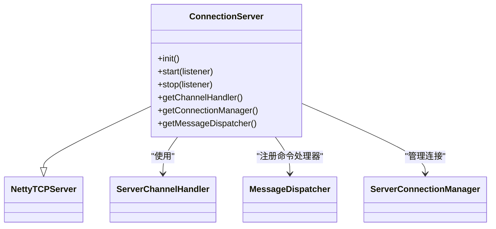
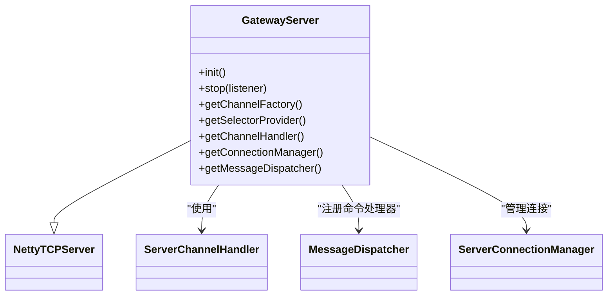
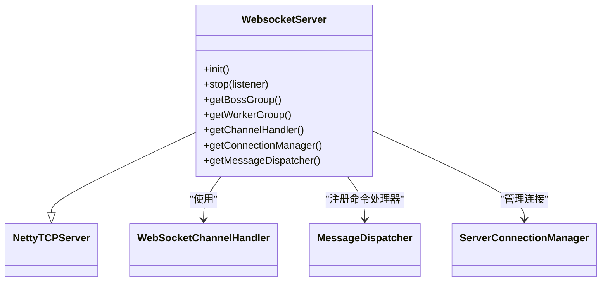
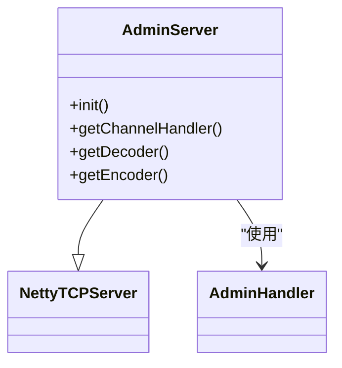
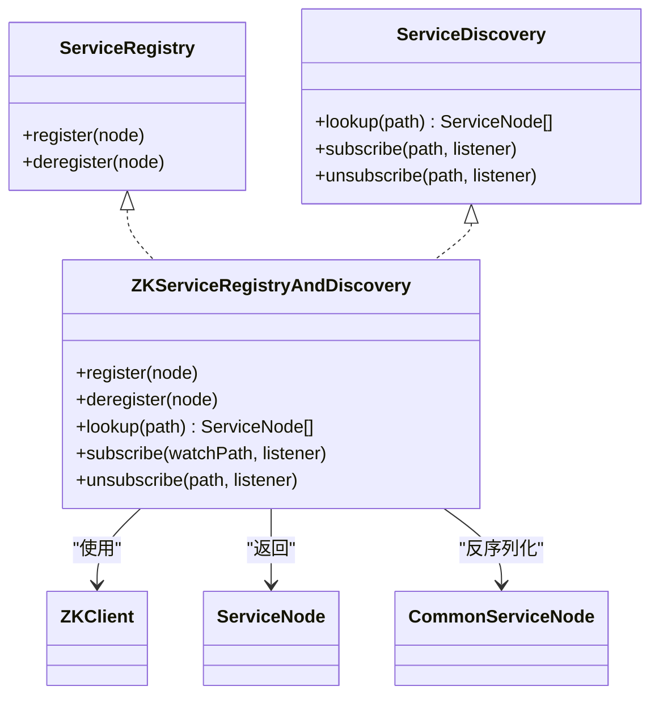
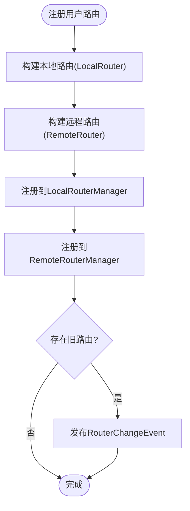
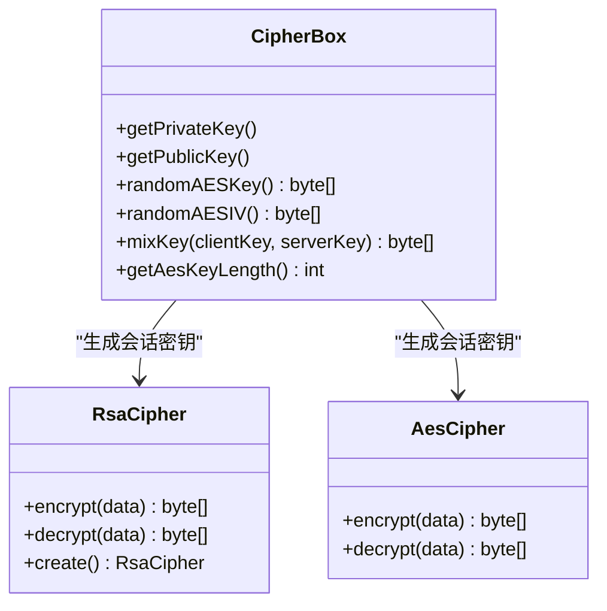
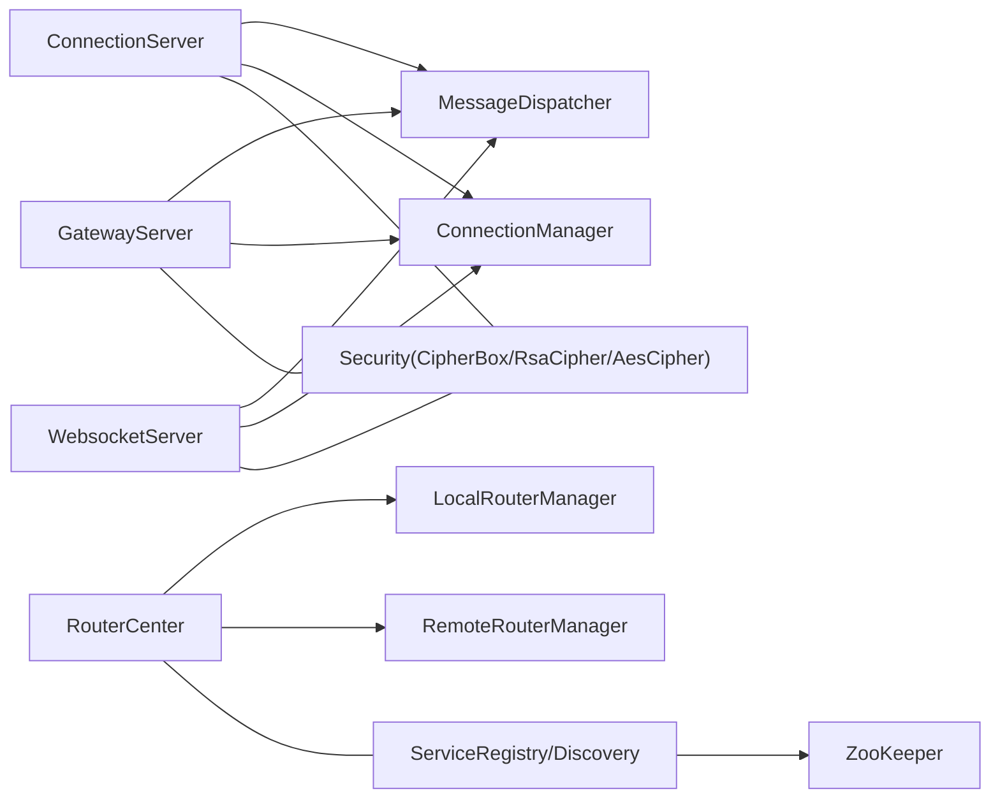

# 整体架构设计

<cite>
**本文引用的文件**
- [README.md](file://README.md)
- [reference.conf](file://conf/reference.conf)
- [Main.java](file://mpush-boot/src/main/java/com/mpush/bootstrap/Main.java)
- [ConnectionServer.java](file://mpush-core/src/main/java/com/mpush/core/server/ConnectionServer.java)
- [GatewayServer.java](file://mpush-core/src/main/java/com/mpush/core/server/GatewayServer.java)
- [WebsocketServer.java](file://mpush-core/src/main/java/com/mpush/core/server/WebsocketServer.java)
- [AdminServer.java](file://mpush-core/src/main/java/com/mpush/core/server/AdminServer.java)
- [ServiceDiscovery.java](file://mpush-api/src/main/java/com/mpush/api/srd/ServiceDiscovery.java)
- [ServiceRegistry.java](file://mpush-api/src/main/java/com/mpush/api/srd/ServiceRegistry.java)
- [ZKServiceRegistryAndDiscovery.java](file://mpush-zk/src/main/java/com/mpush/zk/ZKServiceRegistryAndDiscovery.java)
- [RouterCenter.java](file://mpush-core/src/main/java/com/mpush/core/router/RouterCenter.java)
- [RouterManager.java](file://mpush-api/src/main/java/com/mpush/api/router/RouterManager.java)
- [CipherBox.java](file://mpush-common/src/main/java/com/mpush/common/security/CipherBox.java)
- [RsaCipher.java](file://mpush-common/src/main/java/com/mpush/common/security/RsaCipher.java)
- [AesCipher.java](file://mpush-common/src/main/java/com/mpush/common/security/AesCipher.java)
- [Constants.java](file://mpush-api/src/main/java/com/mpush/api/Constants.java)
- [MPushContext.java](file://mpush-api/src/main/java/com/mpush/api/MPushContext.java)
</cite>

## 目录
1. [简介](#简介)
2. [项目结构](#项目结构)
3. [核心组件](#核心组件)
4. [架构总览](#架构总览)
5. [组件详细分析](#组件详细分析)
6. [依赖关系分析](#依赖关系分析)
7. [性能考量](#性能考量)
8. [故障排查指南](#故障排查指南)
9. [结论](#结论)
10. [附录](#附录)

## 简介
本文件面向MPush项目的整体架构设计，聚焦分布式部署架构、服务节点发现与注册、服务间通信协议与数据交换、水平扩展与集群管理、安全架构（认证授权、数据加密、访问控制）、系统拓扑与组件交互、性能优化策略、资源管理与监控告警机制。目标是帮助读者快速理解系统布局与运行原理，并为运维与开发提供参考。

## 项目结构
MPush采用多模块分层组织，核心模块包括API接口层、核心服务层、网络传输层、缓存与消息队列层、服务发现与注册层、监控与工具层等。关键服务包括连接服务器（对外长连接）、网关服务器（内部转发）、WebSocket服务器（对外HTTP/WebSocket）、管理服务器（内部控制台）。

图表来源
- [ConnectionServer.java](file://mpush-core/src/main/java/com/mpush/core/server/ConnectionServer.java#L58-L189)
- [GatewayServer.java](file://mpush-core/src/main/java/com/mpush/core/server/GatewayServer.java#L56-L187)
- [WebsocketServer.java](file://mpush-core/src/main/java/com/mpush/core/server/WebsocketServer.java#L48-L124)
- [AdminServer.java](file://mpush-core/src/main/java/com/mpush/core/server/AdminServer.java#L34-L87)
- [ZKServiceRegistryAndDiscovery.java](file://mpush-zk/src/main/java/com/mpush/zk/ZKServiceRegistryAndDiscovery.java#L39-L119)
- [RouterCenter.java](file://mpush-core/src/main/java/com/mpush/core/router/RouterCenter.java#L40-L135)
- [reference.conf](file://conf/reference.conf#L13-L239)

章节来源
- [README.md](file://README.md#L1-L328)
- [reference.conf](file://conf/reference.conf#L13-L239)

## 核心组件
- 连接服务器（ConnectionServer）
  - 对外TCP长连接服务，负责握手、绑定用户、心跳、ACK、HTTP代理等消息处理。
  - 支持流量整形、发送/接收缓冲区与写缓冲水位线配置。
- 网关服务器（GatewayServer）
  - 内部TCP/UDP/UDT/SCTP多协议网关，负责接收来自连接服务器的推送指令并转发至目标客户端。
  - 支持多通道网络类型选择与流量整形。
- WebSocket服务器（WebsocketServer）
  - 对外HTTP/WS服务，复用连接服务器的处理器，支持握手、绑定、推送、ACK。
- 管理服务器（AdminServer）
  - 内部TCP控制台服务，基于文本协议，用于运维操作。
- 服务发现与注册（ServiceDiscovery/ServiceRegistry + ZKServiceRegistryAndDiscovery）
  - 基于ZooKeeper的服务注册与发现，提供节点查询与订阅变更。
- 路由中心（RouterCenter）
  - 维护本地与远程路由表，处理用户上线/下线事件与路由变更。
- 安全组件（CipherBox/RsaCipher/AesCipher）
  - 提供RSA密钥加载与混合会话密钥生成，以及AES加解密能力。

章节来源
- [ConnectionServer.java](file://mpush-core/src/main/java/com/mpush/core/server/ConnectionServer.java#L58-L189)
- [GatewayServer.java](file://mpush-core/src/main/java/com/mpush/core/server/GatewayServer.java#L56-L187)
- [WebsocketServer.java](file://mpush-core/src/main/java/com/mpush/core/server/WebsocketServer.java#L48-L124)
- [AdminServer.java](file://mpush-core/src/main/java/com/mpush/core/server/AdminServer.java#L34-L87)
- [ServiceDiscovery.java](file://mpush-api/src/main/java/com/mpush/api/srd/ServiceDiscovery.java#L31-L39)
- [ServiceRegistry.java](file://mpush-api/src/main/java/com/mpush/api/srd/ServiceRegistry.java#L29-L35)
- [ZKServiceRegistryAndDiscovery.java](file://mpush-zk/src/main/java/com/mpush/zk/ZKServiceRegistryAndDiscovery.java#L39-L119)
- [RouterCenter.java](file://mpush-core/src/main/java/com/mpush/core/router/RouterCenter.java#L40-L135)
- [CipherBox.java](file://mpush-common/src/main/java/com/mpush/common/security/CipherBox.java#L34-L93)
- [RsaCipher.java](file://mpush-common/src/main/java/com/mpush/common/security/RsaCipher.java#L33-L61)
- [AesCipher.java](file://mpush-common/src/main/java/com/mpush/common/security/AesCipher.java#L36-L86)

## 架构总览
MPush采用“连接服务器-网关服务器-客户端”的典型推送链路；通过ZooKeeper实现服务节点注册与发现；路由中心维护用户路由；安全组件提供握手阶段的密钥协商与后续数据加解密；配置中心统一管理网络、线程池、流控、监控等参数。

图表来源
- [ConnectionServer.java](file://mpush-core/src/main/java/com/mpush/core/server/ConnectionServer.java#L58-L189)
- [GatewayServer.java](file://mpush-core/src/main/java/com/mpush/core/server/GatewayServer.java#L56-L187)
- [WebsocketServer.java](file://mpush-core/src/main/java/com/mpush/core/server/WebsocketServer.java#L48-L124)
- [AdminServer.java](file://mpush-core/src/main/java/com/mpush/core/server/AdminServer.java#L34-L87)
- [ZKServiceRegistryAndDiscovery.java](file://mpush-zk/src/main/java/com/mpush/zk/ZKServiceRegistryAndDiscovery.java#L39-L119)
- [RouterCenter.java](file://mpush-core/src/main/java/com/mpush/core/router/RouterCenter.java#L40-L135)
- [reference.conf](file://conf/reference.conf#L45-L123)

## 组件详细分析

### 连接服务器（ConnectionServer）
- 角色与职责
  - 对外提供TCP长连接，处理握手、绑定/解绑用户、心跳、ACK、HTTP代理等消息。
  - 管理连接生命周期与消息分发。
- 关键特性
  - 流量整形：可按全局/通道维度限制读写速率。
  - 缓冲区与写水位：可配置发送/接收缓冲区与高低水位线，避免背压导致内存膨胀。
  - 线程模型：独立的boss/worker线程池，可按CPU核数动态调整。
- 数据流
  - 初始化消息分发器，注册各类Command处理器。
  - 通过ServerChannelHandler接入Netty管道，结合ConnectionManager与MessageDispatcher完成消息路由。

图表来源
- [ConnectionServer.java](file://mpush-core/src/main/java/com/mpush/core/server/ConnectionServer.java#L58-L189)

章节来源
- [ConnectionServer.java](file://mpush-core/src/main/java/com/mpush/core/server/ConnectionServer.java#L58-L189)

### 网关服务器（GatewayServer）
- 角色与职责
  - 内部转发服务，接收来自连接服务器的推送指令，按路由将消息投递到目标客户端。
  - 支持多种网络类型（TCP/UDP/UDT/SCTP），适配不同场景。
- 关键特性
  - 流量整形：可配置读写速率与检查周期。
  - 缓冲区与写水位：针对内部转发场景优化。
  - 线程模型：独立的boss/worker线程池，可按CPU核数动态调整。
- 数据流
  - 初始化消息分发器，注册网关推送处理器。
  - 通过ServerChannelHandler接入Netty管道，结合ConnectionManager与MessageDispatcher完成消息路由。

图表来源
- [GatewayServer.java](file://mpush-core/src/main/java/com/mpush/core/server/GatewayServer.java#L56-L187)

章节来源
- [GatewayServer.java](file://mpush-core/src/main/java/com/mpush/core/server/GatewayServer.java#L56-L187)

### WebSocket服务器（WebsocketServer）
- 角色与职责
  - 对外提供HTTP/WS服务，复用连接服务器的消息处理链路，支持握手、绑定、推送、ACK。
- 关键特性
  - 复用连接服务器的boss/worker线程组，降低资源占用。
  - 支持压缩与聚合HTTP对象。
- 数据流
  - 初始化消息分发器，注册握手、绑定、推送、ACK处理器。
  - 通过WebSocketChannelHandler接入Netty管道。

图表来源
- [WebsocketServer.java](file://mpush-core/src/main/java/com/mpush/core/server/WebsocketServer.java#L48-L124)

章节来源
- [WebsocketServer.java](file://mpush-core/src/main/java/com/mpush/core/server/WebsocketServer.java#L48-L124)

### 管理服务器（AdminServer）
- 角色与职责
  - 内部TCP控制台服务，基于文本协议，便于运维人员执行管理命令。
- 关键特性
  - 简化编码/解码，固定工作线程数。
- 数据流
  - 初始化AdminHandler，接入Netty管道。

图表来源
- [AdminServer.java](file://mpush-core/src/main/java/com/mpush/core/server/AdminServer.java#L34-L87)

章节来源
- [AdminServer.java](file://mpush-core/src/main/java/com/mpush/core/server/AdminServer.java#L34-L87)

### 服务发现与注册（ZKServiceRegistryAndDiscovery）
- 角色与职责
  - 实现ServiceRegistry与ServiceDiscovery接口，基于ZooKeeper提供服务节点注册、注销、查询与订阅。
- 关键特性
  - 支持持久/临时节点注册。
  - 订阅路径变更，回调通知监听者。
- 数据流
  - 注册/注销节点路径，查询子节点并反序列化为ServiceNode列表。

图表来源
- [ServiceRegistry.java](file://mpush-api/src/main/java/com/mpush/api/srd/ServiceRegistry.java#L29-L35)
- [ServiceDiscovery.java](file://mpush-api/src/main/java/com/mpush/api/srd/ServiceDiscovery.java#L31-L39)
- [ZKServiceRegistryAndDiscovery.java](file://mpush-zk/src/main/java/com/mpush/zk/ZKServiceRegistryAndDiscovery.java#L39-L119)

章节来源
- [ServiceRegistry.java](file://mpush-api/src/main/java/com/mpush/api/srd/ServiceRegistry.java#L29-L35)
- [ServiceDiscovery.java](file://mpush-api/src/main/java/com/mpush/api/srd/ServiceDiscovery.java#L31-L39)
- [ZKServiceRegistryAndDiscovery.java](file://mpush-zk/src/main/java/com/mpush/zk/ZKServiceRegistryAndDiscovery.java#L39-L119)

### 路由中心（RouterCenter）
- 角色与职责
  - 维护本地与远程路由，处理用户上线/下线事件，触发路由变更事件。
- 关键特性
  - 本地路由与远程路由分离，支持跨节点查找。
  - 清理在线用户列表，保证状态一致性。
- 数据流
  - 注册用户路由（本地+远程），查询路由，注销路由，发布路由变更事件。

图表来源
- [RouterCenter.java](file://mpush-core/src/main/java/com/mpush/core/router/RouterCenter.java#L76-L104)

章节来源
- [RouterCenter.java](file://mpush-core/src/main/java/com/mpush/core/router/RouterCenter.java#L40-L135)
- [RouterManager.java](file://mpush-api/src/main/java/com/mpush/api/router/RouterManager.java#L29-L66)

### 安全架构（CipherBox/RsaCipher/AesCipher）
- 角色与职责
  - 加载RSA私钥/公钥，生成随机AES密钥与IV，混合生成会话密钥，提供AES加解密能力。
- 关键特性
  - 握手阶段使用RSA加密传输对称密钥材料，后续使用AES进行高效加解密。
  - 支持密钥长度配置与随机性保障。
- 数据流
  - CipherBox加载密钥与生成随机参数，RsaCipher进行RSA加解密，AesCipher进行AES加解密。

图表来源
- [CipherBox.java](file://mpush-common/src/main/java/com/mpush/common/security/CipherBox.java#L34-L93)
- [RsaCipher.java](file://mpush-common/src/main/java/com/mpush/common/security/RsaCipher.java#L33-L61)
- [AesCipher.java](file://mpush-common/src/main/java/com/mpush/common/security/AesCipher.java#L36-L86)

章节来源
- [CipherBox.java](file://mpush-common/src/main/java/com/mpush/common/security/CipherBox.java#L34-L93)
- [RsaCipher.java](file://mpush-common/src/main/java/com/mpush/common/security/RsaCipher.java#L33-L61)
- [AesCipher.java](file://mpush-common/src/main/java/com/mpush/common/security/AesCipher.java#L36-L86)

## 依赖关系分析
- 组件耦合
  - ConnectionServer/GatewayServer/WebsocketServer均依赖MessageDispatcher与ConnectionManager，体现清晰的职责分离。
  - RouterCenter与ZKServiceRegistryAndDiscovery通过事件总线与服务发现接口耦合，实现路由与节点的松耦合。
  - 安全组件独立于网络层，通过配置中心加载密钥，提供通用加解密接口。
- 外部依赖
  - ZooKeeper用于服务注册与发现。
  - Redis用于缓存与消息队列（通过SPI扩展）。
  - Netty用于网络传输与线程池管理。

图表来源
- [ConnectionServer.java](file://mpush-core/src/main/java/com/mpush/core/server/ConnectionServer.java#L58-L189)
- [GatewayServer.java](file://mpush-core/src/main/java/com/mpush/core/server/GatewayServer.java#L56-L187)
- [WebsocketServer.java](file://mpush-core/src/main/java/com/mpush/core/server/WebsocketServer.java#L48-L124)
- [RouterCenter.java](file://mpush-core/src/main/java/com/mpush/core/router/RouterCenter.java#L40-L135)
- [ZKServiceRegistryAndDiscovery.java](file://mpush-zk/src/main/java/com/mpush/zk/ZKServiceRegistryAndDiscovery.java#L39-L119)
- [CipherBox.java](file://mpush-common/src/main/java/com/mpush/common/security/CipherBox.java#L34-L93)

章节来源
- [RouterCenter.java](file://mpush-core/src/main/java/com/mpush/core/router/RouterCenter.java#L40-L135)
- [ZKServiceRegistryAndDiscovery.java](file://mpush-zk/src/main/java/com/mpush/zk/ZKServiceRegistryAndDiscovery.java#L39-L119)

## 性能考量
- 线程池与并发
  - 连接服务器、网关服务器、HTTP代理等均支持按CPU核数动态调整的工作线程数，避免资源浪费或过载。
- 缓冲区与背压
  - 配置发送/接收缓冲区与写缓冲水位线，防止ChannelOutboundBuffer无限增长导致内存压力。
- 流量整形
  - 支持全局与通道级别的读写速率限制，结合检查周期平滑突发流量。
- 心跳与会话
  - 可配置最小/最大心跳间隔与心跳超时次数，配合会话过期时间提升重连效率与稳定性。
- 压缩与阈值
  - 超过压缩阈值的数据包启用压缩，降低带宽占用。
- 监控与诊断
  - 配置监控开关、慢调用阈值、堆栈转储周期，辅助定位性能瓶颈。

章节来源
- [reference.conf](file://conf/reference.conf#L182-L239)
- [ConnectionServer.java](file://mpush-core/src/main/java/com/mpush/core/server/ConnectionServer.java#L140-L174)
- [GatewayServer.java](file://mpush-core/src/main/java/com/mpush/core/server/GatewayServer.java#L129-L156)

## 故障排查指南
- 启停流程
  - 主程序通过ServerLauncher初始化并启动各服务，退出时通过关闭钩子优雅停机。
- 端口与绑定
  - 确认连接服务器、网关服务器、WebSocket服务器、管理服务器端口与绑定IP配置正确。
- 服务发现
  - 检查ZooKeeper地址、命名空间、会话/连接超时配置，确保节点能正常注册与发现。
- 路由一致性
  - 关注路由中心的日志与事件，排查用户重复登录或下线未清理导致的路由异常。
- 安全问题
  - 确认RSA私钥/公钥配置正确，密钥长度符合预期；检查握手阶段密钥协商是否成功。
- 监控与日志
  - 开启监控日志与慢调用记录，定期查看日志输出，定位异常。

章节来源
- [Main.java](file://mpush-boot/src/main/java/com/mpush/bootstrap/Main.java#L24-L63)
- [reference.conf](file://conf/reference.conf#L211-L227)
- [RouterCenter.java](file://mpush-core/src/main/java/com/mpush/core/router/RouterCenter.java#L94-L102)
- [CipherBox.java](file://mpush-common/src/main/java/com/mpush/common/security/CipherBox.java#L42-L63)

## 结论
MPush通过清晰的分层与模块化设计，实现了高性能、可扩展、易运维的推送系统。连接/网关/WebSocket/管理四类核心服务分工明确，配合ZooKeeper的服务发现与路由中心的状态管理，形成稳定的分布式架构。安全组件贯穿握手与数据传输环节，满足生产环境的安全要求。通过配置中心统一治理网络、线程池、流控与监控，系统具备良好的可观测性与可调优性。

## 附录
- 配置要点
  - 网络：连接服务器、网关服务器、WebSocket服务器、管理服务器端口与绑定IP。
  - ZooKeeper：地址、命名空间、会话/连接超时、重试策略。
  - Redis：集群模式、节点列表、密码、连接池配置。
  - 线程池：各服务工作线程数、事件总线与MQ线程池队列大小。
  - 流控：全局与广播推送的QPS限制与持续时间。
  - 监控：堆栈转储、慢调用阈值、日志级别与输出路径。
- 常见问题
  - 端口冲突：调整端口或绑定IP。
  - 心跳异常：检查心跳间隔与超时次数配置。
  - 路由不一致：清理在线用户列表或检查事件消费逻辑。
  - 安全握手失败：校验RSA密钥与长度配置。

章节来源
- [reference.conf](file://conf/reference.conf#L103-L325)
- [Constants.java](file://mpush-api/src/main/java/com/mpush/api/Constants.java#L30-L42)
- [MPushContext.java](file://mpush-api/src/main/java/com/mpush/api/MPushContext.java#L33-L45)