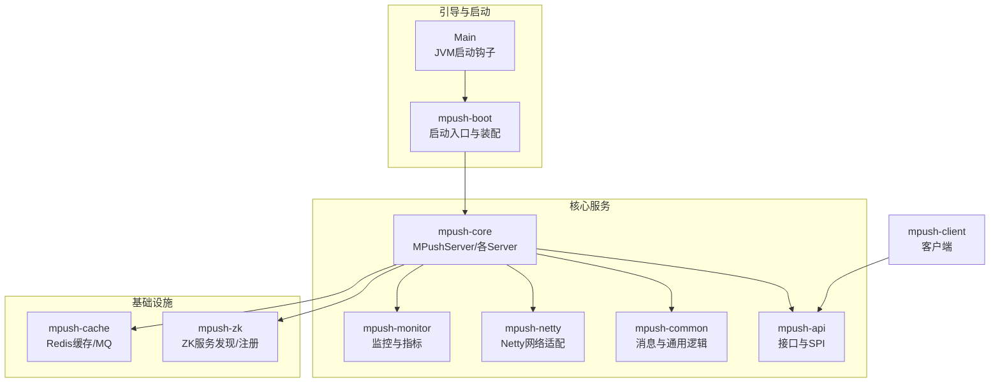
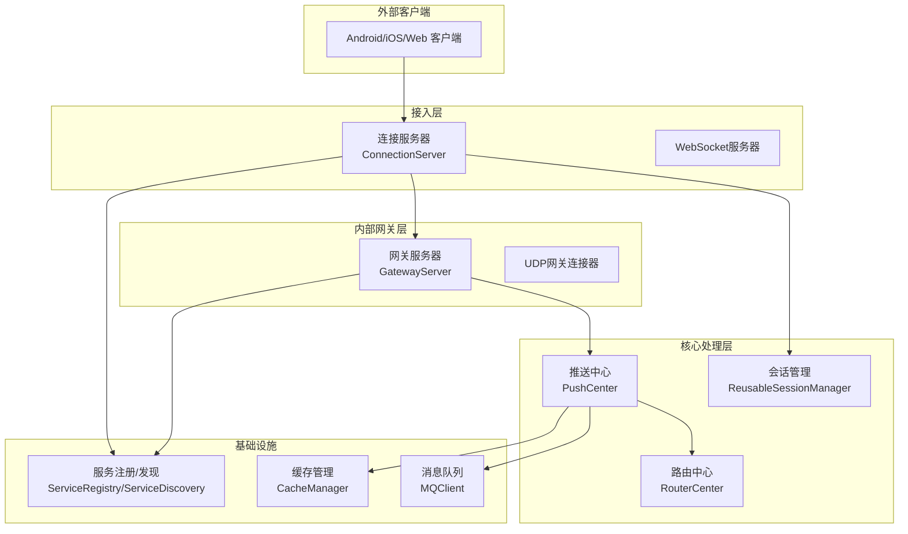
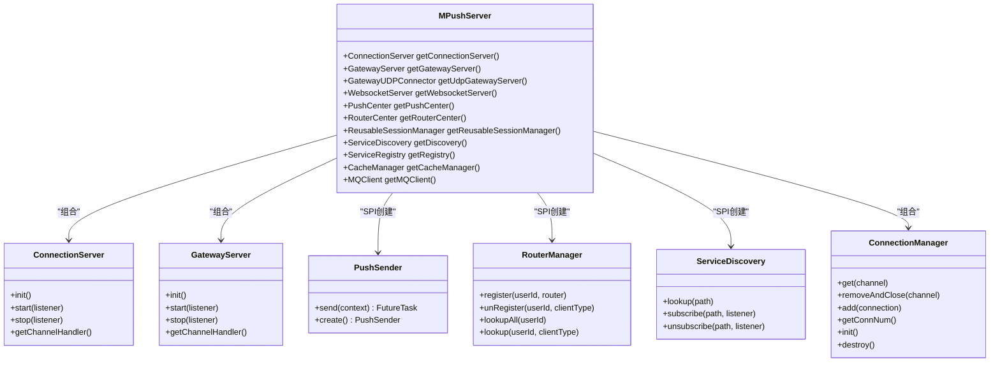
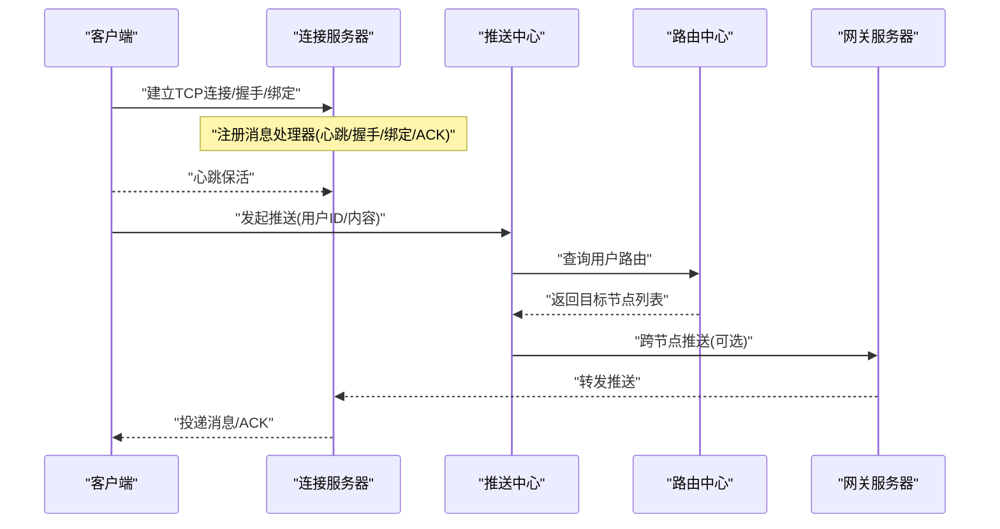
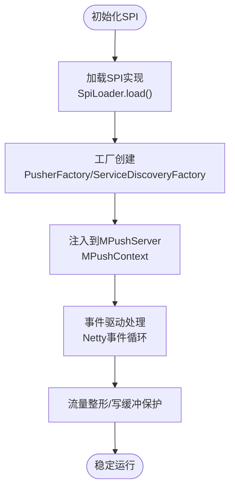
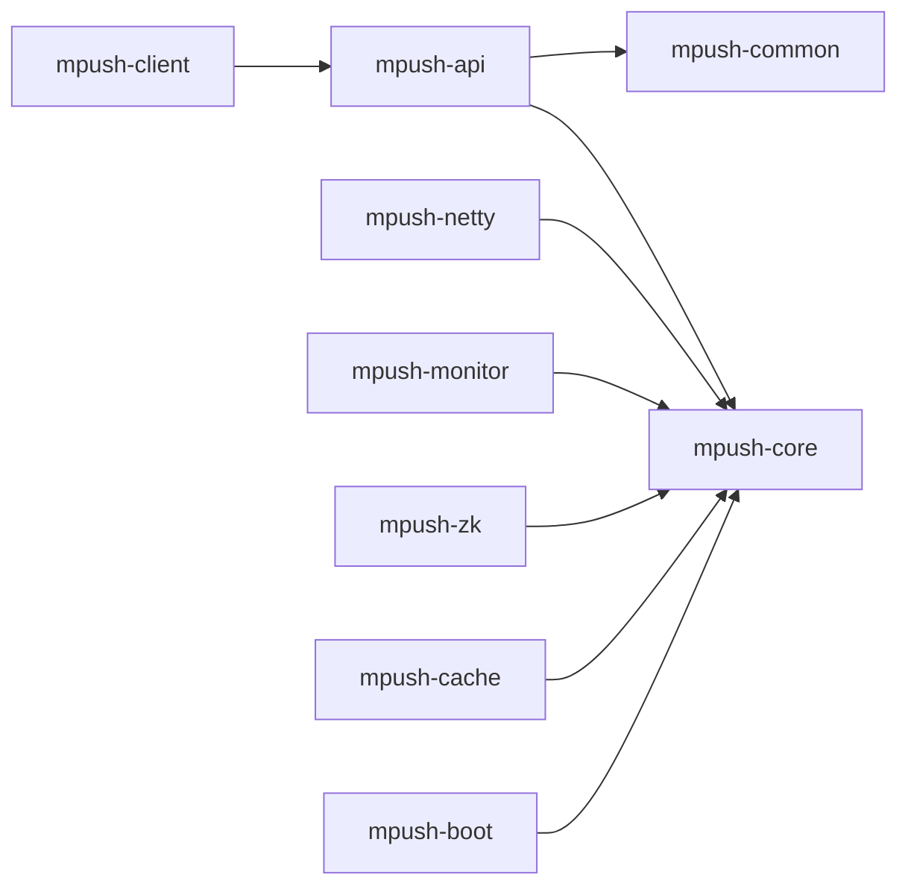

# 架构设计

<cite>
**本文引用的文件**
- [README.md](file://README.md)
- [pom.xml](file://pom.xml)
- [MPushContext.java](file://mpush-api/src/main/java/com/MPush/api/MPushContext.java)
- [Main.java](file://mpush-boot/src/main/java/com/MPush/bootstrap/Main.java)
- [MPushServer.java](file://mpush-core/src/main/java/com/MPush/core/MPushServer.java)
- [ConnectionServer.java](file://mpush-core/src/main/java/com/MPush/core/server/ConnectionServer.java)
- [GatewayServer.java](file://mpush-core/src/main/java/com/MPush/core/server/GatewayServer.java)
- [Server.java](file://mpush-api/src/main/java/com/MPush/api/service/Server.java)
- [RouterManager.java](file://mpush-api/src/main/java/com/MPush/api/router/RouterManager.java)
- [PushSender.java](file://mpush-api/src/main/java/com/MPush/api/push/PushSender.java)
- [Plugin.java](file://mpush-api/src/main/java/com/MPush/api/spi/Plugin.java)
- [SpiLoader.java](file://mpush-api/src/main/java/com/MPush/api/spi/SpiLoader.java)
- [ServiceDiscovery.java](file://mpush-api/src/main/java/com/MPush/api/srd/ServiceDiscovery.java)
- [ConnectionManager.java](file://mpush-api/src/main/java/com/MPush/api/connection/ConnectionManager.java)
- [BaseMessage.java](file://mpush-common/src/main/java/com/MPush/common/message/BaseMessage.java)
</cite>

## 目录
1. [简介](#简介)
2. [项目结构](#项目结构)
3. [核心组件](#核心组件)
4. [架构总览](#架构总览)
5. [详细组件分析](#详细组件分析)
6. [依赖分析](#依赖分析)
7. [性能考量](#性能考量)
8. [故障排查指南](#故障排查指南)
9. [结论](#结论)
10. [附录](#附录)

## 简介
本文件面向MPush项目的架构设计文档，目标是帮助读者理解系统的高层架构、服务角色划分（连接服务器、网关服务器、推送中心等）、模块化设计原则、组件交互关系、数据流路径、关键设计模式的应用，以及技术选型与权衡（如Netty、服务发现等）。文档同时提供架构图与组件关系图，便于非专业读者也能快速把握系统全貌。

## 项目结构
MPush采用多模块Maven聚合工程组织，核心模块包括API层、核心服务、网络适配、通用工具、监控、客户端、ZooKeeper服务发现与注册、缓存与消息队列适配等。模块间通过SPI机制解耦，便于替换实现（例如缓存、MQ、服务发现）。

**图表来源**
- [pom.xml](file://pom.xml#L54-L66)
- [Main.java](file://mpush-boot/src/main/java/com/MPush/bootstrap/Main.java#L31-L38)
- [MPushServer.java](file://mpush-core/src/main/java/com/MPush/core/MPushServer.java#L48-L96)

**章节来源**
- [pom.xml](file://pom.xml#L54-L66)
- [README.md](file://README.md#L32-L87)

## 核心组件
- MPushServer：系统主容器，负责组装连接服务器、网关服务器、推送中心、路由器中心、会话管理、监控、HTTP客户端等，并通过SPI暴露服务发现、注册、缓存、MQ等能力。
- ConnectionServer：对外长连接接入服务，基于Netty提供TCP监听，注册各类协议处理器（握手、绑定、心跳、ACK、HTTP代理等），内置流量整形与写缓冲水位保护。
- GatewayServer：内部网关服务，负责接收来自其他节点的推送指令，支持TCP/UDT/SCTP多种通道类型，同样具备流量整形与缓冲保护。
- PushSender：推送发送器抽象，通过SPI工厂创建具体实现，支持同步/异步推送与回调。
- RouterManager：路由管理接口，提供用户路由注册、注销、查询等能力，支撑消息路由与分发。
- ServiceDiscovery：服务发现接口，提供服务节点查询与订阅变更能力，配合ZK实现服务发现。
- ConnectionManager：连接管理接口，统一维护Channel与连接对象，提供增删查与生命周期管理。
- BaseMessage：消息基类，封装消息编解码、压缩、加密、JSON/二进制体处理、发送与线程调度等通用逻辑。

**章节来源**
- [MPushServer.java](file://mpush-core/src/main/java/com/MPush/core/MPushServer.java#L48-L181)
- [ConnectionServer.java](file://mpush-core/src/main/java/com/MPush/core/server/ConnectionServer.java#L58-L188)
- [GatewayServer.java](file://mpush-core/src/main/java/com/MPush/core/server/GatewayServer.java#L56-L186)
- [PushSender.java](file://mpush-api/src/main/java/com/MPush/api/push/PushSender.java#L33-L71)
- [RouterManager.java](file://mpush-api/src/main/java/com/MPush/api/router/RouterManager.java#L29-L65)
- [ServiceDiscovery.java](file://mpush-api/src/main/java/com/MPush/api/srd/ServiceDiscovery.java#L31-L38)
- [ConnectionManager.java](file://mpush-api/src/main/java/com/MPush/api/connection/ConnectionManager.java#L31-L44)
- [BaseMessage.java](file://mpush-common/src/main/java/com/MPush/common/message/BaseMessage.java#L42-L246)

## 架构总览
MPush采用“连接服务器 + 网关服务器 + 推送中心”的分布式部署架构。连接服务器负责对外长连接接入与协议处理；网关服务器负责内部节点间的消息转发与推送；推送中心负责消息路由、广播与单播任务调度；服务发现与注册通过ZooKeeper实现；缓存与消息队列通过SPI适配Redis实现。

**图表来源**
- [MPushServer.java](file://mpush-core/src/main/java/com/MPush/core/MPushServer.java#L48-L96)
- [ConnectionServer.java](file://mpush-core/src/main/java/com/MPush/core/server/ConnectionServer.java#L58-L96)
- [GatewayServer.java](file://mpush-core/src/main/java/com/MPush/core/server/GatewayServer.java#L56-L86)
- [ServiceDiscovery.java](file://mpush-api/src/main/java/com/MPush/api/srd/ServiceDiscovery.java#L31-L38)
- [MPushContext.java](file://mpush-api/src/main/java/com/MPush/api/MPushContext.java#L33-L45)

## 详细组件分析

### 组件关系与职责边界
- MPushServer：作为系统中枢，负责装配各子系统并提供SPI上下文（监控、服务发现、注册、缓存、MQ）。
- ConnectionServer：负责接入层协议处理与连接生命周期管理，内置流量整形与写缓冲保护，避免背压导致的内存膨胀。
- GatewayServer：负责内部节点间消息转发，支持多种传输协议，具备与接入层相同的限流与缓冲保护。
- PushCenter：负责消息推送任务的调度与执行，结合RouterCenter完成路由与分发。
- RouterCenter：负责用户路由的注册、查询与变更通知，支撑单播与广播场景。
- ServiceDiscovery/ServiceRegistry：通过SPI加载实现，当前模块提供ZK实现，用于服务节点发现与订阅。
- ConnectionManager：抽象连接管理，屏蔽底层实现差异。
- BaseMessage：抽象消息模型，统一编解码、压缩、加密、JSON/二进制体处理与发送。

**图表来源**
- [MPushServer.java](file://mpush-core/src/main/java/com/MPush/core/MPushServer.java#L48-L181)
- [ConnectionServer.java](file://mpush-core/src/main/java/com/MPush/core/server/ConnectionServer.java#L58-L188)
- [GatewayServer.java](file://mpush-core/src/main/java/com/MPush/core/server/GatewayServer.java#L56-L186)
- [PushSender.java](file://mpush-api/src/main/java/com/MPush/api/push/PushSender.java#L33-L71)
- [RouterManager.java](file://mpush-api/src/main/java/com/MPush/api/router/RouterManager.java#L29-L65)
- [ServiceDiscovery.java](file://mpush-api/src/main/java/com/MPush/api/srd/ServiceDiscovery.java#L31-L38)
- [ConnectionManager.java](file://mpush-api/src/main/java/com/MPush/api/connection/ConnectionManager.java#L31-L44)

**章节来源**
- [MPushServer.java](file://mpush-core/src/main/java/com/MPush/core/MPushServer.java#L48-L181)
- [ConnectionServer.java](file://mpush-core/src/main/java/com/MPush/core/server/ConnectionServer.java#L58-L188)
- [GatewayServer.java](file://mpush-core/src/main/java/com/MPush/core/server/GatewayServer.java#L56-L186)
- [PushSender.java](file://mpush-api/src/main/java/com/MPush/api/push/PushSender.java#L33-L71)
- [RouterManager.java](file://mpush-api/src/main/java/com/MPush/api/router/RouterManager.java#L29-L65)
- [ServiceDiscovery.java](file://mpush-api/src/main/java/com/MPush/api/srd/ServiceDiscovery.java#L31-L38)
- [ConnectionManager.java](file://mpush-api/src/main/java/com/MPush/api/connection/ConnectionManager.java#L31-L44)

### 数据流架构：从客户端连接到消息推送
- 客户端通过连接服务器建立长连接，握手、绑定用户身份后进入心跳保活状态。
- 应用侧通过PushSender发起推送，消息经推送中心调度，结合路由中心定位目标节点。
- 若目标在本地，直接通过连接服务器发送；若在远端，通过网关服务器转发至目标节点。
- 网关服务器收到推送后，由连接服务器将消息送达目标客户端。

**图表来源**
- [ConnectionServer.java](file://mpush-core/src/main/java/com/MPush/core/server/ConnectionServer.java#L79-L87)
- [GatewayServer.java](file://mpush-core/src/main/java/com/MPush/core/server/GatewayServer.java#L76-L76)
- [PushSender.java](file://mpush-api/src/main/java/com/MPush/api/push/PushSender.java#L50-L50)
- [RouterManager.java](file://mpush-api/src/main/java/com/MPush/api/router/RouterManager.java#L38-L64)

**章节来源**
- [ConnectionServer.java](file://mpush-core/src/main/java/com/MPush/core/server/ConnectionServer.java#L79-L87)
- [GatewayServer.java](file://mpush-core/src/main/java/com/MPush/core/server/GatewayServer.java#L76-L76)
- [PushSender.java](file://mpush-api/src/main/java/com/MPush/api/push/PushSender.java#L50-L50)
- [RouterManager.java](file://mpush-api/src/main/java/com/MPush/api/router/RouterManager.java#L38-L64)

### 关键设计模式与实现要点
- 工厂模式：PushSender通过PusherFactory创建具体实现；MPushServer通过SPI工厂创建ServiceDiscovery、ServiceRegistry、CacheManager、MQClient等。
- 观察者模式：ServiceDiscovery支持订阅/取消订阅，服务节点变化时触发回调；事件总线用于内部事件分发。
- 事件驱动模式：基于Netty事件循环与线程池，消息处理与推送任务均采用事件驱动的方式异步执行。
- SPI与插件化：通过META-INF/services与SpiLoader实现插件化加载，支持替换缓存、MQ、服务发现、线程池等实现。
- 流量整形与背压保护：ConnectionServer与GatewayServer均内置GlobalChannelTrafficShapingHandler与WriteBufferWaterMark，防止洪泛与内存膨胀。

**图表来源**
- [SpiLoader.java](file://mpush-api/src/main/java/com/MPush/api/spi/SpiLoader.java#L32-L95)
- [MPushContext.java](file://mpush-api/src/main/java/com/MPush/api/MPushContext.java#L33-L45)
- [ConnectionServer.java](file://mpush-core/src/main/java/com/MPush/core/server/ConnectionServer.java#L88-L95)
- [GatewayServer.java](file://mpush-core/src/main/java/com/MPush/core/server/GatewayServer.java#L78-L85)

**章节来源**
- [SpiLoader.java](file://mpush-api/src/main/java/com/MPush/api/spi/SpiLoader.java#L32-L95)
- [MPushContext.java](file://mpush-api/src/main/java/com/MPush/api/MPushContext.java#L33-L45)
- [ConnectionServer.java](file://mpush-core/src/main/java/com/MPush/core/server/ConnectionServer.java#L88-L95)
- [GatewayServer.java](file://mpush-core/src/main/java/com/MPush/core/server/GatewayServer.java#L78-L85)

## 依赖分析
- 模块依赖：pom.xml中声明了各模块间的父子关系与依赖范围，核心模块包括API、核心、网络、通用、监控、客户端、ZK、缓存等。
- 外部依赖：Netty、Curator（ZK）、Jedis（Redis）、SLF4J/Logback、Typesafe Config等。
- SPI扩展：通过ServiceLoader机制加载实现类，支持替换缓存、MQ、服务发现、线程池等。

**图表来源**
- [pom.xml](file://pom.xml#L54-L66)

**章节来源**
- [pom.xml](file://pom.xml#L54-L66)

## 性能考量
- Netty事件驱动与零拷贝：基于Netty的高性能网络栈，结合ByteBuf与流水线处理，降低内存复制与上下文切换。
- 流量整形与写缓冲保护：接入层与网关层均支持全局与通道级流量整形，以及高/低水位写保护，避免洪泛与背压。
- 压缩与加密：消息体在超过阈值时自动压缩，支持对称/非对称加密，平衡安全性与性能。
- 线程池与限流：按角色配置独立线程池，结合全局与广播流控策略，保障系统稳定性。
- 缓存与MQ：通过SPI适配Redis，利用其高性能特性支撑路由与消息分发。

**章节来源**
- [ConnectionServer.java](file://mpush-core/src/main/java/com/MPush/core/server/ConnectionServer.java#L132-L174)
- [GatewayServer.java](file://mpush-core/src/main/java/com/MPush/core/server/GatewayServer.java#L121-L155)
- [BaseMessage.java](file://mpush-common/src/main/java/com/MPush/common/message/BaseMessage.java#L109-L134)
- [README.md](file://README.md#L293-L308)

## 故障排查指南
- 启停流程：Main通过JVM ShutdownHook确保优雅停机，避免资源泄漏。
- 连接异常：检查连接服务器的写缓冲水位与流量整形配置，确认客户端网络质量与心跳间隔。
- 跨节点推送失败：检查服务发现与注册状态，确认目标节点是否在线且路由正确。
- 消息堆积：关注事件总线与MQ线程池队列长度，必要时扩容或调整限流策略。
- 监控与诊断：启用监控与JMX指标，定期查看线程池、GC、内存与QPS指标。

**章节来源**
- [Main.java](file://mpush-boot/src/main/java/com/MPush/bootstrap/Main.java#L49-L62)
- [ConnectionServer.java](file://mpush-core/src/main/java/com/MPush/core/server/ConnectionServer.java#L171-L173)
- [GatewayServer.java](file://mpush-core/src/main/java/com/MPush/core/server/GatewayServer.java#L151-L155)
- [README.md](file://README.md#L310-L318)

## 结论
MPush通过清晰的服务角色划分、模块化与SPI解耦设计、事件驱动与Netty高性能网络栈，构建了可扩展、可观测、可运维的分布式推送系统。接入层与网关层的限流与背压保护、路由与推送中心的协同、以及ZooKeeper与Redis的基础设施支撑，共同保证了系统的高可用与高性能。

## 附录
- 启动入口：ServerLauncher与Main负责系统启动与优雅停机。
- 配置参考：mpush.conf与reference.conf提供网络、安全、线程池、流控、监控等配置项。

**章节来源**
- [Main.java](file://mpush-boot/src/main/java/com/MPush/bootstrap/Main.java#L31-L38)
- [README.md](file://README.md#L56-L87)