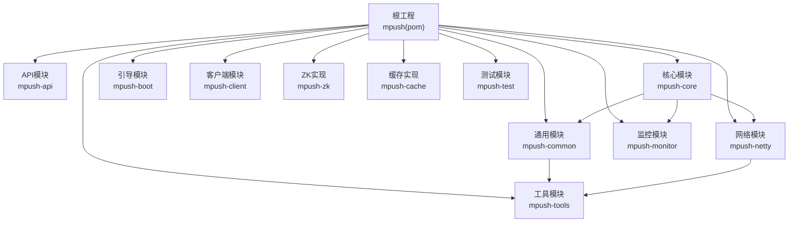
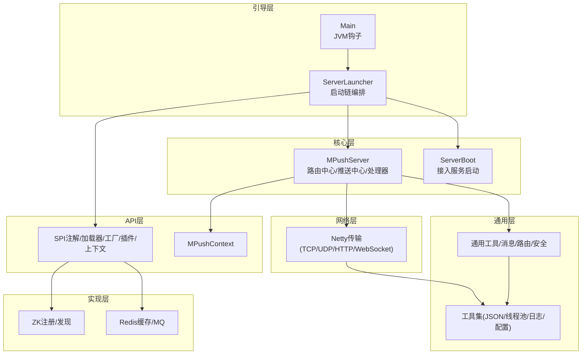
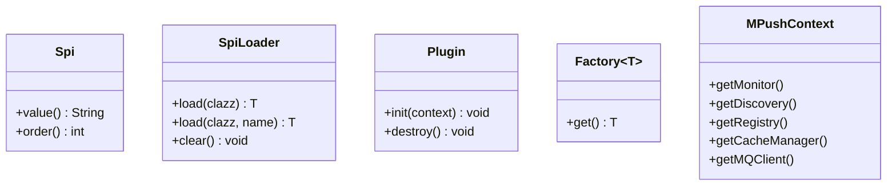
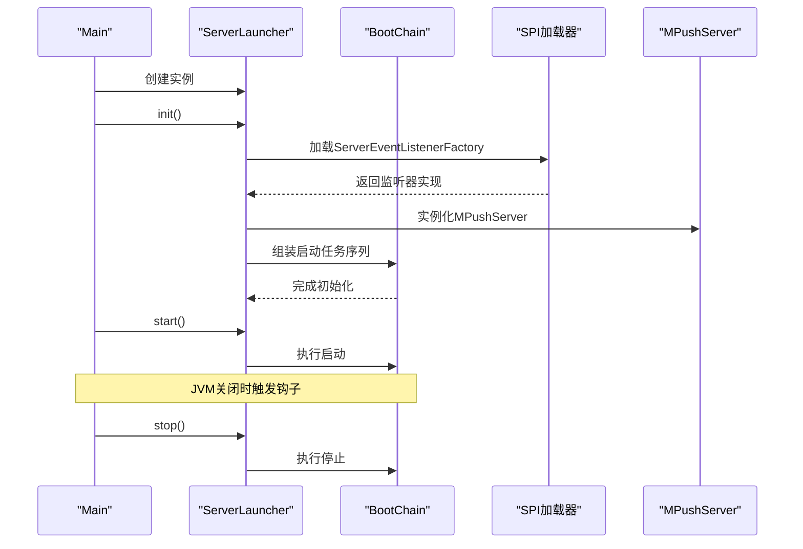
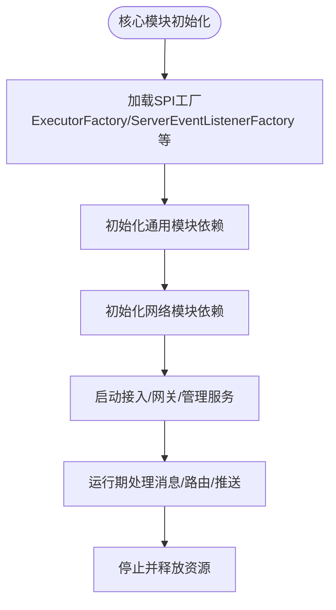
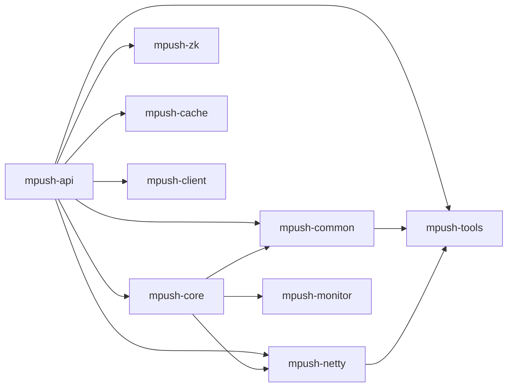

# 模块化设计

<cite>
**本文引用的文件**
- [pom.xml](file://pom.xml)
- [mpush-api/pom.xml](file://mpush-api/pom.xml)
- [mpush-core/pom.xml](file://mpush-core/pom.xml)
- [mpush-common/pom.xml](file://mpush-common/pom.xml)
- [mpush-netty/pom.xml](file://mpush-netty/pom.xml)
- [mpush-api/src/main/java/com/mpush/api/spi/Spi.java](file://mpush-api/src/main/java/com/mpush/api/spi/Spi.java)
- [mpush-api/src/main/java/com/mpush/api/spi/SpiLoader.java](file://mpush-api/src/main/java/com/mpush/api/spi/SpiLoader.java)
- [mpush-api/src/main/java/com/mpush/api/spi/Plugin.java](file://mpush-api/src/main/java/com/mpush/api/spi/Plugin.java)
- [mpush-api/src/main/java/com/mpush/api/spi/Factory.java](file://mpush-api/src/main/java/com/mpush/api/spi/Factory.java)
- [mpush-api/src/main/java/com/mpush/api/MPushContext.java](file://mpush-api/src/main/java/com/mpush/api/MPushContext.java)
- [mpush-boot/src/main/java/com/mpush/bootstrap/Main.java](file://mpush-boot/src/main/java/com/mpush/bootstrap/Main.java)
- [mpush-boot/src/main/java/com/mpush/bootstrap/ServerLauncher.java](file://mpush-boot/src/main/java/com/mpush/bootstrap/ServerLauncher.java)
- [mpush-common/src/main/resources/META-INF/services/com.mpush.api.spi.core.RsaCipherFactory](file://mpush-common/src/main/resources/META-INF/services/com.mpush.api.spi.core.RsaCipherFactory)
- [mpush-core/src/main/resources/META-INF/services/com.mpush.api.spi.common.ExecutorFactory](file://mpush-core/src/main/resources/META-INF/services/com.mpush.api.spi.common.ExecutorFactory)
- [mpush-common/src/main/resources/META-INF/services/com.mpush.api.spi.common.ExecutorFactory](file://mpush-common/src/main/resources/META-INF/services/com.mpush.api.spi.common.ExecutorFactory)
</cite>

## 目录
1. [引言](#引言)
2. [项目结构](#项目结构)
3. [核心组件](#核心组件)
4. [架构总览](#架构总览)
5. [详细组件分析](#详细组件分析)
6. [依赖分析](#依赖分析)
7. [性能考虑](#性能考虑)
8. [故障排查指南](#故障排查指南)
9. [结论](#结论)
10. [附录](#附录)

## 引言
本文件面向MPush项目的模块化设计，系统阐述模块划分原则、设计理念、职责边界、依赖关系与接口契约，并重点解析基于SPI（Service Provider Interface）的可插拔机制、模块生命周期管理（初始化顺序、依赖注入、资源清理）、模块化带来的收益（代码复用、测试隔离、团队协作），以及模块扩展点与第三方模块集成方式。文档同时提供模块依赖图与接口关系图，帮助读者快速理解系统的内聚性与耦合度。

## 项目结构
MPush采用多模块Maven工程组织，顶层pom集中管理版本与依赖，子模块按功能域拆分：API抽象层、核心业务、通用工具、网络传输、客户端、监控、注册发现、缓存实现、ZooKeeper实现、测试等。模块间通过明确的依赖声明与SPI契约解耦，形成高内聚、低耦合的架构。

图表来源
- [pom.xml](file://pom.xml#L54-L66)
- [mpush-core/pom.xml](file://mpush-core/pom.xml#L21-L34)
- [mpush-common/pom.xml](file://mpush-common/pom.xml#L19-L24)
- [mpush-netty/pom.xml](file://mpush-netty/pom.xml#L21-L55)

章节来源
- [pom.xml](file://pom.xml#L54-L66)

## 核心组件
- mpush-api：定义跨模块的公共接口、事件模型、协议包、推送上下文与SPI抽象（含注解、加载器、工厂、插件、上下文接口）。该模块不包含具体实现，仅承担契约与抽象职责。
- mpush-core：核心业务逻辑，包含连接管理、握手、心跳、ACK、路由中心、推送中心、网关处理、服务器通道处理器等。依赖mpush-netty与mpush-common，并引入监控模块。
- mpush-common：通用能力封装，如消息编解码、条件判断、流量控制、安全算法、用户管理、路由器本地实现等。依赖mpush-tools。
- mpush-netty：网络传输层，基于Netty实现TCP/UDP/WebSocket/HTTP客户端与服务端、编解码器、连接管理与HTTP代理等。
- mpush-tools：通用工具集，包含JSON、线程池、日志、配置、加密、事件总线等基础设施，被多个模块复用。
- mpush-boot：应用引导入口，负责启动链路编排、服务监听器初始化、JVM关闭钩子等。
- mpush-client：客户端SDK，包含连接、网关交互、推送请求与监听等。
- mpush-monitor：监控与指标采集，提供JMX Bean与统计信息。
- mpush-zk：基于ZooKeeper的服务注册与发现实现。
- mpush-cache：基于Redis的缓存与消息队列实现。
- mpush-test：测试样例与SPI实现示例。

章节来源
- [mpush-api/pom.xml](file://mpush-api/pom.xml#L21-L32)
- [mpush-core/pom.xml](file://mpush-core/pom.xml#L21-L34)
- [mpush-common/pom.xml](file://mpush-common/pom.xml#L19-L24)
- [mpush-netty/pom.xml](file://mpush-netty/pom.xml#L21-L55)
- [pom.xml](file://pom.xml#L54-L66)

## 架构总览
下图展示了模块化架构中各模块的职责与交互关系，强调API契约驱动、SPI可插拔与启动链编排。

图表来源
- [mpush-boot/src/main/java/com/mpush/bootstrap/ServerLauncher.java](file://mpush-boot/src/main/java/com/mpush/bootstrap/ServerLauncher.java#L42-L71)
- [mpush-boot/src/main/java/com/mpush/bootstrap/Main.java](file://mpush-boot/src/main/java/com/mpush/bootstrap/Main.java#L31-L38)
- [mpush-api/src/main/java/com/mpush/api/MPushContext.java](file://mpush-api/src/main/java/com/mpush/api/MPushContext.java#L33-L45)
- [mpush-core/pom.xml](file://mpush-core/pom.xml#L21-L34)
- [mpush-common/pom.xml](file://mpush-common/pom.xml#L19-L24)
- [mpush-netty/pom.xml](file://mpush-netty/pom.xml#L21-L55)

## 详细组件分析

### 模块划分原则与设计理念
- 单一职责：每个模块聚焦特定领域（API、核心、通用、网络、客户端、监控、实现等）。
- 契约优先：API模块定义稳定接口与SPI，其他模块仅依赖契约，避免直接耦合具体实现。
- 可插拔：通过META-INF/services与SPI注解/加载器实现运行时替换与扩展。
- 分层清晰：引导层负责生命周期与编排；API层定义契约；核心层承载业务；通用层提供基础能力；网络层提供传输；实现层提供具体落地方案。

章节来源
- [pom.xml](file://pom.xml#L54-L66)
- [mpush-api/src/main/java/com/mpush/api/spi/Spi.java](file://mpush-api/src/main/java/com/mpush/api/spi/Spi.java#L32-L48)
- [mpush-api/src/main/java/com/mpush/api/spi/SpiLoader.java](file://mpush-api/src/main/java/com/mpush/api/spi/SpiLoader.java#L32-L50)

### mpush-api：接口与SPI契约
- 关键接口与类型
  - 注解：Spi（命名与排序）
  - 加载器：SpiLoader（ServiceLoader封装、缓存、按名称/排序过滤）
  - 插件：Plugin（可选的init/destroy生命周期）
  - 工厂：Factory（泛型工厂函数式接口）
  - 上下文：MPushContext（对外暴露监控、注册/发现、缓存、MQ等能力）
- 设计要点
  - 以最小接口集覆盖核心能力，确保其他模块只感知契约。
  - 通过SPI实现“默认实现可替换”，便于在不同环境选择不同实现（如ZK或Redis）。

图表来源
- [mpush-api/src/main/java/com/mpush/api/spi/Spi.java](file://mpush-api/src/main/java/com/mpush/api/spi/Spi.java#L32-L48)
- [mpush-api/src/main/java/com/mpush/api/spi/SpiLoader.java](file://mpush-api/src/main/java/com/mpush/api/spi/SpiLoader.java#L32-L50)
- [mpush-api/src/main/java/com/mpush/api/spi/Plugin.java](file://mpush-api/src/main/java/com/mpush/api/spi/Plugin.java#L29-L38)
- [mpush-api/src/main/java/com/mpush/api/spi/Factory.java](file://mpush-api/src/main/java/com/mpush/api/spi/Factory.java#L30-L31)
- [mpush-api/src/main/java/com/mpush/api/MPushContext.java](file://mpush-api/src/main/java/com/mpush/api/MPushContext.java#L33-L45)

章节来源
- [mpush-api/src/main/java/com/mpush/api/spi/Spi.java](file://mpush-api/src/main/java/com/mpush/api/spi/Spi.java#L32-L48)
- [mpush-api/src/main/java/com/mpush/api/spi/SpiLoader.java](file://mpush-api/src/main/java/com/mpush/api/spi/SpiLoader.java#L32-L50)
- [mpush-api/src/main/java/com/mpush/api/spi/Plugin.java](file://mpush-api/src/main/java/com/mpush/api/spi/Plugin.java#L29-L38)
- [mpush-api/src/main/java/com/mpush/api/spi/Factory.java](file://mpush-api/src/main/java/com/mpush/api/spi/Factory.java#L30-L31)
- [mpush-api/src/main/java/com/mpush/api/MPushContext.java](file://mpush-api/src/main/java/com/mpush/api/MPushContext.java#L33-L45)

### mpush-boot：启动链与生命周期
- 入口Main负责初始化日志、创建ServerLauncher并注册JVM关闭钩子。
- ServerLauncher完成以下生命周期步骤：
  - 初始化MPushServer与ServerEventListener（通过SPI加载）
  - 组装启动链：缓存、注册/发现、接入服务（TCP/UDP/WebSocket/Admin）、路由中心、推送中心、HTTP代理、监控
  - 提供start/stop方法，配合JVM钩子进行优雅停机

图表来源
- [mpush-boot/src/main/java/com/mpush/bootstrap/Main.java](file://mpush-boot/src/main/java/com/mpush/bootstrap/Main.java#L31-L38)
- [mpush-boot/src/main/java/com/mpush/bootstrap/ServerLauncher.java](file://mpush-boot/src/main/java/com/mpush/bootstrap/ServerLauncher.java#L42-L71)

章节来源
- [mpush-boot/src/main/java/com/mpush/bootstrap/Main.java](file://mpush-boot/src/main/java/com/mpush/bootstrap/Main.java#L31-L38)
- [mpush-boot/src/main/java/com/mpush/bootstrap/ServerLauncher.java](file://mpush-boot/src/main/java/com/mpush/bootstrap/ServerLauncher.java#L42-L71)

### mpush-core：核心业务与模块依赖
- 职责边界：连接管理、握手/心跳/ACK、消息处理、路由中心、推送中心、网关处理、服务器通道处理器。
- 依赖关系：依赖mpush-netty（传输）、mpush-common（通用）、mpush-monitor（监控）。
- SPI使用：通过META-INF/services注册ExecutorFactory、ServerEventListenerFactory、BindValidatorFactory、PushHandlerFactory、PushListenerFactory等，运行时由SPI加载器解析。

图表来源
- [mpush-core/pom.xml](file://mpush-core/pom.xml#L21-L34)
- [mpush-core/src/main/resources/META-INF/services/com.mpush.api.spi.common.ExecutorFactory](file://mpush-core/src/main/resources/META-INF/services/com.mpush.api.spi.common.ExecutorFactory#L1-L1)

章节来源
- [mpush-core/pom.xml](file://mpush-core/pom.xml#L21-L34)
- [mpush-core/src/main/resources/META-INF/services/com.mpush.api.spi.common.ExecutorFactory](file://mpush-core/src/main/resources/META-INF/services/com.mpush.api.spi.common.ExecutorFactory#L1-L1)

### mpush-common：通用能力与SPI实现
- 职责边界：消息编解码、条件判断、流量控制、安全算法（RSA/AES）、用户管理、本地路由与远程路由、DNS映射等。
- 依赖关系：依赖mpush-tools。
- SPI实现：通过META-INF/services注册RsaCipherFactory、DnsMappingManager、ClientClassifierFactory等。

章节来源
- [mpush-common/pom.xml](file://mpush-common/pom.xml#L19-L24)
- [mpush-common/src/main/resources/META-INF/services/com.mpush.api.spi.core.RsaCipherFactory](file://mpush-common/src/main/resources/META-INF/services/com.mpush.api.spi.core.RsaCipherFactory#L1-L2)

### mpush-netty：网络传输与编解码
- 职责边界：基于Netty的TCP/UDP/HTTP/WebSocket客户端与服务端，编解码器、连接管理、HTTP代理等。
- 依赖关系：依赖mpush-tools与Netty生态。

章节来源
- [mpush-netty/pom.xml](file://mpush-netty/pom.xml#L21-L55)

### mpush-tools：基础设施与可插拔点
- 职责边界：JSON、线程池、日志、配置、加密、事件总线等通用工具。
- SPI实现：通过META-INF/services注册JsonFactory等。

章节来源
- [mpush-common/pom.xml](file://mpush-common/pom.xml#L19-L24)

### mpush-client、mpush-monitor、mpush-zk、mpush-cache：扩展与实现
- mpush-client：客户端SDK，注册PusherFactory与ExecutorFactory等SPI实现。
- mpush-monitor：监控与JMX指标。
- mpush-zk：基于ZooKeeper的服务注册/发现实现，注册ServiceDiscoveryFactory与ServiceRegistryFactory等SPI实现。
- mpush-cache：基于Redis的缓存与MQ实现，注册CacheManagerFactory与MQClientFactory等SPI实现。

章节来源
- [pom.xml](file://pom.xml#L61-L66)

## 依赖分析
- 模块内聚性：API模块高度内聚于契约；核心模块内聚于业务流程；通用模块内聚于通用能力；网络模块内聚于传输细节。
- 模块耦合度：通过API模块与SPI降低耦合；核心模块对通用与网络模块存在直接依赖；通用模块对工具模块存在直接依赖。
- 外部依赖：Netty、Curator、Jedis、Typesafe Config、SLF4J+Logback等。

图表来源
- [pom.xml](file://pom.xml#L54-L66)
- [mpush-core/pom.xml](file://mpush-core/pom.xml#L21-L34)
- [mpush-common/pom.xml](file://mpush-common/pom.xml#L19-L24)
- [mpush-netty/pom.xml](file://mpush-netty/pom.xml#L21-L55)

章节来源
- [pom.xml](file://pom.xml#L54-L66)
- [mpush-core/pom.xml](file://mpush-core/pom.xml#L21-L34)
- [mpush-common/pom.xml](file://mpush-common/pom.xml#L19-L24)
- [mpush-netty/pom.xml](file://mpush-netty/pom.xml#L21-L55)

## 性能考虑
- SPI缓存：SpiLoader对已加载实例进行缓存，减少重复ServiceLoader开销。
- 线程池与编解码：网络与消息处理应结合线程池配置与编解码器优化，避免阻塞与内存抖动。
- 流量控制：通用模块提供多种流控策略，建议根据业务场景选择合适策略并结合监控指标动态调整。
- 监控与JMX：启用监控模块，关注连接数、消息吞吐、延迟与错误率，及时发现性能瓶颈。

## 故障排查指南
- SPI未找到实现：检查META-INF/services中是否存在对应接口的实现类名，确认打包包含resources。
- 启动失败：查看ServerLauncher启动链日志，定位具体阶段（缓存/注册/发现/接入/路由/推送/监控）。
- 关闭异常：确认JVM钩子是否正确注册，检查Stop流程是否抛出未捕获异常。
- 安全与编解码：核对RSA/AES实现与密钥配置，确保编解码器与协议一致。

章节来源
- [mpush-api/src/main/java/com/mpush/api/spi/SpiLoader.java](file://mpush-api/src/main/java/com/mpush/api/spi/SpiLoader.java#L64-L66)
- [mpush-boot/src/main/java/com/mpush/bootstrap/ServerLauncher.java](file://mpush-boot/src/main/java/com/mpush/bootstrap/ServerLauncher.java#L77-L79)
- [mpush-boot/src/main/java/com/mpush/bootstrap/Main.java](file://mpush-boot/src/main/java/com/mpush/bootstrap/Main.java#L49-L62)

## 结论
MPush通过清晰的模块划分与契约驱动的SPI机制，实现了高内聚、低耦合与强可插拔性。API模块定义稳定接口，核心模块承载业务，通用与网络模块提供基础能力，引导模块统一生命周期管理。该设计提升了代码复用、测试隔离与团队协作效率，便于在不同环境灵活替换实现并扩展新能力。

## 附录
- SPI实现清单（示例）
  - RsaCipherFactory：用于RSA加解密实现
  - ExecutorFactory：用于线程池实现
  - ServiceDiscoveryFactory/ServiceRegistryFactory：用于服务注册/发现实现
  - CacheManagerFactory/MQClientFactory：用于缓存与消息队列实现
  - PusherFactory：用于客户端推送实现
- 集成步骤
  - 在目标模块resources/META-INF/services目录下新增接口全限定名文件，内容为实现类全限定名
  - 实现类需满足SPI注解与加载器约定（可选命名与排序）
  - 通过ServerLauncher或相应模块初始化时自动加载

章节来源
- [mpush-common/src/main/resources/META-INF/services/com.mpush.api.spi.core.RsaCipherFactory](file://mpush-common/src/main/resources/META-INF/services/com.mpush.api.spi.core.RsaCipherFactory#L1-L2)
- [mpush-core/src/main/resources/META-INF/services/com.mpush.api.spi.common.ExecutorFactory](file://mpush-core/src/main/resources/META-INF/services/com.mpush.api.spi.common.ExecutorFactory#L1-L1)
- [mpush-common/src/main/resources/META-INF/services/com.mpush.api.spi.common.ExecutorFactory](file://mpush-common/src/main/resources/META-INF/services/com.mpush.api.spi.common.ExecutorFactory#L1-L1)