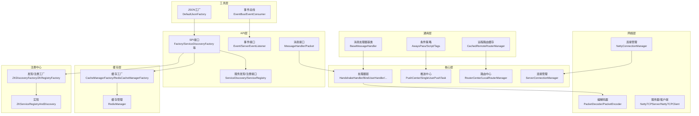
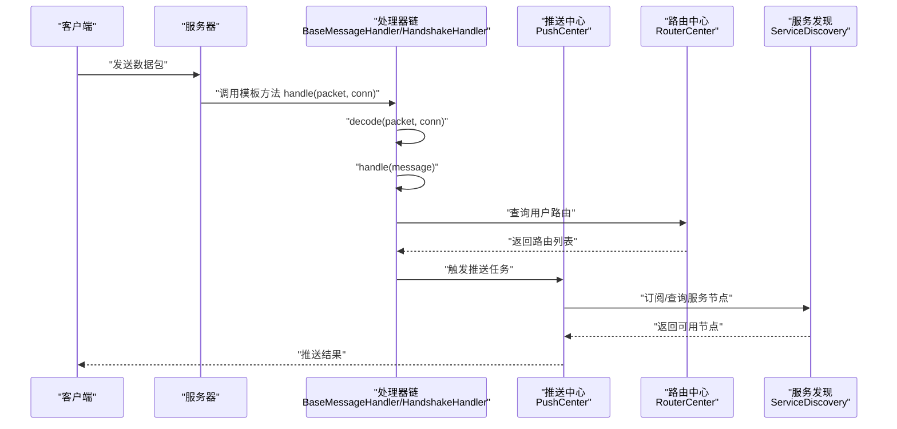
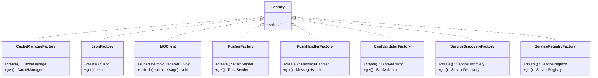
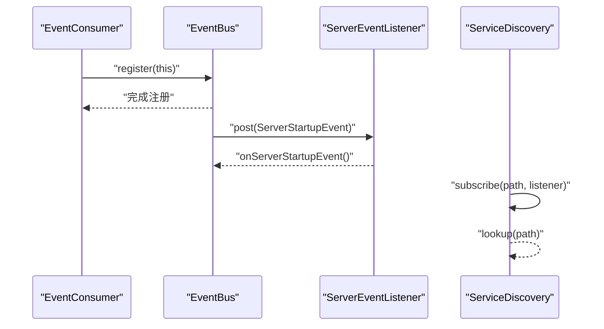
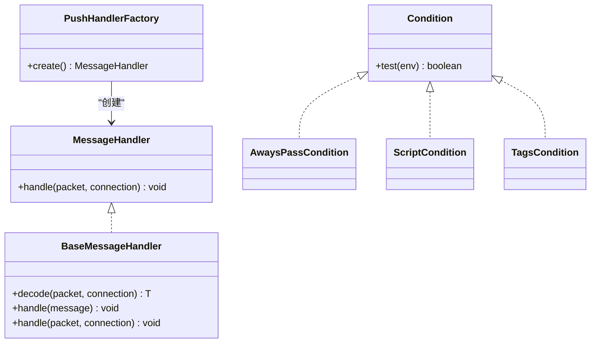
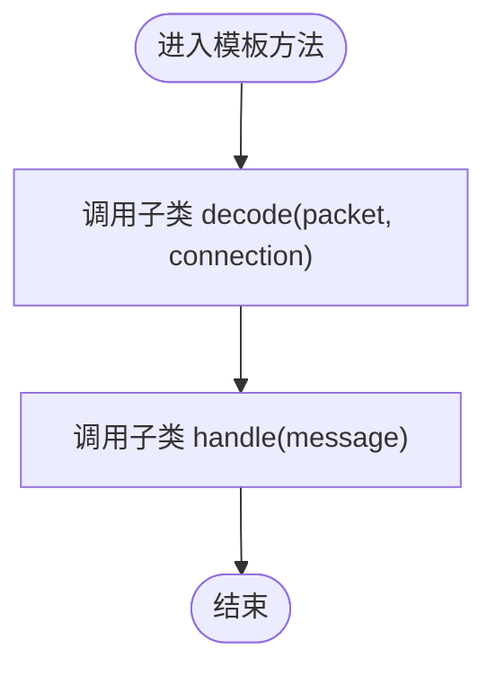
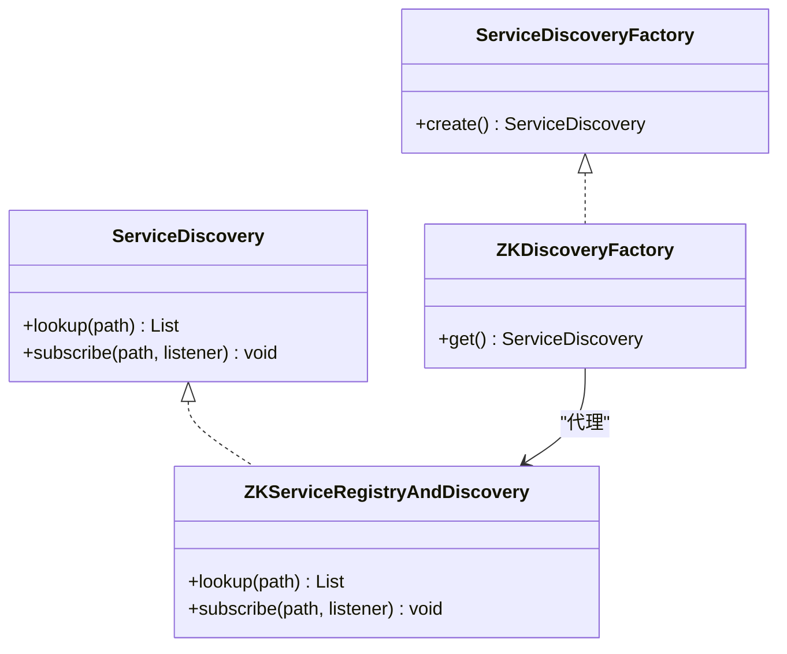
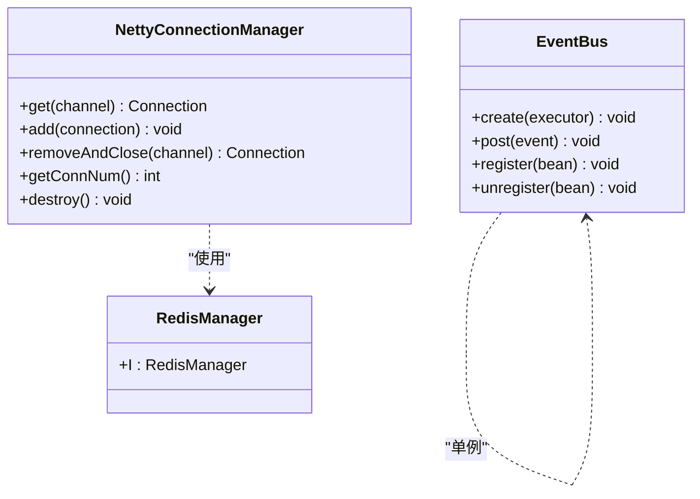
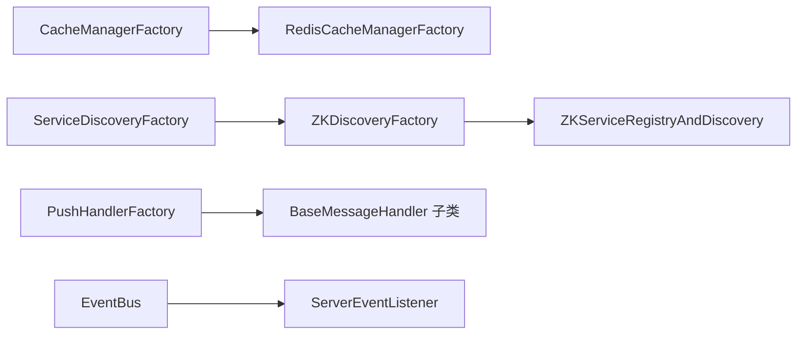

# 设计模式应用

<cite>
**本文引用的文件**
- [mpush-api/src/main/java/com/mpush/api/spi/Factory.java](file://mpush-api/src/main/java/com/mpush/api/spi/Factory.java)
- [mpush-api/src/main/java/com/mpush/api/spi/common/CacheManagerFactory.java](file://mpush-api/src/main/java/com/mpush/api/spi/common/CacheManagerFactory.java)
- [mpush-api/src/main/java/com/mpush/api/spi/common/JsonFactory.java](file://mpush-api/src/main/java/com/mpush/api/spi/common/JsonFactory.java)
- [mpush-api/src/main/java/com/mpush/api/spi/common/MQClient.java](file://mpush-api/src/main/java/com/mpush/api/spi/common/MQClient.java)
- [mpush-api/src/main/java/com/mpush/api/spi/common/MQMessageReceiver.java](file://mpush-api/src/main/java/com/mpush/api/spi/common/MQMessageReceiver.java)
- [mpush-api/src/main/java/com/mpush/api/spi/common/ServiceDiscoveryFactory.java](file://mpush-api/src/main/java/com/mpush/api/spi/common/ServiceDiscoveryFactory.java)
- [mpush-api/src/main/java/com/mpush/api/spi/common/ServiceRegistryFactory.java](file://mpush-api/src/main/java/com/mpush/api/spi/common/ServiceRegistryFactory.java)
- [mpush-api/src/main/java/com/mpush/api/spi/client/PusherFactory.java](file://mpush-api/src/main/java/com/mpush/api/spi/client/PusherFactory.java)
- [mpush-api/src/main/java/com/mpush/api/spi/handler/BindValidatorFactory.java](file://mpush-api/src/main/java/com/mpush/api/spi/handler/BindValidatorFactory.java)
- [mpush-api/src/main/java/com/mpush/api/spi/handler/PushHandlerFactory.java](file://mpush-api/src/main/java/com/mpush/api/spi/handler/PushHandlerFactory.java)
- [mpush-api/src/main/java/com/mpush/api/message/MessageHandler.java](file://mpush-api/src/main/java/com/mpush/api/message/MessageHandler.java)
- [mpush-api/src/main/java/com/mpush/api/common/ServerEventListener.java](file://mpush-api/src/main/java/com/mpush/api/common/ServerEventListener.java)
- [mpush-api/src/main/java/com/mpush/api/event/Event.java](file://mpush-api/src/main/java/com/mpush/api/event/Event.java)
- [mpush-api/src/main/java/com/mpush/api/srd/ServiceDiscovery.java](file://mpush-api/src/main/java/com/mpush/api/srd/ServiceDiscovery.java)
- [mpush-api/src/main/java/com/mpush/api/srd/ServiceRegistry.java](file://mpush-api/src/main/java/com/mpush/api/srd/ServiceRegistry.java)
- [mpush-api/src/main/java/com/mpush/api/connection/ConnectionManager.java](file://mpush-api/src/main/java/com/mpush/api/connection/ConnectionManager.java)
- [mpush-api/src/main/java/com/mpush/api/spi/common/CacheManager.java](file://mpush-api/src/main/java/com/mpush/api/spi/common/CacheManager.java)
- [mpush-api/src/main/java/com/mpush/api/spi/common/Json.java](file://mpush-api/src/main/java/com/mpush/api/spi/common/Json.java)
- [mpush-api/src/main/java/com/mpush/api/service/BaseService.java](file://mpush-api/src/main/java/com/mpush/api/service/BaseService.java)
- [mpush-api/src/main/java/com/mpush/api/service/Service.java](file://mpush-api/src/main/java/com/mpush/api/service/Service.java)
- [mpush-api/src/main/java/com/mpush/api/service/ServiceListener.java](file://mpush-api/src/main/java/com/mpush/api/service/ServiceListener.java)
- [mpush-api/src/main/java/com/mpush/api/service/ServiceNode.java](file://mpush-api/src/main/java/com/mpush/api/service/ServiceNode.java)
- [mpush-api/src/main/java/com/mpush/api/service/ServiceNames.java](file://mpush-api/src/main/java/com/mpush/api/service/ServiceNames.java)
- [mpush-api/src/main/java/com/mpush/api/push/PushSender.java](file://mpush-api/src/main/java/com/mpush/api/push/PushSender.java)
- [mpush-api/src/main/java/com/mpush/api/push/PushContext.java](file://mpush-api/src/main/java/com/mpush/api/push/PushContext.java)
- [mpush-api/src/main/java/com/mpush/api/push/PushCallback.java](file://mpush-api/src/main/java/com/mpush/api/push/PushCallback.java)
- [mpush-api/src/main/java/com/mpush/api/push/PushResult.java](file://mpush-api/src/main/java/com/mpush/api/push/PushResult.java)
- [mpush-api/src/main/java/com/mpush/api/router/Router.java](file://mpush-api/src/main/java/com/mpush/api/router/Router.java)
- [mpush-api/src/main/java/com/mpush/api/router/RouterManager.java](file://mpush-api/src/main/java/com/mpush/api/router/RouterManager.java)
- [mpush-api/src/main/java/com/mpush/api/common/Condition.java](file://mpush-api/src/main/java/com/mpush/api/common/Condition.java)
- [mpush-common/src/main/java/com/mpush/common/handler/BaseMessageHandler.java](file://mpush-common/src/main/java/com/mpush/common/handler/BaseMessageHandler.java)
- [mpush-common/src/main/java/com/mpush/common/router/CachedRemoteRouterManager.java](file://mpush-common/src/main/java/com/mpush/common/router/CachedRemoteRouterManager.java)
- [mpush-common/src/main/java/com/mpush/common/condition/AwaysPassCondition.java](file://mpush-common/src/main/java/com/mpush/common/condition/AwaysPassCondition.java)
- [mpush-common/src/main/java/com/mpush/common/condition/ScriptCondition.java](file://mpush-common/src/main/java/com/mpush/common/condition/ScriptCondition.java)
- [mpush-common/src/main/java/com/mpush/common/condition/TagsCondition.java](file://mpush-common/src/main/java/com/mpush/common/condition/TagsCondition.java)
- [mpush-common/src/main/java/com/mpush/common/MessageDispatcher.java](file://mpush-common/src/main/java/com/mpush/common/MessageDispatcher.java)
- [mpush-common/src/main/java/com/mpush/common/CacheKeys.java](file://mpush-common/src/main/java/com/mpush/common/CacheKeys.java)
- [mpush-common/src/main/java/com/mpush/common/UserManager.java](file://mpush-common/src/main/java/com/mpush/common/UserManager.java)
- [mpush-common/src/main/resources/META-INF/services/com.mpush.api.spi.core.ServerEventListenerFactory](file://mpush-common/src/main/resources/META-INF/services/com.mpush.api.spi.core.ServerEventListenerFactory)
- [mpush-common/src/main/resources/META-INF/services/com.mpush.api.spi.net.DnsMappingManager](file://mpush-common/src/main/resources/META-INF/services/com.mpush.api.spi.net.DnsMappingManager)
- [mpush-core/src/main/java/com/mpush/core/handler/BindUserHandler.java](file://mpush-core/src/main/java/com/mpush/core/handler/BindUserHandler.java)
- [mpush-core/src/main/java/com/mpush/core/handler/FastConnectHandler.java](file://mpush-core/src/main/java/com/mpush/core/handler/FastConnectHandler.java)
- [mpush-core/src/main/java/com/mpush/core/handler/HandshakeHandler.java](file://mpush-core/src/main/java/com/mpush/core/handler/HandshakeHandler.java)
- [mpush-core/src/main/java/com/mpush/core/handler/HeartBeatHandler.java](file://mpush-core/src/main/java/com/mpush/core/handler/HeartBeatHandler.java)
- [mpush-core/src/main/java/com/mpush/core/handler/GatewayPushHandler.java](file://mpush-core/src/main/java/com/mpush/core/handler/GatewayPushHandler.java)
- [mpush-core/src/main/java/com/mpush/core/handler/GatewayKickUserHandler.java](file://mpush-core/src/main/java/com/mpush/core/handler/GatewayKickUserHandler.java)
- [mpush-core/src/main/java/com/mpush/core/handler/AdminHandler.java](file://mpush-core/src/main/java/com/mpush/core/handler/AdminHandler.java)
- [mpush-core/src/main/java/com/mpush/core/handler/ClientPushHandler.java](file://mpush-core/src/main/java/com/mpush/core/handler/ClientPushHandler.java)
- [mpush-core/src/main/java/com/mpush/core/handler/AckHandler.java](file://mpush-core/src/main/java/com/mpush/core/handler/AckHandler.java)
- [mpush-core/src/main/java/com/mpush/core/handler/HttpProxyHandler.java](file://mpush-core/src/main/java/com/mpush/core/handler/HttpProxyHandler.java)
- [mpush-core/src/main/java/com/mpush/core/router/LocalRouterManager.java](file://mpush-core/src/main/java/com/mpush/core/router/LocalRouterManager.java)
- [mpush-core/src/main/java/com/mpush/core/router/RouterCenter.java](file://mpush-core/src/main/java/com/mpush/core/router/RouterCenter.java)
- [mpush-core/src/main/java/com/mpush/core/router/UserEventConsumer.java](file://mpush-core/src/main/java/com/mpush/core/router/UserEventConsumer.java)
- [mpush-core/src/main/java/com/mpush/core/push/PushCenter.java](file://mpush-core/src/main/java/com/mpush/core/push/PushCenter.java)
- [mpush-core/src/main/java/com/mpush/core/push/SingleUserPushTask.java](file://mpush-core/src/main/java/com/mpush/core/push/SingleUserPushTask.java)
- [mpush-core/src/main/java/com/mpush/core/push/BroadcastPushTask.java](file://mpush-core/src/main/java/com/mpush/core/push/BroadcastPushTask.java)
- [mpush-core/src/main/java/com/mpush/core/push/GatewayPushListener.java](file://mpush-core/src/main/java/com/mpush/core/push/GatewayPushListener.java)
- [mpush-core/src/main/java/com/mpush/core/push/PushAckCallback.java](file://mpush-core/src/main/java/com/mpush/core/push/PushAckCallback.java)
- [mpush-core/src/main/java/com/mpush/core/server/DefaultServerEventListener.java](file://mpush-core/src/main/java/com/mpush/core/server/DefaultServerEventListener.java)
- [mpush-core/src/main/java/com/mpush/core/server/ServerConnectionManager.java](file://mpush-core/src/main/java/com/mpush/core/server/ServerConnectionManager.java)
- [mpush-core/src/main/java/com/mpush/core/session/ReusableSessionManager.java](file://mpush-core/src/main/java/com/mpush/core/session/ReusableSessionManager.java)
- [mpush-core/src/main/java/com/mpush/core/MPushServer.java](file://mpush-core/src/main/java/com/mpush/core/MPushServer.java)
- [mpush-netty/src/main/java/com/mpush/netty/connection/NettyConnectionManager.java](file://mpush-netty/src/main/java/com/mpush/netty/connection/NettyConnectionManager.java)
- [mpush-netty/src/main/java/com/mpush/netty/codec/PacketDecoder.java](file://mpush-netty/src/main/java/com/mpush/netty/codec/PacketDecoder.java)
- [mpush-netty/src/main/java/com/mpush/netty/codec/PacketEncoder.java](file://mpush-netty/src/main/java/com/mpush/netty/codec/PacketEncoder.java)
- [mpush-netty/src/main/java/com/mpush/netty/server/NettyTCPServer.java](file://mpush-netty/src/main/java/com/mpush/netty/server/NettyTCPServer.java)
- [mpush-netty/src/main/java/com/mpush/netty/client/NettyTCPClient.java](file://mpush-netty/src/main/java/com/mpush/netty/client/NettyTCPClient.java)
- [mpush-zk/src/main/java/com/mpush/zk/ZKDiscoveryFactory.java](file://mpush-zk/src/main/java/com/mpush/zk/ZKDiscoveryFactory.java)
- [mpush-zk/src/main/java/com/mpush/zk/ZKServiceRegistryAndDiscovery.java](file://mpush-zk/src/main/java/com/mpush/zk/ZKServiceRegistryAndDiscovery.java)
- [mpush-zk/src/main/java/com/mpush/zk/ZKRegistryFactory.java](file://mpush-zk/src/main/java/com/mpush/zk/ZKRegistryFactory.java)
- [mpush-zk/src/main/resources/META-INF/services/com.mpush.api.spi.common.ServiceDiscoveryFactory](file://mpush-zk/src/main/resources/META-INF/services/com.mpush.api.spi.common.ServiceDiscoveryFactory)
- [mpush-zk/src/main/resources/META-INF/services/com.mpush.api.spi.common.ServiceRegistryFactory](file://mpush-zk/src/main/resources/META-INF/services/com.mpush.api.spi.common.ServiceRegistryFactory)
- [mpush-cache/src/main/java/com/mpush/cache/redis/manager/RedisCacheManagerFactory.java](file://mpush-cache/src/main/java/com/mpush/cache/redis/manager/RedisCacheManagerFactory.java)
- [mpush-cache/src/main/java/com/mpush/cache/redis/manager/RedisManager.java](file://mpush-cache/src/main/java/com/mpush/cache/redis/manager/RedisManager.java)
- [mpush-cache/src/main/resources/META-INF/services/com.mpush.api.spi.common.CacheManagerFactory](file://mpush-cache/src/main/resources/META-INF/services/com.mpush.api.spi.common.CacheManagerFactory)
- [mpush-tools/src/main/java/com/mpush/tools/event/EventBus.java](file://mpush-tools/src/main/java/com/mpush/tools/event/EventBus.java)
- [mpush-tools/src/main/java/com/mpush/tools/event/EventConsumer.java](file://mpush-tools/src/main/java/com/mpush/tools/event/EventConsumer.java)
- [mpush-tools/src/main/java/com/mpush/tools/common/DefaultJsonFactory.java](file://mpush-tools/src/main/java/com/mpush/tools/common/DefaultJsonFactory.java)
- [mpush-tools/src/main/resources/META-INF/services/com.mpush.api.spi.common.JsonFactory](file://mpush-tools/src/main/resources/META-INF/services/com.mpush.api.spi.common.JsonFactory)
- [mpush-test/src/main/java/com/mpush/test/zk/ZKClientTest.java](file://mpush-test/src/main/java/com/mpush/test/zk/ZKClientTest.java)
</cite>

## 目录
1. [引言](#引言)
2. [项目结构](#项目结构)
3. [核心组件](#核心组件)
4. [架构总览](#架构总览)
5. [详细组件分析](#详细组件分析)
6. [依赖分析](#依赖分析)
7. [性能考量](#性能考量)
8. [故障排查指南](#故障排查指南)
9. [结论](#结论)
10. [附录](#附录)

## 引言
本文件聚焦于MPush项目中设计模式的应用与实践，系统梳理并深入分析以下模式在项目中的落地位置与价值：
- 工厂模式：用于抽象对象创建，便于替换实现（如缓存、JSON序列化、消息队列、推送器等）。
- 观察者模式：通过事件总线实现松耦合的事件发布/订阅，广泛应用于服务器生命周期事件与服务发现变更。
- 策略模式：在消息处理、条件判断、路由选择等方面体现策略的可插拔与可扩展。
- 模板方法模式：在消息处理器基类中定义处理流程骨架，子类仅需实现关键步骤。
- 代理模式：在服务发现与注册中以SPI工厂作为代理，屏蔽具体实现差异。
- 单例模式：在连接管理、缓存管理、事件总线等关键组件中确保唯一实例与全局状态。

同时，文档给出类图、时序图与流程图，说明各模式如何提升代码复用、扩展性与可维护性，并讨论模式选择的原则与权衡。

## 项目结构
MPush采用多模块分层组织，围绕API、核心、网络、缓存、注册中心、工具等模块协同工作：
- mpush-api：对外API与SPI接口定义，包含工厂接口、事件、协议、推送、路由、服务发现/注册等。
- mpush-common：通用逻辑与默认实现，如消息处理器基类、条件策略、远程路由缓存等。
- mpush-core：核心业务逻辑，包含处理器链、推送中心、路由中心、会话管理等。
- mpush-netty：网络层实现，基于Netty的连接、编解码与服务器/客户端。
- mpush-cache：缓存实现（Redis），提供缓存管理工厂与Redis相关组件。
- mpush-zk：基于ZooKeeper的服务发现与注册实现，提供工厂与注册/发现实现。
- mpush-tools：工具集，含事件总线、线程池、JSON工具等。
- mpush-test：测试模块，验证服务发现、推送等功能。

图表来源
- [mpush-api/src/main/java/com/mpush/api/spi/common/CacheManagerFactory.java](file://mpush-api/src/main/java/com/mpush/api/spi/common/CacheManagerFactory.java#L30-L34)
- [mpush-api/src/main/java/com/mpush/api/spi/common/ServiceDiscoveryFactory.java](file://mpush-api/src/main/java/com/mpush/api/spi/common/ServiceDiscoveryFactory.java#L32-L36)
- [mpush-common/src/main/java/com/mpush/common/handler/BaseMessageHandler.java](file://mpush-common/src/main/java/com/mpush/common/handler/BaseMessageHandler.java#L34-L43)
- [mpush-core/src/main/java/com/mpush/core/handler/BindUserHandler.java](file://mpush-core/src/main/java/com/mpush/core/handler/BindUserHandler.java#L31-L36)
- [mpush-netty/src/main/java/com/mpush/netty/connection/NettyConnectionManager.java](file://mpush-netty/src/main/java/com/mpush/netty/connection/NettyConnectionManager.java#L37-L68)
- [mpush-cache/src/main/java/com/mpush/cache/redis/manager/RedisCacheManagerFactory.java](file://mpush-cache/src/main/java/com/mpush/cache/redis/manager/RedisCacheManagerFactory.java#L31-L38)
- [mpush-zk/src/main/java/com/mpush/zk/ZKDiscoveryFactory.java](file://mpush-zk/src/main/java/com/mpush/zk/ZKDiscoveryFactory.java#L31-L37)
- [mpush-tools/src/main/java/com/mpush/tools/event/EventBus.java](file://mpush-tools/src/main/java/com/mpush/tools/event/EventBus.java#L34-L56)

章节来源
- [mpush-api/src/main/java/com/mpush/api/spi/Factory.java](file://mpush-api/src/main/java/com/mpush/api/spi/Factory.java#L29-L31)
- [mpush-common/src/main/java/com/mpush/common/handler/BaseMessageHandler.java](file://mpush-common/src/main/java/com/mpush/common/handler/BaseMessageHandler.java#L34-L43)

## 核心组件
- 工厂接口与SPI加载：通过统一的Factory接口与SpiLoader机制，实现对象的延迟创建与实现替换，降低耦合度。
- 事件总线：基于Guava EventBus的异步事件总线，支持并发订阅与错误回调，用于服务器生命周期事件与服务变更通知。
- 消息处理器基类：定义消息解码与处理的模板方法，子类仅实现具体逻辑，保证处理流程一致性。
- 条件策略：提供“总是通过”、“脚本条件”、“标签条件”等策略，用于消息/推送的过滤与路由决策。
- 远程路由缓存：对用户路由查询结果进行缓存，减少远程查询开销，提升推送效率。
- 连接管理：统一管理连接的创建、查找、移除与销毁，保障连接生命周期可控。
- 服务发现与注册：通过SPI工厂屏蔽底层实现差异，支持ZooKeeper等后端。

章节来源
- [mpush-api/src/main/java/com/mpush/api/spi/common/CacheManagerFactory.java](file://mpush-api/src/main/java/com/mpush/api/spi/common/CacheManagerFactory.java#L30-L34)
- [mpush-tools/src/main/java/com/mpush/tools/event/EventBus.java](file://mpush-tools/src/main/java/com/mpush/tools/event/EventBus.java#L34-L56)
- [mpush-common/src/main/java/com/mpush/common/handler/BaseMessageHandler.java](file://mpush-common/src/main/java/com/mpush/common/handler/BaseMessageHandler.java#L34-L43)
- [mpush-common/src/main/java/com/mpush/common/condition/AwaysPassCondition.java](file://mpush-common/src/main/java/com/mpush/common/condition/AwaysPassCondition.java#L31-L38)
- [mpush-common/src/main/java/com/mpush/common/router/CachedRemoteRouterManager.java](file://mpush-common/src/main/java/com/mpush/common/router/CachedRemoteRouterManager.java#L33-L73)
- [mpush-netty/src/main/java/com/mpush/netty/connection/NettyConnectionManager.java](file://mpush-netty/src/main/java/com/mpush/netty/connection/NettyConnectionManager.java#L37-L68)
- [mpush-zk/src/main/java/com/mpush/zk/ZKDiscoveryFactory.java](file://mpush-zk/src/main/java/com/mpush/zk/ZKDiscoveryFactory.java#L31-L37)

## 架构总览
下图展示了从请求进入、消息解码、处理器链执行、到推送与服务发现的整体交互路径，体现了工厂、观察者、策略与模板方法的协同作用。

图表来源
- [mpush-common/src/main/java/com/mpush/common/handler/BaseMessageHandler.java](file://mpush-common/src/main/java/com/mpush/common/handler/BaseMessageHandler.java#L34-L43)
- [mpush-core/src/main/java/com/mpush/core/handler/HandshakeHandler.java](file://mpush-core/src/main/java/com/mpush/core/handler/HandshakeHandler.java#L1-L36)
- [mpush-core/src/main/java/com/mpush/core/push/PushCenter.java](file://mpush-core/src/main/java/com/mpush/core/push/PushCenter.java#L1-L73)
- [mpush-core/src/main/java/com/mpush/core/router/RouterCenter.java](file://mpush-core/src/main/java/com/mpush/core/router/RouterCenter.java#L1-L73)
- [mpush-api/src/main/java/com/mpush/api/srd/ServiceDiscovery.java](file://mpush-api/src/main/java/com/mpush/api/srd/ServiceDiscovery.java#L31-L38)

## 详细组件分析

### 工厂模式：对象创建与实现替换
- 目标：将对象创建过程延迟到运行时，通过SPI工厂动态选择实现，提升扩展性与可插拔能力。
- 关键接口与实现：
  - 工厂接口：[Factory](file://mpush-api/src/main/java/com/mpush/api/spi/Factory.java#L29-L31)
  - 缓存工厂：[CacheManagerFactory](file://mpush-api/src/main/java/com/mpush/api/spi/common/CacheManagerFactory.java#L30-L34)，实现：[RedisCacheManagerFactory](file://mpush-cache/src/main/java/com/mpush/cache/redis/manager/RedisCacheManagerFactory.java#L31-L38)
  - JSON工厂：[JsonFactory](file://mpush-tools/src/main/resources/META-INF/services/com.mpush.api.spi.common.JsonFactory#L30-L35)，实现：[DefaultJsonFactory](file://mpush-tools/src/main/java/com/mpush/tools/common/DefaultJsonFactory.java#L1-L50)
  - 消息队列客户端：[MQClient](file://mpush-api/src/main/java/com/mpush/api/spi/common/MQClient.java#L29-L34)
  - 推送器工厂：[PusherFactory](file://mpush-api/src/main/java/com/mpush/api/spi/client/PusherFactory.java#L31-L35)
  - 消息处理器工厂：[PushHandlerFactory](file://mpush-api/src/main/java/com/mpush/api/spi/handler/PushHandlerFactory.java#L31-L35)
  - 绑定校验器工厂：[BindValidatorFactory](file://mpush-api/src/main/java/com/mpush/api/spi/handler/BindValidatorFactory.java#L30-L34)
  - 服务发现/注册工厂：[ServiceDiscoveryFactory](file://mpush-api/src/main/java/com/mpush/api/spi/common/ServiceDiscoveryFactory.java#L32-L36)、[ServiceRegistryFactory](file://mpush-api/src/main/java/com/mpush/api/spi/common/ServiceRegistryFactory.java#L1-L36)，实现：[ZKDiscoveryFactory](file://mpush-zk/src/main/java/com/mpush/zk/ZKDiscoveryFactory.java#L31-L37)、[ZKRegistryFactory](file://mpush-zk/src/main/java/com/mpush/zk/ZKRegistryFactory.java#L1-L37)

图表来源
- [mpush-api/src/main/java/com/mpush/api/spi/Factory.java](file://mpush-api/src/main/java/com/mpush/api/spi/Factory.java#L29-L31)
- [mpush-api/src/main/java/com/mpush/api/spi/common/CacheManagerFactory.java](file://mpush-api/src/main/java/com/mpush/api/spi/common/CacheManagerFactory.java#L30-L34)
- [mpush-api/src/main/java/com/mpush/api/spi/common/JsonFactory.java](file://mpush-api/src/main/java/com/mpush/api/spi/common/JsonFactory.java#L30-L35)
- [mpush-api/src/main/java/com/mpush/api/spi/common/MQClient.java](file://mpush-api/src/main/java/com/mpush/api/spi/common/MQClient.java#L29-L34)
- [mpush-api/src/main/java/com/mpush/api/spi/client/PusherFactory.java](file://mpush-api/src/main/java/com/mpush/api/spi/client/PusherFactory.java#L31-L35)
- [mpush-api/src/main/java/com/mpush/api/spi/handler/PushHandlerFactory.java](file://mpush-api/src/main/java/com/mpush/api/spi/handler/PushHandlerFactory.java#L31-L35)
- [mpush-api/src/main/java/com/mpush/api/spi/handler/BindValidatorFactory.java](file://mpush-api/src/main/java/com/mpush/api/spi/handler/BindValidatorFactory.java#L30-L34)
- [mpush-api/src/main/java/com/mpush/api/spi/common/ServiceDiscoveryFactory.java](file://mpush-api/src/main/java/com/mpush/api/spi/common/ServiceDiscoveryFactory.java#L32-L36)
- [mpush-api/src/main/java/com/mpush/api/spi/common/ServiceRegistryFactory.java](file://mpush-api/src/main/java/com/mpush/api/spi/common/ServiceRegistryFactory.java#L1-L36)

章节来源
- [mpush-api/src/main/java/com/mpush/api/spi/common/CacheManagerFactory.java](file://mpush-api/src/main/java/com/mpush/api/spi/common/CacheManagerFactory.java#L30-L34)
- [mpush-cache/src/main/java/com/mpush/cache/redis/manager/RedisCacheManagerFactory.java](file://mpush-cache/src/main/java/com/mpush/cache/redis/manager/RedisCacheManagerFactory.java#L31-L38)
- [mpush-api/src/main/java/com/mpush/api/spi/common/JsonFactory.java](file://mpush-api/src/main/java/com/mpush/api/spi/common/JsonFactory.java#L30-L35)
- [mpush-tools/src/main/java/com/mpush/tools/common/DefaultJsonFactory.java](file://mpush-tools/src/main/java/com/mpush/tools/common/DefaultJsonFactory.java#L1-L50)
- [mpush-api/src/main/java/com/mpush/api/spi/common/MQClient.java](file://mpush-api/src/main/java/com/mpush/api/spi/common/MQClient.java#L29-L34)
- [mpush-api/src/main/java/com/mpush/api/spi/client/PusherFactory.java](file://mpush-api/src/main/java/com/mpush/api/spi/client/PusherFactory.java#L31-L35)
- [mpush-api/src/main/java/com/mpush/api/spi/handler/PushHandlerFactory.java](file://mpush-api/src/main/java/com/mpush/api/spi/handler/PushHandlerFactory.java#L31-L35)
- [mpush-api/src/main/java/com/mpush/api/spi/handler/BindValidatorFactory.java](file://mpush-api/src/main/java/com/mpush/api/spi/handler/BindValidatorFactory.java#L30-L34)
- [mpush-api/src/main/java/com/mpush/api/spi/common/ServiceDiscoveryFactory.java](file://mpush-api/src/main/java/com/mpush/api/spi/common/ServiceDiscoveryFactory.java#L32-L36)
- [mpush-zk/src/main/java/com/mpush/zk/ZKDiscoveryFactory.java](file://mpush-zk/src/main/java/com/mpush/zk/ZKDiscoveryFactory.java#L31-L37)

### 观察者模式：事件总线与服务发现
- 事件总线：通过EventBus封装异步事件总线，EventConsumer在构造时自动注册，ServerEventListener接口定义了服务器生命周期事件的监听方法。
- 服务发现：ServiceDiscovery接口提供lookup与subscribe功能，结合ServiceListener实现服务节点的动态感知与更新。

图表来源
- [mpush-tools/src/main/java/com/mpush/tools/event/EventConsumer.java](file://mpush-tools/src/main/java/com/mpush/tools/event/EventConsumer.java#L22-L28)
- [mpush-tools/src/main/java/com/mpush/tools/event/EventBus.java](file://mpush-tools/src/main/java/com/mpush/tools/event/EventBus.java#L34-L56)
- [mpush-api/src/main/java/com/mpush/api/common/ServerEventListener.java](file://mpush-api/src/main/java/com/mpush/api/common/ServerEventListener.java#L30-L44)
- [mpush-api/src/main/java/com/mpush/api/srd/ServiceDiscovery.java](file://mpush-api/src/main/java/com/mpush/api/srd/ServiceDiscovery.java#L31-L38)

章节来源
- [mpush-tools/src/main/java/com/mpush/tools/event/EventBus.java](file://mpush-tools/src/main/java/com/mpush/tools/event/EventBus.java#L34-L56)
- [mpush-tools/src/main/java/com/mpush/tools/event/EventConsumer.java](file://mpush-tools/src/main/java/com/mpush/tools/event/EventConsumer.java#L22-L28)
- [mpush-api/src/main/java/com/mpush/api/common/ServerEventListener.java](file://mpush-api/src/main/java/com/mpush/api/common/ServerEventListener.java#L30-L44)
- [mpush-api/src/main/java/com/mpush/api/srd/ServiceDiscovery.java](file://mpush-api/src/main/java/com/mpush/api/srd/ServiceDiscovery.java#L31-L38)

### 策略模式：消息处理与条件判断
- 消息处理策略：MessageHandler接口定义统一处理入口，BaseMessageHandler提供模板方法，子类实现具体解码与处理逻辑；PushHandlerFactory负责创建不同类型的处理器。
- 条件策略：Condition接口定义测试方法，AwaysPassCondition始终通过，ScriptCondition基于JS引擎执行脚本，TagsCondition基于标签集合匹配，用于消息/推送的过滤与路由决策。

图表来源
- [mpush-api/src/main/java/com/mpush/api/message/MessageHandler.java](file://mpush-api/src/main/java/com/mpush/api/message/MessageHandler.java#L30-L32)
- [mpush-common/src/main/java/com/mpush/common/handler/BaseMessageHandler.java](file://mpush-common/src/main/java/com/mpush/common/handler/BaseMessageHandler.java#L34-L43)
- [mpush-api/src/main/java/com/mpush/api/spi/handler/PushHandlerFactory.java](file://mpush-api/src/main/java/com/mpush/api/spi/handler/PushHandlerFactory.java#L31-L35)
- [mpush-api/src/main/java/com/mpush/api/common/Condition.java](file://mpush-api/src/main/java/com/mpush/api/common/Condition.java#L1-L28)
- [mpush-common/src/main/java/com/mpush/common/condition/AwaysPassCondition.java](file://mpush-common/src/main/java/com/mpush/common/condition/AwaysPassCondition.java#L31-L38)
- [mpush-common/src/main/java/com/mpush/common/condition/ScriptCondition.java](file://mpush-common/src/main/java/com/mpush/common/condition/ScriptCondition.java#L32-L51)
- [mpush-common/src/main/java/com/mpush/common/condition/TagsCondition.java](file://mpush-common/src/main/java/com/mpush/common/condition/TagsCondition.java#L32-L46)

章节来源
- [mpush-api/src/main/java/com/mpush/api/message/MessageHandler.java](file://mpush-api/src/main/java/com/mpush/api/message/MessageHandler.java#L30-L32)
- [mpush-common/src/main/java/com/mpush/common/handler/BaseMessageHandler.java](file://mpush-common/src/main/java/com/mpush/common/handler/BaseMessageHandler.java#L34-L43)
- [mpush-api/src/main/java/com/mpush/api/spi/handler/PushHandlerFactory.java](file://mpush-api/src/main/java/com/mpush/api/spi/handler/PushHandlerFactory.java#L31-L35)
- [mpush-api/src/main/java/com/mpush/api/common/Condition.java](file://mpush-api/src/main/java/com/mpush/api/common/Condition.java#L1-L28)
- [mpush-common/src/main/java/com/mpush/common/condition/AwaysPassCondition.java](file://mpush-common/src/main/java/com/mpush/common/condition/AwaysPassCondition.java#L31-L38)
- [mpush-common/src/main/java/com/mpush/common/condition/ScriptCondition.java](file://mpush-common/src/main/java/com/mpush/common/condition/ScriptCondition.java#L32-L51)
- [mpush-common/src/main/java/com/mpush/common/condition/TagsCondition.java](file://mpush-common/src/main/java/com/mpush/common/condition/TagsCondition.java#L32-L46)

### 模板方法模式：处理器链
- 在BaseMessageHandler中定义处理流程骨架：先解码，再处理；子类只需实现decode与handle两个抽象方法，保证处理的一致性与可扩展性。
- 典型处理器：HandshakeHandler、BindUserHandler、FastConnectHandler、GatewayPushHandler、GatewayKickUserHandler、AdminHandler、ClientPushHandler、AckHandler、HttpProxyHandler等。

图表来源
- [mpush-common/src/main/java/com/mpush/common/handler/BaseMessageHandler.java](file://mpush-common/src/main/java/com/mpush/common/handler/BaseMessageHandler.java#L34-L43)
- [mpush-core/src/main/java/com/mpush/core/handler/HandshakeHandler.java](file://mpush-core/src/main/java/com/mpush/core/handler/HandshakeHandler.java#L1-L36)
- [mpush-core/src/main/java/com/mpush/core/handler/BindUserHandler.java](file://mpush-core/src/main/java/com/mpush/core/handler/BindUserHandler.java#L31-L36)

章节来源
- [mpush-common/src/main/java/com/mpush/common/handler/BaseMessageHandler.java](file://mpush-common/src/main/java/com/mpush/common/handler/BaseMessageHandler.java#L34-L43)
- [mpush-core/src/main/java/com/mpush/core/handler/HandshakeHandler.java](file://mpush-core/src/main/java/com/mpush/core/handler/HandshakeHandler.java#L1-L36)
- [mpush-core/src/main/java/com/mpush/core/handler/BindUserHandler.java](file://mpush-core/src/main/java/com/mpush/core/handler/BindUserHandler.java#L31-L36)

### 代理模式：服务发现与注册
- 通过SPI工厂作为代理，屏蔽底层实现差异。例如ServiceDiscoveryFactory代理到ZKServiceRegistryAndDiscovery，客户端仅依赖接口，无需关心ZooKeeper实现细节。
- 工厂与实现：
  - 发现工厂：[ServiceDiscoveryFactory](file://mpush-api/src/main/java/com/mpush/api/spi/common/ServiceDiscoveryFactory.java#L32-L36) → [ZKDiscoveryFactory](file://mpush-zk/src/main/java/com/mpush/zk/ZKDiscoveryFactory.java#L31-L37) → [ZKServiceRegistryAndDiscovery](file://mpush-zk/src/main/java/com/mpush/zk/ZKServiceRegistryAndDiscovery.java#L39-L119)
  - 注册工厂：[ServiceRegistryFactory](file://mpush-api/src/main/java/com/mpush/api/spi/common/ServiceRegistryFactory.java#L1-L36) → [ZKRegistryFactory](file://mpush-zk/src/main/java/com/mpush/zk/ZKRegistryFactory.java#L1-L37)

图表来源
- [mpush-api/src/main/java/com/mpush/api/spi/common/ServiceDiscoveryFactory.java](file://mpush-api/src/main/java/com/mpush/api/spi/common/ServiceDiscoveryFactory.java#L32-L36)
- [mpush-zk/src/main/java/com/mpush/zk/ZKDiscoveryFactory.java](file://mpush-zk/src/main/java/com/mpush/zk/ZKDiscoveryFactory.java#L31-L37)
- [mpush-zk/src/main/java/com/mpush/zk/ZKServiceRegistryAndDiscovery.java](file://mpush-zk/src/main/java/com/mpush/zk/ZKServiceRegistryAndDiscovery.java#L39-L119)
- [mpush-api/src/main/java/com/mpush/api/srd/ServiceDiscovery.java](file://mpush-api/src/main/java/com/mpush/api/srd/ServiceDiscovery.java#L31-L38)

章节来源
- [mpush-api/src/main/java/com/mpush/api/spi/common/ServiceDiscoveryFactory.java](file://mpush-api/src/main/java/com/mpush/api/spi/common/ServiceDiscoveryFactory.java#L32-L36)
- [mpush-zk/src/main/java/com/mpush/zk/ZKDiscoveryFactory.java](file://mpush-zk/src/main/java/com/mpush/zk/ZKDiscoveryFactory.java#L31-L37)
- [mpush-zk/src/main/java/com/mpush/zk/ZKServiceRegistryAndDiscovery.java](file://mpush-zk/src/main/java/com/mpush/zk/ZKServiceRegistryAndDiscovery.java#L39-L119)

### 单例模式：连接管理与缓存管理
- 连接管理：NettyConnectionManager提供按通道ID的连接存储与管理，典型单例实现，确保全局连接表一致。
- 缓存管理：RedisCacheManagerFactory返回RedisManager.I单例实例，统一缓存访问入口。
- 事件总线：EventBus内部持有静态EventBus实例，确保全局事件总线唯一。

图表来源
- [mpush-netty/src/main/java/com/mpush/netty/connection/NettyConnectionManager.java](file://mpush-netty/src/main/java/com/mpush/netty/connection/NettyConnectionManager.java#L37-L68)
- [mpush-cache/src/main/java/com/mpush/cache/redis/manager/RedisCacheManagerFactory.java](file://mpush-cache/src/main/java/com/mpush/cache/redis/manager/RedisCacheManagerFactory.java#L31-L38)
- [mpush-tools/src/main/java/com/mpush/tools/event/EventBus.java](file://mpush-tools/src/main/java/com/mpush/tools/event/EventBus.java#L34-L56)

章节来源
- [mpush-netty/src/main/java/com/mpush/netty/connection/NettyConnectionManager.java](file://mpush-netty/src/main/java/com/mpush/netty/connection/NettyConnectionManager.java#L37-L68)
- [mpush-cache/src/main/java/com/mpush/cache/redis/manager/RedisCacheManagerFactory.java](file://mpush-cache/src/main/java/com/mpush/cache/redis/manager/RedisCacheManagerFactory.java#L31-L38)
- [mpush-tools/src/main/java/com/mpush/tools/event/EventBus.java](file://mpush-tools/src/main/java/com/mpush/tools/event/EventBus.java#L34-L56)

## 依赖分析
- SPI工厂与实现的绑定通过META-INF/services配置，实现解耦与可替换。
- 事件总线与服务发现接口形成松耦合的观察者体系。
- 处理器链通过模板方法统一流程，子类实现差异化逻辑。

图表来源
- [mpush-cache/src/main/resources/META-INF/services/com.mpush.api.spi.common.CacheManagerFactory](file://mpush-cache/src/main/resources/META-INF/services/com.mpush.api.spi.common.CacheManagerFactory#L1-L1)
- [mpush-zk/src/main/resources/META-INF/services/com.mpush.api.spi.common.ServiceDiscoveryFactory](file://mpush-zk/src/main/resources/META-INF/services/com.mpush.api.spi.common.ServiceDiscoveryFactory#L1-L1)
- [mpush-common/src/main/resources/META-INF/services/com.mpush.api.spi.core.ServerEventListenerFactory](file://mpush-common/src/main/resources/META-INF/services/com.mpush.api.spi.core.ServerEventListenerFactory#L1-L1)
- [mpush-common/src/main/resources/META-INF/services/com.mpush.api.spi.net.DnsMappingManager](file://mpush-common/src/main/resources/META-INF/services/com.mpush.api.spi.net.DnsMappingManager#L1-L1)

章节来源
- [mpush-cache/src/main/resources/META-INF/services/com.mpush.api.spi.common.CacheManagerFactory](file://mpush-cache/src/main/resources/META-INF/services/com.mpush.api.spi.common.CacheManagerFactory#L1-L1)
- [mpush-zk/src/main/resources/META-INF/services/com.mpush.api.spi.common.ServiceDiscoveryFactory](file://mpush-zk/src/main/resources/META-INF/services/com.mpush.api.spi.common.ServiceDiscoveryFactory#L1-L1)
- [mpush-common/src/main/resources/META-INF/services/com.mpush.api.spi.core.ServerEventListenerFactory](file://mpush-common/src/main/resources/META-INF/services/com.mpush.api.spi.core.ServerEventListenerFactory#L1-L1)
- [mpush-common/src/main/resources/META-INF/services/com.mpush.api.spi.net.DnsMappingManager](file://mpush-common/src/main/resources/META-INF/services/com.mpush.api.spi.net.DnsMappingManager#L1-L1)

## 性能考量
- 工厂模式：通过延迟创建与SPI加载避免不必要的初始化，减少启动时间与内存占用。
- 观察者模式：异步事件总线降低阻塞风险，但需注意事件堆积与线程池配置。
- 策略模式：条件策略的脚本执行存在CPU开销，建议缓存或限制复杂度。
- 模板方法模式：统一处理流程减少重复代码，提高执行效率与稳定性。
- 单例模式：全局共享实例提升访问效率，但需关注线程安全与资源释放。
- 缓存策略：远程路由缓存显著降低查询成本，但需处理缓存一致性与失效策略。

## 故障排查指南
- 事件未触发：检查EventConsumer是否正确注册，EventBus是否已创建，ServerEventListener方法是否标注订阅注解。
- 服务发现异常：确认ServiceDiscoveryFactory实现是否正确加载，ZK连接状态与路径配置。
- 处理器不生效：确认PushHandlerFactory创建的MessageHandler类型与命令匹配，子类是否正确实现解码与处理。
- 连接泄漏：检查NettyConnectionManager的add/remove/destroy逻辑，确保异常路径也能关闭连接。
- 缓存不一致：在推送失败时调用invalidateLocalCache失效本地缓存，避免脏读。

章节来源
- [mpush-tools/src/main/java/com/mpush/tools/event/EventConsumer.java](file://mpush-tools/src/main/java/com/mpush/tools/event/EventConsumer.java#L22-L28)
- [mpush-tools/src/main/java/com/mpush/tools/event/EventBus.java](file://mpush-tools/src/main/java/com/mpush/tools/event/EventBus.java#L34-L56)
- [mpush-zk/src/main/java/com/mpush/zk/ZKDiscoveryFactory.java](file://mpush-zk/src/main/java/com/mpush/zk/ZKDiscoveryFactory.java#L31-L37)
- [mpush-api/src/main/java/com/mpush/api/spi/handler/PushHandlerFactory.java](file://mpush-api/src/main/java/com/mpush/api/spi/handler/PushHandlerFactory.java#L31-L35)
- [mpush-netty/src/main/java/com/mpush/netty/connection/NettyConnectionManager.java](file://mpush-netty/src/main/java/com/mpush/netty/connection/NettyConnectionManager.java#L37-L68)
- [mpush-common/src/main/java/com/mpush/common/router/CachedRemoteRouterManager.java](file://mpush-common/src/main/java/com/mpush/common/router/CachedRemoteRouterManager.java#L62-L72)

## 结论
MPush通过工厂、观察者、策略、模板方法、代理与单例等设计模式，构建了高内聚、低耦合且易于扩展的消息推送系统。这些模式共同提升了系统的可维护性与可演进性，同时在性能与可靠性方面提供了平衡的解决方案。在实际应用中，应根据场景选择合适的模式组合，并关注其带来的复杂度与权衡。

## 附录
- 测试参考：ZKClientTest中演示了服务注册与发现的基本用法，可作为理解服务发现模式的参考示例。

章节来源
- [mpush-test/src/main/java/com/mpush/test/zk/ZKClientTest.java](file://mpush-test/src/main/java/com/mpush/test/zk/ZKClientTest.java#L41-L78)