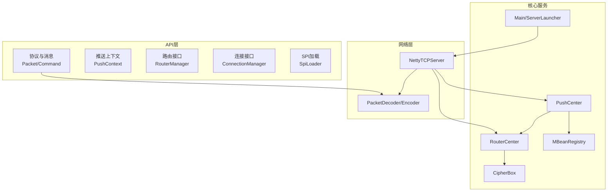
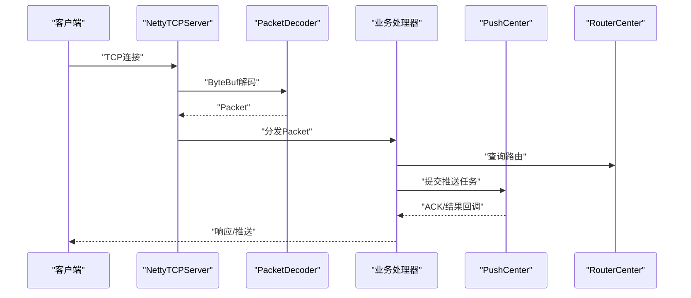
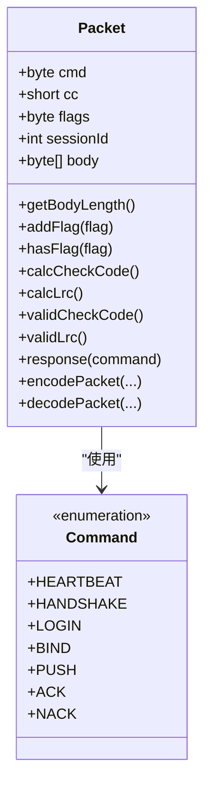
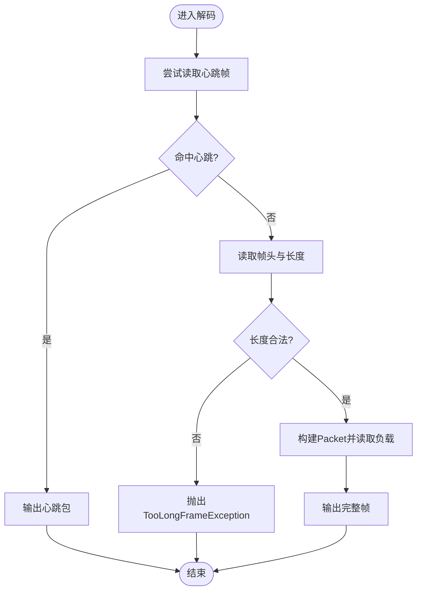
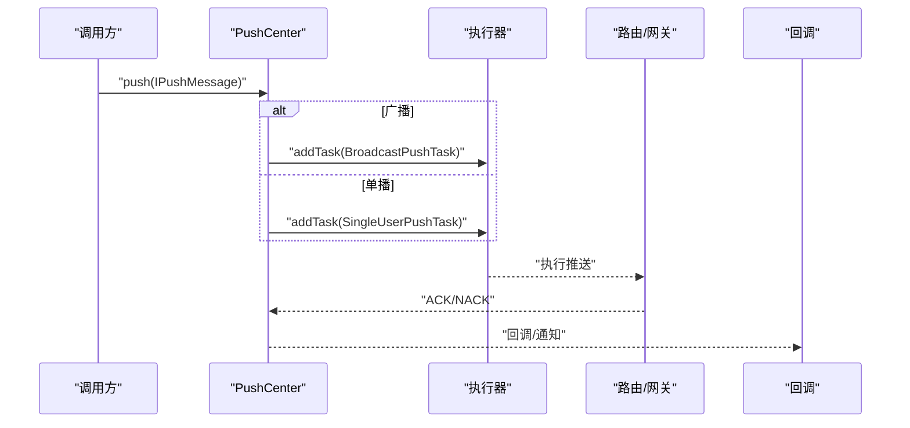
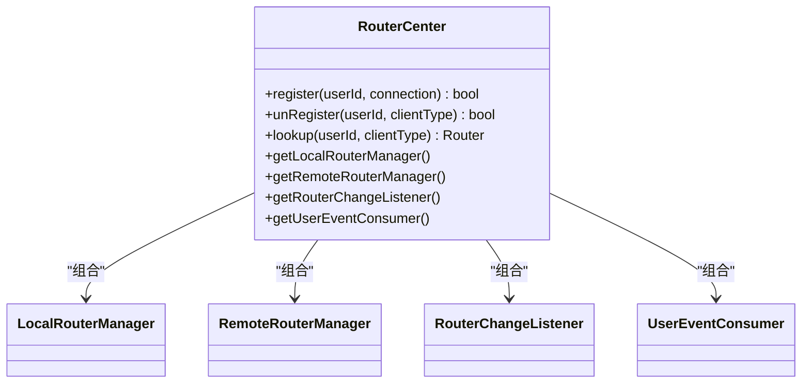
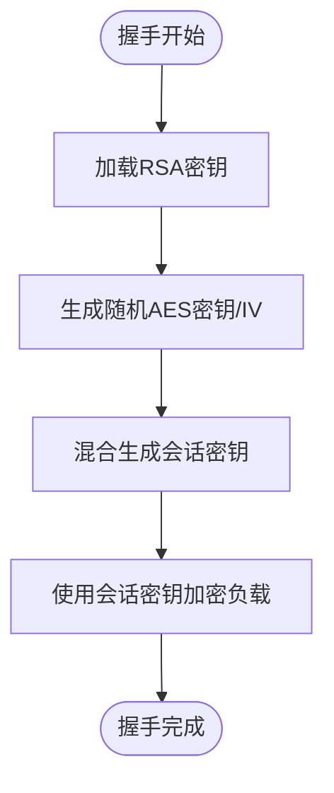
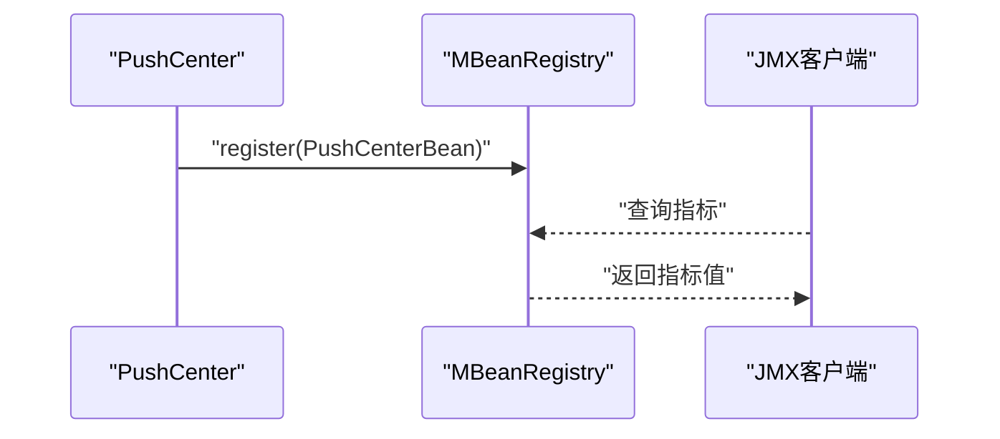
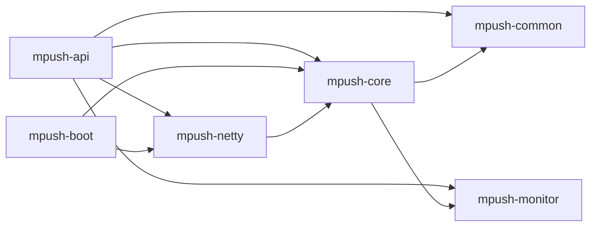

# 核心模块详解

<cite>
**本文引用的文件**   
- [README.md](file://README.md)
- [MPushContext.java](file://mpush-api/src/main/java/com/mpush/api/MPushContext.java)
- [Server.java](file://mpush-api/src/main/java/com/mpush/api/service/Server.java)
- [Packet.java](file://mpush-api/src/main/java/com/mpush/api/protocol/Packet.java)
- [Command.java](file://mpush-api/src/main/java/com/mpush/api/protocol/Command.java)
- [PushContext.java](file://mpush-api/src/main/java/com/mpush/api/push/PushContext.java)
- [RouterManager.java](file://mpush-api/src/main/java/com/mpush/api/router/RouterManager.java)
- [ConnectionManager.java](file://mpush-api/src/main/java/com/mpush/api/connection/ConnectionManager.java)
- [MessageHandler.java](file://mpush-api/src/main/java/com/mpush/api/message/MessageHandler.java)
- [SpiLoader.java](file://mpush-api/src/main/java/com/mpush/api/spi/SpiLoader.java)
- [NettyTCPServer.java](file://mpush-netty/src/main/java/com/mpush/netty/server/NettyTCPServer.java)
- [PacketDecoder.java](file://mpush-netty/src/main/java/com/mpush/netty/codec/PacketDecoder.java)
- [PushCenter.java](file://mpush-core/src/main/java/com/mpush/core/push/PushCenter.java)
- [RouterCenter.java](file://mpush-core/src/main/java/com/mpush/core/router/RouterCenter.java)
- [CipherBox.java](file://mpush-common/src/main/java/com/mpush/common/security/CipherBox.java)
- [MBeanRegistry.java](file://mpush-monitor/src/main/java/com/mpush/monitor/jmx/MBeanRegistry.java)
- [Main.java](file://mpush-boot/src/main/java/com/mpush/bootstrap/Main.java)
</cite>

## 目录
1. [简介](#简介)
2. [项目结构](#项目结构)
3. [核心组件](#核心组件)
4. [架构总览](#架构总览)
5. [详细组件分析](#详细组件分析)
6. [依赖分析](#依赖分析)
7. [性能考量](#性能考量)
8. [故障排查指南](#故障排查指南)
9. [结论](#结论)
10. [附录](#附录)

## 简介
本文件面向MPush核心模块，围绕API接口层、服务器核心、网络通信、消息推送、路由管理、安全机制与监控系统等维度，提供从架构到实现细节的系统化技术文档。重点包括：
- 协议与消息格式、SPI扩展机制
- 服务器启动流程、连接管理、处理器链、生命周期
- Netty集成（编解码器、连接策略、协议适配）
- 推送中心设计、任务调度、路由与ACK处理
- 路由中心（本地/远程路由、变更监听）
- 安全机制（加密、会话、访问控制）
- 监控系统（JMX、指标、日志）

## 项目结构
MPush采用多模块分层设计，核心模块与API边界清晰，便于扩展与替换：
- mpush-api：协议、消息、路由、连接、推送、SPI等抽象与规范
- mpush-netty：基于Netty的网络层实现（编解码、连接、HTTP/UDP）
- mpush-core：核心业务（推送中心、路由中心、会话与ACK）
- mpush-common：通用工具、安全、流控、消息模型
- mpush-monitor：JMX监控与指标采集
- mpush-boot：启动入口与引导流程
- mpush-cache、mpush-zk、mpush-client、mpush-tools：缓存/注册发现/客户端/工具

**图表来源**
- [NettyTCPServer.java](file://mpush-netty/src/main/java/com/mpush/netty/server/NettyTCPServer.java#L53-L321)
- [PacketDecoder.java](file://mpush-netty/src/main/java/com/mpush/netty/codec/PacketDecoder.java#L44-L107)
- [PushCenter.java](file://mpush-core/src/main/java/com/mpush/core/push/PushCenter.java#L49-L183)
- [RouterCenter.java](file://mpush-core/src/main/java/com/mpush/core/router/RouterCenter.java#L40-L135)
- [CipherBox.java](file://mpush-common/src/main/java/com/mpush/common/security/CipherBox.java#L34-L93)
- [MBeanRegistry.java](file://mpush-monitor/src/main/java/com/mpush/monitor/jmx/MBeanRegistry.java#L12-L177)
- [Main.java](file://mpush-boot/src/main/java/com/mpush/bootstrap/Main.java#L24-L64)

**章节来源**
- [README.md](file://README.md#L1-L328)

## 核心组件
- 协议与消息
  - Packet：统一帧头结构（长度、命令、校验、标志位、会话ID、LRC、负载），支持心跳、编码/解码、校验
  - Command：命令枚举，覆盖握手、登录、绑定、推送、ACK/NACK等
- 推送上下文
  - PushContext：封装目标用户/批量用户、广播、标签/条件过滤、ACK模式、超时、回调、任务ID等
- 路由与连接
  - RouterManager：注册/注销/查询路由
  - ConnectionManager：连接生命周期管理
- SPI扩展
  - SpiLoader：基于ServiceLoader的SPI加载与缓存，支持按名称筛选与排序

**章节来源**
- [Packet.java](file://mpush-api/src/main/java/com/mpush/api/protocol/Packet.java#L35-L187)
- [Command.java](file://mpush-api/src/main/java/com/mpush/api/protocol/Command.java#L27-L66)
- [PushContext.java](file://mpush-api/src/main/java/com/mpush/api/push/PushContext.java#L33-L206)
- [RouterManager.java](file://mpush-api/src/main/java/com/mpush/api/router/RouterManager.java#L29-L66)
- [ConnectionManager.java](file://mpush-api/src/main/java/com/mpush/api/connection/ConnectionManager.java#L31-L45)
- [SpiLoader.java](file://mpush-api/src/main/java/com/mpush/api/spi/SpiLoader.java#L25-L97)

## 架构总览
MPush采用“API抽象 + Netty网络 + 核心服务”的分层架构。NettyTCPServer负责接入层，PacketDecoder/PacketEncoder完成编解码；核心服务（PushCenter、RouterCenter）负责业务逻辑；安全与监控贯穿各层。

**图表来源**
- [NettyTCPServer.java](file://mpush-netty/src/main/java/com/mpush/netty/server/NettyTCPServer.java#L104-L185)
- [PacketDecoder.java](file://mpush-netty/src/main/java/com/mpush/netty/codec/PacketDecoder.java#L47-L89)
- [PushCenter.java](file://mpush-core/src/main/java/com/mpush/core/push/PushCenter.java#L72-L82)
- [RouterCenter.java](file://mpush-core/src/main/java/com/mpush/core/router/RouterCenter.java#L112-L117)

## 详细组件分析

### API接口层与协议规范
- 协议定义
  - 帧头字段：长度、命令、校验码、标志位、会话ID、LRC、负载
  - 支持标志位：加密、压缩、业务ACK、自动ACK、JSON负载
  - 心跳帧：特化的字节标识
- 消息格式
  - Packet提供decode/encode静态方法，兼容TCP/UDP与JSON
  - 支持校验码与LRC校验，保障可靠性
- SPI扩展机制
  - 通过META-INF/services加载实现类，支持按名称选择与排序

**图表来源**
- [Packet.java](file://mpush-api/src/main/java/com/mpush/api/protocol/Packet.java#L35-L187)
- [Command.java](file://mpush-api/src/main/java/com/mpush/api/protocol/Command.java#L27-L66)

**章节来源**
- [Packet.java](file://mpush-api/src/main/java/com/mpush/api/protocol/Packet.java#L35-L187)
- [Command.java](file://mpush-api/src/main/java/com/mpush/api/protocol/Command.java#L27-L66)
- [SpiLoader.java](file://mpush-api/src/main/java/com/mpush/api/spi/SpiLoader.java#L32-L95)

### 服务器核心模块
- 启动流程
  - Main作为入口，初始化日志、ServerLauncher，执行启动与优雅停机钩子
- 生命周期管理
  - BaseService抽象，状态机（Created/Initialized/Starting/Started/Shutdown）
  - NettyTCPServer提供start/stop，优雅关闭boss/worker线程组
- 处理器链设计
  - ChannelPipeline：decoder → encoder → handler（具体由子类实现）
  - 线程模型：boss/worker，可选Epoll/NIO，支持IO比例配置

**图表来源**
- [NettyTCPServer.java](file://mpush-netty/src/main/java/com/mpush/netty/server/NettyTCPServer.java#L57-L101)

**章节来源**
- [Main.java](file://mpush-boot/src/main/java/com/mpush/bootstrap/Main.java#L24-L64)
- [NettyTCPServer.java](file://mpush-netty/src/main/java/com/mpush/netty/server/NettyTCPServer.java#L76-L113)

### 网络通信模块（Netty集成）
- 编解码器
  - PacketDecoder：心跳帧优先、帧头校验、最大包长限制、TCP/UDP/JSON三种解码路径
  - PacketEncoder：单例，配合Packet.encodePacket输出
- 连接管理策略
  - NettyTCPServer按平台选择Epoll或NIO，线程工厂与IO比例可配置
  - ChannelPipeline按需添加decoder/encoder/handler
- 协议适配
  - UDP：使用DatagramPacket，UDPPacket承载sender地址
  - JSON：通过JsonPacket与Jsons反序列化

**图表来源**
- [PacketDecoder.java](file://mpush-netty/src/main/java/com/mpush/netty/codec/PacketDecoder.java#L47-L101)

**章节来源**
- [PacketDecoder.java](file://mpush-netty/src/main/java/com/mpush/netty/codec/PacketDecoder.java#L44-L107)
- [NettyTCPServer.java](file://mpush-netty/src/main/java/com/mpush/netty/server/NettyTCPServer.java#L244-L263)

### 消息推送模块（推送中心）
- 设计要点
  - PushCenter实现MessagePusher，统一入口push
  - 广播与单播分流：广播使用Fast/Redis流控，单播使用全局流控
  - 任务执行器：TCP直投使用EventLoop，UDP使用自定义ScheduledExecutor
  - JMX注册：PushCenterBean统计任务数
- 任务调度
  - addTask/delayTask委托执行器
  - 广播任务：支持任务ID驱动的Redis流控
  - 单播任务：全局QPS限制
- ACK处理
  - 与AckTaskQueue协作，异步处理ACK超时与回调

**图表来源**
- [PushCenter.java](file://mpush-core/src/main/java/com/mpush/core/push/PushCenter.java#L72-L109)

**章节来源**
- [PushCenter.java](file://mpush-core/src/main/java/com/mpush/core/push/PushCenter.java#L49-L183)

### 路由管理模块（本地与远程）
- 本地路由
  - LocalRouter/LocalRouterManager：维护用户到连接的映射
- 远程路由
  - RemoteRouter/RemoteRouterManager：维护用户到节点位置的映射
- 路由变更监听
  - RouterChangeListener：监听路由变化事件
  - UserEventConsumer：消费用户上下线事件，同步远端路由
- 查询策略
  - lookup优先查本地，不存在再查远程

**图表来源**
- [RouterCenter.java](file://mpush-core/src/main/java/com/mpush/core/router/RouterCenter.java#L40-L135)

**章节来源**
- [RouterCenter.java](file://mpush-core/src/main/java/com/mpush/core/router/RouterCenter.java#L40-L135)

### 安全机制模块（加密与会话）
- 加密算法
  - CipherBox：封装RSA私钥/公钥加载、随机AES密钥与IV、混合会话密钥
  - 配置来源于CC.mp.security.*，支持AES密钥长度配置
- 会话管理
  - 会话建立过程结合RSA握手与AES会话密钥协商
- 访问控制
  - 通过握手/绑定流程与路由管理实现用户身份与设备维度的访问控制

**图表来源**
- [CipherBox.java](file://mpush-common/src/main/java/com/mpush/common/security/CipherBox.java#L34-L93)

**章节来源**
- [CipherBox.java](file://mpush-common/src/main/java/com/mpush/common/security/CipherBox.java#L34-L93)

### 监控系统模块（JMX与指标）
- JMX注册
  - MBeanRegistry：统一注册/注销MBean，生成标准ObjectName
  - PushCenterBean：向JMX暴露任务数量等指标
- 指标采集
  - 通过MBeanServer采集JVM/GC/线程池等指标（监控模块内其他类）
- 日志系统
  - 通过Logs与Logback配置，结合服务生命周期输出启动/停止日志

**图表来源**
- [MBeanRegistry.java](file://mpush-monitor/src/main/java/com/mpush/monitor/jmx/MBeanRegistry.java#L52-L68)
- [PushCenter.java](file://mpush-core/src/main/java/com/mpush/core/push/PushCenter.java#L105-L105)

**章节来源**
- [MBeanRegistry.java](file://mpush-monitor/src/main/java/com/mpush/monitor/jmx/MBeanRegistry.java#L12-L177)
- [PushCenter.java](file://mpush-core/src/main/java/com/mpush/core/push/PushCenter.java#L105-L105)

## 依赖分析
- 模块耦合
  - mpush-netty依赖mpush-api（协议/消息）与tools（配置/工具）
  - mpush-core依赖mpush-api（SPI/接口）、common（安全/流控）、monitor（JMX）
  - mpush-boot依赖core与netty，负责启动与生命周期
- 关键依赖链
  - NettyTCPServer → PacketDecoder → Packet → 业务处理器
  - PushCenter → RouterCenter → 连接/路由 → 网关/客户端
  - CipherBox → 安全握手与会话密钥
  - MBeanRegistry → JMX监控

**图表来源**
- [NettyTCPServer.java](file://mpush-netty/src/main/java/com/mpush/netty/server/NettyTCPServer.java#L22-L46)
- [PushCenter.java](file://mpush-core/src/main/java/com/mpush/core/push/PushCenter.java#L22-L33)
- [RouterCenter.java](file://mpush-core/src/main/java/com/mpush/core/router/RouterCenter.java#L22-L31)
- [CipherBox.java](file://mpush-common/src/main/java/com/mpush/common/security/CipherBox.java#L22-L28)
- [MBeanRegistry.java](file://mpush-monitor/src/main/java/com/mpush/monitor/jmx/MBeanRegistry.java#L20-L34)

**章节来源**
- [NettyTCPServer.java](file://mpush-netty/src/main/java/com/mpush/netty/server/NettyTCPServer.java#L22-L46)
- [PushCenter.java](file://mpush-core/src/main/java/com/mpush/core/push/PushCenter.java#L22-L33)
- [RouterCenter.java](file://mpush-core/src/main/java/com/mpush/core/router/RouterCenter.java#L22-L31)
- [CipherBox.java](file://mpush-common/src/main/java/com/mpush/common/security/CipherBox.java#L22-L28)
- [MBeanRegistry.java](file://mpush-monitor/src/main/java/com/mpush/monitor/jmx/MBeanRegistry.java#L20-L34)

## 性能考量
- 线程模型
  - boss/worker分离，IO比例可调；Epoll在Linux上具备更好吞吐
- 缓冲区与内存
  - 使用PooledByteBufAllocator，降低GC压力
- 流量整形与限速
  - PushCenter内置全局/广播流控，支持Redis流控广播任务
- 心跳与超时
  - 配置最小/最大心跳与超时次数，避免无效连接占用资源

[本节为通用指导，无需具体文件引用]

## 故障排查指南
- 启动失败
  - 检查端口占用与权限，确认日志输出与JVM参数（JMX/堆配置）
- 连接异常
  - NettyTCPServer在启动失败时回调Listener onFailure，检查bind地址与线程池
- 协议错误
  - PacketDecoder抛出TooLongFrameException或校验失败，检查最大包长与负载合法性
- 推送无响应
  - 检查PushCenter执行器与路由查询，确认ACK回调链路
- 监控不可见
  - 确认MBeanRegistry已注册，JMX客户端可访问

**章节来源**
- [NettyTCPServer.java](file://mpush-netty/src/main/java/com/mpush/netty/server/NettyTCPServer.java#L170-L184)
- [PacketDecoder.java](file://mpush-netty/src/main/java/com/mpush/netty/codec/PacketDecoder.java#L85-L87)
- [PushCenter.java](file://mpush-core/src/main/java/com/mpush/core/push/PushCenter.java#L105-L109)
- [MBeanRegistry.java](file://mpush-monitor/src/main/java/com/mpush/monitor/jmx/MBeanRegistry.java#L60-L68)

## 结论
MPush通过清晰的API边界、可插拔的SPI机制、稳定的Netty网络层与完善的监控体系，实现了高可用、可扩展的消息推送平台。核心模块在协议、路由、推送、安全与监控方面均具备良好的可维护性与扩展性，适合在生产环境中大规模部署与演进。

[本节为总结，无需具体文件引用]

## 附录
- 配置参考
  - mpush.conf与reference.conf共同决定运行参数，包括网络、安全、线程池、监控与SPI扩展
- 启动与测试
  - 通过Main入口与ServerLauncher启动，测试模块提供ServerTestMain/ConnClientTestMain/PushClientTestMain等示例

**章节来源**
- [README.md](file://README.md#L32-L100)
- [Main.java](file://mpush-boot/src/main/java/com/mpush/bootstrap/Main.java#L31-L38)