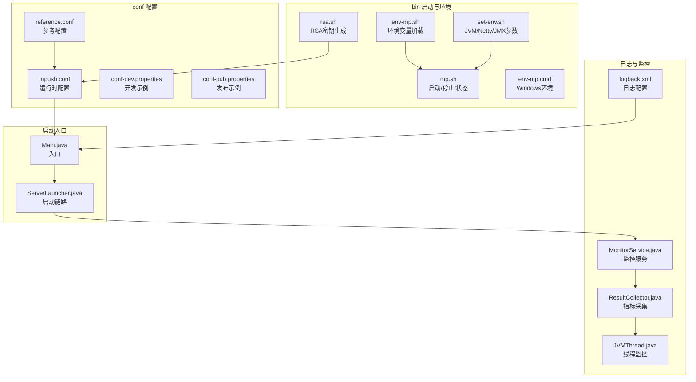
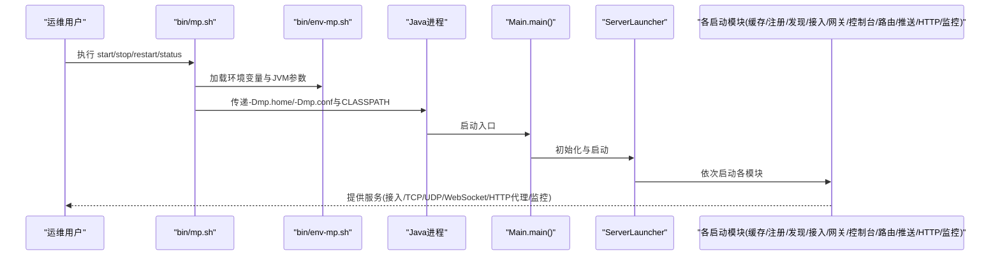
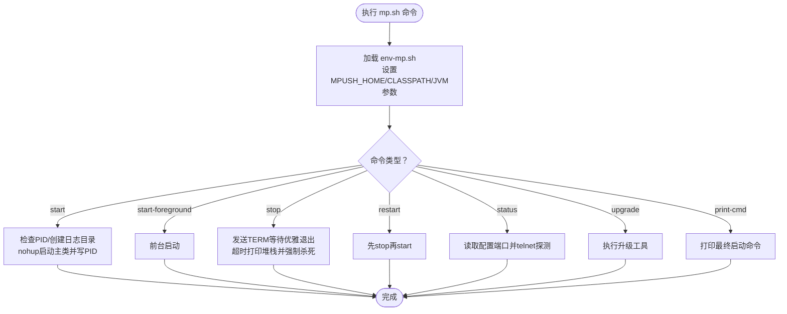
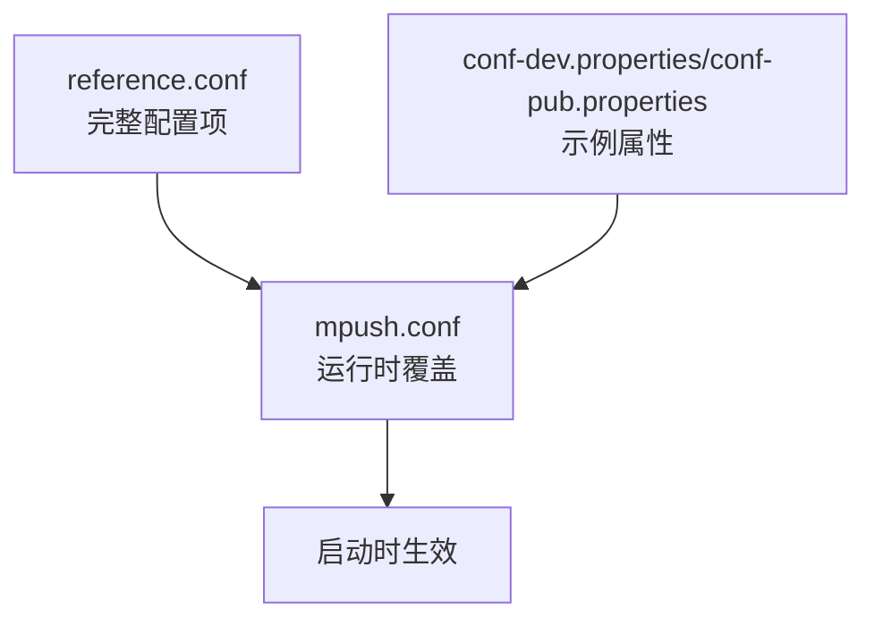
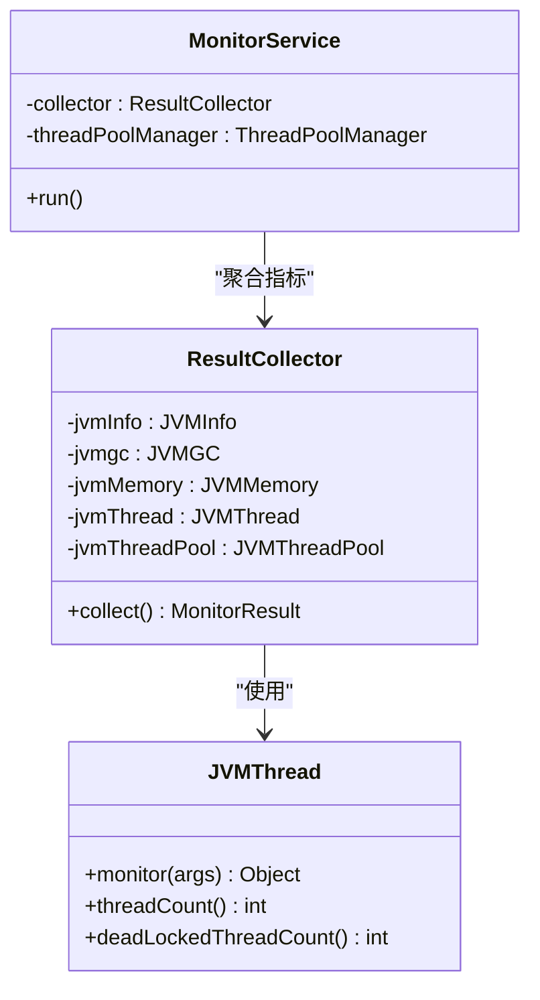
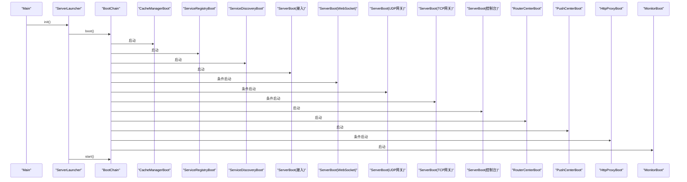
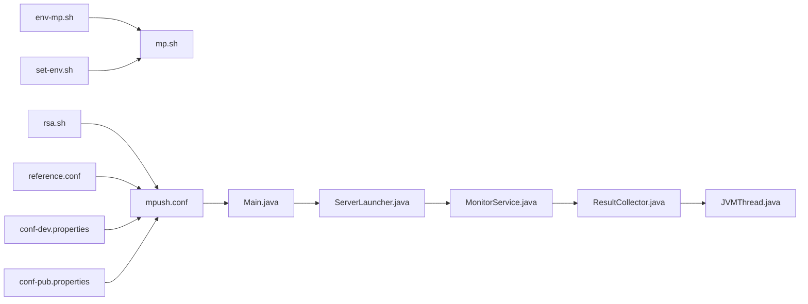

# 部署运维

<cite>
**本文引用的文件**
- [bin/mp.sh](file://bin/mp.sh)
- [bin/set-env.sh](file://bin/set-env.sh)
- [bin/rsa.sh](file://bin/rsa.sh)
- [bin/env-mp.sh](file://bin/env-mp.sh)
- [bin/env-mp.cmd](file://bin/env-mp.cmd)
- [conf/reference.conf](file://conf/reference.conf)
- [conf/mpush.conf](file://conf/mpush.conf)
- [conf/conf-dev.properties](file://conf/conf-dev.properties)
- [conf/conf-pub.properties](file://conf/conf-pub.properties)
- [mpush-boot/src/main/resources/logback.xml](file://mpush-boot/src/main/resources/logback.xml)
- [mpush-boot/src/main/java/com/mpush/bootstrap/Main.java](file://mpush-boot/src/main/java/com/mpush/bootstrap/Main.java)
- [mpush-boot/src/main/java/com/mpush/bootstrap/ServerLauncher.java](file://mpush-boot/src/main/java/com/mpush/bootstrap/ServerLauncher.java)
- [mpush-monitor/src/main/java/com/mpush/monitor/service/MonitorService.java](file://mpush-monitor/src/main/java/com/mpush/monitor/service/MonitorService.java)
- [mpush-monitor/src/main/java/com/mpush/monitor/data/ResultCollector.java](file://mpush-monitor/src/main/java/com/mpush/monitor/data/ResultCollector.java)
- [mpush-monitor/src/main/java/com/mpush/monitor/quota/impl/JVMThread.java](file://mpush-monitor/src/main/java/com/mpush/monitor/quota/impl/JVMThread.java)
- [mpush-tools/src/main/java/com/mpush/tools/config/CC.java](file://mpush-tools/src/main/java/com/mpush/tools/config/CC.java)
</cite>

## 目录
1. [简介](#简介)
2. [项目结构](#项目结构)
3. [核心组件](#核心组件)
4. [架构总览](#架构总览)
5. [详细组件分析](#详细组件分析)
6. [依赖分析](#依赖分析)
7. [性能考虑](#性能考虑)
8. [故障排查指南](#故障排查指南)
9. [结论](#结论)
10. [附录](#附录)

## 简介
本文件面向MPush部署与运维，提供从环境准备、启动停止、监控诊断到高可用与安全加固的完整指导。内容基于仓库内的启动脚本、配置模板、日志配置与监控实现，帮助您在Linux/Unix与Windows环境下完成稳定可靠的生产部署。

## 项目结构
MPush采用多模块Maven工程，关键部署相关文件集中在以下位置：
- 启动与环境脚本：bin/
- 配置模板与示例：conf/
- 日志配置：mpush-boot/src/main/resources/logback.xml
- 启动入口与服务编排：mpush-boot/src/main/java/com/mpush/bootstrap/

**图表来源**
- [bin/env-mp.sh](file://bin/env-mp.sh#L26-L103)
- [bin/set-env.sh](file://bin/set-env.sh#L1-L37)
- [bin/rsa.sh](file://bin/rsa.sh#L1-L37)
- [bin/mp.sh](file://bin/mp.sh#L133-L242)
- [bin/env-mp.cmd](file://bin/env-mp.cmd#L1-L50)
- [conf/reference.conf](file://conf/reference.conf#L1-L239)
- [conf/mpush.conf](file://conf/mpush.conf#L1-L16)
- [conf/conf-dev.properties](file://conf/conf-dev.properties#L1-L5)
- [conf/conf-pub.properties](file://conf/conf-pub.properties#L1-L5)
- [mpush-boot/src/main/resources/logback.xml](file://mpush-boot/src/main/resources/logback.xml#L1-L231)
- [mpush-boot/src/main/java/com/mpush/bootstrap/Main.java](file://mpush-boot/src/main/java/com/mpush/bootstrap/Main.java#L24-L64)
- [mpush-boot/src/main/java/com/mpush/bootstrap/ServerLauncher.java](file://mpush-boot/src/main/java/com/mpush/bootstrap/ServerLauncher.java#L36-L105)
- [mpush-monitor/src/main/java/com/mpush/monitor/service/MonitorService.java](file://mpush-monitor/src/main/java/com/mpush/monitor/service/MonitorService.java#L37-L78)
- [mpush-monitor/src/main/java/com/mpush/monitor/data/ResultCollector.java](file://mpush-monitor/src/main/java/com/mpush/monitor/data/ResultCollector.java#L30-L74)
- [mpush-monitor/src/main/java/com/mpush/monitor/quota/impl/JVMThread.java](file://mpush-monitor/src/main/java/com/mpush/monitor/quota/impl/JVMThread.java#L40-L74)

**章节来源**
- [bin/env-mp.sh](file://bin/env-mp.sh#L26-L103)
- [bin/mp.sh](file://bin/mp.sh#L133-L242)
- [conf/reference.conf](file://conf/reference.conf#L1-L239)
- [conf/mpush.conf](file://conf/mpush.conf#L1-L16)
- [mpush-boot/src/main/resources/logback.xml](file://mpush-boot/src/main/resources/logback.xml#L1-L231)
- [mpush-boot/src/main/java/com/mpush/bootstrap/Main.java](file://mpush-boot/src/main/java/com/mpush/bootstrap/Main.java#L24-L64)
- [mpush-boot/src/main/java/com/mpush/bootstrap/ServerLauncher.java](file://mpush-boot/src/main/java/com/mpush/bootstrap/ServerLauncher.java#L36-L105)

## 核心组件
- 启动脚本与环境
  - Linux/Unix：env-mp.sh负责设置MPUSH_HOME、MP_CFG_DIR、MP_LOG_DIR、CLASSPATH与JVM参数；mp.sh提供start/stop/status/restart/upgrade/print-cmd等命令。
  - Windows：env-mp.cmd设置CLASSPATH与JAVA路径。
- 配置体系
  - reference.conf提供完整配置项参考；mpush.conf作为运行时覆盖；conf-dev.properties与conf-pub.properties提供示例。
- 日志系统
  - logback.xml定义多通道日志输出（应用、info、debug、监控、连接、推送、心跳、缓存、HTTP、服务发现、性能剖析等）。
- 启动入口
  - Main.java初始化日志与ServerLauncher；ServerLauncher按顺序启动缓存、注册发现、接入/网关/控制台、路由中心、推送中心、HTTP代理、监控等模块。
- 监控与诊断
  - MonitorService周期采集JVM与线程池指标；ResultCollector聚合指标；JVMThread统计线程数与死锁。

**章节来源**
- [bin/env-mp.sh](file://bin/env-mp.sh#L26-L103)
- [bin/mp.sh](file://bin/mp.sh#L133-L242)
- [bin/env-mp.cmd](file://bin/env-mp.cmd#L17-L50)
- [conf/reference.conf](file://conf/reference.conf#L13-L239)
- [conf/mpush.conf](file://conf/mpush.conf#L1-L16)
- [conf/conf-dev.properties](file://conf/conf-dev.properties#L1-L5)
- [conf/conf-pub.properties](file://conf/conf-pub.properties#L1-L5)
- [mpush-boot/src/main/resources/logback.xml](file://mpush-boot/src/main/resources/logback.xml#L8-L231)
- [mpush-boot/src/main/java/com/mpush/bootstrap/Main.java](file://mpush-boot/src/main/java/com/mpush/bootstrap/Main.java#L31-L38)
- [mpush-boot/src/main/java/com/mpush/bootstrap/ServerLauncher.java](file://mpush-boot/src/main/java/com/mpush/bootstrap/ServerLauncher.java#L42-L71)
- [mpush-monitor/src/main/java/com/mpush/monitor/service/MonitorService.java](file://mpush-monitor/src/main/java/com/mpush/monitor/service/MonitorService.java#L43-L78)
- [mpush-monitor/src/main/java/com/mpush/monitor/data/ResultCollector.java](file://mpush-monitor/src/main/java/com/mpush/monitor/data/ResultCollector.java#L30-L53)
- [mpush-monitor/src/main/java/com/mpush/monitor/quota/impl/JVMThread.java](file://mpush-monitor/src/main/java/com/mpush/monitor/quota/impl/JVMThread.java#L40-L74)

## 架构总览
MPush启动流程从脚本到配置再到服务编排，形成清晰的层次化结构。下图展示启动链路与关键组件交互。

**图表来源**
- [bin/mp.sh](file://bin/mp.sh#L133-L175)
- [bin/env-mp.sh](file://bin/env-mp.sh#L49-L103)
- [mpush-boot/src/main/java/com/mpush/bootstrap/Main.java](file://mpush-boot/src/main/java/com/mpush/bootstrap/Main.java#L31-L38)
- [mpush-boot/src/main/java/com/mpush/bootstrap/ServerLauncher.java](file://mpush-boot/src/main/java/com/mpush/bootstrap/ServerLauncher.java#L42-L71)

## 详细组件分析

### 启动与停止流程（Linux/Unix）
- 环境准备
  - 设置MPUSH_HOME、MP_CFG_DIR、MP_LOG_DIR、CLASSPATH，加载JVM参数（Netty泄漏检测、JMX、GC等）。
  - 支持通过MP_CFG指定配置文件，PID文件默认写入MP_DATA_DIR。
- 启动
  - mp.sh start：检查PID文件是否存在并存活；若不存在则nohup启动主类，写入PID与mpush.out。
- 前台启动
  - mp.sh start-foreground：直接在前台启动，便于调试。
- 停止
  - mp.sh stop：向进程发送TERM信号，等待优雅退出；超时则打印线程堆栈并强制SIGKILL。
- 状态
  - mp.sh status：读取配置中的clientPortAddress与connect-server-port，尝试telnet探测。
- 其他
  - upgrade/restart/print-cmd等子命令。

**图表来源**
- [bin/mp.sh](file://bin/mp.sh#L133-L242)
- [bin/env-mp.sh](file://bin/env-mp.sh#L26-L103)

**章节来源**
- [bin/env-mp.sh](file://bin/env-mp.sh#L26-L103)
- [bin/mp.sh](file://bin/mp.sh#L133-L242)

### 配置管理（参考与覆盖）
- 参考配置
  - reference.conf提供完整配置项，包含日志、核心、安全、网络、ZK、Redis、HTTP代理、线程池、推送流控、监控、SPI等。
- 运行时覆盖
  - mpush.conf通过HOCON语法覆盖默认值；可从conf-dev.properties或conf-pub.properties注入键值。
- 关键网络端口
  - 接入服务端口、网关服务端口、控制台端口、WebSocket端口等均在reference.conf中定义。

**图表来源**
- [conf/reference.conf](file://conf/reference.conf#L13-L239)
- [conf/mpush.conf](file://conf/mpush.conf#L1-L16)
- [conf/conf-dev.properties](file://conf/conf-dev.properties#L1-L5)
- [conf/conf-pub.properties](file://conf/conf-pub.properties#L1-L5)

**章节来源**
- [conf/reference.conf](file://conf/reference.conf#L13-L239)
- [conf/mpush.conf](file://conf/mpush.conf#L1-L16)
- [conf/conf-dev.properties](file://conf/conf-dev.properties#L1-L5)
- [conf/conf-pub.properties](file://conf/conf-pub.properties#L1-L5)

### 日志配置与输出
- 多通道日志
  - 应用日志、info日志、debug日志、监控日志、连接日志、推送日志、心跳日志、缓存日志、HTTP日志、服务发现日志、性能剖析日志。
- 输出策略
  - 文件滚动与保留天数；控制台阈值过滤；日志级别由环境变量控制。
- 使用建议
  - 生产环境建议将日志级别提升至warn/info，避免过多debug日志影响性能。

**章节来源**
- [mpush-boot/src/main/resources/logback.xml](file://mpush-boot/src/main/resources/logback.xml#L8-L231)

### 密钥与安全
- RSA密钥生成
  - rsa.sh根据输入位数生成密钥对；默认1024位；可结合reference.conf中的security段落配置私钥/公钥。
- 安全要点
  - 在生产环境务必替换默认密钥；确保密钥文件权限最小化；定期轮换密钥。

**章节来源**
- [bin/rsa.sh](file://bin/rsa.sh#L29-L35)
- [conf/reference.conf](file://conf/reference.conf#L34-L43)

### 监控与诊断
- 监控服务
  - MonitorService周期采集JVM信息、GC、内存、线程、线程池等指标；可配置是否打印日志与定时转储。
- 指标采集
  - ResultCollector聚合多个指标源；JVMThread统计活跃线程、死锁线程等。
- 诊断建议
  - 结合日志通道（monitor-mpush.log等）与JMX（如启用）进行实时观测；必要时触发堆栈/堆转储。

**图表来源**
- [mpush-monitor/src/main/java/com/mpush/monitor/service/MonitorService.java](file://mpush-monitor/src/main/java/com/mpush/monitor/service/MonitorService.java#L57-L78)
- [mpush-monitor/src/main/java/com/mpush/monitor/data/ResultCollector.java](file://mpush-monitor/src/main/java/com/mpush/monitor/data/ResultCollector.java#L30-L53)
- [mpush-monitor/src/main/java/com/mpush/monitor/quota/impl/JVMThread.java](file://mpush-monitor/src/main/java/com/mpush/monitor/quota/impl/JVMThread.java#L40-L74)

**章节来源**
- [mpush-monitor/src/main/java/com/mpush/monitor/service/MonitorService.java](file://mpush-monitor/src/main/java/com/mpush/monitor/service/MonitorService.java#L37-L78)
- [mpush-monitor/src/main/java/com/mpush/monitor/data/ResultCollector.java](file://mpush-monitor/src/main/java/com/mpush/monitor/data/ResultCollector.java#L30-L53)
- [mpush-monitor/src/main/java/com/mpush/monitor/quota/impl/JVMThread.java](file://mpush-monitor/src/main/java/com/mpush/monitor/quota/impl/JVMThread.java#L40-L74)

### 启动入口与服务编排
- 入口
  - Main.java初始化日志与ServerLauncher，注册JVM关闭钩子。
- 编排
  - ServerLauncher按顺序启动缓存管理器、服务注册与发现、接入/网关/控制台、路由中心、推送中心、HTTP代理、监控等模块。

**图表来源**
- [mpush-boot/src/main/java/com/mpush/bootstrap/Main.java](file://mpush-boot/src/main/java/com/mpush/bootstrap/Main.java#L31-L38)
- [mpush-boot/src/main/java/com/mpush/bootstrap/ServerLauncher.java](file://mpush-boot/src/main/java/com/mpush/bootstrap/ServerLauncher.java#L42-L71)

**章节来源**
- [mpush-boot/src/main/java/com/mpush/bootstrap/Main.java](file://mpush-boot/src/main/java/com/mpush/bootstrap/Main.java#L24-L64)
- [mpush-boot/src/main/java/com/mpush/bootstrap/ServerLauncher.java](file://mpush-boot/src/main/java/com/mpush/bootstrap/ServerLauncher.java#L36-L105)

## 依赖分析
- 启动脚本依赖
  - env-mp.sh统一设置环境变量与CLASSPATH；set-env.sh注入JVM/Netty/JMX参数；rsa.sh用于密钥生成；mp.sh封装启动/停止逻辑。
- 配置依赖
  - reference.conf为基线；mpush.conf覆盖；properties文件提供示例键值。
- 监控依赖
  - MonitorService依赖ResultCollector与ThreadPoolManager；ResultCollector依赖JVMInfo/GC/Memory/Thread/ThreadPool实现。

**图表来源**
- [bin/env-mp.sh](file://bin/env-mp.sh#L49-L103)
- [bin/set-env.sh](file://bin/set-env.sh#L1-L37)
- [bin/rsa.sh](file://bin/rsa.sh#L23-L35)
- [conf/reference.conf](file://conf/reference.conf#L1-L239)
- [conf/mpush.conf](file://conf/mpush.conf#L1-L16)
- [conf/conf-dev.properties](file://conf/conf-dev.properties#L1-L5)
- [conf/conf-pub.properties](file://conf/conf-pub.properties#L1-L5)
- [mpush-boot/src/main/java/com/mpush/bootstrap/Main.java](file://mpush-boot/src/main/java/com/mpush/bootstrap/Main.java#L31-L38)
- [mpush-boot/src/main/java/com/mpush/bootstrap/ServerLauncher.java](file://mpush-boot/src/main/java/com/mpush/bootstrap/ServerLauncher.java#L42-L71)
- [mpush-monitor/src/main/java/com/mpush/monitor/service/MonitorService.java](file://mpush-monitor/src/main/java/com/mpush/monitor/service/MonitorService.java#L57-L78)
- [mpush-monitor/src/main/java/com/mpush/monitor/data/ResultCollector.java](file://mpush-monitor/src/main/java/com/mpush/monitor/data/ResultCollector.java#L30-L53)
- [mpush-monitor/src/main/java/com/mpush/monitor/quota/impl/JVMThread.java](file://mpush-monitor/src/main/java/com/mpush/monitor/quota/impl/JVMThread.java#L40-L74)

**章节来源**
- [bin/env-mp.sh](file://bin/env-mp.sh#L49-L103)
- [bin/mp.sh](file://bin/mp.sh#L133-L242)
- [conf/reference.conf](file://conf/reference.conf#L13-L239)
- [conf/mpush.conf](file://conf/mpush.conf#L1-L16)
- [mpush-boot/src/main/java/com/mpush/bootstrap/Main.java](file://mpush-boot/src/main/java/com/mpush/bootstrap/Main.java#L31-L38)
- [mpush-boot/src/main/java/com/mpush/bootstrap/ServerLauncher.java](file://mpush-boot/src/main/java/com/mpush/bootstrap/ServerLauncher.java#L42-L71)
- [mpush-monitor/src/main/java/com/mpush/monitor/service/MonitorService.java](file://mpush-monitor/src/main/java/com/mpush/monitor/service/MonitorService.java#L57-L78)

## 性能考虑
- JVM与Netty
  - set-env.sh提供Netty泄漏检测等级、Selector自动重建阈值、是否禁用selectedKeys优化等参数，建议在生产环境谨慎开启高级泄漏检测。
- GC与内存
  - set-env.sh示例展示了G1GC、GC日志与OOM处理参数，建议结合业务峰值QPS与消息大小调优堆大小与停顿目标。
- 线程池
  - reference.conf的thread.pool.*配置项可按CPU核数与业务特征动态调整；注意conn-work、gateway-server-work、push-task等线程池规模。
- 流量整形与缓冲区
  - traffic-shaping与snd_buf/rcv_buf可根据网络质量与消息吞吐调优，避免频繁丢包或内存占用过高。
- 监控与剖析
  - monitor.profile-enabled与profile-slowly-duration可用于定位慢调用；结合logback的profile日志通道分析热点。

**章节来源**
- [bin/set-env.sh](file://bin/set-env.sh#L19-L37)
- [conf/reference.conf](file://conf/reference.conf#L182-L239)
- [mpush-boot/src/main/resources/logback.xml](file://mpush-boot/src/main/resources/logback.xml#L158-L170)

## 故障排查指南
- 启动失败
  - 查看mpush.out与PID文件；确认JAVA_HOME与CLASSPATH；检查端口占用与防火墙。
- 无法停止
  - 确认PID文件存在且进程存在；若优雅退出超时，检查线程堆栈并考虑强制停止。
- 端口不可达
  - 使用status命令读取配置中的clientPortAddress与connect-server-port，尝试telnet验证。
- 日志定位
  - 根据日志通道（conn-mpush.log、heartbeat-mpush.log、push-mpush.log、cache-mpush.log、http-mpush.log、srd-mpush.log、monitor-mpush.log、profile-mpush.log）定位问题域。
- 监控指标
  - 关注线程数、死锁线程数、线程池队列长度、JVM GC与内存使用；必要时开启堆栈/堆转储。

**章节来源**
- [bin/mp.sh](file://bin/mp.sh#L116-L130)
- [bin/mp.sh](file://bin/mp.sh#L176-L216)
- [bin/mp.sh](file://bin/mp.sh#L229-L238)
- [mpush-boot/src/main/resources/logback.xml](file://mpush-boot/src/main/resources/logback.xml#L74-L231)
- [mpush-monitor/src/main/java/com/mpush/monitor/quota/impl/JVMThread.java](file://mpush-monitor/src/main/java/com/mpush/monitor/quota/impl/JVMThread.java#L53-L62)

## 结论
通过规范的环境准备、严谨的配置覆盖、完善的日志与监控体系以及标准化的启动停止流程，MPush可在生产环境中实现稳定、可观测与可维护的部署。建议结合业务特征持续优化线程池、GC与网络参数，并建立自动化运维与CI/CD流水线以提升交付效率与安全性。

## 附录

### 环境准备清单
- 操作系统
  - Linux/Unix或兼容平台；Windows用于开发与测试。
- JDK
  - 正确设置JAVA_HOME；确保java命令可用。
- 权限
  - 配置与日志目录具备写权限；端口未被占用。
- 依赖服务
  - ZooKeeper与Redis按reference.conf配置可达；网络连通性良好。

**章节来源**
- [bin/env-mp.cmd](file://bin/env-mp.cmd#L37-L49)
- [conf/reference.conf](file://conf/reference.conf#L125-L141)
- [conf/reference.conf](file://conf/reference.conf#L143-L169)

### 启动与停止操作步骤
- 启动
  - 执行mp.sh start；确认PID文件与mpush.out；使用status验证端口。
- 停止
  - 执行mp.sh stop；若超时打印堆栈后强制停止。
- 前台启动
  - 执行mp.sh start-foreground；适合调试与问题复现。

**章节来源**
- [bin/mp.sh](file://bin/mp.sh#L133-L175)
- [bin/mp.sh](file://bin/mp.sh#L176-L216)
- [bin/mp.sh](file://bin/mp.sh#L229-L238)

### 配置管理最佳实践
- 基线与覆盖
  - 以reference.conf为基线，mpush.conf进行最小化覆盖；避免在reference.conf直接修改。
- 环境隔离
  - 不同环境使用独立的conf-dev.properties/conf-pub.properties与mpush.conf。
- 安全
  - 替换默认RSA密钥；严格控制密钥文件权限。

**章节来源**
- [conf/reference.conf](file://conf/reference.conf#L1-L239)
- [conf/mpush.conf](file://conf/mpush.conf#L1-L16)
- [conf/conf-dev.properties](file://conf/conf-dev.properties#L1-L5)
- [conf/conf-pub.properties](file://conf/conf-pub.properties#L1-L5)

### 监控与诊断清单
- 指标关注
  - JVM线程数、死锁线程数、线程池队列长度、GC与内存使用。
- 日志通道
  - 应用、info、debug、监控、连接、推送、心跳、缓存、HTTP、服务发现、性能剖析。
- 工具
  - JMX（可选）、线程堆栈、堆转储（OOM时）。

**章节来源**
- [mpush-monitor/src/main/java/com/mpush/monitor/service/MonitorService.java](file://mpush-monitor/src/main/java/com/mpush/monitor/service/MonitorService.java#L37-L78)
- [mpush-monitor/src/main/java/com/mpush/monitor/quota/impl/JVMThread.java](file://mpush-monitor/src/main/java/com/mpush/monitor/quota/impl/JVMThread.java#L40-L74)
- [mpush-boot/src/main/resources/logback.xml](file://mpush-boot/src/main/resources/logback.xml#L8-L231)

### 高可用与负载均衡建议
- 部署策略
  - 多实例部署于不同主机或容器；通过ZooKeeper进行服务注册与发现；利用权重与路由策略实现流量分配。
- 负载均衡
  - 在接入层前置LB（Nginx/Tengine），配置健康检查与会话亲和（按需）。
- 网络
  - 明确connect-server-bind-ip/connect-server-register-ip与gateway-server-bind-ip/gateway-server-register-ip，确保注册IP与访问IP一致。

**章节来源**
- [conf/reference.conf](file://conf/reference.conf#L45-L141)

### 自动化部署与CI/CD集成建议
- 构建产物
  - 使用Maven打包生成二进制包，包含lib与插件目录；将conf与bin随包分发。
- 部署流程
  - CI构建后推送镜像/归档；CD执行env-mp.sh加载环境、mp.sh启动；健康检查通过后切换流量。
- 配置注入
  - 通过环境变量或外部配置中心注入mpush.conf与密钥材料。

**章节来源**
- [bin/env-mp.sh](file://bin/env-mp.sh#L49-L103)
- [bin/mp.sh](file://bin/mp.sh#L133-L175)

### 安全加固要点
- 密钥管理
  - 使用rsa.sh生成密钥；替换默认RSA密钥；限制密钥文件权限。
- 网络
  - 仅开放必要端口；通过防火墙与安全组限制访问；内网通信建议启用TLS（如需）。
- 运维
  - 限制对bin与conf目录的访问；定期审计日志与配置变更。

**章节来源**
- [bin/rsa.sh](file://bin/rsa.sh#L29-L35)
- [conf/reference.conf](file://conf/reference.conf#L34-L43)