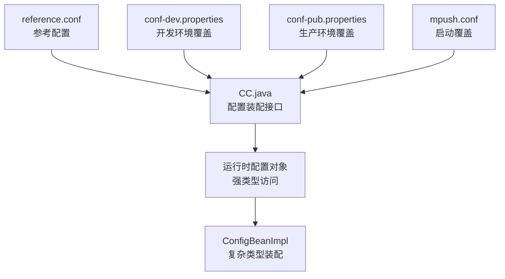
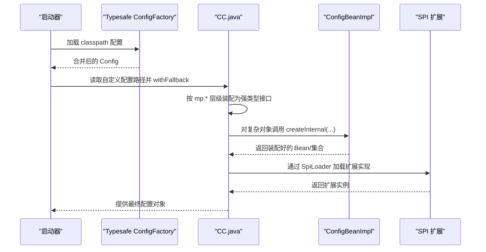
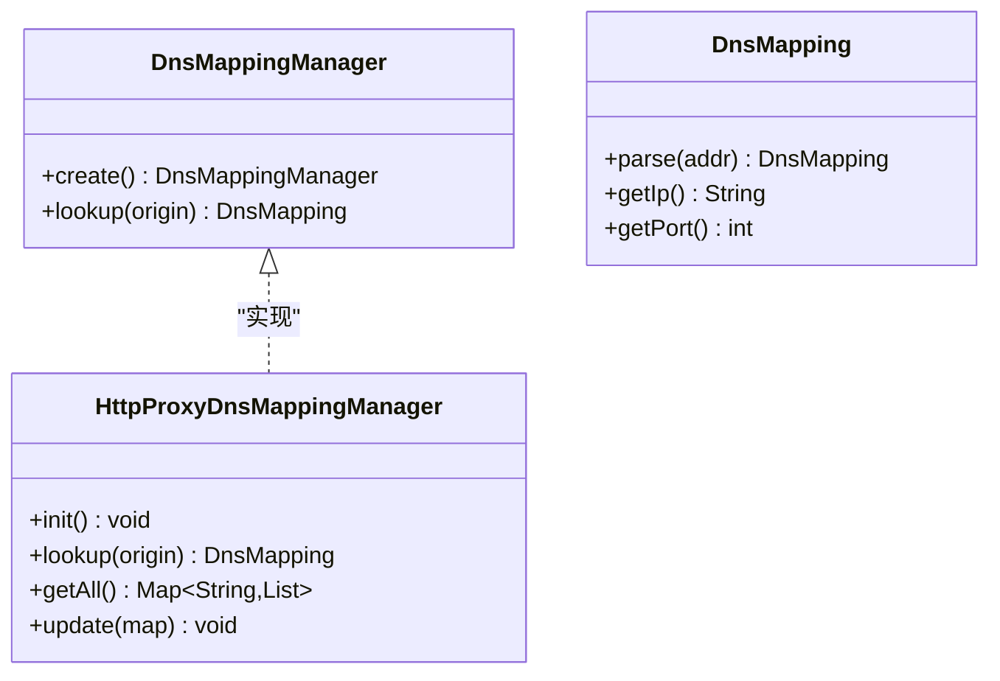
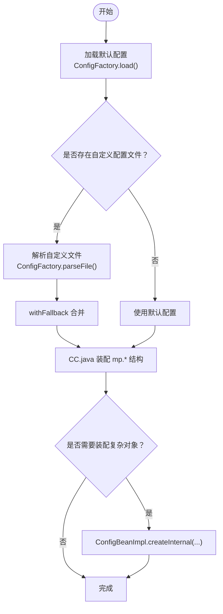
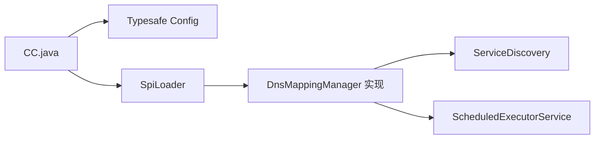

# 配置管理

<cite>
**本文引用的文件**
- [conf/reference.conf](file://conf/reference.conf)
- [conf/conf-dev.properties](file://conf/conf-dev.properties)
- [conf/conf-pub.properties](file://conf/conf-pub.properties)
- [mpush-boot/resources/mpush.conf](file://mpush-boot/src/main/resources/mpush.conf)
- [mpush-tools/config/CC.java](file://mpush-tools/src/main/java/com/mpush/tools/config/CC.java)
- [mpush-tools/config/ConfigBeanImpl.java](file://mpush-tools/src/main/java/com/mpush/tools/config/ConfigBeanImpl.java)
- [mpush-tools/config/ConfigTools.java](file://mpush-tools/src/main/java/com/mpush/tools/config/ConfigTools.java)
- [mpush-api/spi/net/DnsMappingManager.java](file://mpush-api/src/main/java/com/mpush/api/spi/net/DnsMappingManager.java)
- [mpush-api/spi/net/DnsMapping.java](file://mpush-api/src/main/java/com/mpush/api/spi/net/DnsMapping.java)
- [mpush-common/net/HttpProxyDnsMappingManager.java](file://mpush-common/src/main/java/com/mpush/common/net/HttpProxyDnsMappingManager.java)
- [mpush-common/META-INF/services/com.mpush.api.spi.net.DnsMappingManager](file://mpush-common/src/main/resources/META-INF/services/com.mpush.api.spi.net.DnsMappingManager)
- [mpush-test/configcenter/ConfigCenterTest.java](file://mpush-test/src/main/java/com/mpush/test/configcenter/ConfigCenterTest.java)
</cite>

## 目录
1. [简介](#简介)
2. [项目结构](#项目结构)
3. [核心组件](#核心组件)
4. [架构总览](#架构总览)
5. [详细组件分析](#详细组件分析)
6. [依赖分析](#依赖分析)
7. [性能考虑](#性能考虑)
8. [故障排查指南](#故障排查指南)
9. [结论](#结论)
10. [附录](#附录)

## 简介
本文件系统性阐述 MPush 的配置管理体系，覆盖 HOCON 配置文件格式与解析机制、配置项层次结构、数据类型支持、继承与覆盖规则；逐项解读 reference.conf 中的完整配置项（网络、安全、核心、Zookeeper、Redis、HTTP 代理、线程池、推送流控、监控等）；提供开发与生产环境的配置示例（conf-dev.properties、conf-pub.properties）；说明动态配置更新能力（热加载、验证、回滚思路）；介绍 SPI 扩展配置（线程池工厂、DNS 映射管理器）；给出最佳实践与常见问题解决方案，并提供配置版本管理与迁移建议。

## 项目结构
MPush 的配置体系由“参考配置 + 环境覆盖 + 运行时装配”三层构成：
- 参考配置：conf/reference.conf 提供全量配置项与默认值
- 环境覆盖：conf/*.properties 通过 JVM 参数或环境变量覆盖关键项
- 启动覆盖：mpush-boot/resources/mpush.conf 在应用启动时注入运行期参数
- 运行时装配：CC.java 将配置树装配为强类型接口，ConfigBeanImpl 支持复杂对象与集合的类型转换

**图表来源**
- [conf/reference.conf](file://conf/reference.conf#L1-L239)
- [conf/conf-dev.properties](file://conf/conf-dev.properties#L1-L5)
- [conf/conf-pub.properties](file://conf/conf-pub.properties#L1-L5)
- [mpush-boot/resources/mpush.conf](file://mpush-boot/src/main/resources/mpush.conf#L1-L16)
- [mpush-tools/config/CC.java](file://mpush-tools/src/main/java/com/mpush/tools/config/CC.java#L40-L53)
- [mpush-tools/config/ConfigBeanImpl.java](file://mpush-tools/src/main/java/com/mpush/tools/config/ConfigBeanImpl.java#L41-L145)

**章节来源**
- [conf/reference.conf](file://conf/reference.conf#L1-L239)
- [conf/conf-dev.properties](file://conf/conf-dev.properties#L1-L5)
- [conf/conf-pub.properties](file://conf/conf-pub.properties#L1-L5)
- [mpush-boot/resources/mpush.conf](file://mpush-boot/src/main/resources/mpush.conf#L1-L16)
- [mpush-tools/config/CC.java](file://mpush-tools/src/main/java/com/mpush/tools/config/CC.java#L40-L53)

## 核心组件
- 配置加载与合并
  - 使用 Typesafe Config 加载 classpath 下所有可用配置，支持 HOCON/JSON/Properties
  - 支持通过 JVM 参数指定自定义配置文件路径（优先级最高），并与默认配置进行 fallback 合并
- 强类型配置接口 CC
  - 以嵌套接口形式暴露 mp.* 配置树，自动完成类型转换（数字、Duration、MemorySize、布尔、列表、对象）
  - 提供便捷工具方法（如 IP 解析、心跳范围校验）
- 复杂对象装配
  - ConfigBeanImpl 支持将 ConfigObject 装配为 Java Bean，支持基本类型、Duration、MemorySize、List、Map<String,Object>、嵌套对象等
- SPI 扩展
  - 通过 META-INF/services 机制加载扩展实现（如 DNS 映射管理器）

**章节来源**
- [mpush-tools/config/CC.java](file://mpush-tools/src/main/java/com/mpush/tools/config/CC.java#L40-L53)
- [mpush-tools/config/CC.java](file://mpush-tools/src/main/java/com/mpush/tools/config/CC.java#L55-L355)
- [mpush-tools/config/ConfigBeanImpl.java](file://mpush-tools/src/main/java/com/mpush/tools/config/ConfigBeanImpl.java#L41-L145)
- [mpush-tools/config/ConfigTools.java](file://mpush-tools/src/main/java/com/mpush/tools/config/ConfigTools.java#L35-L90)

## 架构总览
MPush 配置管理的运行时流程如下：

**图表来源**
- [mpush-tools/config/CC.java](file://mpush-tools/src/main/java/com/mpush/tools/config/CC.java#L40-L53)
- [mpush-tools/config/ConfigBeanImpl.java](file://mpush-tools/src/main/java/com/mpush/tools/config/ConfigBeanImpl.java#L41-L145)
- [mpush-api/spi/net/DnsMappingManager.java](file://mpush-api/src/main/java/com/mpush/api/spi/net/DnsMappingManager.java#L30-L37)
- [mpush-common/net/HttpProxyDnsMappingManager.java](file://mpush-common/src/main/java/com/mpush/common/net/HttpProxyDnsMappingManager.java#L50-L93)

## 详细组件分析

### 配置文件格式与解析机制
- 文件格式
  - HOCON（Human-Optimized Config Object Notation），由 Typesafe Config 提供解析
  - 特殊字符需使用双引号包裹；支持注释、合并、继承、占位符替换
- 解析与合并
  - 默认加载 classpath 下所有可用配置
  - 支持通过 JVM 参数指定自定义配置文件路径（存在则 withFallback 到默认配置之上）
  - 支持 ${var} 占位符从系统属性、环境变量或已解析配置中查找
- 类型支持
  - 基本类型：boolean、int、double、long、string
  - 时间：Duration（如 3m、100ms）
  - 内存：ConfigMemorySize（如 10k、32k、5m）
  - 集合：List<Object>、Map<String,Object>
  - 嵌套对象：递归装配为子接口
- 继承与覆盖
  - reference.conf 提供全量默认项
  - 环境覆盖文件（conf-dev.properties、conf-pub.properties）与启动覆盖（mpush.conf）通过 fallback 机制实现“就近覆盖”
  - 自定义配置文件（-Dmp.conf 指定）优先级最高

**章节来源**
- [conf/reference.conf](file://conf/reference.conf#L1-L11)
- [conf/conf-dev.properties](file://conf/conf-dev.properties#L1-L5)
- [conf/conf-pub.properties](file://conf/conf-pub.properties#L1-L5)
- [mpush-boot/resources/mpush.conf](file://mpush-boot/src/main/resources/mpush.conf#L1-L16)
- [mpush-tools/config/CC.java](file://mpush-tools/src/main/java/com/mpush/tools/config/CC.java#L40-L53)
- [mpush-tools/config/ConfigBeanImpl.java](file://mpush-tools/src/main/java/com/mpush/tools/config/ConfigBeanImpl.java#L105-L145)

### reference.conf 完整配置项说明
以下为各配置段落的要点说明（具体键名与默认值请参见源码）：
- 基础配置
  - mp.home：程序工作目录
  - 日志：log-level、log-dir、log-conf-path
- 核心配置（mp.core）
  - 最大包大小、压缩阈值、最小/最大心跳、心跳超时次数、会话过期时间、epoll 提供者
- 安全配置（mp.security）
  - RSA 私钥、公钥、AES 密钥长度
- 网络配置（mp.net）
  - 本地/公网 IP、接入服务绑定与注册 IP、端口、注册属性
  - 网关服务绑定与注册 IP、端口、网络类型（tcp/udp/sctp/udt）、多播地址、客户端端口、客户端数量
  - 管理服务端口、WebSocket 端口与路径
  - TCP/UDP 发送/接收缓冲区、写保护水位
  - 流量整形：全局/通道级别读写限制、检查周期
- Zookeeper 配置（mp.zk）
  - 服务器地址、命名空间、Digest、监听路径、重试策略、连接/会话超时
- Redis 集群配置（mp.redis）
  - 模式（single/cluster/sentinel）、主节点名、节点列表、密码
  - 连接池配置（最大连接数、空闲、最小空闲、等待时间、驱逐策略等）
- HTTP 代理配置（mp.http）
  - 是否启用、每主机最大连接数、默认读取超时、最大响应体、DNS 映射
- 线程池配置（mp.thread.pool）
  - 接入服务、网关服务、HTTP 客户端、ACK 定时、推送任务、网关客户端、推送回调
  - 事件总线与 MQ 线程池（min/max/队列大小）
- 推送流控（mp.push.flow-control）
  - 全局限流（limit/duration/max）、广播限流（limit/duration/max）
- 监控配置（mp.monitor）
  - 堆栈转储目录、周期、是否打印日志、性能剖析开关与慢日志阈值
- SPI 扩展（mp.spi）
  - 线程池工厂、DNS 映射管理器实现类

**章节来源**
- [conf/reference.conf](file://conf/reference.conf#L13-L239)

### 开发与生产环境配置示例
- 开发环境（conf-dev.properties）
  - 示例：设置日志级别为 debug、最小心跳为较短时间、RSA 公私钥
- 生产环境（conf-pub.properties）
  - 示例：设置日志级别为 warn、最小心跳为较长时间、RSA 公私钥
- 启动覆盖（mpush.conf）
  - 示例：日志级别、最小心跳、RSA 公私钥、ZK 地址、Redis 节点、本地/公网 IP、WebSocket 禁用、网关网络类型、接入端口、HTTP 代理启用

使用建议：
- 开发环境强调可观测性与调试，生产环境强调稳定性与性能
- 通过 JVM 参数传入 -Dlog.level、-Dmin.hb、-Drsa.privateKey 等，或在启动脚本中设置

**章节来源**
- [conf/conf-dev.properties](file://conf/conf-dev.properties#L1-L5)
- [conf/conf-pub.properties](file://conf/conf-pub.properties#L1-L5)
- [mpush-boot/resources/mpush.conf](file://mpush-boot/src/main/resources/mpush.conf#L1-L16)

### 动态配置更新机制
- 热加载
  - CC.java 在静态初始化时加载一次配置；若需热更新，可通过重新加载 Config 并重建 CC 子接口实现
  - 对于运行期常变项（如限流阈值、日志级别），建议通过 CC 提供的 getter 访问最新值
- 配置验证
  - 建议在应用启动阶段对关键配置（端口、路径、超时、内存大小）进行合法性校验
  - 对于复杂对象，利用 ConfigBeanImpl 的类型转换异常捕获错误
- 配置回滚
  - 建议在热更新前备份当前配置；失败时恢复至备份版本
  - 对于分布式配置中心，结合 Watch/变更通知实现原子回滚

**章节来源**
- [mpush-tools/config/CC.java](file://mpush-tools/src/main/java/com/mpush/tools/config/CC.java#L40-L53)
- [mpush-tools/config/ConfigBeanImpl.java](file://mpush-tools/src/main/java/com/mpush/tools/config/ConfigBeanImpl.java#L105-L145)

### SPI 扩展配置
- 线程池工厂
  - 通过 mp.spi.thread-pool-factory 指定实现类，用于统一创建线程池
- DNS 映射管理器
  - 通过 mp.spi.dns-mapping-manager 指定实现类，默认实现为 HttpProxyDnsMappingManager
  - 通过 META-INF/services/com.mpush.api.spi.net.DnsMappingManager 指定默认实现
  - 支持从服务发现订阅 DNS 映射，定时健康检查与切换

**图表来源**
- [mpush-api/spi/net/DnsMappingManager.java](file://mpush-api/src/main/java/com/mpush/api/spi/net/DnsMappingManager.java#L30-L37)
- [mpush-common/net/HttpProxyDnsMappingManager.java](file://mpush-common/src/main/java/com/mpush/common/net/HttpProxyDnsMappingManager.java#L50-L116)
- [mpush-api/spi/net/DnsMapping.java](file://mpush-api/src/main/java/com/mpush/api/spi/net/DnsMapping.java#L26-L56)
- [mpush-common/META-INF/services/com.mpush.api.spi.net.DnsMappingManager](file://mpush-common/src/main/resources/META-INF/services/com.mpush.api.spi.net.DnsMappingManager#L1)

**章节来源**
- [conf/reference.conf](file://conf/reference.conf#L234-L239)
- [mpush-common/net/HttpProxyDnsMappingManager.java](file://mpush-common/src/main/java/com/mpush/common/net/HttpProxyDnsMappingManager.java#L50-L116)
- [mpush-common/META-INF/services/com.mpush.api.spi.net.DnsMappingManager](file://mpush-common/src/main/resources/META-INF/services/com.mpush.api.spi.net.DnsMappingManager#L1)

### 关键流程图：配置装配与类型转换

**图表来源**
- [mpush-tools/config/CC.java](file://mpush-tools/src/main/java/com/mpush/tools/config/CC.java#L40-L53)
- [mpush-tools/config/ConfigBeanImpl.java](file://mpush-tools/src/main/java/com/mpush/tools/config/ConfigBeanImpl.java#L41-L145)

## 依赖分析
- 组件耦合
  - CC.java 依赖 Typesafe Config 与 SPI 加载器
  - ConfigBeanImpl 依赖 Config 的类型转换 API
  - HttpProxyDnsMappingManager 依赖服务发现与定时调度
- 外部依赖
  - Typesafe Config（解析与合并）
  - JDK 线程池与调度器（用于 DNS 映射定时刷新）

**图表来源**
- [mpush-tools/config/CC.java](file://mpush-tools/src/main/java/com/mpush/tools/config/CC.java#L40-L53)
- [mpush-api/spi/net/DnsMappingManager.java](file://mpush-api/src/main/java/com/mpush/api/spi/net/DnsMappingManager.java#L30-L37)
- [mpush-common/net/HttpProxyDnsMappingManager.java](file://mpush-common/src/main/java/com/mpush/common/net/HttpProxyDnsMappingManager.java#L50-L93)

**章节来源**
- [mpush-tools/config/CC.java](file://mpush-tools/src/main/java/com/mpush/tools/config/CC.java#L40-L53)
- [mpush-common/net/HttpProxyDnsMappingManager.java](file://mpush-common/src/main/java/com/mpush/common/net/HttpProxyDnsMappingManager.java#L50-L93)

## 性能考虑
- 心跳与会话
  - 合理设置最小/最大心跳与超时次数，避免频繁断线与资源占用
- 缓冲区与流量整形
  - 根据业务带宽与延迟特性调整发送/接收缓冲区与写保护水位
  - 启用流量整形时，注意全局与通道级别的读写限制，防止拥塞放大
- 线程池
  - 根据 CPU 核数与业务特征设置工作线程数；对高并发推送场景，适当增加推送任务线程池
- Redis 连接池
  - 合理设置最大连接数、空闲与等待时间，避免连接抖动
- 监控
  - 启用性能剖析与慢日志阈值，定期评估热点路径

## 故障排查指南
- 配置未生效
  - 检查 JVM 参数 -Dmp.conf 是否正确指向自定义配置文件
  - 确认 conf-dev.properties/conf-pub.properties 的键名与 reference.conf 一致
- 类型转换异常
  - 使用 ConfigBeanImpl 装配复杂对象时，确保配置值类型匹配（如 Duration、MemorySize、List、Map）
- DNS 映射无效
  - 确认 mp.spi.dns-mapping-manager 指向实现类，且 META-INF/services 已正确配置
  - 检查服务发现订阅是否成功，定时刷新是否执行
- 端口冲突或网络不可达
  - 校验 mp.net.* 端口与绑定 IP，确认防火墙与路由策略

**章节来源**
- [mpush-tools/config/CC.java](file://mpush-tools/src/main/java/com/mpush/tools/config/CC.java#L40-L53)
- [mpush-tools/config/ConfigBeanImpl.java](file://mpush-tools/src/main/java/com/mpush/tools/config/ConfigBeanImpl.java#L105-L145)
- [mpush-common/net/HttpProxyDnsMappingManager.java](file://mpush-common/src/main/java/com/mpush/common/net/HttpProxyDnsMappingManager.java#L50-L93)

## 结论
MPush 的配置体系以 HOCON 为基础，通过“参考配置 + 环境覆盖 + 启动覆盖 + 运行时装配”的方式实现灵活、可维护、可扩展的配置管理。借助 CC.java 与 ConfigBeanImpl，系统实现了强类型配置访问与复杂对象装配；通过 SPI 机制支持扩展能力。建议在开发与生产环境中分别采用合适的默认值与覆盖策略，并建立完善的热加载、验证与回滚机制，确保系统稳定运行。

## 附录

### 配置项速查表（节选）
- 日志与基础
  - mp.log-level、mp.log-dir、mp.log-conf-path、mp.home
- 核心
  - mp.core.max-packet-size、mp.core.compress-threshold、mp.core.min-heartbeat、mp.core.max-heartbeat、mp.core.max-hb-timeout-times、mp.core.session-expired-time、mp.core.epoll-provider
- 安全
  - mp.security.private-key、mp.security.public-key、mp.security.aes-key-length
- 网络
  - mp.net.local-ip、mp.net.public-ip、mp.net.connect-server-*、mp.net.gateway-server-*、mp.net.admin-server-port、mp.net.ws-server-port、mp.net.ws-path、mp.net.snd_buf.*、mp.net.rcv_buf.*、mp.net.write-buffer-water-mark.*、mp.net.traffic-shaping.*
- Zookeeper
  - mp.zk.server-address、mp.zk.namespace、mp.zk.digest、mp.zk.watch-path、mp.zk.retry.*、mp.zk.connectionTimeoutMs、mp.zk.sessionTimeoutMs
- Redis
  - mp.redis.cluster-model、mp.redis.sentinel-master、mp.redis.nodes、mp.redis.password、mp.redis.config.*
- HTTP 代理
  - mp.http.proxy-enabled、mp.http.max-conn-per-host、mp.http.default-read-timeout、mp.http.max-content-length、mp.http.dns-mapping
- 线程池
  - mp.thread.pool.conn-work、mp.thread.pool.gateway-server-work、mp.thread.pool.http-work、mp.thread.pool.ack-timer、mp.thread.pool.push-task、mp.thread.pool.gateway-client-work、mp.thread.pool.push-client、mp.thread.pool.event-bus.*、mp.thread.pool.mq.*
- 推送流控
  - mp.push.flow-control.global.limit、mp.push.flow-control.global.max、mp.push.flow-control.global.duration、mp.push.flow-control.broadcast.limit、mp.push.flow-control.broadcast.max、mp.push.flow-control.broadcast.duration
- 监控
  - mp.monitor.dump-dir、mp.monitor.dump-stack、mp.monitor.dump-period、mp.monitor.print-log、mp.monitor.profile-enabled、mp.monitor.profile-slowly-duration
- SPI
  - mp.spi.thread-pool-factory、mp.spi.dns-mapping-manager

**章节来源**
- [conf/reference.conf](file://conf/reference.conf#L13-L239)

### 配置最佳实践
- 分层治理
  - 将通用默认值置于 reference.conf，环境差异置于 conf-*.properties，运行期差异置于 mpush.conf
- 键名规范
  - 使用小写与短横线风格（如 heartbeat-interval），便于驼峰转换与跨语言兼容
- 类型安全
  - 使用 CC.java 的强类型访问，避免字符串解析错误
- 可观测性
  - 开启监控与性能剖析，定期审查慢日志与堆栈转储
- 变更管理
  - 对关键配置变更进行灰度发布与回滚演练

### 版本管理与迁移指南
- 版本化
  - 为 reference.conf 与环境覆盖文件打上版本标签，记录每次变更的键名、默认值与影响范围
- 迁移策略
  - 新增键：先在 reference.conf 添加默认值，再在环境覆盖文件中逐步引入
  - 删除键：保留过渡期的兼容映射，标注弃用提示，逐步清理
  - 变更默认值：在新版本中更新默认值，同时在旧版本中提供显式覆盖
- 回滚预案
  - 保存最近 N 个版本的配置快照，失败时快速回滚
  - 对于分布式配置中心，采用原子变更与多版本并行策略