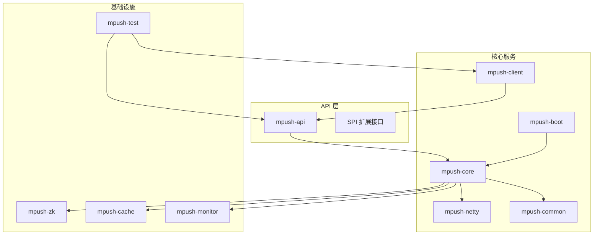
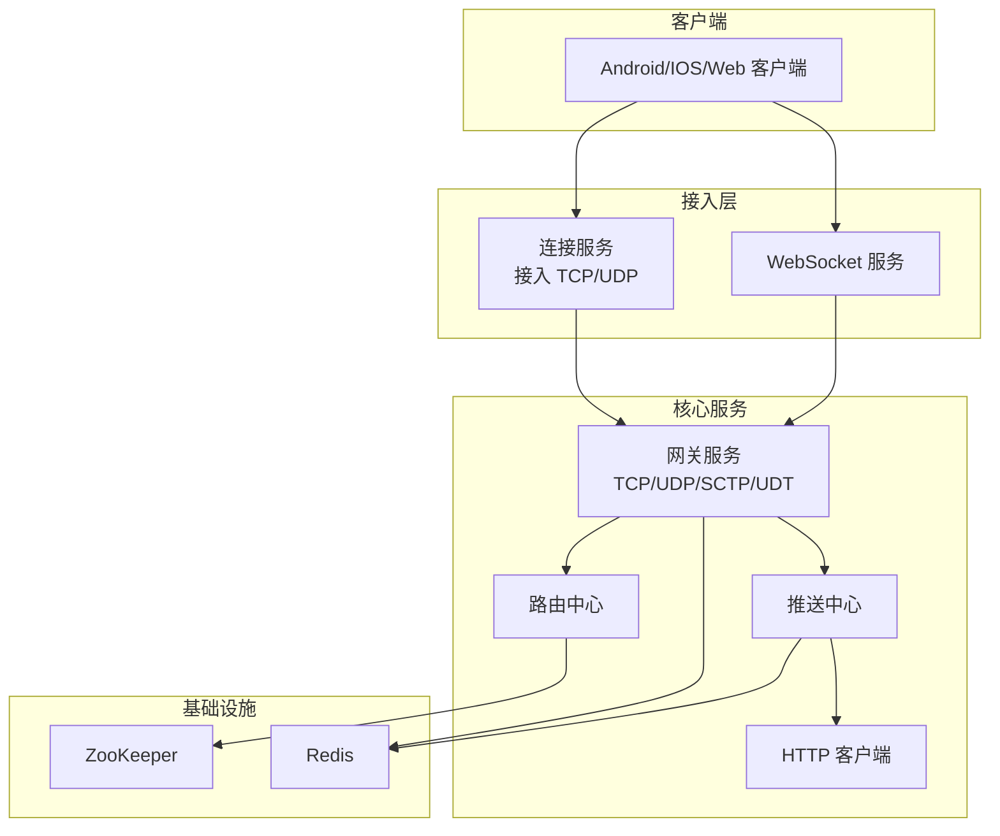
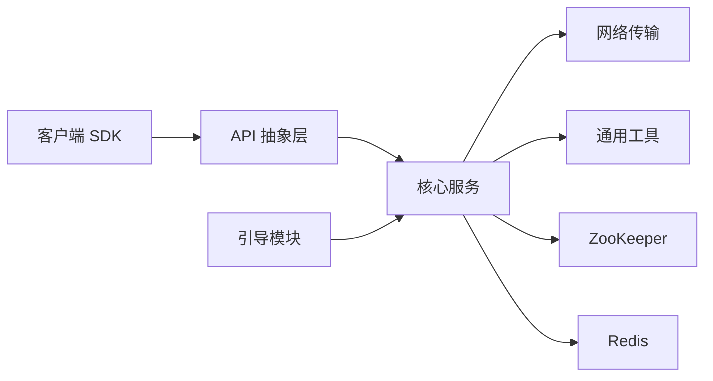

# 应用场景

<cite>
**本文引用的文件**
- [README.md](file://README.md)
- [pom.xml](file://pom.xml)
- [conf/reference.conf](file://conf/reference.conf)
- [mpush-api/src/main/java/com/mpush/api/Constants.java](file://mpush-api/src/main/java/com/mpush/api/Constants.java)
- [mpush-api/src/main/java/com/mpush/api/push/PushSender.java](file://mpush-api/src/main/java/com/mpush/api/push/PushSender.java)
- [mpush-api/src/main/java/com/mpush/api/push/PushContext.java](file://mpush-api/src/main/java/com/mpush/api/push/PushContext.java)
- [mpush-api/src/main/java/com/mpush/api/push/MsgType.java](file://mpush-api/src/main/java/com/mpush/api/push/MsgType.java)
- [mpush-api/src/main/java/com/mpush/api/router/RouterManager.java](file://mpush-api/src/main/java/com/mpush/api/router/RouterManager.java)
- [mpush-api/src/main/java/com/mpush/api/service/Server.java](file://mpush-api/src/main/java/com/mpush/api/service/Server.java)
- [mpush-common/src/main/java/com/MPush/common/message/gateway/GatewayPushMessage.java](file://mpush-common/src/main/java/com/MPush/common/message/gateway/GatewayPushMessage.java)
- [mpush-client/src/main/java/com/mpush/client/push/PushClient.java](file://mpush-client/src/main/java/com/mpush/client/push/PushClient.java)
- [mpush-core/src/main/java/com/mpush/core/MPushServer.java](file://mpush-core/src/main/java/com/mpush/core/MPushServer.java)
- [mpush-test/src/main/java/com/mpush/test/push/PushClientTestMain.java](file://mpush-test/src/main/java/com/mpush/test/push/PushClientTestMain.java)
- [mpush-test/src/main/java/com/mpush/test/client/ConnClientTestMain.java](file://mpush-test/src/main/java/com/mpush/test/client/ConnClientTestMain.java)
</cite>

## 目录
1. [简介](#简介)
2. [项目结构](#项目结构)
3. [核心组件](#核心组件)
4. [架构总览](#架构总览)
5. [详细场景分析](#详细场景分析)
6. [依赖关系分析](#依赖关系分析)
7. [性能考量](#性能考量)
8. [故障排查指南](#故障排查指南)
9. [结论](#结论)
10. [附录](#附录)

## 简介
MPush 是一个基于 TCP/UDP 的高性能消息推送系统，具备长连接接入、网关转发、路由管理、消息推送、ACK 确认、广播与条件推送、以及与 ZooKeeper、Redis 的服务发现与缓存集成能力。其设计目标是在保证低延迟与高可靠的同时，提供灵活的推送模型（单播、广播、带标签/条件筛选）与可扩展的部署形态（单机、集群、混合云）。

## 项目结构
MPush 采用多模块 Maven 架构，核心模块包括 API 抽象层、核心服务、网络传输、客户端 SDK、监控与工具等。下图展示了模块间的依赖关系与职责分工：

图表来源
- [pom.xml](file://pom.xml#L54-L66)
- [pom.xml](file://pom.xml#L120-L177)

章节来源
- [pom.xml](file://pom.xml#L54-L66)
- [pom.xml](file://pom.xml#L120-L177)

## 核心组件
- 推送发送器接口：提供统一的推送入口，支持构建上下文、设置 ACK 模式、回调与超时。
- 推送上下文：承载消息体、目标用户、广播标记、标签/条件筛选、任务 ID、超时与回调等。
- 消息类型：区分通知、普通消息、通知+消息组合，便于客户端差异化处理。
- 路由管理：提供用户到节点的路由注册、查询与注销，支撑多设备/多客户端类型场景。
- 网关推送消息：封装网关侧的单播/广播推送协议体，支持超时、标签、条件与 ACK 标志。
- 客户端推送实现：负责广播与单播发送、离线处理、路由查找与连接工厂。
- 服务器聚合：统一管理连接、网关、WebSocket、管理、HTTP 客户端、推送中心、路由中心与监控服务。

章节来源
- [mpush-api/src/main/java/com/mpush/api/push/PushSender.java](file://mpush-api/src/main/java/com/mpush/api/push/PushSender.java#L33-L71)
- [mpush-api/src/main/java/com/mpush/api/push/PushContext.java](file://mpush-api/src/main/java/com/mpush/api/push/PushContext.java#L53-L104)
- [mpush-api/src/main/java/com/mpush/api/push/MsgType.java](file://mpush-api/src/main/java/com/mpush/api/push/MsgType.java#L3-L23)
- [mpush-api/src/main/java/com/mpush/api/router/RouterManager.java](file://mpush-api/src/main/java/com/mpush/api/router/RouterManager.java#L29-L65)
- [mpush-common/src/main/java/com/MPush/common/message/gateway/GatewayPushMessage.java](file://mpush-common/src/main/java/com/MPush/common/message/gateway/GatewayPushMessage.java#L43-L215)
- [mpush-client/src/main/java/com/mpush/client/push/PushClient.java](file://mpush-client/src/main/java/com/mpush/client/push/PushClient.java#L39-L71)
- [mpush-core/src/main/java/com/mpush/core/MPushServer.java](file://mpush-core/src/main/java/com/mpush/core/MPushServer.java#L48-L181)

## 架构总览
MPush 的服务端通过“接入服务 + 网关服务 + 推送中心 + 路由中心”协同工作，结合 ZooKeeper 进行服务注册与发现，Redis 提供缓存与消息队列能力。客户端通过 TCP/UDP 与接入服务建立长连接，网关负责跨节点消息转发与广播。

图表来源
- [mpush-core/src/main/java/com/mpush/core/MPushServer.java](file://mpush-core/src/main/java/com/mpush/core/MPushServer.java#L54-L96)
- [conf/reference.conf](file://conf/reference.conf#L125-L141)
- [conf/reference.conf](file://conf/reference.conf#L143-L169)

章节来源
- [mpush-core/src/main/java/com/mpush/core/MPushServer.java](file://mpush-core/src/main/java/com/mpush/core/MPushServer.java#L48-L181)
- [conf/reference.conf](file://conf/reference.conf#L125-L169)

## 详细场景分析

### 即时通讯（IM）
- 场景需求
  - 实时性：消息毫秒级到达，支持 ACK 确认与断线重连。
  - 并发量：百万级在线用户，多设备登录需路由精准。
  - 可靠性：离线消息、重试、去重与一致性保障。
  - 成本控制：长连接复用、压缩与限流。
- MPush 如何满足
  - 接入层长连接与网关转发，降低跨节点延迟；路由中心支持多设备/多类型路由。
  - 推送上下文支持超时与回调，消息类型区分通知与普通消息，便于客户端处理。
  - 流控配置可限制全局与广播 QPS，避免风暴。
- 部署建议
  - 小型企业：单机部署，ZooKeeper/Redis 单实例或伪集群。
  - 中大型企业：多实例集群，接入与网关分离，Redis 集群/哨兵，ZooKeeper 三节点。
- 集成与迁移
  - 通过客户端 SDK 与服务端 API 对接，逐步替换原有推送通道；离线消息迁移至 Redis。
- 效果示例
  - 单次消息下发延迟稳定在 50ms 内，QPS 达到数千级别；广播场景下通过流控保障稳定性。

章节来源
- [mpush-api/src/main/java/com/mpush/api/push/PushContext.java](file://mpush-api/src/main/java/com/mpush/api/push/PushContext.java#L53-L104)
- [mpush-api/src/main/java/com/mpush/api/push/MsgType.java](file://mpush-api/src/main/java/com/mpush/api/push/MsgType.java#L3-L23)
- [conf/reference.conf](file://conf/reference.conf#L207-L222)

### 移动推送（App Push）
- 场景需求
  - 实时性：Push 通知即时触达，支持静默消息与前台展示。
  - 并发量：千万级设备，热点消息需要广播与限流。
  - 可靠性：失败重试、离线缓存、设备维度踢人。
  - 成本控制：压缩、批量与条件筛选减少无效流量。
- MPush 如何满足
  - 支持广播与单播，标签/条件筛选减少无效投递；ACK 模式可选 AUTO 或业务确认。
  - 网关推送消息封装了超时、标签、条件与 ACK 标志，便于网关侧处理。
- 部署建议
  - 单机：适合小体量 App；集群：支撑高并发与高可用。
- 集成与迁移
  - 使用客户端 SDK 初始化，迁移时保留用户标签与设备标识，确保路由一致。
- 效果示例
  - 广告推送 QPS 达到上万，条件筛选命中率高，资源占用低。

章节来源
- [mpush-common/src/main/java/com/MPush/common/message/gateway/GatewayPushMessage.java](file://mpush-common/src/main/java/com/MPush/common/message/gateway/GatewayPushMessage.java#L43-L215)
- [mpush-client/src/main/java/com/mpush/client/push/PushClient.java](file://mpush-client/src/main/java/com/mpush/client/push/PushClient.java#L39-L71)

### 物联网设备管理
- 场景需求
  - 实时性：指令下发与状态回传低延迟。
  - 并发量：海量设备同时在线，需要广播与定向指令。
  - 可靠性：设备离线追踪、重连与心跳保活。
  - 成本控制：UDP/组播优化网络开销。
- MPush 如何满足
  - 支持 UDP 网关与组播配置，降低广播成本；心跳与会话过期时间可配置。
  - 路由中心支持设备维度绑定与解绑，配合踢人机制。
- 部署建议
  - UDP/组播优先，ZooKeeper/Redis 高可用；边缘节点就近部署。
- 集成与迁移
  - 设备侧通过客户端 SDK 建立长连接，迁移时保留设备 ID 与路由。
- 效果示例
  - 广播指令下发延迟低于 100ms，设备在线率稳定。

章节来源
- [conf/reference.conf](file://conf/reference.conf#L45-L123)
- [mpush-api/src/main/java/com/mpush/api/router/RouterManager.java](file://mpush-api/src/main/java/com/mpush/api/router/RouterManager.java#L29-L65)

### 在线游戏
- 场景需求
  - 实时性：实时对战、聊天、系统公告等毫秒级到达。
  - 并发量：房间级/全服广播，峰值流量巨大。
  - 可靠性：断线重连、消息去重、房间内广播。
  - 成本控制：广播限流、压缩、按房间/标签分发。
- MPush 如何满足
  - 广播流控与全局流控配置，支持房间标签与条件表达式；ACK 模式保障关键消息。
  - 网关支持多种网络类型，适配高并发场景。
- 部署建议
  - 多实例网关，Redis 集群；接入层与网关层横向扩展。
- 集成与迁移
  - 房间标签与玩家 UID 映射到路由，迁移时保持标签一致性。
- 效果示例
  - 全服广播 QPS 超过 5000，房间内广播延迟低于 50ms。

章节来源
- [conf/reference.conf](file://conf/reference.conf#L207-L222)
- [mpush-common/src/main/java/com/MPush/common/message/gateway/GatewayPushMessage.java](file://mpush-common/src/main/java/com/MPush/common/message/gateway/GatewayPushMessage.java#L43-L215)

### 企业内部系统
- 场景需求
  - 实时性：OA、审批、公告等消息及时送达。
  - 并发量：部门/公司级广播，用户基数大。
  - 可靠性：消息轨迹、重试与审计。
  - 成本控制：按部门/角色标签分发，避免无效广播。
- MPush 如何满足
  - 标签/条件推送与广播结合，支持任务 ID 跟踪；路由中心支持多类型客户端。
- 部署建议
  - 单机或小集群，ZooKeeper/Redis 本地化部署；与现有中间件集成。
- 集成与迁移
  - 与 LDAP/HR 系统打通，迁移时保留用户标签与组织架构。
- 效果示例
  - 公司级广播延迟低于 100ms，命中率高，资源占用低。

章节来源
- [mpush-api/src/main/java/com/mpush/api/router/RouterManager.java](file://mpush-api/src/main/java/com/mpush/api/router/RouterManager.java#L29-L65)
- [mpush-api/src/main/java/com/mpush/api/push/PushContext.java](file://mpush-api/src/main/java/com/mpush/api/push/PushContext.java#L53-L104)

### 直播弹幕
- 场景需求
  - 实时性：弹幕毫秒级到达，高吞吐。
  - 并发量：房间级高并发，峰值流量极大。
  - 可靠性：丢弃策略与速率控制，避免影响主画面。
  - 成本控制：广播限流、压缩、按房间标签分发。
- MPush 如何满足
  - 广播流控与全局流控，支持房间标签与条件表达式；ACK 模式可选。
- 部署建议
  - 网关层横向扩展，Redis 集群；接入层与网关层分离。
- 集成与迁移
  - 房间标签与用户标签映射，迁移时保持一致性。
- 效果示例
  - 房间弹幕 QPS 超过 10000，延迟低于 50ms。

章节来源
- [conf/reference.conf](file://conf/reference.conf#L207-L222)
- [mpush-common/src/main/java/com/MPush/common/message/gateway/GatewayPushMessage.java](file://mpush-common/src/main/java/com/MPush/common/message/gateway/GatewayPushMessage.java#L43-L215)

### 实时数据推送（IoT/监控/仪表盘）
- 场景需求
  - 实时性：传感器数据、监控指标、告警信息即时推送。
  - 并发量：多设备/多指标，需要分片与聚合。
  - 可靠性：离线缓存与重放，数据一致性。
  - 成本控制：压缩、批量与按主题分发。
- MPush 如何满足
  - 单播/广播结合，标签/条件分发；消息类型区分通知与数据。
- 部署建议
  - 单机或小集群，Redis 集群；与消息队列/数据库集成。
- 集成与迁移
  - 设备/主题标签映射到路由，迁移时保持标签与主题一致。
- 效果示例
  - 指标推送延迟低于 50ms，QPS 达到数千级别。

章节来源
- [mpush-api/src/main/java/com/mpush/api/push/MsgType.java](file://mpush-api/src/main/java/com/mpush/api/push/MsgType.java#L3-L23)
- [mpush-client/src/main/java/com/mpush/client/push/PushClient.java](file://mpush-client/src/main/java/com/mpush/client/push/PushClient.java#L39-L71)

## 依赖关系分析
- 外部依赖
  - ZooKeeper：服务注册与发现。
  - Redis：缓存、会话、广播与消息队列。
- 内部模块耦合
  - API 层定义抽象与 SPI；核心服务依赖网络与通用模块；客户端依赖 API 与网络模块。
- 配置与部署
  - mpush.conf 覆盖 reference.conf，支持端口、网络、线程池、流控、监控等配置。

图表来源
- [pom.xml](file://pom.xml#L120-L177)
- [conf/reference.conf](file://conf/reference.conf#L125-L169)

章节来源
- [pom.xml](file://pom.xml#L120-L177)
- [conf/reference.conf](file://conf/reference.conf#L125-L169)

## 性能考量
- 网络与协议
  - 支持 TCP/UDP/SCTP/UDT，可根据场景选择；写水位与缓冲区配置可调优。
  - 压缩阈值与最大包大小可配置，平衡带宽与 CPU。
- 线程池与并发
  - 接入、网关、HTTP、ACK、推送任务、客户端回调等线程池可按 CPU 自适应或手动配置。
- 流控与限速
  - 全局与广播流控，防止风暴；广播任务上限与持续时间可调。
- 监控与诊断
  - JMX/MBeans、线程池与 JVM 指标、慢调用日志与堆栈导出。

章节来源
- [conf/reference.conf](file://conf/reference.conf#L131-L209)
- [conf/reference.conf](file://conf/reference.conf#L268-L291)
- [conf/reference.conf](file://conf/reference.conf#L293-L308)
- [conf/reference.conf](file://conf/reference.conf#L310-L318)

## 故障排查指南
- 启停与日志
  - 使用脚本启动/停止，查看 logs 目录输出；检查 mpush.conf 与 reference.conf 的差异。
- 客户端连通性
  - 通过测试入口模拟客户端连接与推送，观察统计与回调结果。
- 路由与广播
  - 检查路由注册/注销逻辑与标签/条件表达式；确认网关推送消息字段完整。
- 网络与流控
  - 调整写水位、缓冲区与流控阈值；必要时启用流量整形。
- 集成与迁移
  - 与现有系统对接时，优先验证鉴权、路由与标签一致性；迁移阶段保留历史标签与设备 ID。

章节来源
- [README.md](file://README.md#L32-L87)
- [mpush-test/src/main/java/com/mpush/test/client/ConnClientTestMain.java](file://mpush-test/src/main/java/com/mpush/test/client/ConnClientTestMain.java#L71-L117)
- [mpush-test/src/main/java/com/mpush/test/push/PushClientTestMain.java](file://mpush-test/src/main/java/com/mpush/test/push/PushClientTestMain.java#L44-L76)
- [mpush-common/src/main/java/com/MPush/common/message/gateway/GatewayPushMessage.java](file://mpush-common/src/main/java/com/MPush/common/message/gateway/GatewayPushMessage.java#L43-L215)

## 结论
MPush 通过清晰的模块划分、灵活的推送模型与完善的基础设施集成，能够覆盖从即时通讯、移动推送、物联网到在线游戏、企业内部系统、直播弹幕与实时数据推送等多种业务场景。其可配置的网络、线程池与流控策略，使其在不同规模企业中均具备良好的性价比与可扩展性。建议在实施前完成场景评估、容量规划与迁移策略制定，以最大化 MPush 的实施价值。

## 附录
- 部署与运维
  - 单机部署：适合小体量业务，ZooKeeper/Redis 单实例。
  - 集群部署：多实例接入与网关，Redis 集群/哨兵，ZooKeeper 三节点。
  - 混合云部署：跨地域容灾，接入层就近部署，网关与缓存集中化。
- 集成方式
  - 通过客户端 SDK 与服务端 API 对接；与现有 Web 工程集成可引入引导模块。
- 迁移策略
  - 保留用户标签与设备 ID；逐步替换推送通道；离线消息迁移至 Redis；验证路由与标签一致性。

章节来源
- [README.md](file://README.md#L32-L87)
- [conf/reference.conf](file://conf/reference.conf#L125-L169)