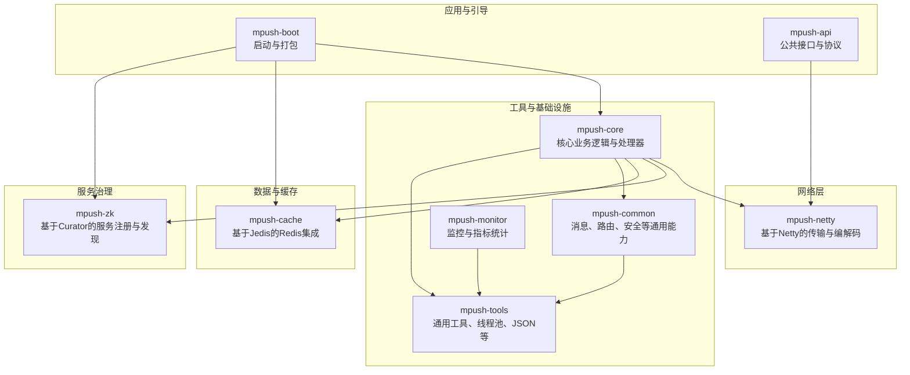
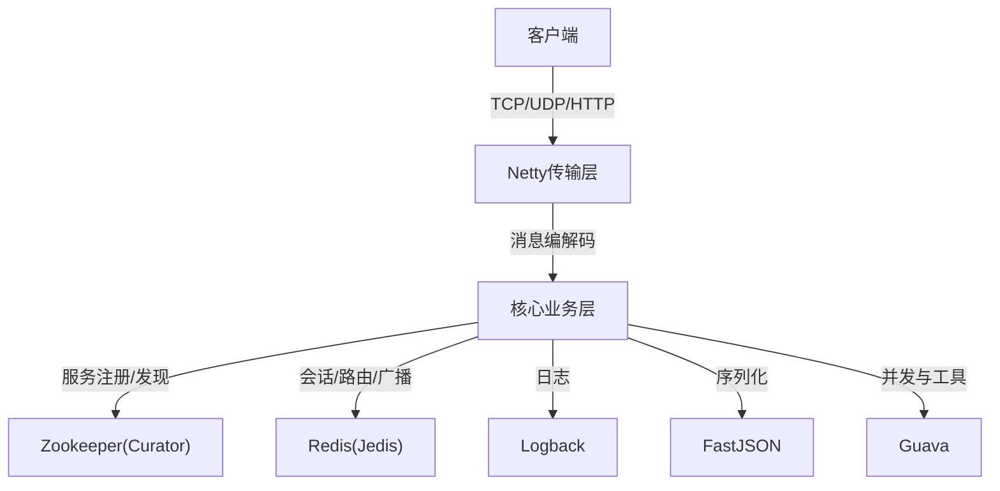
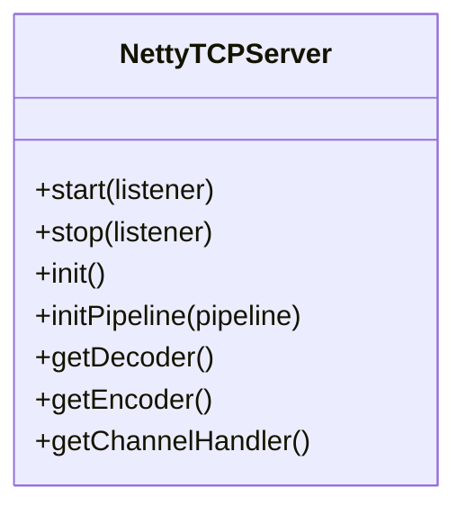
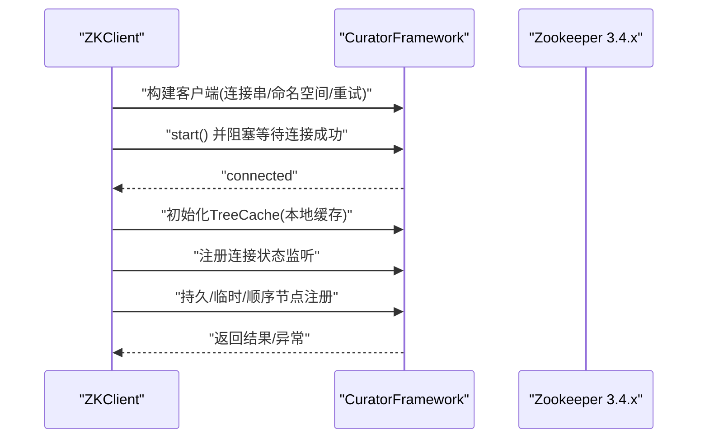
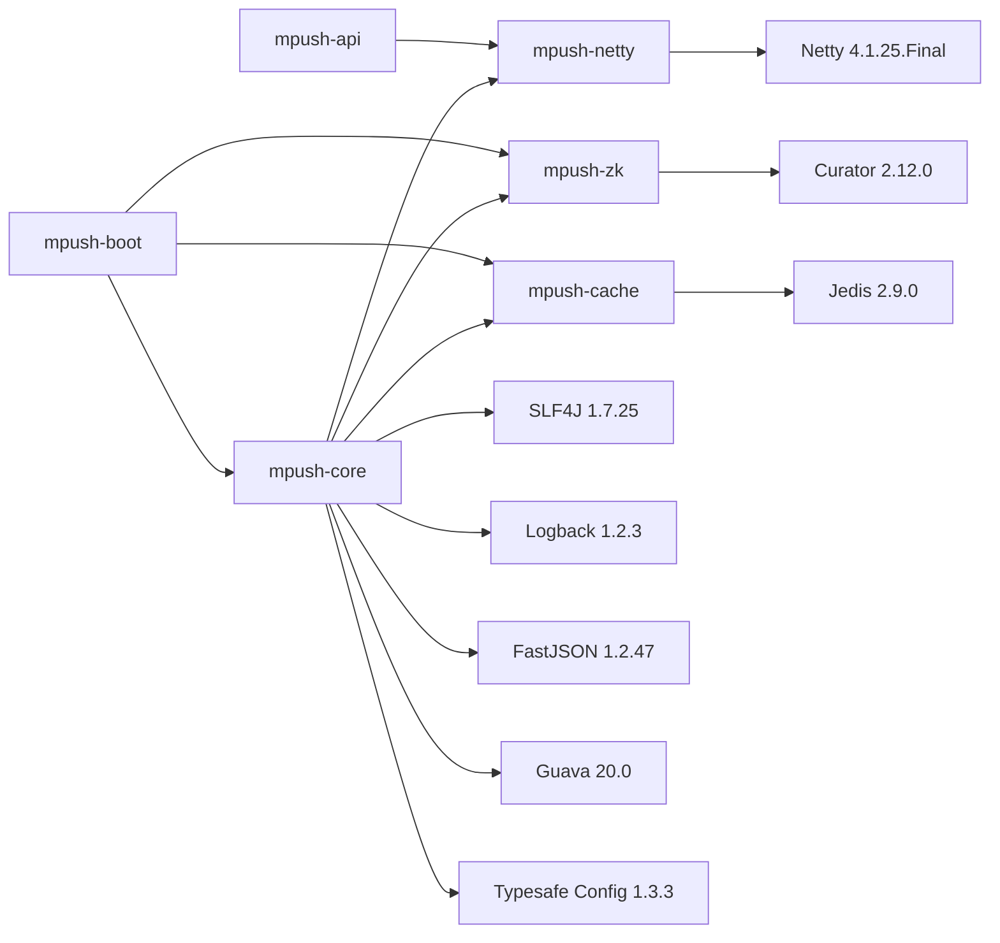

# 技术栈概览

<cite>
**本文引用的文件**
- [pom.xml](file://pom.xml)
- [mpush-api/pom.xml](file://mpush-api/pom.xml)
- [mpush-netty/pom.xml](file://mpush-netty/pom.xml)
- [mpush-zk/pom.xml](file://mpush-zk/pom.xml)
- [mpush-cache/pom.xml](file://mpush-cache/pom.xml)
- [mpush-boot/pom.xml](file://mpush-boot/pom.xml)
- [conf/reference.conf](file://conf/reference.conf)
- [conf/conf-dev.properties](file://conf/conf-dev.properties)
- [mpush-boot/src/main/resources/logback.xml](file://mpush-boot/src/main/resources/logback.xml)
- [mpush-netty/src/main/java/com/mpush/netty/server/NettyTCPServer.java](file://mpush-netty/src/main/java/com/mpush/netty/server/NettyTCPServer.java)
- [mpush-zk/src/main/java/com/mpush/zk/ZKClient.java](file://mpush-zk/src/main/java/com/mpush/zk/ZKClient.java)
- [mpush-tools/src/main/java/com/mpush/tools/Jsons.java](file://mpush-tools/src/main/java/com/mpush/tools/Jsons.java)
- [mpush-tools/src/main/java/com/mpush/tools/thread/pool/DefaultExecutor.java](file://mpush-tools/src/main/java/com/mpush/tools/thread/pool/DefaultExecutor.java)
</cite>

## 目录
1. [简介](#简介)
2. [项目结构](#项目结构)
3. [核心组件](#核心组件)
4. [架构总览](#架构总览)
5. [组件详解](#组件详解)
6. [依赖关系分析](#依赖关系分析)
7. [性能与优化](#性能与优化)
8. [故障排查指南](#故障排查指南)
9. [结论](#结论)
10. [附录](#附录)

## 简介
本文件面向开发者与运维工程师，系统梳理 MPush 的技术栈选型与架构决策，重点解释 Java 8+、Netty 4.1.25、Zookeeper 3.4.x、Redis 2.9.0、SLF4J/Logback、FastJSON、Guava 等关键组件在系统中的职责、优势与版本兼容性，并给出升级建议与最佳实践，帮助读者快速理解 MPush 的技术基础与各组件协作关系。

## 项目结构
MPush 采用 Maven 多模块聚合工程组织，核心模块围绕“网络通信（Netty）—服务发现（Zookeeper）—缓存（Redis）—工具与日志—核心业务”展开，形成清晰的分层与职责边界。

图表来源
- [pom.xml](file://pom.xml#L54-L66)
- [mpush-boot/pom.xml](file://mpush-boot/pom.xml#L19-L32)

章节来源
- [pom.xml](file://pom.xml#L54-L66)
- [mpush-boot/pom.xml](file://mpush-boot/pom.xml#L19-L32)

## 核心组件
- 开发语言与构建
  - Java 8：统一源码与目标版本，提供稳定的 Lambda、Stream、并发工具与内存模型。
  - Maven：多模块聚合管理，集中依赖与插件配置。
- 网络通信
  - Netty 4.1.25.Final：高性能 NIO 事件驱动网络框架，提供 TCP/UDP/SCTP/UDT 传输与 HTTP 支持，结合池化 ByteBuf 降低 GC 压力。
- 服务发现与配置
  - Curator Recipes/X Discovery 2.12.0：与 Zookeeper 3.4.x 服务端兼容，提供服务注册、发现、本地缓存与连接状态监听。
- 缓存与会话
  - Jedis 2.9.0：稳定可靠的 Redis 客户端，用于会话、路由、广播与消息队列订阅。
- 日志与监控
  - SLF4J + Logback：统一日志门面与实现，支持多路滚动日志与分类输出。
- 序列化与工具
  - FastJSON 1.2.47：高性能 JSON 工具，配合自定义 Jsons 包装提升健壮性。
  - Guava 20.0：集合、缓存、并发与实用工具，提升代码质量与性能。
- 配置中心
  - Typesafe Config 1.3.3：HOCON 配置解析，配合参考配置文件与环境变量灵活部署。

章节来源
- [pom.xml](file://pom.xml#L68-L76)
- [pom.xml](file://pom.xml#L178-L284)
- [conf/reference.conf](file://conf/reference.conf#L1-L239)

## 架构总览
MPush 的整体技术栈围绕“高并发网络 + 服务治理 + 分布式缓存”的组合展开。Netty 提供底层传输与编解码；Zookeeper 负责服务注册与配置下发；Redis 负责会话、路由与消息广播；工具层提供线程池、JSON、加密等通用能力；日志与监控贯穿全链路。

图表来源
- [pom.xml](file://pom.xml#L249-L271)
- [mpush-netty/pom.xml](file://mpush-netty/pom.xml#L21-L55)
- [mpush-zk/pom.xml](file://mpush-zk/pom.xml#L21-L34)
- [mpush-cache/pom.xml](file://mpush-cache/pom.xml#L20-L29)

## 组件详解

### Java 8+ 作为开发语言
- 优势
  - 语法简洁、并发模型成熟、内存模型稳定，适合高并发网络服务。
  - 与 Netty、Curator、Jedis 等生态良好兼容。
- 版本策略
  - 源码与目标版本均为 1.8，确保跨平台一致性。
- 升级建议
  - 建议在保证兼容性的前提下逐步迁移到更高版本（如 11/17），注意第三方库的兼容窗口。

章节来源
- [pom.xml](file://pom.xml#L72-L72)

### Netty 4.1.25 作为网络通信框架
- 选择理由
  - 事件驱动、零拷贝、池化内存、丰富的传输类型（TCP/UDP/SCTP/UDT/HTTP/WebSocket），适配多种网络场景。
  - 提供 epoll/NIO 两种事件循环，Linux 下优先 epoll 提升吞吐。
- 关键特性
  - ChannelPipeline 编解码链路清晰，便于扩展。
  - PooledByteBufAllocator 降低 GC 压力。
  - 支持自定义线程池与 IO 比例，满足高 QPS 场景。
- 代码体现
  - 服务器基类统一初始化 boss/worker 线程组、绑定端口、设置分配器与编解码器。
  - 自动选择 epoll 或 NIO，按需设置 IO 比例与线程工厂。

图表来源
- [mpush-netty/src/main/java/com/mpush/netty/server/NettyTCPServer.java](file://mpush-netty/src/main/java/com/mpush/netty/server/NettyTCPServer.java#L53-L321)

章节来源
- [pom.xml](file://pom.xml#L84-L119)
- [mpush-netty/pom.xml](file://mpush-netty/pom.xml#L21-L55)
- [mpush-netty/src/main/java/com/mpush/netty/server/NettyTCPServer.java](file://mpush-netty/src/main/java/com/mpush/netty/server/NettyTCPServer.java#L104-L185)

### Zookeeper 3.4.x 用于服务发现与配置管理
- 选型依据
  - Curator 2.12.0 与 Zookeeper 3.4.x 服务端兼容，提供可靠的服务注册/发现与本地缓存。
- 能力与优势
  - 本地 TreeCache 缓存，减少频繁远程调用。
  - 连接状态监听与自动重连，保障高可用。
  - 支持持久/临时/顺序节点，满足服务实例注册与有序队列场景。
- 代码体现
  - 客户端初始化、连接等待、ACL 设置、本地缓存、增删改查与监听注册。

图表来源
- [mpush-zk/src/main/java/com/mpush/zk/ZKClient.java](file://mpush-zk/src/main/java/com/mpush/zk/ZKClient.java#L76-L145)
- [mpush-zk/src/main/java/com/mpush/zk/ZKClient.java](file://mpush-zk/src/main/java/com/mpush/zk/ZKClient.java#L147-L162)
- [mpush-zk/src/main/java/com/mpush/zk/ZKClient.java](file://mpush-zk/src/main/java/com/mpush/zk/ZKClient.java#L276-L332)

章节来源
- [pom.xml](file://pom.xml#L249-L265)
- [mpush-zk/pom.xml](file://mpush-zk/pom.xml#L21-L34)
- [mpush-zk/src/main/java/com/mpush/zk/ZKClient.java](file://mpush-zk/src/main/java/com/mpush/zk/ZKClient.java#L100-L145)

### Redis 2.9.0 作为缓存与会话存储
- 选型依据
  - Jedis 2.9.0 与当时主流 Redis 服务器版本兼容，功能完备、社区成熟。
- 能力与优势
  - 支持单机、哨兵、集群模式配置，满足不同规模与可靠性需求。
  - 与消息队列订阅结合，实现广播与异步通知。
- 代码体现
  - 通过 SPI 工厂加载缓存管理器与 MQ 客户端，统一接入配置中心。

章节来源
- [pom.xml](file://pom.xml#L266-L271)
- [mpush-cache/pom.xml](file://mpush-cache/pom.xml#L20-L29)
- [conf/reference.conf](file://conf/reference.conf#L143-L169)

### 日志与监控：SLF4J + Logback
- 选型依据
  - SLF4J 作为统一门面，Logback 作为实现，提供高性能、多路滚动日志与分类输出。
- 能力与优势
  - 多 appender 分类输出（连接、心跳、HTTP、缓存、推送、监控、性能剖析等）。
  - 支持按级别阈值过滤与时间滚动策略。
- 代码体现
  - 配置文件集中管理日志级别、路径与模板，启动时由 logback.xml 生效。

章节来源
- [pom.xml](file://pom.xml#L181-L221)
- [mpush-boot/src/main/resources/logback.xml](file://mpush-boot/src/main/resources/logback.xml#L1-L231)

### 序列化与工具：FastJSON、Guava、Apache Commons
- FastJSON 1.2.47
  - 高性能 JSON 解析与序列化，封装在 Jsons 工具类中，提供容错与类型转换能力。
- Guava 20.0
  - 提供集合、缓存、并发与实用工具，简化复杂逻辑与提升性能。
- Apache Commons Lang 3.6
  - 字符串、对象工具与反射辅助，增强通用能力。
- 代码体现
  - Jsons 对 FastJSON 的封装，提供错误日志与空值兜底。
  - DefaultExecutor 继承 ThreadPoolExecutor，统一线程池行为。

章节来源
- [pom.xml](file://pom.xml#L237-L248)
- [mpush-tools/src/main/java/com/mpush/tools/Jsons.java](file://mpush-tools/src/main/java/com/mpush/tools/Jsons.java#L38-L118)
- [mpush-tools/src/main/java/com/mpush/tools/thread/pool/DefaultExecutor.java](file://mpush-tools/src/main/java/com/mpush/tools/thread/pool/DefaultExecutor.java#L28-L39)

### 配置中心：Typesafe Config 1.3.3
- 选型依据
  - HOCON 配置格式，支持合并、占位符与环境覆盖，便于多环境部署。
- 能力与优势
  - 参考配置文件 reference.conf 提供完整参数清单，结合环境属性文件覆盖默认值。
- 代码体现
  - reference.conf 中涵盖网络、ZK、Redis、线程池、推送流控、监控等关键配置项。

章节来源
- [pom.xml](file://pom.xml#L272-L277)
- [conf/reference.conf](file://conf/reference.conf#L1-L239)
- [conf/conf-dev.properties](file://conf/conf-dev.properties#L1-L5)

## 依赖关系分析
- 模块间依赖
  - mpush-boot 依赖 mpush-core、mpush-cache、mpush-zk，负责打包与启动。
  - mpush-api 引入 Netty HTTP/Transport 依赖，作为公共接口层。
  - mpush-netty 引入 Netty 全家桶，提供传输与编解码能力。
  - mpush-zk 引入 Curator Recipes/X，提供服务注册与发现。
  - mpush-cache 引入 Jedis，提供 Redis 客户端能力。
- 第三方依赖
  - SLF4J + Logback：日志门面与实现。
  - FastJSON、Guava、Commons Lang：序列化与工具库。
  - Typesafe Config：配置解析。

图表来源
- [pom.xml](file://pom.xml#L79-L284)
- [mpush-boot/pom.xml](file://mpush-boot/pom.xml#L19-L32)
- [mpush-api/pom.xml](file://mpush-api/pom.xml#L21-L32)
- [mpush-netty/pom.xml](file://mpush-netty/pom.xml#L21-L55)
- [mpush-zk/pom.xml](file://mpush-zk/pom.xml#L21-L34)
- [mpush-cache/pom.xml](file://mpush-cache/pom.xml#L20-L29)

章节来源
- [pom.xml](file://pom.xml#L79-L284)
- [mpush-boot/pom.xml](file://mpush-boot/pom.xml#L19-L32)

## 性能与优化
- 网络层
  - 使用池化 ByteBuf 与 epoll（Linux）提升吞吐与降低 GC。
  - 合理设置写缓冲水位与流量整形，避免洪泛。
- 服务治理
  - TreeCache 本地缓存减少远程调用；连接状态监听与自动重连提升稳定性。
- 缓存层
  - 根据规模选择单机/哨兵/集群模式；合理配置连接池参数。
- 线程与并发
  - 使用统一线程池工厂与拒绝策略；按 CPU 核数动态调整工作线程。
- 日志与监控
  - 分类日志与阈值过滤，避免日志风暴；开启慢调用与性能剖析。

章节来源
- [mpush-netty/src/main/java/com/mpush/netty/server/NettyTCPServer.java](file://mpush-netty/src/main/java/com/mpush/netty/server/NettyTCPServer.java#L230-L241)
- [conf/reference.conf](file://conf/reference.conf#L95-L122)
- [conf/reference.conf](file://conf/reference.conf#L182-L205)
- [mpush-boot/src/main/resources/logback.xml](file://mpush-boot/src/main/resources/logback.xml#L1-L231)

## 故障排查指南
- 网络问题
  - 检查 epoll 是否可用、线程池大小与 IO 比例、写缓冲水位与流量整形配置。
- 服务发现问题
  - 关注连接状态监听日志、ACL 权限、命名空间与重试策略。
- 缓存问题
  - 校验 Redis 连接参数、集群/哨兵配置与连接池参数。
- 日志问题
  - 确认 logback.xml 中日志级别与输出路径，检查分类 appender 是否正确加载。

章节来源
- [mpush-netty/src/main/java/com/mpush/netty/server/NettyTCPServer.java](file://mpush-netty/src/main/java/com/mpush/netty/server/NettyTCPServer.java#L104-L185)
- [mpush-zk/src/main/java/com/mpush/zk/ZKClient.java](file://mpush-zk/src/main/java/com/mpush/zk/ZKClient.java#L147-L156)
- [conf/reference.conf](file://conf/reference.conf#L143-L169)
- [mpush-boot/src/main/resources/logback.xml](file://mpush-boot/src/main/resources/logback.xml#L182-L231)

## 结论
MPush 的技术栈以 Netty 为核心网络引擎，结合 Zookeeper 与 Redis 实现服务治理与分布式缓存，辅以 SLF4J/Logback、FastJSON、Guava 等工具库，形成高并发、可扩展、易运维的消息推送系统基础。通过合理的配置与监控，可在生产环境中获得稳定与高效的运行表现。

## 附录

### 版本兼容性与升级建议
- Java 8 → Java 11/17
  - 建议评估第三方库兼容性后再迁移，关注 Netty、Curator、Jedis、FastJSON 的新版本支持。
- Netty 4.1.25 → 新版本
  - 关注编解码链路与线程模型变化，确保自定义 ChannelHandler 兼容。
- Zookeeper 3.4.x → 3.5.x
  - Curator 3.x 与 2.x 在 API 上存在差异，需评估迁移成本与测试范围。
- Redis 2.9.0 → 新版本
  - Jedis 3.x+ 通常向后兼容，但建议验证事务与集群模式行为。
- FastJSON 1.2.47 → 新版本
  - 注意反序列化安全与类型转换行为变化，建议灰度验证。
- Guava 20.0 → 新版本
  - 大版本变更可能影响 API，建议逐项替换并回归测试。

章节来源
- [pom.xml](file://pom.xml#L72-L72)
- [pom.xml](file://pom.xml#L84-L119)
- [pom.xml](file://pom.xml#L249-L265)
- [pom.xml](file://pom.xml#L266-L271)
- [pom.xml](file://pom.xml#L244-L248)
- [pom.xml](file://pom.xml#L237-L242)