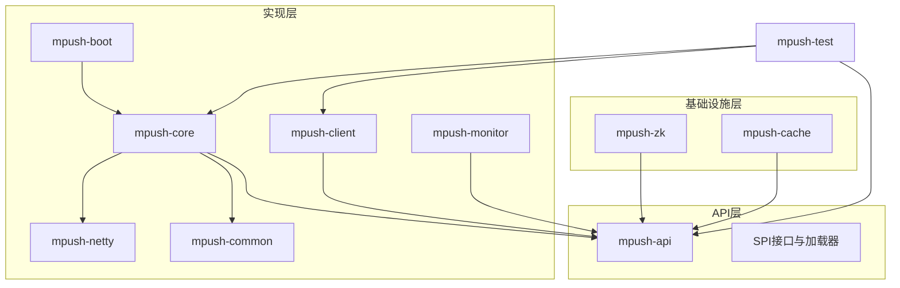
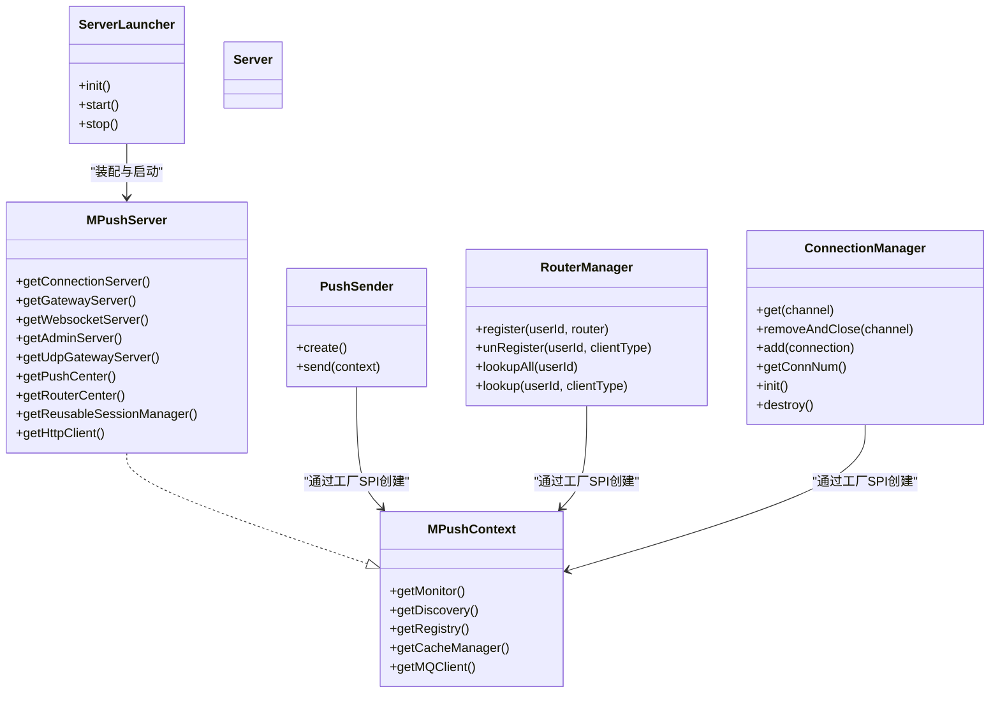
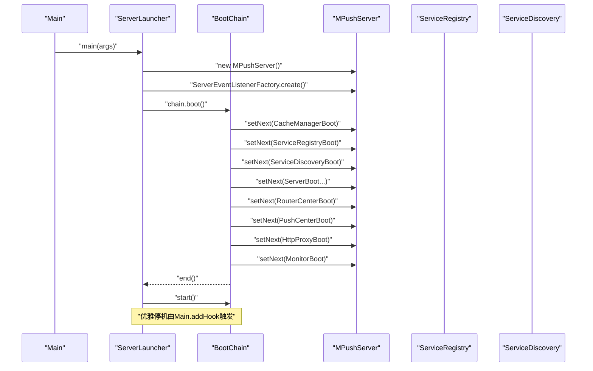
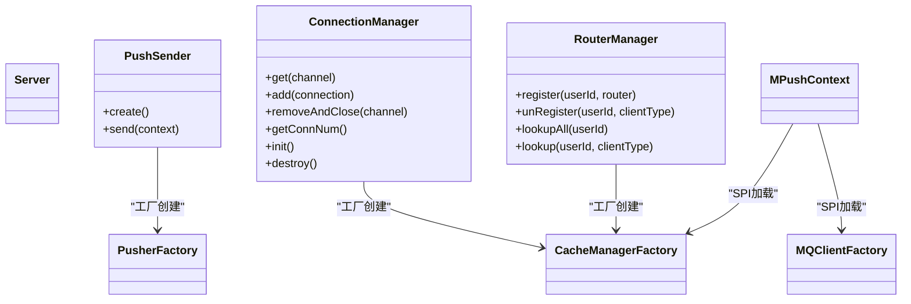
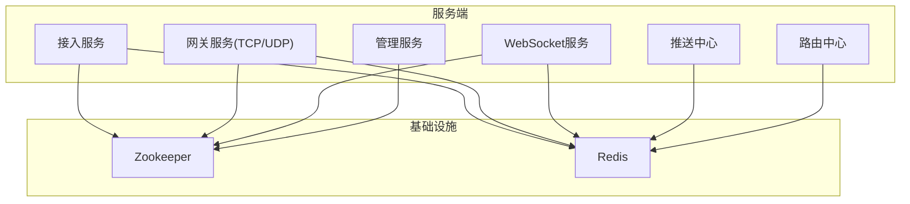
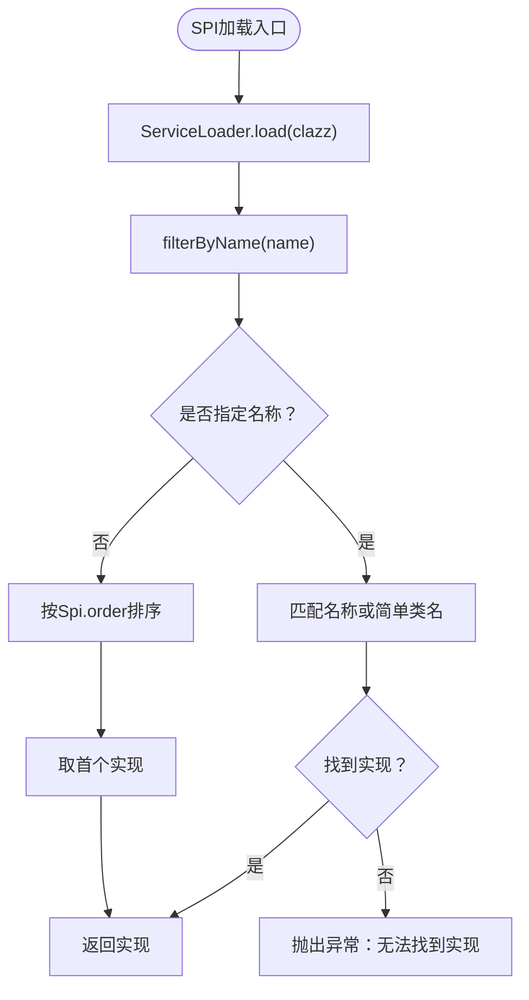
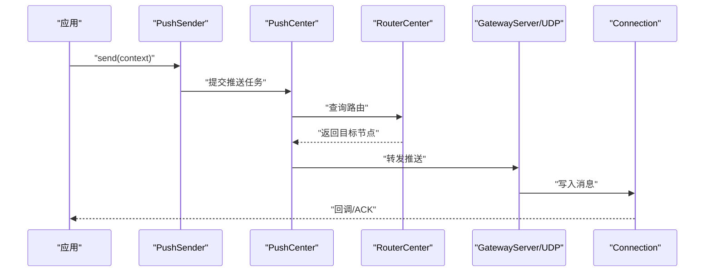
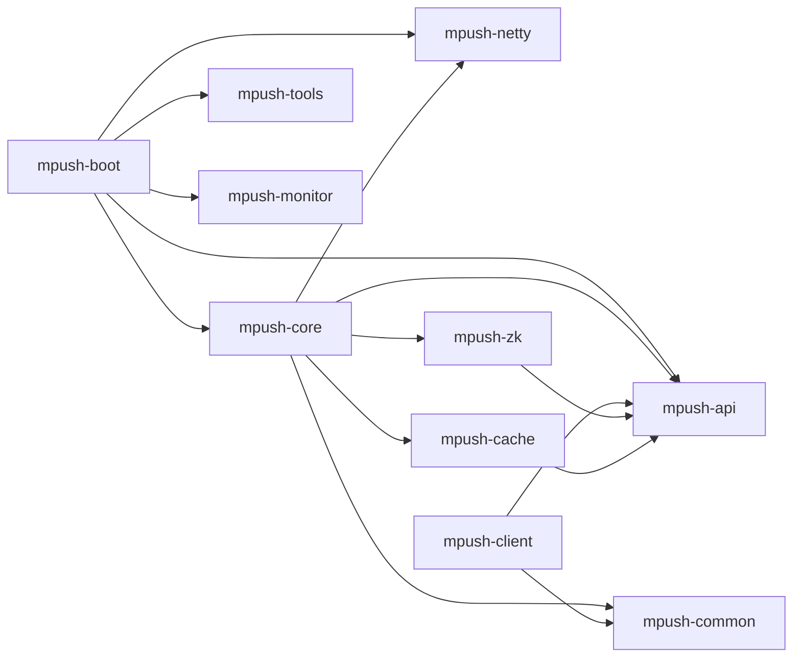

# 架构设计理念

<cite>
**本文引用的文件**
- [README.md](file://README.md)
- [pom.xml](file://pom.xml)
- [MPushContext.java](file://mpush-api/src/main/java/com/mpush/api/MPushContext.java)
- [SpiLoader.java](file://mpush-api/src/main/java/com/mpush/api/spi/SpiLoader.java)
- [Plugin.java](file://mpush-api/src/main/java/com/mpush/api/spi/Plugin.java)
- [Factory.java](file://mpush-api/src/main/java/com/mpush/api/spi/Factory.java)
- [Spi.java](file://mpush-api/src/main/java/com/mpush/api/spi/Spi.java)
- [Server.java](file://mpush-api/src/main/java/com/mpush/api/service/Server.java)
- [PushSender.java](file://mpush-api/src/main/java/com/mpush/api/push/PushSender.java)
- [ConnectionManager.java](file://mpush-api/src/main/java/com/mpush/api/connection/ConnectionManager.java)
- [RouterManager.java](file://mpush-api/src/main/java/com/mpush/api/router/RouterManager.java)
- [Main.java](file://mpush-boot/src/main/java/com/mpush/bootstrap/Main.java)
- [ServerLauncher.java](file://mpush-boot/src/main/java/com/mpush/bootstrap/ServerLauncher.java)
- [MPushServer.java](file://mpush-core/src/main/java/com/mpush/core/MPushServer.java)
- [PushCenter.java](file://mpush-core/src/main/java/com/mpush/core/push/PushCenter.java)
- [RouterCenter.java](file://mpush-core/src/main/java/com/mpush/core/router/RouterCenter.java)
- [ConnectionServer.java](file://mpush-core/src/main/java/com/mpush/core/server/ConnectionServer.java)
- [WebsocketServer.java](file://mpush-core/src/main/java/com/mpush/core/server/WebsocketServer.java)
- [GatewayServer.java](file://mpush-core/src/main/java/com/mpush/core/server/GatewayServer.java)
- [AdminServer.java](file://mpush-core/src/main/java/com/mpush/core/server/AdminServer.java)
- [GatewayUDPConnector.java](file://mpush-core/src/main/java/com/mpush/core/server/GatewayUDPConnector.java)
- [NettyConnectionManager.java](file://mpush-netty/src/main/java/com/mpush/netty/connection/NettyConnectionManager.java)
- [NettyTCPServer.java](file://mpush-netty/src/main/java/com/mpush/netty/server/NettyTCPServer.java)
- [NettyUDPConnector.java](file://mpush-netty/src/main/java/com/mpush/netty/udp/NettyUDPConnector.java)
- [ZKServiceRegistryAndDiscovery.java](file://mpush-zk/src/main/java/com/mpush/zk/ZKServiceRegistryAndDiscovery.java)
- [ZKDiscoveryFactory.java](file://mpush-zk/src/main/java/com/mpush/zk/ZKDiscoveryFactory.java)
- [ZKRegistryFactory.java](file://mpush-zk/src/main/java/com/mpush/zk/ZKRegistryFactory.java)
- [RedisCacheManagerFactory.java](file://mpush-cache/src/main/java/com/mpush/cache/redis/manager/RedisCacheManagerFactory.java)
- [RedisMQClientFactory.java](file://mpush-cache/src/main/java/com/mpush/cache/redis/mq/RedisMQClientFactory.java)
- [PushClient.java](file://mpush-client/src/main/java/com/mpush/client/push/PushClient.java)
- [PushClientFactory.java](file://mpush-client/src/main/java/com/mpush/client/push/PushClientFactory.java)
- [PusherFactory.java](file://mpush-client/src/main/java/com/mpush/client/push/PusherFactory.java)
- [CommonServiceNode.java](file://mpush-api/src/main/java/com/mpush/api/srd/CommonServiceNode.java)
- [ServiceDiscovery.java](file://mpush-api/src/main/java/com/mpush/api/srd/ServiceDiscovery.java)
- [ServiceRegistry.java](file://mpush-api/src/main/java/com/mpush/api/srd/ServiceRegistry.java)
- [CacheManagerFactory.java](file://mpush-api/src/main/java/com/mpush/api/spi/common/CacheManagerFactory.java)
</cite>

## 目录
1. [简介](#简介)
2. [项目结构](#项目结构)
3. [核心组件](#核心组件)
4. [架构总览](#架构总览)
5. [详细组件分析](#详细组件分析)
6. [依赖分析](#依赖分析)
7. [性能考量](#性能考量)
8. [故障排查指南](#故障排查指南)
9. [结论](#结论)
10. [附录](#附录)

## 简介
MPush是一个基于Netty构建的高性能消息推送系统，强调模块化、插件化、事件驱动与工厂模式的组合应用。其目标是在保证高并发与低延迟的同时，提供可扩展的服务发现、路由与推送能力，并通过SPI机制实现基础设施与业务逻辑的解耦。

## 项目结构
MPush采用多模块Maven聚合工程组织，按职责划分为API层、实现层（核心与工具）、基础设施层（Netty、Zookeeper、Redis）以及客户端与监控模块。模块间通过API层定义契约，实现层通过SPI加载具体实现，基础设施层提供可替换的实现（如ZK/Redis）。

图示来源
- [pom.xml](file://pom.xml#L54-L66)

章节来源
- [pom.xml](file://pom.xml#L54-L66)
- [README.md](file://README.md#L32-L87)

## 核心组件
- 上下文与启动
  - MPushServer作为核心容器，聚合服务节点、服务器实例、推送中心、路由中心与会话管理，并通过SPI获取监控、服务发现、注册、缓存与消息队列等能力。
  - ServerLauncher负责按顺序执行启动链路，串联缓存、服务注册/发现、各服务器、路由中心、推送中心、HTTP代理与监控等作业。
  - Main提供JVM关闭钩子，确保优雅停机。

- 服务与连接
  - Server接口抽象各类服务（接入、网关、WebSocket、管理等），ConnectionManager抽象连接生命周期管理。
  - NettyTCPServer/NettyUDPConnector提供网络传输实现；NettyConnectionManager负责连接管理。

- 推送与路由
  - PushSender定义推送发送器的统一接口，通过PusherFactory创建具体实现。
  - RouterManager定义路由注册、查询与注销的统一接口；RouterCenter负责路由中心逻辑；PushCenter负责消息推送任务编排。

- 分布式与插件
  - MPushContext统一暴露监控、服务发现、注册、缓存与MQ客户端。
  - SPI注解与SpiLoader实现基于META-INF/services的Java标准SPI加载，支持按名称与优先级选择实现。
  - Plugin接口提供插件生命周期（init/destroy），便于模块化扩展。

章节来源
- [MPushServer.java](file://mpush-core/src/main/java/com/mpush/core/MPushServer.java#L48-L181)
- [ServerLauncher.java](file://mpush-boot/src/main/java/com/mpush/bootstrap/ServerLauncher.java#L36-L104)
- [Main.java](file://mpush-boot/src/main/java/com/mpush/bootstrap/Main.java#L24-L63)
- [Server.java](file://mpush-api/src/main/java/com/mpush/api/service/Server.java#L27-L29)
- [ConnectionManager.java](file://mpush-api/src/main/java/com/mpush/api/connection/ConnectionManager.java#L31-L44)
- [PushSender.java](file://mpush-api/src/main/java/com/mpush/api/push/PushSender.java#L33-L71)
- [RouterManager.java](file://mpush-api/src/main/java/com/mpush/api/router/RouterManager.java#L29-L65)
- [MPushContext.java](file://mpush-api/src/main/java/com/mpush/api/MPushContext.java#L33-L45)
- [SpiLoader.java](file://mpush-api/src/main/java/com/mpush/api/spi/SpiLoader.java#L25-L96)
- [Plugin.java](file://mpush-api/src/main/java/com/mpush/api/spi/Plugin.java#L29-L38)
- [Factory.java](file://mpush-api/src/main/java/com/mpush/api/spi/Factory.java#L29-L31)
- [Spi.java](file://mpush-api/src/main/java/com/mpush/api/spi/Spi.java#L32-L48)

## 架构总览
MPush采用“API契约 + 实现装配 + 基础设施替换”的三层架构设计：
- API层：定义服务、连接、消息、推送、路由、SPI等通用接口与契约，确保实现层与客户端解耦。
- 实现层：提供核心服务器、推送中心、路由中心、连接管理、消息处理等实现，并通过SPI加载具体能力。
- 基础设施层：提供Zookeeper服务注册/发现与Redis缓存/MQ实现，通过工厂SPI可替换为其他实现。

图示来源
- [MPushContext.java](file://mpush-api/src/main/java/com/mpush/api/MPushContext.java#L33-L45)
- [MPushServer.java](file://mpush-core/src/main/java/com/mpush/core/MPushServer.java#L48-L181)
- [ServerLauncher.java](file://mpush-boot/src/main/java/com/mpush/bootstrap/ServerLauncher.java#L36-L104)
- [Server.java](file://mpush-api/src/main/java/com/mpush/api/service/Server.java#L27-L29)
- [PushSender.java](file://mpush-api/src/main/java/com/mpush/api/push/PushSender.java#L33-L71)
- [ConnectionManager.java](file://mpush-api/src/main/java/com/mpush/api/connection/ConnectionManager.java#L31-L44)
- [RouterManager.java](file://mpush-api/src/main/java/com/mpush/api/router/RouterManager.java#L29-L65)

## 详细组件分析

### 启动与生命周期（Main/ServerLauncher/MPushServer）
- 启动流程
  - Main初始化日志并创建ServerLauncher，执行init/start，注册JVM关闭钩子。
  - ServerLauncher通过BootChain串行执行启动作业：缓存、服务注册/发现、接入/网关/WS/管理服务、路由中心、推送中心、HTTP代理、监控。
- 生命周期
  - ServerLauncher提供stop方法，配合优雅停机策略。

图示来源
- [Main.java](file://mpush-boot/src/main/java/com/mpush/bootstrap/Main.java#L24-L63)
- [ServerLauncher.java](file://mpush-boot/src/main/java/com/mpush/bootstrap/ServerLauncher.java#L42-L71)
- [MPushServer.java](file://mpush-core/src/main/java/com/mpush/core/MPushServer.java#L71-L96)

章节来源
- [Main.java](file://mpush-boot/src/main/java/com/mpush/bootstrap/Main.java#L24-L63)
- [ServerLauncher.java](file://mpush-boot/src/main/java/com/mpush/bootstrap/ServerLauncher.java#L36-L104)
- [MPushServer.java](file://mpush-core/src/main/java/com/mpush/core/MPushServer.java#L48-L181)

### 事件驱动与工厂模式（Server/ConnectionManager/PushSender）
- 事件驱动
  - 通过EventBus与ServerEventListenerFactory创建事件监听器，贯穿启动、连接、握手、用户上下线等事件。
- 工厂模式
  - PushSender.create()通过PusherFactory创建推送发送器。
  - ConnectionManager通过工厂SPI创建具体实现。
  - RouterManager通过工厂SPI创建具体实现。
  - CacheManagerFactory/MQClientFactory等提供缓存与消息队列的工厂SPI。

图示来源
- [Server.java](file://mpush-api/src/main/java/com/mpush/api/service/Server.java#L27-L29)
- [PushSender.java](file://mpush-api/src/main/java/com/mpush/api/push/PushSender.java#L33-L71)
- [ConnectionManager.java](file://mpush-api/src/main/java/com/mpush/api/connection/ConnectionManager.java#L31-L44)
- [RouterManager.java](file://mpush-api/src/main/java/com/mpush/api/router/RouterManager.java#L29-L65)
- [CacheManagerFactory.java](file://mpush-api/src/main/java/com/mpush/api/spi/common/CacheManagerFactory.java)

章节来源
- [PushSender.java](file://mpush-api/src/main/java/com/mpush/api/push/PushSender.java#L33-L71)
- [ConnectionManager.java](file://mpush-api/src/main/java/com/mpush/api/connection/ConnectionManager.java#L31-L44)
- [RouterManager.java](file://mpush-api/src/main/java/com/mpush/api/router/RouterManager.java#L29-L65)

### 分布式架构（服务发现、注册、容错）
- 服务发现与注册
  - 通过ServiceDiscoveryFactory/ServiceRegistryFactory创建实现，ZK实现位于mpush-zk模块。
  - ZKServiceRegistryAndDiscovery提供基于Zookeeper的服务注册与发现。
- 容错与高可用
  - 通过配置项控制连接、心跳、超时与缓冲区，结合Netty的异步与零拷贝特性提升稳定性。
  - 支持TCP/UDP网关，满足不同场景的吞吐与延迟需求。

图示来源
- [ZKServiceRegistryAndDiscovery.java](file://mpush-zk/src/main/java/com/mpush/zk/ZKServiceRegistryAndDiscovery.java)
- [ZKDiscoveryFactory.java](file://mpush-zk/src/main/java/com/mpush/zk/ZKDiscoveryFactory.java)
- [ZKRegistryFactory.java](file://mpush-zk/src/main/java/com/mpush/zk/ZKRegistryFactory.java)
- [MPushServer.java](file://mpush-core/src/main/java/com/mpush/core/MPushServer.java#L162-L180)

章节来源
- [ZKServiceRegistryAndDiscovery.java](file://mpush-zk/src/main/java/com/mpush/zk/ZKServiceRegistryAndDiscovery.java)
- [ZKDiscoveryFactory.java](file://mpush-zk/src/main/java/com/mpush/zk/ZKDiscoveryFactory.java)
- [ZKRegistryFactory.java](file://mpush-zk/src/main/java/com/mpush/zk/ZKRegistryFactory.java)
- [MPushServer.java](file://mpush-core/src/main/java/com/mpush/core/MPushServer.java#L162-L180)

### SPI插件机制与扩展点
- SPI加载
  - SpiLoader基于ServiceLoader加载META-INF/services中的实现，支持按名称过滤与按Spi注解order排序。
- 扩展点
  - 插件接口Plugin提供init/destroy生命周期。
  - 工厂接口Factory提供函数式工厂能力。
  - 典型扩展点：PusherFactory、CacheManagerFactory、MQClientFactory、ServerEventListenerFactory、BindValidatorFactory、PushHandlerFactory、DnsMappingManager、ClientClassifierFactory等。

图示来源
- [SpiLoader.java](file://mpush-api/src/main/java/com/mpush/api/spi/SpiLoader.java#L52-L95)
- [Spi.java](file://mpush-api/src/main/java/com/mpush/api/spi/Spi.java#L32-L48)
- [Plugin.java](file://mpush-api/src/main/java/com/mpush/api/spi/Plugin.java#L29-L38)
- [Factory.java](file://mpush-api/src/main/java/com/mpush/api/spi/Factory.java#L29-L31)

章节来源
- [SpiLoader.java](file://mpush-api/src/main/java/com/mpush/api/spi/SpiLoader.java#L25-L96)
- [Spi.java](file://mpush-api/src/main/java/com/mpush/api/spi/Spi.java#L32-L48)
- [Plugin.java](file://mpush-api/src/main/java/com/mpush/api/spi/Plugin.java#L29-L38)
- [Factory.java](file://mpush-api/src/main/java/com/mpush/api/spi/Factory.java#L29-L31)

### 客户端与推送流程
- 客户端
  - PushClientFactory/PusherFactory创建推送客户端，PushClient封装推送请求与回调。
- 推送流程
  - PushSender.send(...)提交推送任务，PushCenter编排推送，RouterCenter定位目标节点，网关转发至目标连接。

图示来源
- [PushSender.java](file://mpush-api/src/main/java/com/mpush/api/push/PushSender.java#L33-L71)
- [PushCenter.java](file://mpush-core/src/main/java/com/mpush/core/push/PushCenter.java)
- [RouterCenter.java](file://mpush-core/src/main/java/com/mpush/core/router/RouterCenter.java)
- [GatewayServer.java](file://mpush-core/src/main/java/com/mpush/core/server/GatewayServer.java)
- [GatewayUDPConnector.java](file://mpush-core/src/main/java/com/mpush/core/server/GatewayUDPConnector.java)
- [NettyConnectionManager.java](file://mpush-netty/src/main/java/com/mpush/netty/connection/NettyConnectionManager.java)

章节来源
- [PushSender.java](file://mpush-api/src/main/java/com/mpush/api/push/PushSender.java#L33-L71)
- [PushCenter.java](file://mpush-core/src/main/java/com/mpush/core/push/PushCenter.java)
- [RouterCenter.java](file://mpush-core/src/main/java/com/mpush/core/router/RouterCenter.java)
- [GatewayServer.java](file://mpush-core/src/main/java/com/mpush/core/server/GatewayServer.java)
- [GatewayUDPConnector.java](file://mpush-core/src/main/java/com/mpush/core/server/GatewayUDPConnector.java)
- [NettyConnectionManager.java](file://mpush-netty/src/main/java/com/mpush/netty/connection/NettyConnectionManager.java)

## 依赖分析
- 模块依赖
  - mpush-boot依赖mpush-core、mpush-api、mpush-netty、mpush-tools、mpush-monitor等。
  - mpush-core依赖mpush-api、mpush-netty、mpush-common、mpush-zk、mpush-cache等。
  - mpush-client依赖mpush-api、mpush-common等。
  - mpush-zk与mpush-cache提供SPI实现并通过META-INF/services暴露给API层。
- 外部依赖
  - Netty、Curator、Jedis、HOCON配置等。

图示来源
- [pom.xml](file://pom.xml#L54-L66)

章节来源
- [pom.xml](file://pom.xml#L54-L66)

## 性能考量
- 网络与序列化
  - 使用Netty提供高性能网络传输，支持EPOLL/NIO，具备写水位保护与流量整形配置。
- 并发与线程池
  - 通过ThreadPoolManager与EventBus线程池隔离事件与MQ处理，避免阻塞。
- 缓存与消息
  - Redis作为缓存与消息通道，支持集群/哨兵模式，降低跨节点通信成本。
- 流控与限速
  - 提供全局与广播级别的QPS流控配置，防止过载。

章节来源
- [README.md](file://README.md#L103-L325)

## 故障排查指南
- 启动与停止
  - 若启动失败，检查日志输出与配置文件覆盖关系；确认JVM参数与环境变量。
  - 关闭钩子确保优雅停机，避免强制退出导致资源泄漏。
- 服务发现与注册
  - Zookeeper地址与命名空间需一致；ACL与重试策略需合理配置。
- 连接与路由
  - 检查连接数、缓冲区与写水位；确认路由表一致性与回源路径。
- 推送与ACK
  - 关注推送结果回调与ACK超时处理，必要时调整线程池与队列容量。

章节来源
- [Main.java](file://mpush-boot/src/main/java/com/mpush/bootstrap/Main.java#L49-L62)
- [README.md](file://README.md#L32-L87)

## 结论
MPush通过清晰的分层与契约、灵活的SPI插件机制、事件驱动与工厂模式，构建了可扩展、可替换且高性能的消息推送平台。其分布式能力（ZK服务发现/注册、Redis缓存/MQ）与Netty高性能网络栈共同保障了系统的稳定性与可运维性。未来可在多活容灾、动态扩缩容与可观测性方面持续演进。

## 附录
- 配置参考与部署要点见README中的“服务部署”与“配置文件详解”。

章节来源
- [README.md](file://README.md#L32-L325)