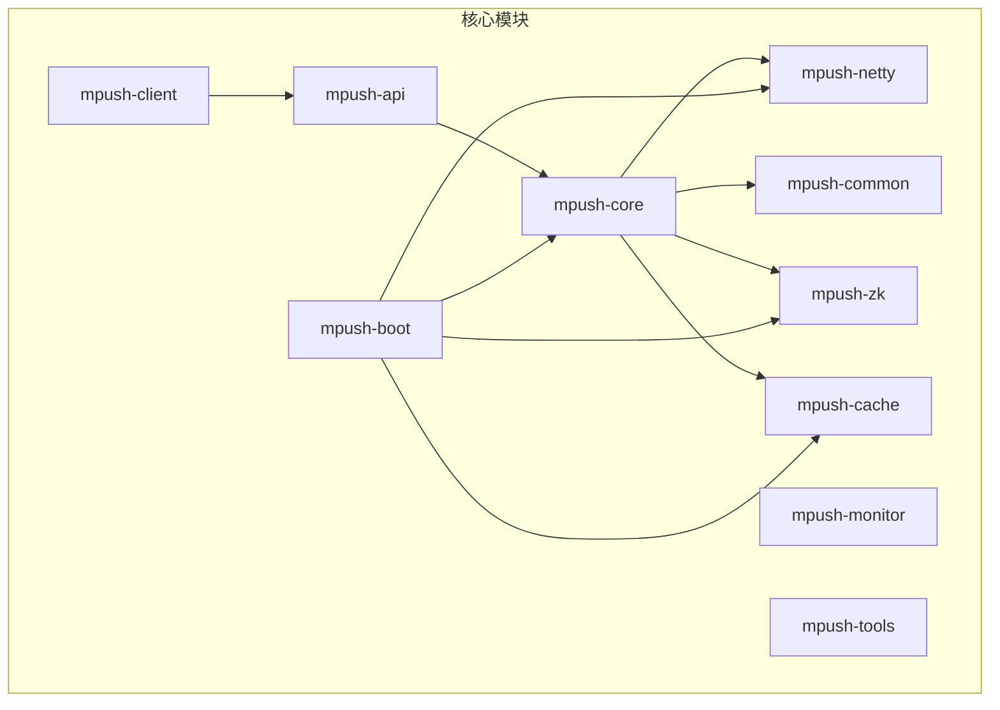
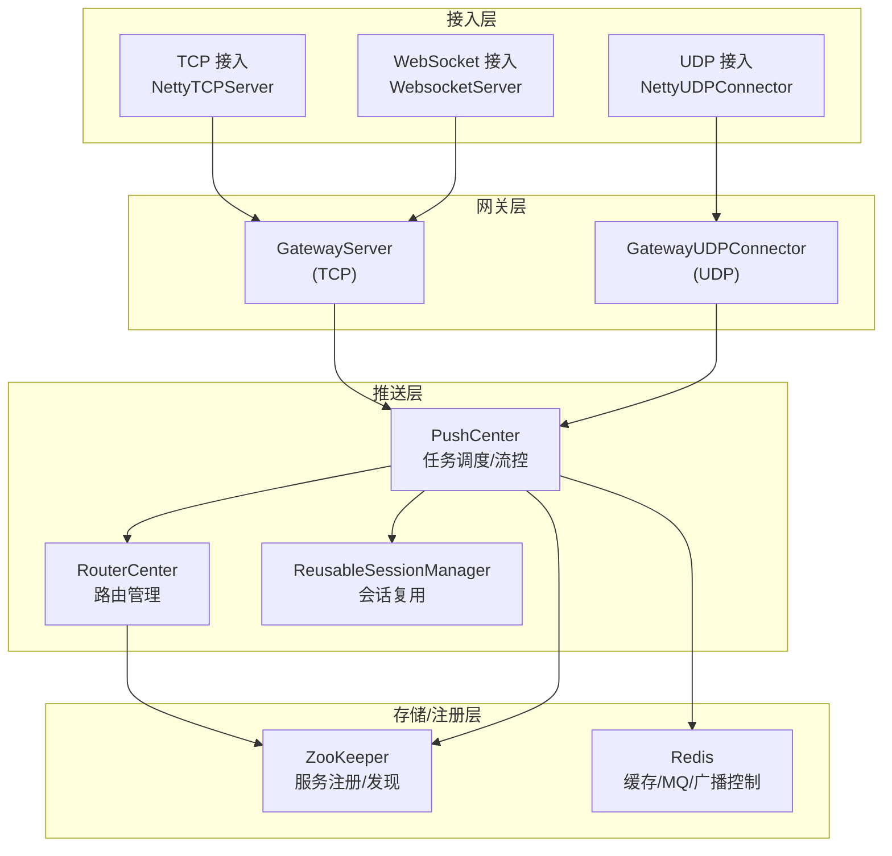
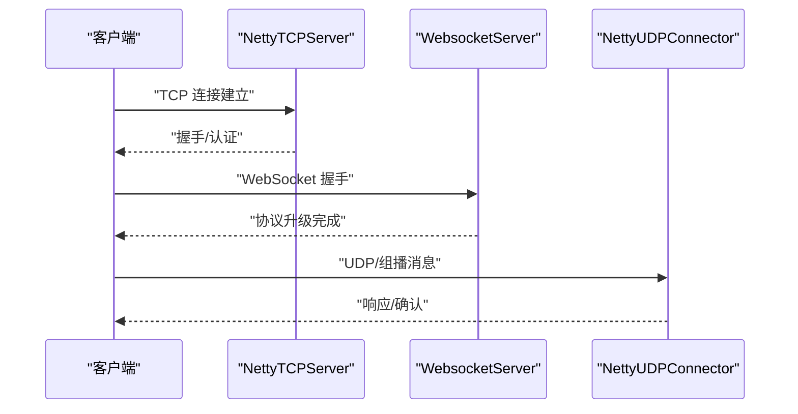
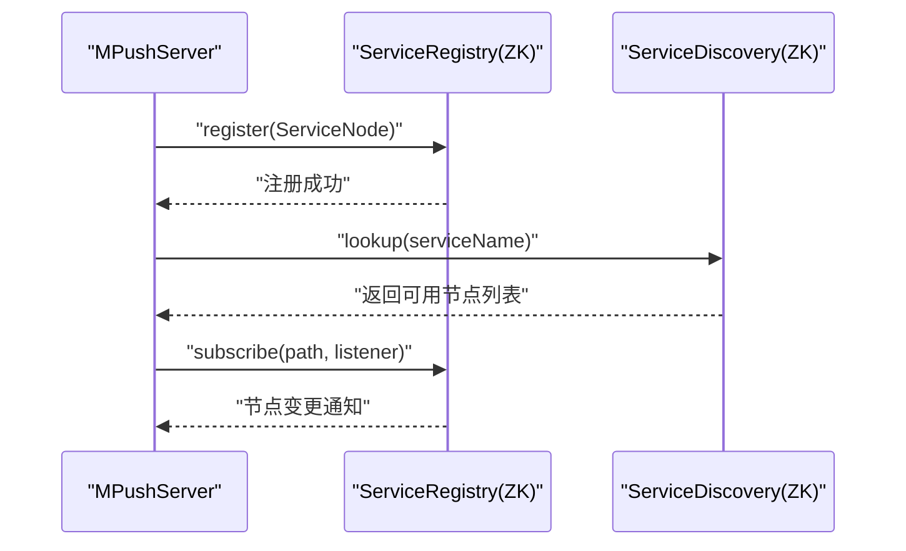
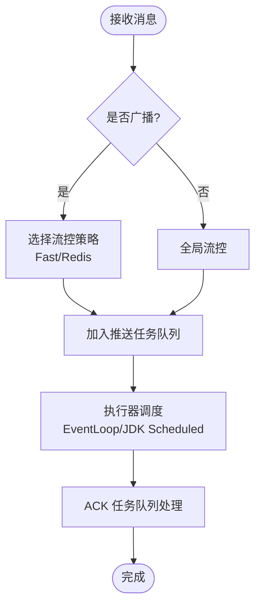
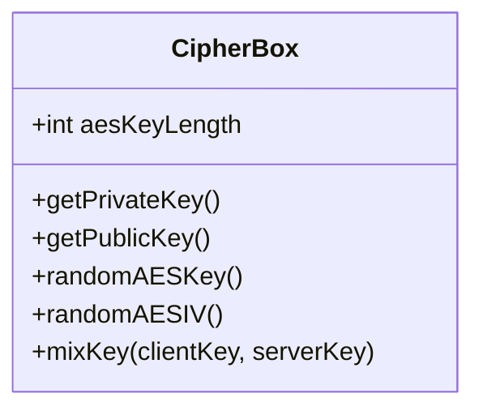
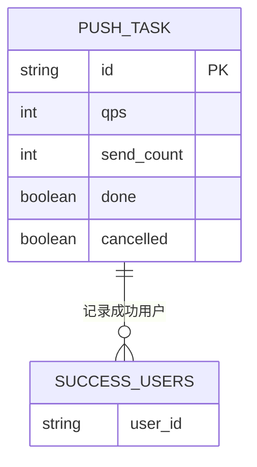
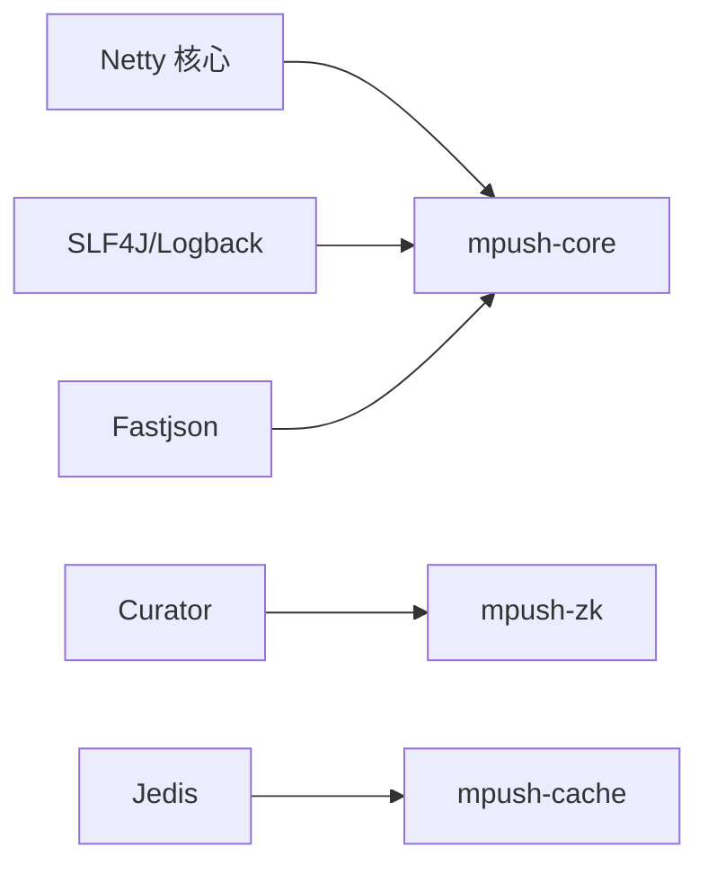

# 核心特性

<cite>
**本文引用的文件**
- [README.md](file://README.md)
- [pom.xml](file://pom.xml)
- [conf/reference.conf](file://conf/reference.conf)
- [mpush-api/src/main/java/com/MPush/api/Constants.java](file://mpush-api/src/main/java/com/MPush/api/Constants.java)
- [mpush-boot/src/main/java/com/MPush/bootstrap/Main.java](file://mpush-boot/src/main/java/com/MPush/bootstrap/Main.java)
- [mpush-core/src/main/java/com/MPush/core/MPushServer.java](file://mpush-core/src/main/java/com/MPush/core/MPushServer.java)
- [mpush-netty/src/main/java/com/MPush/netty/server/NettyTCPServer.java](file://mpush-netty/src/main/java/com/MPush/netty/server/NettyTCPServer.java)
- [mpush-netty/src/main/java/com/MPush/netty/udp/NettyUDPConnector.java](file://mpush-netty/src/main/java/com/MPush/netty/udp/NettyUDPConnector.java)
- [mpush-core/src/main/java/com/MPush/core/server/WebsocketServer.java](file://mpush-core/src/main/java/com/MPush/core/server/WebsocketServer.java)
- [mpush-common/src/main/java/com/MPush/common/security/CipherBox.java](file://mpush-common/src/main/java/com/MPush/common/security/CipherBox.java)
- [mpush-zk/src/main/java/com/MPush/zk/ZKServiceRegistryAndDiscovery.java](file://mpush-zk/src/main/java/com/MPush/zk/ZKServiceRegistryAndDiscovery.java)
- [mpush-common/src/main/java/com/MPush/common/push/RedisBroadcastController.java](file://mpush-common/src/main/java/com/MPush/common/push/RedisBroadcastController.java)
- [mpush-core/src/main/java/com/MPush/core/push/PushCenter.java](file://mpush-core/src/main/java/com/MPush/core/push/PushCenter.java)
</cite>

## 目录
1. [简介](#简介)
2. [项目结构](#项目结构)
3. [核心组件](#核心组件)
4. [架构总览](#架构总览)
5. [详细组件分析](#详细组件分析)
6. [依赖分析](#依赖分析)
7. [性能考量](#性能考量)
8. [故障排查指南](#故障排查指南)
9. [结论](#结论)
10. [附录](#附录)

## 简介
MPush 是一个基于 Netty 的高性能消息推送系统，具备多协议接入（TCP/UDP/WebSocket）、分布式部署、高并发处理、安全加密、服务发现与注册、以及可扩展的推送流控与广播控制能力。系统通过模块化设计与 SPI 扩展机制，支持灵活的部署模式与业务定制。

## 项目结构
MPush 采用 Maven 多模块结构，核心模块包括：
- mpush-api：公共接口与协议定义
- mpush-core：核心服务与路由、推送、会话管理
- mpush-netty：基于 Netty 的网络层实现（TCP/UDP）
- mpush-common：通用工具、安全、流控、广播控制器
- mpush-zk：基于 ZooKeeper 的服务注册与发现
- mpush-cache：缓存与消息队列适配（Redis）
- mpush-client：客户端 SDK（Java/Android/iOS）
- mpush-monitor：监控与 JMX
- mpush-tools：通用工具与线程池
- mpush-boot：启动入口与装配

图表来源
- [pom.xml](file://pom.xml#L54-L66)

章节来源
- [pom.xml](file://pom.xml#L54-L66)

## 核心组件
- 服务器编排与上下文：MPushServer 负责组装连接服务、WebSocket 服务、网关服务（TCP/UDP）、推送中心、路由中心、会话管理与监控服务，并通过 SPI 创建服务发现、注册、缓存与 MQ 客户端。
- 网络层：NettyTCPServer 提供基于 Netty 的 TCP 服务骨架；NettyUDPConnector 提供 UDP/组播连接能力；WebsocketServer 在 TCP 基础上叠加 HTTP/WebSocket 协议栈。
- 安全与加密：CipherBox 提供 RSA 私钥/公钥加载与会话密钥混合算法，配合 AES 参数配置，保障握手与会话阶段的数据安全。
- 分布式与注册发现：ZKServiceRegistryAndDiscovery 基于 Curator 封装，提供持久/临时节点注册、订阅变更与节点查询。
- 推送与流控：PushCenter 负责任务调度与执行，区分单播与广播，结合全局流控与 Redis 流控实现 QPS 控制与广播进度跟踪。
- 广播控制：RedisBroadcastController 基于 Redis Hash/List 实现广播任务状态、发送计数、取消标记与成功用户列表维护。

章节来源
- [mpush-core/src/main/java/com/MPush/core/MPushServer.java](file://mpush-core/src/main/java/com/MPush/core/MPushServer.java#L48-L181)
- [mpush-netty/src/main/java/com/MPush/netty/server/NettyTCPServer.java](file://mpush-netty/src/main/java/com/MPush/netty/server/NettyTCPServer.java#L53-L321)
- [mpush-netty/src/main/java/com/MPush/netty/udp/NettyUDPConnector.java](file://mpush-netty/src/main/java/com/MPush/netty/udp/NettyUDPConnector.java#L49-L124)
- [mpush-core/src/main/java/com/MPush/core/server/WebsocketServer.java](file://mpush-core/src/main/java/com/MPush/core/server/WebsocketServer.java#L48-L124)
- [mpush-common/src/main/java/com/MPush/common/security/CipherBox.java](file://mpush-common/src/main/java/com/MPush/common/security/CipherBox.java#L34-L93)
- [mpush-zk/src/main/java/com/MPush/zk/ZKServiceRegistryAndDiscovery.java](file://mpush-zk/src/main/java/com/MPush/zk/ZKServiceRegistryAndDiscovery.java#L39-L119)
- [mpush-core/src/main/java/com/MPush/core/push/PushCenter.java](file://mpush-core/src/main/java/com/MPush/core/push/PushCenter.java#L49-L183)
- [mpush-common/src/main/java/com/MPush/common/push/RedisBroadcastController.java](file://mpush-common/src/main/java/com/MPush/common/push/RedisBroadcastController.java#L34-L104)

## 架构总览
MPush 采用“接入层-网关层-推送层-存储/注册层”的分层架构。接入层支持 TCP、UDP、WebSocket；网关层负责转发与协议适配；推送层负责消息路由与执行；存储/注册层由 Redis 与 ZooKeeper 提供缓存与服务治理能力。

图表来源
- [mpush-core/src/main/java/com/MPush/core/MPushServer.java](file://mpush-core/src/main/java/com/MPush/core/MPushServer.java#L50-L96)
- [mpush-netty/src/main/java/com/MPush/netty/server/NettyTCPServer.java](file://mpush-netty/src/main/java/com/MPush/netty/server/NettyTCPServer.java#L104-L113)
- [mpush-netty/src/main/java/com/MPush/netty/udp/NettyUDPConnector.java](file://mpush-netty/src/main/java/com/MPush/netty/udp/NettyUDPConnector.java#L58-L69)
- [mpush-core/src/main/java/com/MPush/core/server/WebsocketServer.java](file://mpush-core/src/main/java/com/MPush/core/server/WebsocketServer.java#L58-L64)
- [mpush-zk/src/main/java/com/MPush/zk/ZKServiceRegistryAndDiscovery.java](file://mpush-zk/src/main/java/com/MPush/zk/ZKServiceRegistryAndDiscovery.java#L78-L91)
- [mpush-common/src/main/java/com/MPush/common/push/RedisBroadcastController.java](file://mpush-common/src/main/java/com/MPush/common/push/RedisBroadcastController.java#L41-L51)

## 详细组件分析

### 多协议支持（TCP/UDP/WebSocket）
- TCP 接入：基于 NettyTCPServer，支持 epoll/NIO 事件循环，通道管线包含解码器、编码器与业务处理器，支持背压与缓冲区配置。
- UDP 接入：基于 NettyUDPConnector，支持广播与组播场景，适用于低延迟广播与多播消息。
- WebSocket 接入：在 TCP 基础上叠加 HTTP/WS 协议栈，支持压缩与路径配置，便于浏览器直连。

图表来源
- [mpush-netty/src/main/java/com/MPush/netty/server/NettyTCPServer.java](file://mpush-netty/src/main/java/com/MPush/netty/server/NettyTCPServer.java#L104-L185)
- [mpush-core/src/main/java/com/MPush/core/server/WebsocketServer.java](file://mpush-core/src/main/java/com/MPush/core/server/WebsocketServer.java#L94-L101)
- [mpush-netty/src/main/java/com/MPush/netty/udp/NettyUDPConnector.java](file://mpush-netty/src/main/java/com/MPush/netty/udp/NettyUDPConnector.java#L71-L97)

章节来源
- [mpush-netty/src/main/java/com/MPush/netty/server/NettyTCPServer.java](file://mpush-netty/src/main/java/com/MPush/netty/server/NettyTCPServer.java#L53-L321)
- [mpush-core/src/main/java/com/MPush/core/server/WebsocketServer.java](file://mpush-core/src/main/java/com/MPush/core/server/WebsocketServer.java#L48-L124)
- [mpush-netty/src/main/java/com/MPush/netty/udp/NettyUDPConnector.java](file://mpush-netty/src/main/java/com/MPush/netty/udp/NettyUDPConnector.java#L49-L124)

### 分布式部署架构与服务发现/注册
- 服务注册与发现：ZKServiceRegistryAndDiscovery 支持持久/临时节点注册、子节点查询与变更监听，便于动态扩缩容与故障剔除。
- 服务节点：MPushServer 在启动时构建连接/网关/WebSocket 服务节点，注册到 ZooKeeper，供客户端与上游服务发现。

图表来源
- [mpush-core/src/main/java/com/MPush/core/MPushServer.java](file://mpush-core/src/main/java/com/MPush/core/MPushServer.java#L71-L96)
- [mpush-zk/src/main/java/com/MPush/zk/ZKServiceRegistryAndDiscovery.java](file://mpush-zk/src/main/java/com/MPush/zk/ZKServiceRegistryAndDiscovery.java#L78-L112)

章节来源
- [mpush-zk/src/main/java/com/MPush/zk/ZKServiceRegistryAndDiscovery.java](file://mpush-zk/src/main/java/com/MPush/zk/ZKServiceRegistryAndDiscovery.java#L39-L119)
- [mpush-core/src/main/java/com/MPush/core/MPushServer.java](file://mpush-core/src/main/java/com/MPush/core/MPushServer.java#L50-L96)

### 高性能消息推送与高并发处理
- 推送中心：PushCenter 根据消息类型选择不同执行器（Netty EventLoop 或自定义 JDK ScheduledExecutor），支持广播与单播任务分离，结合全局/Redis 流控实现 QPS 控制。
- ACK 任务队列：异步处理 ACK 超时与重试，提升可靠性与吞吐。
- 会话复用：ReusableSessionManager 降低频繁握手成本，提升连接复用效率。

图表来源
- [mpush-core/src/main/java/com/MPush/core/push/PushCenter.java](file://mpush-core/src/main/java/com/MPush/core/push/PushCenter.java#L72-L109)

章节来源
- [mpush-core/src/main/java/com/MPush/core/push/PushCenter.java](file://mpush-core/src/main/java/com/MPush/core/push/PushCenter.java#L49-L183)

### 安全加密机制
- 密钥管理：CipherBox 加载配置中的 RSA 私钥/公钥，生成随机 AES Key/IV，并提供会话密钥混合算法，确保握手与会话阶段的数据机密性与完整性。
- 配置项：安全相关参数在配置文件中集中管理，支持密钥长度与算法参数调整。

图表来源
- [mpush-common/src/main/java/com/MPush/common/security/CipherBox.java](file://mpush-common/src/main/java/com/MPush/common/security/CipherBox.java#L34-L93)

章节来源
- [mpush-common/src/main/java/com/MPush/common/security/CipherBox.java](file://mpush-common/src/main/java/com/MPush/common/security/CipherBox.java#L34-L93)
- [conf/reference.conf](file://conf/reference.conf#L33-L43)

### 负载均衡策略
- 服务节点权重：通过注册节点属性（如权重）参与排序与选择，结合服务发现结果实现就近/权重优先的负载均衡。
- 端口与路径：接入层提供公网/内网端口与 WebSocket 路径配置，便于反向代理与网关层分流。

章节来源
- [conf/reference.conf](file://conf/reference.conf#L139-L141)
- [conf/reference.conf](file://conf/reference.conf#L68-L69)
- [mpush-core/src/main/java/com/MPush/core/MPushServer.java](file://mpush-core/src/main/java/com/MPush/core/MPushServer.java#L71-L75)

### 广播控制与进度追踪
- Redis 广播控制器：基于 Hash 字段记录任务状态、QPS、发送计数与取消标记；基于 List 记录成功用户 ID，便于进度查询与重放。
- 任务生命周期：支持动态更新 QPS、取消任务、累计发送计数与成功用户收集。

图表来源
- [mpush-common/src/main/java/com/MPush/common/push/RedisBroadcastController.java](file://mpush-common/src/main/java/com/MPush/common/push/RedisBroadcastController.java#L47-L51)
- [mpush-common/src/main/java/com/MPush/common/push/RedisBroadcastController.java](file://mpush-common/src/main/java/com/MPush/common/push/RedisBroadcastController.java#L58-L98)

章节来源
- [mpush-common/src/main/java/com/MPush/common/push/RedisBroadcastController.java](file://mpush-common/src/main/java/com/MPush/common/push/RedisBroadcastController.java#L34-L104)

### 启动与上下文初始化
- 启动入口：Main 负责初始化日志、创建 ServerLauncher 并注册 JVM 关闭钩子，保证优雅停机。
- 上下文：MPushServer 构造时即完成监控、事件总线、会话管理、推送中心、路由中心与各服务节点的初始化。

章节来源
- [mpush-boot/src/main/java/com/MPush/bootstrap/Main.java](file://mpush-boot/src/main/java/com/MPush/bootstrap/Main.java#L24-L63)
- [mpush-core/src/main/java/com/MPush/core/MPushServer.java](file://mpush-core/src/main/java/com/MPush/core/MPushServer.java#L71-L96)

## 依赖分析
- 核心依赖：Netty（TCP/UDP/WebSocket/UDT/SCTP）、Curator（ZK 客户端）、Jedis（Redis 客户端）、SLF4J/Logback（日志）、Fastjson（序列化）。
- 模块耦合：核心模块围绕 API 层解耦，网络层与协议层通过 Netty 抽象统一；注册/发现与缓存通过 SPI 工厂解耦，便于替换实现。

图表来源
- [pom.xml](file://pom.xml#L84-L120)
- [pom.xml](file://pom.xml#L250-L271)
- [pom.xml](file://pom.xml#L181-L221)

章节来源
- [pom.xml](file://pom.xml#L79-L285)

## 性能考量
- 线程模型：NettyTCPServer 支持 epoll/NIO，Boss/Worker 线程分离，可配置 IO 比例与线程数量；WebSocket 在 TCP 线程池上复用，减少上下文切换。
- 缓冲与背压：通道选项配置发送/接收缓冲区与写水位线，避免内存暴涨；UDP/组播场景开启广播与复用地址。
- 流量整形与限流：配置全局/广播 QPS 限制与 Redis 流控，结合任务队列与 ACK 超时处理，平衡吞吐与可靠性。
- 会话复用：ReusableSessionManager 降低握手开销，适合高频短连接场景。

章节来源
- [mpush-netty/src/main/java/com/MPush/netty/server/NettyTCPServer.java](file://mpush-netty/src/main/java/com/MPush/netty/server/NettyTCPServer.java#L230-L241)
- [conf/reference.conf](file://conf/reference.conf#L181-L208)
- [conf/reference.conf](file://conf/reference.conf#L209-L222)
- [mpush-core/src/main/java/com/MPush/core/push/PushCenter.java](file://mpush-core/src/main/java/com/MPush/core/push/PushCenter.java#L99-L103)

## 故障排查指南
- 启动与停止：通过 Main 的 JVM 关闭钩子确保优雅停机；若出现死循环或非守护线程阻塞，检查自定义线程工厂与未捕获异常。
- 网络问题：确认 bind IP/端口配置、缓冲区大小与写水位线；TCP/UDP/WS 端口需与防火墙/反向代理一致。
- 注册发现：检查 ZooKeeper 地址、命名空间与 ACL 设置；确认节点注册/订阅回调是否生效。
- 推送异常：查看 PushCenter 任务队列与 ACK 超时日志；核对广播任务键空间与 Redis 连接状态。
- 安全问题：确认 RSA 私钥/公钥格式与长度，避免加载失败导致握手失败。

章节来源
- [mpush-boot/src/main/java/com/MPush/bootstrap/Main.java](file://mpush-boot/src/main/java/com/MPush/bootstrap/Main.java#L49-L62)
- [conf/reference.conf](file://conf/reference.conf#L125-L141)
- [mpush-core/src/main/java/com/MPush/core/push/PushCenter.java](file://mpush-core/src/main/java/com/MPush/core/push/PushCenter.java#L112-L117)

## 结论
MPush 通过模块化设计与 Netty 高性能网络栈，实现了多协议接入、分布式服务治理、高并发推送与安全加密的统一平台。其可配置的流控与广播控制、服务发现与注册、以及灵活的部署模式，使其能够满足从中小规模到大规模的推送场景需求。建议在生产环境结合实际 QPS 与延迟目标，优化线程池、缓冲区与限流参数，并完善监控与告警体系。

## 附录
- 配置参考：参考 conf/reference.conf 中的网络、安全、线程池、推送流控与监控配置项，按需覆盖 mpush.conf。
- 客户端类型：官方提供 Java/Android/iOS 客户端，支持 TCP/UDP/WebSocket 协议接入。
- 部署模式：可独立部署服务端，也可嵌入现有 Web 工程；支持 ZooKeeper 与 Redis 集群部署。

章节来源
- [README.md](file://README.md#L32-L88)
- [conf/reference.conf](file://conf/reference.conf#L1-L239)