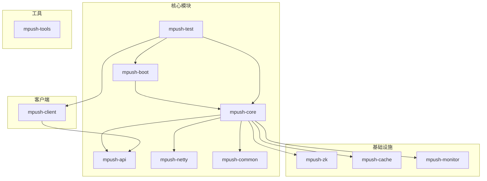
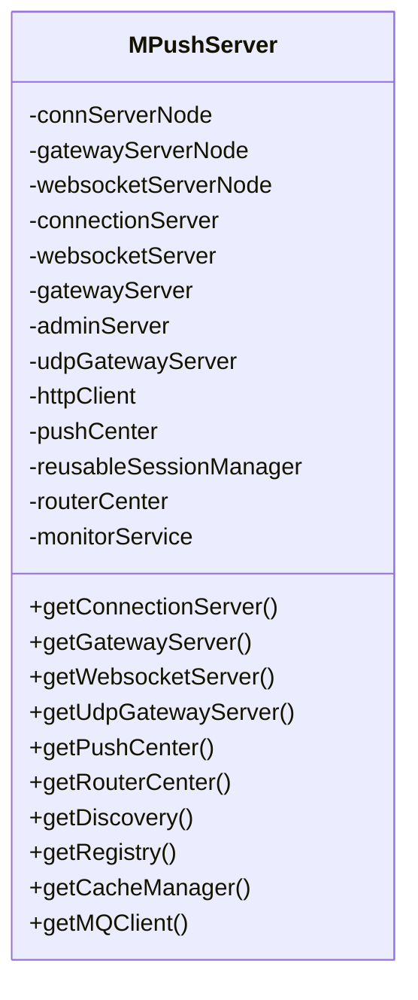
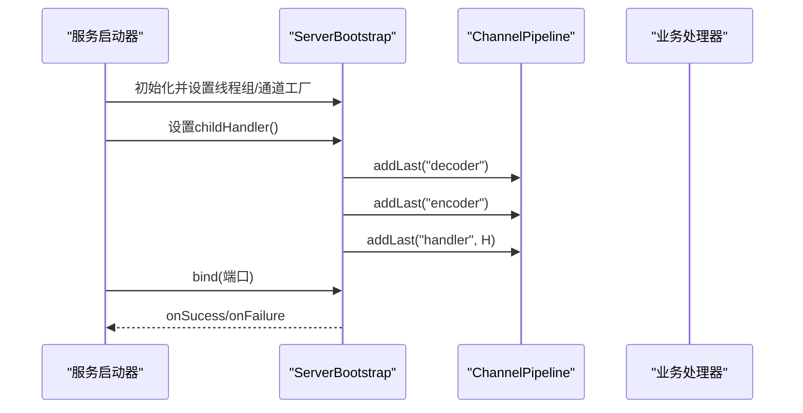
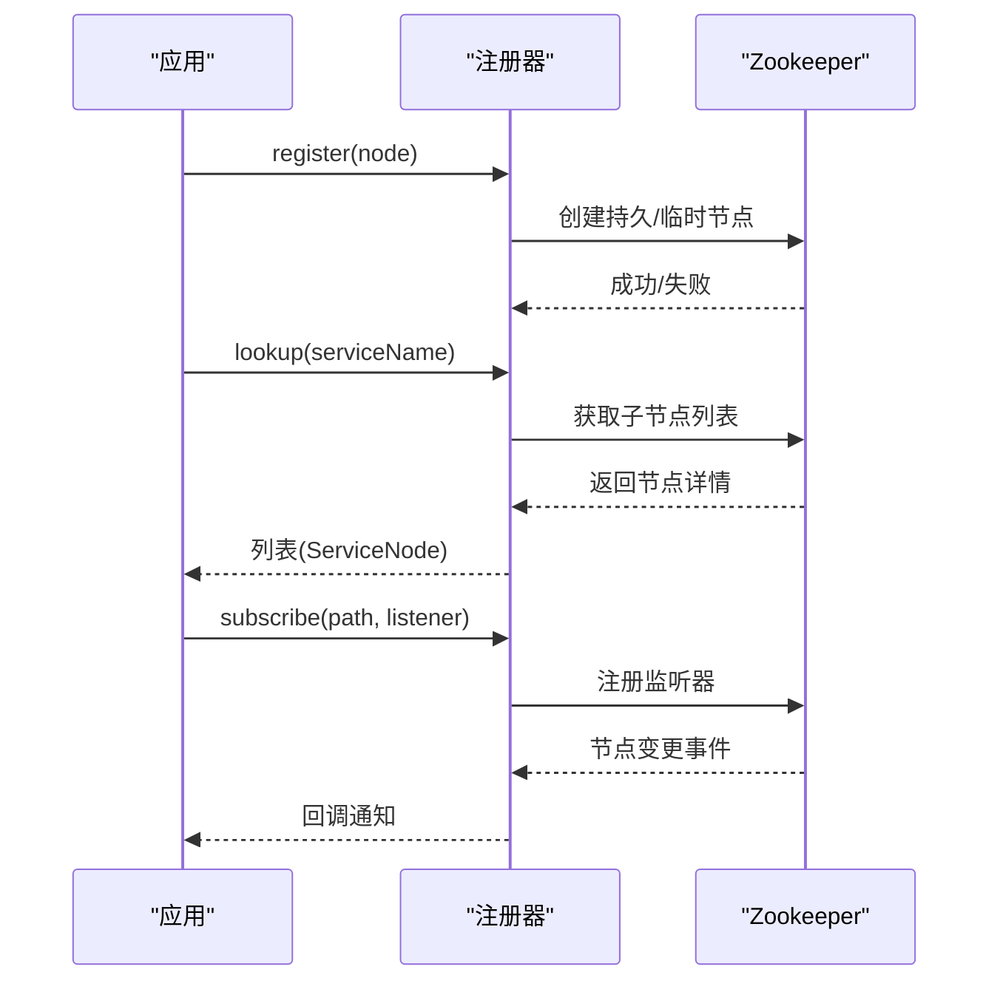
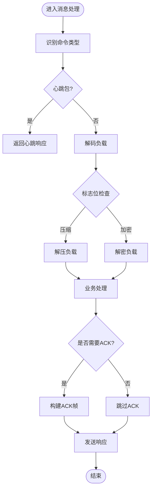
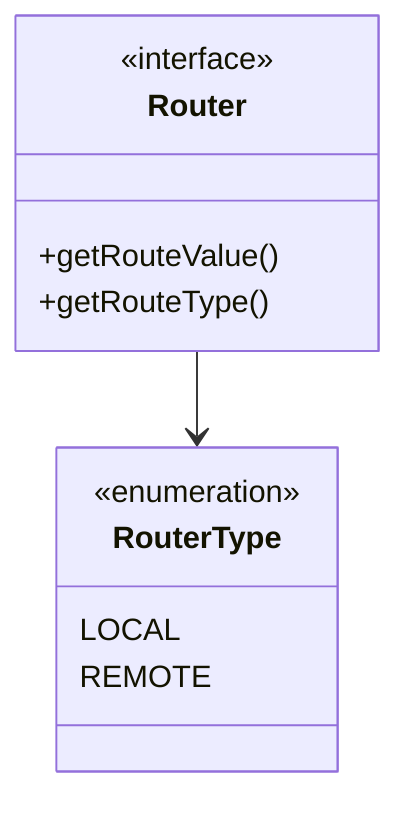
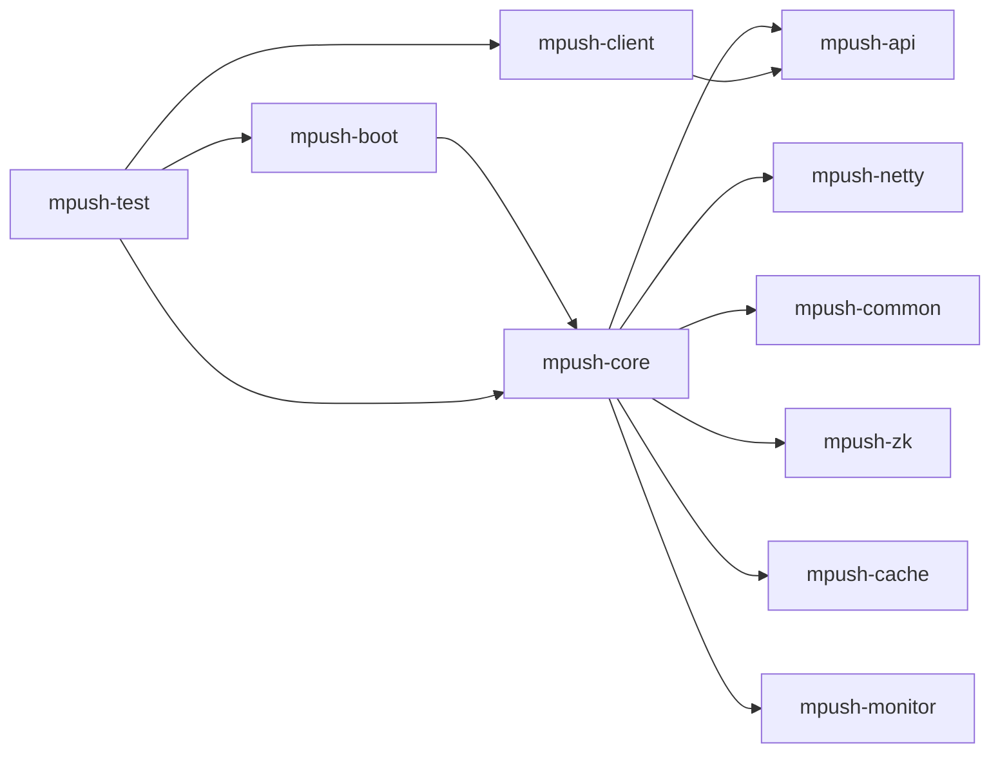

# 项目概述

<cite>
**本文引用的文件**
- [README.md](file://README.md)
- [pom.xml](file://pom.xml)
- [conf/reference.conf](file://conf/reference.conf)
- [mpush-boot/src/main/java/com/mpush/bootstrap/Main.java](file://mpush-boot/src/main/java/com/mpush/bootstrap/Main.java)
- [mpush-api/src/main/java/com/mpush/api/Constants.java](file://mpush-api/src/main/java/com/mpush/api/Constants.java)
- [mpush-api/src/main/java/com/mpush/api/protocol/Packet.java](file://mpush-api/src/main/java/com/mpush/api/protocol/Packet.java)
- [mpush-api/src/main/java/com/mpush/api/message/Message.java](file://mpush-api/src/main/java/com/mpush/api/message/Message.java)
- [mpush-api/src/main/java/com/mpush/api/push/PushMsg.java](file://mpush-api/src/main/java/com/mpush/api/push/PushMsg.java)
- [mpush-api/src/main/java/com/mpush/api/router/Router.java](file://mpush-api/src/main/java/com/mpush/api/router/Router.java)
- [mpush-core/src/main/java/com/mpush/core/MPushServer.java](file://mpush-core/src/main/java/com/mpush/core/MPushServer.java)
- [mpush-netty/src/main/java/com/mpush/netty/server/NettyTCPServer.java](file://mpush-netty/src/main/java/com/mpush/netty/server/NettyTCPServer.java)
- [mpush-zk/src/main/java/com/mpush/zk/ZKServiceRegistryAndDiscovery.java](file://mpush-zk/src/main/java/com/mpush/zk/ZKServiceRegistryAndDiscovery.java)
- [mpush-test/src/main/java/com/mpush/test/sever/ServerTestMain.java](file://mpush-test/src/main/java/com/mpush/test/sever/ServerTestMain.java)
- [mpush-test/src/main/java/com/mpush/test/client/ConnClientTestMain.java](file://mpush-test/src/main/java/com/mpush/test/client/ConnClientTestMain.java)
- [mpush-test/src/main/java/com/mpush/test/push/PushClientTestMain.java](file://mpush-test/src/main/java/com/mpush/test/push/PushClientTestMain.java)
</cite>

## 目录
1. [简介](#简介)
2. [项目结构](#项目结构)
3. [核心组件](#核心组件)
4. [架构总览](#架构总览)
5. [详细组件分析](#详细组件分析)
6. [依赖分析](#依赖分析)
7. [性能考量](#性能考量)
8. [故障排查指南](#故障排查指南)
9. [结论](#结论)
10. [附录](#附录)

## 简介
MPush 是一款高性能、分布式的即时消息推送系统，面向移动端与多终端场景，提供稳定可靠的长连接推送能力。项目以模块化设计为核心，围绕 Netty 网络框架构建 TCP/UDP/WebSocket 多协议接入，结合 Zookeeper 实现服务注册与发现，利用 Redis 提供缓存与消息通道，形成“接入—路由—推送—监控”的完整链路。

- 定位与价值
  - 高并发长连接承载：基于 Netty 的事件驱动模型，提供低延迟、高吞吐的连接管理与消息转发。
  - 多协议支持：统一协议适配 TCP（含 Epoll）、UDP、WebSocket，满足不同网络环境与设备形态需求。
  - 分布式部署：通过 Zookeeper 实现节点注册、健康检查与动态路由，支持横向扩展与弹性伸缩。
  - 可观测性与可运维性：内建监控与线程池管理，支持 JVM 堆栈导出、慢调用统计与 QPS 流控。
  - 易集成：提供 Java 客户端 SDK 与多语言示例，便于快速对接业务系统。

- 主要功能特性
  - 协议与接入：统一的二进制帧协议，支持握手、心跳、绑定、推送、踢人等消息类型；同时提供 WebSocket 接入能力。
  - 路由与会话：本地与远程路由结合，支持用户状态变更、会话复用与快速重连。
  - 推送能力：单播、广播、条件/标签过滤、ACK 确认与回调，支持异步与同步两种模式。
  - 安全与压缩：支持 AES 对称加密与压缩阈值控制，兼顾安全性与带宽效率。
  - 流量控制：全局与广播级 QPS 控制，避免瞬时洪峰冲击系统。

- 技术栈概览
  - 网络框架：Netty 4.x（TCP/UDP/SCTP/UDT 支持）
  - 服务治理：Zookeeper（Curator 客户端）
  - 缓存与消息：Redis（Jedis 客户端）
  - 配置与日志：HOCON 配置、SLF4J/Logback
  - 并发与线程池：自研线程池工厂与线程命名规范
  - 监控：JMX MXBean、线程池与 JVM 指标采集

- 应用场景
  - IM/推送：消息通知、离线消息、群聊/单聊消息分发
  - IoT/边缘：低功耗设备长连接、UDP 广播/组播
  - 游戏/金融：实时对战、行情推送、风控告警
  - 企业服务：工单通知、审批提醒、运营活动推送

- 社区与生态
  - 官方文档与教程、QQ 群交流
  - 多语言客户端（Java、Android、iOS Swift/ObjC）
  - 调度器与个性化推送中心子项目

**章节来源**
- [README.md](file://README.md#L1-L328)

## 项目结构
MPush 采用 Maven 多模块结构，按职责划分为 API、核心、网络、工具、监控、Zookeeper、Redis 缓存、客户端与测试等模块，确保高内聚、低耦合与可替换性。



**图示来源**
- [pom.xml](file://pom.xml#L54-L66)

**章节来源**
- [pom.xml](file://pom.xml#L54-L66)

## 核心组件
- 协议与消息
  - Packet：统一帧协议，包含长度、命令、标志位、会话 ID、校验与负载，支持压缩与加密标记。
  - Message：消息抽象，定义编码/解码与发送行为。
  - PushMsg：推送消息载体，支持通知、透传与混合三类消息类型。
- 服务器与接入
  - MPushServer：服务编排器，负责连接、WebSocket、网关（TCP/UDP）、管理与推送中心的装配与生命周期管理。
  - NettyTCPServer：通用 TCP 服务骨架，支持 NIO/Epoll，内置编解码器与线程池配置。
- 服务治理
  - ZKServiceRegistryAndDiscovery：基于 Zookeeper 的注册与发现实现，支持持久/临时节点、订阅与监听。
- 配置与常量
  - Constants：系统常量与频道前缀等。
  - reference.conf：系统默认配置模板，涵盖网络、安全、Redis、Zookeeper、线程池、流控与监控等。

**章节来源**
- [mpush-api/src/main/java/com/mpush/api/protocol/Packet.java](file://mpush-api/src/main/java/com/mpush/api/protocol/Packet.java#L35-L187)
- [mpush-api/src/main/java/com/mpush/api/message/Message.java](file://mpush-api/src/main/java/com/mpush/api/message/Message.java#L31-L55)
- [mpush-api/src/main/java/com/mpush/api/push/PushMsg.java](file://mpush-api/src/main/java/com/mpush/api/push/PushMsg.java#L34-L70)
- [mpush-core/src/main/java/com/mpush/core/MPushServer.java](file://mpush-core/src/main/java/com/mpush/core/MPushServer.java#L48-L182)
- [mpush-netty/src/main/java/com/mpush/netty/server/NettyTCPServer.java](file://mpush-netty/src/main/java/com/mpush/netty/server/NettyTCPServer.java#L53-L321)
- [mpush-zk/src/main/java/com/mpush/zk/ZKServiceRegistryAndDiscovery.java](file://mpush-zk/src/main/java/com/mpush/zk/ZKServiceRegistryAndDiscovery.java#L39-L119)
- [mpush-api/src/main/java/com/mpush/api/Constants.java](file://mpush-api/src/main/java/com/mpush/api/Constants.java#L30-L43)
- [conf/reference.conf](file://conf/reference.conf#L13-L239)

## 架构总览
MPush 采用“接入—路由—推送—监控”分层架构，核心服务通过 SPI 工厂与配置文件解耦，支持多协议与多部署形态。

```mermaid
graph TB
subgraph "客户端"
C1["Android/iOS/Java 客户端"]
end
subgraph "接入层"
CS["连接服务<br/>TCP/UDP/WebSocket"]
WS["WebSocket 服务"]
GS["网关服务<br/>TCP/UDP"]
end
subgraph "控制与路由"
RC["路由中心"]
SR["服务注册/发现<br/>Zookeeper"]
CM["缓存管理<br/>Redis"]
end
subgraph "消息与推送"
PC["推送中心"]
MQ["消息队列/发布订阅"]
end
subgraph "监控与运维"
MON["监控服务"]
LOG["日志与指标"]
end
C1 --> CS
C1 --> WS
CS --> GS
GS --> RC
RC --> PC
PC --> CM
PC --> MQ
SR <- --> CS
SR <- --> GS
MON --> CS
MON --> GS
MON --> PC
```

**图示来源**
- [mpush-core/src/main/java/com/mpush/core/MPushServer.java](file://mpush-core/src/main/java/com/mpush/core/MPushServer.java#L48-L182)
- [mpush-netty/src/main/java/com/mpush/netty/server/NettyTCPServer.java](file://mpush-netty/src/main/java/com/mpush/netty/server/NettyTCPServer.java#L53-L321)
- [mpush-zk/src/main/java/com/mpush/zk/ZKServiceRegistryAndDiscovery.java](file://mpush-zk/src/main/java/com/mpush/zk/ZKServiceRegistryAndDiscovery.java#L39-L119)

## 详细组件分析

### 组件一：MPushServer（服务编排）
- 职责
  - 组装并启动连接服务、WebSocket 服务、网关（TCP/UDP）、管理服务与推送中心。
  - 提供服务发现、注册、缓存与 MQ 客户端的 SPI 创建入口。
- 关键点
  - 条件启动：根据配置选择 TCP 网关或 UDP 网关。
  - 事件总线：初始化监控线程池并创建事件总线。
  - HTTP 客户端：延迟初始化，复用 Netty HTTP 客户端。



**图示来源**
- [mpush-core/src/main/java/com/mpush/core/MPushServer.java](file://mpush-core/src/main/java/com/mpush/core/MPushServer.java#L48-L182)

**章节来源**
- [mpush-core/src/main/java/com/mpush/core/MPushServer.java](file://mpush-core/src/main/java/com/mpush/core/MPushServer.java#L48-L182)

### 组件二：NettyTCPServer（网络接入骨架）
- 职责
  - 封装 Netty TCP 服务启动流程，支持 NIO/Epoll，配置编解码器与线程池。
- 关键点
  - 状态机：Created → Initialized → Starting → Started → Shutdown。
  - 线程模型：boss/worker 两层 Reactor，可配置 IO 比例与线程数量。
  - 管道：decoder → encoder → handler，支持心跳与业务处理器注入。



**图示来源**
- [mpush-netty/src/main/java/com/mpush/netty/server/NettyTCPServer.java](file://mpush-netty/src/main/java/com/mpush/netty/server/NettyTCPServer.java#L104-L185)

**章节来源**
- [mpush-netty/src/main/java/com/mpush/netty/server/NettyTCPServer.java](file://mpush-netty/src/main/java/com/mpush/netty/server/NettyTCPServer.java#L53-L321)

### 组件三：ZKServiceRegistryAndDiscovery（服务注册与发现）
- 职责
  - 基于 Zookeeper 的服务注册、注销、查询与订阅。
- 关键点
  - 支持持久/临时节点，自动感知节点变化。
  - 订阅路径监听，回调 ServiceListener。



**图示来源**
- [mpush-zk/src/main/java/com/mpush/zk/ZKServiceRegistryAndDiscovery.java](file://mpush-zk/src/main/java/com/mpush/zk/ZKServiceRegistryAndDiscovery.java#L78-L112)

**章节来源**
- [mpush-zk/src/main/java/com/mpush/zk/ZKServiceRegistryAndDiscovery.java](file://mpush-zk/src/main/java/com/mpush/zk/ZKServiceRegistryAndDiscovery.java#L39-L119)

### 组件四：协议与消息（Packet/Message/PushMsg）
- Packet：统一帧协议，支持压缩、加密、业务 ACK、心跳等标志位，定义头部与负载读写。
- Message：消息抽象，定义解码/编码与发送（含原始发送）。
- PushMsg：推送消息载体，区分通知、透传与混合三类消息类型。



**图示来源**
- [mpush-api/src/main/java/com/mpush/api/protocol/Packet.java](file://mpush-api/src/main/java/com/mpush/api/protocol/Packet.java#L141-L169)
- [mpush-api/src/main/java/com/mpush/api/message/Message.java](file://mpush-api/src/main/java/com/mpush/api/message/Message.java#L31-L55)
- [mpush-api/src/main/java/com/mpush/api/push/PushMsg.java](file://mpush-api/src/main/java/com/mpush/api/push/PushMsg.java#L34-L70)

**章节来源**
- [mpush-api/src/main/java/com/mpush/api/protocol/Packet.java](file://mpush-api/src/main/java/com/mpush/api/protocol/Packet.java#L35-L187)
- [mpush-api/src/main/java/com/mpush/api/message/Message.java](file://mpush-api/src/main/java/com/mpush/api/message/Message.java#L31-L55)
- [mpush-api/src/main/java/com/mpush/api/push/PushMsg.java](file://mpush-api/src/main/java/com/mpush/api/push/PushMsg.java#L34-L70)

### 组件五：路由与会话（Router/会话复用）
- Router：路由接口，区分本地与远程路由类型，用于定位目标节点。
- 会话复用：ReusableSessionManager 提供快速重连与会话恢复能力。



**图示来源**
- [mpush-api/src/main/java/com/mpush/api/router/Router.java](file://mpush-api/src/main/java/com/mpush/api/router/Router.java#L27-L37)

**章节来源**
- [mpush-api/src/main/java/com/mpush/api/router/Router.java](file://mpush-api/src/main/java/com/mpush/api/router/Router.java#L27-L37)

## 依赖分析
- 模块间依赖
  - mpush-boot 依赖 mpush-core，负责启动与生命周期管理。
  - mpush-core 依赖 mpush-api、mpush-netty、mpush-common、mpush-zk、mpush-cache、mpush-monitor。
  - mpush-client 依赖 mpush-api，提供客户端接入与推送能力。
  - mpush-test 依赖各模块，提供端到端测试入口。
- 外部依赖
  - Netty 4.x、Curator、Jedis、SLF4J/Logback、HOCON 配置、Guava、Fastjson 等。



**图示来源**
- [pom.xml](file://pom.xml#L54-L66)

**章节来源**
- [pom.xml](file://pom.xml#L54-L66)

## 性能考量
- 网络性能
  - Epoll/NIO 选择：根据系统能力自动选择 Epoll，提升高并发下的连接处理能力。
  - 线程模型：boss/worker 两层 Reactor，可调 IO 比例，降低 CPU 切换成本。
  - 缓冲区与内存池：启用 Netty PooledByteBufAllocator，减少 GC 压力。
- 业务性能
  - 压缩与加密：按阈值启用压缩与 AES 加密，平衡带宽与安全。
  - 流控策略：全局与广播级 QPS 控制，避免洪泛。
  - 异步推送：推送中心与 MQ 分发解耦，支持批量与限速。
- 可观测性
  - JMX/MXBean：暴露推送中心与服务器指标，便于线上诊断。
  - 慢调用与堆栈：可配置慢调用阈值与周期性堆栈导出。

**章节来源**
- [mpush-netty/src/main/java/com/mpush/netty/server/NettyTCPServer.java](file://mpush-netty/src/main/java/com/mpush/netty/server/NettyTCPServer.java#L230-L241)
- [conf/reference.conf](file://conf/reference.conf#L207-L222)

## 故障排查指南
- 启动与停止
  - 启动入口：Main.main → ServerLauncher，添加 JVM 关闭钩子保证优雅停机。
  - 停止顺序：先停止接收（boss），再停止工作（worker），避免资源泄露。
- 配置问题
  - mpush.conf 覆盖 reference.conf，重点检查 Zookeeper 地址、Redis 节点、端口与线程池参数。
- 网络问题
  - TCP/UDP 端口占用、防火墙策略、Epoll 可用性（Linux 环境）。
- 推送异常
  - 检查路由中心与服务发现是否可用，确认目标节点存活。
  - 查看监控日志与慢调用统计，定位热点与瓶颈。
- 客户端联调
  - 使用 mpush-test 中的 ServerTestMain、ConnClientTestMain、PushClientTestMain 快速验证链路。

**章节来源**
- [mpush-boot/src/main/java/com/mpush/bootstrap/Main.java](file://mpush-boot/src/main/java/com/mpush/bootstrap/Main.java#L24-L63)
- [mpush-netty/src/main/java/com/mpush/netty/server/NettyTCPServer.java](file://mpush-netty/src/main/java/com/mpush/netty/server/NettyTCPServer.java#L87-L101)
- [conf/reference.conf](file://conf/reference.conf#L103-L325)
- [mpush-test/src/main/java/com/mpush/test/sever/ServerTestMain.java](file://mpush-test/src/main/java/com/mpush/test/sever/ServerTestMain.java#L34-L48)
- [mpush-test/src/main/java/com/mpush/test/client/ConnClientTestMain.java](file://mpush-test/src/main/java/com/mpush/test/client/ConnClientTestMain.java#L71-L116)
- [mpush-test/src/main/java/com/mpush/test/push/PushClientTestMain.java](file://mpush-test/src/main/java/com/mpush/test/push/PushClientTestMain.java#L39-L76)

## 结论
MPush 以 Netty 为核心，结合 Zookeeper 与 Redis，构建了高可用、可扩展的分布式推送平台。其模块化设计与 SPI 扩展机制，使得协议、路由、缓存与消息通道均可灵活替换。通过完善的监控与流控策略，能够在高并发场景下保持稳定与高效。对于初学者，建议从测试用例入手，逐步理解接入、路由与推送链路；对于资深开发者，可基于 SPI 与配置体系进行深度定制与优化。

## 附录
- 入门指引
  - 准备：安装 JDK 1.8+、Zookeeper、Redis。
  - 配置：参考 reference.conf，覆盖 mpush.conf，设置端口、ZK 与 Redis。
  - 启动：使用 mpush-boot 启动服务，或通过脚本启动。
  - 联调：使用 mpush-test 中的测试主类模拟服务端、客户端与推送。
- 实际使用案例
  - 长连接服务：启动连接服务与 WebSocket 服务，验证握手与心跳。
  - 推送链路：通过 PushClientTestMain 构造 PushMsg，设置 AckModel 与回调，观察结果。
  - 客户端接入：使用 ConnClientTestMain 构造 ClientConfig，连接任一接入节点，观察统计信息。

**章节来源**
- [README.md](file://README.md#L22-L87)
- [conf/reference.conf](file://conf/reference.conf#L103-L325)
- [mpush-test/src/main/java/com/mpush/test/sever/ServerTestMain.java](file://mpush-test/src/main/java/com/mpush/test/sever/ServerTestMain.java#L34-L48)
- [mpush-test/src/main/java/com/mpush/test/client/ConnClientTestMain.java](file://mpush-test/src/main/java/com/mpush/test/client/ConnClientTestMain.java#L71-L116)
- [mpush-test/src/main/java/com/mpush/test/push/PushClientTestMain.java](file://mpush-test/src/main/java/com/mpush/test/push/PushClientTestMain.java#L39-L76)