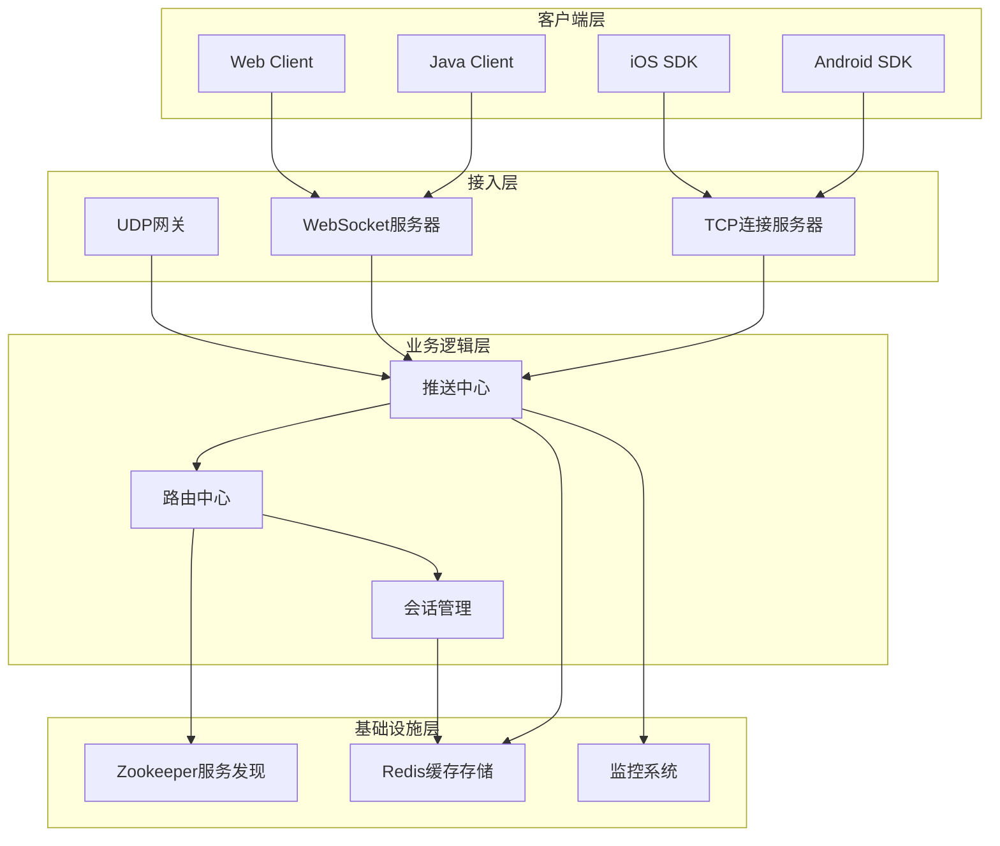
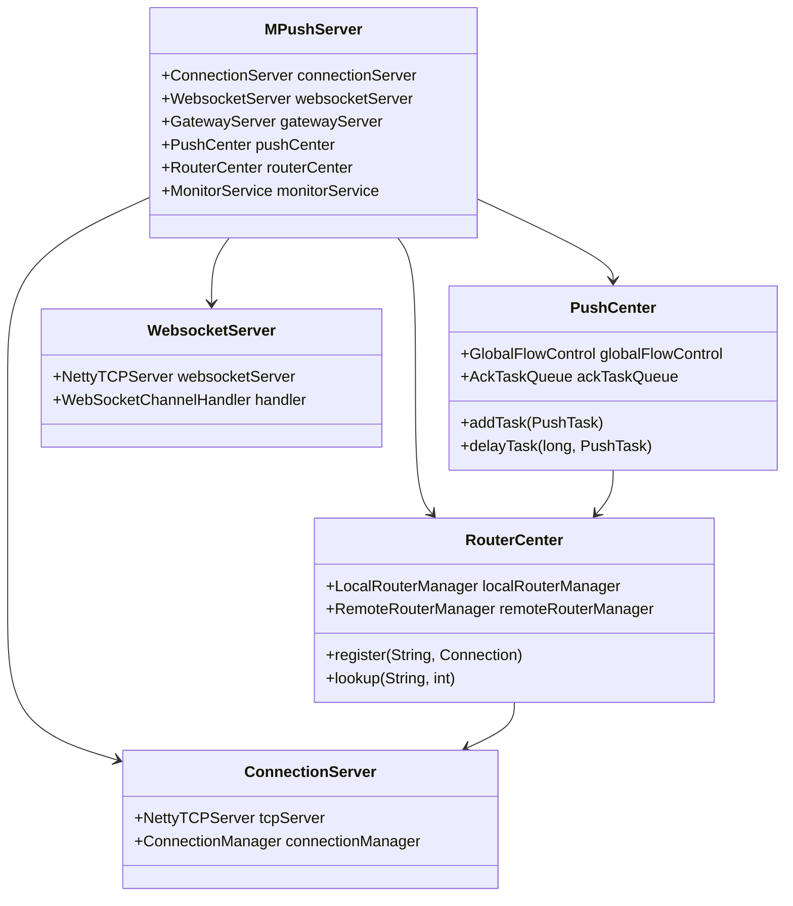
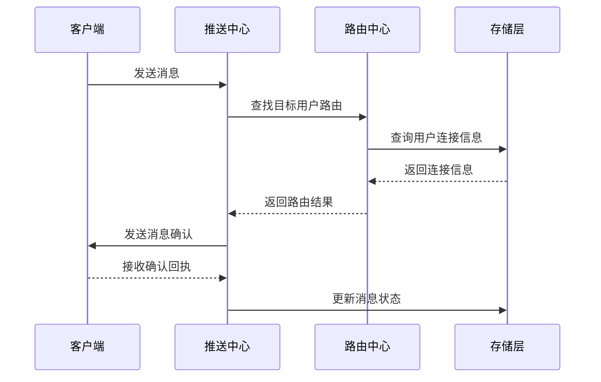
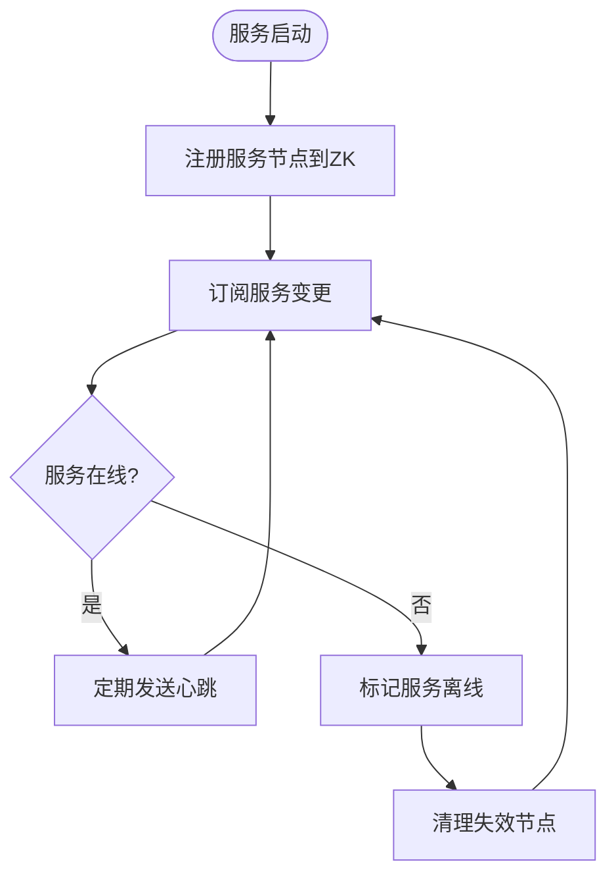
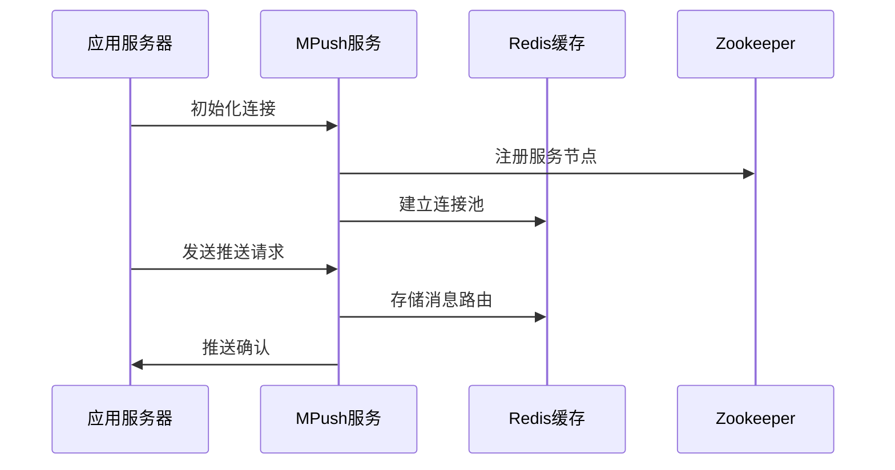

# 项目简介

<cite>
**本文档引用的文件**
- [README.md](file://README.md)
- [pom.xml](file://pom.xml)
- [mpush-api/src/main/java/com/mpush/api/Constants.java](file://mpush-api/src/main/java/com/mpush/api/Constants.java)
- [mpush-boot/src/main/java/com/mpush/bootstrap/Main.java](file://mpush-boot/src/main/java/com/mpush/bootstrap/Main.java)
- [mpush-core/src/main/java/com/mpush/core/MPushServer.java](file://mpush-core/src/main/java/com/mpush/core/MPushServer.java)
- [mpush-api/src/main/java/com/mpush/api/protocol/Command.java](file://mpush-api/src/main/java/com/mpush/api/protocol/Command.java)
- [mpush-common/src/main/java/com/mpush/common/security/CipherBox.java](file://mpush-common/src/main/java/com/mpush/common/security/CipherBox.java)
- [mpush-core/src/main/java/com/mpush/core/push/PushCenter.java](file://mpush-core/src/main/java/com/mpush/core/push/PushCenter.java)
- [mpush-netty/src/main/java/com/mpush/netty/server/NettyTCPServer.java](file://mpush-netty/src/main/java/com/mpush/netty/server/NettyTCPServer.java)
- [mpush-netty/src/main/java/com/mpush/netty/udp/NettyUDPConnector.java](file://mpush-netty/src/main/java/com/mpush/netty/udp/NettyUDPConnector.java)
- [mpush-api/src/main/java/com/mpush/api/router/Router.java](file://mpush-api/src/main/java/com/mpush/api/router/Router.java)
- [mpush-core/src/main/java/com/mpush/core/router/RouterCenter.java](file://mpush-core/src/main/java/com/mpush/core/router/RouterCenter.java)
- [mpush-zk/src/main/java/com/mpush/zk/ZKServiceRegistryAndDiscovery.java](file://mpush-zk/src/main/java/com/mpush/zk/ZKServiceRegistryAndDiscovery.java)
- [mpush-cache/src/main/java/com/mpush/cache/redis/manager/RedisManager.java](file://mpush-cache/src/main/java/com/mpush/cache/redis/manager/RedisManager.java)
</cite>

## 目录
1. [项目概述](#项目概述)
2. [核心定位与价值主张](#核心定位与价值主张)
3. [技术架构概览](#技术架构概览)
4. [核心功能特性](#核心功能特性)
5. [多协议支持](#多协议支持)
6. [分布式架构设计](#分布式架构设计)
7. [高并发处理能力](#高并发处理能力)
8. [安全加密机制](#安全加密机制)
9. [应用场景](#应用场景)
10. [版本信息与许可证](#版本信息与许可证)
11. [社区生态](#社区生态)
12. [部署与集成](#部署与集成)

## 项目概述

MPush是一个高性能分布式消息推送系统，专注于为现代应用提供实时、可靠的消息推送服务。该项目基于Netty网络框架构建，采用模块化设计，支持多种传输协议和部署模式，能够满足从个人开发者到大型企业级应用的各种需求。

### 项目背景与发展历程

MPush项目起源于对高性能消息推送系统的深入研究和实践，经过多个版本的迭代优化，现已发展成为一套成熟的分布式消息推送解决方案。项目采用Apache 2.0许可证开源，得到了社区的广泛支持和贡献。

**章节来源**
- [README.md](file://README.md#L1-L328)
- [pom.xml](file://pom.xml#L1-L52)

## 核心定位与价值主张

### 核心定位

MPush致力于成为企业级实时消息推送的首选解决方案，提供以下核心价值：

- **高性能**：基于Netty异步事件驱动架构，提供毫秒级延迟的消息传递
- **高可用**：分布式架构设计，支持水平扩展和故障自动切换
- **易集成**：提供丰富的客户端SDK和标准化的API接口
- **多协议支持**：同时支持TCP、UDP、WebSocket等多种传输协议
- **安全可靠**：内置完善的加密机制和安全防护措施

### 技术优势

1. **异步非阻塞架构**：利用Netty的事件驱动模型，实现高并发处理能力
2. **模块化设计**：清晰的模块划分，便于维护和扩展
3. **灵活的部署模式**：支持单机部署和分布式集群部署
4. **完善的监控体系**：内置JMX监控和性能统计功能
5. **丰富的扩展接口**：通过SPI机制支持插件化扩展

## 技术架构概览

### 整体架构设计



**图表来源**
- [mpush-core/src/main/java/com/mpush/core/MPushServer.java](file://mpush-core/src/main/java/com/mpush/core/MPushServer.java#L48-L96)
- [mpush-netty/src/main/java/com/mpush/netty/server/NettyTCPServer.java](file://mpush-netty/src/main/java/com/mpush/netty/server/NettyTCPServer.java#L53-L113)
- [mpush-netty/src/main/java/com/mpush/netty/udp/NettyUDPConnector.java](file://mpush-netty/src/main/java/com/mpush/netty/udp/NettyUDPConnector.java#L49-L70)

### 核心组件关系



**图表来源**
- [mpush-core/src/main/java/com/mpush/core/MPushServer.java](file://mpush-core/src/main/java/com/mpush/core/MPushServer.java#L48-L181)
- [mpush-core/src/main/java/com/mpush/core/push/PushCenter.java](file://mpush-core/src/main/java/com/mpush/core/push/PushCenter.java#L49-L182)
- [mpush-core/src/main/java/com/mpush/core/router/RouterCenter.java](file://mpush-core/src/main/java/com/mpush/core/router/RouterCenter.java#L40-L134)

## 核心功能特性

### 即时消息推送

MPush提供高效的消息推送能力，支持单播、广播和组播等多种推送模式：

- **单播推送**：针对特定用户的精准消息推送
- **广播推送**：向所有在线用户发送消息
- **组播推送**：向特定标签或分组的用户群发送消息

### 用户状态管理

系统提供完整的用户状态管理机制：

- **在线状态跟踪**：实时监控用户在线状态
- **会话管理**：支持会话持久化和恢复
- **用户绑定**：支持多设备用户绑定管理

### 消息确认机制



**图表来源**
- [mpush-core/src/main/java/com/mpush/core/push/PushCenter.java](file://mpush-core/src/main/java/com/mpush/core/push/PushCenter.java#L72-L82)
- [mpush-core/src/main/java/com/mpush/core/router/RouterCenter.java](file://mpush-core/src/main/java/com/mpush/core/router/RouterCenter.java#L112-L117)

**章节来源**
- [mpush-api/src/main/java/com/mpush/api/protocol/Command.java](file://mpush-api/src/main/java/com/mpush/api/protocol/Command.java#L27-L52)
- [mpush-core/src/main/java/com/mpush/core/push/PushCenter.java](file://mpush-core/src/main/java/com/mpush/core/push/PushCenter.java#L49-L182)

## 多协议支持

### TCP协议支持

MPush基于Netty实现高性能的TCP连接服务器：

- **异步事件驱动**：基于Netty的EventLoop模型
- **内存池优化**：使用PooledByteBufAllocator减少内存分配
- **Epoll支持**：Linux环境下使用Epoll提高性能
- **灵活的线程模型**：支持Boss和Worker线程分离

### UDP协议支持

UDP网关提供低延迟的消息传输能力：

- **无连接通信**：减少握手开销
- **组播支持**：支持多播消息广播
- **自定义线程池**：针对UDP特点优化的线程模型

### WebSocket协议支持

WebSocket服务器提供浏览器友好的消息推送：

- **标准协议支持**：完全兼容WebSocket标准
- **跨平台兼容**：支持各种浏览器和移动设备
- **自动降级**：支持HTTP长轮询降级方案

**章节来源**
- [mpush-netty/src/main/java/com/mpush/netty/server/NettyTCPServer.java](file://mpush-netty/src/main/java/com/mpush/netty/server/NettyTCPServer.java#L104-L113)
- [mpush-netty/src/main/java/com/mpush/netty/udp/NettyUDPConnector.java](file://mpush-netty/src/main/java/com/mpush/netty/udp/NettyUDPConnector.java#L49-L70)

## 分布式架构设计

### 服务发现与注册

MPush采用Zookeeper实现服务发现和注册：



**图表来源**
- [mpush-zk/src/main/java/com/mpush/zk/ZKServiceRegistryAndDiscovery.java](file://mpush-zk/src/main/java/com/mpush/zk/ZKServiceRegistryAndDiscovery.java#L78-L91)

### 路由管理

系统提供两级路由管理机制：

- **本地路由**：管理当前节点的用户连接
- **远程路由**：管理其他节点的用户连接信息
- **路由切换**：支持用户连接的动态迁移

**章节来源**
- [mpush-api/src/main/java/com/mpush/api/router/Router.java](file://mpush-api/src/main/java/com/mpush/api/router/Router.java#L27-L37)
- [mpush-core/src/main/java/com/mpush/core/router/RouterCenter.java](file://mpush-core/src/main/java/com/mpush/core/router/RouterCenter.java#L40-L134)

## 高并发处理能力

### 线程池优化

MPush采用多级线程池架构：

- **连接线程池**：处理新连接建立
- **业务线程池**：处理消息转发和业务逻辑
- **推送线程池**：专门处理消息推送任务
- **监控线程池**：负责系统监控和统计

### 流量控制

系统内置多层次的流量控制机制：

- **全局流控**：限制整体消息推送速率
- **广播流控**：控制广播消息的推送频率
- **Redis流控**：基于Redis的分布式流控
- **精确流控**：针对特定场景的精细化控制

**章节来源**
- [mpush-core/src/main/java/com/mpush/core/push/PushCenter.java](file://mpush-core/src/main/java/com/mpush/core/push/PushCenter.java#L52-L54)
- [mpush-common/src/main/java/com/mpush/common/qps/GlobalFlowControl.java](file://mpush-common/src/main/java/com/mpush/common/qps/GlobalFlowControl.java)

## 安全加密机制

### 加密算法支持

MPush提供完整的加密机制：

- **RSA非对称加密**：用于密钥交换和身份认证
- **AES对称加密**：用于消息内容加密
- **随机密钥生成**：每次会话生成独立的加密密钥
- **密钥混合算法**：结合客户端和服务端密钥生成会话密钥

### 安全特性


**图表来源**
- [mpush-common/src/main/java/com/mpush/common/security/CipherBox.java](file://mpush-common/src/main/java/com/mpush/common/security/CipherBox.java#L34-L92)

**章节来源**
- [mpush-common/src/main/java/com/mpush/common/security/CipherBox.java](file://mpush-common/src/main/java/com/mpush/common/security/CipherBox.java#L34-L92)

## 应用场景

### 移动应用推送

MPush特别适合移动应用的消息推送需求：

- **即时通讯**：聊天消息、语音通话邀请等
- **社交网络**：点赞、评论、关注通知
- **游戏应用**：游戏匹配、排行榜更新
- **企业应用**：工作通知、任务提醒

### 物联网应用

支持大规模物联网设备的消息推送：

- **设备状态监控**：传感器数据上报
- **远程控制**：设备远程开关控制
- **告警通知**：异常状态及时告警

### 实时数据推送

适用于需要实时数据更新的场景：

- **股票行情**：实时股价更新
- **直播互动**：弹幕、礼物等互动消息
- **协作工具**：文档实时编辑同步

## 版本信息与许可证

### 版本信息

- **当前版本**：0.8.1
- **开发语言**：Java 8+
- **核心框架**：Netty 4.1.25.Final
- **构建工具**：Maven
- **许可证**：Apache License 2.0

### 项目组织

- **项目名称**：MPush消息推送系统
- **组织**：MPusher, Inc.
- **开发者**：夜色 (ohun@live.cn)
- **官方网站**：https://mpusher.github.io
- **文档中心**：http://mpush.mydoc.io

**章节来源**
- [pom.xml](file://pom.xml#L16-L52)

## 社区生态

### 开源社区

MPush拥有活跃的开源社区：

- **GitHub仓库**：https://github.com/mpusher/mpush
- **QQ群**：114583699
- **问题反馈**：GitHub Issues
- **贡献指南**：欢迎PR和Issue提交

### 生态系统

```mermaid
graph TB
subgraph "核心项目"
A[mpush] -- 主项目
B[mpush-client-java] -- Java客户端
C[mpush-android] -- Android SDK
D[mpush-client-swift] -- iOS Swift SDK
E[mpush-client-oc] -- iOS OC SDK
end
subgraph "相关项目"
F[alloc] -- 调度器
G[mpns] -- 个性化推送中心
end
A --> B
A --> C
A --> D
A --> E
A --> F
A --> G
```

**图表来源**
- [README.md](file://README.md#L7-L17)

### 用户群体

MPush已应用于多个行业领域：

- **互联网公司**：社交、电商、游戏等
- **金融行业**：支付、理财、风控
- **教育行业**：在线课堂、学习管理
- **医疗健康**：预约挂号、报告查询
- **物流快递**：订单跟踪、配送通知

## 部署与集成

### 系统要求

- **JDK版本**：1.8及以上
- **操作系统**：Linux、Windows、macOS
- **内存要求**：建议4GB以上
- **磁盘空间**：至少1GB可用空间

### 依赖组件

- **Zookeeper**：服务发现和配置管理
- **Redis**：缓存和消息队列
- **网络环境**：开放必要的端口

### 部署方式

1. **单机部署**：适合开发测试和小规模应用
2. **集群部署**：支持水平扩展和高可用
3. **容器化部署**：支持Docker和Kubernetes

### 集成示例



**图表来源**
- [mpush-boot/src/main/java/com/mpush/bootstrap/Main.java](file://mpush-boot/src/main/java/com/mpush/bootstrap/Main.java#L31-L38)

**章节来源**
- [README.md](file://README.md#L32-L87)